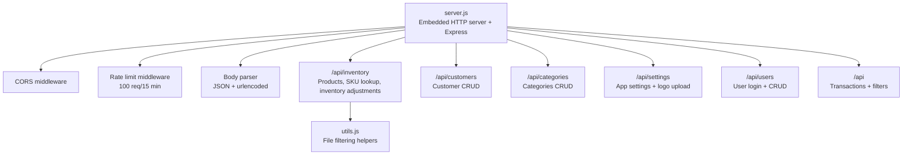
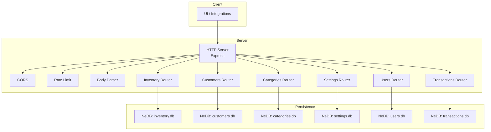
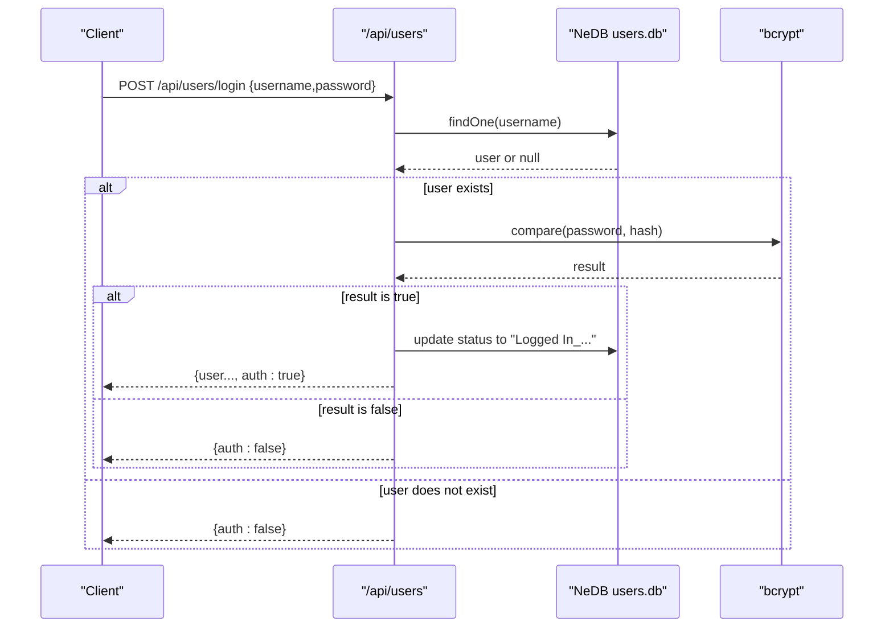
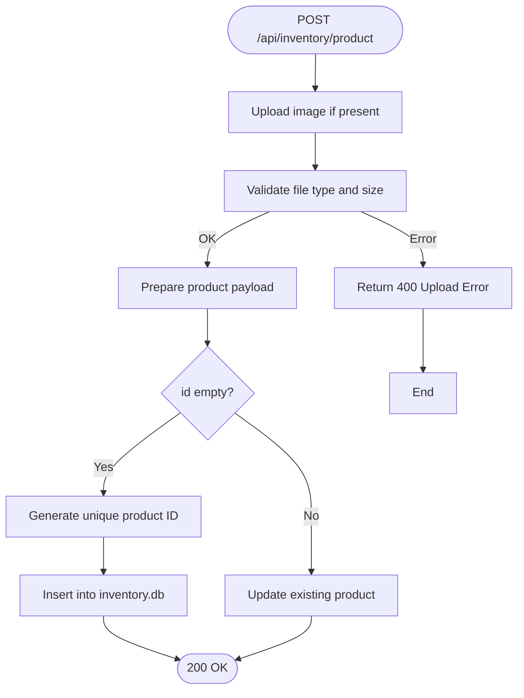
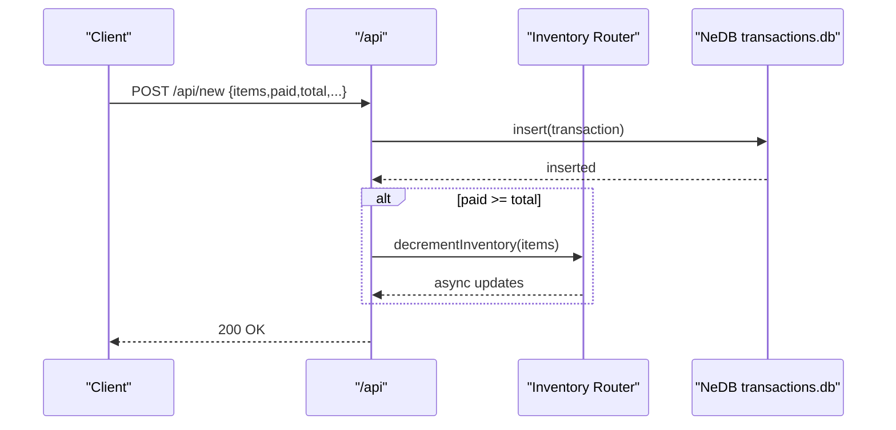
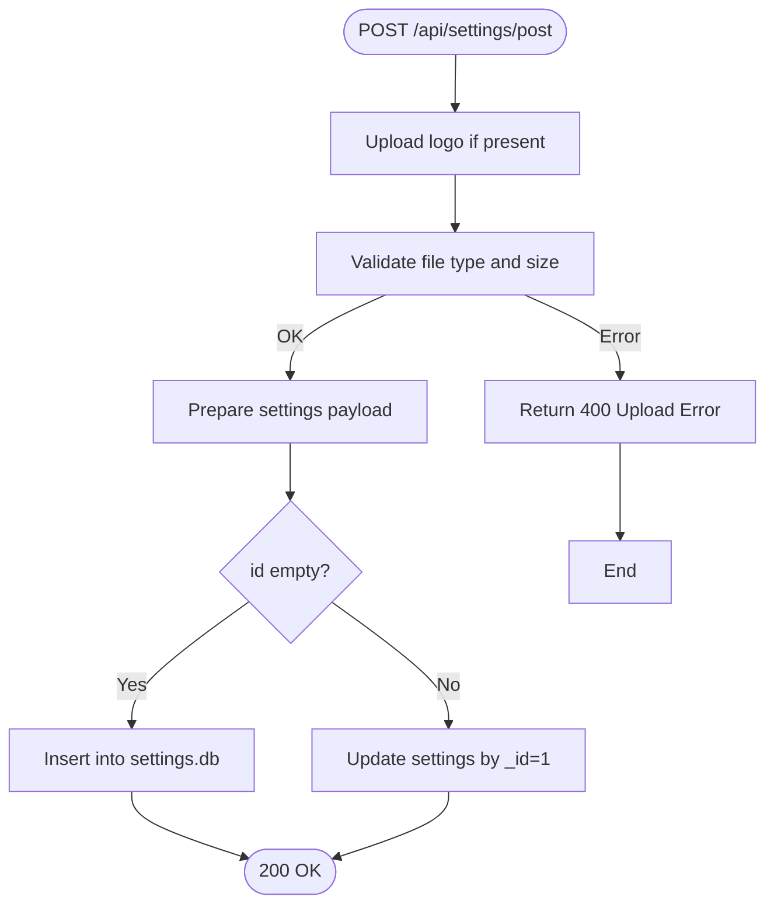
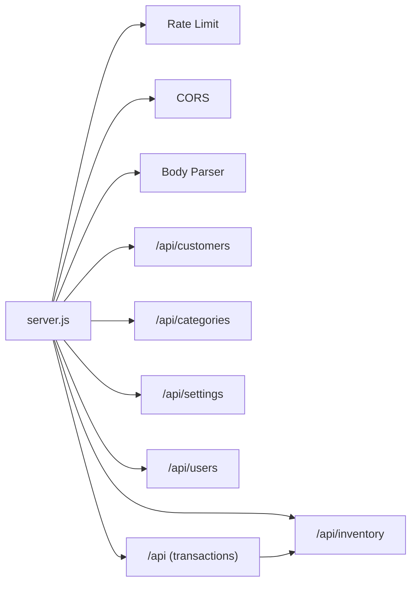

# API Reference

<cite>
**Referenced Files in This Document**
- [server.js](file://server.js)
- [inventory.js](file://api/inventory.js)
- [customers.js](file://api/customers.js)
- [transactions.js](file://api/transactions.js)
- [users.js](file://api/users.js)
- [categories.js](file://api/categories.js)
- [settings.js](file://api/settings.js)
- [utils.js](file://assets/js/utils.js)
- [TECH_STACK.md](file://docs/TECH_STACK.md)
- [PRD.md](file://docs/PRD.md)
- [README.md](file://README.md)
- [package.json](file://package.json)
</cite>

## Table of Contents
1. [Introduction](#introduction)
2. [Project Structure](#project-structure)
3. [Core Components](#core-components)
4. [Architecture Overview](#architecture-overview)
5. [Detailed Component Analysis](#detailed-component-analysis)
6. [Dependency Analysis](#dependency-analysis)
7. [Performance Considerations](#performance-considerations)
8. [Troubleshooting Guide](#troubleshooting-guide)
9. [Conclusion](#conclusion)
10. [Appendices](#appendices)

## Introduction
This document provides comprehensive API documentation for the PharmaSpot POS RESTful endpoints. It covers HTTP methods, URL patterns, request/response schemas, authentication requirements, and error handling across six API modules: inventory management, customer management, transaction processing, user authentication, category management, and system settings. It also documents rate limiting, security considerations, and the API versioning strategy.

The embedded server is built with Node.js and Express and runs locally within the desktop application. APIs are mounted under the /api path and backed by NeDB local databases.

**Section sources**
- [README.md:1-91](file://README.md#L1-L91)
- [PRD.md:31-33](file://docs/PRD.md#L31-L33)
- [TECH_STACK.md:14-33](file://docs/TECH_STACK.md#L14-L33)

## Project Structure
The API is organized into modular routers under the api/ directory, each exposing a set of endpoints grouped by domain. The server initializes middleware, applies CORS, rate limiting, and mounts the routers.

**Diagram sources**
- [server.js:11-34](file://server.js#L11-L34)
- [server.js:40-45](file://server.js#L40-L45)
- [utils.js:76-87](file://assets/js/utils.js#L76-L87)

**Section sources**
- [server.js:1-68](file://server.js#L1-L68)
- [TECH_STACK.md:24-33](file://docs/TECH_STACK.md#L24-L33)

## Core Components
- Embedded HTTP server: Node http + Express, default port 3210 (override via PORT).
- Middleware:
  - Body parser for JSON and urlencoded.
  - CORS enabled for all origins and methods.
  - Rate limiting: 100 requests per 15 minutes per IP/key.
- Routers mounted under /api:
  - /api/inventory
  - /api/customers
  - /api/categories
  - /api/settings
  - /api/users
  - /api (transactions)

Security highlights:
- Password hashing with bcrypt (alias bcryptjs).
- Input sanitization and file type validation.
- Content Security Policy generation for bundled assets.

Versioning:
- API versioning is not explicitly implemented; clients should pin to the app version and expect backward-compatible changes within the same major version.

**Section sources**
- [server.js:11-34](file://server.js#L11-L34)
- [server.js:40-45](file://server.js#L40-L45)
- [TECH_STACK.md:18-22](file://docs/TECH_STACK.md#L18-L22)
- [TECH_STACK.md:43-47](file://docs/TECH_STACK.md#L43-L47)
- [package.json:4-4](file://package.json#L4-L4)

## Architecture Overview
The API follows a layered architecture:
- Presentation: Express routers per module.
- Persistence: NeDB document databases per domain.
- Utilities: Shared helpers for file filtering and CSP.

**Diagram sources**
- [server.js:11-34](file://server.js#L11-L34)
- [server.js:40-45](file://server.js#L40-L45)
- [TECH_STACK.md:35-41](file://docs/TECH_STACK.md#L35-L41)

## Detailed Component Analysis

### Authentication and Authorization
- Endpoint: POST /api/users/login
- Purpose: Authenticate user and update login status.
- Request body:
  - username: string
  - password: string
- Response:
  - On success: user document with auth: true.
  - On failure: { auth: false } or { auth: false, message: "<reason>" }.
- Notes:
  - Passwords are hashed with bcrypt (alias bcryptjs).
  - No bearer tokens or session cookies are used; authentication state is stored in the database.

**Diagram sources**
- [users.js:95-131](file://api/users.js#L95-L131)

**Section sources**
- [users.js:95-131](file://api/users.js#L95-L131)
- [TECH_STACK.md:45-45](file://docs/TECH_STACK.md#L45-L45)

### Inventory Management
Endpoints:
- GET /api/inventory/
  - Description: Welcome message for the Inventory API.
  - Response: String.
- GET /api/inventory/products
  - Description: Retrieve all products.
  - Response: Array of product documents.
- GET /api/inventory/product/:productId
  - Description: Retrieve a product by numeric ID.
  - Path params:
    - productId: number (required).
  - Response: Product document or null.
- POST /api/inventory/product
  - Description: Create or update a product. Supports image upload via multipart/form-data.
  - Form fields:
    - imagename: file (optional; up to 2 MB; allowed types: jpg, jpeg, png, webp).
    - remove: "1" to remove existing image (optional).
    - id: string (empty for new, numeric for update).
    - barcode: string (numeric).
    - expirationDate: string.
    - price: string.
    - category: string.
    - supplier: string (optional).
    - quantity: string (empty treated as 0).
    - name: string.
    - stock: "on" or other (controls stock flag).
    - minStock: string.
    - img: string (fallback image name).
  - Response: 200 on success; JSON error on failure.
- DELETE /api/inventory/product/:productId
  - Description: Delete a product by numeric ID.
  - Path params:
    - productId: number (required).
  - Response: 200 on success; JSON error on failure.
- POST /api/inventory/product/sku
  - Description: Find a product by SKU (barcode).
  - Request body:
    - skuCode: string (numeric barcode).
  - Response: Product document or null.
- Internal helper:
  - app.decrementInventory(products): Decrements product quantities based on transaction items.

**Diagram sources**
- [inventory.js:124-240](file://api/inventory.js#L124-L240)
- [utils.js:76-87](file://assets/js/utils.js#L76-L87)

**Section sources**
- [inventory.js:78-102](file://api/inventory.js#L78-L102)
- [inventory.js:111-115](file://api/inventory.js#L111-L115)
- [inventory.js:89-102](file://api/inventory.js#L89-L102)
- [inventory.js:124-240](file://api/inventory.js#L124-L240)
- [inventory.js:249-266](file://api/inventory.js#L249-L266)
- [inventory.js:276-294](file://api/inventory.js#L276-L294)
- [inventory.js:302-332](file://api/inventory.js#L302-L332)
- [utils.js:76-87](file://assets/js/utils.js#L76-L87)

### Customer Management
Endpoints:
- GET /api/customers/
  - Description: Welcome message for the Customer API.
  - Response: String.
- GET /api/customers/all
  - Description: Retrieve all customers.
  - Response: Array of customer documents.
- GET /api/customers/customer/:customerId
  - Description: Retrieve a customer by ID.
  - Path params:
    - customerId: string (required).
  - Response: Customer document or null.
- POST /api/customers/customer
  - Description: Create a new customer.
  - Request body: Customer document (fields vary by schema).
  - Response: 200 on success; JSON error on failure.
- PUT /api/customers/customer
  - Description: Update an existing customer.
  - Request body: Customer document with _id.
  - Response: 200 on success; JSON error on failure.
- DELETE /api/customers/customer/:customerId
  - Description: Delete a customer by ID.
  - Path params:
    - customerId: string (required).
  - Response: 200 on success; JSON error on failure.

**Section sources**
- [customers.js:36-38](file://api/customers.js#L36-L38)
- [customers.js:69-73](file://api/customers.js#L69-L73)
- [customers.js:47-60](file://api/customers.js#L47-L60)
- [customers.js:82-95](file://api/customers.js#L82-L95)
- [customers.js:130-151](file://api/customers.js#L130-L151)
- [customers.js:104-121](file://api/customers.js#L104-L121)

### Transaction Processing
Endpoints:
- GET /api/
  - Description: Welcome message for the Transactions API.
  - Response: String.
- GET /api/all
  - Description: Retrieve all transactions.
  - Response: Array of transaction documents.
- GET /api/on-hold
  - Description: Retrieve on-hold transactions (status 0 with non-empty reference number).
  - Response: Array of transaction documents.
- GET /api/customer-orders
  - Description: Retrieve customer orders with status 0 and empty reference number.
  - Response: Array of transaction documents.
- GET /api/by-date
  - Description: Filter transactions by date range, user, and status.
  - Query params:
    - start: ISO date string.
    - end: ISO date string.
    - user: number (0 means unspecified).
    - till: number (0 means unspecified).
    - status: number.
  - Response: Array of transaction documents.
- GET /api/:transactionId
  - Description: Retrieve a transaction by ID.
  - Path params:
    - transactionId: string (required).
  - Response: Transaction document or null.
- POST /api/new
  - Description: Create a new transaction.
  - Request body: Transaction document.
  - Side effect: If paid >= total, decrements inventory quantities via Inventory.decrementInventory.
  - Response: 200 on success; JSON error on failure.
- PUT /api/new
  - Description: Update an existing transaction.
  - Request body: Transaction document with _id.
  - Response: 200 on success; JSON error on failure.
- POST /api/delete
  - Description: Delete a transaction.
  - Request body:
    - orderId: string (transaction ID).
  - Response: 200 on success; JSON error on failure.

**Diagram sources**
- [transactions.js:163-181](file://api/transactions.js#L163-L181)
- [inventory.js:302-332](file://api/inventory.js#L302-L332)

**Section sources**
- [transactions.js:35-37](file://api/transactions.js#L35-L37)
- [transactions.js:46-50](file://api/transactions.js#L46-L50)
- [transactions.js:59-66](file://api/transactions.js#L59-L66)
- [transactions.js:75-82](file://api/transactions.js#L75-L82)
- [transactions.js:91-154](file://api/transactions.js#L91-L154)
- [transactions.js:246-250](file://api/transactions.js#L246-L250)
- [transactions.js:163-181](file://api/transactions.js#L163-L181)
- [transactions.js:190-210](file://api/transactions.js#L190-L210)
- [transactions.js:219-237](file://api/transactions.js#L219-L237)

### User Management
Endpoints:
- GET /api/users/
  - Description: Welcome message for the Users API.
  - Response: String.
- GET /api/users/all
  - Description: Retrieve all users.
  - Response: Array of user documents.
- GET /api/users/user/:userId
  - Description: Retrieve a user by numeric ID.
  - Path params:
    - userId: number (required).
  - Response: User document or null.
- GET /api/users/logout/:userId
  - Description: Update user status to logged out.
  - Path params:
    - userId: number (required).
  - Response: 200 on success.
- POST /api/users/post
  - Description: Create or update a user. Hashes password and normalizes permission flags.
  - Request body:
    - id: string ("": new; numeric: update).
    - username: string.
    - fullname: string.
    - password: string (hashed before storage).
    - perm_products, perm_categories, perm_transactions, perm_users, perm_settings: "on" or other (normalized to 1/0).
    - Additional fields as per schema.
  - Response: On create: user document; on update: 200; JSON error on failure.
- GET /api/users/check
  - Description: Initialize default admin user if not exists.
  - Response: 200 on completion; JSON error on failure.

**Section sources**
- [users.js:35-37](file://api/users.js#L35-L37)
- [users.js:140-144](file://api/users.js#L140-L144)
- [users.js:46-59](file://api/users.js#L46-L59)
- [users.js:68-86](file://api/users.js#L68-L86)
- [users.js:179-259](file://api/users.js#L179-L259)
- [users.js:268-311](file://api/users.js#L268-L311)

### Category Management
Endpoints:
- GET /api/categories/
  - Description: Welcome message for the Category API.
  - Response: String.
- GET /api/categories/all
  - Description: Retrieve all categories.
  - Response: Array of category documents.
- POST /api/categories/category
  - Description: Create a new category.
  - Request body: Category document (id auto-generated).
  - Response: 200 on success; JSON error on failure.
- PUT /api/categories/category
  - Description: Update an existing category.
  - Request body: Category document with id.
  - Response: 200 on success; JSON error on failure.
- DELETE /api/categories/category/:categoryId
  - Description: Delete a category by ID.
  - Path params:
    - categoryId: number (required).
  - Response: 200 on success; JSON error on failure.

**Section sources**
- [categories.js:35-37](file://api/categories.js#L35-L37)
- [categories.js:46-50](file://api/categories.js#L46-L50)
- [categories.js:59-72](file://api/categories.js#L59-L72)
- [categories.js:106-124](file://api/categories.js#L106-L124)
- [categories.js:81-97](file://api/categories.js#L81-L97)

### System Settings
Endpoints:
- GET /api/settings/
  - Description: Welcome message for the Settings API.
  - Response: String.
- GET /api/settings/get
  - Description: Retrieve settings.
  - Response: Settings document (singleton with _id=1).
- POST /api/settings/post
  - Description: Create or update settings. Supports logo upload via multipart/form-data.
  - Form fields:
    - imagename: file (optional; up to 2 MB; allowed types: jpg, jpeg, png, webp).
    - remove: "1" to remove existing logo (optional).
    - id: string (empty for new, "1" for update).
    - app, store, address_one, address_two, contact, tax, symbol, percentage, footer: strings.
    - charge_tax, quick_billing: "on" or other (converted to booleans).
  - Response: 200 on success; JSON error on failure.

**Diagram sources**
- [settings.js:90-190](file://api/settings.js#L90-L190)
- [utils.js:76-87](file://assets/js/utils.js#L76-L87)

**Section sources**
- [settings.js:60-62](file://api/settings.js#L60-L62)
- [settings.js:71-80](file://api/settings.js#L71-L80)
- [settings.js:90-190](file://api/settings.js#L90-L190)
- [utils.js:76-87](file://assets/js/utils.js#L76-L87)

## Dependency Analysis
- Server initialization and middleware:
  - Rate limiting, CORS, and body parsing are applied globally.
  - Routers are mounted under /api with specific prefixes.
- Module interdependencies:
  - Transactions router depends on Inventory.decrementInventory to adjust stock after successful payments.
  - Settings and Inventory use file upload utilities and validators.
- Persistence:
  - Each module maintains its own NeDB database file under the application data path.

**Diagram sources**
- [server.js:11-34](file://server.js#L11-L34)
- [server.js:40-45](file://server.js#L40-L45)
- [transactions.js:5](file://api/transactions.js#L5)

**Section sources**
- [server.js:11-34](file://server.js#L11-L34)
- [server.js:40-45](file://server.js#L40-L45)
- [transactions.js:5](file://api/transactions.js#L5)

## Performance Considerations
- Rate limiting: 100 requests per 15 minutes per IP/key helps protect the local server from abuse.
- Database operations: NeDB is embedded and suitable for local deployments; keep payloads minimal and avoid excessive polling.
- Image uploads: File size limits and MIME checks reduce bandwidth and storage overhead.
- Recommendations:
  - Batch operations where possible.
  - Use pagination for large collections.
  - Cache frequently accessed resources on the client.

**Section sources**
- [server.js:11-14](file://server.js#L11-L14)
- [settings.js:35-39](file://api/settings.js#L35-L39)
- [inventory.js:35-39](file://api/inventory.js#L35-L39)

## Troubleshooting Guide
Common errors and resolutions:
- 400 Upload Error (Settings/Inventory):
  - Cause: Invalid file type or size exceeded.
  - Resolution: Ensure image type is jpg/jpeg/png/webp and size ≤ 2 MB.
- 500 Internal Server Error:
  - Cause: Database write failures, unexpected exceptions.
  - Resolution: Retry operation; check server logs; verify database integrity.
- Authentication failures:
  - Cause: Incorrect username/password or user not found.
  - Resolution: Verify credentials; ensure default admin exists or create a user account.
- CORS issues:
  - Cause: Cross-origin requests blocked.
  - Resolution: Access APIs from localhost or configure appropriate origin headers.

Security and validation:
- Input sanitization and validators are used across modules.
- Passwords are hashed; bcryptjs is used for compatibility.

**Section sources**
- [settings.js:94-106](file://api/settings.js#L94-L106)
- [inventory.js:128-140](file://api/inventory.js#L128-L140)
- [users.js:100-131](file://api/users.js#L100-L131)
- [server.js:22-34](file://server.js#L22-L34)
- [TECH_STACK.md:45-47](file://docs/TECH_STACK.md#L45-L47)

## Conclusion
The PharmaSpot POS REST API provides a focused set of endpoints for inventory, customers, transactions, users, categories, and settings. It is designed for local deployment within the Electron application, with embedded middleware for CORS, rate limiting, and input validation. Clients should adhere to the documented schemas, handle error responses, and implement retry/backoff strategies. For production, enforce strong credentials, monitor rate limits, and back up NeDB files regularly.

[No sources needed since this section summarizes without analyzing specific files]

## Appendices

### API Base URL and Port
- Base URL: http://localhost:3210
- Override port via environment variable PORT.

**Section sources**
- [server.js:10](file://server.js#L10)
- [TECH_STACK.md:18-20](file://docs/TECH_STACK.md#L18-L20)

### Practical Examples
- Authenticate:
  - POST http://localhost:3210/api/users/login
  - Body: { username: "...", password: "..." }
- Create a product:
  - POST http://localhost:3210/api/inventory/product
  - Body: multipart/form-data with fields described above.
- Retrieve transactions by date range:
  - GET http://localhost:3210/api/by-date?start=YYYY-MM-DD&end=YYYY-MM-DD&status=...
- Update settings:
  - POST http://localhost:3210/api/settings/post
  - Body: multipart/form-data with settings fields.

**Section sources**
- [users.js:95-131](file://api/users.js#L95-L131)
- [inventory.js:124-240](file://api/inventory.js#L124-L240)
- [transactions.js:91-154](file://api/transactions.js#L91-L154)
- [settings.js:90-190](file://api/settings.js#L90-L190)

### Client Implementation Guidelines
- Use JSON for request/response bodies where applicable.
- For file uploads, send multipart/form-data with the correct field names.
- Implement exponential backoff for retries on 5xx errors.
- Respect rate limits; batch requests when possible.
- Validate responses and handle error objects with error and message fields.

**Section sources**
- [server.js:11-14](file://server.js#L11-L14)
- [settings.js:90-190](file://api/settings.js#L90-L190)
- [inventory.js:124-240](file://api/inventory.js#L124-L240)

### Security Considerations
- Transport: APIs run locally; ensure local network security.
- Authentication: Use the login endpoint; do not expose credentials.
- Input validation: Rely on server-side sanitization and validation.
- File uploads: Enforce allowed types and sizes; sanitize filenames.
- CSP: The application generates CSP headers for bundled assets; ensure clients connect from allowed origins.

**Section sources**
- [server.js:22-34](file://server.js#L22-L34)
- [TECH_STACK.md:45-47](file://docs/TECH_STACK.md#L45-L47)
- [utils.js:91-99](file://assets/js/utils.js#L91-L99)

### API Versioning Strategy
- No explicit API versioning is implemented.
- Clients should pin to the application version and expect backward-compatible changes within the same major version.

**Section sources**
- [package.json:4](file://package.json#L4)
- [TECH_STACK.md:61-63](file://docs/TECH_STACK.md#L61-L63)