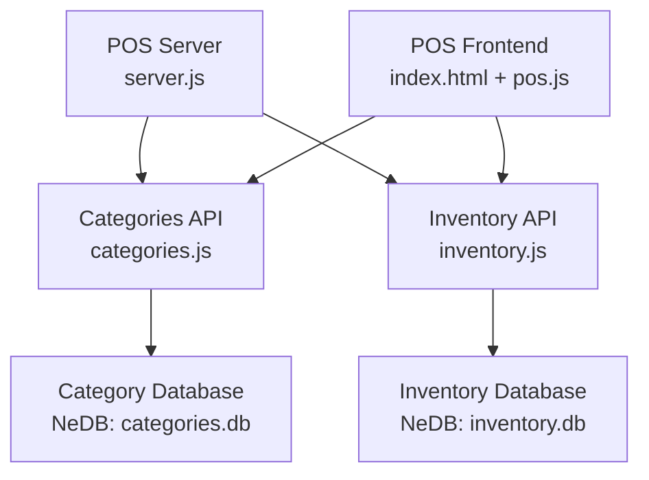
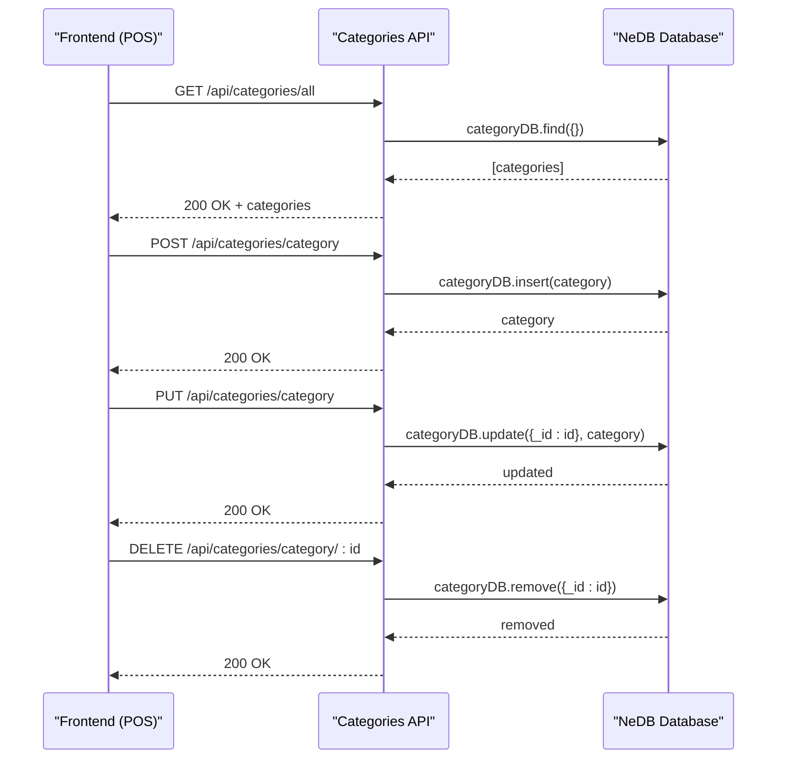
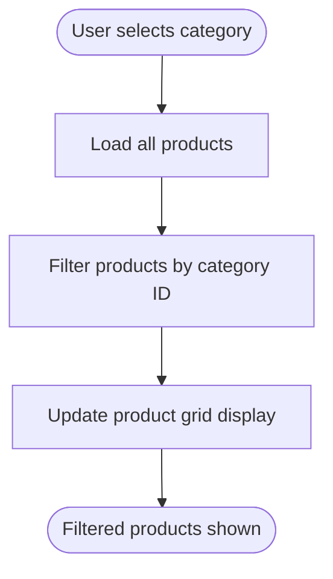
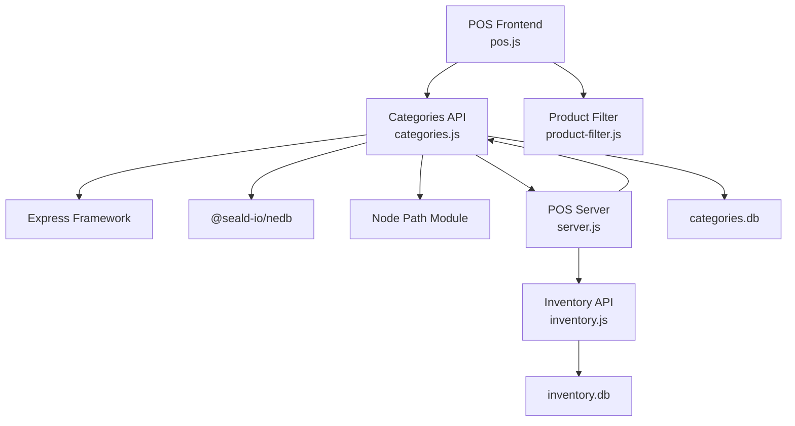

# Category Management API

<cite>
**Referenced Files in This Document**
- [categories.js](file://api/categories.js)
- [server.js](file://server.js)
- [inventory.js](file://api/inventory.js)
- [pos.js](file://assets/js/pos.js)
- [product-filter.js](file://assets/js/product-filter.js)
- [index.html](file://index.html)
</cite>

## Table of Contents
1. [Introduction](#introduction)
2. [Project Structure](#project-structure)
3. [Core Components](#core-components)
4. [Architecture Overview](#architecture-overview)
5. [Detailed Component Analysis](#detailed-component-analysis)
6. [Dependency Analysis](#dependency-analysis)
7. [Performance Considerations](#performance-considerations)
8. [Troubleshooting Guide](#troubleshooting-guide)
9. [Conclusion](#conclusion)

## Introduction
This document provides comprehensive API documentation for the Category Management module, which handles product categorization and classification within the Point of Sale (POS) system. It covers endpoints for category CRUD operations, category-based product filtering, and category hierarchy management. The documentation also details request/response schemas, naming conventions, hierarchical structures, and integration with inventory and product filtering systems.

## Project Structure
The Category Management API is implemented as part of the backend Express server and integrates with the frontend POS application. The server exposes category endpoints under `/api/categories`, while the frontend interacts with these endpoints to manage categories and filter products.



**Diagram sources**
- [server.js:40-45](file://server.js#L40-L45)
- [categories.js:19](file://api/categories.js#L19)
- [inventory.js:44](file://api/inventory.js#L44)

**Section sources**
- [server.js:40-45](file://server.js#L40-L45)
- [categories.js:19](file://api/categories.js#L19)
- [inventory.js:44](file://api/inventory.js#L44)

## Core Components
The Category Management module consists of:
- Category API endpoints for CRUD operations
- Category database persistence using NeDB
- Frontend integration for category creation, editing, and deletion
- Category-based product filtering in the POS interface

Key responsibilities:
- Create, update, delete, and retrieve categories
- Maintain category-to-product relationships
- Support category-based product filtering
- Provide category lists for product forms and filters

**Section sources**
- [categories.js:21-24](file://api/categories.js#L21-L24)
- [categories.js:59-124](file://api/categories.js#L59-L124)
- [pos.js:356-367](file://assets/js/pos.js#L356-L367)

## Architecture Overview
The Category Management API follows a client-server architecture with the following flow:
1. Frontend requests category data via AJAX
2. Server routes requests to the Categories API
3. Categories API queries the NeDB database
4. Results are returned to the frontend for rendering



**Diagram sources**
- [categories.js:46-50](file://api/categories.js#L46-L50)
- [categories.js:59-72](file://api/categories.js#L59-L72)
- [categories.js:106-124](file://api/categories.js#L106-L124)
- [categories.js:81-97](file://api/categories.js#L81-L97)

## Detailed Component Analysis

### Category CRUD Endpoints

#### GET /api/categories/all
Retrieves all categories from the database.

**Request:**
- Method: GET
- URL: `/api/categories/all`
- Headers: Accept application/json

**Response:**
- Status: 200 OK
- Body: Array of category objects
  ```json
  [
    {
      "_id": 1698723456,
      "name": "Electronics"
    },
    {
      "_id": 1698723457,
      "name": "Clothing"
    }
  ]
  ```

**Section sources**
- [categories.js:46-50](file://api/categories.js#L46-L50)

#### POST /api/categories/category
Creates a new category with an auto-generated ID.

**Request:**
- Method: POST
- URL: `/api/categories/category`
- Headers: Content-Type application/json
- Body:
  ```json
  {
    "name": "Beverages"
  }
  ```

**Response:**
- Status: 200 OK
- Body: Empty on success

**Notes:**
- The server generates a unique `_id` using timestamp-based logic
- No explicit error response body is defined in current implementation

**Section sources**
- [categories.js:59-72](file://api/categories.js#L59-L72)

#### PUT /api/categories/category
Updates an existing category by ID.

**Request:**
- Method: PUT
- URL: `/api/categories/category`
- Headers: Content-Type application/json
- Body:
  ```json
  {
    "id": 1698723456,
    "name": "Updated Electronics"
  }
  ```

**Response:**
- Status: 200 OK
- Body: Empty on success

**Section sources**
- [categories.js:106-124](file://api/categories.js#L106-L124)

#### DELETE /api/categories/category/:categoryId
Deletes a category by its numeric ID.

**Request:**
- Method: DELETE
- URL: `/api/categories/category/:categoryId`
- Path Parameters: categoryId (integer)

**Response:**
- Status: 200 OK
- Body: Empty on success

**Section sources**
- [categories.js:81-97](file://api/categories.js#L81-L97)

### Category Naming Conventions
- Category names are stored as strings in the database
- Names are not validated for uniqueness in the current implementation
- Category IDs are generated as integers using timestamp-based logic

**Section sources**
- [categories.js:60-61](file://api/categories.js#L60-L61)

### Category Hierarchy Management
The current implementation does not support hierarchical categories. Categories are stored as flat entities with parent-child relationships not enforced or persisted.

**Section sources**
- [categories.js:21-24](file://api/categories.js#L21-L24)

### Category-Product Relationship Management
Categories integrate with the inventory system through the product model:
- Products reference categories via a category ID field
- Category changes affect product categorization
- Category deletions do not automatically reassign products

Integration points:
- Product creation/editing forms include category selection
- Product listings display category names
- POS interface supports category-based filtering

**Section sources**
- [inventory.js:183](file://api/inventory.js#L183)
- [pos.js:1675-1677](file://assets/js/pos.js#L1675-L1677)

### Category-Based Product Filtering
The POS frontend provides category-based filtering through:
- Category dropdown selector in the product interface
- Real-time filtering of product tiles by selected category
- Combined filtering with search functionality



**Diagram sources**
- [product-filter.js:2-10](file://assets/js/product-filter.js#L2-L10)
- [pos.js:356-367](file://assets/js/pos.js#L356-L367)

**Section sources**
- [product-filter.js:2-10](file://assets/js/product-filter.js#L2-L10)
- [pos.js:1675-1677](file://assets/js/pos.js#L1675-L1677)

### Frontend Integration Examples

#### Creating a New Category
1. User opens category modal in POS interface
2. User enters category name and submits form
3. Frontend sends POST request to `/api/categories/category`
4. On success, categories are reloaded and product forms updated

#### Organizing Products by Category
1. User opens product creation/editing modal
2. User selects category from dropdown populated from `/api/categories/all`
3. Product is saved with category reference
4. Category name displays in product listings

#### Filtering Products by Category
1. User selects category from category dropdown
2. Frontend filters product tiles by category class
3. Non-matching products are hidden, matching ones displayed

**Section sources**
- [pos.js:1405-1442](file://assets/js/pos.js#L1405-L1442)
- [pos.js:1566-1589](file://assets/js/pos.js#L1566-L1589)
- [index.html:561-581](file://index.html#L561-L581)

## Dependency Analysis
The Category Management module has the following dependencies:



**Diagram sources**
- [categories.js:1-8](file://api/categories.js#L1-L8)
- [server.js:40-45](file://server.js#L40-L45)
- [inventory.js:1-10](file://api/inventory.js#L1-L10)

**Section sources**
- [categories.js:1-8](file://api/categories.js#L1-L8)
- [server.js:40-45](file://server.js#L40-L45)
- [inventory.js:1-10](file://api/inventory.js#L1-L10)

## Performance Considerations
- Database queries use NeDB with basic indexing on `_id`
- Category lists are loaded on demand via AJAX calls
- Frontend performs client-side filtering for category-based product display
- Consider adding database indexes for frequently queried fields
- Implement pagination for large category/product datasets

## Troubleshooting Guide
Common issues and resolutions:

### Category Creation Failures
- Verify database connectivity and file permissions
- Check for proper JSON formatting in request bodies
- Ensure unique ID generation does not conflict

### Category Deletion Issues
- Confirm category is not referenced by existing products
- Check database file integrity and permissions
- Verify proper error handling in frontend

### Frontend Integration Problems
- Ensure API endpoints are properly mounted in server configuration
- Check CORS headers for cross-origin requests
- Verify jQuery and AJAX configurations in POS interface

**Section sources**
- [categories.js:63-69](file://api/categories.js#L63-L69)
- [categories.js:87-93](file://api/categories.js#L87-L93)
- [server.js:22-34](file://server.js#L22-L34)

## Conclusion
The Category Management API provides essential functionality for product categorization within the POS system. While the current implementation focuses on basic CRUD operations and flat category structures, it integrates seamlessly with the inventory and filtering systems. Future enhancements could include hierarchical category support, category validation, and improved error handling for production environments.