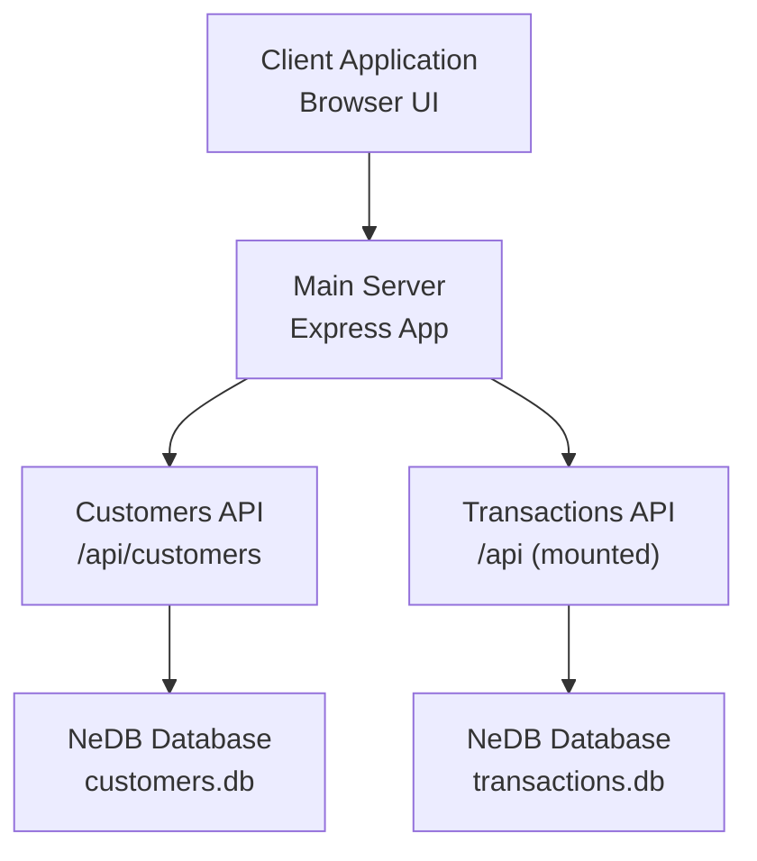
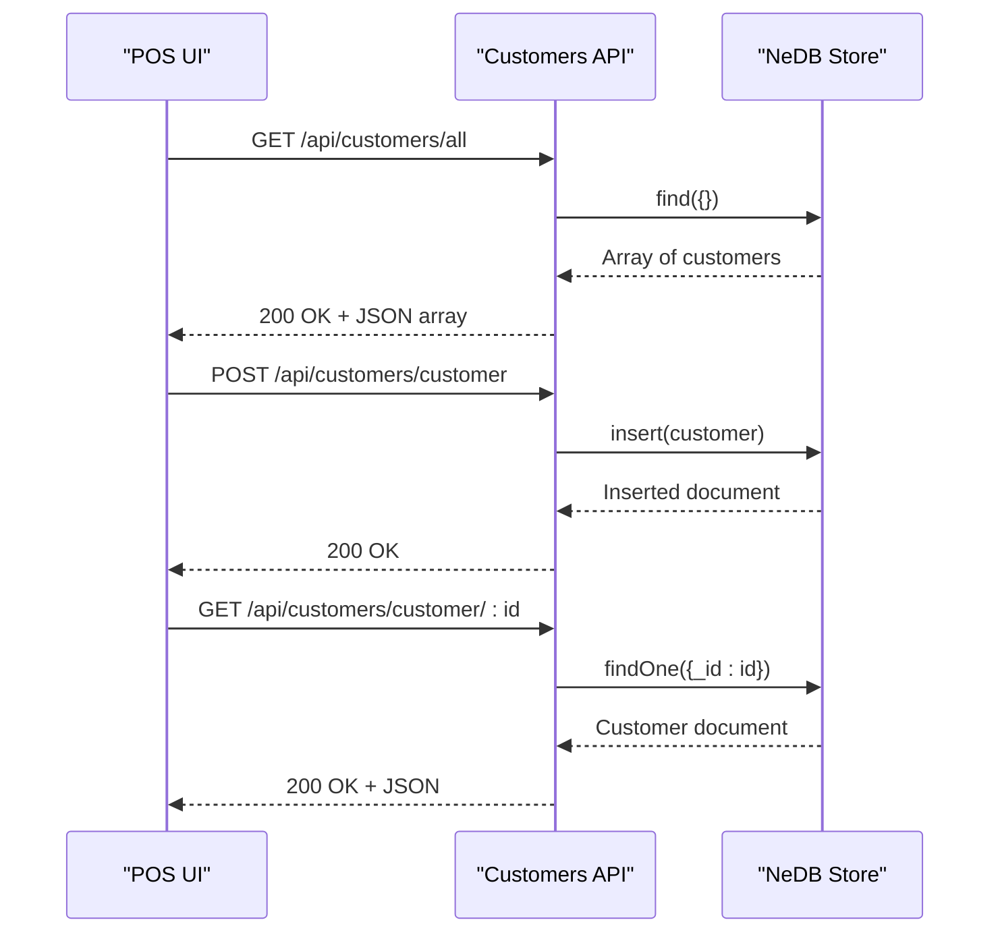
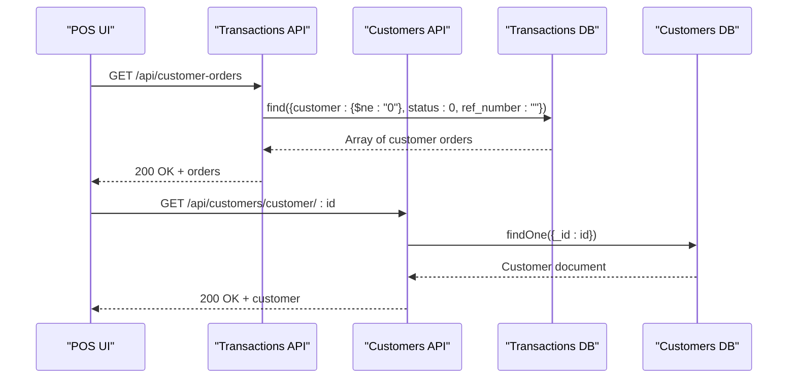
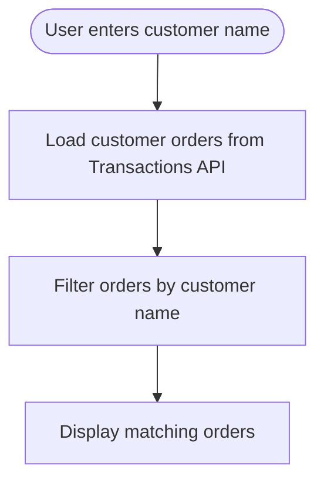
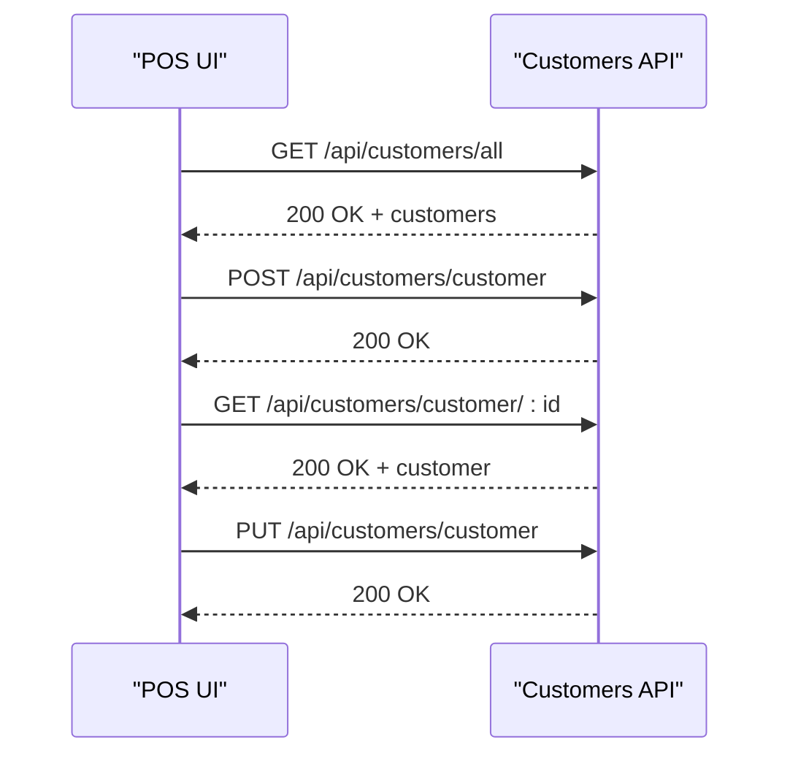
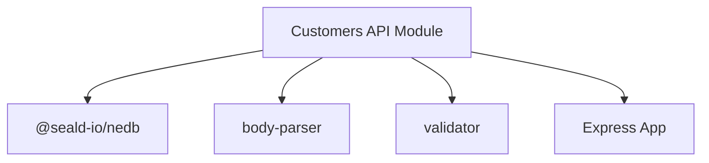

# Customer Management API

<cite>
**Referenced Files in This Document**
- [customers.js](file://api/customers.js)
- [server.js](file://server.js)
- [pos.js](file://assets/js/pos.js)
- [index.html](file://index.html)
- [transactions.js](file://api/transactions.js)
- [package.json](file://package.json)
</cite>

## Table of Contents
1. [Introduction](#introduction)
2. [Project Structure](#project-structure)
3. [Core Components](#core-components)
4. [Architecture Overview](#architecture-overview)
5. [Detailed Component Analysis](#detailed-component-analysis)
6. [Dependency Analysis](#dependency-analysis)
7. [Performance Considerations](#performance-considerations)
8. [Troubleshooting Guide](#troubleshooting-guide)
9. [Conclusion](#conclusion)
10. [Appendices](#appendices)

## Introduction
This document provides comprehensive API documentation for the Customer Management module within the PPOS (Point of Sale) system. It covers customer CRUD operations, purchase history tracking, customer search functionality, and customer profile management. It also details request/response schemas, validation rules, data sanitization processes, and integration with transaction processing.

## Project Structure
The Customer Management API is implemented as a standalone Express route module mounted under the main server. The frontend integrates with the API to manage customer profiles and search/filter capabilities.

**Diagram sources**
- [server.js:40-45](file://server.js#L40-L45)
- [customers.js:10-25](file://api/customers.js#L10-L25)
- [transactions.js:9-24](file://api/transactions.js#L9-L24)

**Section sources**
- [server.js:40-45](file://server.js#L40-L45)
- [customers.js:10-25](file://api/customers.js#L10-L25)
- [transactions.js:9-24](file://api/transactions.js#L9-L24)

## Core Components
- Customers API module exposing endpoints for retrieving, creating, updating, and deleting customer records.
- NeDB database for persisting customer data.
- Frontend integration for customer creation, editing, and selection in the POS interface.

Key responsibilities:
- Provide customer CRUD endpoints with basic validation and sanitization.
- Support retrieval of all customers and individual customer details.
- Integrate with transaction processing to associate sales with customers.

**Section sources**
- [customers.js:22-27](file://api/customers.js#L22-L27)
- [pos.js:368-387](file://assets/js/pos.js#L368-L387)

## Architecture Overview
The Customer Management API follows a layered architecture:
- Presentation layer: Express routes for customer operations.
- Persistence layer: NeDB datastore for customer records.
- Integration layer: Frontend JavaScript interacts with the API for customer management and POS workflows.

**Diagram sources**
- [customers.js:69-73](file://api/customers.js#L69-L73)
- [customers.js:82-95](file://api/customers.js#L82-L95)
- [customers.js:47-60](file://api/customers.js#L47-L60)

**Section sources**
- [customers.js:47-95](file://api/customers.js#L47-L95)

## Detailed Component Analysis

### API Endpoints

#### Base Path
- Base URL: `/api/customers`

#### GET /
- Description: Returns a welcome message indicating the Customer API is active.
- Response: Text/plain
- Example response: `"Customer API"`

**Section sources**
- [customers.js:36-38](file://api/customers.js#L36-L38)

#### GET /all
- Description: Retrieves all customer records.
- Response: Array of customer objects
- Status codes:
  - 200 OK on success
  - 500 Internal Server Error on failure

Response schema (array element):
- _id: integer (unique identifier)
- name: string
- phone: string
- email: string
- address: string

Example request:
- GET /api/customers/all

Example response:
- 200 OK
- Body: [{"_id": 123456, "name": "John Doe", "phone": "123-456-7890", "email": "john@example.com", "address": "123 Main St"}, ...]

**Section sources**
- [customers.js:69-73](file://api/customers.js#L69-L73)

#### GET /customer/:customerId
- Description: Retrieves a single customer by ID.
- Path parameters:
  - customerId: integer (required)
- Response: Customer object
- Status codes:
  - 200 OK on success
  - 500 Internal Server Error on failure
  - 500 Error if ID field is missing

Request validation:
- If customerId is missing, returns an error message and 500 status.

Example request:
- GET /api/customers/customer/123456

Example response:
- 200 OK
- Body: {"_id": 123456, "name": "John Doe", "phone": "123-456-7890", "email": "john@example.com", "address": "123 Main St"}

**Section sources**
- [customers.js:47-60](file://api/customers.js#L47-L60)

#### POST /customer
- Description: Creates a new customer.
- Request body: Customer object (fields described below)
- Response: 200 OK on success
- Status codes:
  - 200 OK on success
  - 500 Internal Server Error on failure

Request body schema:
- _id: integer (optional; auto-generated if omitted)
- name: string (required)
- phone: string (optional)
- email: string (optional)
- address: string (optional)

Validation and sanitization:
- The request body is inserted directly into the database without explicit field validation.
- The customer ID in the request body is sanitized using an escaping mechanism before being used in the update operation.

Example request:
- POST /api/customers/customer
- Headers: Content-Type: application/json
- Body: {"name": "Jane Smith", "phone": "098-765-4321", "email": "jane@example.com", "address": "456 Oak Ave"}

Example response:
- 200 OK

**Section sources**
- [customers.js:82-95](file://api/customers.js#L82-L95)

#### PUT /customer
- Description: Updates an existing customer by ID.
- Request body: Customer object containing the ID to update
- Response: 200 OK on success
- Status codes:
  - 200 OK on success
  - 500 Internal Server Error on failure

Request body schema:
- _id: integer (required; identifies the customer to update)
- name: string (optional)
- phone: string (optional)
- email: string (optional)
- address: string (optional)

Validation and sanitization:
- The _id field is sanitized using an escaping mechanism before querying the database.
- The rest of the request body is passed to the update operation.

Example request:
- PUT /api/customers/customer
- Headers: Content-Type: application/json
- Body: {"_id": 123456, "name": "John Q. Updated", "phone": "111-222-3333"}

Example response:
- 200 OK

**Section sources**
- [customers.js:130-151](file://api/customers.js#L130-L151)

#### DELETE /customer/:customerId
- Description: Deletes a customer by ID.
- Path parameters:
  - customerId: integer (required)
- Response: 200 OK on success
- Status codes:
  - 200 OK on success
  - 500 Internal Server Error on failure

Example request:
- DELETE /api/customers/customer/123456

Example response:
- 200 OK

**Section sources**
- [customers.js:104-121](file://api/customers.js#L104-L121)

### Request/Response Schemas

#### Customer Object Schema
- _id: integer (unique identifier)
- name: string
- phone: string
- email: string
- address: string

Notes:
- The schema is inferred from the frontend form fields and API usage.
- The API does not enforce strict validation; consumers should ensure fields conform to expectations.

**Section sources**
- [index.html:479-494](file://index.html#L479-L494)
- [pos.js:1259-1265](file://assets/js/pos.js#L1259-L1265)

### Validation Rules and Data Sanitization
- Input sanitization:
  - Customer ID values are sanitized using an escaping mechanism before database queries.
- Output sanitization:
  - The frontend uses unescaping mechanisms for rendering settings and monetary values.
- Validation:
  - The API does not implement explicit field-level validation for customer creation/update.
  - Missing ID parameter in GET /customer/:customerId triggers an immediate error response.

Recommendations:
- Add server-side validation for required fields and data types.
- Implement input sanitization for all fields to prevent injection attacks.
- Normalize phone/email formats during ingestion.

**Section sources**
- [customers.js:131](file://api/customers.js#L131)
- [pos.js:2127-2141](file://assets/js/pos.js#L2127-L2141)

### Purchase History Tracking and Integration
- Customer-to-transaction association:
  - Transactions reference customers via a customer identifier.
  - The POS UI displays customer orders and associates transactions with customer data.
- Retrieving customer orders:
  - The frontend fetches customer orders from the Transactions API endpoint.
- Transaction processing integration:
  - The Transactions API decrements inventory upon successful payment confirmation.

**Diagram sources**
- [pos.js:1193-1200](file://assets/js/pos.js#L1193-L1200)
- [transactions.js:75-82](file://api/transactions.js#L75-L82)
- [customers.js:47-60](file://api/customers.js#L47-L60)

**Section sources**
- [pos.js:1193-1200](file://assets/js/pos.js#L1193-L1200)
- [transactions.js:75-82](file://api/transactions.js#L75-L82)
- [customers.js:47-60](file://api/customers.js#L47-L60)

### Customer Search Functionality
- Frontend search:
  - The POS UI supports searching customer orders by customer name using a live filter.
- API-level search:
  - The current Customer API does not expose dedicated search endpoints.
  - Workaround: Fetch all customers and filter client-side.

**Diagram sources**
- [pos.js:52-65](file://assets/js/pos.js#L52-L65)

**Section sources**
- [pos.js:52-65](file://assets/js/pos.js#L52-L65)

### Customer Profile Management
- Creation and editing:
  - The POS UI allows creating new customers and editing existing ones via a modal form.
  - Submissions are sent to the Customers API using POST or PUT.
- Customer selection:
  - The POS UI populates a dropdown with all customers fetched from the Customers API.

**Diagram sources**
- [pos.js:368-387](file://assets/js/pos.js#L368-L387)
- [pos.js:1255-1306](file://assets/js/pos.js#L1255-L1306)
- [customers.js:69-95](file://api/customers.js#L69-L95)

**Section sources**
- [pos.js:368-387](file://assets/js/pos.js#L368-L387)
- [pos.js:1255-1306](file://assets/js/pos.js#L1255-L1306)
- [customers.js:69-95](file://api/customers.js#L69-L95)

### Common Use Cases

#### Adding a New Customer
- Steps:
  - Fill the customer form in the POS UI.
  - Submit the form to POST /api/customers/customer.
  - Refresh customer list to include the new customer.

**Section sources**
- [pos.js:1255-1306](file://assets/js/pos.js#L1255-L1306)
- [customers.js:82-95](file://api/customers.js#L82-L95)

#### Editing an Existing Customer
- Steps:
  - Select a customer from the dropdown.
  - Open the edit modal and submit changes to PUT /api/customers/customer.

**Section sources**
- [pos.js:1222-1253](file://assets/js/pos.js#L1222-L1253)
- [customers.js:130-151](file://api/customers.js#L130-L151)

#### Viewing Customer Purchase History
- Steps:
  - Navigate to the transactions view.
  - Use the customer orders filter to display orders associated with a specific customer.

**Section sources**
- [pos.js:1193-1200](file://assets/js/pos.js#L1193-L1200)
- [transactions.js:75-82](file://api/transactions.js#L75-L82)

#### Managing Customer Preferences
- Notes:
  - The current API does not expose a dedicated endpoint for managing customer preferences.
  - Preferences could be modeled as additional fields in the customer object and managed via existing CRUD endpoints.

[No sources needed since this section provides conceptual guidance]

## Dependency Analysis
External dependencies used by the Customer Management API:
- Express: Web framework for routing and middleware.
- Body-parser: Parses incoming request bodies.
- NeDB: Embedded NoSQL database for persistence.
- Validator: Provides sanitization utilities.

**Diagram sources**
- [customers.js:1-8](file://api/customers.js#L1-L8)
- [package.json:18-54](file://package.json#L18-L54)

**Section sources**
- [customers.js:1-8](file://api/customers.js#L1-L8)
- [package.json:18-54](file://package.json#L18-L54)

## Performance Considerations
- Database indexing:
  - A unique index is ensured on the customer ID field to optimize lookups.
- Query patterns:
  - All-customer retrieval performs a full collection scan; consider pagination for large datasets.
- Network overhead:
  - Minimize payload sizes by only sending changed fields in updates.
- Caching:
  - Implement client-side caching for frequently accessed customer lists.

**Section sources**
- [customers.js:27](file://api/customers.js#L27)
- [customers.js:69-73](file://api/customers.js#L69-L73)

## Troubleshooting Guide
Common issues and resolutions:
- Missing customer ID in GET /customer/:customerId:
  - Symptom: 500 Internal Server Error with an error message.
  - Resolution: Ensure the customerId parameter is present in the URL.
- Database errors during create/update/delete:
  - Symptom: 500 Internal Server Error with JSON error payload.
  - Resolution: Check database connectivity and permissions; verify request payload format.
- Frontend not reflecting updates:
  - Symptom: Changes made via API are not visible in the POS UI.
  - Resolution: Trigger a refresh of customer lists after successful API calls.

**Section sources**
- [customers.js:48-50](file://api/customers.js#L48-L50)
- [customers.js:85-94](file://api/customers.js#L85-L94)
- [customers.js:109-120](file://api/customers.js#L109-L120)
- [pos.js:1277-1304](file://assets/js/pos.js#L1277-L1304)

## Conclusion
The Customer Management API provides essential CRUD operations for customer records and integrates seamlessly with the POS and transaction systems. While functional, the API would benefit from enhanced server-side validation, explicit search endpoints, and standardized error handling to improve robustness and developer experience.

## Appendices

### API Endpoint Reference Summary
- GET /api/customers/
  - Purpose: Welcome message
  - Response: Text/plain
- GET /api/customers/all
  - Purpose: Retrieve all customers
  - Response: Array of customer objects
- GET /api/customers/customer/:customerId
  - Purpose: Retrieve a customer by ID
  - Response: Customer object
- POST /api/customers/customer
  - Purpose: Create a new customer
  - Response: 200 OK
- PUT /api/customers/customer
  - Purpose: Update an existing customer
  - Response: 200 OK
- DELETE /api/customers/customer/:customerId
  - Purpose: Delete a customer by ID
  - Response: 200 OK

**Section sources**
- [customers.js:36-38](file://api/customers.js#L36-L38)
- [customers.js:69-73](file://api/customers.js#L69-L73)
- [customers.js:47-60](file://api/customers.js#L47-L60)
- [customers.js:82-95](file://api/customers.js#L82-L95)
- [customers.js:130-151](file://api/customers.js#L130-L151)
- [customers.js:104-121](file://api/customers.js#L104-L121)