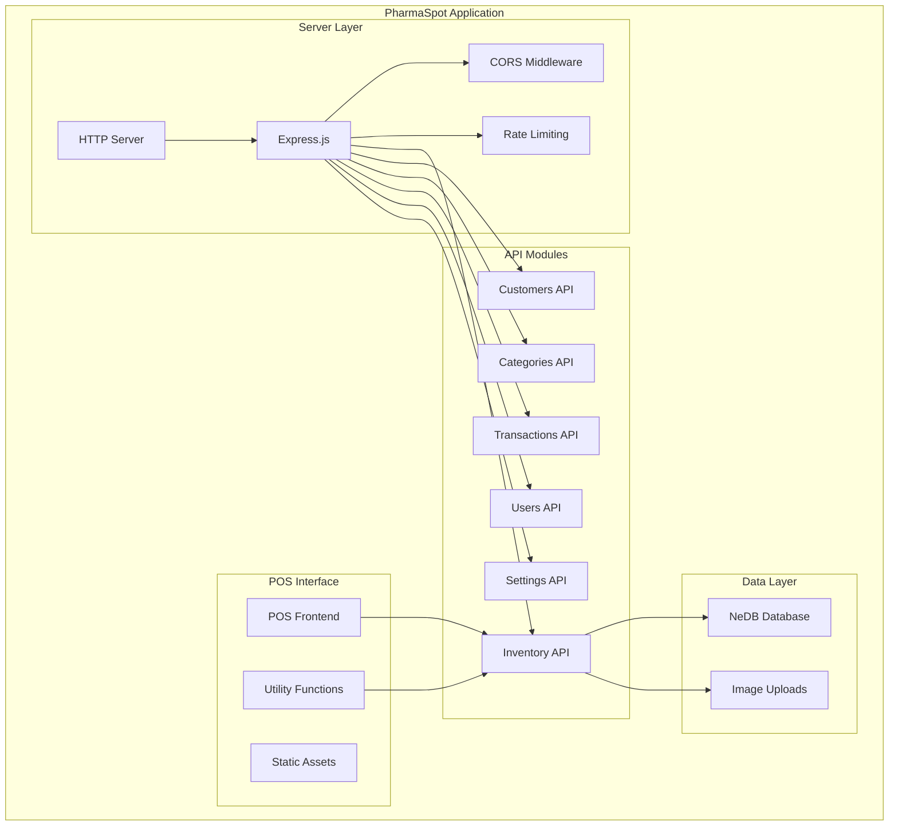
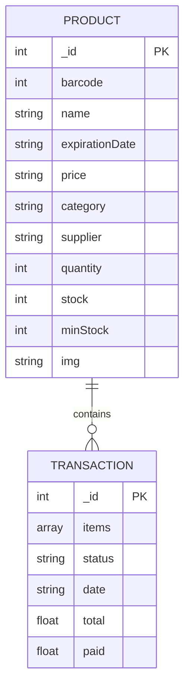
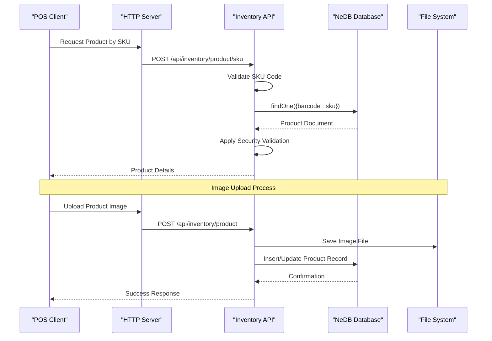
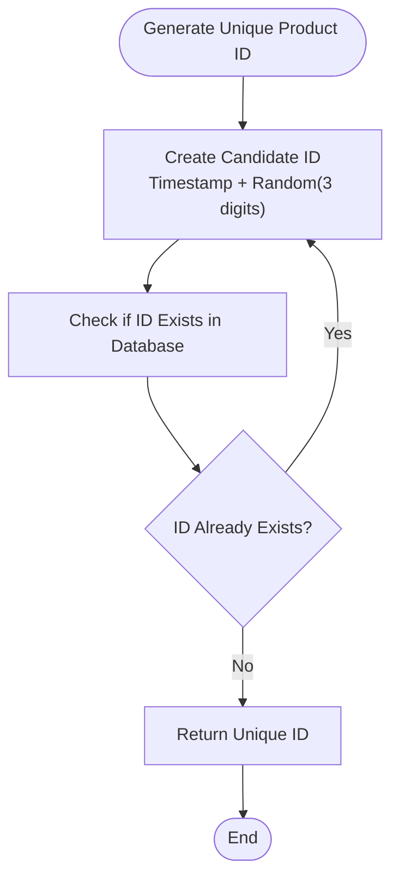
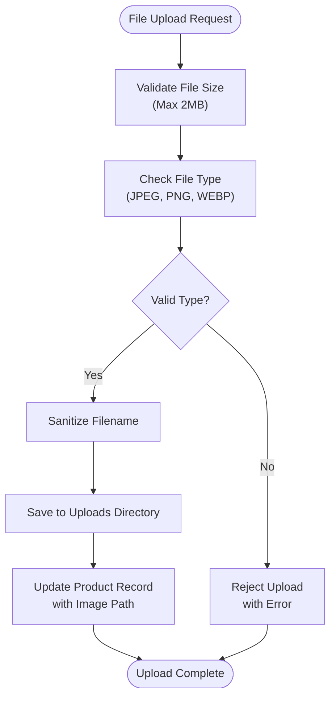
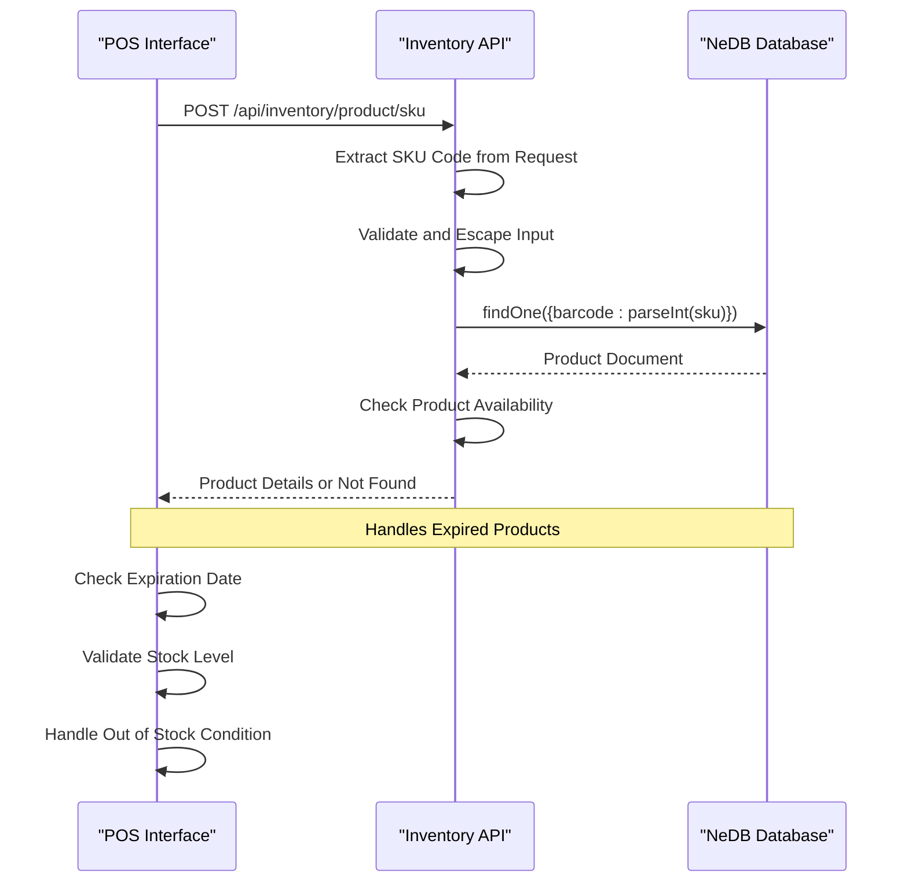
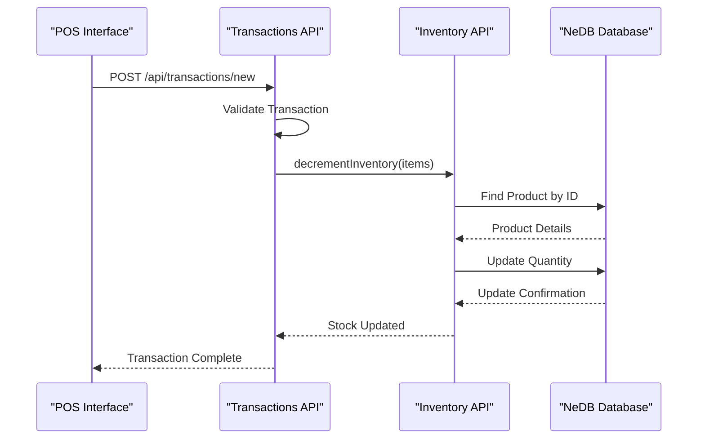

# Inventory Management API

<cite>
**Referenced Files in This Document**
- [server.js](file://server.js)
- [inventory.js](file://api/inventory.js)
- [utils.js](file://assets/js/utils.js)
- [pos.js](file://assets/js/pos.js)
- [transactions.js](file://api/transactions.js)
</cite>

## Table of Contents
1. [Introduction](#introduction)
2. [Project Structure](#project-structure)
3. [Core Components](#core-components)
4. [Architecture Overview](#architecture-overview)
5. [Detailed Component Analysis](#detailed-component-analysis)
6. [Dependency Analysis](#dependency-analysis)
7. [Performance Considerations](#performance-considerations)
8. [Troubleshooting Guide](#troubleshooting-guide)
9. [Conclusion](#conclusion)

## Introduction
The Inventory Management API provides a complete REST interface for managing pharmaceutical products within the PharmaSpot Point of Sale system. This module handles product lifecycle operations including creation, retrieval, updates, deletion, and barcode-based lookup. It integrates seamlessly with the POS interface for real-time inventory management during transactions.

The API operates as a standalone Express.js service that persists data using NeDB (NoSQL database) and provides robust file upload capabilities for product images with comprehensive validation and sanitization.

## Project Structure
The Inventory Management module is organized within the broader PharmaSpot application architecture:



**Diagram sources**
- [server.js:1-68](file://server.js#L1-L68)
- [inventory.js:1-50](file://api/inventory.js#L1-L50)

**Section sources**
- [server.js:1-68](file://server.js#L1-L68)
- [inventory.js:1-50](file://api/inventory.js#L1-L50)

## Core Components
The Inventory Management API consists of several key components working together to provide comprehensive product management functionality:

### API Endpoints
The module exposes five primary endpoints for complete inventory management:

1. **GET /api/inventory/** - Welcome endpoint for inventory service
2. **GET /api/inventory/product/:productId** - Retrieve individual product by ID
3. **GET /api/inventory/products** - List all products
4. **POST /api/inventory/product** - Create or update product with image upload
5. **DELETE /api/inventory/product/:productId** - Remove product by ID
6. **POST /api/inventory/product/sku** - Barcode-based product lookup

### Data Persistence
The system uses NeDB (NoSQL database) for local data storage with automatic indexing on product IDs:



**Diagram sources**
- [inventory.js:178-193](file://api/inventory.js#L178-L193)
- [transactions.js:163-180](file://api/transactions.js#L163-L180)

**Section sources**
- [inventory.js:89-294](file://api/inventory.js#L89-L294)
- [inventory.js:46-51](file://api/inventory.js#L46-L51)

## Architecture Overview
The Inventory Management API follows a modular architecture with clear separation of concerns:



**Diagram sources**
- [pos.js:425-488](file://assets/js/pos.js#L425-L488)
- [inventory.js:124-240](file://api/inventory.js#L124-L240)

**Section sources**
- [server.js:40-45](file://server.js#L40-L45)
- [inventory.js:1-44](file://api/inventory.js#L1-L44)

## Detailed Component Analysis

### Product ID Generation Algorithm
The system implements a sophisticated algorithm for generating unique product IDs:



**Diagram sources**
- [inventory.js:53-69](file://api/inventory.js#L53-L69)

The algorithm ensures uniqueness by combining:
- Current timestamp (ensuring temporal uniqueness)
- Random 3-digit suffix (preventing collisions)
- Database verification loop (guaranteeing no duplicates)

**Section sources**
- [inventory.js:53-69](file://api/inventory.js#L53-L69)

### File Upload and Image Processing
The system handles product image uploads with comprehensive validation and security measures:



**Diagram sources**
- [inventory.js:28-39](file://api/inventory.js#L28-L39)
- [utils.js:76-87](file://assets/js/utils.js#L76-L87)

**Section sources**
- [inventory.js:124-240](file://api/inventory.js#L124-L240)
- [utils.js:76-87](file://assets/js/utils.js#L76-L87)

### Barcode-Based Product Lookup
The SKU lookup functionality enables quick product retrieval using barcode scanning:



**Diagram sources**
- [pos.js:413-488](file://assets/js/pos.js#L413-L488)
- [inventory.js:276-294](file://api/inventory.js#L276-L294)

**Section sources**
- [pos.js:413-488](file://assets/js/pos.js#L413-L488)
- [inventory.js:276-294](file://api/inventory.js#L276-L294)

### Transaction Integration
The Inventory API integrates with the transaction system for automatic stock updates:



**Diagram sources**
- [transactions.js:176-178](file://api/transactions.js#L176-L178)
- [inventory.js:302-332](file://api/inventory.js#L302-L332)

**Section sources**
- [transactions.js:163-180](file://api/transactions.js#L163-L180)
- [inventory.js:302-332](file://api/inventory.js#L302-L332)

## Dependency Analysis
The Inventory Management API has well-defined dependencies that support its functionality:

```mermaid
graph LR
subgraph "Core Dependencies"
Express[Express.js]
Multer[Multer]
Validator[Validator.js]
Sanitize[sanitize-filename]
Async[Async.js]
end
subgraph "Database Layer"
NeDB[@seald-io/nedb]
Datastore[NeDB Datastore]
end
subgraph "File System"
FS[File System]
Path[Path Module]
Crypto[Crypto]
end
subgraph "Application Integration"
Utils[Utility Functions]
POS[POS Interface]
Transactions[Transactions API]
end
Express --> Multer
Express --> Validator
Express --> Sanitize
Express --> Async
Express --> NeDB
NeDB --> Datastore
Multer --> FS
FS --> Path
Utils --> Crypto
POS --> Express
Transactions --> Express
```

**Diagram sources**
- [inventory.js:1-18](file://api/inventory.js#L1-L18)
- [server.js:1-10](file://server.js#L1-L10)

**Section sources**
- [inventory.js:1-18](file://api/inventory.js#L1-L18)
- [server.js:1-10](file://server.js#L1-L10)

## Performance Considerations
The Inventory Management API incorporates several performance optimization strategies:

### Database Indexing
- Automatic unique index on product IDs for O(1) lookup performance
- Efficient query patterns for common operations (by ID, by barcode)

### File Upload Optimization
- 2MB file size limit prevents excessive memory usage
- Asynchronous file processing to avoid blocking operations
- Efficient filename sanitization to prevent filesystem conflicts

### Network Efficiency
- Rate limiting (100 requests per 15 minutes) prevents abuse
- CORS configuration enables secure cross-origin requests
- JSON parsing middleware optimizes request handling

## Troubleshooting Guide

### Common Error Scenarios

**File Upload Issues**
- **Error Type**: Multer upload errors
- **Causes**: Invalid file types, file size exceeded, disk space issues
- **Solutions**: Verify file type (JPEG, PNG, WEBP), check file size (< 2MB), ensure sufficient disk space

**Product ID Conflicts**
- **Error Type**: Duplicate product ID generation
- **Causes**: Extremely rare collision in timestamp + random combination
- **Solutions**: System automatically retries generation; check database connectivity

**Barcode Lookup Failures**
- **Error Type**: Product not found by barcode
- **Causes**: Incorrect barcode format, product not registered, database connection issues
- **Solutions**: Verify barcode format (numeric), check product registration, validate database access

**Section sources**
- [inventory.js:127-141](file://api/inventory.js#L127-L141)
- [inventory.js:198-203](file://api/inventory.js#L198-L203)
- [inventory.js:283-289](file://api/inventory.js#L283-L289)

### Security Considerations
The API implements multiple security layers:

**Input Validation**
- All user inputs are escaped using validator.js
- File uploads are filtered by MIME type whitelist
- Product IDs are validated before database operations

**File Security**
- Filenames are sanitized to prevent directory traversal attacks
- Only specific image formats are accepted
- Maximum file size limit prevents denial-of-service attacks

**API Security**
- CORS allows controlled cross-origin requests
- Rate limiting prevents brute force attacks
- Input sanitization protects against injection attacks

**Section sources**
- [inventory.js:145-151](file://api/inventory.js#L145-L151)
- [utils.js:76-87](file://assets/js/utils.js#L76-L87)
- [server.js:22-34](file://server.js#L22-L34)

## Conclusion
The Inventory Management API provides a robust, secure, and efficient solution for pharmaceutical product management within the PharmaSpot Point of Sale system. Its comprehensive feature set includes complete CRUD operations, advanced barcode scanning integration, secure file upload handling, and seamless transaction system integration.

The modular architecture ensures maintainability and scalability, while the comprehensive validation and security measures protect against common vulnerabilities. The API's integration with the POS interface enables real-time inventory management during sales transactions, providing an essential foundation for pharmacy operations.

Key strengths include:
- Reliable product ID generation algorithm
- Comprehensive file upload security
- Efficient barcode-based lookup
- Seamless transaction integration
- Robust error handling and validation
- Performance-optimized database operations

This API serves as a critical component in the PharmaSpot ecosystem, enabling efficient inventory management and supporting the overall point-of-sale workflow.