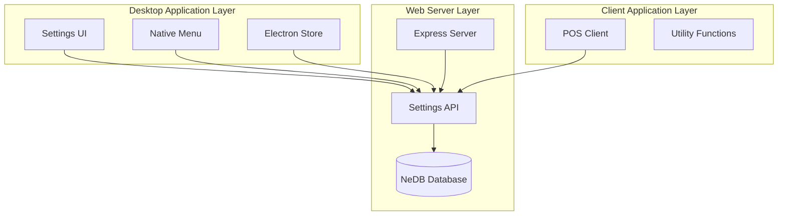
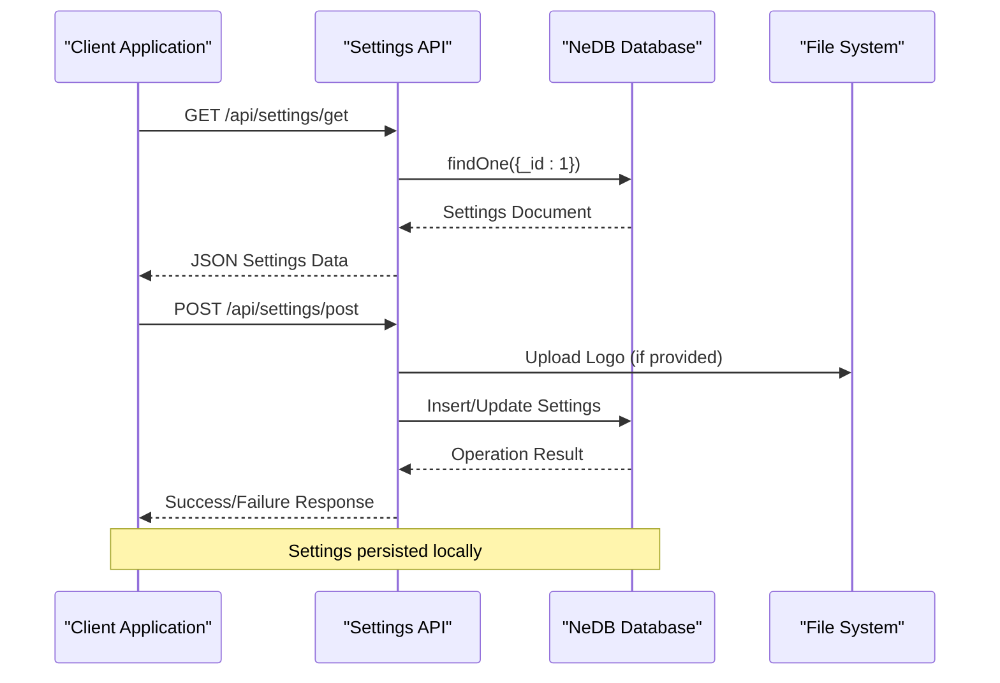
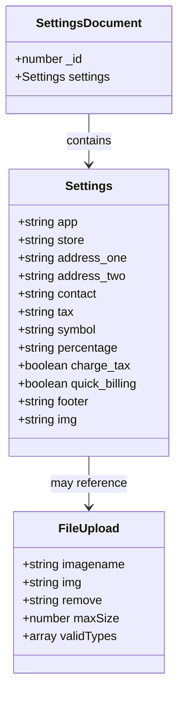
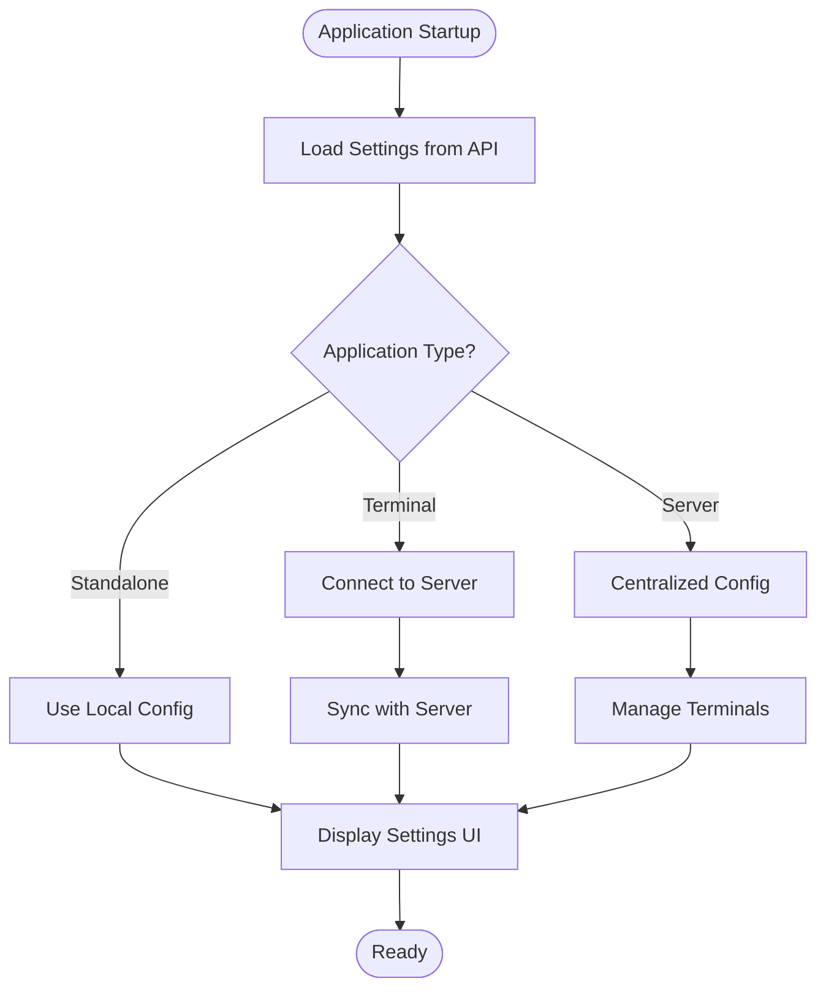

# System Settings API

<cite>
**Referenced Files in This Document**
- [settings.js](file://api/settings.js)
- [server.js](file://server.js)
- [utils.js](file://assets/js/utils.js)
- [pos.js](file://assets/js/pos.js)
- [menu.js](file://assets/js/native_menu/menu.js)
- [index.html](file://index.html)
- [package.json](file://package.json)
- [app.config.js](file://app.config.js)
</cite>

## Table of Contents
1. [Introduction](#introduction)
2. [Project Structure](#project-structure)
3. [Core Components](#core-components)
4. [Architecture Overview](#architecture-overview)
5. [Detailed Component Analysis](#detailed-component-analysis)
6. [Dependency Analysis](#dependency-analysis)
7. [Performance Considerations](#performance-considerations)
8. [Troubleshooting Guide](#troubleshooting-guide)
9. [Conclusion](#conclusion)

## Introduction
The System Settings API provides centralized configuration management for the PharmaSpot Point of Sale application. It handles application-wide parameters, multi-terminal configurations, branding customization, and system preferences. The API manages settings persistence using a local database and integrates with the desktop application's configuration system.

## Project Structure
The settings functionality spans multiple layers of the application architecture:



**Diagram sources**
- [server.js:40-45](file://server.js#L40-L45)
- [settings.js:46-49](file://api/settings.js#L46-L49)

**Section sources**
- [server.js:1-68](file://server.js#L1-L68)
- [settings.js:1-192](file://api/settings.js#L1-L192)

## Core Components
The System Settings API consists of several key components working together to provide comprehensive configuration management:

### Settings Database Schema
The settings are stored in a single document with the ID 1, containing all configuration parameters organized in a structured format.

### File Upload System
Built-in support for logo uploads with validation and security measures for image file handling.

### Multi-Terminal Configuration
Support for standalone and network-based terminal configurations with MAC address identification.

**Section sources**
- [settings.js:140-156](file://api/settings.js#L140-L156)
- [settings.js:28-39](file://api/settings.js#L28-L39)

## Architecture Overview
The System Settings API follows a layered architecture pattern with clear separation of concerns:



**Diagram sources**
- [settings.js:71-80](file://api/settings.js#L71-L80)
- [settings.js:90-190](file://api/settings.js#L90-L190)

## Detailed Component Analysis

### Settings API Endpoints

#### GET /api/settings/get
Retrieves the current system settings from the database.

**Request:**
- Method: GET
- URL: `/api/settings/get`
- Headers: Content-Type: application/json

**Response:**
- Status: 200 OK
- Body: Complete settings document with all configuration parameters

**Section sources**
- [settings.js:71-80](file://api/settings.js#L71-L80)

#### POST /api/settings/post
Creates new settings or updates existing ones, with optional logo upload.

**Request:**
- Method: POST
- URL: `/api/settings/post`
- Headers: Content-Type: multipart/form-data or application/json
- Form Fields:
  - `id`: Settings identifier (empty for new)
  - `app`: Application type (Standalone/Network Terminal/Network Server)
  - `store`: Store name
  - `address_one/address_two`: Store address lines
  - `contact`: Contact information
  - `tax`: Tax authority name
  - `symbol`: Currency symbol
  - `percentage`: Tax percentage rate
  - `charge_tax`: Boolean flag for tax charging
  - `quick_billing`: Boolean flag for quick billing mode
  - `footer`: Footer text for receipts
  - `img`: Current logo filename
  - `remove`: Flag to remove current logo
  - `imagename`: New logo file (multipart/form-data)

**Response:**
- Status: 200 OK on success
- Status: 400 Bad Request for upload errors
- Status: 500 Internal Server Error for database errors

**Section sources**
- [settings.js:90-190](file://api/settings.js#L90-L190)

### Settings Data Model



**Diagram sources**
- [settings.js:140-156](file://api/settings.js#L140-L156)
- [settings.js:12-16](file://api/settings.js#L12-L16)

### Multi-Terminal Configuration

The system supports three application modes with different configuration requirements:

#### Standalone Point of Sale
- Single-machine operation
- Full local settings management
- Direct database access

#### Network Point of Sale Terminal
- Remote server connection
- MAC address identification
- Limited local settings storage

#### Network Point of Sale Server
- Centralized server operation
- Multi-terminal support
- Shared database access

**Section sources**
- [index.html:775-781](file://index.html#L775-L781)
- [pos.js:1956-1970](file://assets/js/pos.js#L1956-L1970)

### Branding Customization

The API provides comprehensive branding capabilities:

#### Logo Management
- Supported formats: JPG, JPEG, PNG, WebP
- Maximum file size: 2MB
- Automatic filename sanitization
- Secure file path handling

#### Text Customization
- Store name and address
- Contact information
- Tax authority details
- Receipt footer text
- Currency symbol

**Section sources**
- [settings.js:12-16](file://api/settings.js#L12-L16)
- [settings.js:115-117](file://api/settings.js#L115-L117)

### Configuration Validation

The API implements multiple layers of validation:

#### Input Sanitization
- HTML entity escaping for all string inputs
- Filename sanitization for security
- Type conversion for boolean flags

#### File Validation
- MIME type checking against allowed formats
- Size limit enforcement (2MB)
- Directory traversal prevention

#### Business Logic Validation
- Tax percentage numeric validation
- MAC address requirement for terminals
- IP address format validation

**Section sources**
- [settings.js:140-156](file://api/settings.js#L140-L156)
- [utils.js:76-87](file://assets/js/utils.js#L76-L87)

### Integration with Desktop Application



**Diagram sources**
- [pos.js:196-213](file://assets/js/pos.js#L196-L213)
- [pos.js:211-213](file://assets/js/pos.js#L211-L213)

**Section sources**
- [pos.js:196-213](file://assets/js/pos.js#L196-L213)
- [pos.js:211-213](file://assets/js/pos.js#L211-L213)

## Dependency Analysis

```mermaid
graph LR
subgraph "External Dependencies"
Express[express]
Multer[multer]
Validator[validator]
NeDB[@seald-io/nedb]
Sanitize[sanitize-filename]
end
subgraph "Internal Modules"
SettingsAPI[settings.js]
Utils[utils.js]
POS[pos.js]
Menu[menu.js]
end
Express --> SettingsAPI
Multer --> SettingsAPI
Validator --> SettingsAPI
NeDB --> SettingsAPI
Sanitize --> SettingsAPI
Utils --> SettingsAPI
POS --> SettingsAPI
Menu --> SettingsAPI
```

**Diagram sources**
- [package.json:18-54](file://package.json#L18-L54)
- [settings.js:1-11](file://api/settings.js#L1-L11)

**Section sources**
- [package.json:18-54](file://package.json#L18-L54)
- [settings.js:1-11](file://api/settings.js#L1-L11)

## Performance Considerations
- Database operations use indexed queries for optimal performance
- File uploads are processed asynchronously to prevent blocking
- Input validation occurs before database operations to minimize errors
- Settings are cached in memory for frequently accessed data
- Rate limiting prevents abuse of the API endpoints

## Troubleshooting Guide

### Common Issues and Solutions

#### Settings Not Loading
- Verify API endpoint accessibility
- Check database connectivity
- Ensure settings document exists with ID 1

#### Logo Upload Failures
- Confirm file format is supported (JPG, JPEG, PNG, WebP)
- Verify file size is under 2MB limit
- Check write permissions for upload directory

#### Multi-Terminal Connection Issues
- Validate IP address format
- Confirm server is reachable on configured port
- Verify MAC address uniqueness

**Section sources**
- [settings.js:93-107](file://api/settings.js#L93-L107)
- [utils.js:76-87](file://assets/js/utils.js#L76-L87)

## Conclusion
The System Settings API provides a robust foundation for managing application configuration across different deployment scenarios. Its modular design supports both standalone and network-based deployments while maintaining consistent branding and operational parameters. The implementation prioritizes security through input validation and file handling, ensuring reliable operation in production environments.