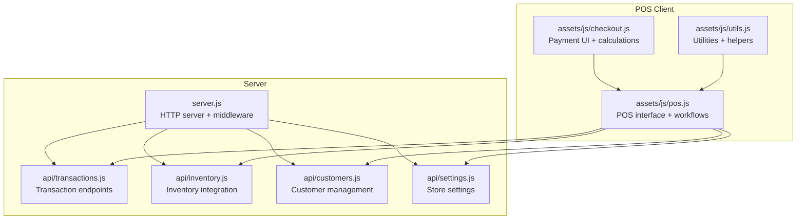
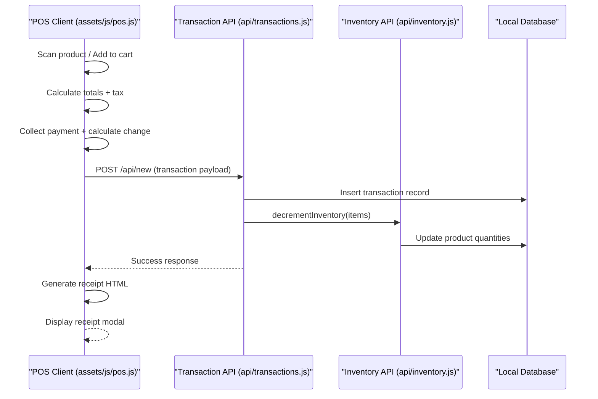
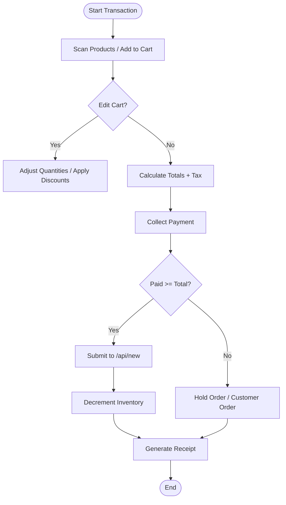
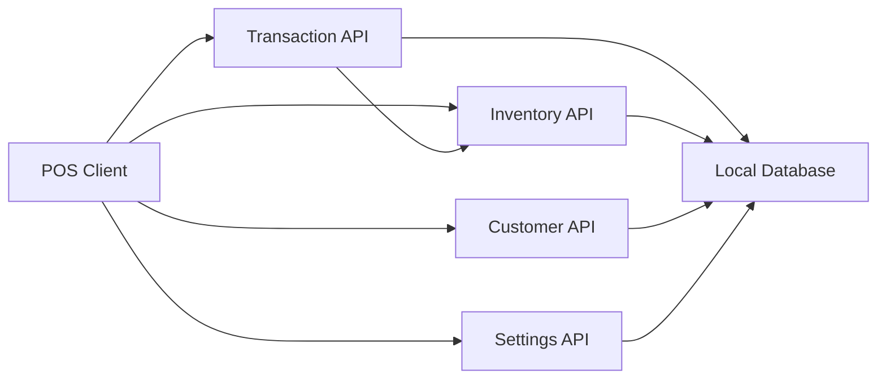

# Transaction Processing API

<cite>
**Referenced Files in This Document**
- [server.js](file://server.js)
- [api/transactions.js](file://api/transactions.js)
- [api/inventory.js](file://api/inventory.js)
- [assets/js/pos.js](file://assets/js/pos.js)
- [assets/js/checkout.js](file://assets/js/checkout.js)
- [assets/js/utils.js](file://assets/js/utils.js)
- [api/customers.js](file://api/customers.js)
- [api/settings.js](file://api/settings.js)
</cite>

## Table of Contents
1. [Introduction](#introduction)
2. [Project Structure](#project-structure)
3. [Core Components](#core-components)
4. [Architecture Overview](#architecture-overview)
5. [Detailed Component Analysis](#detailed-component-analysis)
6. [Dependency Analysis](#dependency-analysis)
7. [Performance Considerations](#performance-considerations)
8. [Troubleshooting Guide](#troubleshooting-guide)
9. [Conclusion](#conclusion)

## Introduction
This document provides comprehensive API documentation for the Transaction Processing module within the Point of Sale (POS) system. It covers endpoints for sales processing, order management, transaction history retrieval, and payment processing. The documentation details the transaction schema, including orderId, items array, customer information, totals, payment methods, and status tracking. It also includes examples of complete transaction workflows from product scanning to payment completion, inventory decrement integration, receipt generation endpoints, transaction filtering and search capabilities, and reporting endpoints. Multi-payment scenarios, change calculation, and transaction status management are documented along with integration patterns with the POS interface and inventory management system.

## Project Structure
The Transaction Processing module is organized around a Node.js/Express backend with embedded database storage and an Electron-based POS client. The server exposes REST endpoints under the `/api` namespace, while the POS client handles user interactions, payment processing, and receipt generation.

**Diagram sources**
- [server.js:1-68](file://server.js#L1-L68)
- [api/transactions.js:1-251](file://api/transactions.js#L1-L251)
- [api/inventory.js:1-333](file://api/inventory.js#L1-L333)
- [assets/js/pos.js:1-2538](file://assets/js/pos.js#L1-L2538)
- [assets/js/checkout.js:1-102](file://assets/js/checkout.js#L1-L102)
- [assets/js/utils.js:1-112](file://assets/js/utils.js#L1-L112)

**Section sources**
- [server.js:1-68](file://server.js#L1-L68)
- [api/transactions.js:1-251](file://api/transactions.js#L1-L251)

## Core Components
- Transaction API: Provides endpoints for creating, updating, deleting, retrieving transactions, and querying by date and status.
- POS Client: Manages product scanning, cart operations, payment processing, receipt generation, and order hold/cancel functionality.
- Inventory Integration: Handles product lookup, stock validation, and automatic inventory decrement upon successful payment.
- Receipt Generation: Produces HTML receipts with store branding, order details, taxes, and payment information.
- Customer Management: Supports customer selection and association with transactions.
- Settings: Provides store configuration including currency, tax settings, and quick billing preferences.

**Section sources**
- [api/transactions.js:156-237](file://api/transactions.js#L156-L237)
- [assets/js/pos.js:389-959](file://assets/js/pos.js#L389-L959)
- [api/inventory.js:296-333](file://api/inventory.js#L296-L333)

## Architecture Overview
The system follows a client-server architecture with the server exposing REST endpoints and the POS client consuming them. The POS client orchestrates the end-to-end transaction workflow, including product scanning, cart management, payment processing, and receipt generation. The server persists transaction data locally and integrates with inventory to manage stock levels.

**Diagram sources**
- [assets/js/pos.js:899-959](file://assets/js/pos.js#L899-L959)
- [api/transactions.js:163-181](file://api/transactions.js#L163-L181)
- [api/inventory.js:296-333](file://api/inventory.js#L296-L333)

## Detailed Component Analysis

### Transaction Schema
The transaction object includes the following fields:
- order: Unique order identifier
- ref_number: Reference number (optional)
- discount: Discount amount
- customer: Customer information (walk-in or selected customer)
- status: Transaction status (0 for open/on-hold)
- subtotal: Subtotal amount
- tax: Tax amount
- order_type: Order type indicator
- items: Array of purchased items (id, product_name, sku, price, quantity)
- date: Transaction timestamp
- payment_type: Payment method (Cash/Card)
- payment_info: Additional payment details
- total: Total amount
- paid: Amount paid
- change: Change amount
- _id: Primary key
- till: Till identifier
- mac: MAC address
- user: Cashier name
- user_id: Cashier identifier

**Section sources**
- [assets/js/pos.js:899-920](file://assets/js/pos.js#L899-L920)

### Transaction Endpoints
- GET /api: Returns API welcome message
- GET /api/all: Retrieves all transactions
- GET /api/on-hold: Retrieves on-hold transactions (non-empty ref_number, status 0)
- GET /api/customer-orders: Retrieves customer orders (status 0, empty ref_number)
- GET /api/by-date: Filters transactions by date range, user, till, and status
- POST /api/new: Creates a new transaction and triggers inventory decrement if paid >= total
- PUT /api/new: Updates an existing transaction
- POST /api/delete: Deletes a transaction by orderId
- GET /api/:transactionId: Retrieves a specific transaction by ID

**Section sources**
- [api/transactions.js:28-251](file://api/transactions.js#L28-L251)

### POS Workflow and Payment Processing
The POS client manages the complete sales workflow:
- Product Scanning: Barcode search and product lookup
- Cart Operations: Add/remove items, adjust quantities, apply discounts
- Tax Calculation: Applies VAT based on store settings
- Payment Collection: Handles cash/card payments, calculates change
- Order Hold/Customer Orders: Allows deferring payment and retrieving pending orders
- Receipt Generation: Builds HTML receipts with store branding and transaction details
- Order Completion: Submits transaction to server and updates inventory

**Diagram sources**
- [assets/js/pos.js:389-959](file://assets/js/pos.js#L389-L959)
- [api/transactions.js:163-181](file://api/transactions.js#L163-L181)

**Section sources**
- [assets/js/pos.js:389-959](file://assets/js/pos.js#L389-L959)

### Inventory Decrement Integration
The system automatically decrements inventory quantities when a transaction is created and the paid amount is greater than or equal to the total. The decrement operation processes each item in the transaction sequentially to update product quantities.

**Section sources**
- [api/transactions.js:176-178](file://api/transactions.js#L176-L178)
- [api/inventory.js:296-333](file://api/inventory.js#L296-L333)

### Receipt Generation
The POS client generates HTML receipts containing:
- Store branding (logo, name, address, contact, tax number)
- Order details (order number, reference number, customer, cashier, date)
- Items list with quantities and prices
- Subtotal, discount, tax, and total amounts
- Payment information (paid amount, change, payment method)
- Footer message from settings

Receipts are sanitized and displayed in a modal for printing or viewing.

**Section sources**
- [assets/js/pos.js:809-885](file://assets/js/pos.js#L809-L885)
- [assets/js/pos.js:2359-2443](file://assets/js/pos.js#L2359-L2443)

### Transaction Filtering and Search
The system provides flexible transaction filtering via the `/api/by-date` endpoint with parameters:
- start: Start date/time
- end: End date/time
- user: User ID (0 for all)
- till: Till ID (0 for all)
- status: Transaction status

Additionally, dedicated endpoints retrieve on-hold and customer orders for quick access.

**Section sources**
- [api/transactions.js:84-154](file://api/transactions.js#L84-L154)
- [api/transactions.js:52-82](file://api/transactions.js#L52-L82)

### Multi-Payment Scenarios and Change Calculation
The POS client supports multiple payment methods (Cash/Card) and calculates change automatically. The checkout module handles keypad input, decimal entry, and change computation. Payment information is captured and included in the transaction payload.

**Section sources**
- [assets/js/checkout.js:10-46](file://assets/js/checkout.js#L10-L46)
- [assets/js/pos.js:719-774](file://assets/js/pos.js#L719-L774)

### Transaction Status Management
Transactions support different statuses:
- 0: Open/On-hold (pending payment)
- Other values: Completed/paid (as used in reporting)

The POS client distinguishes between immediate payment (status 1) and deferred payment (status 0) scenarios.

**Section sources**
- [assets/js/pos.js:786-795](file://assets/js/pos.js#L786-L795)
- [assets/js/pos.js:1315-1325](file://assets/js/pos.js#L1315-L1325)

### Integration Patterns
- POS Interface Integration: The POS client communicates with the Transaction API for order creation/update/deletion and with the Inventory API for product lookup and stock validation.
- Settings Integration: Store settings (currency, tax, quick billing) influence UI behavior and transaction calculations.
- Customer Integration: Customer selection is integrated into the transaction workflow for reporting and accounting.

**Section sources**
- [assets/js/pos.js:211-213](file://assets/js/pos.js#L211-L213)
- [assets/js/pos.js:230-241](file://assets/js/pos.js#L230-L241)
- [assets/js/pos.js:1193-1200](file://assets/js/pos.js#L1193-L1200)

## Dependency Analysis
The Transaction Processing module exhibits clear separation of concerns with well-defined dependencies:
- Server depends on Express, HTTP server, and local database
- POS client depends on jQuery, Bootstrap, and local utilities
- Transaction API depends on Inventory API for stock management
- POS client depends on multiple APIs for product, customer, and settings data

**Diagram sources**
- [server.js:40-45](file://server.js#L40-L45)
- [assets/js/pos.js:267-354](file://assets/js/pos.js#L267-L354)

**Section sources**
- [server.js:40-45](file://server.js#L40-L45)
- [assets/js/pos.js:267-354](file://assets/js/pos.js#L267-L354)

## Performance Considerations
- Local Database: Uses NeDB for lightweight local storage; suitable for small to medium deployments
- Asynchronous Operations: Inventory decrement uses sequential processing to maintain consistency
- Rate Limiting: Server includes basic rate limiting to prevent abuse
- Client-Side Calculations: POS performs real-time calculations to minimize server round-trips

## Troubleshooting Guide
Common issues and resolutions:
- Payment Validation: Ensure payment amount meets or exceeds total; otherwise transaction remains on-hold
- Inventory Issues: Verify product quantities are sufficient; expired or out-of-stock items cannot be sold
- Receipt Generation: Confirm store settings (logo, tax, footer) are configured correctly
- Order Retrieval: Use appropriate filters (date range, user, till, status) for transaction queries
- Network Connectivity: Verify POS client can reach the server at the configured host/port

**Section sources**
- [assets/js/pos.js:786-795](file://assets/js/pos.js#L786-L795)
- [assets/js/pos.js:288-305](file://assets/js/pos.js#L288-L305)

## Conclusion
The Transaction Processing module provides a robust foundation for POS operations with clear API boundaries, comprehensive transaction management, and seamless integration with inventory and customer systems. The modular design enables easy extension for advanced features like multi-payment processing, detailed reporting, and enhanced inventory tracking.