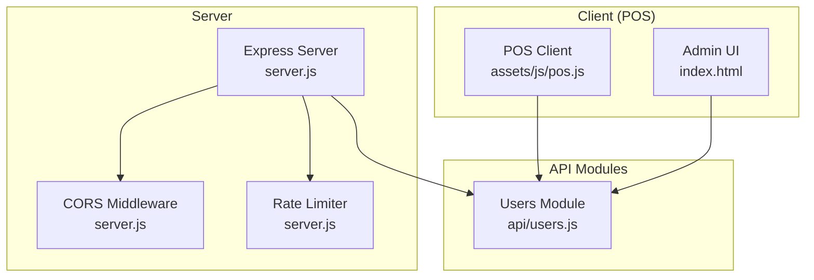
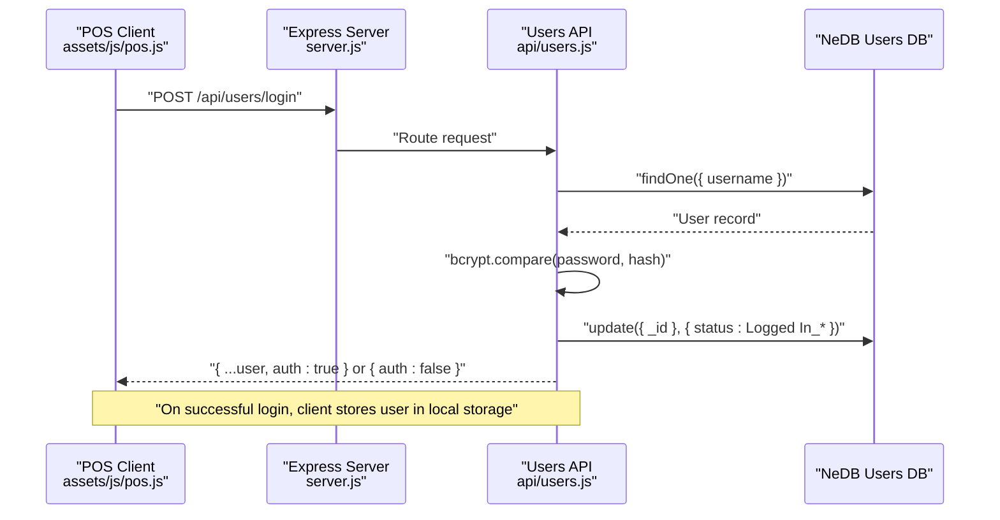
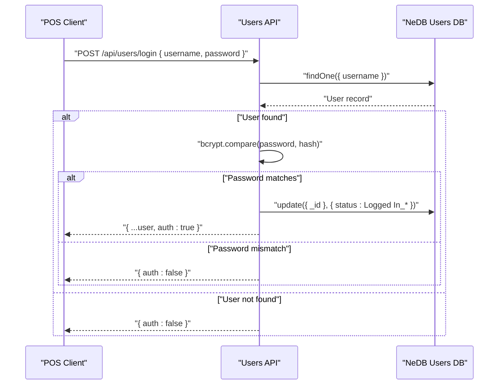
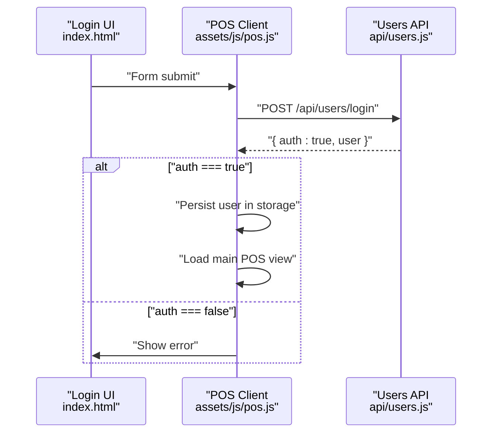
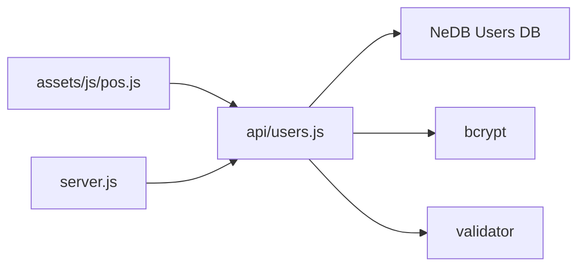

# User Management API

<cite>
**Referenced Files in This Document**
- [users.js](file://api/users.js)
- [server.js](file://server.js)
- [pos.js](file://assets/js/pos.js)
- [utils.js](file://assets/js/utils.js)
- [index.html](file://index.html)
</cite>

## Table of Contents
1. [Introduction](#introduction)
2. [Project Structure](#project-structure)
3. [Core Components](#core-components)
4. [Architecture Overview](#architecture-overview)
5. [Detailed Component Analysis](#detailed-component-analysis)
6. [Dependency Analysis](#dependency-analysis)
7. [Performance Considerations](#performance-considerations)
8. [Troubleshooting Guide](#troubleshooting-guide)
9. [Conclusion](#conclusion)

## Introduction
This document provides comprehensive API documentation for the User Management module of the Point of Sale (POS) application. It covers authentication, authorization, and user administration endpoints, including login/logout, user registration/profile management, permission checking, and role-based access control. It also documents the user schema, password hashing with bcrypt, session management, and integration with the POS interface for permission-based feature access.

## Project Structure
The User Management module is implemented as an Express route module mounted under the /api/users base path. The server initializes middleware and CORS headers globally, while the users module handles database operations using NeDB and bcrypt for password hashing.



**Diagram sources**
- [server.js:1-68](file://server.js#L1-L68)
- [users.js:1-311](file://api/users.js#L1-L311)
- [pos.js:1-2538](file://assets/js/pos.js#L1-L2538)
- [index.html:660-859](file://index.html#L660-L859)

**Section sources**
- [server.js:1-68](file://server.js#L1-L68)
- [users.js:1-311](file://api/users.js#L1-L311)

## Core Components
- Authentication endpoints:
  - POST /api/users/login: Validates credentials and updates user status to logged-in.
  - GET /api/users/logout/:userId: Updates user status to logged-out.
- User administration endpoints:
  - GET /api/users/: Fetch a user by ID.
  - GET /api/users/all: Fetch all users.
  - POST /api/users/post: Create or update a user (including password hashing and permission normalization).
  - DELETE /api/users/user/:userId: Delete a user by ID.
  - GET /api/users/check: Initialize default admin user if not present.

- Client-side integration:
  - POS client authenticates via AJAX to /api/users/login and persists user/session in local storage.
  - Permission flags (perm_products, perm_categories, perm_transactions, perm_users, perm_settings) drive UI visibility and access.

**Section sources**
- [users.js:46-144](file://api/users.js#L46-L144)
- [users.js:179-259](file://api/users.js#L179-L259)
- [users.js:268-311](file://api/users.js#L268-L311)
- [pos.js:2478-2514](file://assets/js/pos.js#L2478-L2514)
- [index.html:660-709](file://index.html#L660-L709)

## Architecture Overview
The User Management API follows a layered architecture:
- Presentation: Express routes in api/users.js expose HTTP endpoints.
- Business Logic: Validation, hashing, permission normalization, and CRUD operations.
- Data Access: NeDB datastore with unique index on username.
- Client Integration: POS client consumes endpoints for login, logout, user listing, and administrative actions.



**Diagram sources**
- [users.js:95-131](file://api/users.js#L95-L131)
- [pos.js:2485-2514](file://assets/js/pos.js#L2485-L2514)

**Section sources**
- [users.js:95-131](file://api/users.js#L95-L131)
- [pos.js:2478-2514](file://assets/js/pos.js#L2478-L2514)

## Detailed Component Analysis

### Authentication Endpoints

#### POST /api/users/login
- Purpose: Authenticate a user by verifying username and password.
- Request body:
  - username: string
  - password: string
- Response:
  - On success: user document with auth=true appended.
  - On failure: { auth: false }.
- Behavior:
  - Escapes username input.
  - Compares password against stored hash.
  - On success, updates user status to "Logged In_<timestamp>".



**Diagram sources**
- [users.js:95-131](file://api/users.js#L95-L131)

**Section sources**
- [users.js:95-131](file://api/users.js#L95-L131)
- [pos.js:2485-2514](file://assets/js/pos.js#L2485-L2514)

#### GET /api/users/logout/:userId
- Purpose: Mark a user as logged out by updating status.
- Path parameters:
  - userId: integer
- Response: 200 OK on success.

**Section sources**
- [users.js:68-86](file://api/users.js#L68-L86)

### User Administration Endpoints

#### GET /api/users/:userId
- Purpose: Retrieve a user by internal ID.
- Path parameters:
  - userId: integer
- Response: User document.

**Section sources**
- [users.js:46-59](file://api/users.js#L46-L59)

#### GET /api/users/all
- Purpose: Retrieve all users.
- Response: Array of user documents.

**Section sources**
- [users.js:140-144](file://api/users.js#L140-L144)

#### POST /api/users/post
- Purpose: Create or update a user.
- Request body:
  - id: string (empty for new user)
  - fullname: string
  - username: string
  - password: string (optional for updates)
  - pass: string (repeat password)
  - perm_products: checkbox-like flag ("on"/other)
  - perm_categories: checkbox-like flag
  - perm_transactions: checkbox-like flag
  - perm_users: checkbox-like flag
  - perm_settings: checkbox-like flag
- Behavior:
  - Hashes password using bcrypt with salt rounds.
  - Normalizes permission flags to 1 or 0; missing flags default to 0 for new users.
  - Assigns a deterministic _id for new users.
  - Inserts new user or updates existing user.
- Response:
  - On insert: new user document.
  - On update: 200 OK.

```mermaid
flowchart TD
Start(["POST /api/users/post"]) --> CheckPass["Has password?"]
CheckPass --> |Yes| Hash["bcrypt.hash(password, saltRounds)"]
CheckPass --> |No| SkipHash["Skip hashing"]
Hash --> NormalizePerms["Normalize permissions:<br/>\"on\" -> 1, else 0"]
SkipHash --> NormalizePerms
NormalizePerms --> NewUser{"id is empty?"}
NewUser --> |Yes| SetID["Set _id = epoch seconds"]
SetID --> Insert["Insert user into DB"]
NewUser --> |No| Update["Update user by _id"]
Insert --> Resp1["Return inserted user"]
Update --> Resp2["Return 200 OK"]
```

**Diagram sources**
- [users.js:179-259](file://api/users.js#L179-L259)

**Section sources**
- [users.js:179-259](file://api/users.js#L179-L259)
- [index.html:660-709](file://index.html#L660-L709)

#### DELETE /api/users/user/:userId
- Purpose: Delete a user by ID.
- Path parameters:
  - userId: integer
- Response: 200 OK on success; 500 on error.

**Section sources**
- [users.js:153-170](file://api/users.js#L153-L170)

#### GET /api/users/check
- Purpose: Initialize default admin user if not present.
- Behavior:
  - Checks for user with _id=1.
  - If absent, creates admin with all permissions enabled and hashed default password.

**Section sources**
- [users.js:268-311](file://api/users.js#L268-L311)

### User Schema
The user document includes the following fields:
- _id: integer (auto-generated for new users)
- username: string (unique)
- password: string (bcrypt hash)
- fullname: string
- perm_products: integer (0 or 1)
- perm_categories: integer (0 or 1)
- perm_transactions: integer (0 or 1)
- perm_users: integer (0 or 1)
- perm_settings: integer (0 or 1)
- status: string (used for login state)

Permission flags are normalized to 0 or 1 during creation/update.

**Section sources**
- [users.js:185-204](file://api/users.js#L185-L204)
- [users.js:278-289](file://api/users.js#L278-L289)

### Session Management and Client Integration
- Login flow:
  - Client submits credentials to /api/users/login.
  - On success, client stores { auth: true, user } in persistent storage and proceeds to main POS view.
- Logout flow:
  - Client calls /api/users/logout/:userId to update status.
- Permission-based UI:
  - Client reads user permissions and hides UI sections that the user lacks access to.



**Diagram sources**
- [pos.js:2478-2514](file://assets/js/pos.js#L2478-L2514)
- [users.js:95-131](file://api/users.js#L95-L131)

**Section sources**
- [pos.js:2478-2514](file://assets/js/pos.js#L2478-L2514)
- [pos.js:250-266](file://assets/js/pos.js#L250-L266)

### Security Measures
- Password hashing:
  - bcrypt is used to hash passwords with configurable salt rounds.
- Input sanitization:
  - Username is escaped before lookup to mitigate injection risks.
- Rate limiting:
  - Express rate limiter is applied globally to reduce abuse.
- Content Security Policy:
  - CSP meta tag is injected dynamically to restrict script/style sources.

**Section sources**
- [users.js:5-6](file://api/users.js#L5-L6)
- [users.js:98](file://api/users.js#L98)
- [server.js:11-14](file://server.js#L11-L14)
- [utils.js:91-99](file://assets/js/utils.js#L91-L99)

## Dependency Analysis
- Internal dependencies:
  - api/users.js depends on NeDB for persistence and bcrypt for hashing.
  - assets/js/pos.js depends on api/users.js for authentication and user management.
- External dependencies:
  - Express, body-parser, rate-limiter, bcrypt, validator, and NeDB.



**Diagram sources**
- [users.js:1-311](file://api/users.js#L1-L311)
- [server.js:1-68](file://server.js#L1-L68)
- [pos.js:1-2538](file://assets/js/pos.js#L1-L2538)

**Section sources**
- [users.js:1-311](file://api/users.js#L1-L311)
- [server.js:1-68](file://server.js#L1-L68)
- [pos.js:1-2538](file://assets/js/pos.js#L1-L2538)

## Performance Considerations
- Indexing:
  - Unique index on username reduces lookup cost.
- Hashing cost:
  - bcrypt hashing occurs on create/update; consider adjusting salt rounds for performance vs. security balance.
- Network overhead:
  - Minimize payload sizes by avoiding unnecessary fields in user documents.
- Rate limiting:
  - Global rate limiter helps protect endpoints from abuse.

**Section sources**
- [users.js:26](file://api/users.js#L26)
- [server.js:11-14](file://server.js#L11-L14)

## Troubleshooting Guide
- Login fails:
  - Verify username exists and password matches hash.
  - Check for errors returned by bcrypt compare.
- Update/create user fails:
  - Confirm password hashing completes successfully.
  - Review permission normalization logic for missing flags.
- CORS errors:
  - Ensure Access-Control-Allow-Origin and headers are set for cross-origin requests.
- Permission UI not updating:
  - Confirm user permissions are correctly persisted and retrieved from storage.

**Section sources**
- [users.js:103-129](file://api/users.js#L103-L129)
- [users.js:250-258](file://api/users.js#L250-L258)
- [server.js:22-34](file://server.js#L22-L34)
- [pos.js:250-2514](file://assets/js/pos.js#L250-L2514)

## Conclusion
The User Management API provides a focused set of endpoints for authentication, user administration, and permission-driven access control. It leverages bcrypt for secure password handling, maintains a normalized permission model, and integrates tightly with the POS client to enforce role-based feature visibility. The architecture is straightforward and suitable for desktop deployments, with room to enhance session management and security controls as requirements evolve.