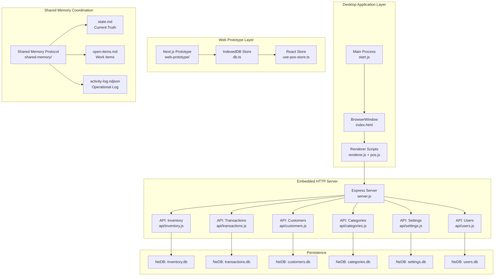
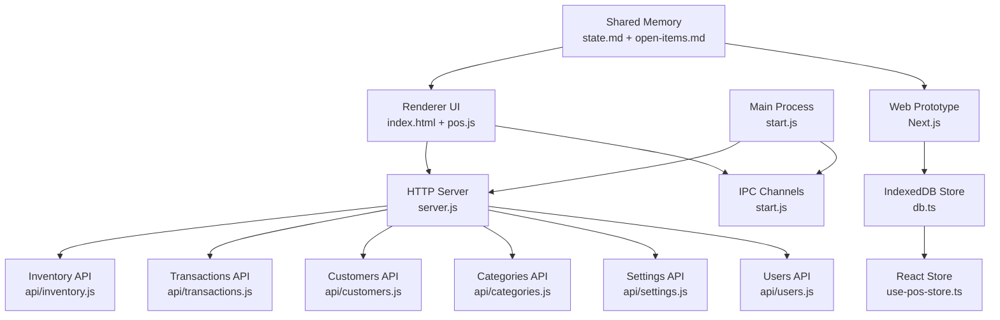
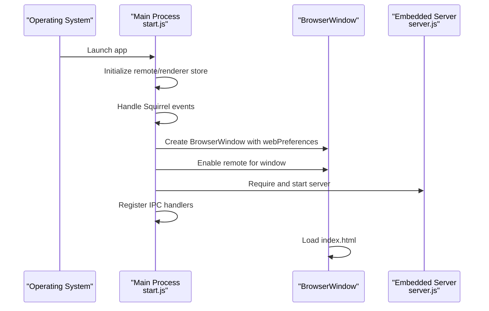
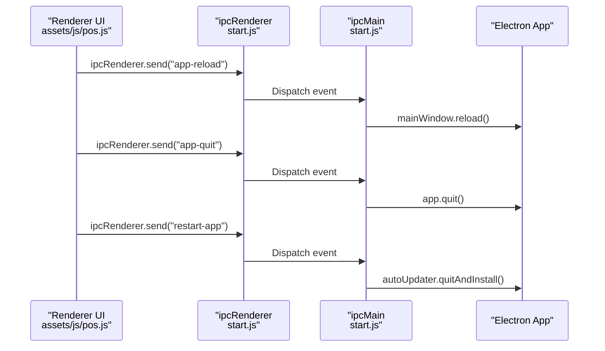
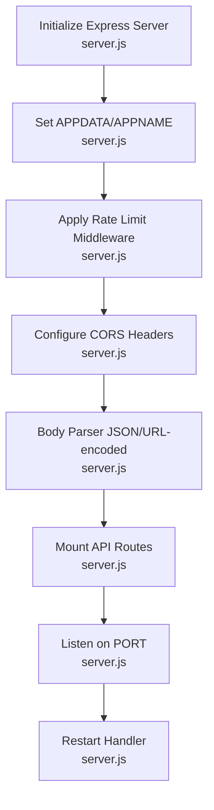
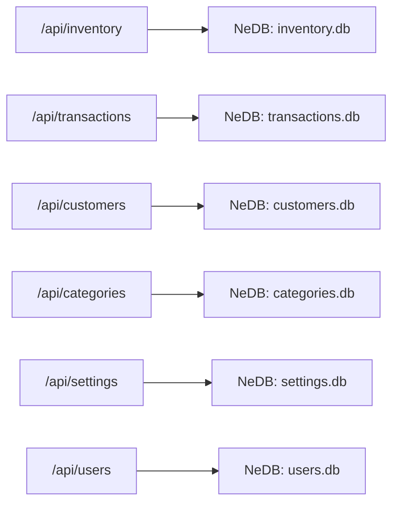
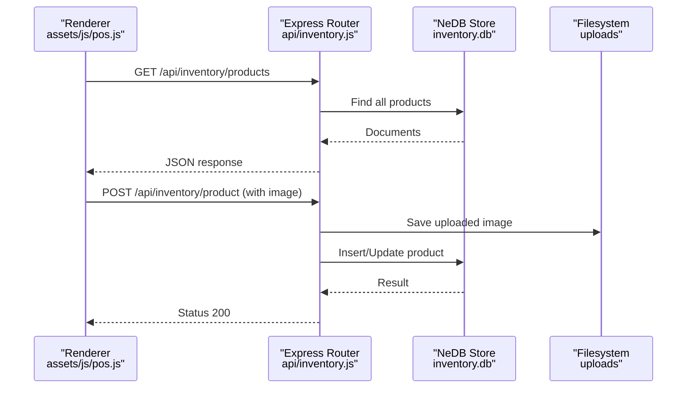
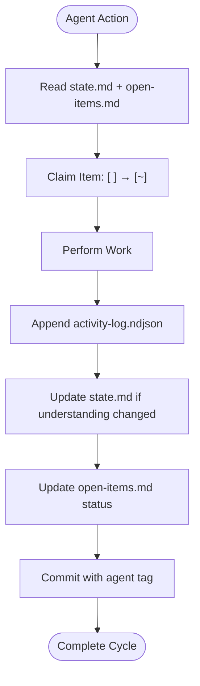
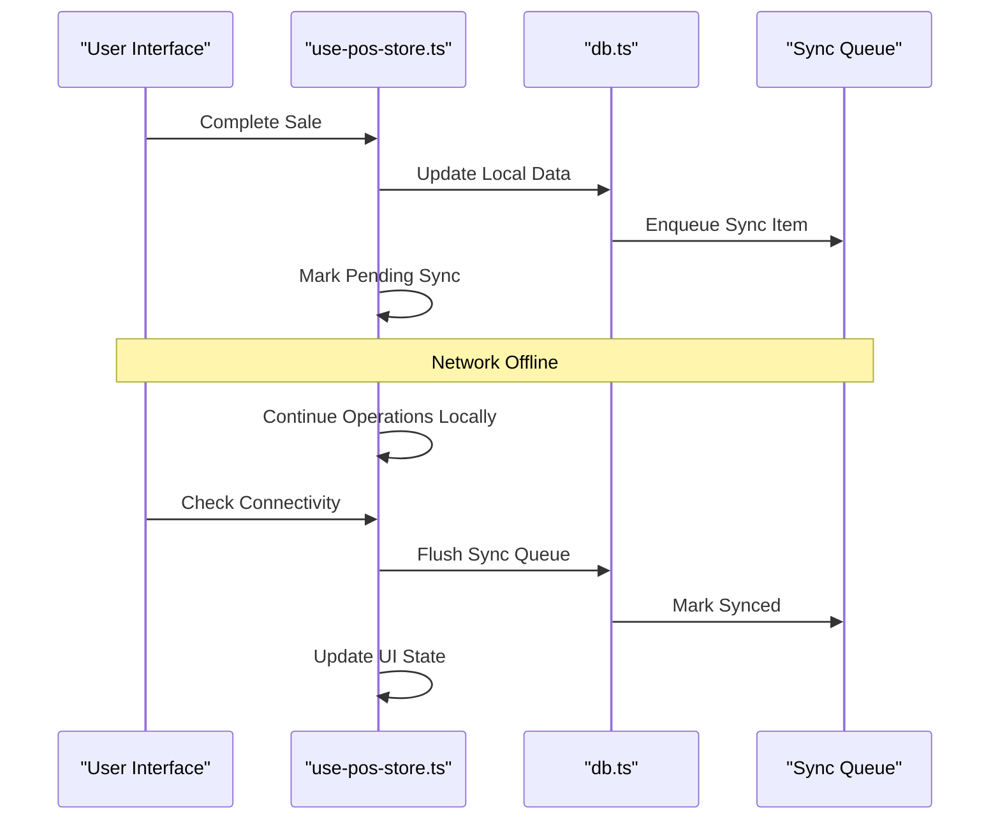
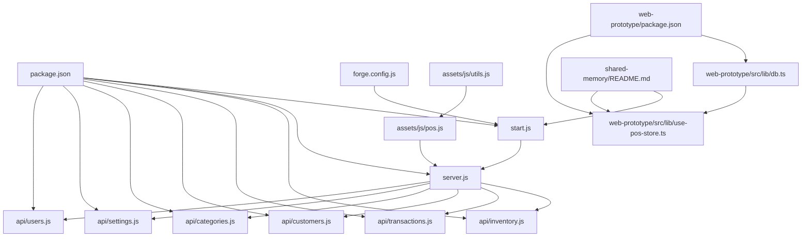

# Architecture Overview

<cite>
**Referenced Files in This Document**
- [package.json](file://package.json)
- [forge.config.js](file://forge.config.js)
- [start.js](file://start.js)
- [server.js](file://server.js)
- [index.html](file://index.html)
- [renderer.js](file://renderer.js)
- [assets/js/pos.js](file://assets/js/pos.js)
- [assets/js/utils.js](file://assets/js/utils.js)
- [api/inventory.js](file://api/inventory.js)
- [api/transactions.js](file://api/transactions.js)
- [api/customers.js](file://api/customers.js)
- [api/categories.js](file://api/categories.js)
- [api/settings.js](file://api/settings.js)
- [api/users.js](file://api/users.js)
- [app.config.js](file://app.config.js)
- [shared-memory/README.md](file://shared-memory/README.md)
- [shared-memory/state.md](file://shared-memory/state.md)
- [shared-memory/activity-log.ndjson](file://shared-memory/activity-log.ndjson)
- [shared-memory/open-items.md](file://shared-memory/open-items.md)
- [web-prototype/README.md](file://web-prototype/README.md)
- [web-prototype/package.json](file://web-prototype/package.json)
- [web-prototype/src/lib/db.ts](file://web-prototype/src/lib/db.ts)
- [web-prototype/src/lib/use-pos-store.ts](file://web-prototype/src/lib/use-pos-store.ts)
</cite>

## Update Summary
**Changes Made**
- Added comprehensive documentation for shared memory coordination architecture
- Documented web-based system design patterns with Next.js prototype
- Enhanced architecture overview to include multi-agent coordination patterns
- Added web prototype architecture with offline-first design
- Integrated shared memory protocol into system boundaries and data flow patterns

## Table of Contents
1. [Introduction](#introduction)
2. [Project Structure](#project-structure)
3. [Core Components](#core-components)
4. [Architecture Overview](#architecture-overview)
5. [Detailed Component Analysis](#detailed-component-analysis)
6. [Shared Memory Coordination Architecture](#shared-memory-coordination-architecture)
7. [Web-Based System Design Patterns](#web-based-system-design-patterns)
8. [Dependency Analysis](#dependency-analysis)
9. [Performance Considerations](#performance-considerations)
10. [Troubleshooting Guide](#troubleshooting-guide)
11. [Conclusion](#conclusion)
12. [Appendices](#appendices)

## Introduction
This document describes the architecture of the PharmaSpot POS desktop application. It is a hybrid desktop application built with Electron, embedding a local HTTP server powered by Express.js. The application now features a dual architecture approach with traditional desktop components and a modern web-based prototype system. The desktop architecture maintains Electron's main process with BrowserWindow configuration and IPC communication, while the embedded Express server provides REST endpoints for business domains. Additionally, a sophisticated shared memory coordination system enables multi-agent collaboration, and a Next.js web prototype demonstrates future web-based deployment patterns with offline-first capabilities.

## Project Structure
The repository follows a hybrid architecture pattern with three distinct layers:
- **Desktop Layer**: Traditional Electron application with main process, BrowserWindow, and embedded HTTP server
- **Web Prototype Layer**: Next.js-based offline-first POS prototype with IndexedDB persistence
- **Coordination Layer**: Shared memory system enabling multi-agent collaboration and knowledge sharing

**Diagram sources**
- [start.js:1-107](file://start.js#L1-L107)
- [server.js:1-68](file://server.js#L1-L68)
- [api/inventory.js:1-333](file://api/inventory.js#L1-L333)
- [api/transactions.js:1-251](file://api/transactions.js#L1-L251)
- [api/customers.js:1-151](file://api/customers.js#L1-L151)
- [api/categories.js:1-124](file://api/categories.js#L1-L124)
- [api/settings.js:1-192](file://api/settings.js#L1-L192)
- [api/users.js:1-311](file://api/users.js#L1-L311)
- [web-prototype/src/lib/db.ts:1-241](file://web-prototype/src/lib/db.ts#L1-L241)
- [web-prototype/src/lib/use-pos-store.ts:1-434](file://web-prototype/src/lib/use-pos-store.ts#L1-L434)
- [shared-memory/README.md:1-85](file://shared-memory/README.md#L1-L85)

**Section sources**
- [package.json:1-147](file://package.json#L1-L147)
- [forge.config.js:1-71](file://forge.config.js#L1-L71)
- [start.js:1-107](file://start.js#L1-L107)
- [server.js:1-68](file://server.js#L1-L68)
- [index.html:1-884](file://index.html#L1-L884)
- [renderer.js:1-5](file://renderer.js#L1-L5)
- [assets/js/pos.js:1-800](file://assets/js/pos.js#L1-L800)
- [assets/js/utils.js:1-112](file://assets/js/utils.js#L1-L112)
- [web-prototype/README.md:1-21](file://web-prototype/README.md#L1-L21)
- [web-prototype/package.json:1-34](file://web-prototype/package.json#L1-L34)
- [shared-memory/README.md:1-85](file://shared-memory/README.md#L1-L85)

## Core Components
- **Main Process (start.js)**: Initializes Electron remote, sets up context menu, builds the application menu, creates and manages the BrowserWindow, handles app lifecycle events, registers IPC channels, and starts the embedded server.
- **Embedded HTTP Server (server.js)**: Creates an Express app backed by an HTTP server, configures body parsing, rate limiting, CORS, and mounts API routers for inventory, customers, categories, settings, users, and transactions.
- **Renderer (index.html + renderer.js + pos.js)**: Loads UI shell, jQuery, and application logic; constructs API base URL from environment variables; performs AJAX requests to the embedded server; applies Content Security Policy based on computed hashes.
- **APIs (api/*.js)**: Each domain module exports an Express router, configures body parsing, initializes NeDB stores, and implements CRUD endpoints with validation and sanitization.
- **Persistence (NeDB)**: Each API module manages its own NeDB datastore under the application data directory, ensuring unique indexes and safe updates.
- **Web Prototype (Next.js)**: Modern web-based POS prototype with offline-first architecture, IndexedDB persistence, React hooks, and comprehensive observability.
- **Shared Memory System**: File-based coordination layer enabling multi-agent collaboration with structured state management and activity logging.

**Section sources**
- [start.js:1-107](file://start.js#L1-L107)
- [server.js:1-68](file://server.js#L1-L68)
- [index.html:1-884](file://index.html#L1-L884)
- [renderer.js:1-5](file://renderer.js#L1-L5)
- [assets/js/pos.js:1-800](file://assets/js/pos.js#L1-L800)
- [assets/js/utils.js:1-112](file://assets/js/utils.js#L1-L112)
- [api/inventory.js:1-333](file://api/inventory.js#L1-L333)
- [api/transactions.js:1-251](file://api/transactions.js#L1-L251)
- [api/customers.js:1-151](file://api/customers.js#L1-L151)
- [api/categories.js:1-124](file://api/categories.js#L1-L124)
- [api/settings.js:1-192](file://api/settings.js#L1-L192)
- [api/users.js:1-311](file://api/users.js#L1-L311)
- [web-prototype/src/lib/db.ts:1-241](file://web-prototype/src/lib/db.ts#L1-L241)
- [web-prototype/src/lib/use-pos-store.ts:1-434](file://web-prototype/src/lib/use-pos-store.ts#L1-L434)
- [shared-memory/README.md:1-85](file://shared-memory/README.md#L1-L85)

## Architecture Overview
PharmaSpot employs a hybrid desktop architecture with modern web-based extensions:
- **Electron main process** controls the OS-level application lifecycle and window management.
- **Local Express server** runs embedded within the app, exposing REST endpoints for all business domains.
- **Renderer process** consumes these endpoints to manage POS operations, inventory, transactions, users, and settings.
- **Web prototype** provides a Next.js-based offline-first alternative with IndexedDB persistence.
- **Shared memory system** coordinates multi-agent collaboration through structured file-based protocols.
- **Cross-platform packaging** handled by Electron Forge with platform-specific makers and publishers.

**Diagram sources**
- [start.js:1-107](file://start.js#L1-L107)
- [server.js:1-68](file://server.js#L1-L68)
- [api/inventory.js:1-333](file://api/inventory.js#L1-L333)
- [api/transactions.js:1-251](file://api/transactions.js#L1-L251)
- [api/customers.js:1-151](file://api/customers.js#L1-L151)
- [api/categories.js:1-124](file://api/categories.js#L1-L124)
- [api/settings.js:1-192](file://api/settings.js#L1-L192)
- [api/users.js:1-311](file://api/users.js#L1-L311)
- [web-prototype/src/lib/db.ts:1-241](file://web-prototype/src/lib/db.ts#L1-L241)
- [web-prototype/src/lib/use-pos-store.ts:1-434](file://web-prototype/src/lib/use-pos-store.ts#L1-L434)
- [shared-memory/state.md:1-29](file://shared-memory/state.md#L1-L29)
- [shared-memory/open-items.md:1-17](file://shared-memory/open-items.md#L1-L17)

## Detailed Component Analysis

### Main Process Architecture
Responsibilities:
- Initialize Electron remote and renderer store.
- Handle Squirrel installer events and startup conditions.
- Create BrowserWindow with full-screen and Node integration settings.
- Enable remote module access for the created window.
- Register IPC channels for quitting, reloading, and auto-update installation.
- Set up context menu with refresh option.
- Start embedded server and expose restart capability.

**Diagram sources**
- [start.js:1-107](file://start.js#L1-L107)

**Section sources**
- [start.js:1-107](file://start.js#L1-L107)

### BrowserWindow and Renderer Initialization
- BrowserWindow is created with maximized dimensions based on the primary display, Node integration enabled, and remote module disabled.
- The renderer loads jQuery and application scripts, then proceeds to authenticate and fetch initial data from the embedded server.

**Diagram sources**
- [start.js:21-45](file://start.js#L21-L45)
- [renderer.js:1-5](file://renderer.js#L1-L5)
- [assets/js/pos.js:185-214](file://assets/js/pos.js#L185-L214)

**Section sources**
- [start.js:21-45](file://start.js#L21-L45)
- [renderer.js:1-5](file://renderer.js#L1-L5)
- [assets/js/pos.js:185-214](file://assets/js/pos.js#L185-L214)

### IPC Communication Patterns
- Channels:
  - app-quit: Requests the main process to quit the app.
  - app-reload: Reloads the main window.
  - restart-app: Triggers auto-updater to quit and install.
- Context menu provides a quick refresh action that reloads the window.

**Diagram sources**
- [start.js:75-85](file://start.js#L75-L85)
- [assets/js/pos.js:185-214](file://assets/js/pos.js#L185-L214)

**Section sources**
- [start.js:75-85](file://start.js#L75-L85)

### Express Server Integration and Middleware Stack
- Server initialization:
  - Creates HTTP server backed by Express.
  - Sets APPDATA and APPNAME environment variables for data paths.
  - Configures rate limiting and global CORS headers.
  - Parses JSON and URL-encoded bodies.
- Routing:
  - Mounts API routers under /api/inventory, /api/customers, /api/categories, /api/settings, /api/users, and /api/transactions.
- Restart mechanism:
  - Clears cached modules matching API and server files, then re-requires the server module.

**Diagram sources**
- [server.js:1-68](file://server.js#L1-L68)

**Section sources**
- [server.js:1-68](file://server.js#L1-L68)

### Routing Structure and Domain APIs
- **Inventory API**:
  - CRUD for products, SKU lookup, image upload, and decrement inventory on transaction completion.
- **Transactions API**:
  - CRUD for transactions, retrieval by date/user/till/status, and triggers inventory decrement upon payment.
- **Customers API**:
  - CRUD for customers.
- **Categories API**:
  - CRUD for categories.
- **Settings API**:
  - CRUD for application settings with logo upload.
- **Users API**:
  - Authentication, CRUD for users, and default admin initialization.

**Diagram sources**
- [api/inventory.js:1-333](file://api/inventory.js#L1-L333)
- [api/transactions.js:1-251](file://api/transactions.js#L1-L251)
- [api/customers.js:1-151](file://api/customers.js#L1-L151)
- [api/categories.js:1-124](file://api/categories.js#L1-L124)
- [api/settings.js:1-192](file://api/settings.js#L1-L192)
- [api/users.js:1-311](file://api/users.js#L1-L311)

**Section sources**
- [api/inventory.js:1-333](file://api/inventory.js#L1-L333)
- [api/transactions.js:1-251](file://api/transactions.js#L1-L251)
- [api/customers.js:1-151](file://api/customers.js#L1-L151)
- [api/categories.js:1-124](file://api/categories.js#L1-L124)
- [api/settings.js:1-192](file://api/settings.js#L1-L192)
- [api/users.js:1-311](file://api/users.js#L1-L311)

### Technology Stack
- **Desktop Framework**: Electron (main process and BrowserWindow)
- **Backend**: Node.js with Express.js for embedded HTTP server
- **Database**: NeDB (@seald-io/nedb) for local persistence
- **Frontend**: jQuery, Bootstrap, and custom JavaScript modules
- **Web Prototype**: Next.js, React, TypeScript, IndexedDB
- **Packaging**: Electron Forge with platform-specific makers and GitHub publisher
- **Additional Libraries**: bcrypt, validator, lodash, moment, jsbarcode, jspdf, html2canvas, notiflix, socket.io, multer, archiver, unzipper, sanitize-filename, electron-updater, electron-store, electron-context-menu, electron-squirrel-startup, xmlhttprequest

**Section sources**
- [package.json:18-54](file://package.json#L18-L54)
- [forge.config.js:21-38](file://forge.config.js#L21-L38)
- [web-prototype/package.json:18-32](file://web-prototype/package.json#L18-L32)

### System Boundaries and Data Flow Patterns
- **Internal Boundary**:
  - Main process controls BrowserWindow and IPC.
  - Renderer communicates with embedded server via HTTP.
  - Server routes requests to domain-specific routers.
  - Each router persists to its NeDB store.
  - Web prototype operates independently with IndexedDB.
  - Shared memory system coordinates both desktop and web components.
- **External Boundary**:
  - Packaging and publishing handled by Electron Forge.
  - Auto-update configuration references external update server.
  - Web prototype deployment via standard Next.js build/deploy processes.

**Diagram sources**
- [assets/js/pos.js:267-354](file://assets/js/pos.js#L267-L354)
- [api/inventory.js:111-240](file://api/inventory.js#L111-L240)

**Section sources**
- [assets/js/pos.js:267-354](file://assets/js/pos.js#L267-L354)
- [api/inventory.js:111-240](file://api/inventory.js#L111-L240)

### Cross-Platform Considerations and Packaging Strategy
- **Packaging**:
  - Electron Forge makers for Windows (Squirrel, WiX), Linux (deb, rpm), and macOS (dmg).
  - asar enabled, with selective ignore rules.
  - Hooks to prune node_gyp_bins on Linux post-prune.
- **Publishers**:
  - GitHub publisher configured to release drafts.
- **Deployment**:
  - Auto-updater configured to target an external update server.
  - Web prototype supports standard Next.js deployment pipelines.

**Section sources**
- [forge.config.js:1-71](file://forge.config.js#L1-L71)
- [app.config.js:1-8](file://app.config.js#L1-L8)

## Shared Memory Coordination Architecture

### Protocol Overview
The shared memory system provides a file-based coordination layer enabling multiple AI agents (Codex, Antigravity, Gemini, etc.) to collaborate on the PharmaSpot project while maintaining context and preventing conflicts. The system uses structured Markdown and NDJSON formats for human-readable, machine-parseable coordination.

### Core Files and Responsibilities
- **state.md**: Current truth containing context, user preferences, active decisions, blockers, and next actions
- **open-items.md**: Unresolved items, in-progress locks, and handoffs with checkbox-based status tracking
- **activity-log.ndjson**: Append-only operational log of actions with UTC timestamps
- **README.md**: Protocol specification and workflow guidelines

### Workflow Patterns
**Starting Work**:
1. Read current state and open items
2. Claim an item by changing checkbox status
3. Perform the work
4. Complete the cycle with proper logging and updates

**Finishing Work**:
1. Append activity log entry
2. Update shared state if understanding changed
3. Update open items status (done, handoff, or revert)
4. Commit with agent-tagged message

### Conflict Avoidance and Recovery
- **Conflict Prevention**: Items marked as `[~] in progress` cannot be edited by other agents
- **Branch Strategy**: Feature branches recommended for complex work with clear commit history
- **Resolution**: Earlier commits take precedence; later claims revert automatically
- **Recovery**: State can be reconciled from activity log and changelog when stale

**Diagram sources**
- [shared-memory/README.md:17-27](file://shared-memory/README.md#L17-L27)
- [shared-memory/README.md:76-85](file://shared-memory/README.md#L76-L85)

**Section sources**
- [shared-memory/README.md:1-85](file://shared-memory/README.md#L1-L85)
- [shared-memory/state.md:1-29](file://shared-memory/state.md#L1-L29)
- [shared-memory/open-items.md:1-17](file://shared-memory/open-items.md#L1-L17)
- [shared-memory/activity-log.ndjson:1-45](file://shared-memory/activity-log.ndjson#L1-L45)

## Web-Based System Design Patterns

### Next.js Prototype Architecture
The web prototype represents PharmaSpot's future direction with a modern, offline-first architecture built on Next.js. This component complements the traditional Electron desktop application while demonstrating advanced web technologies and deployment patterns.

### Core Components
- **Database Layer (db.ts)**: IndexedDB wrapper with automatic migrations, seed data, and transaction queuing
- **State Management (use-pos-store.ts)**: React hooks-based store with observability, feature flags, and sync orchestration
- **Offline-First Design**: All data operations work without network connectivity, with automatic sync when online
- **Type Safety**: Full TypeScript implementation with comprehensive type definitions

### Offline-First Implementation
The web prototype implements a sophisticated offline-first architecture:
- **IndexedDB Storage**: Local persistence for all business entities (products, transactions, users, settings)
- **Transaction Queue**: Automatic queuing of operations during offline periods
- **Automatic Sync**: Seamless synchronization when network connectivity resumes
- **Conflict Resolution**: Built-in handling of concurrent modifications

### Observability and Quality Gates
- **Structured Logging**: Comprehensive logging with timestamps and contextual information
- **Performance Monitoring**: Real-time tracking of critical performance metrics
- **Quality Gates**: Automated testing pipeline including unit, integration, and contract tests
- **Rollout Controls**: Feature flags and migration strategies for safe deployments

**Diagram sources**
- [web-prototype/src/lib/use-pos-store.ts:206-260](file://web-prototype/src/lib/use-pos-store.ts#L206-L260)
- [web-prototype/src/lib/db.ts:186-215](file://web-prototype/src/lib/db.ts#L186-L215)

**Section sources**
- [web-prototype/README.md:1-21](file://web-prototype/README.md#L1-L21)
- [web-prototype/package.json:1-34](file://web-prototype/package.json#L1-L34)
- [web-prototype/src/lib/db.ts:1-241](file://web-prototype/src/lib/db.ts#L1-L241)
- [web-prototype/src/lib/use-pos-store.ts:1-434](file://web-prototype/src/lib/use-pos-store.ts#L1-L434)

## Dependency Analysis
High-level dependencies:
- **Desktop Dependencies**: Main depends on Electron, Express server, and API modules.
- **Web Prototype Dependencies**: Next.js, React, TypeScript, and IndexedDB abstraction layer.
- **Shared Memory Dependencies**: File system operations and structured data formats.
- **Renderer Dependencies**: jQuery, application scripts, and environment-derived API base URL.
- **API Dependencies**: NeDB, body-parser, validator, bcrypt, multer, sanitize-filename, and filesystem utilities.
- **Packaging Dependencies**: Electron Forge and platform-specific tools.

**Diagram sources**
- [package.json:1-147](file://package.json#L1-L147)
- [forge.config.js:1-71](file://forge.config.js#L1-L71)
- [start.js:1-107](file://start.js#L1-L107)
- [server.js:1-68](file://server.js#L1-L68)
- [assets/js/pos.js:1-800](file://assets/js/pos.js#L1-L800)
- [assets/js/utils.js:1-112](file://assets/js/utils.js#L1-L112)
- [api/inventory.js:1-333](file://api/inventory.js#L1-L333)
- [api/transactions.js:1-251](file://api/transactions.js#L1-L251)
- [api/customers.js:1-151](file://api/customers.js#L1-L151)
- [api/categories.js:1-124](file://api/categories.js#L1-L124)
- [api/settings.js:1-192](file://api/settings.js#L1-L192)
- [api/users.js:1-311](file://api/users.js#L1-L311)
- [web-prototype/package.json:1-34](file://web-prototype/package.json#L1-L34)
- [web-prototype/src/lib/db.ts:1-241](file://web-prototype/src/lib/db.ts#L1-L241)
- [web-prototype/src/lib/use-pos-store.ts:1-434](file://web-prototype/src/lib/use-pos-store.ts#L1-L434)
- [shared-memory/README.md:1-85](file://shared-memory/README.md#L1-L85)

**Section sources**
- [package.json:1-147](file://package.json#L1-L147)
- [forge.config.js:1-71](file://forge.config.js#L1-L71)

## Performance Considerations
- **Local embedded server** reduces network latency for desktop operations.
- **Rate limiting** mitigates abuse on local endpoints.
- **NeDB** is lightweight and suitable for desktop-scale data; consider indexing strategies and periodic compaction for large datasets.
- **Image uploads** are constrained by file size and type filters; ensure upload paths are writable under the application data directory.
- **Renderer-side caching** of lists (users, products, categories) reduces repeated network calls.
- **Web prototype optimizations**: IndexedDB performance tuning, efficient React component rendering, and lazy loading strategies.
- **Offline-first benefits**: Eliminates network dependency for core POS operations, improving reliability in various environments.

## Troubleshooting Guide
- **Server fails to start or bind to port**:
  - Verify PORT environment variable and availability; the server logs the bound port.
- **CORS errors in renderer**:
  - Global CORS headers are set; confirm client requests match allowed methods and headers.
- **Authentication failures**:
  - Ensure default admin initialization occurs; verify hashed passwords and unique usernames.
- **File upload issues**:
  - Confirm upload directory exists under application data; validate file types and sizes.
- **Auto-update not triggering**:
  - Check update server configuration and publisher settings.
- **Web prototype offline issues**:
  - Verify IndexedDB availability and permissions; check browser compatibility.
- **Shared memory conflicts**:
  - Monitor open-items status; resolve conflicts by following the protocol's conflict resolution guidelines.
- **Multi-agent coordination problems**:
  - Ensure proper agent tagging in commits; follow the structured workflow patterns.

**Section sources**
- [server.js:47-50](file://server.js#L47-L50)
- [assets/js/utils.js:91-99](file://assets/js/utils.js#L91-L99)
- [api/users.js:268-311](file://api/users.js#L268-L311)
- [api/inventory.js:28-39](file://api/inventory.js#L28-L39)
- [app.config.js:1-8](file://app.config.js#L1-L8)
- [web-prototype/src/lib/db.ts:99-115](file://web-prototype/src/lib/db.ts#L99-L115)
- [shared-memory/README.md:76-85](file://shared-memory/README.md#L76-L85)

## Conclusion
PharmaSpot POS combines Electron's desktop capabilities with an embedded Express server and modern web-based extensions to deliver a comprehensive, cross-platform point-of-sale solution. The architecture now features a sophisticated multi-agent coordination system through shared memory protocols, enabling collaborative development while maintaining the reliability of the traditional desktop application. The Next.js web prototype demonstrates future deployment patterns with offline-first capabilities, comprehensive observability, and robust quality assurance processes. This hybrid approach ensures continuity for existing users while positioning PharmaSpot for future web-based deployment scenarios.

## Appendices
- **Packaging and Publishing**:
  - Makers: zip, squirrel (Windows), wix (Windows), deb/rpm (Linux), dmg (macOS).
  - Publishers: GitHub (draft releases).
- **Update Server**:
  - External update server configured for auto-updates.
- **Web Prototype Deployment**:
  - Standard Next.js build and deploy processes.
  - Quality gates: typecheck, unit tests, integration tests, contract tests, security scans.
- **Shared Memory Protocol**:
  - Human-readable, machine-parseable coordination system.
  - Structured formats: Markdown for state, NDJSON for activity logs.
  - Multi-agent collaboration with conflict prevention and recovery mechanisms.

**Section sources**
- [forge.config.js:21-51](file://forge.config.js#L21-L51)
- [app.config.js:1-8](file://app.config.js#L1-L8)
- [web-prototype/README.md:5-21](file://web-prototype/README.md#L5-L21)
- [shared-memory/README.md:28-85](file://shared-memory/README.md#L28-L85)