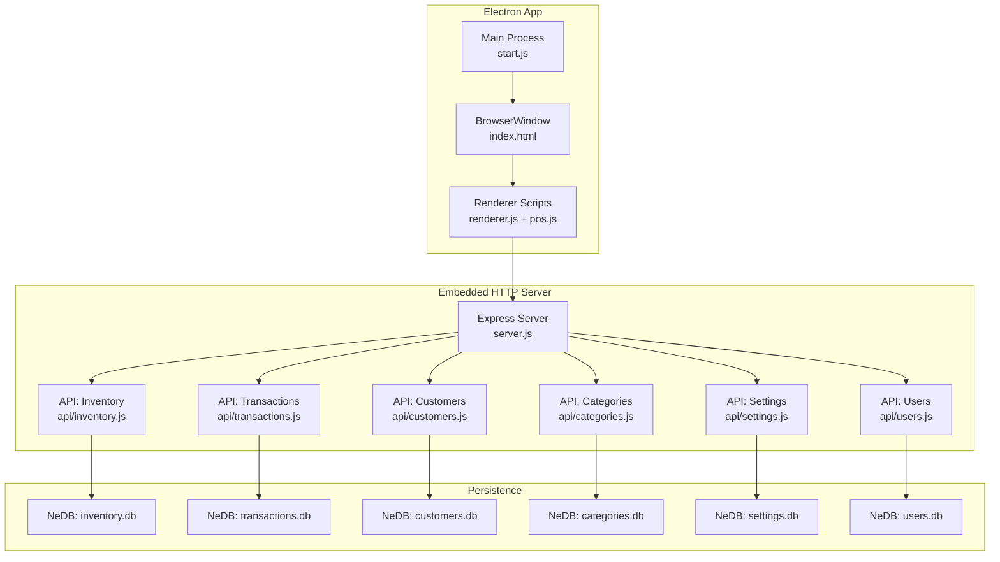
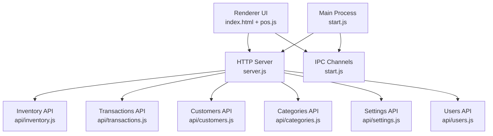
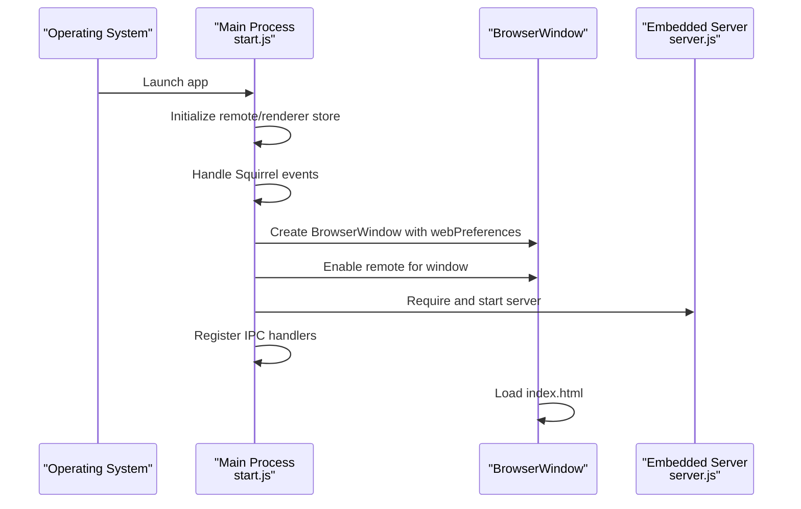
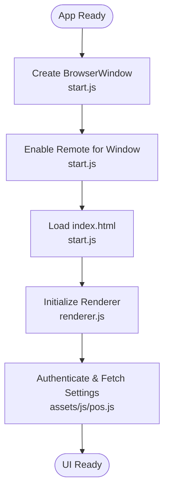
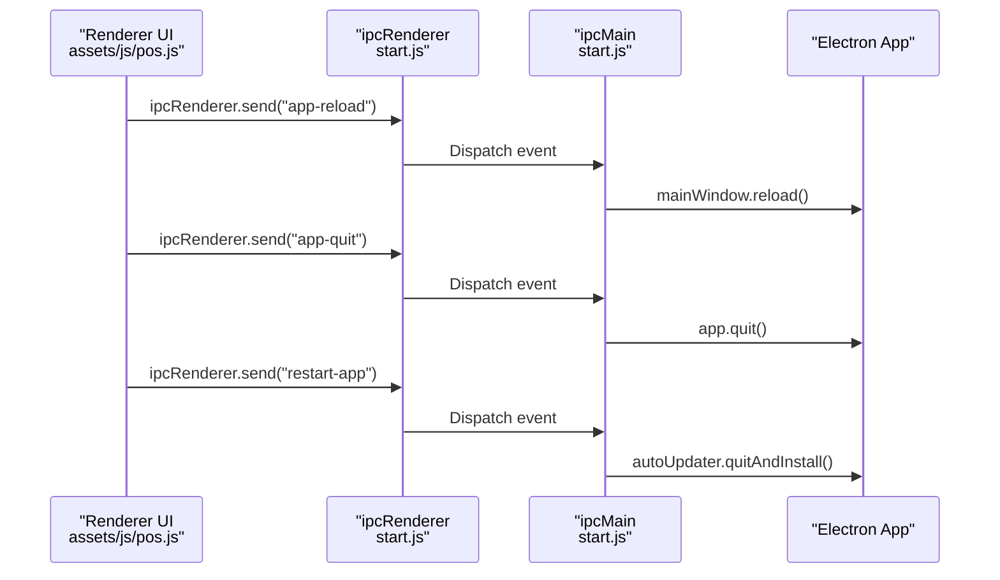
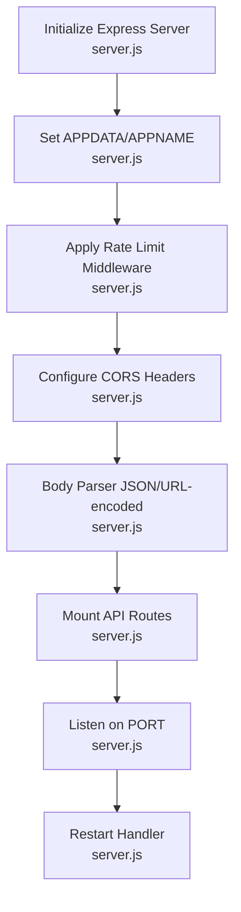
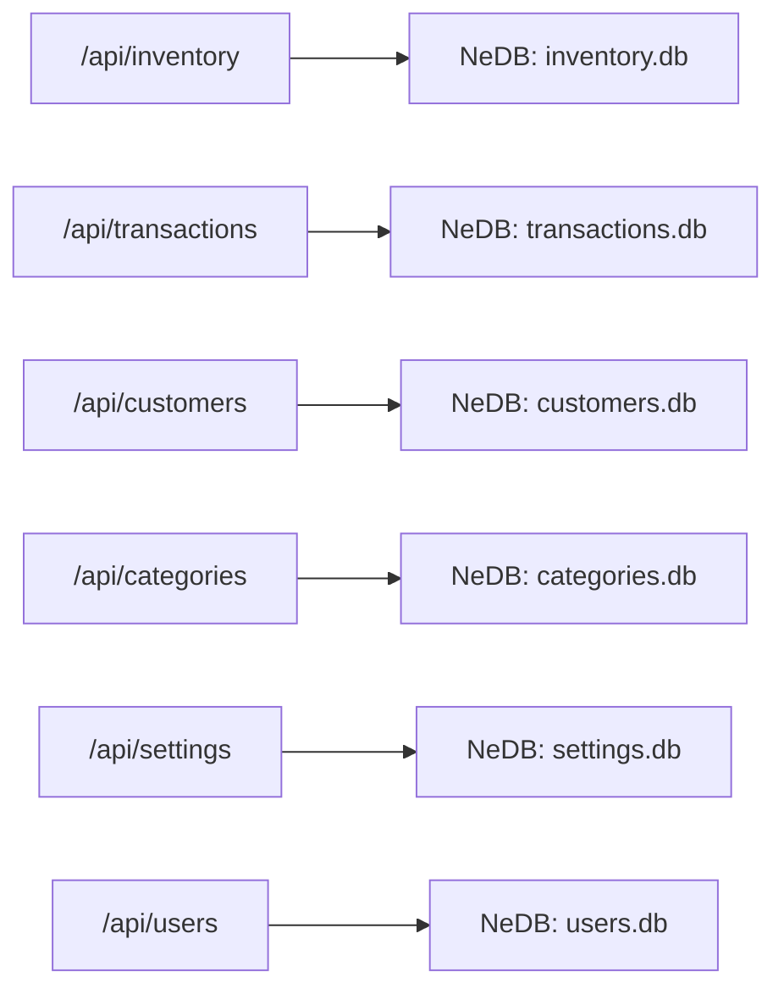
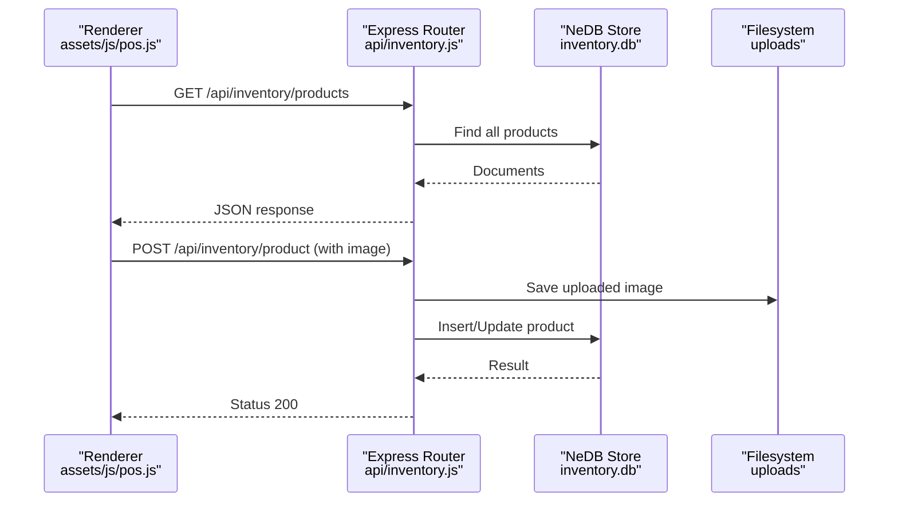
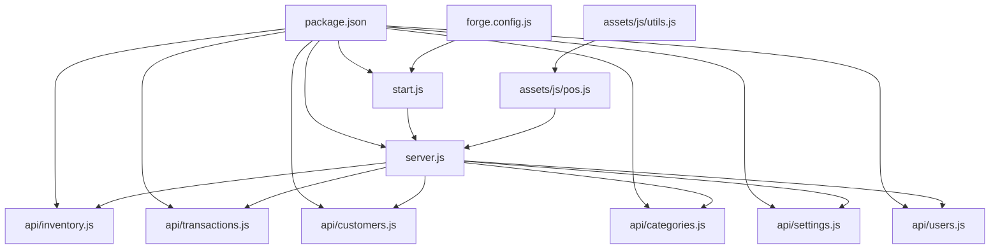

# Architecture Overview

<cite>
**Referenced Files in This Document**
- [package.json](file://package.json)
- [forge.config.js](file://forge.config.js)
- [start.js](file://start.js)
- [server.js](file://server.js)
- [index.html](file://index.html)
- [renderer.js](file://renderer.js)
- [assets/js/pos.js](file://assets/js/pos.js)
- [assets/js/utils.js](file://assets/js/utils.js)
- [api/inventory.js](file://api/inventory.js)
- [api/transactions.js](file://api/transactions.js)
- [api/customers.js](file://api/customers.js)
- [api/categories.js](file://api/categories.js)
- [api/settings.js](file://api/settings.js)
- [api/users.js](file://api/users.js)
- [app.config.js](file://app.config.js)
</cite>

## Table of Contents
1. [Introduction](#introduction)
2. [Project Structure](#project-structure)
3. [Core Components](#core-components)
4. [Architecture Overview](#architecture-overview)
5. [Detailed Component Analysis](#detailed-component-analysis)
6. [Dependency Analysis](#dependency-analysis)
7. [Performance Considerations](#performance-considerations)
8. [Troubleshooting Guide](#troubleshooting-guide)
9. [Conclusion](#conclusion)
10. [Appendices](#appendices)

## Introduction
This document describes the architecture of the PharmaSpot POS desktop application. It is a hybrid desktop application built with Electron, embedding a local HTTP server powered by Express.js. The renderer process communicates with the embedded server via HTTP endpoints, while the main process manages the application lifecycle, BrowserWindow configuration, and inter-process communication (IPC). Data persistence uses NeDB (via @seald-io/nedb) stored under the application data directory. Packaging and distribution leverage Electron Forge across Windows, Linux, and macOS.

## Project Structure
The repository follows a conventional Electron layout:
- Main process entry initializes the app, creates the BrowserWindow, enables remote module support, registers IPC handlers, and starts the embedded server.
- Renderer process loads jQuery and application scripts, constructs API URLs from environment variables, and performs AJAX calls to the embedded server.
- Embedded server exposes REST endpoints grouped by domain (inventory, transactions, customers, categories, settings, users) using Express.js and NeDB for persistence.
- Packaging configuration defines cross-platform builders and publishers.

**Diagram sources**
- [start.js:1-107](file://start.js#L1-L107)
- [server.js:1-68](file://server.js#L1-L68)
- [api/inventory.js:1-333](file://api/inventory.js#L1-L333)
- [api/transactions.js:1-251](file://api/transactions.js#L1-L251)
- [api/customers.js:1-151](file://api/customers.js#L1-L151)
- [api/categories.js:1-124](file://api/categories.js#L1-L124)
- [api/settings.js:1-192](file://api/settings.js#L1-L192)
- [api/users.js:1-311](file://api/users.js#L1-L311)

**Section sources**
- [package.json:1-147](file://package.json#L1-L147)
- [forge.config.js:1-71](file://forge.config.js#L1-L71)
- [start.js:1-107](file://start.js#L1-L107)
- [server.js:1-68](file://server.js#L1-L68)
- [index.html:1-884](file://index.html#L1-L884)
- [renderer.js:1-5](file://renderer.js#L1-L5)
- [assets/js/pos.js:1-800](file://assets/js/pos.js#L1-L800)
- [assets/js/utils.js:1-112](file://assets/js/utils.js#L1-L112)

## Core Components
- Main Process (start.js): Initializes Electron remote, sets up context menu, builds the application menu, creates and manages the BrowserWindow, handles app lifecycle events, registers IPC channels, and starts the embedded server.
- Embedded HTTP Server (server.js): Creates an Express app backed by an HTTP server, configures body parsing, rate limiting, CORS, and mounts API routers for inventory, customers, categories, settings, users, and transactions.
- Renderer (index.html + renderer.js + pos.js): Loads UI shell, jQuery, and application logic; constructs API base URL from environment variables; performs AJAX requests to the embedded server; applies Content Security Policy based on computed hashes.
- APIs (api/*.js): Each domain module exports an Express router, configures body parsing, initializes NeDB stores, and implements CRUD endpoints with validation and sanitization.
- Persistence (NeDB): Each API module manages its own NeDB datastore under the application data directory, ensuring unique indexes and safe updates.

**Section sources**
- [start.js:1-107](file://start.js#L1-L107)
- [server.js:1-68](file://server.js#L1-L68)
- [index.html:1-884](file://index.html#L1-L884)
- [renderer.js:1-5](file://renderer.js#L1-L5)
- [assets/js/pos.js:1-800](file://assets/js/pos.js#L1-L800)
- [assets/js/utils.js:1-112](file://assets/js/utils.js#L1-L112)
- [api/inventory.js:1-333](file://api/inventory.js#L1-L333)
- [api/transactions.js:1-251](file://api/transactions.js#L1-L251)
- [api/customers.js:1-151](file://api/customers.js#L1-L151)
- [api/categories.js:1-124](file://api/categories.js#L1-L124)
- [api/settings.js:1-192](file://api/settings.js#L1-L192)
- [api/users.js:1-311](file://api/users.js#L1-L311)

## Architecture Overview
PharmaSpot employs a hybrid desktop architecture:
- Electron main process controls the OS-level application lifecycle and window management.
- A local Express server runs embedded within the app, exposing REST endpoints for all business domains.
- The renderer process consumes these endpoints to manage POS operations, inventory, transactions, users, and settings.
- Cross-platform packaging is handled by Electron Forge with platform-specific makers and publishers.

**Diagram sources**
- [start.js:1-107](file://start.js#L1-L107)
- [server.js:1-68](file://server.js#L1-L68)
- [api/inventory.js:1-333](file://api/inventory.js#L1-L333)
- [api/transactions.js:1-251](file://api/transactions.js#L1-L251)
- [api/customers.js:1-151](file://api/customers.js#L1-L151)
- [api/categories.js:1-124](file://api/categories.js#L1-L124)
- [api/settings.js:1-192](file://api/settings.js#L1-L192)
- [api/users.js:1-311](file://api/users.js#L1-L311)

## Detailed Component Analysis

### Main Process Architecture
Responsibilities:
- Initialize Electron remote and renderer store.
- Handle Squirrel installer events and startup conditions.
- Create BrowserWindow with full-screen and Node integration settings.
- Enable remote module access for the created window.
- Register IPC channels for quitting, reloading, and auto-update installation.
- Set up context menu with refresh option.
- Start embedded server and expose restart capability.

**Diagram sources**
- [start.js:1-107](file://start.js#L1-L107)

**Section sources**
- [start.js:1-107](file://start.js#L1-L107)

### BrowserWindow and Renderer Initialization
- BrowserWindow is created with maximized dimensions based on the primary display, Node integration enabled, and remote module disabled.
- The renderer loads jQuery and application scripts, then proceeds to authenticate and fetch initial data from the embedded server.

**Diagram sources**
- [start.js:21-45](file://start.js#L21-L45)
- [renderer.js:1-5](file://renderer.js#L1-L5)
- [assets/js/pos.js:185-214](file://assets/js/pos.js#L185-L214)

**Section sources**
- [start.js:21-45](file://start.js#L21-L45)
- [renderer.js:1-5](file://renderer.js#L1-L5)
- [assets/js/pos.js:185-214](file://assets/js/pos.js#L185-L214)

### IPC Communication Patterns
- Channels:
  - app-quit: Requests the main process to quit the app.
  - app-reload: Reloads the main window.
  - restart-app: Triggers auto-updater to quit and install.
- Context menu provides a quick refresh action that reloads the window.

**Diagram sources**
- [start.js:75-85](file://start.js#L75-L85)
- [assets/js/pos.js:185-214](file://assets/js/pos.js#L185-L214)

**Section sources**
- [start.js:75-85](file://start.js#L75-L85)

### Express Server Integration and Middleware Stack
- Server initialization:
  - Creates HTTP server backed by Express.
  - Sets APPDATA and APPNAME environment variables for data paths.
  - Configures rate limiting and global CORS headers.
  - Parses JSON and URL-encoded bodies.
- Routing:
  - Mounts API routers under /api/inventory, /api/customers, /api/categories, /api/settings, /api/users, and /api/transactions.
- Restart mechanism:
  - Clears cached modules matching API and server files, then re-requires the server module.

**Diagram sources**
- [server.js:1-68](file://server.js#L1-L68)

**Section sources**
- [server.js:1-68](file://server.js#L1-L68)

### Routing Structure and Domain APIs
- Inventory API:
  - CRUD for products, SKU lookup, image upload, and decrement inventory on transaction completion.
- Transactions API:
  - CRUD for transactions, retrieval by date/user/till/status, and triggers inventory decrement upon payment.
- Customers API:
  - CRUD for customers.
- Categories API:
  - CRUD for categories.
- Settings API:
  - CRUD for application settings with logo upload.
- Users API:
  - Authentication, CRUD for users, and default admin initialization.

**Diagram sources**
- [api/inventory.js:1-333](file://api/inventory.js#L1-L333)
- [api/transactions.js:1-251](file://api/transactions.js#L1-L251)
- [api/customers.js:1-151](file://api/customers.js#L1-L151)
- [api/categories.js:1-124](file://api/categories.js#L1-L124)
- [api/settings.js:1-192](file://api/settings.js#L1-L192)
- [api/users.js:1-311](file://api/users.js#L1-L311)

**Section sources**
- [api/inventory.js:1-333](file://api/inventory.js#L1-L333)
- [api/transactions.js:1-251](file://api/transactions.js#L1-L251)
- [api/customers.js:1-151](file://api/customers.js#L1-L151)
- [api/categories.js:1-124](file://api/categories.js#L1-L124)
- [api/settings.js:1-192](file://api/settings.js#L1-L192)
- [api/users.js:1-311](file://api/users.js#L1-L311)

### Technology Stack
- Desktop Framework: Electron (main process and BrowserWindow)
- Backend: Node.js with Express.js for embedded HTTP server
- Database: NeDB (@seald-io/nedb) for local persistence
- Frontend: jQuery, Bootstrap, and custom JavaScript modules
- Packaging: Electron Forge with platform-specific makers and GitHub publisher
- Additional Libraries: bcrypt, validator, lodash, moment, jsbarcode, jspdf, html2canvas, notiflix, socket.io, multer, archiver, unzipper, sanitize-filename, electron-updater, electron-store, electron-context-menu, electron-squirrel-startup, xmlhttprequest

**Section sources**
- [package.json:18-54](file://package.json#L18-L54)
- [forge.config.js:21-38](file://forge.config.js#L21-L38)

### System Boundaries and Data Flow Patterns
- Internal Boundary:
  - Main process controls BrowserWindow and IPC.
  - Renderer communicates with embedded server via HTTP.
  - Server routes requests to domain-specific routers.
  - Each router persists to its NeDB store.
- External Boundary:
  - Packaging and publishing handled by Electron Forge.
  - Auto-update configuration references external update server.

**Diagram sources**
- [assets/js/pos.js:267-354](file://assets/js/pos.js#L267-L354)
- [api/inventory.js:111-240](file://api/inventory.js#L111-L240)

**Section sources**
- [assets/js/pos.js:267-354](file://assets/js/pos.js#L267-L354)
- [api/inventory.js:111-240](file://api/inventory.js#L111-L240)

### Cross-Platform Considerations and Packaging Strategy
- Packaging:
  - Electron Forge makers for Windows (Squirrel, WiX), Linux (deb, rpm), and macOS (dmg).
  - asar enabled, with selective ignore rules.
  - Hooks to prune node_gyp_bins on Linux post-prune.
- Publishers:
  - GitHub publisher configured to release drafts.
- Deployment:
  - Auto-updater configured to target an external update server.

**Section sources**
- [forge.config.js:1-71](file://forge.config.js#L1-L71)
- [app.config.js:1-8](file://app.config.js#L1-L8)

## Dependency Analysis
High-level dependencies:
- Main depends on Electron, Express server, and API modules.
- Renderer depends on jQuery, application scripts, and environment-derived API base URL.
- APIs depend on NeDB, body-parser, validator, bcrypt, multer, sanitize-filename, and filesystem utilities.
- Packaging depends on Electron Forge and platform-specific tools.

**Diagram sources**
- [package.json:1-147](file://package.json#L1-L147)
- [forge.config.js:1-71](file://forge.config.js#L1-L71)
- [start.js:1-107](file://start.js#L1-L107)
- [server.js:1-68](file://server.js#L1-L68)
- [assets/js/pos.js:1-800](file://assets/js/pos.js#L1-L800)
- [assets/js/utils.js:1-112](file://assets/js/utils.js#L1-L112)
- [api/inventory.js:1-333](file://api/inventory.js#L1-L333)
- [api/transactions.js:1-251](file://api/transactions.js#L1-L251)
- [api/customers.js:1-151](file://api/customers.js#L1-L151)
- [api/categories.js:1-124](file://api/categories.js#L1-L124)
- [api/settings.js:1-192](file://api/settings.js#L1-L192)
- [api/users.js:1-311](file://api/users.js#L1-L311)

**Section sources**
- [package.json:1-147](file://package.json#L1-L147)
- [forge.config.js:1-71](file://forge.config.js#L1-L71)

## Performance Considerations
- Local embedded server reduces network latency for desktop operations.
- Rate limiting mitigates abuse on local endpoints.
- NeDB is lightweight and suitable for desktop-scale data; consider indexing strategies and periodic compaction for large datasets.
- Image uploads are constrained by file size and type filters; ensure upload paths are writable under the application data directory.
- Renderer-side caching of lists (users, products, categories) reduces repeated network calls.

## Troubleshooting Guide
- Server fails to start or bind to port:
  - Verify PORT environment variable and availability; the server logs the bound port.
- CORS errors in renderer:
  - Global CORS headers are set; confirm client requests match allowed methods and headers.
- Authentication failures:
  - Ensure default admin initialization occurs; verify hashed passwords and unique usernames.
- File upload issues:
  - Confirm upload directory exists under application data; validate file types and sizes.
- Auto-update not triggering:
  - Check update server configuration and publisher settings.

**Section sources**
- [server.js:47-50](file://server.js#L47-L50)
- [assets/js/utils.js:91-99](file://assets/js/utils.js#L91-L99)
- [api/users.js:268-311](file://api/users.js#L268-L311)
- [api/inventory.js:28-39](file://api/inventory.js#L28-L39)
- [app.config.js:1-8](file://app.config.js#L1-L8)

## Conclusion
PharmaSpot POS combines Electron’s desktop capabilities with an embedded Express server to deliver a cohesive, cross-platform point-of-sale solution. The architecture cleanly separates concerns: main process manages lifecycle and IPC, renderer handles UI and HTTP communication, and domain APIs encapsulate business logic with NeDB persistence. Packaging via Electron Forge ensures consistent distribution across platforms, while CSP and input sanitization improve security posture.

## Appendices
- Packaging and Publishing:
  - Makers: zip, squirrel (Windows), wix (Windows), deb/rpm (Linux), dmg (macOS).
  - Publishers: GitHub (draft releases).
- Update Server:
  - External update server configured for auto-updates.

**Section sources**
- [forge.config.js:21-51](file://forge.config.js#L21-L51)
- [app.config.js:1-8](file://app.config.js#L1-L8)