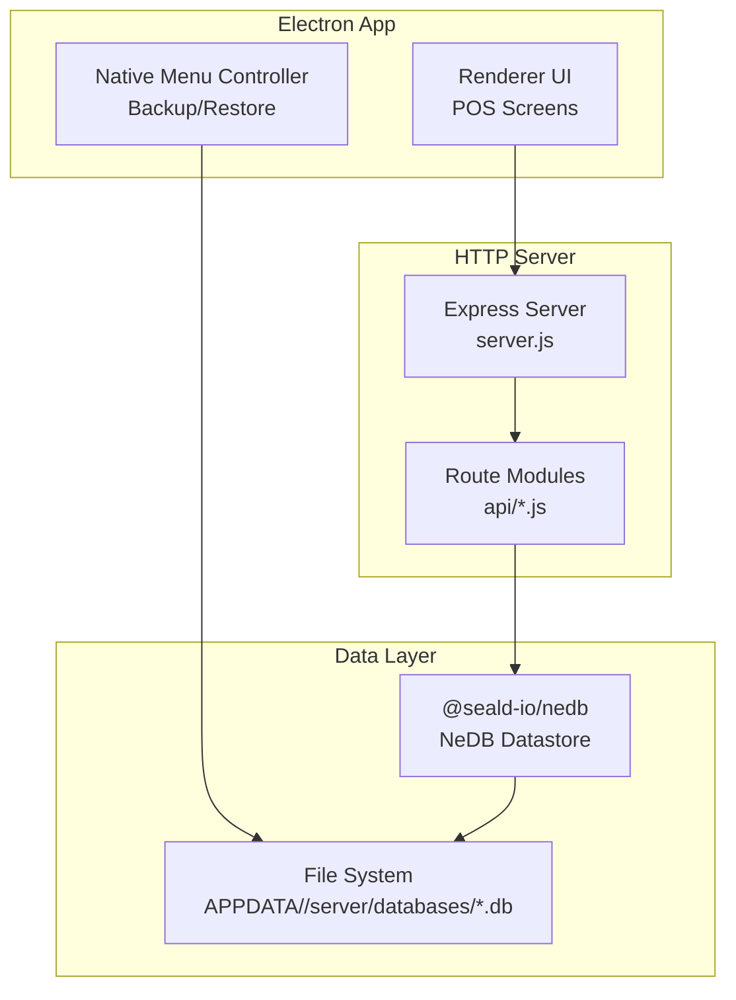
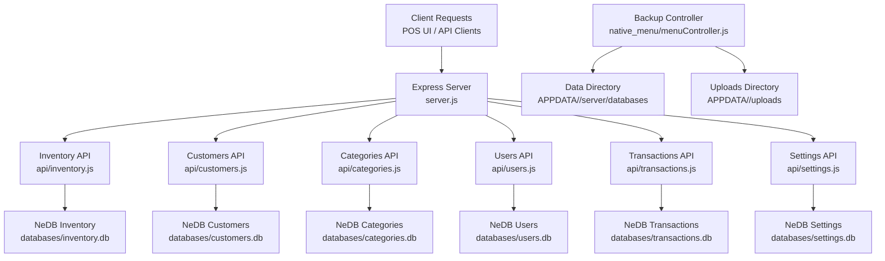
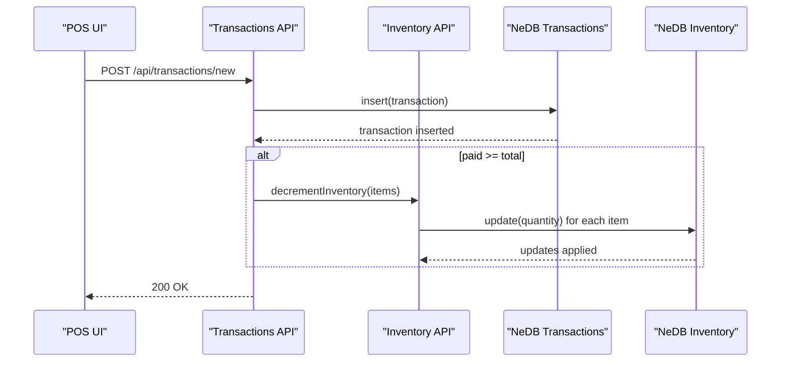
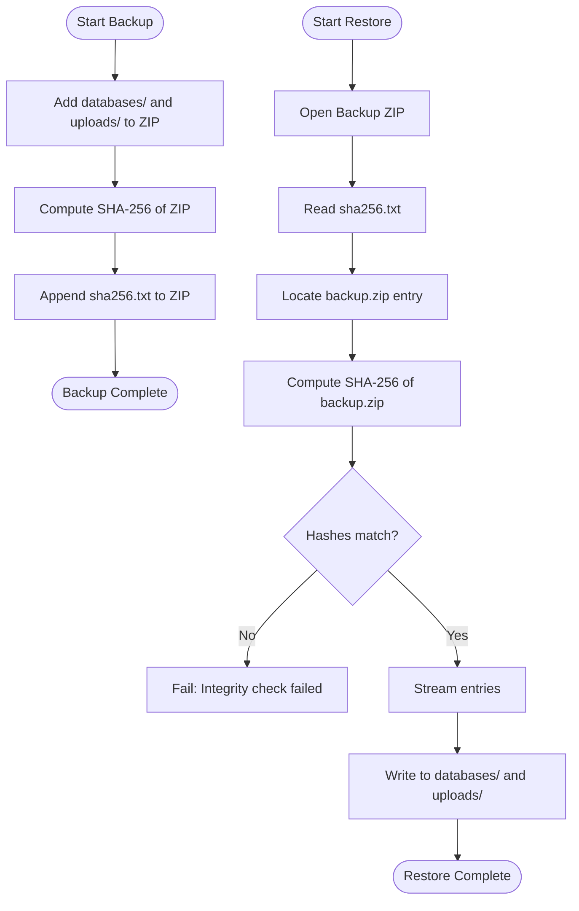
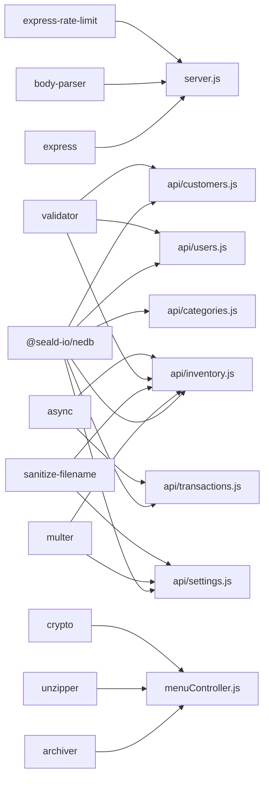

# Database Architecture

<cite>
**Referenced Files in This Document**
- [server.js](file://server.js)
- [package.json](file://package.json)
- [api/inventory.js](file://api/inventory.js)
- [api/customers.js](file://api/customers.js)
- [api/categories.js](file://api/categories.js)
- [api/users.js](file://api/users.js)
- [api/transactions.js](file://api/transactions.js)
- [api/settings.js](file://api/settings.js)
- [assets/js/native_menu/menuController.js](file://assets/js/native_menu/menuController.js)
</cite>

## Table of Contents
1. [Introduction](#introduction)
2. [Project Structure](#project-structure)
3. [Core Components](#core-components)
4. [Architecture Overview](#architecture-overview)
5. [Detailed Component Analysis](#detailed-component-analysis)
6. [Dependency Analysis](#dependency-analysis)
7. [Performance Considerations](#performance-considerations)
8. [Troubleshooting Guide](#troubleshooting-guide)
9. [Conclusion](#conclusion)

## Introduction
This document explains the embedded database architecture and data persistence layer of the Point of Sale (POS) application. It focuses on the embedded document database implementation using NeDB, collection organization, data modeling patterns, initialization and connection management, file-based storage strategy, CRUD operations across collections (products, users, transactions, customers, categories, settings), query patterns, indexing strategies, data validation and integrity measures, and backup/restore procedures. The goal is to provide a comprehensive yet accessible guide for developers and operators working with the system.

## Project Structure
The POS application is an Electron-based desktop app with an Express HTTP server exposing REST APIs grouped by domain collections. Each collection maintains its own NeDB datastore file under a shared data directory. A dedicated Electron controller manages backup and restore operations for the entire data set.

**Diagram sources**
- [server.js:1-68](file://server.js#L1-L68)
- [api/inventory.js:1-333](file://api/inventory.js#L1-L333)
- [api/customers.js:1-151](file://api/customers.js#L1-L151)
- [api/categories.js:1-58](file://api/categories.js#L1-L58)
- [api/users.js:1-54](file://api/users.js#L1-L54)
- [api/transactions.js:1-205](file://api/transactions.js#L1-L205)
- [api/settings.js:1-192](file://api/settings.js#L1-L192)
- [assets/js/native_menu/menuController.js:1-346](file://assets/js/native_menu/menuController.js#L1-L346)

**Section sources**
- [server.js:1-68](file://server.js#L1-L68)
- [package.json:18-54](file://package.json#L18-L54)

## Core Components
- Embedded document database: NeDB via @seald-io/nedb is used for local, file-backed storage.
- Collection-per-file organization: Each logical domain (inventory, customers, categories, users, transactions, settings) has its own datastore file.
- Centralized data directory: Datastore files are stored under APPDATA/<app>/server/databases/.
- Validation and sanitization: Inputs are sanitized and validated using validator and DOM sanitization helpers.
- Backup and restore: Electron-native controller creates and verifies encrypted archives of the data directory and uploads.

Key implementation references:
- NeDB usage and per-collection datastores: [api/inventory.js:46-49](file://api/inventory.js#L46-L49), [api/customers.js:22-25](file://api/customers.js#L22-L25), [api/categories.js:21-24](file://api/categories.js#L21-L24), [api/users.js:21-24](file://api/users.js#L21-L24), [api/transactions.js:21-24](file://api/transactions.js#L21-L24), [api/settings.js:46-49](file://api/settings.js#L46-L49)
- Data directory path resolution: [api/inventory.js:20-26](file://api/inventory.js#L20-L26), [api/customers.js:10-16](file://api/customers.js#L10-L16), [api/categories.js:9-15](file://api/categories.js#L9-L15), [api/users.js:9-15](file://api/users.js#L9-L15), [api/transactions.js:9-15](file://api/transactions.js#L9-L15), [api/settings.js:20-26](file://api/settings.js#L20-L26)
- Indexes: [api/inventory.js:51](file://api/inventory.js#L51), [api/customers.js:27](file://api/customers.js#L27), [api/categories.js:26](file://api/categories.js#L26), [api/users.js:26](file://api/users.js#L26), [api/transactions.js:26](file://api/transactions.js#L26), [api/settings.js:51](file://api/settings.js#L51)
- Backup/restore orchestration: [assets/js/native_menu/menuController.js:12-22](file://assets/js/native_menu/menuController.js#L12-L22), [assets/js/native_menu/menuController.js:142-185](file://assets/js/native_menu/menuController.js#L142-L185), [assets/js/native_menu/menuController.js:195-252](file://assets/js/native_menu/menuController.js#L195-L252)

**Section sources**
- [api/inventory.js:1-333](file://api/inventory.js#L1-L333)
- [api/customers.js:1-151](file://api/customers.js#L1-L151)
- [api/categories.js:1-58](file://api/categories.js#L1-L58)
- [api/users.js:1-54](file://api/users.js#L1-L54)
- [api/transactions.js:1-205](file://api/transactions.js#L1-L205)
- [api/settings.js:1-192](file://api/settings.js#L1-L192)
- [assets/js/native_menu/menuController.js:1-346](file://assets/js/native_menu/menuController.js#L1-L346)

## Architecture Overview
The system follows a layered architecture:
- Presentation/UI: Electron renderer handles POS screens and native menu actions.
- API Layer: Express routes expose endpoints for each domain collection.
- Persistence Layer: NeDB stores documents in separate .db files under a central data directory.
- Backup/Restore: Native controller packages and verifies backups using ZIP and SHA-256.

**Diagram sources**
- [server.js:40-45](file://server.js#L40-L45)
- [api/inventory.js:46-49](file://api/inventory.js#L46-L49)
- [api/customers.js:22-25](file://api/customers.js#L22-L25)
- [api/categories.js:21-24](file://api/categories.js#L21-L24)
- [api/users.js:21-24](file://api/users.js#L21-L24)
- [api/transactions.js:21-24](file://api/transactions.js#L21-L24)
- [api/settings.js:46-49](file://api/settings.js#L46-L49)
- [assets/js/native_menu/menuController.js:12-22](file://assets/js/native_menu/menuController.js#L12-L22)

## Detailed Component Analysis

### Database Initialization and Connection Management
- Each route module initializes a single NeDB datastore with a unique filename pointing to the central data directory.
- Autoload is enabled, ensuring the datastore is ready for immediate use after creation.
- Unique indexes are established on primary keys to enforce uniqueness at the datastore level.

Implementation highlights:
- Datastore creation and autoload: [api/inventory.js:46-49](file://api/inventory.js#L46-L49), [api/customers.js:22-25](file://api/customers.js#L22-L25), [api/categories.js:21-24](file://api/categories.js#L21-L24), [api/users.js:21-24](file://api/users.js#L21-L24), [api/transactions.js:21-24](file://api/transactions.js#L21-L24), [api/settings.js:46-49](file://api/settings.js#L46-L49)
- Centralized path construction: [api/inventory.js:20-26](file://api/inventory.js#L20-L26), [api/customers.js:10-16](file://api/customers.js#L10-L16), [api/categories.js:9-15](file://api/categories.js#L9-L15), [api/users.js:9-15](file://api/users.js#L9-L15), [api/transactions.js:9-15](file://api/transactions.js#L9-L15), [api/settings.js:20-26](file://api/settings.js#L20-L26)
- Unique indexes: [api/inventory.js:51](file://api/inventory.js#L51), [api/customers.js:27](file://api/customers.js#L27), [api/categories.js:26](file://api/categories.js#L26), [api/users.js:26](file://api/users.js#L26), [api/transactions.js:26](file://api/transactions.js#L26), [api/settings.js:51](file://api/settings.js#L51)

**Section sources**
- [api/inventory.js:1-333](file://api/inventory.js#L1-L333)
- [api/customers.js:1-151](file://api/customers.js#L1-L151)
- [api/categories.js:1-58](file://api/categories.js#L1-L58)
- [api/users.js:1-54](file://api/users.js#L1-L54)
- [api/transactions.js:1-205](file://api/transactions.js#L1-L205)
- [api/settings.js:1-192](file://api/settings.js#L1-L192)

### Data Modeling Patterns
- Document shape: Each collection stores JSON documents aligned to domain entities:
  - Inventory: product metadata, pricing, quantity, category, supplier, barcode, image reference.
  - Customers: customer identity and attributes.
  - Categories: category definitions.
  - Users: user credentials and profile (with a unique username index).
  - Transactions: order records with items and totals.
  - Settings: singleton settings container with branding and preferences.
- Primary keys: Most collections use a numeric _id; users additionally enforce a unique username.
- Images and uploads: Stored separately in uploads; inventory and settings maintain image filenames.

References:
- Inventory model and fields: [api/inventory.js:178-193](file://api/inventory.js#L178-L193)
- Users model and unique username: [api/users.js:21-26](file://api/users.js#L21-L26)
- Settings model and singleton pattern (_id=1): [api/settings.js:140-156](file://api/settings.js#L140-L156), [api/settings.js:72-79](file://api/settings.js#L72-L79)

**Section sources**
- [api/inventory.js:178-193](file://api/inventory.js#L178-L193)
- [api/users.js:21-26](file://api/users.js#L21-L26)
- [api/settings.js:140-156](file://api/settings.js#L140-L156)
- [api/settings.js:72-79](file://api/settings.js#L72-L79)

### CRUD Operations and Query Patterns
- Inventory
  - Retrieve by ID, list all, insert/update, delete, find by barcode.
  - Bulk decrement inventory quantities during transaction finalization.
  - References: [api/inventory.js:89-102](file://api/inventory.js#L89-L102), [api/inventory.js:111-115](file://api/inventory.js#L111-L115), [api/inventory.js:124-240](file://api/inventory.js#L124-L240), [api/inventory.js:249-266](file://api/inventory.js#L249-L266), [api/inventory.js:276-294](file://api/inventory.js#L276-L294), [api/inventory.js:302-332](file://api/inventory.js#L302-L332)
- Customers
  - Retrieve by ID, list all, insert, update, delete.
  - References: [api/customers.js:47-60](file://api/customers.js#L47-L60), [api/customers.js:69-73](file://api/customers.js#L69-L73), [api/customers.js:82-95](file://api/customers.js#L82-L95), [api/customers.js:104-121](file://api/customers.js#L104-L121), [api/customers.js:130-151](file://api/customers.js#L130-L151)
- Categories
  - List all, insert.
  - References: [api/categories.js:46-50](file://api/categories.js#L46-L50), [api/categories.js:52-58](file://api/categories.js#L52-L58)
- Users
  - Retrieve by ID, insert/update/delete.
  - References: [api/users.js:46-54](file://api/users.js#L46-L54), [api/users.js:124-151](file://api/users.js#L124-L151)
- Transactions
  - List all, list on-hold, insert, update.
  - On successful payment, decrements inventory via Inventory.decrementInventory.
  - References: [api/transactions.js:46-50](file://api/transactions.js#L46-L50), [api/transactions.js:59-154](file://api/transactions.js#L59-L154), [api/transactions.js:163-181](file://api/transactions.js#L163-L181), [api/transactions.js:190-205](file://api/transactions.js#L190-L205)
- Settings
  - Retrieve singleton, insert/update.
  - References: [api/settings.js:71-80](file://api/settings.js#L71-L80), [api/settings.js:158-190](file://api/settings.js#L158-L190)

**Diagram sources**
- [api/transactions.js:163-181](file://api/transactions.js#L163-L181)
- [api/inventory.js:302-332](file://api/inventory.js#L302-L332)

**Section sources**
- [api/inventory.js:89-266](file://api/inventory.js#L89-L266)
- [api/customers.js:47-151](file://api/customers.js#L47-L151)
- [api/categories.js:46-58](file://api/categories.js#L46-L58)
- [api/users.js:46-151](file://api/users.js#L46-L151)
- [api/transactions.js:46-205](file://api/transactions.js#L46-L205)
- [api/settings.js:71-190](file://api/settings.js#L71-L190)

### Indexing Strategies
- Unique primary key indexes:
  - Inventory, Customers, Categories, Transactions: unique index on _id.
  - Users: unique index on username.
- Purpose: Enforce entity uniqueness and optimize lookups by primary key.

References:
- [api/inventory.js:51](file://api/inventory.js#L51)
- [api/customers.js:27](file://api/customers.js#L27)
- [api/categories.js:26](file://api/categories.js#L26)
- [api/users.js:26](file://api/users.js#L26)
- [api/transactions.js:26](file://api/transactions.js#L26)
- [api/settings.js:51](file://api/settings.js#L51)

**Section sources**
- [api/inventory.js:51](file://api/inventory.js#L51)
- [api/customers.js:27](file://api/customers.js#L27)
- [api/categories.js:26](file://api/categories.js#L26)
- [api/users.js:26](file://api/users.js#L26)
- [api/transactions.js:26](file://api/transactions.js#L26)
- [api/settings.js:51](file://api/settings.js#L51)

### Data Validation, Constraints, and Integrity
- Input sanitization and validation:
  - validator.escape used to sanitize incoming fields.
  - Body parsing and JSON validation via body-parser.
  - Image uploads filtered and limited by multer and custom filters.
- Constraints:
  - Unique indexes on _id and username enforced at datastore level.
  - Singleton pattern for settings using _id=1.
- Integrity checks:
  - Backup/restore validates SHA-256 of the archived data to ensure integrity.
  - Restore prevents directory traversal by resolving and verifying target paths.

References:
- Sanitization and validation: [api/inventory.js:178-193](file://api/inventory.js#L178-L193), [api/users.js:46-54](file://api/users.js#L46-L54), [api/customers.js:130-151](file://api/customers.js#L130-L151)
- Upload filtering and limits: [api/inventory.js:11-17](file://api/inventory.js#L11-L17), [api/inventory.js:35-39](file://api/inventory.js#L35-L39), [api/settings.js:12-18](file://api/settings.js#L12-L18), [api/settings.js:35-39](file://api/settings.js#L35-L39)
- Backup integrity verification: [assets/js/native_menu/menuController.js:195-220](file://assets/js/native_menu/menuController.js#L195-L220)

**Section sources**
- [api/inventory.js:11-193](file://api/inventory.js#L11-L193)
- [api/users.js:46-54](file://api/users.js#L46-L54)
- [api/customers.js:130-151](file://api/customers.js#L130-L151)
- [assets/js/native_menu/menuController.js:195-220](file://assets/js/native_menu/menuController.js#L195-L220)

### Backup and Restore Procedures
- Backup:
  - Archives the data directory and uploads directory into a ZIP.
  - Computes SHA-256 of the ZIP and embeds it as sha256.txt inside the archive.
- Restore:
  - Reads sha256.txt and compares with computed hash of backup.zip.
  - Streams backup.zip entries and writes files to appropriate destinations.
  - Prevents directory traversal by validating resolved paths.
- User prompts:
  - Save dialog generates a timestamped filename.
  - Restore dialog confirms overwrite action.

**Diagram sources**
- [assets/js/native_menu/menuController.js:142-185](file://assets/js/native_menu/menuController.js#L142-L185)
- [assets/js/native_menu/menuController.js:195-252](file://assets/js/native_menu/menuController.js#L195-L252)

**Section sources**
- [assets/js/native_menu/menuController.js:142-185](file://assets/js/native_menu/menuController.js#L142-L185)
- [assets/js/native_menu/menuController.js:195-252](file://assets/js/native_menu/menuController.js#L195-L252)
- [assets/js/native_menu/menuController.js:260-284](file://assets/js/native_menu/menuController.js#L260-L284)
- [assets/js/native_menu/menuController.js:291-319](file://assets/js/native_menu/menuController.js#L291-L319)

### Data Migration Strategies
- File-based migration:
  - Since each collection is a separate .db file, migrations can target individual files.
  - Recommended approach: Export documents, transform in-memory, and re-insert with updated schema.
- Versioning:
  - Store a version field in the settings collection to coordinate migrations.
- Atomicity:
  - Prefer batch updates with async series to minimize inconsistent states during bulk changes.

[No sources needed since this section provides general guidance]

## Dependency Analysis
- External libraries:
  - @seald-io/nedb: Embedded document database.
  - express, body-parser: HTTP server and request parsing.
  - multer, sanitize-filename: File uploads and filename sanitization.
  - validator: Input sanitization and validation.
  - archiver, unzipper, crypto: Backup/restore and integrity verification.
- Internal dependencies:
  - Transactions API depends on Inventory API for stock adjustments.
  - All APIs depend on centralized APPDATA and APPNAME environment variables.

**Diagram sources**
- [package.json:18-54](file://package.json#L18-L54)
- [server.js:1-68](file://server.js#L1-L68)
- [api/inventory.js:1-333](file://api/inventory.js#L1-L333)
- [api/customers.js:1-151](file://api/customers.js#L1-L151)
- [api/categories.js:1-58](file://api/categories.js#L1-L58)
- [api/users.js:1-54](file://api/users.js#L1-L54)
- [api/transactions.js:1-205](file://api/transactions.js#L1-L205)
- [api/settings.js:1-192](file://api/settings.js#L1-L192)
- [assets/js/native_menu/menuController.js:1-346](file://assets/js/native_menu/menuController.js#L1-L346)

**Section sources**
- [package.json:18-54](file://package.json#L18-L54)
- [server.js:1-68](file://server.js#L1-L68)

## Performance Considerations
- Indexing: Ensure unique indexes on frequently queried fields (e.g., _id, username) to speed up lookups.
- Batch operations: Use async series for bulk updates to avoid race conditions and reduce overhead.
- File I/O: Keep datastore files on fast local disks; avoid network drives for production.
- Uploads: Limit image sizes and types to reduce I/O and storage overhead.
- Caching: Consider in-memory caches for read-heavy endpoints if latency is critical.
- Concurrency: NeDB is single-instance per file; avoid concurrent writes to the same datastore from multiple processes.

[No sources needed since this section provides general guidance]

## Troubleshooting Guide
- Database file corruption or lock issues:
  - Close all clients and ensure no process holds the datastore file.
  - Verify file permissions on the data directory.
- Backup integrity failures:
  - Confirm the backup ZIP contains sha256.txt and backup.zip.
  - Recreate backup if hashes mismatch.
- Directory traversal errors during restore:
  - Ensure restore targets are within allowed base paths.
- Unique constraint violations:
  - Check for duplicate usernames or IDs; adjust inputs accordingly.

**Section sources**
- [assets/js/native_menu/menuController.js:195-220](file://assets/js/native_menu/menuController.js#L195-L220)
- [assets/js/native_menu/menuController.js:237-243](file://assets/js/native_menu/menuController.js#L237-L243)

## Conclusion
The POS application employs a clean, modular architecture with NeDB as the embedded persistence layer. Each domain collection is isolated in its own datastore file under a central data directory, enabling straightforward maintenance, backups, and migrations. Robust input sanitization, unique indexes, and integrity checks contribute to data reliability. The backup/restore mechanism ensures safe archival and restoration of the entire dataset, supporting operational continuity.

**Updated** The web prototype (`web-prototype/`) uses IndexedDB for browser-based persistence. The database is at schema version 5 with 18 object stores: `meta`, `products`, `categories`, `customers`, `users`, `settings`, `transactions`, `heldOrders`, `syncQueue`, `birSettings`, `printerProfiles`, `auditLog`, `printerActivity`, `prescriptions`, `rxSettings`, `xReadings`, `zReadings`, and `reprintQueue`. Migrations are applied sequentially on `onupgradeneeded` (v2: feature flags, v3: expiryAlertDays backfill, v4: Phase 1 new stores, v5: reprintQueue). All stores use `{ keyPath: "id" }`. The `db.ts` module exposes `openPosDb()`, `getAll()`, `getOne()`, `putOne()`, `putMany()`, `deleteOne()`, `enqueueSync()`, `seedIfNeeded()`, and `resetPrototypeData()` helper functions.

**Section sources**
- [web-prototype/src/lib/db.ts:1-295](file://web-prototype/src/lib/db.ts#L1-L295)