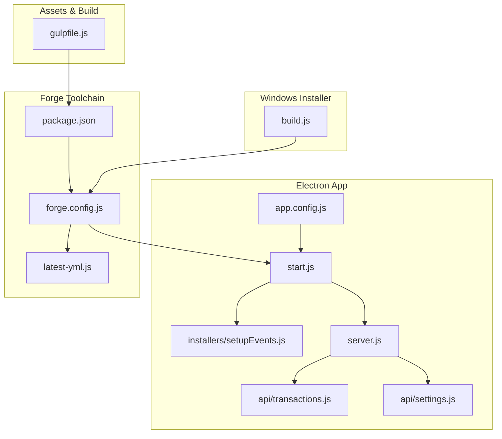
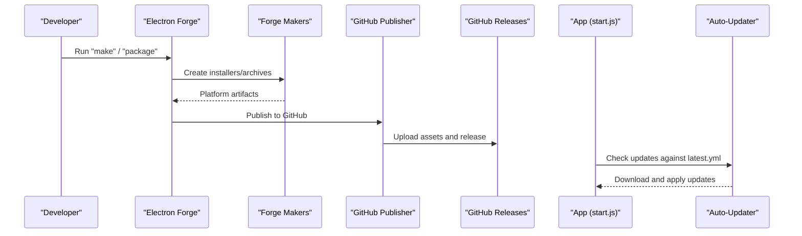
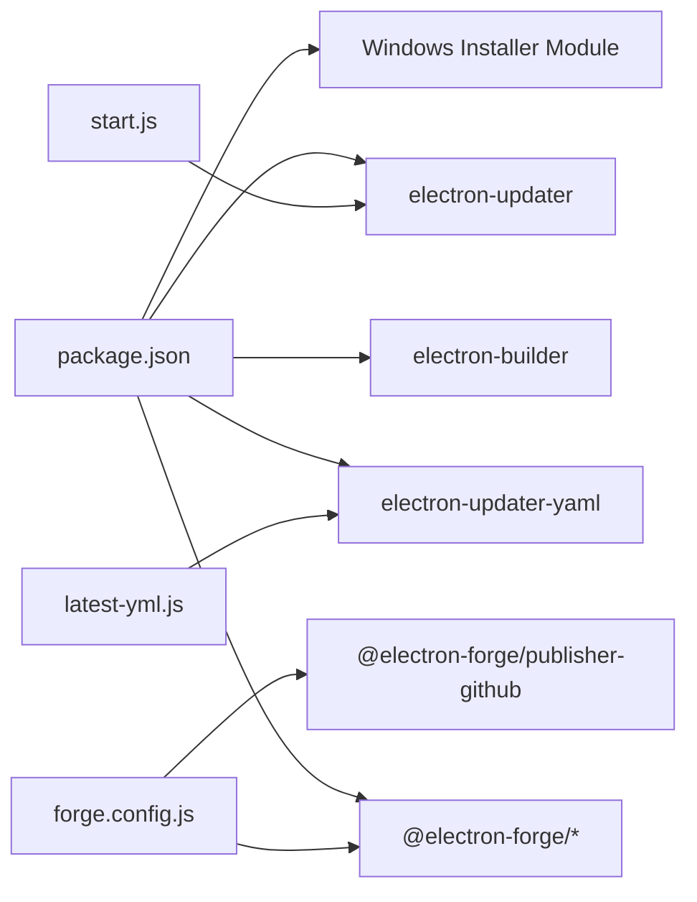

# Deployment and Packaging

<cite>
**Referenced Files in This Document**
- [forge.config.js](file://forge.config.js)
- [package.json](file://package.json)
- [build.js](file://build.js)
- [start.js](file://start.js)
- [installers/setupEvents.js](file://installers/setupEvents.js)
- [app.config.js](file://app.config.js)
- [latest-yml.js](file://latest-yml.js)
- [gulpfile.js](file://gulpfile.js)
- [server.js](file://server.js)
- [api/transactions.js](file://api/transactions.js)
- [api/settings.js](file://api/settings.js)
</cite>

## Table of Contents
1. [Introduction](#introduction)
2. [Project Structure](#project-structure)
3. [Core Components](#core-components)
4. [Architecture Overview](#architecture-overview)
5. [Detailed Component Analysis](#detailed-component-analysis)
6. [Dependency Analysis](#dependency-analysis)
7. [Performance Considerations](#performance-considerations)
8. [Troubleshooting Guide](#troubleshooting-guide)
9. [Conclusion](#conclusion)
10. [Appendices](#appendices)

## Introduction
This document explains the Electron Forge packaging and deployment architecture for the application. It covers build configuration, target platforms, packaging strategies across Windows, macOS, and Linux, distribution channels, auto-update mechanisms, installer creation, build scripts, dependency management, and release automation. It also includes platform-specific considerations, code signing requirements, distribution best practices, troubleshooting, version management, and continuous integration setup for automated deployments.

## Project Structure
The project uses Electron Forge for cross-platform packaging and publishing, with complementary scripts for Windows installer generation and auto-update metadata generation. Build assets are prepared via Gulp, while the Electron main process initializes the app, sets up Squirrel event handling, and starts an embedded Express server exposing internal APIs.

**Diagram sources**
- [package.json](file://package.json)
- [forge.config.js](file://forge.config.js)
- [start.js](file://start.js)
- [installers/setupEvents.js](file://installers/setupEvents.js)
- [app.config.js](file://app.config.js)
- [server.js](file://server.js)
- [api/transactions.js](file://api/transactions.js)
- [api/settings.js](file://api/settings.js)
- [latest-yml.js](file://latest-yml.js)
- [gulpfile.js](file://gulpfile.js)
- [build.js](file://build.js)

**Section sources**
- [package.json](file://package.json)
- [forge.config.js](file://forge.config.js)
- [gulpfile.js](file://gulpfile.js)

## Core Components
- Electron Forge configuration defines packaging, rebuild hooks, makers, and publishers.
- Package scripts orchestrate development, packaging, building, and publishing.
- Windows installer script generates Squirrel-based installers.
- Auto-update metadata generator produces platform-specific YAML descriptors.
- Squirrel event handler manages install/uninstall/update lifecycle on Windows.
- Embedded server exposes internal APIs consumed by the renderer.

**Section sources**
- [forge.config.js](file://forge.config.js)
- [package.json](file://package.json)
- [build.js](file://build.js)
- [latest-yml.js](file://latest-yml.js)
- [installers/setupEvents.js](file://installers/setupEvents.js)
- [server.js](file://server.js)

## Architecture Overview
The packaging pipeline leverages Electron Forge to produce platform-specific installers and archives. Publishers upload artifacts to GitHub releases. Auto-updates rely on YAML metadata generated post-build. Windows installers are produced using Squirrel/WIX makers and a dedicated build script. Linux and macOS artifacts are produced via Forge makers and published to GitHub.

**Diagram sources**
- [forge.config.js](file://forge.config.js)
- [package.json](file://package.json)
- [latest-yml.js](file://latest-yml.js)
- [start.js](file://start.js)

## Detailed Component Analysis

### Electron Forge Configuration
- Packager configuration:
  - Icon set for Windows.
  - ASAR enabled.
  - Ignore patterns exclude development and test files.
- Makers:
  - Zip generic archive.
  - Windows: Squirrel and WIX.
  - Linux: deb and rpm.
  - macOS: dmg with ULFO format.
- Publishers:
  - GitHub publisher configured with repository owner/name and draft releases.
- Hooks:
  - Post-prune hook removes Linux node-gyp bins to fix packaging issues.

**Section sources**
- [forge.config.js](file://forge.config.js)

### Build Scripts and Commands
- Scripts:
  - Development: electron-forge start.
  - Packaging: electron-forge package.
  - Building/installers: electron-forge make.
  - Publishing: electron-forge publish.
  - Legacy Windows packaging: electron-packager.
  - Alternative builder: electron-builder.
- These commands integrate with Forge makers and publishers to produce and publish artifacts.

**Section sources**
- [package.json](file://package.json)

### Windows Installer Generation
- Dedicated script uses a Windows installer module to generate Squirrel-based installers.
- Reads app version and author from package metadata.
- Outputs installers under an installers directory.

**Section sources**
- [build.js](file://build.js)
- [package.json](file://package.json)

### Auto-Update Metadata Generation
- Generates platform-specific YAML metadata for Electron Updater:
  - Windows/macOS: latest.yml via a helper function.
  - Linux: latest-linux.yml enumerating .deb, .rpm, and .zip artifacts with SHA-512 hashes.
- Uses current version and release date; writes to the output directory.

**Section sources**
- [latest-yml.js](file://latest-yml.js)
- [package.json](file://package.json)

### Squirrel Event Handling (Windows)
- Handles Squirrel installer events:
  - Install and update: create desktop/start menu shortcuts.
  - Uninstall: remove shortcuts.
  - Obsolete: quit on outgoing version.
- Prevents multiple app launches during installer events.

**Section sources**
- [installers/setupEvents.js](file://installers/setupEvents.js)
- [start.js](file://start.js)

### Application Entry and Auto-Updater Integration
- Initializes remote module and renderer store.
- Sets up Squirrel event handling; quits early if handled.
- Starts embedded Express server and loads the UI.
- Exposes IPC handlers for app lifecycle actions.
- Uses configuration for update server base URL.

**Section sources**
- [start.js](file://start.js)
- [app.config.js](file://app.config.js)

### Embedded Server and APIs
- Express server with rate limiting and CORS middleware.
- Routes for inventory, customers, categories, settings, users, and transactions.
- Stores database files under application data directory using environment variables injected from Electron.

**Section sources**
- [server.js](file://server.js)
- [api/transactions.js](file://api/transactions.js)
- [api/settings.js](file://api/settings.js)

### Asset Build Pipeline
- Gulp concatenates and minifies CSS and JS bundles.
- Watches for changes and synchronizes with a local dev server.
- Outputs optimized assets for production.

**Section sources**
- [gulpfile.js](file://gulpfile.js)

## Dependency Analysis
- Packaging and publishing:
  - Forge CLI and makers for each platform.
  - GitHub publisher for releases.
- Auto-update:
  - Electron updater and YAML metadata generator.
- Windows installer:
  - Squirrel-based installer module.
- Runtime dependencies:
  - Electron, Express, NeDB, and related libraries for UI, server, and persistence.

**Diagram sources**
- [package.json](file://package.json)
- [forge.config.js](file://forge.config.js)
- [latest-yml.js](file://latest-yml.js)
- [start.js](file://start.js)

**Section sources**
- [package.json](file://package.json)
- [forge.config.js](file://forge.config.js)
- [latest-yml.js](file://latest-yml.js)
- [start.js](file://start.js)

## Performance Considerations
- ASAR packaging reduces filesystem overhead and improves load times.
- Gulp minification and purging reduce bundle sizes.
- Rate limiting on the embedded server prevents abuse and conserves resources.
- Avoid unnecessary native modules and prune unused dependencies to minimize artifact size.

[No sources needed since this section provides general guidance]

## Troubleshooting Guide
- Linux packaging fails due to node-gyp bins:
  - Use the Forge post-prune hook to remove node_gyp_bins directories after pruning.
- Windows installer issues:
  - Verify Squirrel/WIX maker configurations and ensure the Windows installer script runs after packaging.
  - Confirm Squirrel event handling is invoked at startup.
- Auto-update not working:
  - Ensure latest.yml/latest-linux.yml exists and is served at the configured update server URL.
  - Validate that the application’s update channel matches the generated metadata.
- Version mismatch:
  - Confirm package version aligns with generated metadata and release tag.
- CI/CD:
  - Set secrets for GitHub token and code-signing credentials.
  - Cache dependencies and build artifacts to speed up jobs.
  - Run “make” and “publish” in separate steps, ensuring metadata generation precedes publishing.

**Section sources**
- [forge.config.js](file://forge.config.js)
- [build.js](file://build.js)
- [installers/setupEvents.js](file://installers/setupEvents.js)
- [latest-yml.js](file://latest-yml.js)
- [app.config.js](file://app.config.js)

## Conclusion
The project employs Electron Forge for streamlined cross-platform packaging and publishing to GitHub. Windows installers are produced via Squirrel/WIX and a dedicated script, while Linux and macOS artifacts are generated by Forge makers. Auto-updates rely on YAML metadata generated post-build and served from a configured update server. The embedded Express server provides internal APIs, and Gulp optimizes frontend assets. Following the best practices and troubleshooting steps outlined here will help maintain reliable builds, secure distribution, and smooth user updates.

[No sources needed since this section summarizes without analyzing specific files]

## Appendices

### Packaging Strategies by Platform
- Windows
  - Squirrel and WIX makers produce installers; a dedicated script can generate additional Squirrel-based installers.
  - Squirrel event handling ensures proper shortcuts and lifecycle management.
- macOS
  - DMG maker with ULFO format for compressed disk images.
- Linux
  - Deb and RPM makers for Debian/Ubuntu and Red Hat/SUSE distributions respectively.

**Section sources**
- [forge.config.js](file://forge.config.js)
- [build.js](file://build.js)
- [installers/setupEvents.js](file://installers/setupEvents.js)

### Distribution Channels and Auto-Update
- GitHub Releases:
  - Artifacts uploaded via the GitHub publisher with draft option.
- Update Server:
  - Latest metadata files (latest.yml, latest-linux.yml) must be hosted and reachable by the application.
- Update Mechanism:
  - Electron Updater checks the configured server URL for updates and applies them automatically.

**Section sources**
- [forge.config.js](file://forge.config.js)
- [latest-yml.js](file://latest-yml.js)
- [app.config.js](file://app.config.js)
- [start.js](file://start.js)

### Build Scripts and Release Automation
- Local builds:
  - Use “electron-forge make” to generate platform artifacts.
  - Use “electron-forge publish” to upload to GitHub.
- CI/CD:
  - Define jobs to install dependencies, build, generate metadata, and publish.
  - Cache node_modules and lockfiles to optimize performance.
  - Use secrets for GitHub token and code-signing certificates.

**Section sources**
- [package.json](file://package.json)
- [forge.config.js](file://forge.config.js)

### Platform-Specific Considerations
- Windows
  - Ensure Squirrel and WIX prerequisites are installed.
  - Configure publisher with repository owner/name and a valid GitHub token.
- macOS
  - Use appropriate signing identities and notarization for distribution.
- Linux
  - Verify deb/rpm makers compatibility with target distributions.
  - Confirm metadata generation includes all produced artifacts.

**Section sources**
- [forge.config.js](file://forge.config.js)
- [package.json](file://package.json)

### Code Signing Requirements
- Windows:
  - Sign executables and installers using a trusted certificate.
  - Configure signing parameters in the Windows installer configuration.
- macOS:
  - Use Developer ID for notarization and distribution.
- Linux:
  - Consider GPG signatures for repositories or packages where applicable.

**Section sources**
- [build.js](file://build.js)
- [forge.config.js](file://forge.config.js)

### Version Management and Continuous Integration
- Version:
  - Keep package version aligned across Forge configuration and metadata generation.
- CI:
  - Separate jobs for building, generating metadata, and publishing.
  - Gate releases on successful builds and tests.

**Section sources**
- [package.json](file://package.json)
- [latest-yml.js](file://latest-yml.js)