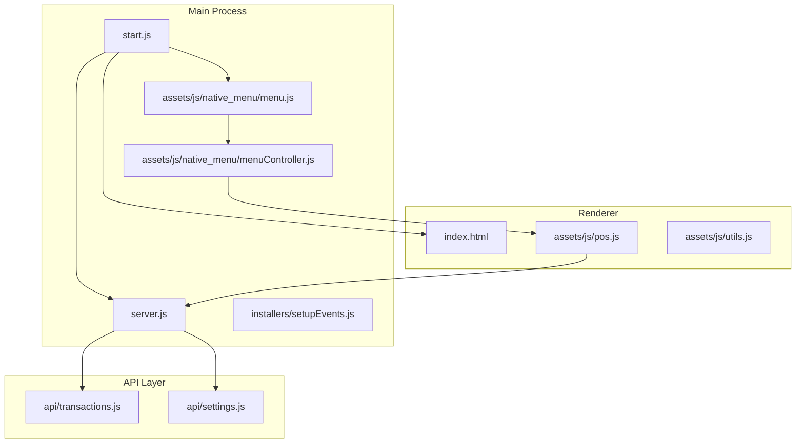
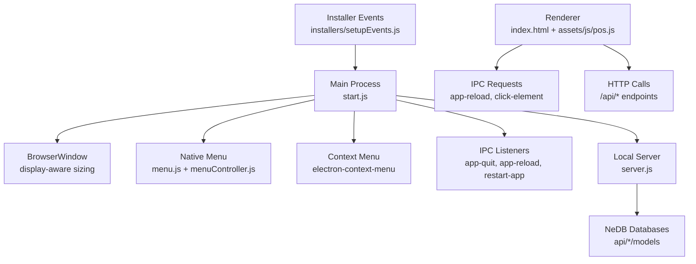
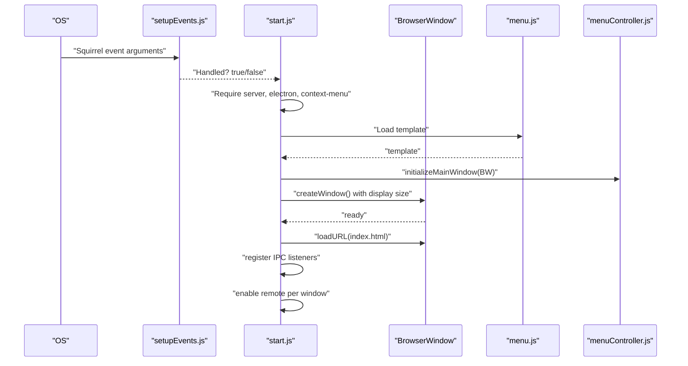
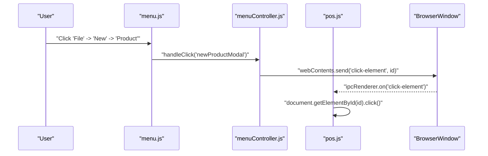
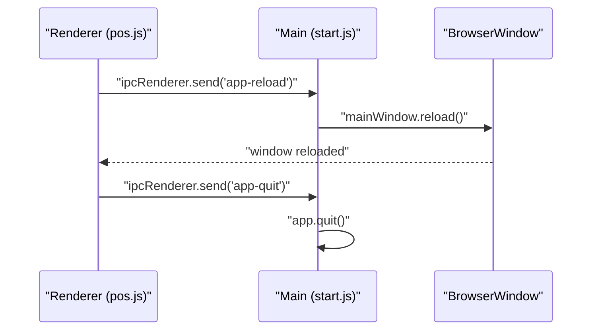
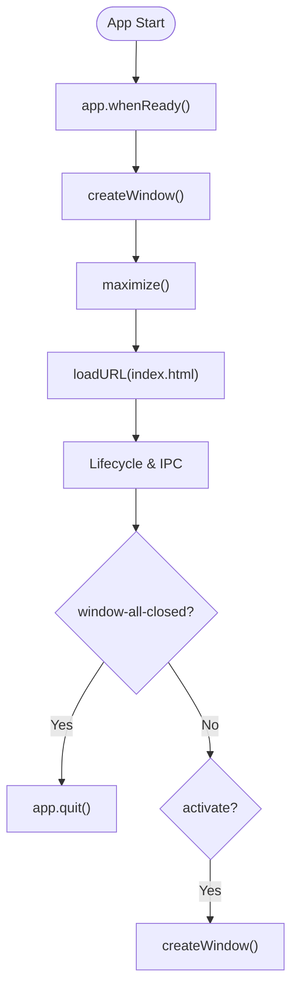
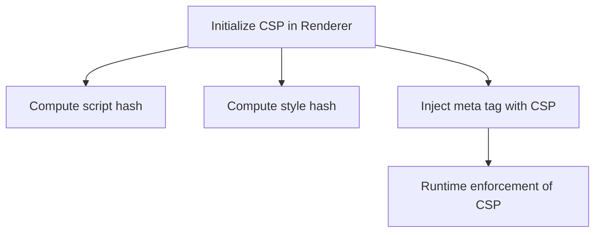
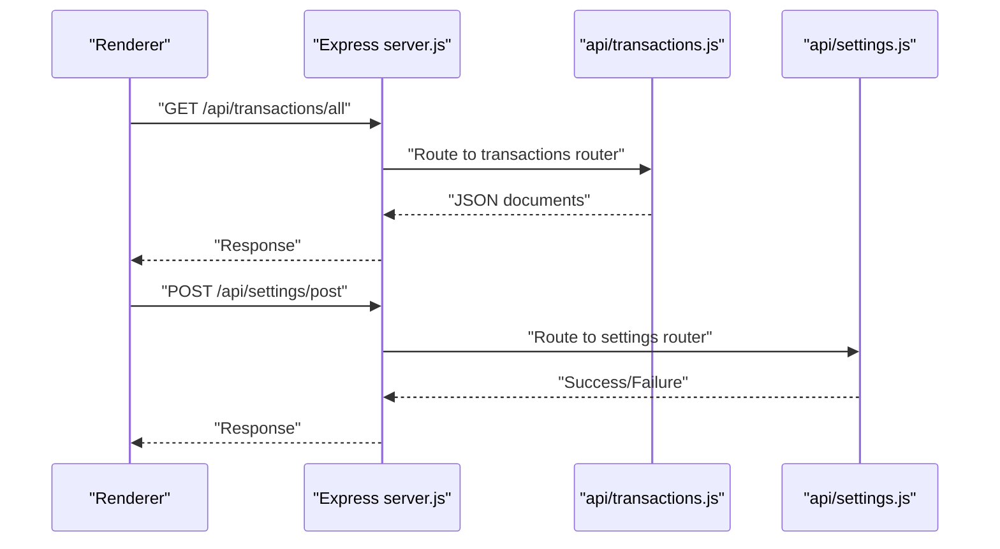
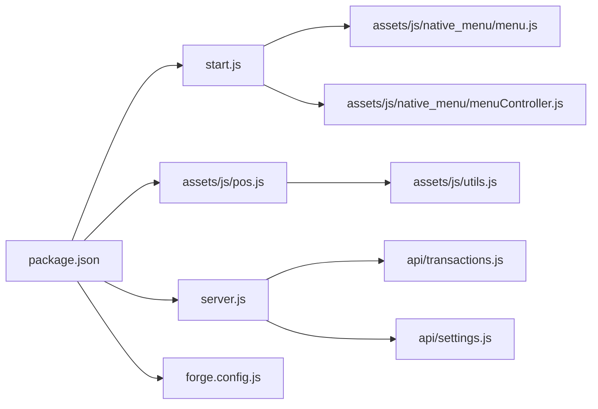

# Desktop Application Architecture

<cite>
**Referenced Files in This Document**
- [package.json](file://package.json)
- [start.js](file://start.js)
- [index.html](file://index.html)
- [forge.config.js](file://forge.config.js)
- [app.config.js](file://app.config.js)
- [assets/js/native_menu/menu.js](file://assets/js/native_menu/menu.js)
- [assets/js/native_menu/menuController.js](file://assets/js/native_menu/menuController.js)
- [server.js](file://server.js)
- [installers/setupEvents.js](file://installers/setupEvents.js)
- [assets/js/pos.js](file://assets/js/pos.js)
- [assets/js/utils.js](file://assets/js/utils.js)
- [api/transactions.js](file://api/transactions.js)
- [api/settings.js](file://api/settings.js)
</cite>

## Table of Contents
1. [Introduction](#introduction)
2. [Project Structure](#project-structure)
3. [Core Components](#core-components)
4. [Architecture Overview](#architecture-overview)
5. [Detailed Component Analysis](#detailed-component-analysis)
6. [Dependency Analysis](#dependency-analysis)
7. [Performance Considerations](#performance-considerations)
8. [Troubleshooting Guide](#troubleshooting-guide)
9. [Conclusion](#conclusion)

## Introduction
This document describes the Electron desktop application architecture for a pharmacy point-of-sale system. It covers main process initialization, BrowserWindow configuration with display detection and window management, native menu and context menu integration, IPC communication patterns, application lifecycle events, window state management, multi-instance prevention, security configurations, platform-specific behaviors, development versus production modes, and error handling strategies. Practical examples of IPC message handling and window control patterns are included via file references.

## Project Structure
The application follows a layered structure:
- Main process initializes the app, creates the BrowserWindow, sets up menus, context menu, and IPC listeners.
- Renderer loads the HTML shell and runs the POS UI logic.
- A local Express server exposes APIs backed by NeDB databases.
- Native menu and controller modules integrate with the main process to trigger UI actions and manage backups and updates.
- Packaging and publishing are configured via Electron Forge.

**Diagram sources**
- [start.js:1-107](file://start.js#L1-L107)
- [assets/js/native_menu/menu.js:1-153](file://assets/js/native_menu/menu.js#L1-L153)
- [assets/js/native_menu/menuController.js:1-346](file://assets/js/native_menu/menuController.js#L1-L346)
- [server.js:1-68](file://server.js#L1-L68)
- [index.html:1-884](file://index.html#L1-L884)
- [assets/js/pos.js:1-2538](file://assets/js/pos.js#L1-L2538)
- [assets/js/utils.js:1-112](file://assets/js/utils.js#L1-L112)
- [api/transactions.js:1-251](file://api/transactions.js#L1-L251)
- [api/settings.js:1-192](file://api/settings.js#L1-L192)

**Section sources**
- [package.json:1-147](file://package.json#L1-L147)
- [forge.config.js:1-71](file://forge.config.js#L1-L71)

## Core Components
- Main process initializer and BrowserWindow creation with display detection and window management.
- Native menu system with dynamic actions and IPC-driven UI triggers.
- Context menu integration for quick actions.
- IPC communication for lifecycle control and UI event forwarding.
- Local server exposing REST endpoints backed by NeDB.
- Multi-instance prevention via Squirrel startup handler.
- Security posture including CSP generation and remote module handling.

**Section sources**
- [start.js:1-107](file://start.js#L1-L107)
- [assets/js/native_menu/menu.js:1-153](file://assets/js/native_menu/menu.js#L1-L153)
- [assets/js/native_menu/menuController.js:1-346](file://assets/js/native_menu/menuController.js#L1-L346)
- [server.js:1-68](file://server.js#L1-L68)
- [installers/setupEvents.js:1-65](file://installers/setupEvents.js#L1-L65)
- [assets/js/utils.js:89-112](file://assets/js/utils.js#L89-L112)

## Architecture Overview
The system comprises:
- Main process orchestrating app lifecycle, windows, menus, and IPC.
- Renderer process hosting the UI and interacting with the local server via IPC and HTTP.
- Local server exposing REST endpoints for inventory, customers, categories, settings, users, and transactions.
- Packaging and distribution managed by Electron Forge.

**Diagram sources**
- [start.js:1-107](file://start.js#L1-L107)
- [assets/js/native_menu/menu.js:1-153](file://assets/js/native_menu/menu.js#L1-L153)
- [assets/js/native_menu/menuController.js:1-346](file://assets/js/native_menu/menuController.js#L1-L346)
- [server.js:1-68](file://server.js#L1-L68)
- [index.html:1-884](file://index.html#L1-L884)
- [assets/js/pos.js:1-2538](file://assets/js/pos.js#L1-L2538)
- [installers/setupEvents.js:1-65](file://installers/setupEvents.js#L1-L65)

## Detailed Component Analysis

### Main Process Initialization and Window Management
- Initializes remote main support and renderer store.
- Handles Squirrel installer events to prevent multiple launches.
- Builds the application menu from a template and sets it.
- Creates a BrowserWindow sized to the primary display work area, maximizes it, and loads the HTML shell.
- Enables remote module per-window and registers IPC listeners for quit, reload, and update installation.
- Sets up a context menu with a “Refresh” action bound to the main window.
- Live reload is enabled in development mode.

**Diagram sources**
- [installers/setupEvents.js:1-65](file://installers/setupEvents.js#L1-L65)
- [start.js:1-107](file://start.js#L1-L107)
- [assets/js/native_menu/menu.js:1-153](file://assets/js/native_menu/menu.js#L1-L153)
- [assets/js/native_menu/menuController.js:327-333](file://assets/js/native_menu/menuController.js#L327-L333)

**Section sources**
- [start.js:1-107](file://start.js#L1-L107)
- [installers/setupEvents.js:1-65](file://installers/setupEvents.js#L1-L65)

### Native Menu System and Context Menu Integration
- The native menu template defines roles and custom actions (New items, Backup/Restore, Logout, Refresh, DevTools toggle in dev).
- The controller module wires actions to UI events via IPC and manages backup/restore operations with integrity checks and directory traversal protection.
- The controller also integrates auto-update checks and UI refresh after restore.

**Diagram sources**
- [assets/js/native_menu/menu.js:1-153](file://assets/js/native_menu/menu.js#L1-L153)
- [assets/js/native_menu/menuController.js:331-333](file://assets/js/native_menu/menuController.js#L331-L333)
- [assets/js/pos.js:2536-2538](file://assets/js/pos.js#L2536-L2538)

**Section sources**
- [assets/js/native_menu/menu.js:1-153](file://assets/js/native_menu/menu.js#L1-L153)
- [assets/js/native_menu/menuController.js:1-346](file://assets/js/native_menu/menuController.js#L1-L346)
- [assets/js/pos.js:2536-2538](file://assets/js/pos.js#L2536-L2538)

### IPC Communication Patterns
- Lifecycle control: app-quit, app-reload, restart-app.
- UI event forwarding: click-element to trigger DOM actions from menu selections.
- Renderer-to-main: Renderer sends app-reload to refresh the main window after authentication.

**Diagram sources**
- [start.js:75-85](file://start.js#L75-L85)
- [assets/js/pos.js:2497-2512](file://assets/js/pos.js#L2497-L2512)

**Section sources**
- [start.js:75-85](file://start.js#L75-L85)
- [assets/js/pos.js:2497-2512](file://assets/js/pos.js#L2497-L2512)

### Application Lifecycle and Window State Management
- Lifecycle events:
  - browser-window-created: enables remote module per window.
  - when-ready: creates the main window.
  - window-all-closed: quits on non-macOS platforms.
  - activate: recreates the window if none exists.
- Window state:
  - Uses display work area size.
  - Maximizes the window and shows it.
  - Loads index.html from the filesystem.

**Diagram sources**
- [start.js:47-65](file://start.js#L47-L65)
- [start.js:21-45](file://start.js#L21-L45)

**Section sources**
- [start.js:47-65](file://start.js#L47-L65)
- [start.js:21-45](file://start.js#L21-L45)

### Multi-Instance Prevention and Installer Events
- Squirrel startup handler prevents multiple instances during installer events and exits appropriately.
- Also handles uninstall and obsolete events.

**Section sources**
- [installers/setupEvents.js:1-65](file://installers/setupEvents.js#L1-L65)

### Security Configurations
- Context isolation: disabled in BrowserWindow webPreferences.
- Node integration: enabled in BrowserWindow webPreferences.
- Remote module: explicitly disabled in BrowserWindow webPreferences.
- Content Security Policy: generated dynamically in the renderer to restrict script/style sources and connect-src to localhost plus self.

**Diagram sources**
- [assets/js/utils.js:89-112](file://assets/js/utils.js#L89-L112)

**Section sources**
- [start.js:29-33](file://start.js#L29-L33)
- [assets/js/utils.js:89-112](file://assets/js/utils.js#L89-L112)

### Platform-Specific Behaviors and Development vs Production Modes
- Packaging and makers configured for Windows, Linux, and macOS via Electron Forge.
- Development live reload enabled when the app is not packaged.
- Auto-updater feed URL constructed from app config for production builds.

**Section sources**
- [forge.config.js:1-71](file://forge.config.js#L1-L71)
- [start.js:100-104](file://start.js#L100-L104)
- [app.config.js:1-8](file://app.config.js#L1-L8)

### Local Server and API Endpoints
- Express server initialized with CORS headers, body parsing, and rate limiting middleware.
- Exposes endpoints under /api for inventory, customers, categories, settings, users, and transactions.
- Uses NeDB for persistence with database paths derived from APPDATA and APPNAME environment variables.
- Provides a restartServer function to reload API modules and rebind routes.

**Diagram sources**
- [server.js:22-46](file://server.js#L22-L46)
- [api/transactions.js:35-50](file://api/transactions.js#L35-L50)
- [api/settings.js:90-190](file://api/settings.js#L90-L190)

**Section sources**
- [server.js:1-68](file://server.js#L1-L68)
- [api/transactions.js:1-251](file://api/transactions.js#L1-L251)
- [api/settings.js:1-192](file://api/settings.js#L1-L192)

### Error Handling Strategies
- Uncaught exceptions and unhandled rejections are logged in the main process.
- Renderer uses Notiflix for user-friendly notifications and dialogs.
- Auto-updater error handling displays retry dialogs.
- Backup/restore operations include integrity checks and error reporting.

**Section sources**
- [start.js:67-73](file://start.js#L67-L73)
- [assets/js/pos.js:79-85](file://assets/js/pos.js#L79-L85)
- [assets/js/native_menu/menuController.js:106-126](file://assets/js/native_menu/menuController.js#L106-L126)
- [assets/js/native_menu/menuController.js:195-252](file://assets/js/native_menu/menuController.js#L195-L252)

## Dependency Analysis
- Main process depends on Electron, Express, NeDB, and various Electron utilities.
- Renderer depends on jQuery, Notiflix, DOMPurify, Lodash, and IPC for lifecycle control.
- Packaging configuration defines cross-platform makers and publishers.

**Diagram sources**
- [package.json:1-147](file://package.json#L1-L147)
- [start.js:1-13](file://start.js#L1-L13)
- [assets/js/pos.js:1-20](file://assets/js/pos.js#L1-L20)
- [server.js:1-10](file://server.js#L1-L10)
- [forge.config.js:1-71](file://forge.config.js#L1-L71)
- [assets/js/native_menu/menu.js:1-14](file://assets/js/native_menu/menu.js#L1-L14)
- [assets/js/native_menu/menuController.js:1-31](file://assets/js/native_menu/menuController.js#L1-L31)
- [assets/js/utils.js:1-10](file://assets/js/utils.js#L1-L10)
- [api/transactions.js:1-19](file://api/transactions.js#L1-L19)
- [api/settings.js:1-44](file://api/settings.js#L1-L44)

**Section sources**
- [package.json:1-147](file://package.json#L1-L147)

## Performance Considerations
- Use context isolation and CSP to mitigate XSS risks and reduce attack surface.
- Avoid enabling nodeIntegration in production; consider sandboxing and preload scripts.
- Minimize IPC chatter by batching UI updates and deferring non-critical operations.
- Keep the renderer bundle lean; defer heavy computations to worker threads or main process where appropriate.
- Use rate limiting and input sanitization on the server to prevent abuse.

## Troubleshooting Guide
- If the app does not reload after authentication, verify IPC sender/receiver bindings and ensure the main window reference is valid.
- If backup/restore fails, check integrity verification logs and directory traversal safeguards.
- If auto-updates do not appear, confirm production mode and correct update server URL construction.
- If CSP blocks scripts/styles, regenerate hashes and ensure static assets are hashed consistently.

**Section sources**
- [assets/js/pos.js:2497-2512](file://assets/js/pos.js#L2497-L2512)
- [assets/js/native_menu/menuController.js:195-252](file://assets/js/native_menu/menuController.js#L195-L252)
- [assets/js/native_menu/menuController.js:52-132](file://assets/js/native_menu/menuController.js#L52-L132)
- [assets/js/utils.js:89-112](file://assets/js/utils.js#L89-L112)

## Conclusion
The application employs a clear separation between the main process, renderer, and local server. It leverages Electron’s native capabilities for menus and context menus, integrates IPC for UI control, and uses a local Express server with NeDB for data persistence. Security is addressed through CSP and conservative remote module handling, while packaging and distribution are streamlined via Electron Forge. Following the recommended security and performance practices will help maintain a robust and maintainable desktop application.