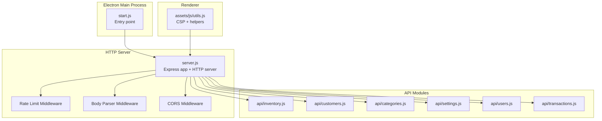
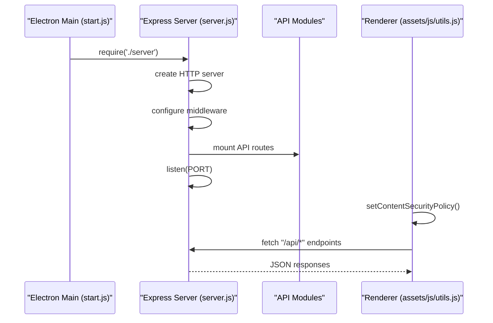
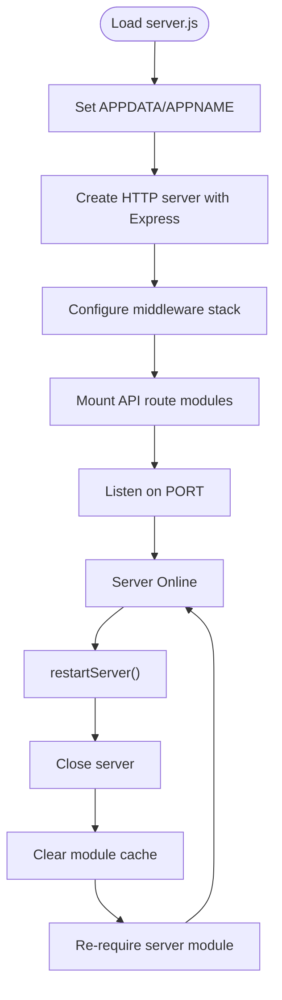
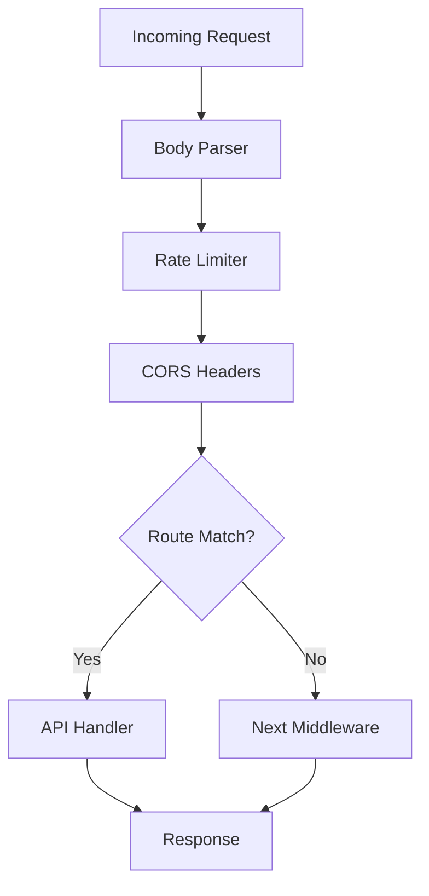
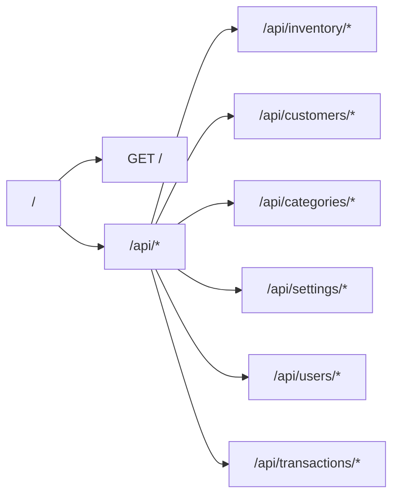
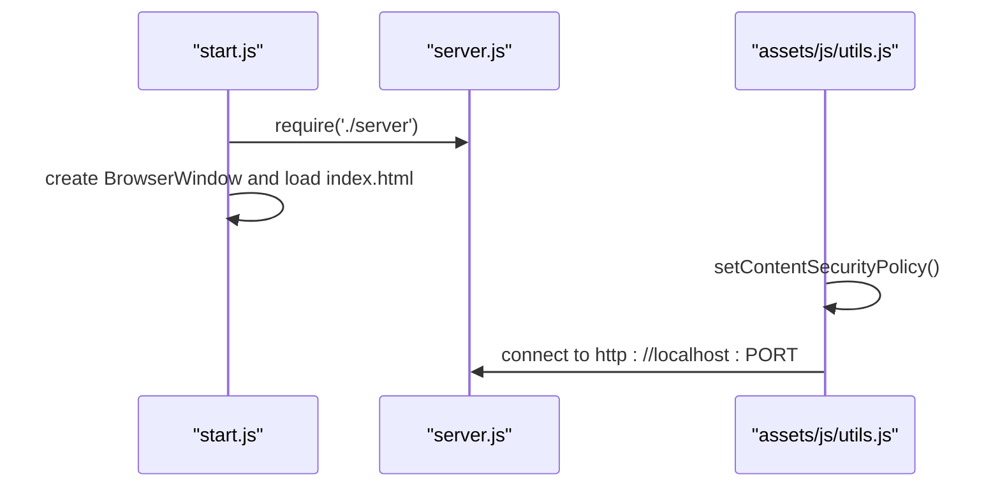
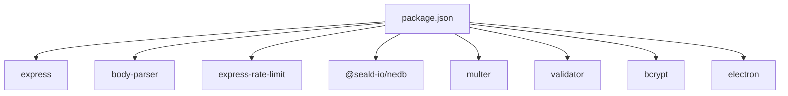

# Embedded HTTP Server

<cite>
**Referenced Files in This Document**
- [server.js](file://server.js)
- [start.js](file://start.js)
- [package.json](file://package.json)
- [app.config.js](file://app.config.js)
- [api/inventory.js](file://api/inventory.js)
- [api/customers.js](file://api/customers.js)
- [api/categories.js](file://api/categories.js)
- [api/settings.js](file://api/settings.js)
- [api/users.js](file://api/users.js)
- [api/transactions.js](file://api/transactions.js)
- [assets/js/utils.js](file://assets/js/utils.js)
</cite>

## Table of Contents
1. [Introduction](#introduction)
2. [Project Structure](#project-structure)
3. [Core Components](#core-components)
4. [Architecture Overview](#architecture-overview)
5. [Detailed Component Analysis](#detailed-component-analysis)
6. [Dependency Analysis](#dependency-analysis)
7. [Performance Considerations](#performance-considerations)
8. [Troubleshooting Guide](#troubleshooting-guide)
9. [Conclusion](#conclusion)

## Introduction
This document explains the embedded Express.js HTTP server architecture used by the application. It covers server initialization, middleware stack configuration (including CORS, rate limiting, and security headers), routing structure, API endpoint organization, request/response handling patterns, and the integration between the Electron main process and the Express server. It also documents configuration options, environment-specific settings, security considerations, error handling, logging, and performance optimization strategies.

## Project Structure
The embedded server is initialized in a dedicated module and mounted into the Electron main process. API routes are grouped by domain feature and mounted under a base path. Utilities provide shared helpers, including Content Security Policy generation for the renderer.

**Diagram sources**
- [server.js:1-68](file://server.js#L1-L68)
- [start.js:1-107](file://start.js#L1-L107)
- [api/inventory.js:1-333](file://api/inventory.js#L1-L333)
- [api/customers.js:1-151](file://api/customers.js#L1-L151)
- [api/categories.js:1-124](file://api/categories.js#L1-L124)
- [api/settings.js:1-192](file://api/settings.js#L1-L192)
- [api/users.js:1-311](file://api/users.js#L1-L311)
- [api/transactions.js:1-251](file://api/transactions.js#L1-L251)
- [assets/js/utils.js:1-112](file://assets/js/utils.js#L1-L112)

**Section sources**
- [server.js:1-68](file://server.js#L1-L68)
- [start.js:1-107](file://start.js#L1-L107)
- [package.json:18-55](file://package.json#L18-L55)

## Core Components
- Express server and HTTP server creation
- Body parsing middleware
- Rate limiting middleware
- Global CORS configuration
- API route modules mounted under a base path
- Port management and dynamic port assignment
- Server restart mechanism

Key implementation references:
- Server creation and port binding: [server.js:1-68](file://server.js#L1-L68)
- Middleware stack: [server.js:18-20](file://server.js#L18-L20)
- CORS middleware: [server.js:22-34](file://server.js#L22-L34)
- API mounts: [server.js:40-45](file://server.js#L40-L45)
- Restart function: [server.js:55-66](file://server.js#L55-L66)

**Section sources**
- [server.js:1-68](file://server.js#L1-L68)

## Architecture Overview
The Electron main process loads the server module and starts the HTTP server. The Express app configures global middleware and mounts feature-specific API modules. The renderer uses CSP utilities to connect securely to the local server.

**Diagram sources**
- [start.js:7](file://start.js#L7)
- [server.js:1-68](file://server.js#L1-L68)
- [assets/js/utils.js:91-99](file://assets/js/utils.js#L91-L99)

## Detailed Component Analysis

### Server Initialization and Lifecycle
- Creates an HTTP server backed by Express.
- Initializes environment variables for app data and name.
- Sets the listening port from environment or defaults to a fixed value.
- Starts the server and logs the effective port.
- Provides a restart function that closes the server, clears module caches, and re-requires the server module.

**Diagram sources**
- [server.js:1-68](file://server.js#L1-L68)

**Section sources**
- [server.js:1-68](file://server.js#L1-L68)

### Middleware Stack Configuration
- Body parsing for JSON and URL-encoded payloads.
- Rate limiting configured globally with a sliding window and request threshold.
- Global CORS headers applied to all routes.

**Diagram sources**
- [server.js:18-34](file://server.js#L18-L34)

**Section sources**
- [server.js:18-34](file://server.js#L18-L34)

### Routing Structure and API Organization
The server mounts feature-specific API modules under a base path. Each module encapsulates its own routes and data access logic.

**Diagram sources**
- [server.js:36-45](file://server.js#L36-L45)
- [api/inventory.js:78-266](file://api/inventory.js#L78-L266)
- [api/customers.js:36-121](file://api/customers.js#L36-L121)
- [api/categories.js:35-97](file://api/categories.js#L35-L97)
- [api/settings.js:60-190](file://api/settings.js#L60-L190)
- [api/users.js:35-170](file://api/users.js#L35-L170)
- [api/transactions.js:35-237](file://api/transactions.js#L35-L237)

**Section sources**
- [server.js:36-45](file://server.js#L36-L45)

### Request/Response Handling Patterns
- JSON bodies are parsed globally.
- Feature modules define CRUD endpoints and return either raw data or standardized JSON error responses on failure.
- Some endpoints perform asynchronous operations (e.g., decrementing inventory after successful transaction creation).

Representative patterns:
- Inventory create/update with file upload and sanitization: [api/inventory.js:124-240](file://api/inventory.js#L124-L240)
- Transactions create with inventory decrement trigger: [api/transactions.js:163-181](file://api/transactions.js#L163-L181)
- Users login with password hashing verification: [api/users.js:95-131](file://api/users.js#L95-L131)

**Section sources**
- [api/inventory.js:124-240](file://api/inventory.js#L124-L240)
- [api/transactions.js:163-181](file://api/transactions.js#L163-L181)
- [api/users.js:95-131](file://api/users.js#L95-L131)

### Electron Main Process Integration
- The main process requires the server module and initializes Electron features.
- The renderer uses a utility to set Content-Security-Policy that allows connections to the local server port.

**Diagram sources**
- [start.js:7](file://start.js#L7)
- [assets/js/utils.js:91-99](file://assets/js/utils.js#L91-L99)

**Section sources**
- [start.js:1-107](file://start.js#L1-L107)
- [assets/js/utils.js:91-99](file://assets/js/utils.js#L91-L99)

### Configuration Options and Environment-Specific Settings
- Port selection: The server reads the port from the environment variable or falls back to a default value. After startup, the actual bound port is stored back into the environment for use by the renderer.
- Application data and name: The server sets environment variables for application data path and app name, which are used by API modules to locate databases and uploads.
- Development behavior: The main process enables live reload during development.

References:
- Port management and environment variables: [server.js:8-10](file://server.js#L8-L10), [server.js:47-50](file://server.js#L47-L50)
- Renderer CSP port usage: [assets/js/utils.js:5](file://assets/js/utils.js#L5), [assets/js/utils.js:94](file://assets/js/utils.js#L94)
- Development live reload: [start.js:100-104](file://start.js#L100-L104)

**Section sources**
- [server.js:8-10](file://server.js#L8-L10)
- [server.js:47-50](file://server.js#L47-L50)
- [assets/js/utils.js:5](file://assets/js/utils.js#L5)
- [assets/js/utils.js:94](file://assets/js/utils.js#L94)
- [start.js:100-104](file://start.js#L100-L104)

### Security Considerations
- CORS: Applied globally to allow common methods and headers; an explicit OPTIONS handler returns a 200 status for preflight requests.
- Rate limiting: A global rate limiter is enabled to mitigate abuse.
- Input sanitization: API modules sanitize and validate inputs using a validator library and sanitize filenames.
- Password handling: Users’ passwords are hashed with a salt before persistence.
- CSP: The renderer dynamically injects a CSP that restricts resources and allows connections to the local server port.

References:
- CORS middleware: [server.js:22-34](file://server.js#L22-L34)
- Rate limit middleware: [server.js:11-14](file://server.js#L11-L14)
- Input sanitization and validation: [api/inventory.js:145-193](file://api/inventory.js#L145-L193), [api/users.js:179-259](file://api/users.js#L179-L259)
- Password hashing: [api/users.js:180-184](file://api/users.js#L180-L184)
- CSP generation: [assets/js/utils.js:91-99](file://assets/js/utils.js#L91-L99)

**Section sources**
- [server.js:22-34](file://server.js#L22-L34)
- [server.js:11-14](file://server.js#L11-L14)
- [api/inventory.js:145-193](file://api/inventory.js#L145-L193)
- [api/users.js:180-184](file://api/users.js#L180-L184)
- [assets/js/utils.js:91-99](file://assets/js/utils.js#L91-L99)

### Error Handling and Logging
- API endpoints consistently log errors to the console and return structured JSON error responses with appropriate HTTP status codes.
- The main process captures uncaught exceptions and unhandled rejections to prevent crashes and surface issues.

References:
- API error handling examples: [api/inventory.js:127-141](file://api/inventory.js#L127-L141), [api/transactions.js:167-173](file://api/transactions.js#L167-L173)
- Main process error capture: [start.js:67-73](file://start.js#L67-L73)

**Section sources**
- [api/inventory.js:127-141](file://api/inventory.js#L127-L141)
- [api/transactions.js:167-173](file://api/transactions.js#L167-L173)
- [start.js:67-73](file://start.js#L67-L73)

### API Endpoint Examples by Module
- Inventory: product retrieval, listing, create/update with image upload, SKU lookup, and inventory decrement helper.
- Customers: CRUD operations for customer records.
- Categories: CRUD operations for categories.
- Settings: retrieval and update of application settings with logo upload.
- Users: authentication, CRUD operations, and default admin initialization.
- Transactions: listing, filtering by date/user/till/status, creation, updates, deletions, and retrieval by ID.

References:
- Inventory endpoints: [api/inventory.js:78-294](file://api/inventory.js#L78-L294)
- Customers endpoints: [api/customers.js:36-151](file://api/customers.js#L36-L151)
- Categories endpoints: [api/categories.js:35-124](file://api/categories.js#L35-L124)
- Settings endpoints: [api/settings.js:60-190](file://api/settings.js#L60-L190)
- Users endpoints: [api/users.js:35-311](file://api/users.js#L35-L311)
- Transactions endpoints: [api/transactions.js:35-251](file://api/transactions.js#L35-L251)

**Section sources**
- [api/inventory.js:78-294](file://api/inventory.js#L78-L294)
- [api/customers.js:36-151](file://api/customers.js#L36-L151)
- [api/categories.js:35-124](file://api/categories.js#L35-L124)
- [api/settings.js:60-190](file://api/settings.js#L60-L190)
- [api/users.js:35-311](file://api/users.js#L35-L311)
- [api/transactions.js:35-251](file://api/transactions.js#L35-L251)

## Dependency Analysis
External dependencies relevant to the embedded server:
- Express and HTTP server creation
- Body parser for JSON and URL-encoded payloads
- Express rate limit for request throttling
- NeDB for local data persistence in API modules
- Multer and related utilities for file uploads
- Validator for input sanitization
- bcrypt for password hashing
- Electron for main process integration

**Diagram sources**
- [package.json:18-55](file://package.json#L18-L55)

**Section sources**
- [package.json:18-55](file://package.json#L18-L55)

## Performance Considerations
- Rate limiting reduces the risk of abuse and stabilizes throughput under load.
- Body parsing is centralized to avoid redundant parsing overhead.
- Consider adding compression middleware for large JSON payloads.
- Optimize database queries with appropriate indexes and avoid synchronous filesystem operations in hot paths.
- Monitor port availability and handle conflicts gracefully during startup.
- For development, leverage live reload to reduce restart cycles.

[No sources needed since this section provides general guidance]

## Troubleshooting Guide
Common issues and remedies:
- Port conflicts: Verify the port environment variable and ensure the port is reachable before starting the server.
- CORS failures: Confirm that the renderer’s CSP allows connections to the local server port and that the server responds to preflight requests.
- Upload errors: Validate file types and sizes; ensure upload directories exist and are writable.
- Authentication failures: Confirm hashed passwords and correct credential submission.
- Database errors: Check NeDB file permissions and path resolution using environment variables.

References:
- Port and environment usage: [server.js:8-10](file://server.js#L8-L10), [server.js:47-50](file://server.js#L47-L50)
- CSP port allowance: [assets/js/utils.js:94](file://assets/js/utils.js#L94)
- Upload handling: [api/inventory.js:125-141](file://api/inventory.js#L125-L141), [api/settings.js:91-107](file://api/settings.js#L91-L107)
- Authentication: [api/users.js:95-131](file://api/users.js#L95-L131)
- Database paths: [api/inventory.js:20-26](file://api/inventory.js#L20-L26), [api/customers.js:10-16](file://api/customers.js#L10-L16), [api/categories.js:9-15](file://api/categories.js#L9-L15), [api/settings.js:20-26](file://api/settings.js#L20-L26), [api/users.js:9-15](file://api/users.js#L9-L15), [api/transactions.js:9-15](file://api/transactions.js#L9-L15)

**Section sources**
- [server.js:8-10](file://server.js#L8-L10)
- [server.js:47-50](file://server.js#L47-L50)
- [assets/js/utils.js:94](file://assets/js/utils.js#L94)
- [api/inventory.js:125-141](file://api/inventory.js#L125-L141)
- [api/settings.js:91-107](file://api/settings.js#L91-L107)
- [api/users.js:95-131](file://api/users.js#L95-L131)
- [api/inventory.js:20-26](file://api/inventory.js#L20-L26)
- [api/customers.js:10-16](file://api/customers.js#L10-L16)
- [api/categories.js:9-15](file://api/categories.js#L9-L15)
- [api/settings.js:20-26](file://api/settings.js#L20-L26)
- [api/users.js:9-15](file://api/users.js#L9-L15)
- [api/transactions.js:9-15](file://api/transactions.js#L9-L15)

## Conclusion
The embedded Express server integrates cleanly with the Electron main process, providing a modular API surface organized by domain features. The middleware stack ensures basic security and resilience, while environment-driven configuration supports flexible deployment. Robust error handling and logging practices improve reliability. With careful attention to performance and security, the architecture supports scalable operation for the point-of-sale application.