# Shared Memory Coordination Protocol

<cite>
**Referenced Files in This Document**
- [README.md](file://shared-memory/README.md)
- [state.md](file://shared-memory/state.md)
- [open-items.md](file://shared-memory/open-items.md)
- [activity-log.ndjson](file://shared-memory/activity-log.ndjson)
- [use-pos-store.ts](file://web-prototype/src/lib/use-pos-store.ts)
- [db.ts](file://web-prototype/src/lib/db.ts)
- [types.ts](file://web-prototype/src/lib/types.ts)
- [observability.ts](file://web-prototype/src/lib/observability.ts)
- [feature-flags.ts](file://web-prototype/src/lib/feature-flags.ts)
- [seed.ts](file://web-prototype/src/lib/seed.ts)
- [calculations.ts](file://web-prototype/src/lib/calculations.ts)
- [pos-prototype.tsx](file://web-prototype/src/components/pos-prototype.tsx)
- [sync-backlog.md](file://web-prototype/docs/runbooks/sync-backlog.md)
- [terminal-mismatch.md](file://web-prototype/docs/runbooks/terminal-mismatch.md)
- [register-outage.md](file://web-prototype/docs/runbooks/register-outage.md)
- [rollback.md](file://web-prototype/docs/runbooks/rollback.md)
- [observability.md](file://web-prototype/docs/observability.md)
- [rollout-strategy.md](file://web-prototype/docs/rollout-strategy.md)
</cite>

## Table of Contents
1. [Introduction](#introduction)
2. [Protocol Overview](#protocol-overview)
3. [Shared Memory Files](#shared-memory-files)
4. [Web POS Integration](#web-pos-integration)
5. [Observability and Monitoring](#observability-and-monitoring)
6. [Runbook Procedures](#runbook-procedures)
7. [Deployment Strategy](#deployment-strategy)
8. [Conflict Resolution](#conflict-resolution)
9. [Recovery Procedures](#recovery-procedures)
10. [Best Practices](#best-practices)

## Introduction

The Shared Memory Coordination Protocol is a file-based coordination system designed to enable multiple AI agents (Codex, Antigravity, Gemini, Claude, Cursor, Qoder) to work collaboratively on the same codebase without losing context or stepping on each other's work. This protocol establishes a standardized way for agents to share state, track work items, and coordinate their activities through a simple, human-readable file system interface.

The system operates on the principle of explicit file sharing where each agent reads and writes to designated files that serve as the single source of truth for coordination. This approach ensures transparency, auditability, and easy recovery mechanisms while maintaining simplicity for both human and AI agents to understand and interact with.

## Protocol Overview

The Shared Memory Coordination Protocol consists of four primary files that work together to maintain shared understanding and coordinate agent activities:

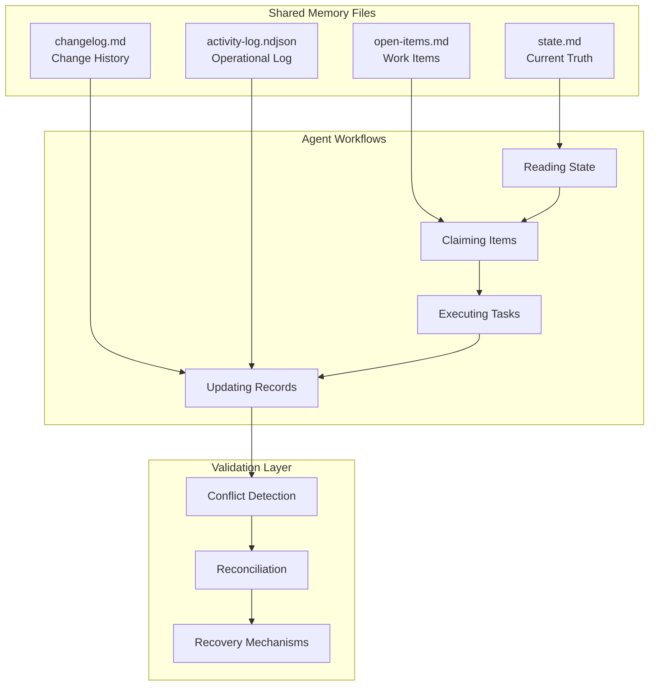

**Diagram sources**
- [README.md:7-13](file://shared-memory/README.md#L7-L13)
- [README.md:15-26](file://shared-memory/README.md#L15-L26)

The protocol follows a strict workflow pattern where agents must read the current state before starting work, claim specific items from the open-items list, execute their tasks, and then update all relevant coordination files upon completion. This ensures that no agent works on items that are already being processed by another agent.

## Shared Memory Files

### State Management (`state.md`)

The `state.md` file serves as the current truth repository, containing all essential information that agents need to understand the project's current status and direction. It follows a structured format with specific sections that must always be present:

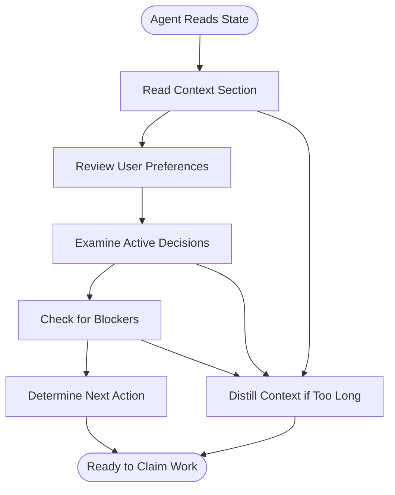

**Diagram sources**
- [README.md:30-41](file://shared-memory/README.md#L30-L41)

The state file maintains four critical sections:
- **Context**: Current project situation and immediate priorities
- **User Preferences**: User-defined constraints and guidelines
- **Active Decisions**: Finalized project decisions and agreements
- **Blockers**: Current obstacles and their causes
- **Next Action**: Specific tasks for the next agent to pick up

### Work Item Tracking (`open-items.md`)

The `open-items.md` file maintains a comprehensive list of all work items, their status, and ownership. Each item follows a specific format with status indicators and metadata:

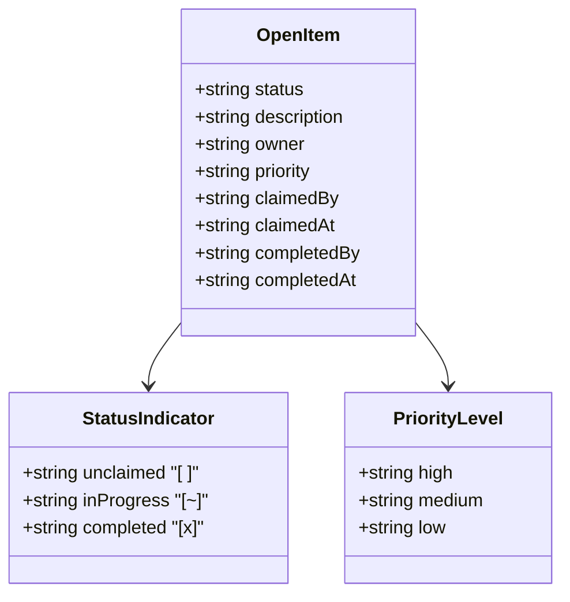

**Diagram sources**
- [README.md:64-75](file://shared-memory/README.md#L64-L75)

Item statuses include:
- `[ ]` Unclaimed items available for pickup
- `[~]` In-progress items currently being worked on
- `[x]` Completed items with completion metadata

### Change History (`changelog.md`)

The `changelog.md` file maintains a chronological record of significant changes to the shared understanding, providing historical context for decision-making and conflict resolution:

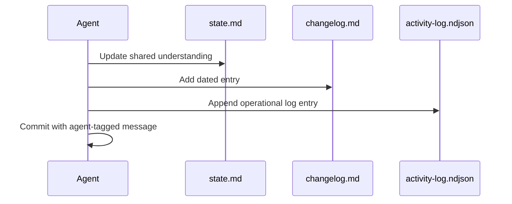

**Diagram sources**
- [README.md:42-50](file://shared-memory/README.md#L42-L50)

Each entry includes:
- Date and agent identifier
- Type of change (Added/Changed/Fixed/Removed)
- Brief description of the change
- Reason for the change

### Operational Logging (`activity-log.ndjson`)

The `activity-log.ndjson` file provides an append-only operational log of all meaningful actions taken by agents, serving as an audit trail and recovery mechanism:

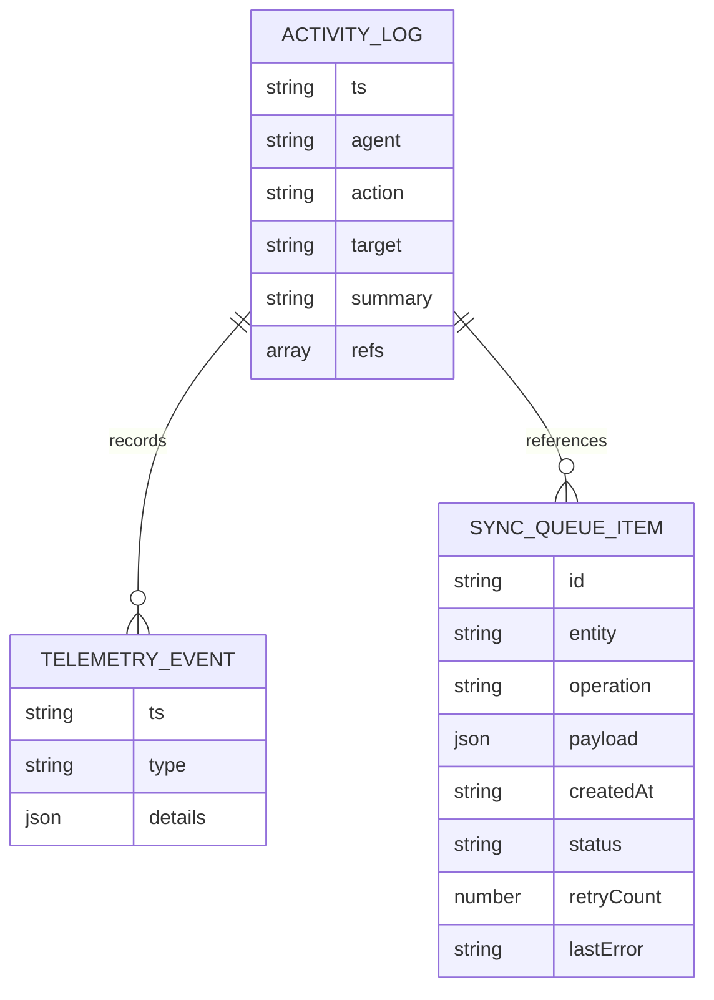

**Diagram sources**
- [README.md:52-62](file://shared-memory/README.md#L52-L62)

The log format includes:
- UTC ISO-8601 timestamps
- Agent identification
- Action types and targets
- Summary descriptions
- Reference pointers to related items

**Section sources**
- [README.md:1-85](file://shared-memory/README.md#L1-L85)

## Web POS Integration

The Shared Memory Protocol integrates seamlessly with the Web POS prototype through several key components that demonstrate practical application of the coordination principles:

### POS Store Architecture

The POS store implementation showcases how the shared memory concepts translate into real-world state management:

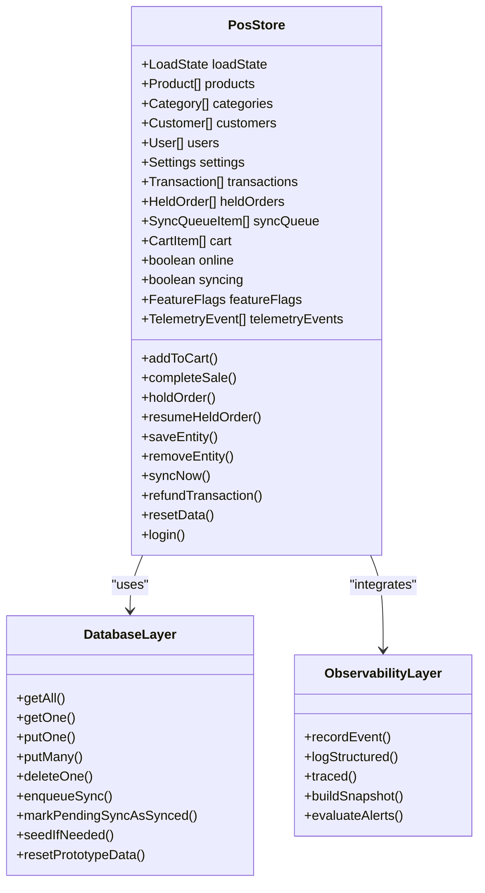

**Diagram sources**
- [use-pos-store.ts:51-432](file://web-prototype/src/lib/use-pos-store.ts#L51-L432)
- [db.ts:99-240](file://web-prototype/src/lib/db.ts#L99-L240)

### Real-time State Synchronization

The POS system demonstrates real-time state synchronization through its IndexedDB-backed architecture:

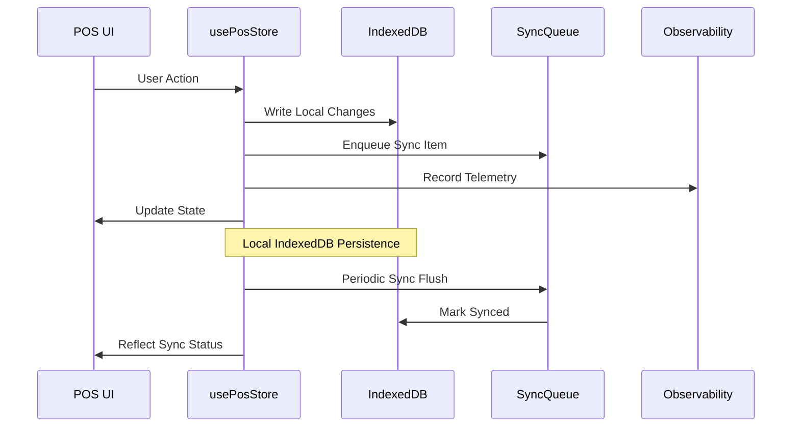

**Diagram sources**
- [use-pos-store.ts:206-260](file://web-prototype/src/lib/use-pos-store.ts#L206-L260)
- [db.ts:186-215](file://web-prototype/src/lib/db.ts#L186-L215)

### Feature Flag Management

The system implements a sophisticated feature flag system that aligns with the shared memory coordination principles:

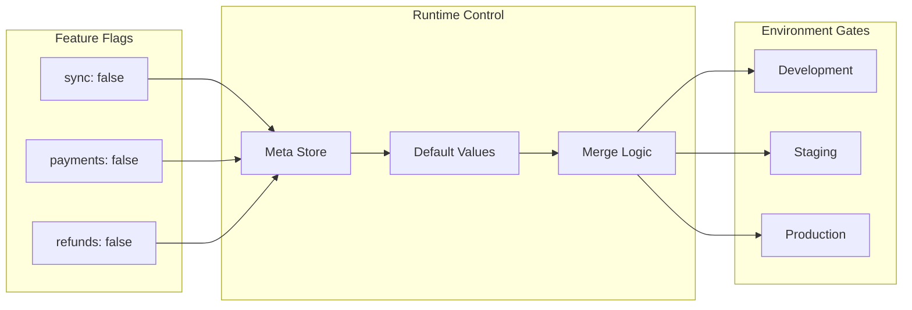

**Diagram sources**
- [feature-flags.ts:1-17](file://web-prototype/src/lib/feature-flags.ts#L1-L17)
- [db.ts:175-184](file://web-prototype/src/lib/db.ts#L175-L184)

**Section sources**
- [use-pos-store.ts:1-434](file://web-prototype/src/lib/use-pos-store.ts#L1-L434)
- [db.ts:1-241](file://web-prototype/src/lib/db.ts#L1-L241)
- [types.ts:1-126](file://web-prototype/src/lib/types.ts#L1-L126)
- [feature-flags.ts:1-17](file://web-prototype/src/lib/feature-flags.ts#L1-L17)

## Observability and Monitoring

The Web POS prototype implements comprehensive observability that complements the shared memory coordination system:

### Telemetry Event System

The observability layer captures structured telemetry for all critical operations:

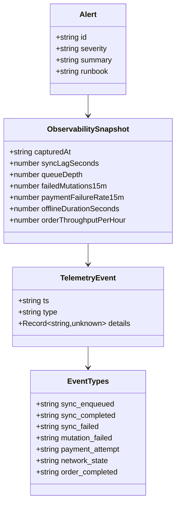

**Diagram sources**
- [observability.ts:3-40](file://web-prototype/src/lib/observability.ts#L3-L40)

### SLO-Based Alerting

The system implements Service Level Objective (SLO) based alerting that triggers runbook procedures:

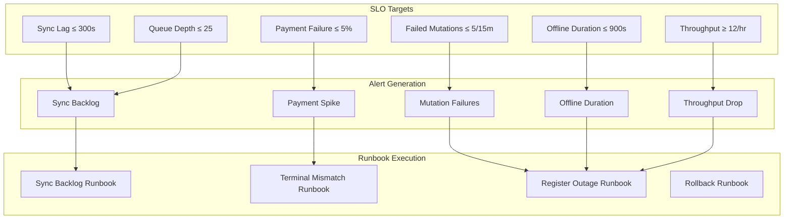

**Diagram sources**
- [observability.ts:96-103](file://web-prototype/src/lib/observability.ts#L96-L103)
- [observability.ts:146-195](file://web-prototype/src/lib/observability.ts#L146-L195)

**Section sources**
- [observability.ts:1-196](file://web-prototype/src/lib/observability.ts#L1-L196)
- [observability.md:1-35](file://web-prototype/docs/observability.md#L1-L35)

## Runbook Procedures

The system includes comprehensive runbooks for incident response and recovery:

### Sync Backlog Management

When the sync queue grows beyond acceptable limits, the sync-backlog runbook provides structured response procedures:

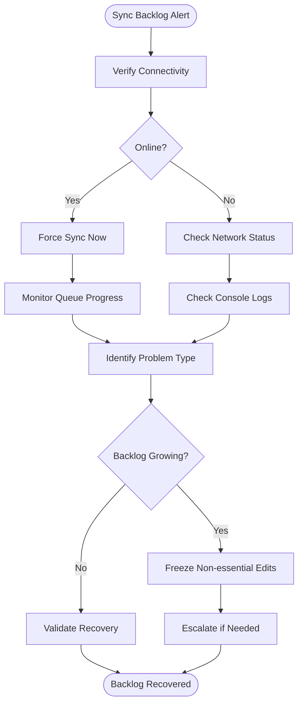

**Diagram sources**
- [sync-backlog.md:12-24](file://web-prototype/docs/runbooks/sync-backlog.md#L12-L24)

### Terminal Mismatch Resolution

For payment-related issues, the terminal-mismatch runbook provides systematic troubleshooting:

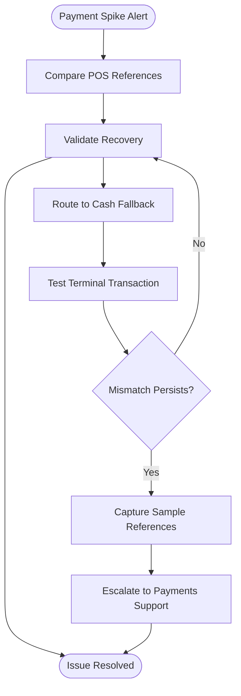

**Diagram sources**
- [terminal-mismatch.md:12-24](file://web-prototype/docs/runbooks/terminal-mismatch.md#L12-L24)

### Register Outage Response

For critical system failures, the register-outage runbook provides emergency procedures:

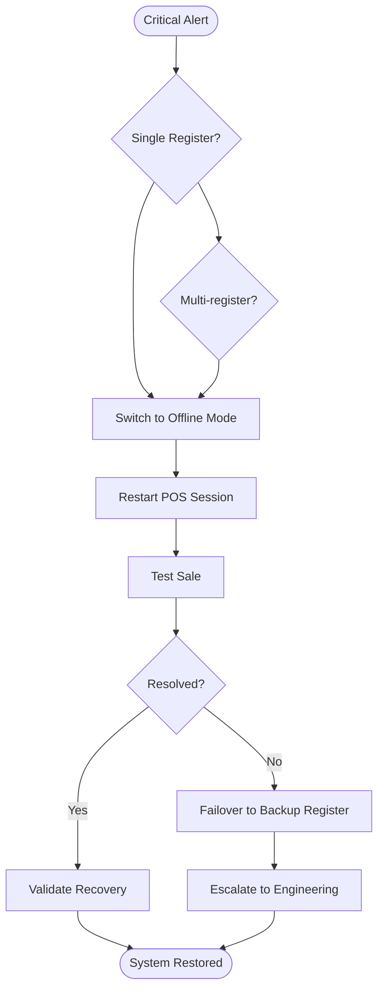

**Diagram sources**
- [register-outage.md:12-24](file://web-prototype/docs/runbooks/register-outage.md#L12-L24)

**Section sources**
- [sync-backlog.md:1-25](file://web-prototype/docs/runbooks/sync-backlog.md#L1-L25)
- [terminal-mismatch.md:1-25](file://web-prototype/docs/runbooks/terminal-mismatch.md#L1-L25)
- [register-outage.md:1-25](file://web-prototype/docs/runbooks/register-outage.md#L1-L25)
- [rollback.md:1-25](file://web-prototype/docs/runbooks/rollback.md#L1-L25)

## Deployment Strategy

The rollout strategy ensures safe deployment of changes while maintaining system stability:

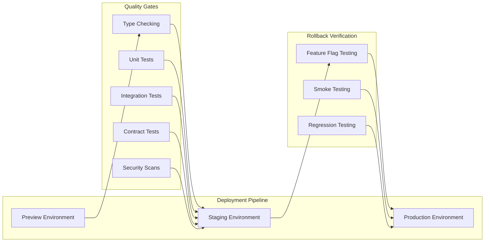

**Diagram sources**
- [rollout-strategy.md:3-22](file://web-prototype/docs/rollout-strategy.md#L3-L22)

The strategy emphasizes:
- **Three-tier deployment**: Preview → Staging → Production
- **Additive migrations**: Expand capabilities before reducing
- **Feature flag control**: Safe incremental feature activation
- **Rollback verification**: Automated testing of rollback procedures

**Section sources**
- [rollout-strategy.md:1-23](file://web-prototype/docs/rollout-strategy.md#L1-L23)

## Conflict Resolution

The protocol includes robust mechanisms for detecting and resolving conflicts between concurrent agents:

### Conflict Detection

Conflicts are detected through multiple validation mechanisms:

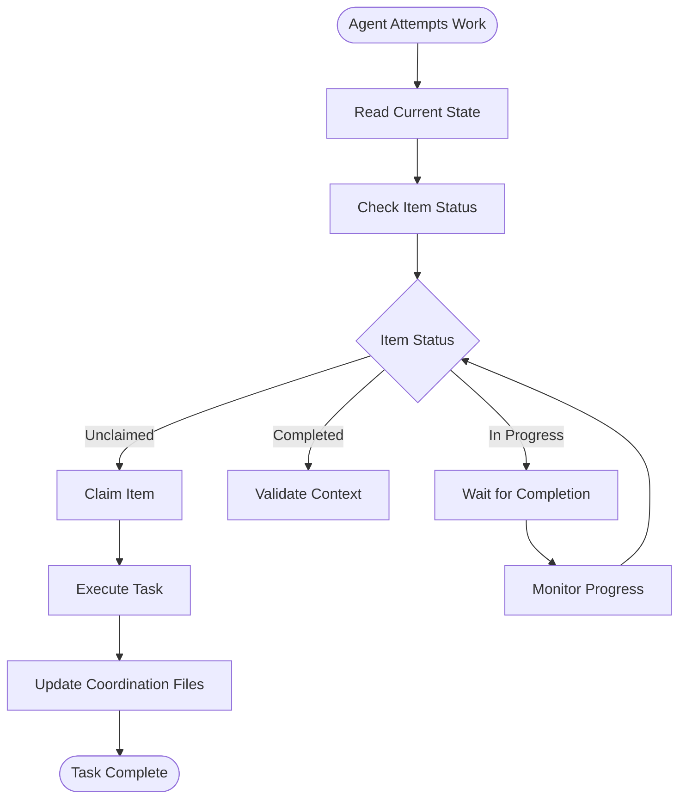

**Diagram sources**
- [README.md:76-81](file://shared-memory/README.md#L76-L81)

### Recovery Mechanisms

When conflicts occur, the system provides multiple recovery pathways:

1. **State Reconciliation**: Agents can reconcile state by examining recent activity logs and changelog entries
2. **Manual Intervention**: Human oversight can override automated processes when necessary
3. **Rollback Procedures**: Feature flags and deployment strategies enable safe rollbacks
4. **Audit Trails**: Comprehensive logging enables forensic analysis of conflicts

**Section sources**
- [README.md:82-85](file://shared-memory/README.md#L82-L85)

## Recovery Procedures

The system implements comprehensive recovery procedures for various failure scenarios:

### State File Recovery

When `state.md` becomes inconsistent, recovery follows a systematic approach:

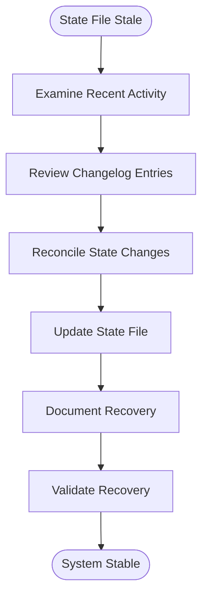

**Diagram sources**
- [README.md:82-85](file://shared-memory/README.md#L82-L85)

### Data Integrity Validation

The system validates data integrity through multiple checkpoints:

1. **Consistency Checks**: Cross-reference between state, open-items, and activity logs
2. **Transaction Validation**: Verify sync queue completeness and accuracy
3. **Audit Verification**: Confirm all changes have appropriate activity log entries
4. **Historical Review**: Validate changes against documented decision history

### Emergency Procedures

For critical system failures, emergency procedures ensure rapid recovery:

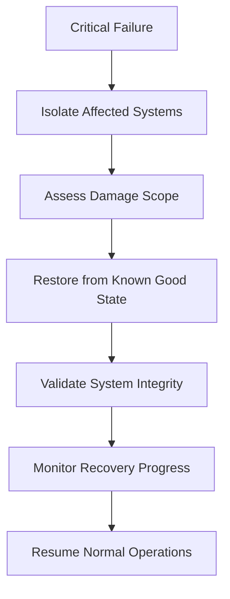

**Section sources**
- [README.md:82-85](file://shared-memory/README.md#L82-L85)

## Best Practices

### Agent Development Guidelines

Agents working with the Shared Memory Protocol should follow these best practices:

1. **Always Read Before Write**: Agents must read current state files before attempting any modifications
2. **Explicit Claims**: Items must be explicitly claimed before work begins
3. **Atomic Updates**: Changes to coordination files should be atomic to prevent corruption
4. **Clear Documentation**: All changes should include clear, concise summaries
5. **Minimal Impact**: Changes should be scoped to minimize disruption to other agents

### File Format Standards

The protocol maintains strict standards for file formatting:

- **Markdown Consistency**: State and open-items files use consistent markdown formatting
- **JSON Structure**: Activity logs follow strict JSON formatting with required fields
- **Timestamp Precision**: All timestamps use UTC ISO-8601 format with millisecond precision
- **Agent Tagging**: All commits include explicit agent identification

### Communication Protocols

Agents should communicate through the shared memory system:

- **Public Discussions**: Major decisions are documented in state.md
- **Private Notes**: Agent-specific notes can be added as comments
- **Status Updates**: Regular updates to open-items.md reflect current progress
- **Emergency Alerts**: Critical issues trigger immediate notifications

### Quality Assurance

The system includes built-in quality assurance mechanisms:

- **Automated Validation**: Schema validation for all coordination files
- **Cross-Reference Checks**: Consistency validation between related files
- **Audit Trail**: Complete history of all changes for accountability
- **Recovery Testing**: Regular testing of recovery procedures and rollback scenarios

**Section sources**
- [README.md:28-85](file://shared-memory/README.md#L28-L85)