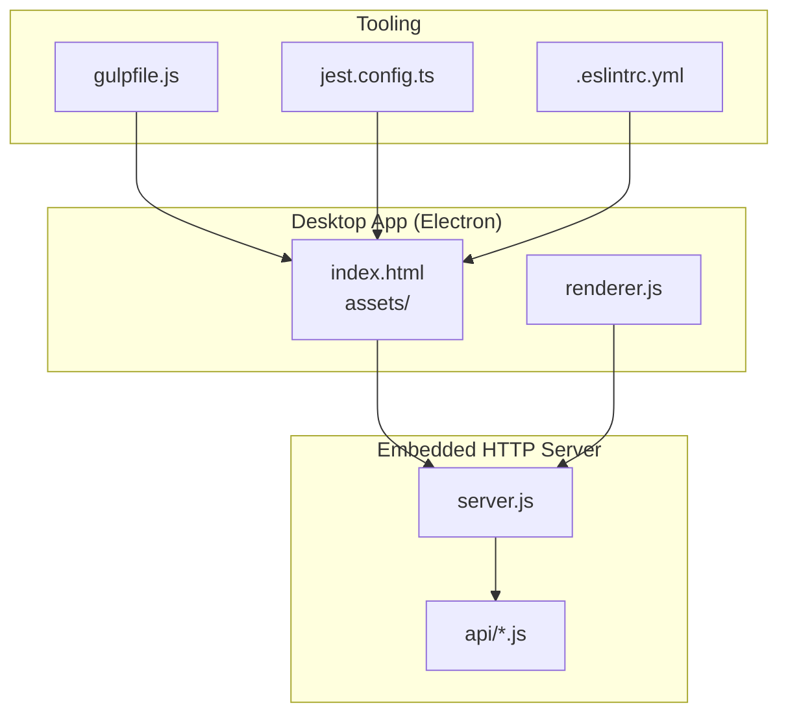
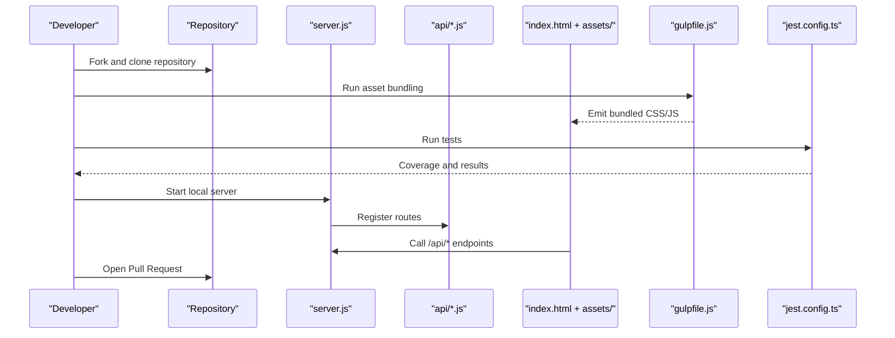
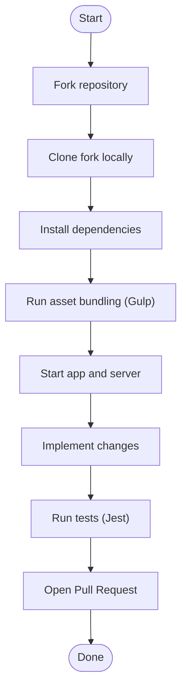
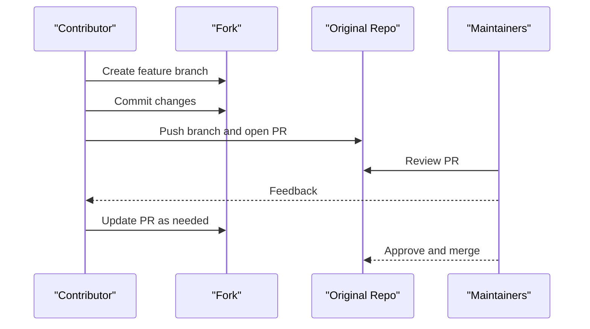
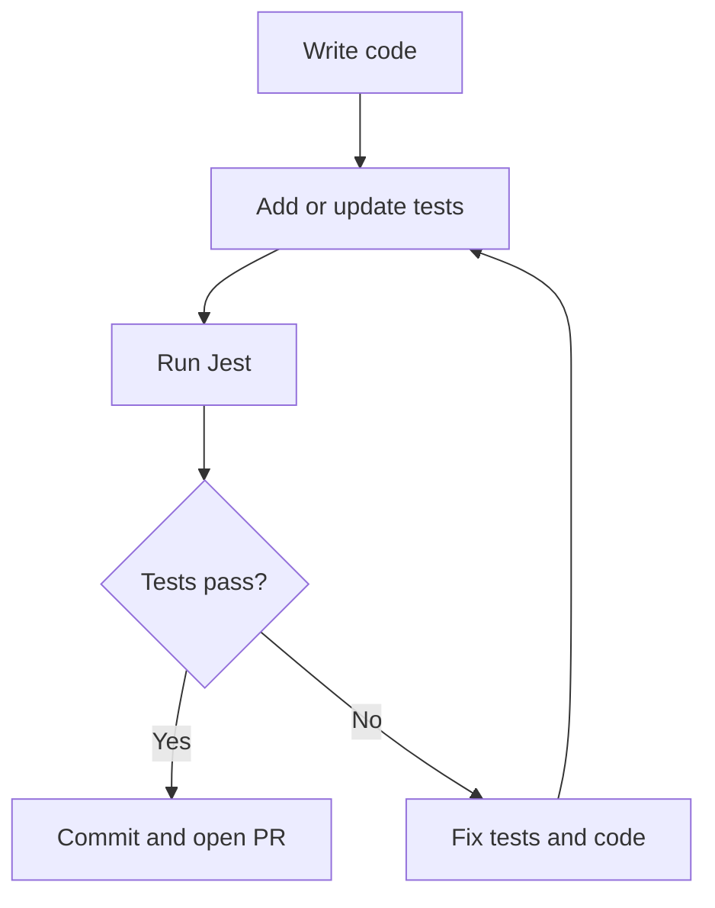
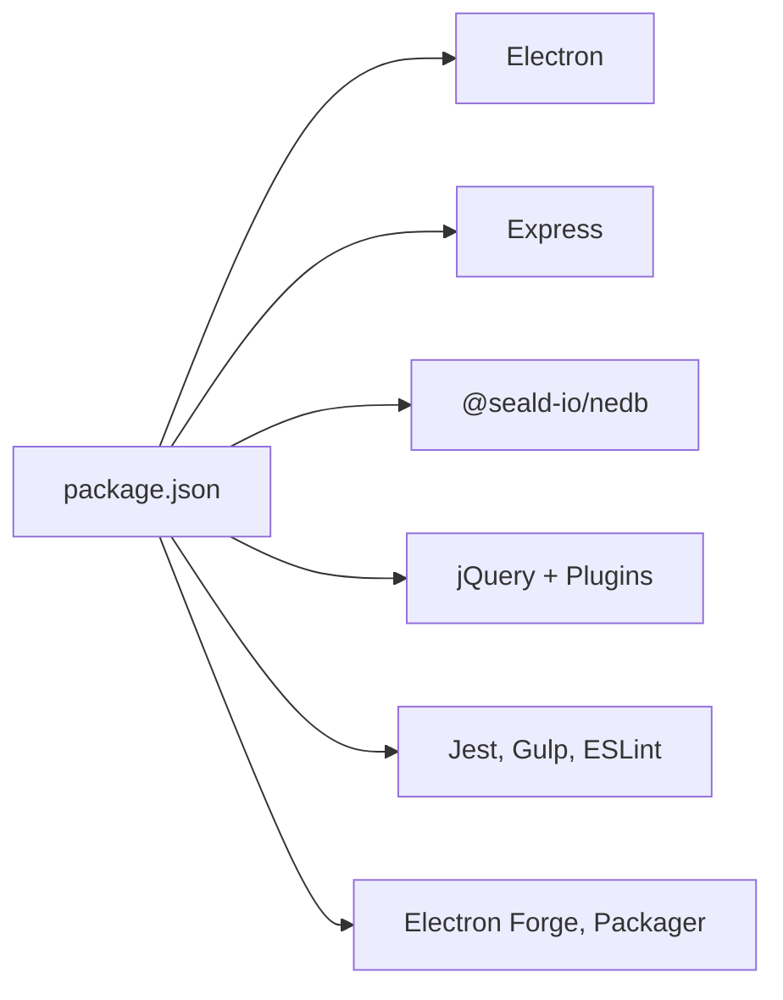

# Contributing Guidelines

<cite>
**Referenced Files in This Document**
- [CONTRIBUTING.md](file://CONTRIBUTING.md)
- [CODE_OF_CONDUCT.md](file://CODE_OF_CONDUCT.md)
- [README.md](file://README.md)
- [LICENSE](file://LICENSE)
- [package.json](file://package.json)
- [.eslintrc.yml](file://.eslintrc.yml)
- [jest.config.ts](file://jest.config.ts)
- [gulpfile.js](file://gulpfile.js)
- [server.js](file://server.js)
- [tests/utils.test.js](file://tests/utils.test.js)
- [docs/PRD.md](file://docs/PRD.md)
- [docs/TECH_STACK.md](file://docs/TECH_STACK.md)
- [.github/dependabot.yml](file://.github/dependabot.yml)
</cite>

## Table of Contents
1. [Introduction](#introduction)
2. [Project Structure](#project-structure)
3. [Core Components](#core-components)
4. [Architecture Overview](#architecture-overview)
5. [Detailed Component Analysis](#detailed-component-analysis)
6. [Dependency Analysis](#dependency-analysis)
7. [Performance Considerations](#performance-considerations)
8. [Troubleshooting Guide](#troubleshooting-guide)
9. [Conclusion](#conclusion)
10. [Appendices](#appendices)

## Introduction
This document provides comprehensive contributing guidelines for PharmaSpot POS. It explains how to set up a development environment, follow the development workflow, meet code standards, submit issues and pull requests, and understand the project’s governance, testing, and licensing terms. The goal is to make contributions safe, predictable, and collaborative for all participants.

## Project Structure
PharmaSpot POS is a desktop Point of Sale application built with Electron. The repository includes:
- A local HTTP server exposing REST endpoints under /api/
- A static HTML/JS/CSS UI served from index.html and assets/
- Build tooling with Gulp for bundling and minification
- A test suite powered by Jest
- Contribution and governance documents

**Diagram sources**
- [server.js:1-68](file://server.js#L1-L68)
- [gulpfile.js:1-80](file://gulpfile.js#L1-L80)
- [jest.config.ts:1-200](file://jest.config.ts#L1-L200)
- [.eslintrc.yml:1-8](file://.eslintrc.yml#L1-L8)

**Section sources**
- [README.md:61-77](file://README.md#L61-L77)
- [docs/TECH_STACK.md:14-64](file://docs/TECH_STACK.md#L14-L64)

## Core Components
- Development environment and scripts are defined in the project configuration and scripts.
- The embedded HTTP server registers API routes for inventory, customers, categories, settings, users, and transactions.
- Asset bundling and minification are handled by Gulp.
- Testing is performed with Jest and includes mocking for filesystem and cryptographic operations.
- Code quality is enforced via ESLint configuration.

**Section sources**
- [package.json:93-102](file://package.json#L93-L102)
- [server.js:40-46](file://server.js#L40-L46)
- [gulpfile.js:51-79](file://gulpfile.js#L51-L79)
- [jest.config.ts:18-29](file://jest.config.ts#L18-L29)
- [.eslintrc.yml:1-8](file://.eslintrc.yml#L1-L8)

## Architecture Overview
The application architecture consists of:
- Electron main process initializes the desktop app and sets environment variables for storage.
- An Express-based HTTP server listens on a configurable port and exposes REST endpoints.
- Static UI assets are bundled and served to the renderer process.
- Tests validate utility functions and simulate real-world scenarios.

**Diagram sources**
- [server.js:1-68](file://server.js#L1-L68)
- [gulpfile.js:1-80](file://gulpfile.js#L1-L80)
- [jest.config.ts:1-200](file://jest.config.ts#L1-L200)
- [README.md:70-77](file://README.md#L70-L77)

## Detailed Component Analysis

### Development Workflow
- Fork the repository and clone your fork locally.
- Install dependencies and run the development scripts to start the app and server.
- Use Gulp to bundle and minify assets during development.
- Run tests to validate changes and ensure coverage.

**Section sources**
- [CONTRIBUTING.md:14-31](file://CONTRIBUTING.md#L14-L31)
- [README.md:70-77](file://README.md#L70-L77)
- [gulpfile.js:51-79](file://gulpfile.js#L51-L79)
- [jest.config.ts:18-29](file://jest.config.ts#L18-L29)

### Pull Request Procedure
- Create a feature branch for your work.
- Commit with descriptive messages and keep commits focused.
- Push your branch and open a pull request targeting the main branch.
- Ensure tests pass and follow the project’s code style.

**Section sources**
- [CONTRIBUTING.md:32-51](file://CONTRIBUTING.md#L32-L51)

### Issue Reporting Guidelines
- Search the issue tracker for duplicates before filing a new issue.
- Provide clear titles and descriptions, and include steps to reproduce for bugs.
- For major changes, open an issue first to discuss proposed modifications.

**Section sources**
- [CONTRIBUTING.md:10-12](file://CONTRIBUTING.md#L10-L12)
- [README.md:82-86](file://README.md#L82-L86)

### Code Review Process
- Maintainers review PRs for correctness, adherence to style, and alignment with project goals.
- Address feedback promptly and update the PR accordingly.
- Ensure tests remain green and documentation is updated as needed.

[No sources needed since this section provides general guidance]

### Coding Conventions
- Follow the existing code style and conventions.
- Write clear, concise code with meaningful comments where necessary.
- Use descriptive commit messages and PR titles.

**Section sources**
- [CONTRIBUTING.md:53-58](file://CONTRIBUTING.md#L53-L58)
- [.eslintrc.yml:1-8](file://.eslintrc.yml#L1-L8)

### Documentation Requirements
- Update relevant documentation when changing behavior or adding features.
- Keep the product requirements and tech stack documents synchronized with implementation.

**Section sources**
- [docs/PRD.md:43-50](file://docs/PRD.md#L43-L50)
- [docs/TECH_STACK.md:1-64](file://docs/TECH_STACK.md#L1-L64)

### Testing Expectations
- Run tests locally before submitting changes.
- Maintain and improve test coverage where applicable.
- Mock external dependencies appropriately in tests.

**Section sources**
- [jest.config.ts:18-29](file://jest.config.ts#L18-L29)
- [tests/utils.test.js:1-191](file://tests/utils.test.js#L1-L191)

### Project Governance and Community Guidelines
- Adhere to the Code of Conduct in all interactions.
- Reports of unacceptable behavior should be directed to the designated enforcement channel.
- Community leaders have the authority to moderate contributions and enforce standards.

**Section sources**
- [CODE_OF_CONDUCT.md:1-129](file://CODE_OF_CONDUCT.md#L1-L129)
- [CONTRIBUTING.md:63-65](file://CONTRIBUTING.md#L63-L65)

### Licensing and Intellectual Property
- Contributions are licensed under the MIT License.
- By contributing, you agree that your contributions will be licensed under the project’s license.

**Section sources**
- [LICENSE:1-22](file://LICENSE#L1-L22)
- [CONTRIBUTING.md:59-61](file://CONTRIBUTING.md#L59-L61)

### Contribution Types
- Code contributions: Implement features, fix bugs, improve performance, and enhance stability.
- Documentation: Clarify usage, update API documentation, and improve onboarding materials.
- Testing: Add or improve unit and integration tests.
- Bug reports: Provide reproducible steps and environment details.

**Section sources**
- [CONTRIBUTING.md:10-12](file://CONTRIBUTING.md#L10-L12)
- [README.md:82-86](file://README.md#L82-L86)

## Dependency Analysis
External dependencies and tooling are managed via package.json. The tech stack and build pipeline are documented in the tech stack document.

**Diagram sources**
- [package.json:18-55](file://package.json#L18-L55)
- [package.json:115-145](file://package.json#L115-L145)
- [docs/TECH_STACK.md:5-64](file://docs/TECH_STACK.md#L5-L64)

**Section sources**
- [package.json:18-145](file://package.json#L18-L145)
- [docs/TECH_STACK.md:14-64](file://docs/TECH_STACK.md#L14-L64)

## Performance Considerations
- Keep UI asset bundles minimal and avoid unnecessary dependencies.
- Prefer efficient algorithms in utility functions and limit heavy synchronous operations.
- Monitor server-side rate limits and optimize API response sizes.

[No sources needed since this section provides general guidance]

## Troubleshooting Guide
- Environment setup issues: Verify Node.js and npm/yarn versions, reinstall dependencies, and ensure ports are available.
- Server startup errors: Confirm the port is not in use and that environment variables are set correctly.
- Asset bundling problems: Check Gulp tasks and ensure all source paths are correct.
- Test failures: Inspect Jest configuration, mocks, and test coverage thresholds.

**Section sources**
- [README.md:70-77](file://README.md#L70-L77)
- [server.js:10-14](file://server.js#L10-L14)
- [gulpfile.js:11-14](file://gulpfile.js#L11-L14)
- [jest.config.ts:18-29](file://jest.config.ts#L18-L29)

## Conclusion
By following these guidelines, contributors can collaborate effectively, maintain code quality, and ensure the long-term health of PharmaSpot POS. Thank you for contributing to the project.

## Appendices

### Setup Instructions
- Install dependencies and run the app, server, bundling, and tests as described in the repository documentation.

**Section sources**
- [README.md:70-77](file://README.md#L70-L77)

### Development Environment Requirements
- Node.js and npm/yarn are required to run scripts and manage dependencies.
- Electron, Express, and related libraries are used for building and serving the application.

**Section sources**
- [package.json:18-55](file://package.json#L18-L55)
- [docs/TECH_STACK.md:5-12](file://docs/TECH_STACK.md#L5-L12)

### Security and Rate Limiting
- The server applies a rate limiter to API endpoints to mitigate abuse.
- CORS is enabled for development convenience; adjust as needed for production.

**Section sources**
- [server.js:11-34](file://server.js#L11-L34)

### Automated Dependency Updates
- Dependabot is configured to periodically check for dependency updates.

**Section sources**
- [.github/dependabot.yml:1-12](file://.github/dependabot.yml#L1-L12)