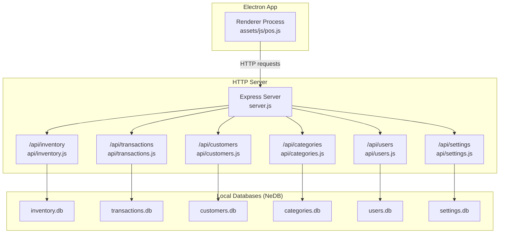
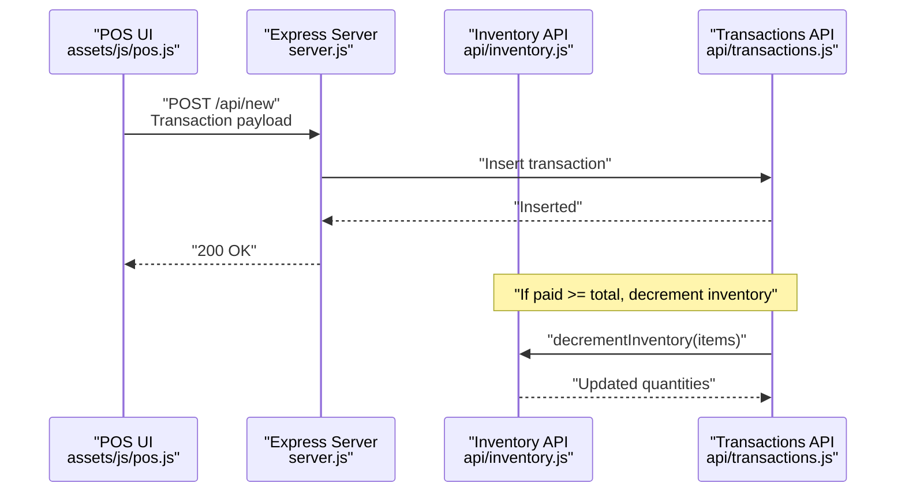
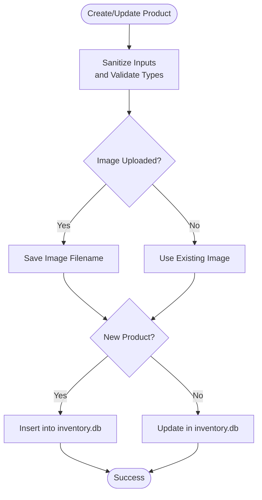
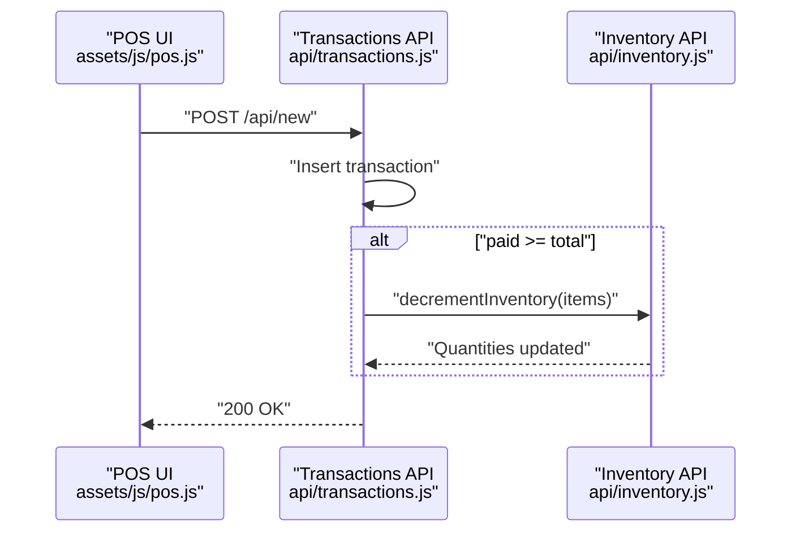
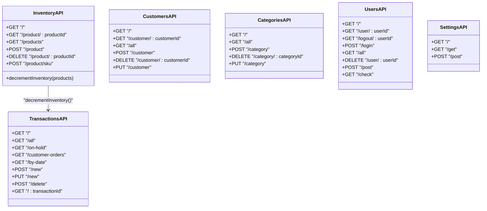
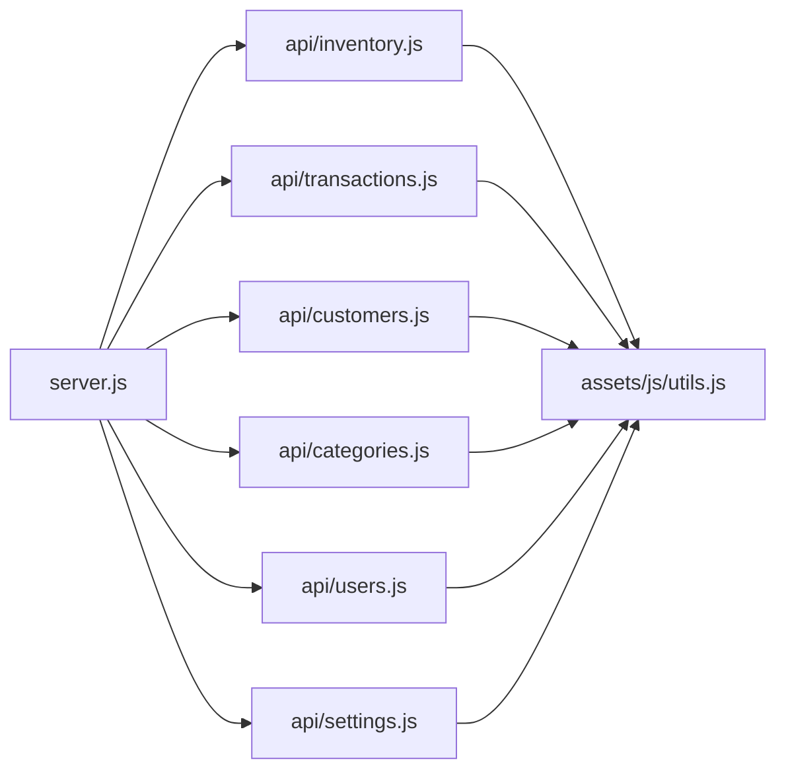
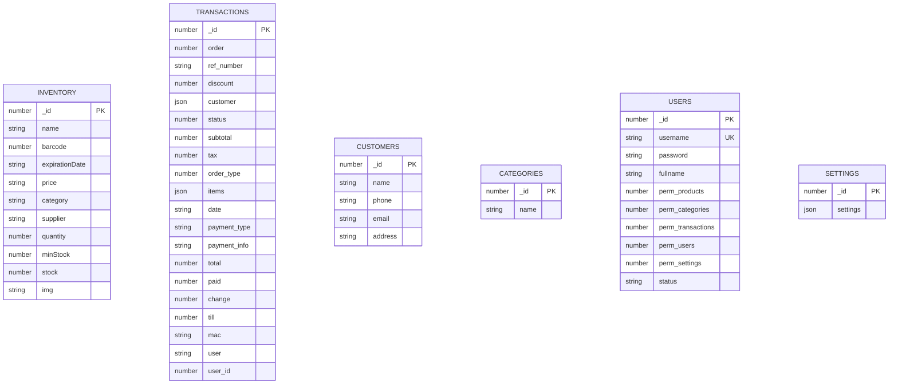

# Data Lifecycle

<cite>
**Referenced Files in This Document**
- [server.js](file://server.js)
- [app.config.js](file://app.config.js)
- [api/inventory.js](file://api/inventory.js)
- [api/transactions.js](file://api/transactions.js)
- [api/customers.js](file://api/customers.js)
- [api/categories.js](file://api/categories.js)
- [api/users.js](file://api/users.js)
- [api/settings.js](file://api/settings.js)
- [assets/js/utils.js](file://assets/js/utils.js)
- [assets/js/pos.js](file://assets/js/pos.js)
- [README.md](file://README.md)
</cite>

## Table of Contents
1. [Introduction](#introduction)
2. [Project Structure](#project-structure)
3. [Core Components](#core-components)
4. [Architecture Overview](#architecture-overview)
5. [Detailed Component Analysis](#detailed-component-analysis)
6. [Dependency Analysis](#dependency-analysis)
7. [Performance Considerations](#performance-considerations)
8. [Troubleshooting Guide](#troubleshooting-guide)
9. [Conclusion](#conclusion)
10. [Appendices](#appendices)

## Introduction
This document describes the data lifecycle management and database maintenance for PharmaSpot POS. It covers how data is created, modified, archived, and deleted across inventory, transactions, customers, categories, users, and settings. It also explains validation at each lifecycle stage, audit trail considerations, integrity checks, backup and recovery procedures, migration strategies, version management, retention policies, cleanup procedures, archival workflows, consistency during transactions, concurrent access handling, corruption prevention, and automation.

## Project Structure
PharmaSpot POS is a desktop application using Electron with an Express HTTP server exposing REST APIs backed by NeDB (a JavaScript database). Data is stored locally under the application’s AppData directory, organized by logical domains (inventory, transactions, customers, categories, users, settings). The client-side POS interface communicates with the server via HTTP endpoints.

**Diagram sources**
- [server.js:1-68](file://server.js#L1-L68)
- [api/inventory.js:1-333](file://api/inventory.js#L1-L333)
- [api/transactions.js:1-251](file://api/transactions.js#L1-L251)
- [api/customers.js:1-151](file://api/customers.js#L1-L151)
- [api/categories.js:1-124](file://api/categories.js#L1-L124)
- [api/users.js:1-311](file://api/users.js#L1-L311)
- [api/settings.js:1-192](file://api/settings.js#L1-L192)

**Section sources**
- [server.js:1-68](file://server.js#L1-L68)
- [README.md:1-91](file://README.md#L1-L91)

## Core Components
- Inventory API: Manages product records, SKUs, images, and quantity adjustments during transactions.
- Transactions API: Stores sale records, supports creation, updates, and deletions, and triggers inventory decrement.
- Customers API: Maintains customer profiles.
- Categories API: Manages product categories.
- Users API: Handles authentication, permissions, and user lifecycle.
- Settings API: Stores application-wide settings and branding assets.
- Utilities: Provide stock status, expiry checks, file filtering, hashing, and CSP configuration.

**Section sources**
- [api/inventory.js:1-333](file://api/inventory.js#L1-L333)
- [api/transactions.js:1-251](file://api/transactions.js#L1-L251)
- [api/customers.js:1-151](file://api/customers.js#L1-L151)
- [api/categories.js:1-124](file://api/categories.js#L1-L124)
- [api/users.js:1-311](file://api/users.js#L1-L311)
- [api/settings.js:1-192](file://api/settings.js#L1-L192)
- [assets/js/utils.js:1-112](file://assets/js/utils.js#L1-L112)

## Architecture Overview
The system follows a client-server model:
- The Electron renderer (POS UI) sends HTTP requests to the local Express server.
- The server routes requests to domain-specific APIs.
- Each API interacts with a dedicated NeDB database file.
- Transaction creation triggers inventory updates.

**Diagram sources**
- [assets/js/pos.js:922-954](file://assets/js/pos.js#L922-L954)
- [api/transactions.js:163-181](file://api/transactions.js#L163-L181)
- [api/inventory.js:302-332](file://api/inventory.js#L302-L332)

**Section sources**
- [assets/js/pos.js:922-954](file://assets/js/pos.js#L922-L954)
- [api/transactions.js:163-181](file://api/transactions.js#L163-L181)
- [api/inventory.js:302-332](file://api/inventory.js#L302-L332)

## Detailed Component Analysis

### Inventory Data Lifecycle
- Creation: Unique product IDs are generated; product documents include identifiers, pricing, category, supplier, quantity, name, stock mode, minimum stock, and optional image filename.
- Modification: Products can be updated; images may be uploaded or removed; validators sanitize inputs.
- Deletion: Products are removed by ID.
- Validation:
  - Unique index on product ID.
  - Input sanitization and numeric conversions.
  - Image upload filtering and size limits.
- Integrity:
  - Unique product ID enforcement.
  - Quantity updates performed per item in series to avoid race conditions.
- Audit and Archival:
  - No explicit audit logs in the code; consider adding a separate audit collection or log entries on create/update/delete.
- Expiry and Stock:
  - Expiry checks and stock status computed in the UI; inventory quantity decremented on successful payment.

**Diagram sources**
- [api/inventory.js:124-240](file://api/inventory.js#L124-L240)

**Section sources**
- [api/inventory.js:46-49](file://api/inventory.js#L46-L49)
- [api/inventory.js:124-240](file://api/inventory.js#L124-L240)
- [api/inventory.js:249-266](file://api/inventory.js#L249-L266)
- [api/inventory.js:302-332](file://api/inventory.js#L302-L332)

### Transactions Data Lifecycle
- Creation: New transactions inserted with metadata (order number, items, totals, payments, user, till, MAC).
- Modification: Existing transactions updated by ID.
- Deletion: Transactions removed by ID.
- Validation:
  - Unique index on transaction ID.
  - Conditional inventory decrement when paid amount meets threshold.
- Integrity:
  - Single insert/update/delete per transaction request.
  - Inventory updates occur after successful transaction insertion.
- Audit and Archival:
  - No explicit audit logs; consider archiving old transactions to a read-only collection or external archive.

**Diagram sources**
- [assets/js/pos.js:922-954](file://assets/js/pos.js#L922-L954)
- [api/transactions.js:163-181](file://api/transactions.js#L163-L181)
- [api/inventory.js:302-332](file://api/inventory.js#L302-L332)

**Section sources**
- [api/transactions.js:21-24](file://api/transactions.js#L21-L24)
- [api/transactions.js:163-181](file://api/transactions.js#L163-L181)
- [api/transactions.js:189-210](file://api/transactions.js#L189-L210)
- [api/transactions.js:219-237](file://api/transactions.js#L219-L237)

### Customers, Categories, Users, Settings
- Customers: CRUD operations with unique ID indexing.
- Categories: CRUD operations with auto-generated IDs.
- Users: Authentication, permission-based updates, default admin initialization.
- Settings: Application settings and branding image management with upload filtering.

**Diagram sources**
- [api/inventory.js:78-266](file://api/inventory.js#L78-L266)
- [api/transactions.js:35-251](file://api/transactions.js#L35-L251)
- [api/customers.js:36-151](file://api/customers.js#L36-L151)
- [api/categories.js:35-124](file://api/categories.js#L35-L124)
- [api/users.js:35-311](file://api/users.js#L35-L311)
- [api/settings.js:60-192](file://api/settings.js#L60-L192)

**Section sources**
- [api/customers.js:22-25](file://api/customers.js#L22-L25)
- [api/categories.js:21-24](file://api/categories.js#L21-L24)
- [api/users.js:21-24](file://api/users.js#L21-L24)
- [api/settings.js:46-49](file://api/settings.js#L46-L49)

### Data Validation and Integrity Checks
- Input sanitization and type coercion are applied across APIs to reduce injection risks and ensure consistent types.
- Unique indexes on primary keys (product ID, transaction ID, customer ID, category ID, user ID) enforce referential integrity at the datastore level.
- Inventory quantity updates are processed serially to minimize race conditions during concurrent transactions.

**Section sources**
- [api/inventory.js:178-193](file://api/inventory.js#L178-L193)
- [api/transactions.js:166-179](file://api/transactions.js#L166-L179)
- [api/inventory.js:302-332](file://api/inventory.js#L302-L332)

### Audit Trails and Data Integrity
- Current implementation does not include explicit audit logs for create/update/delete events.
- Integrity relies on unique indexes and atomic operations per request. For stronger auditing, consider:
  - Adding an audit collection with timestamps, actor, operation type, and diffs.
  - Enabling database journaling and checkpointing where applicable.

**Section sources**
- [api/inventory.js:51](file://api/inventory.js#L51)
- [api/transactions.js:26](file://api/transactions.js#L26)
- [api/customers.js:27](file://api/customers.js#L27)
- [api/categories.js:26](file://api/categories.js#L26)
- [api/users.js:26](file://api/users.js#L26)

### Backup and Recovery Procedures
- Local databases are NeDB files stored under the application’s AppData directory.
- Recommended procedure:
  - Stop the server.
  - Copy the databases directory to a secure location.
  - To restore, replace the databases directory with the backup copy and restart the server.
- Version management:
  - Maintain numbered backup folders (e.g., backups/2025-06-01_14-30).
- Migration strategies:
  - For schema changes, export data, apply schema updates, and re-import with a compatibility script.

**Section sources**
- [api/inventory.js:20-26](file://api/inventory.js#L20-L26)
- [api/transactions.js:9-15](file://api/transactions.js#L9-L15)
- [api/customers.js:10-16](file://api/customers.js#L10-L16)
- [api/categories.js:9-15](file://api/categories.js#L9-L15)
- [api/users.js:9-15](file://api/users.js#L9-L15)
- [api/settings.js:20-26](file://api/settings.js#L20-L26)

### Data Retention Policies and Cleanup
- Retention:
  - Define a policy for retaining transactions (e.g., keep 2–5 years).
  - Archive older transactions to a separate collection or external storage.
- Cleanup:
  - Periodic pruning of very old records.
  - Optional anonymization of personal data per policy.
- Archival workflows:
  - Export transactions by date range to CSV/JSON for offsite storage.
  - Compress and encrypt archives.

**Section sources**
- [api/transactions.js:91-154](file://api/transactions.js#L91-L154)

### Concurrency and Consistency During Transactions
- Single-request atomicity: Each insert/update/delete is handled in a single request.
- Serial inventory updates: Items are decremented sequentially to avoid race conditions.
- Recommendations:
  - Introduce optimistic concurrency control (e.g., version fields) for high-concurrency scenarios.
  - Consider wrapping critical sections in a transaction-like pattern if supported by the datastore.

**Section sources**
- [api/transactions.js:163-181](file://api/transactions.js#L163-L181)
- [api/inventory.js:302-332](file://api/inventory.js#L302-L332)

### Data Corruption Prevention
- File upload filtering and size limits reduce invalid data.
- Unique indexes and input sanitization improve data integrity.
- Recommendations:
  - Add checksum verification for uploaded assets.
  - Implement periodic integrity checks and repair routines.
  - Use database journaling and disable auto-sync for write-heavy workloads.

**Section sources**
- [assets/js/utils.js:65-87](file://assets/js/utils.js#L65-L87)
- [api/inventory.js:11-16](file://api/inventory.js#L11-L16)
- [api/settings.js:12-18](file://api/settings.js#L12-L18)

### Automated Maintenance Tasks and Manual Intervention
- Automated:
  - Daily/weekly exports of transaction summaries.
  - Scheduled cleanup of temporary files and old logs.
  - Integrity checks and backup scheduling.
- Manual:
  - Restore from backups after failures.
  - Schema migrations and data fixes.
  - Review and approve bulk operations.

**Section sources**
- [README.md:58](file://README.md#L58)

## Dependency Analysis
- Server bootstraps Express and mounts API routers.
- APIs depend on NeDB for persistence and on shared utilities for validation and file handling.
- POS UI depends on server endpoints for all data operations.

**Diagram sources**
- [server.js:40-45](file://server.js#L40-L45)
- [api/inventory.js:10](file://api/inventory.js#L10)
- [api/transactions.js:5](file://api/transactions.js#L5)
- [api/customers.js:6](file://api/customers.js#L6)
- [api/categories.js:4](file://api/categories.js#L4)
- [api/users.js:7](file://api/users.js#L7)
- [api/settings.js:19](file://api/settings.js#L19)

**Section sources**
- [server.js:40-45](file://server.js#L40-L45)
- [assets/js/utils.js:101-111](file://assets/js/utils.js#L101-L111)

## Performance Considerations
- NeDB is embedded and suitable for small to medium deployments; consider migrating to a more robust engine for larger datasets.
- Batch operations and indexing can improve query performance.
- Avoid frequent large reads/writes; batch UI updates and server requests.

[No sources needed since this section provides general guidance]

## Troubleshooting Guide
- Server startup and routing:
  - Verify port binding and CORS headers.
- API errors:
  - Check for 500 responses indicating datastore errors.
  - Validate input payloads and unique constraints.
- Inventory issues:
  - Confirm unique product IDs and quantity updates.
- Transaction anomalies:
  - Ensure paid vs total thresholds trigger inventory decrements.
- File uploads:
  - Confirm allowed MIME types and size limits.

**Section sources**
- [server.js:11-34](file://server.js#L11-L34)
- [api/inventory.js:124-141](file://api/inventory.js#L124-L141)
- [api/transactions.js:166-173](file://api/transactions.js#L166-L173)
- [assets/js/utils.js:76-87](file://assets/js/utils.js#L76-L87)

## Conclusion
PharmaSpot POS implements a straightforward, local-first data lifecycle using NeDB-backed APIs. While basic validation and unique indexes ensure integrity, advanced auditing, formalized backup/restore, and migration strategies are recommended for production hardening. The POS UI integrates tightly with the server to provide a seamless transaction experience, with inventory updates triggered upon payment completion.

[No sources needed since this section summarizes without analyzing specific files]

## Appendices

### Appendix A: Data Model Overview

**Diagram sources**
- [api/inventory.js:178-193](file://api/inventory.js#L178-L193)
- [api/transactions.js:899-920](file://api/transactions.js#L899-L920)
- [api/customers.js:82-94](file://api/customers.js#L82-L94)
- [api/categories.js:60-61](file://api/categories.js#L60-L61)
- [api/users.js:206-209](file://api/users.js#L206-L209)
- [api/settings.js:140-156](file://api/settings.js#L140-L156)