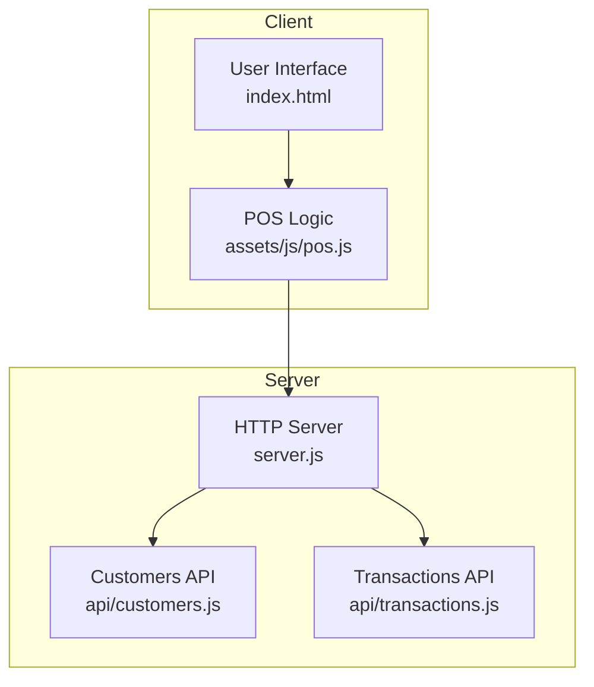
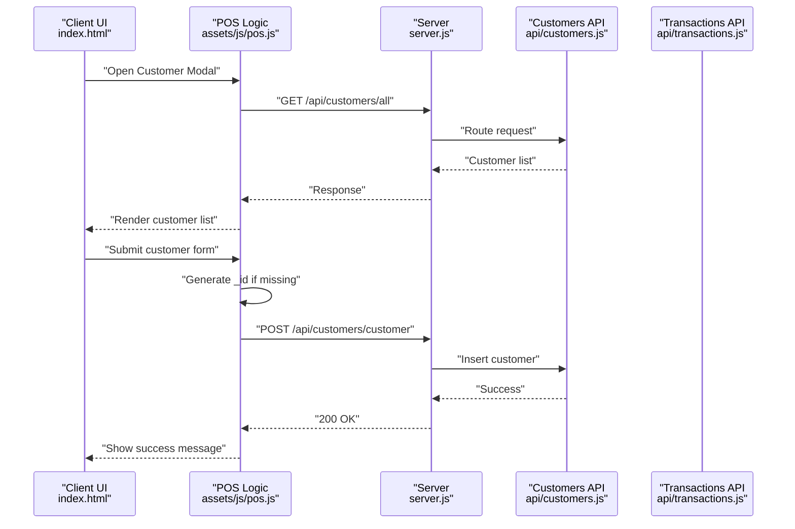
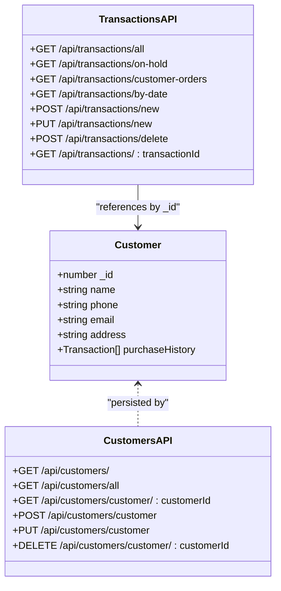
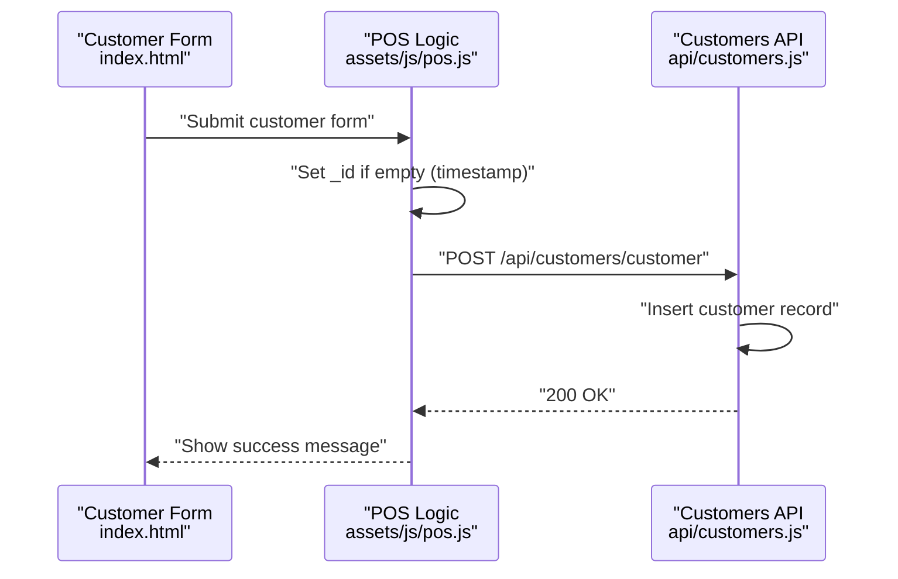
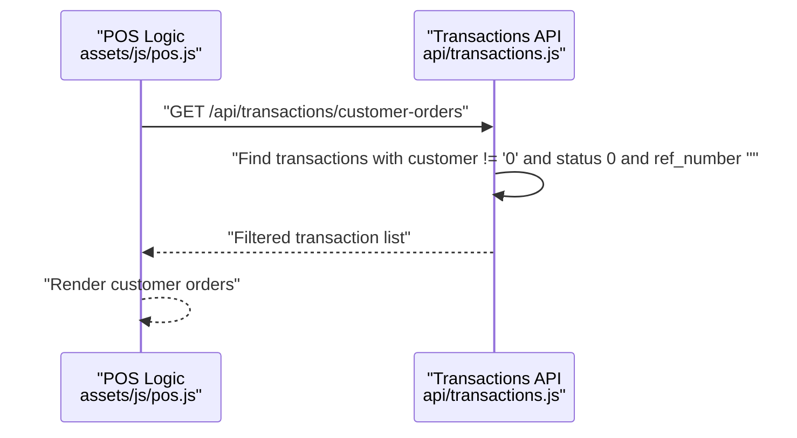
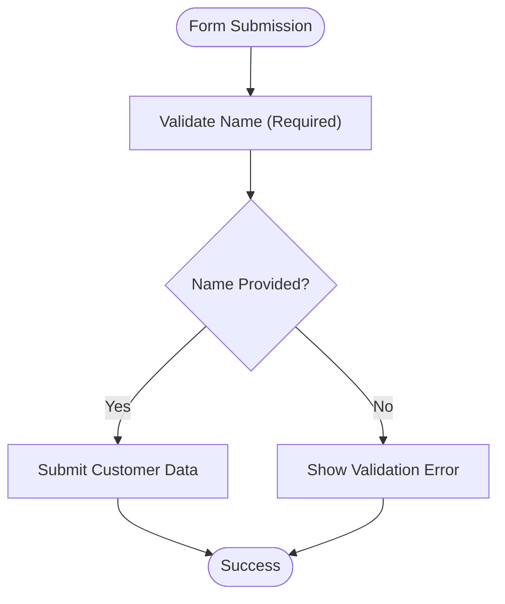
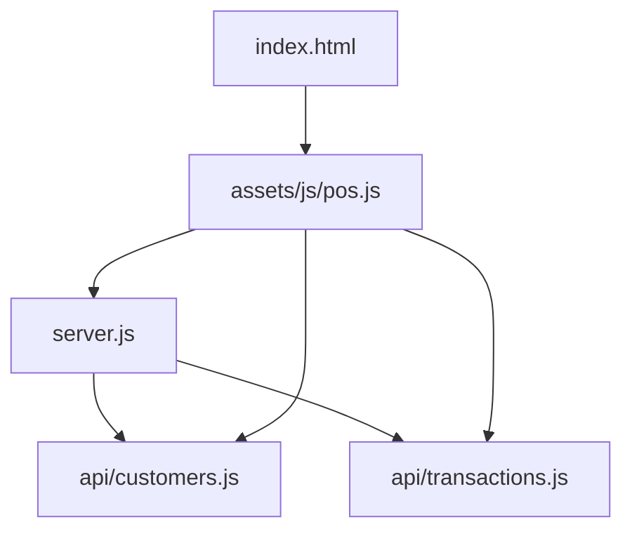

# Customer Model

<cite>
**Referenced Files in This Document**
- [server.js](file://server.js)
- [customers.js](file://api/customers.js)
- [transactions.js](file://api/transactions.js)
- [pos.js](file://assets/js/pos.js)
- [index.html](file://index.html)
- [README.md](file://README.md)
</cite>

## Table of Contents
1. [Introduction](#introduction)
2. [Project Structure](#project-structure)
3. [Core Components](#core-components)
4. [Architecture Overview](#architecture-overview)
5. [Detailed Component Analysis](#detailed-component-analysis)
6. [Dependency Analysis](#dependency-analysis)
7. [Performance Considerations](#performance-considerations)
8. [Troubleshooting Guide](#troubleshooting-guide)
9. [Conclusion](#conclusion)

## Introduction
This document provides comprehensive data model documentation for the Customer entity in PharmaSpot POS. It details the customer data structure, field definitions, validation mechanisms, and the integration with transaction processing. The focus is on the customer fields: _id (unique identifier), name (customer name), phone (contact phone number), email (email address), address (customer address), and the concept of purchaseHistory (array of transaction records). The document explains how customer data is captured, validated, stored, and linked to transaction records for purchase history tracking and customer relationship management.

## Project Structure
PharmaSpot POS is a cross-platform Point of Sale system with a client-server architecture. The server exposes REST APIs for managing customers and transactions, while the client-side JavaScript handles user interactions, form submissions, and UI updates. The customer model is persisted using a lightweight embedded database.

**Diagram sources**
- [server.js:1-68](file://server.js#L1-L68)
- [customers.js:1-151](file://api/customers.js#L1-L151)
- [transactions.js:1-251](file://api/transactions.js#L1-L251)
- [pos.js:1255-1306](file://assets/js/pos.js#L1255-L1306)
- [index.html:470-500](file://index.html#L470-L500)

**Section sources**
- [server.js:1-68](file://server.js#L1-L68)
- [README.md:1-91](file://README.md#L1-L91)

## Core Components
This section defines the Customer entity and its fields, including data types, validation rules, and storage behavior.

- _id (unique identifier)
  - Type: Integer or Numeric Identifier
  - Description: Unique identifier for the customer record. Generated automatically on creation if not provided.
  - Generation: When creating a new customer, if no _id is supplied, the client generates a timestamp-based numeric identifier.
  - Validation: No explicit server-side validation for uniqueness or format; relies on client-side generation and database indexing.
  - Storage: Persisted in the customer database.

- name (customer name)
  - Type: String
  - Description: Full name of the customer.
  - Validation: Required in the client form; no server-side validation enforced.
  - Storage: Persisted in the customer database.

- phone (contact phone number)
  - Type: String
  - Description: Contact phone number for the customer.
  - Validation: Optional in the client form; no server-side validation enforced.
  - Storage: Persisted in the customer database.

- email (email address)
  - Type: String
  - Description: Email address for the customer.
  - Validation: Optional in the client form; no server-side validation enforced.
  - Storage: Persisted in the customer database.

- address (customer address)
  - Type: String
  - Description: Physical address of the customer.
  - Validation: Optional in the client form; no server-side validation enforced.
  - Storage: Persisted in the customer database.

- purchaseHistory (array of transaction records)
  - Concept: Array of transaction records associated with the customer.
  - Current Implementation: The customer model does not include a purchaseHistory field in the server-side schema. Purchase history is derived by filtering transaction records that reference the customer.
  - Transaction Linkage: Transactions include a customer field that references the customer’s _id. Filtering is performed server-side to retrieve customer-specific transactions.

Contact Information Validation
- Client-side validation:
  - The HTML form marks the customer name as required.
  - Phone, email, and address fields are optional.
- Server-side validation:
  - No explicit validation is implemented in the customer API endpoints.
  - The API performs basic sanitization for update operations (escaping identifiers) but does not validate field formats.

Purchase History Tracking Mechanism
- The customer entity itself does not store purchaseHistory as a dedicated field.
- Purchase history is tracked by associating transaction records with a customer identifier and retrieving them via filters.
- The transactions API provides endpoints to filter transactions by customer, status, and reference number, enabling purchase history aggregation.

Customer Relationship Management
- Customers are linked to transactions via the customer field in transaction records.
- The POS UI allows selecting a customer during checkout and displays customer orders and open tabs.
- The system supports open tabs/orders for customers, facilitating relationship management.

Integration with Transaction Processing
- During checkout, the POS logic validates whether a customer is selected or a reference number is provided.
- Transactions are created with customer information included, establishing the linkage for purchase history retrieval.

Customer Loyalty Tracking
- The codebase does not implement explicit customer loyalty tracking features.
- Purchase history can be used to infer customer behavior, but no dedicated loyalty points or tiers are present in the current implementation.

Purchase History Aggregation
- Aggregation is achieved by querying transactions filtered by customer _id.
- The transactions API supports filtering by customer, status, and reference number, enabling historical analysis.

Examples of Customer Data Instances
- Creation flow:
  - Client generates a timestamp-based _id if not provided.
  - Submits customer data (name, phone, email, address) to the customer API.
  - Server persists the record without enforcing strict validation.
- Retrieval flow:
  - Client retrieves customer details by _id and populates the UI form.
  - The customer modal displays current values for editing.

Validation Rules for Contact Information
- Required: name is required in the client form.
- Optional: phone, email, address are optional in the client form.
- No server-side validation: The customer API does not validate email format, phone number format, or address structure.

Relationship Between Customers and Transaction Records
- The customer _id is stored within transaction records to establish the relationship.
- Filtering by customer enables purchase history aggregation without duplicating data in the customer model.

**Section sources**
- [customers.js:82-95](file://api/customers.js#L82-L95)
- [customers.js:130-151](file://api/customers.js#L130-L151)
- [pos.js:1255-1306](file://assets/js/pos.js#L1255-L1306)
- [index.html:479-494](file://index.html#L479-L494)
- [transactions.js:75-82](file://api/transactions.js#L75-L82)

## Architecture Overview
The customer data model integrates with the broader POS architecture through the following components:

**Diagram sources**
- [server.js:40-45](file://server.js#L40-L45)
- [customers.js:82-95](file://api/customers.js#L82-L95)
- [pos.js:1255-1306](file://assets/js/pos.js#L1255-L1306)
- [index.html:470-500](file://index.html#L470-L500)

## Detailed Component Analysis

### Customer Entity Definition
The customer entity is defined by the fields described in Core Components. The server persists customer records using an embedded database and exposes CRUD endpoints for customer management.

**Diagram sources**
- [customers.js:22-27](file://api/customers.js#L22-L27)
- [customers.js:47-121](file://api/customers.js#L47-L121)
- [transactions.js:21-26](file://api/transactions.js#L21-L26)
- [transactions.js:75-82](file://api/transactions.js#L75-L82)

**Section sources**
- [customers.js:22-27](file://api/customers.js#L22-L27)
- [customers.js:47-121](file://api/customers.js#L47-L121)
- [transactions.js:21-26](file://api/transactions.js#L21-L26)
- [transactions.js:75-82](file://api/transactions.js#L75-L82)

### Customer Creation and Update Flow
The client-side logic handles customer creation and updates, including automatic _id generation and form submission.

**Diagram sources**
- [pos.js:1255-1306](file://assets/js/pos.js#L1255-L1306)
- [customers.js:82-95](file://api/customers.js#L82-L95)

**Section sources**
- [pos.js:1255-1306](file://assets/js/pos.js#L1255-L1306)
- [customers.js:82-95](file://api/customers.js#L82-L95)

### Purchase History Retrieval Flow
Purchase history is retrieved by filtering transactions that reference a specific customer.

**Diagram sources**
- [transactions.js:75-82](file://api/transactions.js#L75-L82)
- [pos.js:1193-1200](file://assets/js/pos.js#L1193-L1200)

**Section sources**
- [transactions.js:75-82](file://api/transactions.js#L75-L82)
- [pos.js:1193-1200](file://assets/js/pos.js#L1193-L1200)

### Contact Information Validation Flow
Client-side validation ensures required fields are filled before submission.

**Diagram sources**
- [index.html:479-494](file://index.html#L479-L494)
- [pos.js:1255-1306](file://assets/js/pos.js#L1255-L1306)

**Section sources**
- [index.html:479-494](file://index.html#L479-L494)
- [pos.js:1255-1306](file://assets/js/pos.js#L1255-L1306)

## Dependency Analysis
The customer model interacts with several components across the client and server layers. The following diagram illustrates these dependencies:

**Diagram sources**
- [server.js:40-45](file://server.js#L40-L45)
- [customers.js:1-151](file://api/customers.js#L1-L151)
- [transactions.js:1-251](file://api/transactions.js#L1-L251)
- [pos.js:1255-1306](file://assets/js/pos.js#L1255-L1306)
- [index.html:470-500](file://index.html#L470-L500)

**Section sources**
- [server.js:40-45](file://server.js#L40-L45)
- [customers.js:1-151](file://api/customers.js#L1-L151)
- [transactions.js:1-251](file://api/transactions.js#L1-L251)
- [pos.js:1255-1306](file://assets/js/pos.js#L1255-L1306)
- [index.html:470-500](file://index.html#L470-L500)

## Performance Considerations
- Database Indexing: The customer database enforces a unique index on _id, improving lookup performance for customer retrieval.
- Minimal Validation: The absence of server-side validation reduces overhead but increases reliance on client-side controls.
- Transaction Filtering: Filtering transactions by customer, status, and reference number is straightforward but may benefit from additional indexes for large datasets.

## Troubleshooting Guide
Common issues and resolutions:

- Customer Creation Errors
  - Symptom: Server returns internal error when creating a customer.
  - Cause: Database insertion failure or invalid payload.
  - Resolution: Verify the request payload structure and ensure required fields are present. Check server logs for detailed error messages.

- Customer Update Errors
  - Symptom: Update operation fails with internal error.
  - Cause: Database update failure or invalid _id.
  - Resolution: Confirm the _id exists and is properly escaped. Review server logs for specifics.

- Purchase History Retrieval
  - Symptom: No customer orders displayed.
  - Cause: No transactions match the filtering criteria (customer != '0', status 0, ref_number empty).
  - Resolution: Verify customer selection during checkout and ensure transactions are recorded with the correct customer reference.

- Contact Information Validation
  - Symptom: Form submission fails validation.
  - Cause: Missing required name field.
  - Resolution: Ensure the name field is filled before submitting the form.

**Section sources**
- [customers.js:82-95](file://api/customers.js#L82-L95)
- [customers.js:130-151](file://api/customers.js#L130-L151)
- [transactions.js:75-82](file://api/transactions.js#L75-L82)
- [index.html:479-494](file://index.html#L479-L494)

## Conclusion
The Customer entity in PharmaSpot POS is defined by a set of core fields and integrated with transaction processing through customer references in transaction records. While the customer model does not include a dedicated purchaseHistory field, purchase history is effectively tracked by filtering transactions associated with a customer. The system emphasizes client-side validation for required fields and minimal server-side validation, relying on database indexing for performance. Future enhancements could include explicit purchaseHistory aggregation, enhanced contact validation, and dedicated customer loyalty features.