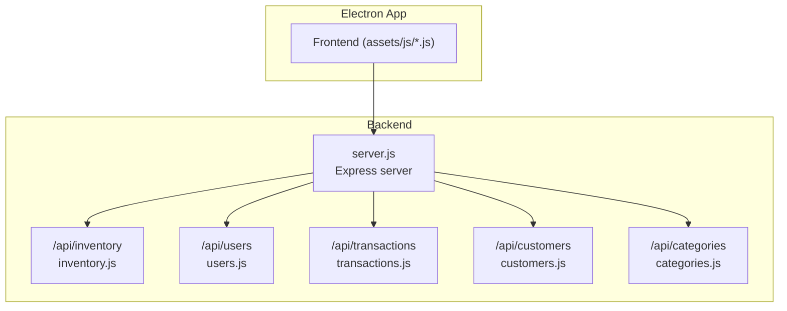
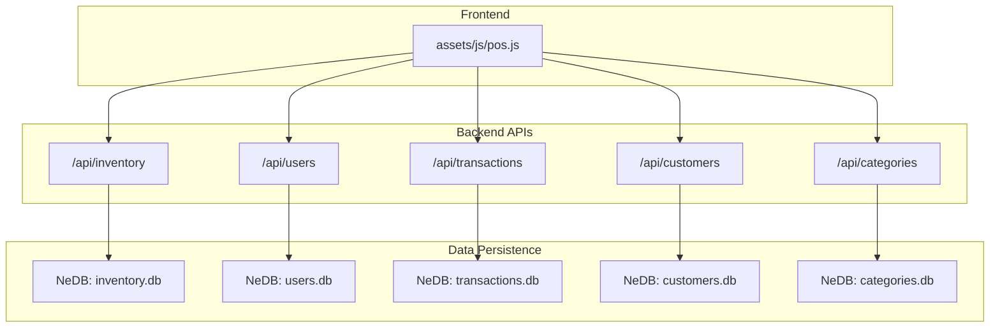
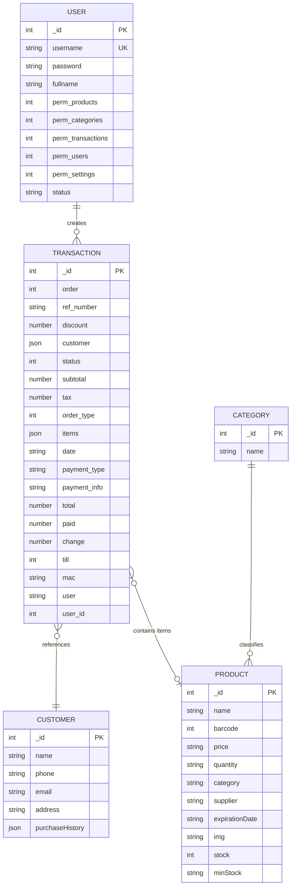

# Data Models

<cite>
**Referenced Files in This Document**
- [server.js](file://server.js)
- [inventory.js](file://api/inventory.js)
- [users.js](file://api/users.js)
- [transactions.js](file://api/transactions.js)
- [customers.js](file://api/customers.js)
- [categories.js](file://api/categories.js)
- [pos.js](file://assets/js/pos.js)
- [utils.js](file://assets/js/utils.js)
</cite>

## Table of Contents
1. [Introduction](#introduction)
2. [Project Structure](#project-structure)
3. [Core Components](#core-components)
4. [Architecture Overview](#architecture-overview)
5. [Detailed Component Analysis](#detailed-component-analysis)
6. [Dependency Analysis](#dependency-analysis)
7. [Performance Considerations](#performance-considerations)
8. [Troubleshooting Guide](#troubleshooting-guide)
9. [Conclusion](#conclusion)

## Introduction
This document defines the data models for the PharmaSpot Point of Sale (POS) system. It focuses on four core entities: Product, User, Transaction, and Customer. For each model, we describe fields, data types, validation rules, constraints, and business logic. We also explain relationships between entities, foreign key references, and data integrity requirements. Examples of typical data instances and validation scenarios are included to aid understanding.

## Project Structure
PharmaSpot is an Electron-based desktop application with a Node.js/Express backend and a browser-like frontend. The backend exposes REST endpoints grouped by domain (inventory, users, transactions, customers, categories). The frontend (assets/js/*.js) consumes these endpoints to manage data and drive business workflows.

**Diagram sources**
- [server.js:1-68](file://server.js#L1-L68)
- [inventory.js:1-44](file://api/inventory.js#L1-L44)
- [users.js:1-19](file://api/users.js#L1-L19)
- [transactions.js:1-19](file://api/transactions.js#L1-L19)
- [customers.js:1-20](file://api/customers.js#L1-L20)
- [categories.js:1-19](file://api/categories.js#L1-L19)

**Section sources**
- [server.js:1-68](file://server.js#L1-L68)

## Core Components
This section summarizes the four primary data models and their roles in the system.

- Product: Represents inventory items with identifiers, pricing, stock controls, category, supplier, expiration date, and image reference.
- User: Represents staff accounts with authentication, permissions, and session status.
- Transaction: Represents a sale event with items, totals, payments, and metadata (cashier, till, date).
- Customer: Represents client profiles with contact details and purchase history linkage.

**Section sources**
- [inventory.js:178-193](file://api/inventory.js#L178-L193)
- [users.js:206-209](file://api/users.js#L206-L209)
- [transactions.js:163-181](file://api/transactions.js#L163-L181)
- [customers.js:82-94](file://api/customers.js#L82-L94)

## Architecture Overview
The backend persists each model in separate NeDB databases located under the application data directory. The frontend constructs transaction payloads and sends them to the backend, which may trigger inventory updates.

**Diagram sources**
- [inventory.js:46-49](file://api/inventory.js#L46-L49)
- [users.js:21-24](file://api/users.js#L21-L24)
- [transactions.js:21-24](file://api/transactions.js#L21-L24)
- [customers.js:22-25](file://api/customers.js#L22-L25)
- [categories.js:21-24](file://api/categories.js#L21-L24)
- [pos.js:43-48](file://assets/js/pos.js#L43-L48)

## Detailed Component Analysis

### Product Model
- Purpose: Stores product information used for sales, inventory tracking, and display.
- Fields and Types:
  - _id: integer (unique identifier)
  - name: string
  - barcode: integer (SKU)
  - price: string (monetary value stored as string)
  - quantity: string (stock quantity)
  - category: string (category identifier)
  - supplier: string (optional)
  - expirationDate: string (date format)
  - img: string (filename or empty)
  - stock: integer (0 or 1 flag for stock-enabled)
  - minStock: string (minimum threshold)
- Validation and Constraints:
  - Unique index on _id in inventory database.
  - When creating a new product without an explicit _id, a unique numeric identifier is generated.
  - Quantity defaults to 0 if empty during creation/update.
  - Image handling supports upload and removal with sanitization.
  - Price and quantity are treated as strings; monetary calculations occur in the frontend.
- Business Logic:
  - On successful transaction payment, inventory quantities are decremented per item.
  - Expiration checks and stock status indicators are computed in the frontend.
- Typical Instance Example:
  - _id: 20241231001
  - name: "Paracetamol 500mg"
  - barcode: 123456789012
  - price: "2.99"
  - quantity: "150"
  - category: "Pain Relief"
  - supplier: "MedSupplies Co."
  - expirationDate: "10-Dec-2026"
  - img: "1700000000abc123.jpg"
  - stock: 1
  - minStock: "10"

**Section sources**
- [inventory.js:51](file://api/inventory.js#L51)
- [inventory.js:178-193](file://api/inventory.js#L178-L193)
- [inventory.js:195-218](file://api/inventory.js#L195-L218)
- [inventory.js:302-332](file://api/inventory.js#L302-L332)
- [utils.js:36-52](file://assets/js/utils.js#L36-L52)

### User Model
- Purpose: Manages staff accounts, authentication, and permissions.
- Fields and Types:
  - _id: integer (unique identifier)
  - username: string (unique)
  - password: string (hashed)
  - fullname: string
  - permissions: bit flags represented as 0/1 for multiple permission keys
  - status: string (login/logout timestamps appended)
- Validation and Constraints:
  - Unique index on username enforced at the database level.
  - Default admin account initialization with all permissions set.
  - Passwords are hashed before storage.
  - Permission flags are normalized to 0/1 values.
- Business Logic:
  - Login compares provided password against stored hash and updates status.
  - Logout updates status to a logged-out marker.
- Typical Instance Example:
  - _id: 1
  - username: "admin"
  - password: "$2b$10$salt...hash"
  - fullname: "Administrator"
  - perm_products: 1
  - perm_categories: 1
  - perm_transactions: 1
  - perm_users: 1
  - perm_settings: 1
  - status: "Logged In_2025-01-01T12:00:00Z"

**Section sources**
- [users.js:26](file://api/users.js#L26)
- [users.js:95-131](file://api/users.js#L95-L131)
- [users.js:179-259](file://api/users.js#L179-L259)
- [users.js:268-311](file://api/users.js#L268-L311)

### Transaction Model
- Purpose: Captures sale events with items, totals, payments, and metadata.
- Fields and Types:
  - _id: integer (unique transaction identifier)
  - order: integer (order number)
  - ref_number: string (reference number)
  - discount: number (monetary discount)
  - customer: object or integer (customer identifier)
  - status: integer (transaction state)
  - subtotal: number (pre-tax amount)
  - tax: number (tax amount)
  - order_type: integer (order type flag)
  - items: array of item objects (id, product_name, price, quantity)
  - date: string (timestamp)
  - payment_type: string (e.g., Cash, Card)
  - payment_info: string (payment details)
  - total: number (final amount)
  - paid: number (amount received)
  - change: number (change given)
  - till: integer (till identifier)
  - mac: string (device MAC address)
  - user: string (cashier name)
  - user_id: integer (cashier identifier)
- Validation and Constraints:
  - Unique index on _id in transactions database.
  - On creation, if paid >= total, inventory is automatically decremented.
  - Frontend enforces presence of customer or reference number for on-hold orders.
- Business Logic:
  - New transactions are inserted; updates replace existing records.
  - Filtering endpoints support date range, user, till, and status queries.
- Typical Instance Example:
  - _id: 1700000000
  - order: 1700000000
  - ref_number: ""
  - discount: 0
  - customer: { id: 5, name: "John Doe" }
  - status: 1
  - subtotal: 19.95
  - tax: 1.60
  - order_type: 1
  - items: [
      { id: 20241231001, product_name: "Paracetamol 500mg", price: 2.99, quantity: 5 },
      { id: 20241231002, product_name: "Amoxicillin 250mg", price: 4.50, quantity: 2 }
    ]
  - date: "2025-01-01T12:00:00Z"
  - payment_type: "Cash"
  - payment_info: ""
  - total: 21.55
  - paid: 25.00
  - change: 3.45
  - till: 1
  - mac: "AA:BB:CC:DD:EE:FF"
  - user: "Alice Smith"
  - user_id: 2

**Section sources**
- [transactions.js:26](file://api/transactions.js#L26)
- [transactions.js:163-181](file://api/transactions.js#L163-L181)
- [transactions.js:190-210](file://api/transactions.js#L190-L210)
- [transactions.js:219-237](file://api/transactions.js#L219-L237)
- [pos.js:899-920](file://assets/js/pos.js#L899-L920)
- [pos.js:176-180](file://assets/js/pos.js#L176-L180)

### Customer Model
- Purpose: Maintains customer profiles and supports purchase history linkage.
- Fields and Types:
  - _id: integer (unique identifier)
  - name: string
  - phone: string
  - email: string
  - address: string
  - purchaseHistory: array (linked transaction references)
- Validation and Constraints:
  - Unique index on _id in customers database.
  - Creation assigns a unique numeric identifier if none provided.
- Business Logic:
  - Frontend selects a customer for transactions; walk-in customers are supported.
  - Purchase history linkage is implicit via transaction references.
- Typical Instance Example:
  - _id: 5
  - name: "John Doe"
  - phone: "+1234567890"
  - email: "john@example.com"
  - address: "123 Main St, City, Country"
  - purchaseHistory: []

**Section sources**
- [customers.js:27](file://api/customers.js#L27)
- [customers.js:82-94](file://api/customers.js#L82-L94)
- [pos.js:1259-1265](file://assets/js/pos.js#L1259-L1265)

## Dependency Analysis
This section maps how models relate and how data integrity is maintained.

**Diagram sources**
- [inventory.js:178-193](file://api/inventory.js#L178-L193)
- [users.js:206-209](file://api/users.js#L206-L209)
- [transactions.js:163-181](file://api/transactions.js#L163-L181)
- [customers.js:82-94](file://api/customers.js#L82-L94)
- [categories.js:59-72](file://api/categories.js#L59-L72)

Key observations:
- Foreign Keys and References:
  - Transaction.customer references Customer._id.
  - Transaction.items reference Product._id.
  - Transaction.user_id references User._id.
  - Product.category references Category._id.
- Data Integrity:
  - Unique indexes on _id for each collection.
  - Unique username for User.
  - Inventory decrement occurs only when paid >= total.
- Business Rules:
  - Expiration checks and stock thresholds are enforced in the frontend.
  - Default admin user is initialized if missing.

**Section sources**
- [inventory.js:51](file://api/inventory.js#L51)
- [users.js:26](file://api/users.js#L26)
- [transactions.js:176-178](file://api/transactions.js#L176-L178)
- [pos.js:176-180](file://assets/js/pos.js#L176-L180)

## Performance Considerations
- Database Indexes: Unique indexes on _id improve lookup performance for all collections.
- Monetary Values: Stored as strings to avoid floating-point precision issues; formatting and calculations are handled in the frontend.
- Inventory Updates: Batched per item via asynchronous series to minimize race conditions.
- File Handling: Image uploads are sanitized and validated to prevent invalid entries.

[No sources needed since this section provides general guidance]

## Troubleshooting Guide
Common validation and integrity issues:

- Duplicate Product ID:
  - Symptom: Insert fails or unexpected ID assignment.
  - Cause: Attempting to reuse an existing _id.
  - Resolution: Omit _id or ensure uniqueness; the backend generates a unique numeric ID when missing.

- Invalid or Missing Customer Reference:
  - Symptom: On-hold order requires customer or reference.
  - Cause: Empty customer selection and blank reference number.
  - Resolution: Select a customer or provide a reference number.

- Insufficient Stock:
  - Symptom: Cannot add more than available quantity.
  - Cause: Product stock is enabled and quantity equals available stock.
  - Resolution: Adjust quantity or restock the product.

- Expired Product:
  - Symptom: Product marked expired; cannot sell.
  - Cause: Expiration date passed.
  - Resolution: Replace or remove expired items.

- Payment Mismatch:
  - Symptom: Change not calculated or payment rejected.
  - Cause: Paid amount less than total.
  - Resolution: Enter a sufficient payment amount.

**Section sources**
- [inventory.js:195-218](file://api/inventory.js#L195-L218)
- [pos.js:786-795](file://assets/js/pos.js#L786-L795)
- [pos.js:618-639](file://assets/js/pos.js#L618-L639)
- [pos.js:390-411](file://assets/js/pos.js#L390-L411)
- [pos.js:1312-1325](file://assets/js/pos.js#L1312-L1325)

## Conclusion
PharmaSpot’s data models are designed around practical retail needs: precise inventory tracking, secure user management, robust transaction capture, and customer profile maintenance. The backend enforces uniqueness and basic constraints, while the frontend ensures usability and safety through validation and user feedback. Together, these models provide a solid foundation for pharmacy operations with clear relationships and integrity safeguards.