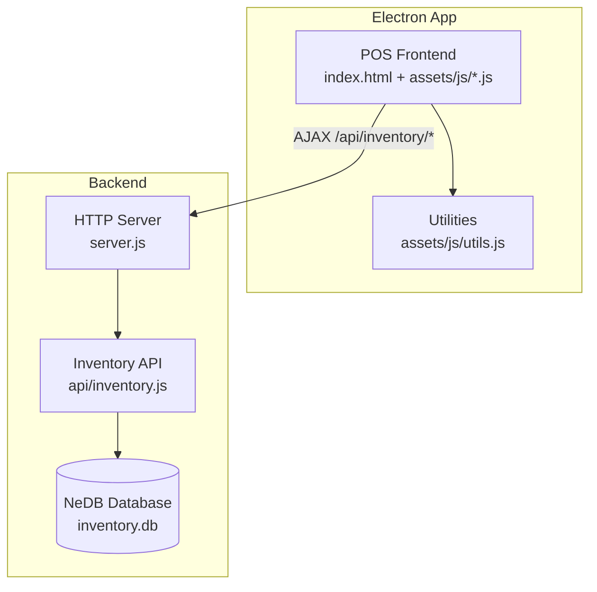
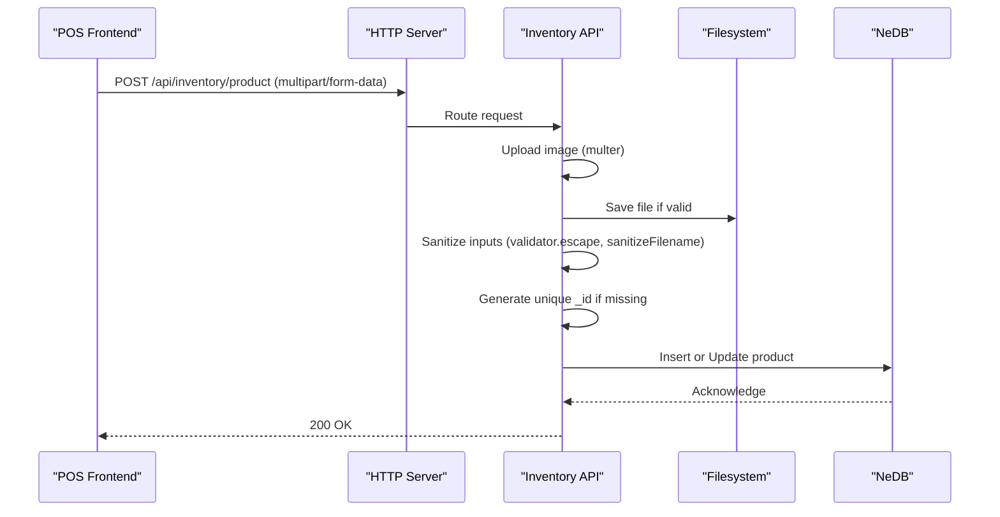
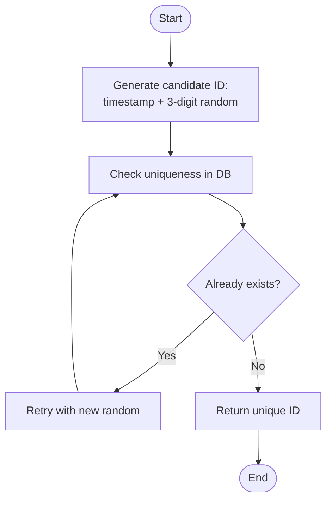
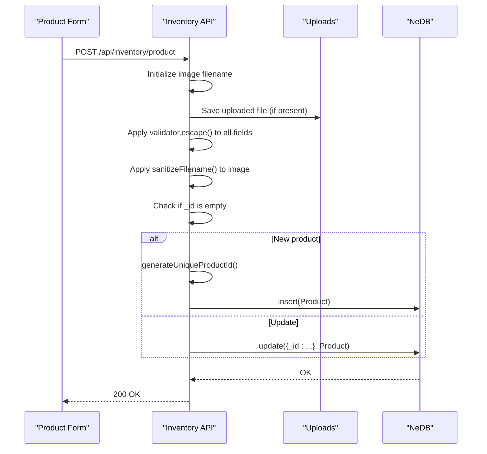
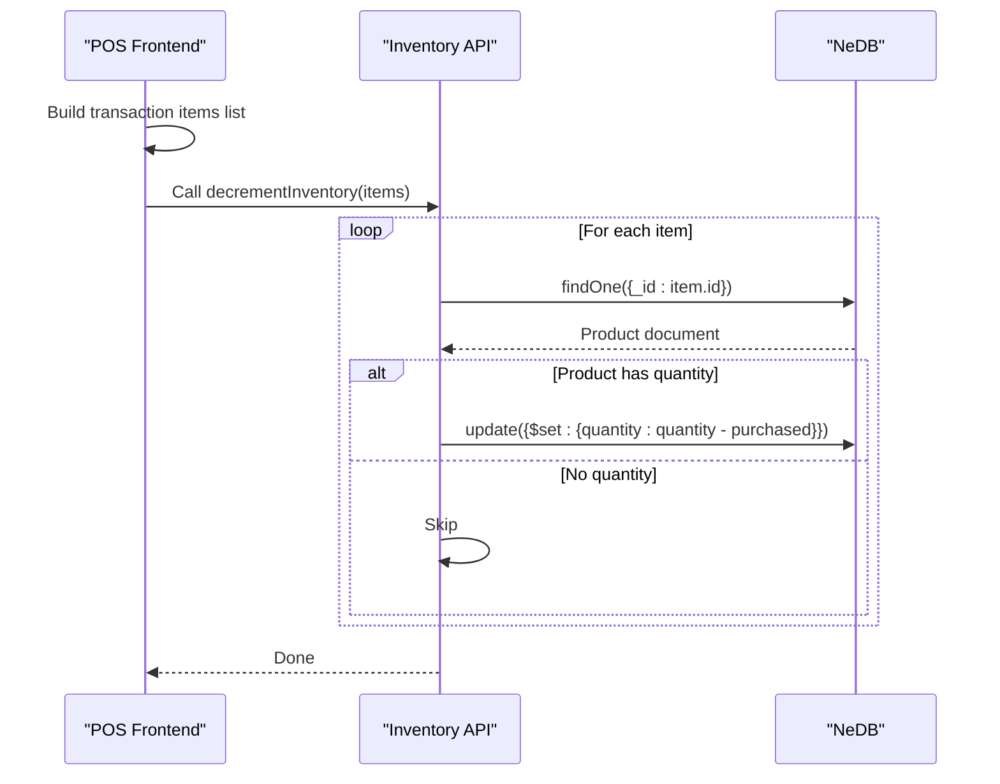
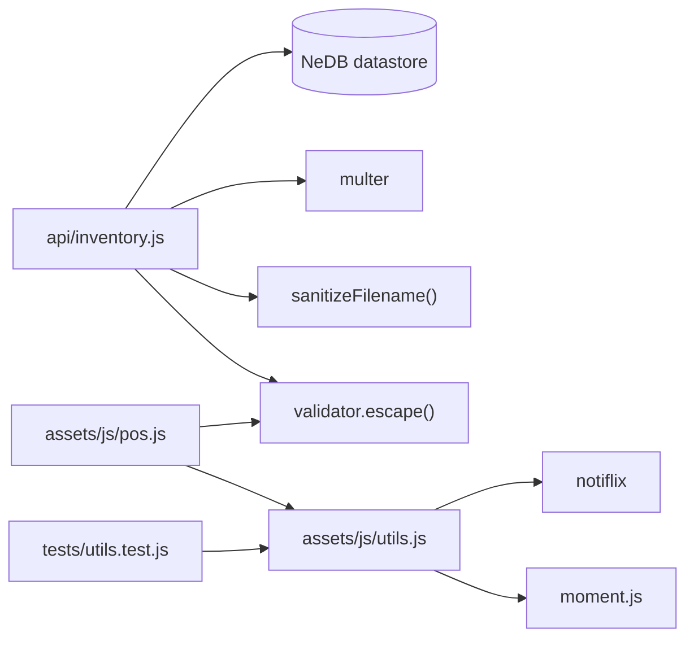

# Product Model

<cite>
**Referenced Files in This Document**
- [server.js](file://server.js)
- [inventory.js](file://api/inventory.js)
- [pos.js](file://assets/js/pos.js)
- [utils.js](file://assets/js/utils.js)
- [utils.test.js](file://tests/utils.test.js)
- [index.html](file://index.html)
</cite>

## Table of Contents
1. [Introduction](#introduction)
2. [Project Structure](#project-structure)
3. [Core Components](#core-components)
4. [Architecture Overview](#architecture-overview)
5. [Detailed Component Analysis](#detailed-component-analysis)
6. [Dependency Analysis](#dependency-analysis)
7. [Performance Considerations](#performance-considerations)
8. [Troubleshooting Guide](#troubleshooting-guide)
9. [Conclusion](#conclusion)

## Introduction
This document provides comprehensive data model documentation for the Product entity in PharmaSpot POS. It covers all product fields, their data types, validation and sanitization rules, business constraints, the product ID generation algorithm, and the relationship between stock tracking and inventory decrement operations during transactions. Examples of valid product data instances and validation scenarios are included to guide developers and administrators.

## Project Structure
PharmaSpot POS is a desktop application using Electron with a Node.js/Express backend and an HTML/CSS/JavaScript frontend. The product model is implemented in the Inventory API module, with client-side usage in the POS interface and supporting utilities for stock status and file handling.

**Diagram sources**
- [server.js:1-68](file://server.js#L1-L68)
- [inventory.js:1-44](file://api/inventory.js#L1-L44)

**Section sources**
- [server.js:1-68](file://server.js#L1-L68)
- [inventory.js:1-44](file://api/inventory.js#L1-L44)

## Core Components
This section defines the Product entity fields, their types, and constraints enforced by the backend and frontend.

- _id (auto-generated unique identifier)
  - Type: Integer
  - Description: Unique numeric identifier generated by the server using a timestamp and random number combination. See Product ID Generation Algorithm.
  - Constraints: Unique index in the database; auto-generated when creating a new product.

- name (product name)
  - Type: String
  - Description: Product display name.
  - Validation: Sanitized using validator.escape() on the server; required when creating/updating.

- barcode (SKU code)
  - Type: Integer
  - Description: Product barcode/SKU code used for search and identification.
  - Validation: Sanitized and converted to integer on the server; required when creating/updating.

- price (product price)
  - Type: String
  - Description: Unit price stored as a string for precision-safe handling.
  - Validation: Sanitized using validator.escape() on the server; required when creating/updating.

- quantity (current stock quantity)
  - Type: String (converted to integer)
  - Description: Current available stock level.
  - Validation: Sanitized; defaults to 0 if empty; must be non-negative.

- category (product category)
  - Type: String
  - Description: Product category for organization and filtering.
  - Validation: Sanitized using validator.escape() on the server.

- supplier (supplier information)
  - Type: String
  - Description: Supplier name or identifier.
  - Validation: Sanitized using validator.escape() on the server; optional.

- expirationDate (expiry date tracking)
  - Type: String
  - Description: Expiry date in DD-MMM-YYYY format.
  - Validation: Sanitized using validator.escape() on the server; optional.

- img (product image filename)
  - Type: String
  - Description: Filename of the uploaded product image.
  - Validation: Sanitized using sanitizeFilename; uploaded via multer with file type filtering.

- stock (stock tracking flag)
  - Type: Boolean-like integer (0 or 1)
  - Description: Enables or disables stock tracking for the product.
  - Mapping: "on" checkbox value mapped to 0 (disabled) or 1 (enabled).

- minStock (minimum stock threshold)
  - Type: String (converted to integer)
  - Description: Minimum stock level that triggers low-stock alerts.
  - Validation: Sanitized using validator.escape(); must be positive when stock tracking is enabled.

Validation and sanitization summary:
- Server-side sanitization: validator.escape() applied to all textual fields.
- Image sanitization: sanitizeFilename() applied to image filenames.
- File upload: multer with size limit and MIME type filtering.
- Frontend checks: POS logic validates expiry and availability before adding to cart.

**Section sources**
- [inventory.js:178-193](file://api/inventory.js#L178-L193)
- [inventory.js:143-176](file://api/inventory.js#L143-L176)
- [utils.js:76-87](file://assets/js/utils.js#L76-L87)
- [pos.js:389-411](file://assets/js/pos.js#L389-L411)

## Architecture Overview
The Product model is part of the Inventory API. The flow for creating/updating a product involves the frontend sending a multipart/form-data request, the server sanitizing inputs, optionally uploading an image, generating a unique ID if needed, and persisting to the database.

**Diagram sources**
- [server.js:40-45](file://server.js#L40-L45)
- [inventory.js:124-240](file://api/inventory.js#L124-L240)
- [inventory.js:28-39](file://api/inventory.js#L28-L39)
- [utils.js:76-87](file://assets/js/utils.js#L76-L87)

## Detailed Component Analysis

### Product ID Generation Algorithm
The server generates a unique numeric product ID by combining the current timestamp with a random 3-digit number. It then checks for uniqueness in the database and retries if a collision occurs.

**Diagram sources**
- [inventory.js:53-69](file://api/inventory.js#L53-L69)

**Section sources**
- [inventory.js:53-69](file://api/inventory.js#L53-L69)

### Product Creation and Update Flow
The POST /api/inventory/product endpoint handles creation and updates. It manages image uploads, sanitizes inputs, and persists the product.

**Diagram sources**
- [inventory.js:124-240](file://api/inventory.js#L124-L240)
- [inventory.js:143-176](file://api/inventory.js#L143-L176)
- [inventory.js:53-69](file://api/inventory.js#L53-L69)

**Section sources**
- [inventory.js:124-240](file://api/inventory.js#L124-L240)
- [inventory.js:143-176](file://api/inventory.js#L143-L176)

### Stock Tracking and Inventory Decrement During Transactions
During checkout, the POS collects the list of purchased items and decrements stock quantities accordingly. The Inventory API provides a synchronous decrement operation.

**Diagram sources**
- [pos.js:691-713](file://assets/js/pos.js#L691-L713)
- [inventory.js:296-333](file://api/inventory.js#L296-L333)

**Section sources**
- [pos.js:691-713](file://assets/js/pos.js#L691-L713)
- [inventory.js:296-333](file://api/inventory.js#L296-L333)

### Validation Scenarios and Business Constraints
- Required fields
  - Creating or updating a product requires sanitized and validated fields. The server enforces sanitation via validator.escape() and optional image handling via sanitizeFilename().
- Quantity and minStock
  - quantity defaults to 0 if empty; both quantity and minStock are treated as integers for calculations. minStock must be positive when stock tracking is enabled.
- Stock tracking flag
  - The stock field maps checkbox "on" to 0 (disable) or 1 (enable). When disabled, the POS frontend may still display N/A for stock counts.
- Expiration date
  - Expiration date is validated on the frontend for expiry warnings and blocking sales of expired items.
- Image handling
  - Only allowed image types are accepted; filenames are sanitized and saved with a timestamp prefix.

Examples of valid product data instances (descriptive):
- Minimal product: name, barcode, price, category, quantity, stock flag, minStock.
- Product with image: include img or uploaded imagename; ensure filename passes sanitizeFilename.
- Product with expiry: include expirationDate in DD-MMM-YYYY format; ensure it is not expired before sale.

Validation scenarios:
- Empty quantity: treated as 0 on the server.
- Checkbox unchecked: stock set to 1 (track stock).
- Checkbox checked: stock set to 0 (do not track stock).
- Expired product: POS prevents adding to cart and shows warning.
- Out-of-stock product: POS prevents adding to cart and shows warning when stock tracking is enabled.

**Section sources**
- [inventory.js:178-193](file://api/inventory.js#L178-L193)
- [inventory.js:184-190](file://api/inventory.js#L184-L190)
- [pos.js:389-411](file://assets/js/pos.js#L389-L411)
- [utils.test.js:77-120](file://tests/utils.test.js#L77-L120)

## Dependency Analysis
The Product model depends on several modules for validation, sanitization, file handling, and UI integration.

**Diagram sources**
- [inventory.js:17-17](file://api/inventory.js#L17-L17)
- [inventory.js:6-6](file://api/inventory.js#L6-L6)
- [inventory.js:7-7](file://api/inventory.js#L7-L7)
- [utils.js:1-112](file://assets/js/utils.js#L1-L112)
- [utils.test.js:1-191](file://tests/utils.test.js#L1-L191)

**Section sources**
- [inventory.js:17-17](file://api/inventory.js#L17-L17)
- [inventory.js:6-6](file://api/inventory.js#L6-L6)
- [inventory.js:7-7](file://api/inventory.js#L7-L7)
- [utils.js:1-112](file://assets/js/utils.js#L1-L112)
- [utils.test.js:1-191](file://tests/utils.test.js#L1-L191)

## Performance Considerations
- Unique ID generation: The algorithm uses a timestamp plus a small random component and performs a database lookup to ensure uniqueness. While collision probability is low, repeated insertions may trigger additional queries.
- Inventory decrement: The decrementInventory function iterates through items sequentially and updates each product individually. For large transactions, consider batching or optimizing database writes if performance becomes a concern.
- File uploads: Multer enforces size limits and MIME type checks to prevent oversized or invalid uploads.

[No sources needed since this section provides general guidance]

## Troubleshooting Guide
Common issues and resolutions:
- Upload errors
  - Symptom: 400 Upload Error or 500 Internal Server Error on product save.
  - Causes: Invalid file type, file too large, or filesystem error when removing an image.
  - Resolution: Verify allowed file types (JPEG, PNG, WEBP), file size under 2MB, and that the image removal logic is not triggered unintentionally.
- Unique ID conflicts
  - Symptom: Unexpected 500 error during product creation.
  - Cause: Extremely rare collision in ID generation.
  - Resolution: Retry the operation; the algorithm automatically retries.
- Stock not decrementing
  - Symptom: Inventory levels remain unchanged after checkout.
  - Cause: stock tracking disabled or product has no quantity.
  - Resolution: Ensure stock flag is enabled and quantity is set appropriately; verify transaction items list passed to decrementInventory.
- Expired product sale attempts
  - Symptom: Warning dialog preventing sale of expired items.
  - Resolution: Replace expired stock or adjust expiry dates.

**Section sources**
- [inventory.js:127-141](file://api/inventory.js#L127-L141)
- [inventory.js:154-176](file://api/inventory.js#L154-L176)
- [pos.js:389-411](file://assets/js/pos.js#L389-L411)
- [inventory.js:296-333](file://api/inventory.js#L296-L333)

## Conclusion
The Product model in PharmaSpot POS integrates robust server-side validation and sanitization with practical frontend controls for expiry and stock management. The unique ID generation ensures global uniqueness, while the inventory decrement mechanism supports accurate stock updates during transactions. Adhering to the documented validation rules and constraints will help maintain data integrity and reliable operations.