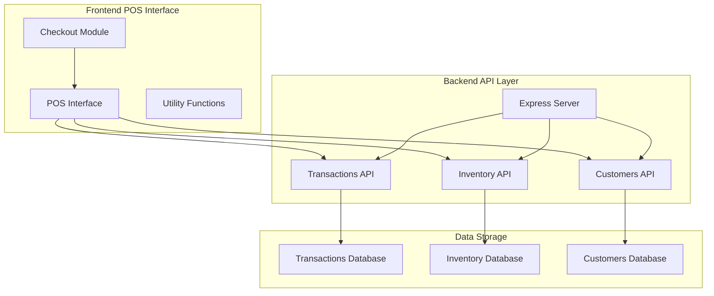
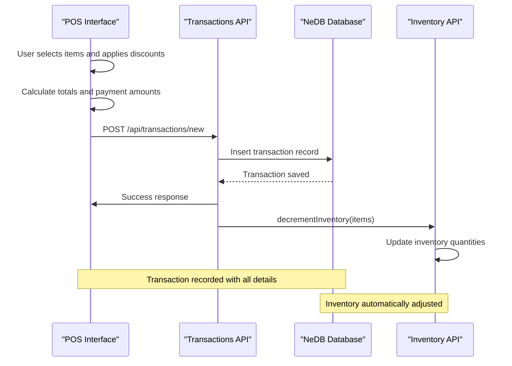
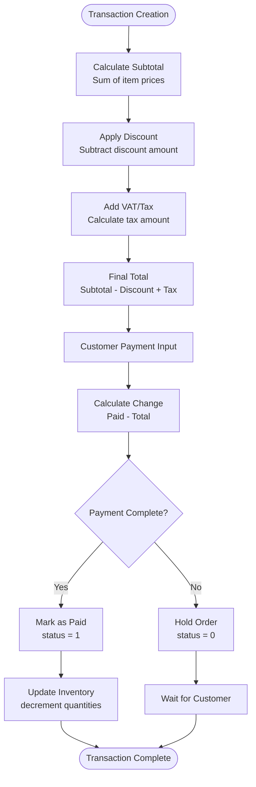
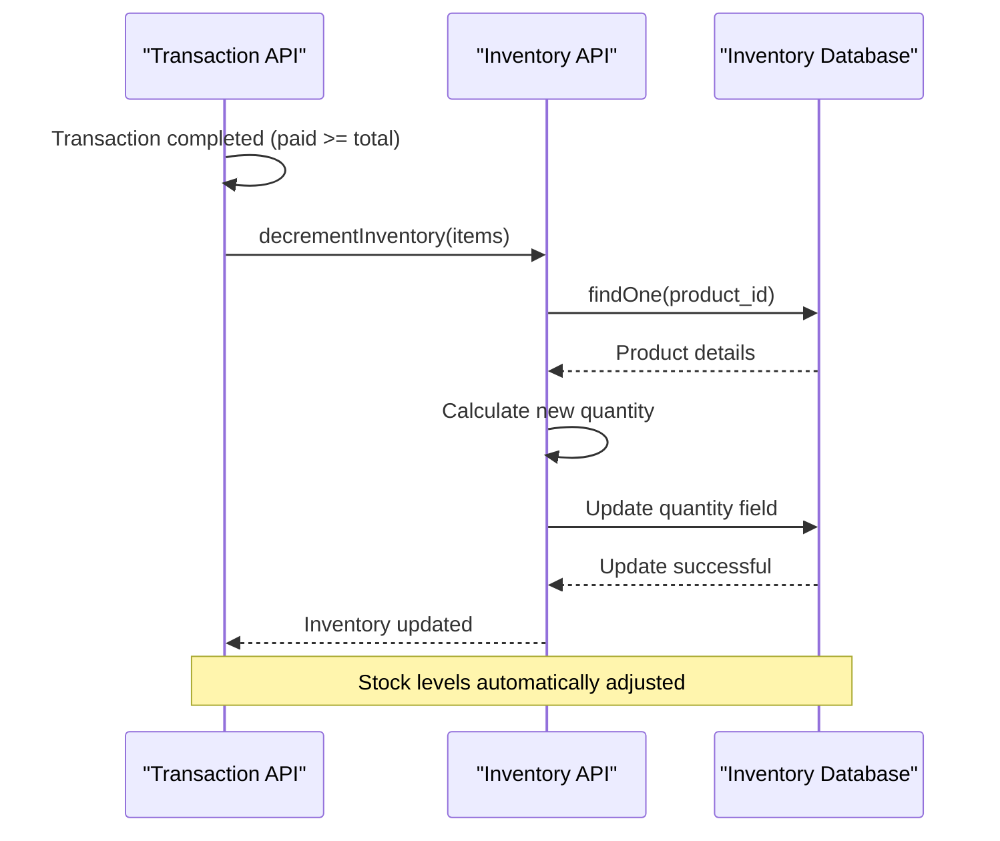
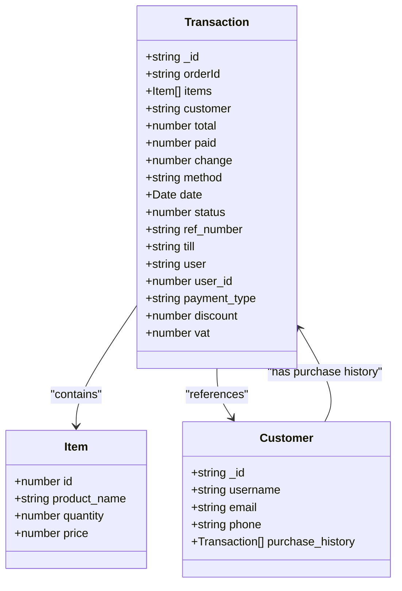
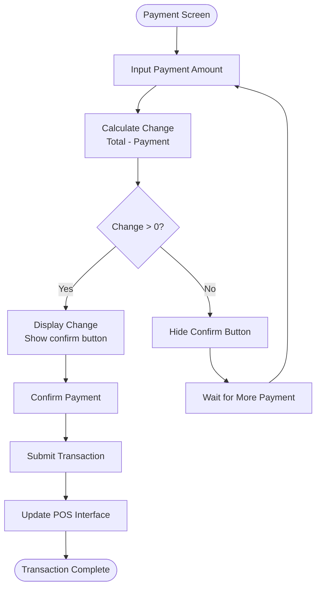
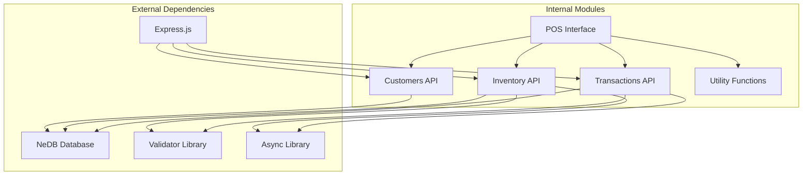
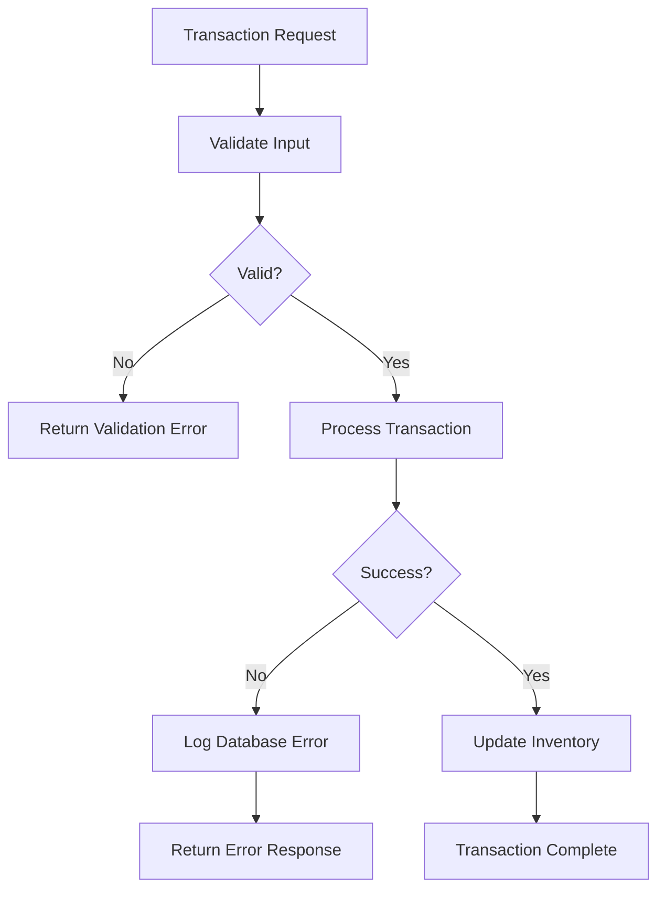

# Transaction Model

<cite>
**Referenced Files in This Document**
- [transactions.js](file://api/transactions.js)
- [server.js](file://server.js)
- [pos.js](file://assets/js/pos.js)
- [checkout.js](file://assets/js/checkout.js)
- [inventory.js](file://api/inventory.js)
- [customers.js](file://api/customers.js)
- [utils.js](file://assets/js/utils.js)
- [README.md](file://README.md)
- [package.json](file://package.json)
</cite>

## Table of Contents
1. [Introduction](#introduction)
2. [Project Structure](#project-structure)
3. [Core Components](#core-components)
4. [Architecture Overview](#architecture-overview)
5. [Detailed Component Analysis](#detailed-component-analysis)
6. [Dependency Analysis](#dependency-analysis)
7. [Performance Considerations](#performance-considerations)
8. [Troubleshooting Guide](#troubleshooting-guide)
9. [Conclusion](#conclusion)

## Introduction
This document provides comprehensive data model documentation for the Transaction entity in PharmaSpot POS. It details all transaction fields, their data types, and the complete transaction processing workflow. The documentation covers payment calculation logic, inventory update coordination, and the relationships between transactions, product inventory, and customer purchase history.

PharmaSpot POS is a cross-platform Point of Sale system designed for pharmacies, featuring multi-PC support, receipt printing, product search, staff accounts with permissions, product and category management, user management, basic stock management, open tabs and orders, customer database, transaction history, and transaction filtering capabilities.

## Project Structure
The transaction system spans both the backend API layer and the frontend POS interface:

**Diagram sources**
- [server.js:40-45](file://server.js#L40-L45)
- [transactions.js:1-251](file://api/transactions.js#L1-L251)

**Section sources**
- [README.md:1-91](file://README.md#L1-L91)
- [package.json:18-54](file://package.json#L18-L54)

## Core Components
The transaction system consists of several interconnected components that work together to process sales and maintain accurate records.

### Backend Transaction Processing
The backend handles transaction creation, updates, and retrieval through a dedicated API layer built on Express.js with NeDB for local data persistence.

### Frontend POS Integration
The frontend POS interface manages user interactions, payment processing, and transaction submission to the backend API.

### Inventory Coordination
The system coordinates inventory updates automatically when transactions are completed, ensuring stock levels remain accurate.

**Section sources**
- [transactions.js:163-181](file://api/transactions.js#L163-L181)
- [pos.js:786-959](file://assets/js/pos.js#L786-L959)

## Architecture Overview
The transaction processing architecture follows a client-server pattern with clear separation of concerns:

**Diagram sources**
- [pos.js:911-954](file://assets/js/pos.js#L911-L954)
- [transactions.js:163-181](file://api/transactions.js#L163-L181)
- [inventory.js:302-332](file://api/inventory.js#L302-L332)

## Detailed Component Analysis

### Transaction Data Model
The Transaction entity contains the following fields with their respective data types and purposes:

#### Core Transaction Fields
| Field | Type | Description | Validation |
|-------|------|-------------|------------|
| `_id` | String/Number | Unique transaction identifier | Required, unique |
| `orderId` | String/Number | Transaction reference number | Required for holds |
| `items` | Array | Purchased products with id and quantity | Required |
| `customer` | String/Number/Object | Customer identifier or guest info | Optional |
| `total` | Number | Transaction amount | Required |
| `paid` | Number | Amount paid by customer | Required for completion |
| `change` | Number | Change returned to customer | Calculated |
| `method` | String | Payment method (cash/card) | Required |
| `date` | Date | Transaction timestamp | Auto-generated |
| `status` | Number | Transaction state (0=hold, 1=paid) | Required |

#### Additional Transaction Properties
| Field | Type | Description | Purpose |
|-------|------|-------------|---------|
| `ref_number` | String | Reference number for holds | Hold order identification |
| `till` | String/Number | Till identifier | Location tracking |
| `user` | String | Cashier name | Staff accountability |
| `user_id` | String/Number | Cashier identifier | Staff tracking |
| `payment_type` | String | Payment method type | Display and reporting |
| `discount` | Number | Applied discount amount | Financial calculations |
| `vat` | Number | Value-added tax amount | Tax calculations |

### Transaction Processing Workflow

#### Payment Calculation Logic
The payment calculation follows a straightforward mathematical approach:

**Diagram sources**
- [pos.js:35-46](file://assets/js/pos.js#L35-L46)
- [checkout.js:35-46](file://assets/js/checkout.js#L35-L46)

#### Transaction Status Management
The system uses numeric status codes for transaction states:
- **0**: Hold (pending completion)
- **1**: Paid (completed transaction)

Hold orders require a reference number and can be retrieved separately for later completion.

**Section sources**
- [transactions.js:59-82](file://api/transactions.js#L59-L82)
- [pos.js:786-795](file://assets/js/pos.js#L786-L795)

### Inventory Update Coordination
The inventory system automatically coordinates with transactions to maintain accurate stock levels:

**Diagram sources**
- [transactions.js:176-178](file://api/transactions.js#L176-L178)
- [inventory.js:302-332](file://api/inventory.js#L302-L332)

### Customer Purchase History Integration
The system maintains customer purchase history through the customer database integration:

**Diagram sources**
- [transactions.js:163-181](file://api/transactions.js#L163-L181)
- [customers.js:47-60](file://api/customers.js#L47-L60)

**Section sources**
- [transactions.js:163-181](file://api/transactions.js#L163-L181)
- [customers.js:82-95](file://api/customers.js#L82-L95)

### Frontend Transaction Processing
The POS interface handles the complete transaction workflow from item selection to payment processing:

#### Payment Interface Logic
The checkout module manages payment input and change calculation:

**Diagram sources**
- [checkout.js:35-46](file://assets/js/checkout.js#L35-L46)
- [pos.js:911-954](file://assets/js/pos.js#L911-L954)

**Section sources**
- [checkout.js:10-86](file://assets/js/checkout.js#L10-L86)
- [pos.js:786-959](file://assets/js/pos.js#L786-L959)

## Dependency Analysis
The transaction system has well-defined dependencies that ensure proper data flow and validation:

**Diagram sources**
- [package.json:18-54](file://package.json#L18-L54)
- [server.js:1-68](file://server.js#L1-L68)

### Data Flow Dependencies
The transaction system follows a strict data flow pattern:

1. **Frontend Validation**: POS interface validates user input and calculates totals
2. **Backend Processing**: Transactions API validates and processes transactions
3. **Inventory Coordination**: Automatic inventory updates occur on successful transactions
4. **Customer Integration**: Customer data is maintained alongside transaction records

**Section sources**
- [transactions.js:163-181](file://api/transactions.js#L163-L181)
- [inventory.js:302-332](file://api/inventory.js#L302-L332)

## Performance Considerations
The transaction system is designed for optimal performance in a point-of-sale environment:

### Database Performance
- **Local Storage**: Uses NeDB for fast local database operations
- **Indexing**: Unique indexes on primary keys for quick lookups
- **Asynchronous Operations**: Non-blocking database operations using async library

### Memory Management
- **Efficient Data Structures**: Arrays and objects optimized for transaction data
- **Minimal Payloads**: Transaction objects contain only essential fields
- **Batch Operations**: Inventory updates processed in series to maintain consistency

### Network Efficiency
- **RESTful API Design**: Standard HTTP methods for efficient communication
- **JSON Serialization**: Lightweight data transfer format
- **CORS Configuration**: Proper cross-origin resource sharing setup

## Troubleshooting Guide

### Common Transaction Issues
1. **Inventory Not Updating**: Verify that `paid >= total` condition is met
2. **Transaction Not Saved**: Check for proper `_id` field assignment
3. **Payment Calculation Errors**: Validate numeric input fields
4. **Hold Order Problems**: Ensure `ref_number` is provided for hold transactions

### Error Handling Patterns
The system implements comprehensive error handling:

**Diagram sources**
- [transactions.js:166-173](file://api/transactions.js#L166-L173)
- [pos.js:945-953](file://assets/js/pos.js#L945-L953)

### Debugging Transaction Issues
1. **Check Console Logs**: Review server-side error messages
2. **Verify Database Connectivity**: Ensure NeDB databases are accessible
3. **Test API Endpoints**: Validate individual API endpoints
4. **Monitor Network Traffic**: Use browser developer tools for API debugging

**Section sources**
- [transactions.js:166-173](file://api/transactions.js#L166-L173)
- [pos.js:945-953](file://assets/js/pos.js#L945-L953)

## Conclusion
The PharmaSpot POS transaction system provides a robust, efficient solution for pharmacy point-of-sale operations. The system's architecture ensures accurate transaction processing, automatic inventory coordination, and comprehensive customer management. The modular design allows for easy maintenance and future enhancements while maintaining data integrity and performance standards.

Key strengths of the system include:
- Clear separation of concerns between frontend and backend
- Automatic inventory synchronization
- Comprehensive transaction tracking
- Flexible payment processing
- Scalable database architecture

The transaction model serves as the foundation for all sales operations in PharmaSpot POS, providing reliable data management and real-time inventory updates essential for pharmacy operations.