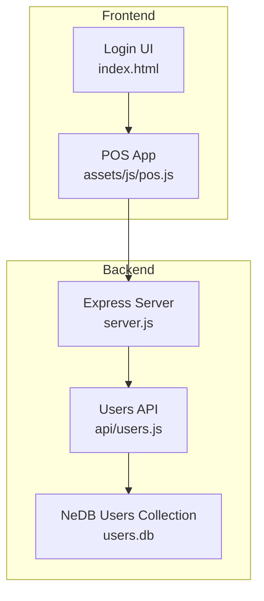
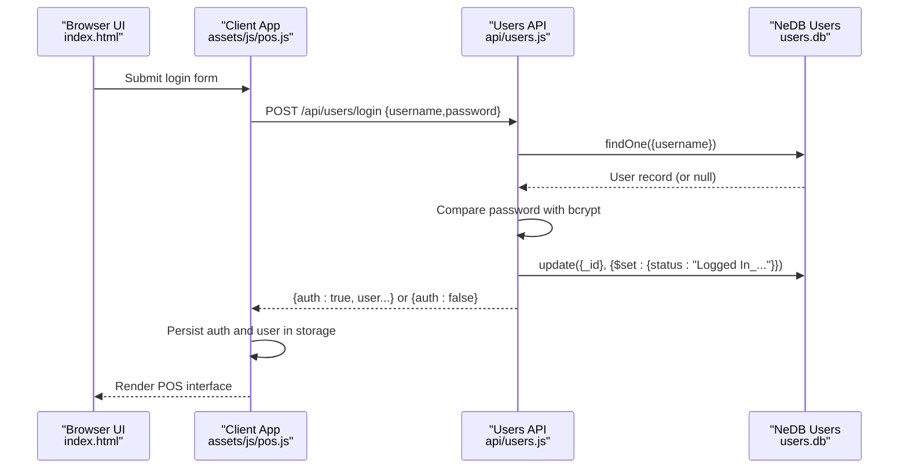
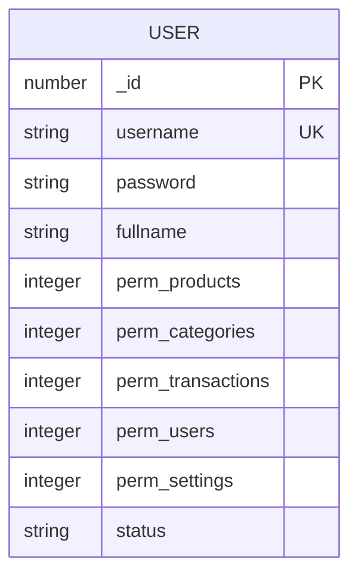
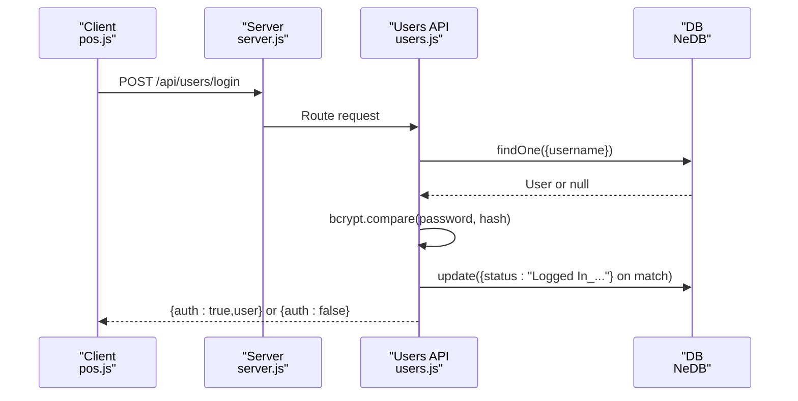
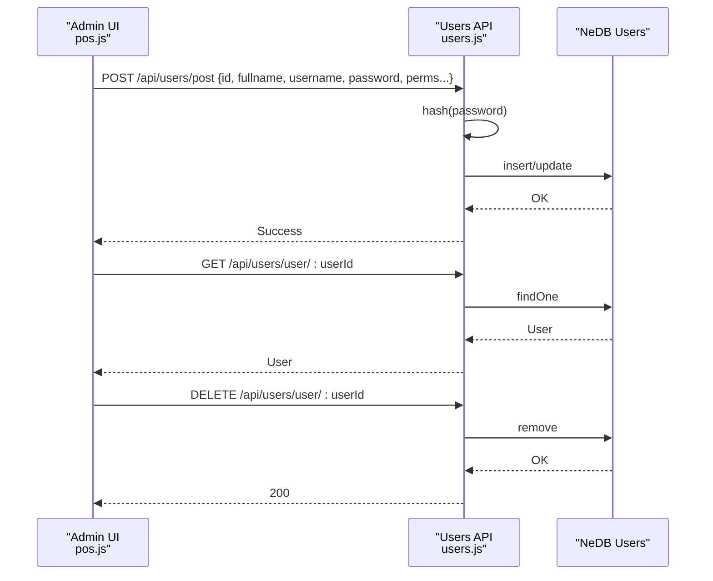
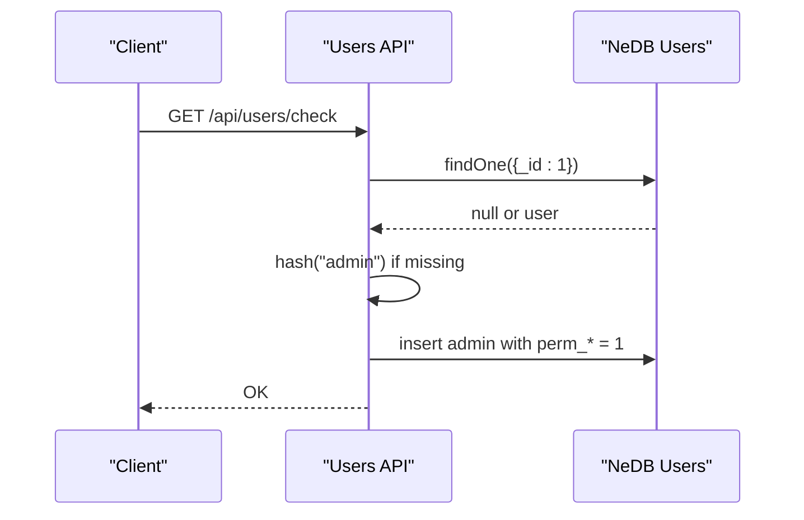
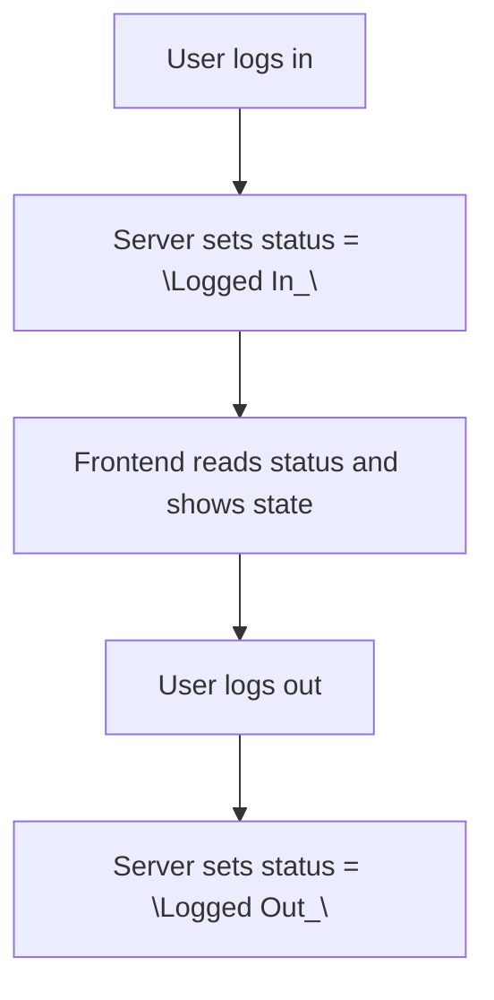
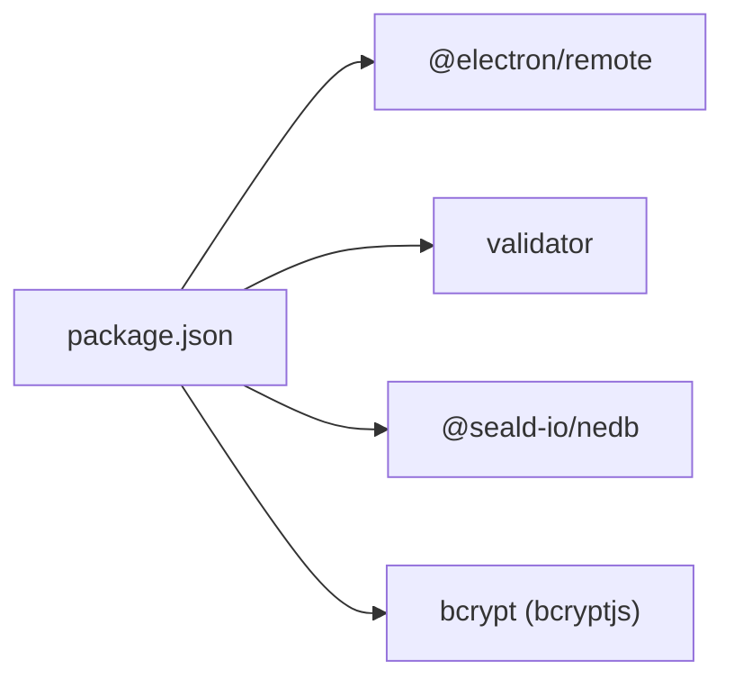

# User Model

<cite>
**Referenced Files in This Document**
- [users.js](file://api/users.js)
- [server.js](file://server.js)
- [pos.js](file://assets/js/pos.js)
- [index.html](file://index.html)
- [package.json](file://package.json)
</cite>

## Table of Contents
1. [Introduction](#introduction)
2. [Project Structure](#project-structure)
3. [Core Components](#core-components)
4. [Architecture Overview](#architecture-overview)
5. [Detailed Component Analysis](#detailed-component-analysis)
6. [Dependency Analysis](#dependency-analysis)
7. [Performance Considerations](#performance-considerations)
8. [Troubleshooting Guide](#troubleshooting-guide)
9. [Conclusion](#conclusion)

## Introduction
This document describes the User entity model and related workflows in PharmaSpot POS. It covers the data fields stored for users, password hashing, permission-based access control, user status tracking, and the end-to-end authentication and authorization flow. It also documents the lifecycle of users (create/update/delete), default admin initialization, and security considerations for password storage and validation.

## Project Structure
The User model spans backend and frontend components:
- Backend API: Express routes for user login, logout, retrieval, listing, creation/update, and deletion.
- Database: NeDB collection for users persisted under a user-specific database path.
- Frontend: Login UI, user management UI, and client-side logic for authentication, permission checks, and status rendering.



**Diagram sources**
- [server.js:1-68](file://server.js#L1-L68)
- [users.js:1-311](file://api/users.js#L1-L311)
- [pos.js:185-2538](file://assets/js/pos.js#L185-L2538)
- [index.html:1-884](file://index.html#L1-L884)

**Section sources**
- [server.js:1-68](file://server.js#L1-L68)
- [users.js:1-311](file://api/users.js#L1-L311)
- [pos.js:185-2538](file://assets/js/pos.js#L185-L2538)
- [index.html:1-884](file://index.html#L1-L884)

## Core Components
- User entity fields:
  - _id: numeric unique identifier
  - username: unique login credential
  - password: hashed using bcrypt
  - fullname: user’s full name
  - permissions: role-based flags for features
  - status: login/logout tracking string
- Backend endpoints:
  - POST /api/users/login: authenticate and set status
  - GET /api/users/logout/:userId: update status to logged out
  - GET /api/users/user/:userId: fetch user by ID
  - GET /api/users/all: list all users
  - POST /api/users/post: create or update user (hashes password, normalizes permissions)
  - DELETE /api/users/user/:userId: delete user
  - GET /api/users/check: initialize default admin if missing
- Frontend:
  - Login form and handler
  - User management UI and permission toggles
  - Permission-driven UI visibility and actions
  - Status parsing and display

**Section sources**
- [users.js:21-26](file://api/users.js#L21-L26)
- [users.js:95-131](file://api/users.js#L95-L131)
- [users.js:68-86](file://api/users.js#L68-L86)
- [users.js:46-59](file://api/users.js#L46-L59)
- [users.js:140-144](file://api/users.js#L140-L144)
- [users.js:179-259](file://api/users.js#L179-L259)
- [users.js:268-311](file://api/users.js#L268-L311)
- [pos.js:185-2538](file://assets/js/pos.js#L185-L2538)
- [index.html:15-29](file://index.html#L15-L29)

## Architecture Overview
The authentication flow connects the browser UI to the backend API and database. On successful login, the server updates the user’s status and returns user data with an auth flag. The client stores credentials and user data locally and renders the POS interface accordingly.



**Diagram sources**
- [index.html:15-29](file://index.html#L15-L29)
- [pos.js:2478-2514](file://assets/js/pos.js#L2478-L2514)
- [users.js:95-131](file://api/users.js#L95-L131)
- [users.js:21-26](file://api/users.js#L21-L26)

## Detailed Component Analysis

### User Entity Data Model
- Fields and types:
  - _id: number (auto-generated for new users; existing records may have numeric IDs)
  - username: string (unique index enforced)
  - password: string (bcrypt hash)
  - fullname: string
  - perm_products: integer (0/1)
  - perm_categories: integer (0/1)
  - perm_transactions: integer (0/1)
  - perm_users: integer (0/1)
  - perm_settings: integer (0/1)
  - status: string (login/logout tracking)
- Notes:
  - New user IDs are generated as Unix timestamp seconds.
  - Permissions are normalized from checkbox values ("on"/other) to 1/0 during create/update.
  - Status is a free-text string composed of "Logged In_/Logged Out_" plus a timestamp.



**Diagram sources**
- [users.js:179-259](file://api/users.js#L179-L259)
- [users.js:268-311](file://api/users.js#L268-L311)

**Section sources**
- [users.js:21-26](file://api/users.js#L21-L26)
- [users.js:179-259](file://api/users.js#L179-L259)
- [users.js:268-311](file://api/users.js#L268-L311)

### Authentication Workflow
- Client sends credentials to POST /api/users/login.
- Server queries user by username, compares password using bcrypt.
- On success, server updates user status to "Logged In_<timestamp>" and returns user with auth=true.
- Client persists auth state and user data, then renders the main interface.



**Diagram sources**
- [pos.js:2478-2514](file://assets/js/pos.js#L2478-L2514)
- [users.js:95-131](file://api/users.js#L95-L131)
- [server.js:40-46](file://server.js#L40-L46)

**Section sources**
- [pos.js:2478-2514](file://assets/js/pos.js#L2478-L2514)
- [users.js:95-131](file://api/users.js#L95-L131)

### Authorization and Permission Validation
- Permissions are represented as boolean flags (0/1) for five functional areas.
- Frontend enforces UI visibility and actions based on these flags.
- During user creation/update, permission values are normalized from checkbox states.

```mermaid
flowchart TD
Start(["User Save Request"]) --> Normalize["Normalize permissions:<br/>\"on\" -> 1, else 0"]
Normalize --> Hash["Hash password with bcrypt"]
Hash --> Upsert{"New user?"}
Upsert --> |Yes| Insert["Insert into DB with _id = Unix timestamp / 1000"]
Upsert --> |No| Update["Update existing user"]
Insert --> Done(["Done"])
Update --> Done
```

**Diagram sources**
- [users.js:179-259](file://api/users.js#L179-L259)

**Section sources**
- [pos.js:251-266](file://assets/js/pos.js#L251-L266)
- [users.js:179-259](file://api/users.js#L179-L259)

### User Lifecycle Management
- Create/Update:
  - POST /api/users/post handles both creation and editing.
  - New users receive a generated _id; existing users are matched by provided _id.
  - Password is hashed before persistence.
- Retrieve:
  - GET /api/users/user/:userId fetches a user by internal ID.
  - GET /api/users/all lists all users.
- Delete:
  - DELETE /api/users/user/:userId removes a user by ID.
- Logout:
  - GET /api/users/logout/:userId updates status to "Logged Out_<timestamp>".



**Diagram sources**
- [users.js:179-259](file://api/users.js#L179-L259)
- [users.js:46-59](file://api/users.js#L46-L59)
- [users.js:140-144](file://api/users.js#L140-L144)
- [users.js:153-170](file://api/users.js#L153-L170)

**Section sources**
- [users.js:179-259](file://api/users.js#L179-L259)
- [users.js:46-59](file://api/users.js#L46-L59)
- [users.js:140-144](file://api/users.js#L140-L144)
- [users.js:153-170](file://api/users.js#L153-L170)

### Default Admin Initialization
- GET /api/users/check ensures a default admin user exists with all permissions enabled.
- If missing, the server hashes a default password and inserts the admin record with _id = 1.



**Diagram sources**
- [users.js:268-311](file://api/users.js#L268-L311)

**Section sources**
- [users.js:268-311](file://api/users.js#L268-L311)

### User Status Management
- Status is a string indicating login state and timestamp.
- Frontend parses status to determine visual state and button styling.
- Logout endpoint updates status to "Logged Out_<timestamp>".



**Diagram sources**
- [users.js:95-131](file://api/users.js#L95-L131)
- [users.js:68-86](file://api/users.js#L68-L86)
- [pos.js:1612-1630](file://assets/js/pos.js#L1612-L1630)

**Section sources**
- [users.js:95-131](file://api/users.js#L95-L131)
- [users.js:68-86](file://api/users.js#L68-L86)
- [pos.js:1612-1630](file://assets/js/pos.js#L1612-L1630)

### Examples and Security Considerations
- Example user instance fields:
  - _id: number
  - username: string
  - password: string (bcrypt hash)
  - fullname: string
  - perm_products: integer (0/1)
  - perm_categories: integer (0/1)
  - perm_transactions: integer (0/1)
  - perm_users: integer (0/1)
  - perm_settings: integer (0/1)
  - status: string
- Security considerations:
  - Passwords are hashed using bcrypt before storage.
  - Unique index on username prevents duplicates.
  - Login response includes auth flag and user data; sensitive fields are not returned in error paths.
  - Status is stored as a string and parsed on the client; ensure consistent formatting.

**Section sources**
- [users.js:21-26](file://api/users.js#L21-L26)
- [users.js:95-131](file://api/users.js#L95-L131)
- [users.js:179-259](file://api/users.js#L179-L259)

## Dependency Analysis
- External libraries:
  - bcrypt (via bcryptjs) for password hashing
  - validator for input sanitization
  - @seald-io/nedb for local database
- Internal dependencies:
  - server.js mounts the users API under /api/users
  - pos.js consumes /api/users endpoints for login, user listing, and user management



**Diagram sources**
- [package.json:18-54](file://package.json#L18-L54)

**Section sources**
- [package.json:18-54](file://package.json#L18-L54)
- [server.js:40-46](file://server.js#L40-L46)
- [pos.js:185-2538](file://assets/js/pos.js#L185-L2538)

## Performance Considerations
- Password hashing uses a moderate cost factor; consider tuning salt rounds if performance becomes a concern.
- NeDB is embedded and suitable for desktop apps; avoid heavy concurrent writes for user operations.
- Permission checks are client-side booleans; keep the number of toggles manageable for UI responsiveness.

## Troubleshooting Guide
- Login fails:
  - Verify username exists and password matches the stored hash.
  - Check that the bcrypt compare operation succeeds and status update occurs.
- Duplicate username:
  - Unique index prevents duplicate usernames; resolve conflicts before insert/update.
- Permission not applied:
  - Ensure permission checkboxes are normalized to 1/0 during save.
- Logout not reflected:
  - Confirm the logout endpoint is invoked and status updated to "Logged Out_<timestamp>".

**Section sources**
- [users.js:21-26](file://api/users.js#L21-L26)
- [users.js:95-131](file://api/users.js#L95-L131)
- [users.js:68-86](file://api/users.js#L68-L86)
- [users.js:179-259](file://api/users.js#L179-L259)

## Conclusion
PharmaSpot POS implements a straightforward, secure user model centered on bcrypt hashing, NeDB persistence, and permission flags. The authentication flow is simple and robust, with clear separation between backend APIs and frontend UI. Adhering to the outlined data model and workflows ensures consistent behavior across user lifecycle operations.