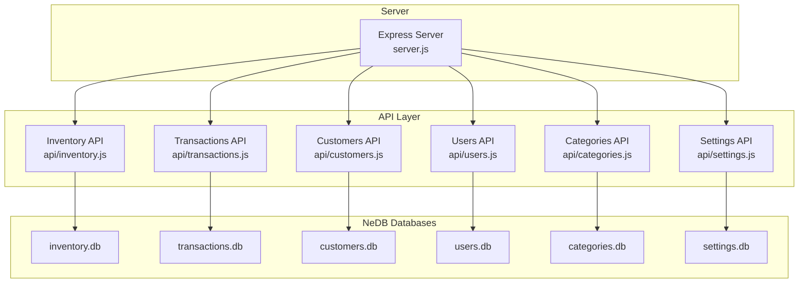
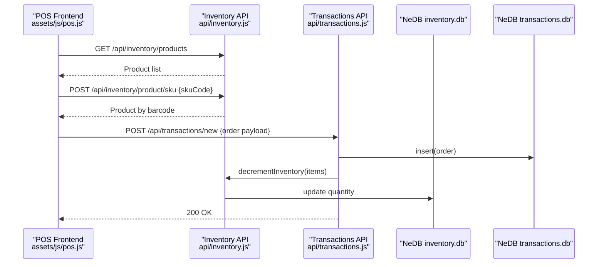
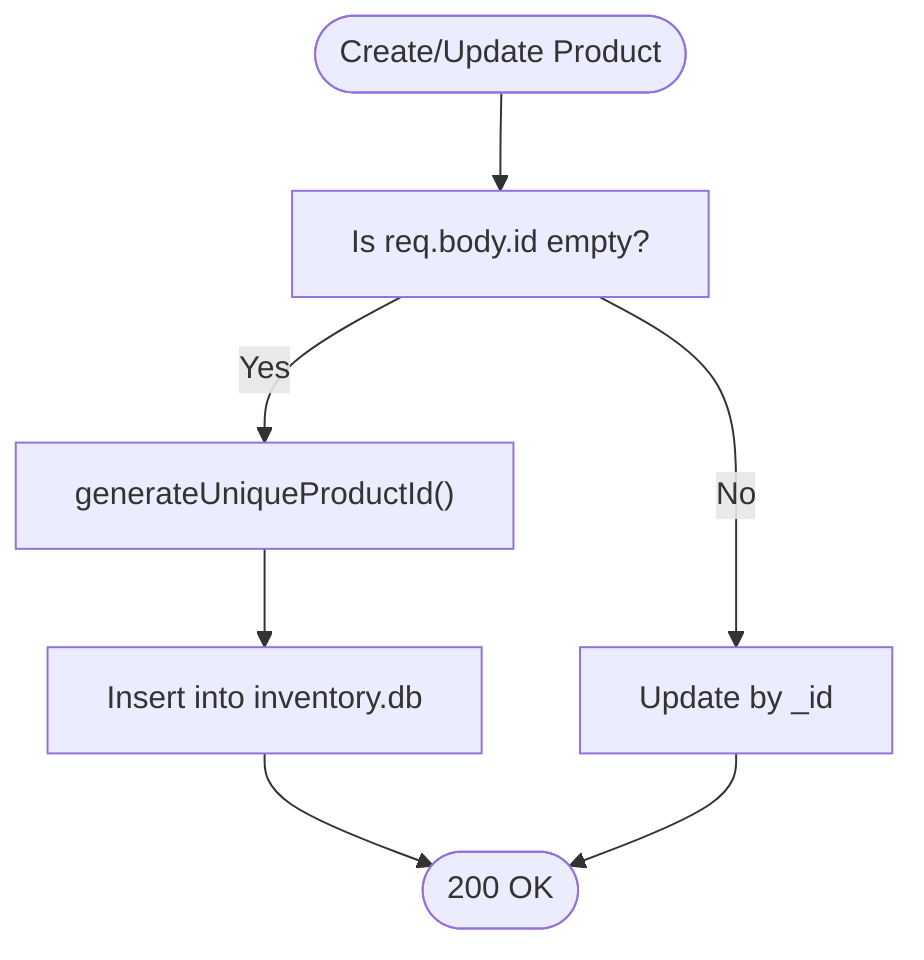
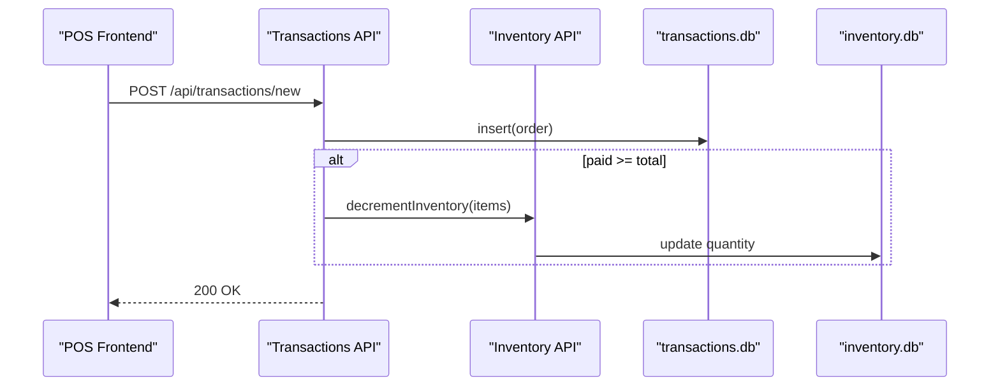
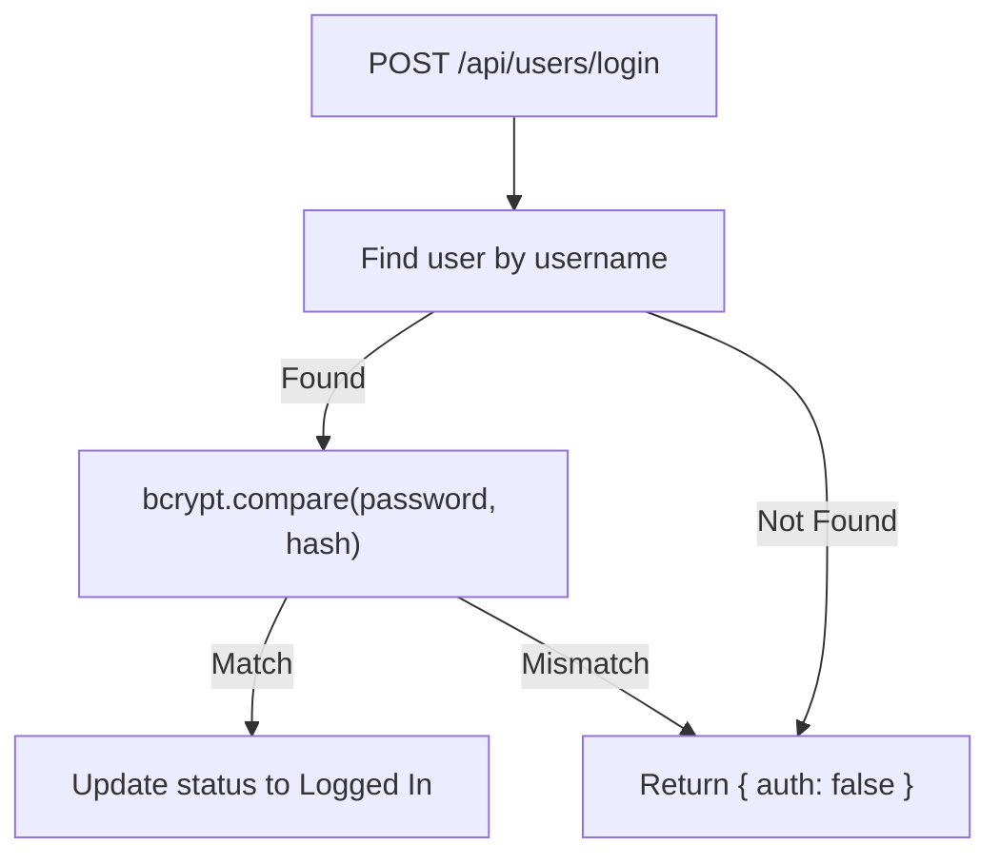
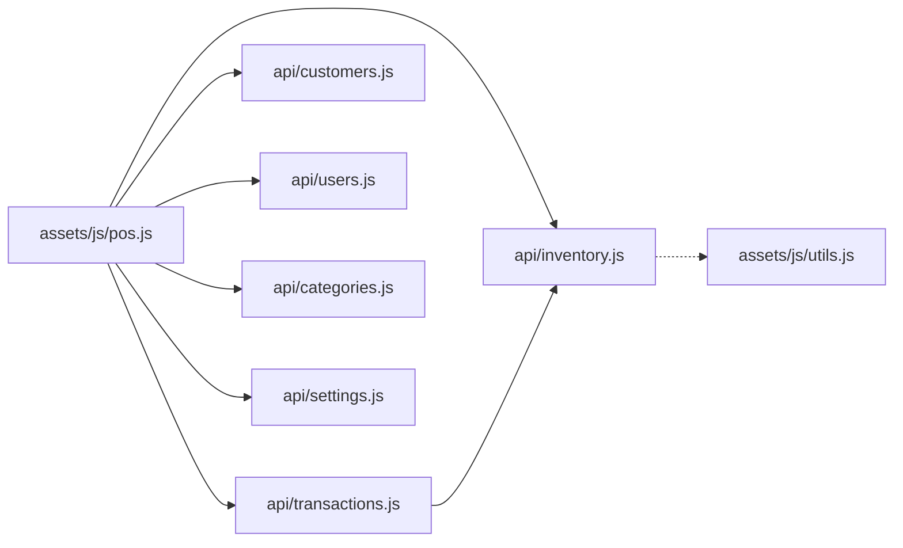
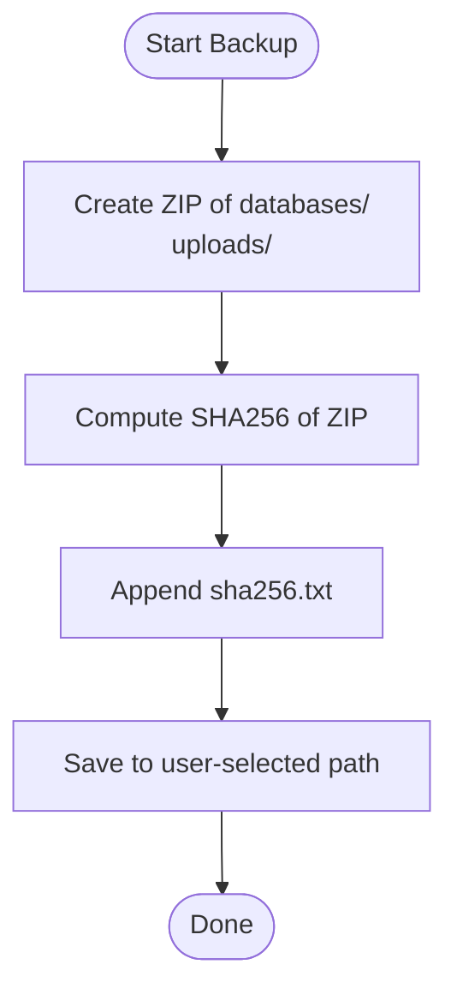

# Database Design

<cite>
**Referenced Files in This Document**
- [server.js](file://server.js)
- [app.config.js](file://app.config.js)
- [api/inventory.js](file://api/inventory.js)
- [api/transactions.js](file://api/transactions.js)
- [api/customers.js](file://api/customers.js)
- [api/users.js](file://api/users.js)
- [api/categories.js](file://api/categories.js)
- [api/settings.js](file://api/settings.js)
- [assets/js/utils.js](file://assets/js/utils.js)
- [assets/js/pos.js](file://assets/js/pos.js)
- [assets/js/native_menu/menuController.js](file://assets/js/native_menu/menuController.js)
</cite>

## Table of Contents
1. [Introduction](#introduction)
2. [Project Structure](#project-structure)
3. [Core Components](#core-components)
4. [Architecture Overview](#architecture-overview)
5. [Detailed Component Analysis](#detailed-component-analysis)
6. [Dependency Analysis](#dependency-analysis)
7. [Performance Considerations](#performance-considerations)
8. [Troubleshooting Guide](#troubleshooting-guide)
9. [Conclusion](#conclusion)
10. [Appendices](#appendices)

## Introduction
This document describes the PharmaSpot POS database design and runtime behavior. The backend uses NeDB (a JavaScript NoSQL database) to persist four core domains: Products (Inventory), Users, Transactions, and Customers. The frontend (Electron + jQuery) interacts with the backend via REST endpoints to manage sales, inventory, users, and settings. The document covers entity relationships, field definitions, validation rules, indexing strategy, query patterns, data lifecycle, backup and restore procedures, and performance considerations.

## Project Structure
PharmaSpot POS organizes database logic behind Express routes grouped by domain. Each domain API initializes its own NeDB datastore and exposes CRUD endpoints. The server wires these routes and sets global middleware.

**Diagram sources**
- [server.js:40-45](file://server.js#L40-L45)
- [api/inventory.js:46-49](file://api/inventory.js#L46-L49)
- [api/transactions.js:21-24](file://api/transactions.js#L21-L24)
- [api/customers.js:22-25](file://api/customers.js#L22-L25)
- [api/users.js:21-24](file://api/users.js#L21-L24)
- [api/categories.js:21-24](file://api/categories.js#L21-L24)
- [api/settings.js:46-49](file://api/settings.js#L46-L49)

**Section sources**
- [server.js:1-68](file://server.js#L1-L68)
- [app.config.js:1-8](file://app.config.js#L1-L8)

## Core Components
- Inventory (Products): Manages product catalog, barcodes, pricing, stock levels, supplier, category, and images. Includes a custom product ID generator and bulk inventory decrement on transaction completion.
- Transactions: Stores sale records with items, totals, payments, taxes, and status flags. Integrates with Inventory to reduce stock.
- Customers: Maintains customer profiles for invoicing and reporting.
- Users: Handles authentication, permissions, and session status.
- Categories: Defines product categories.
- Settings: Stores store branding, tax, currency, and logo.

**Section sources**
- [api/inventory.js:46-333](file://api/inventory.js#L46-L333)
- [api/transactions.js:21-251](file://api/transactions.js#L21-L251)
- [api/customers.js:22-151](file://api/customers.js#L22-L151)
- [api/users.js:21-311](file://api/users.js#L21-L311)
- [api/categories.js:21-124](file://api/categories.js#L21-L124)
- [api/settings.js:46-192](file://api/settings.js#L46-L192)

## Architecture Overview
The backend is a thin Express layer over NeDB. The frontend performs AJAX calls to the backend endpoints to populate UI and submit transactions. Transactions trigger inventory updates.

**Diagram sources**
- [assets/js/pos.js:267-354](file://assets/js/pos.js#L267-L354)
- [assets/js/pos.js:413-488](file://assets/js/pos.js#L413-L488)
- [assets/js/pos.js:719-800](file://assets/js/pos.js#L719-L800)
- [api/inventory.js:275-294](file://api/inventory.js#L275-L294)
- [api/inventory.js:302-332](file://api/inventory.js#L302-L332)
- [api/transactions.js:163-181](file://api/transactions.js#L163-L181)

## Detailed Component Analysis

### Inventory (Products) Data Model
- Storage: NeDB collection stored at APPDATA/APPNAME/server/databases/inventory.db
- Indexing: Unique index on _id
- ID Generation: Factory-like generator creates a deterministic numeric ID combining timestamp and random padding, then checks uniqueness before insertion.
- Fields:
  - _id: integer (unique)
  - barcode: integer
  - expirationDate: string (date format)
  - price: string (validated and escaped)
  - category: string
  - supplier: string
  - quantity: integer (default 0 when empty)
  - name: string
  - stock: integer flag (0 or 1)
  - minStock: integer
  - img: string (sanitized filename)
- Validation and Sanitization:
  - Uses validator.escape for all incoming string fields.
  - Multer upload with size limit and MIME filtering for images.
  - Image deletion support when requested.
- Business Constraints:
  - On transaction creation, inventory quantities are decremented per item.
  - Stock visibility depends on stock flag (0=visible quantity, 1=N/A).
- Query Patterns:
  - Get product by _id
  - Get all products
  - Upsert product (insert/update)
  - Delete product
  - Find by barcode (SKU)

**Diagram sources**
- [api/inventory.js:195-239](file://api/inventory.js#L195-L239)
- [api/inventory.js:53-69](file://api/inventory.js#L53-L69)

**Section sources**
- [api/inventory.js:46-49](file://api/inventory.js#L46-L49)
- [api/inventory.js:53-69](file://api/inventory.js#L53-L69)
- [api/inventory.js:178-193](file://api/inventory.js#L178-L193)
- [api/inventory.js:275-294](file://api/inventory.js#L275-L294)
- [api/inventory.js:302-332](file://api/inventory.js#L302-L332)

### Transactions Data Model
- Storage: NeDB collection stored at APPDATA/APPNAME/server/databases/transactions.db
- Indexing: Unique index on _id
- Fields:
  - _id: string (transaction identifier)
  - items: array of product entries (id, quantity, price)
  - total: number
  - paid: number
  - tax: number
  - customer: string (customer id)
  - user_id: integer
  - till: integer
  - date: ISO date string
  - status: integer flag (e.g., 0 for pending)
  - ref_number: string (reference number)
- Query Patterns:
  - Get all transactions
  - Get on-hold (status=0 and ref_number present)
  - Get customer orders (customer!=0, status=0, ref_number empty)
  - Filter by date range, user_id, till, and status
  - Create new transaction
  - Update existing transaction
  - Delete transaction
- Business Constraints:
  - On paid transactions, triggers inventory decrement via Inventory.decrementInventory
- Referential Integrity:
  - No foreign keys; client-side references expected (customer id, user id, product id).

**Diagram sources**
- [api/transactions.js:163-181](file://api/transactions.js#L163-L181)
- [api/inventory.js:302-332](file://api/inventory.js#L302-L332)

**Section sources**
- [api/transactions.js:21-24](file://api/transactions.js#L21-L24)
- [api/transactions.js:91-154](file://api/transactions.js#L91-L154)
- [api/transactions.js:163-181](file://api/transactions.js#L163-L181)

### Customers Data Model
- Storage: NeDB collection stored at APPDATA/APPNAME/server/databases/customers.db
- Indexing: Unique index on _id
- Fields:
  - _id: string
  - name: string
  - phone: string
  - email: string
  - address: string
  - credit_limit: number
  - balance: number
- Query Patterns:
  - Get customer by _id
  - Get all customers
  - Create customer
  - Update customer
  - Delete customer

**Section sources**
- [api/customers.js:22-25](file://api/customers.js#L22-L25)
- [api/customers.js:47-60](file://api/customers.js#L47-L60)
- [api/customers.js:82-95](file://api/customers.js#L82-L95)

### Users Data Model
- Storage: NeDB collection stored at APPDATA/APPNAME/server/databases/users.db
- Indexing: Unique index on username
- Fields:
  - _id: integer
  - username: string (unique)
  - password: string (hashed)
  - fullname: string
  - status: string (login/logout timestamps)
  - Permissions: perm_products, perm_categories, perm_transactions, perm_users, perm_settings (0/1)
- Authentication:
  - Login compares bcrypt hashes
  - Logout updates status timestamp
- Initialization:
  - Checks for default admin user (_id=1) and seeds if missing

**Diagram sources**
- [api/users.js:95-131](file://api/users.js#L95-L131)

**Section sources**
- [api/users.js:21-24](file://api/users.js#L21-L24)
- [api/users.js:26](file://api/users.js#L26)
- [api/users.js:95-131](file://api/users.js#L95-L131)
- [api/users.js:268-311](file://api/users.js#L268-L311)

### Categories Data Model
- Storage: NeDB collection stored at APPDATA/APPNAME/server/databases/categories.db
- Indexing: Unique index on _id
- Fields:
  - _id: integer
  - name: string
- Notes:
  - _id generated as Unix timestamp seconds to avoid collisions.

**Section sources**
- [api/categories.js:21-24](file://api/categories.js#L21-L24)
- [api/categories.js:61](file://api/categories.js#L61)

### Settings Data Model
- Storage: NeDB collection stored at APPDATA/APPNAME/server/databases/settings.db
- Indexing: Unique index on _id
- Fields:
  - _id: integer (always 1)
  - settings: object with:
    - app: string
    - store: string
    - address_one/address_two: strings
    - contact: string
    - tax: string
    - symbol: string
    - percentage: string
    - charge_tax: boolean
    - quick_billing: boolean
    - footer: string
    - img: string (logo filename)
- Uploads:
  - Logo upload with MIME filtering and size limit.

**Section sources**
- [api/settings.js:46-49](file://api/settings.js#L46-L49)
- [api/settings.js:140-156](file://api/settings.js#L140-L156)

## Dependency Analysis
- Inventory depends on NeDB and exposes a decrement helper used by Transactions.
- Transactions depends on Inventory’s decrement helper.
- Frontend depends on all APIs for data operations.
- Utilities module provides shared helpers (e.g., stock status calculation).

**Diagram sources**
- [assets/js/pos.js:267-354](file://assets/js/pos.js#L267-L354)
- [assets/js/pos.js:413-488](file://assets/js/pos.js#L413-L488)
- [assets/js/pos.js:719-800](file://assets/js/pos.js#L719-L800)
- [assets/js/utils.js:28-52](file://assets/js/utils.js#L28-L52)

**Section sources**
- [assets/js/pos.js:1-100](file://assets/js/pos.js#L1-L100)
- [assets/js/utils.js:1-112](file://assets/js/utils.js#L1-L112)

## Performance Considerations
- Indexing:
  - Unique index on _id for all collections ensures fast lookups and enforces uniqueness.
  - Users collection has a unique index on username to prevent duplicates.
- Query Patterns:
  - Use targeted queries (by _id, barcode) to minimize scans.
  - Filtering by date ranges and status in Transactions is supported; consider adding indexes on frequently filtered fields if growth warrants it.
- Concurrency:
  - NeDB is single-instance; avoid concurrent writes to the same documents. The code uses synchronous operations per request.
- Bulk Operations:
  - Inventory decrement uses series processing to update quantities sequentially, preventing race conditions.
- Caching:
  - Frontend caches lists (products, categories, customers) locally to reduce repeated network calls.

[No sources needed since this section provides general guidance]

## Troubleshooting Guide
- Authentication Failures:
  - Verify bcrypt hashing and compare flow in Users API.
  - Ensure default admin seeding runs on first start.
- Product ID Conflicts:
  - The generator retries until a unique ID is found; inspect logs for errors during generation.
- Transaction Stock Mismatch:
  - Confirm that paid transactions trigger Inventory.decrementInventory and that items exist and have sufficient quantity.
- File Upload Issues:
  - Validate MIME types and size limits in Settings and Inventory endpoints.
- Backup/Restore:
  - Use the built-in backup/restore functions to package databases and uploads, and verify SHA256 checksums.

**Section sources**
- [api/users.js:95-131](file://api/users.js#L95-L131)
- [api/inventory.js:53-69](file://api/inventory.js#L53-L69)
- [api/transactions.js:176-178](file://api/transactions.js#L176-L178)
- [api/settings.js:90-107](file://api/settings.js#L90-L107)
- [assets/js/native_menu/menuController.js:154-286](file://assets/js/native_menu/menuController.js#L154-L286)

## Conclusion
PharmaSpot POS uses a straightforward, embedded-document database design with NeDB. The Inventory and Transactions APIs implement a minimal but effective schema for retail operations, with explicit validation and sanitization. The system relies on client-side references and manual integrity checks. Backup and restore utilities are provided to protect data. Future enhancements could include optional indexes on frequently queried fields and stricter referential enforcement if the dataset grows.

[No sources needed since this section summarizes without analyzing specific files]

## Appendices

### Data Lifecycle Management
- Creation:
  - Users: Hashed passwords, permission flags normalized, default admin seed.
  - Categories: Auto-generated _id from timestamp.
  - Inventory: Generated unique numeric _id; sanitized inputs; optional image upload.
  - Transactions: Inserted as-is; paid transactions trigger inventory updates.
- Updates:
  - All collections use upsert semantics via update or insert depending on presence of identifiers.
- Deletion:
  - Products, customers, categories, and users support removal by _id.
- Archival:
  - Use backup/restore utilities to export/import databases and uploads.

**Section sources**
- [api/users.js:179-259](file://api/users.js#L179-L259)
- [api/categories.js:59-72](file://api/categories.js#L59-L72)
- [api/inventory.js:195-239](file://api/inventory.js#L195-L239)
- [api/transactions.js:163-181](file://api/transactions.js#L163-L181)
- [assets/js/native_menu/menuController.js:154-286](file://assets/js/native_menu/menuController.js#L154-L286)

### Backup and Restore Procedures
- Backup:
  - Creates a zip containing databases and uploads folders, then appends a sha256.txt with the archive’s checksum.
- Restore:
  - Extracts databases and uploads into target locations after verifying the included checksum.
- Usage:
  - Exposed via Electron menu controller functions for saving backups and restoring from archives.

**Diagram sources**
- [assets/js/native_menu/menuController.js:154-184](file://assets/js/native_menu/menuController.js#L154-L184)

**Section sources**
- [assets/js/native_menu/menuController.js:154-286](file://assets/js/native_menu/menuController.js#L154-L286)

### Data Integrity and Referential Constraints
- Uniqueness:
  - _id unique across all collections.
  - Username unique for Users.
- Referential Integrity:
  - No foreign key constraints; maintain references at application level (e.g., customer/user/product ids).
- Validation:
  - Input sanitization via validator.escape.
  - Strict MIME and size checks for uploads.
  - Password hashing with bcrypt.

**Section sources**
- [api/inventory.js:51](file://api/inventory.js#L51)
- [api/customers.js:27](file://api/customers.js#L27)
- [api/users.js:26](file://api/users.js#L26)
- [api/settings.js:12-17](file://api/settings.js#L12-L17)

### Common Queries and Access Patterns
- Retrieve all products:
  - GET /api/inventory/products
- Find product by barcode:
  - POST /api/inventory/product/sku { skuCode }
- Create or update a product:
  - POST /api/inventory/product (multipart/form-data with image)
- Delete a product:
  - DELETE /api/inventory/product/:productId
- Fetch all transactions:
  - GET /api/transactions/all
- Filter transactions by date/user/till/status:
  - GET /api/transactions/by-date?start=&end=&user=&till=&status=
- Create a new transaction:
  - POST /api/transactions/new
- Update a transaction:
  - PUT /api/transactions/new
- Delete a transaction:
  - POST /api/transactions/delete
- Manage customers:
  - GET /api/customers/all
  - GET /api/customers/customer/:customerId
  - POST /api/customers/customer
  - PUT /api/customers/customer
  - DELETE /api/customers/customer/:customerId
- Manage users:
  - GET /api/users/all
  - GET /api/users/user/:userId
  - POST /api/users/post
  - GET /api/users/logout/:userId
  - POST /api/users/login
  - GET /api/users/check
- Manage categories:
  - GET /api/categories/all
  - POST /api/categories/category
  - PUT /api/categories/category
  - DELETE /api/categories/category/:categoryId
- Manage settings:
  - GET /api/settings/get
  - POST /api/settings/post (with logo image)

**Section sources**
- [api/inventory.js:89-102](file://api/inventory.js#L89-L102)
- [api/inventory.js:111-115](file://api/inventory.js#L111-L115)
- [api/inventory.js:276-294](file://api/inventory.js#L276-L294)
- [api/transactions.js:46-50](file://api/transactions.js#L46-L50)
- [api/transactions.js:91-154](file://api/transactions.js#L91-L154)
- [api/transactions.js:163-181](file://api/transactions.js#L163-L181)
- [api/transactions.js:189-210](file://api/transactions.js#L189-L210)
- [api/transactions.js:219-237](file://api/transactions.js#L219-L237)
- [api/customers.js:69-73](file://api/customers.js#L69-L73)
- [api/customers.js:47-60](file://api/customers.js#L47-L60)
- [api/customers.js:82-95](file://api/customers.js#L82-L95)
- [api/customers.js:130-151](file://api/customers.js#L130-L151)
- [api/users.js:140-144](file://api/users.js#L140-L144)
- [api/users.js:46-59](file://api/users.js#L46-L59)
- [api/users.js:179-259](file://api/users.js#L179-L259)
- [api/users.js:68-86](file://api/users.js#L68-L86)
- [api/users.js:95-131](file://api/users.js#L95-L131)
- [api/users.js:268-311](file://api/users.js#L268-L311)
- [api/categories.js:46-50](file://api/categories.js#L46-L50)
- [api/categories.js:59-72](file://api/categories.js#L59-L72)
- [api/categories.js:106-124](file://api/categories.js#L106-L124)
- [api/settings.js:71-80](file://api/settings.js#L71-L80)
- [api/settings.js:90-190](file://api/settings.js#L90-L190)