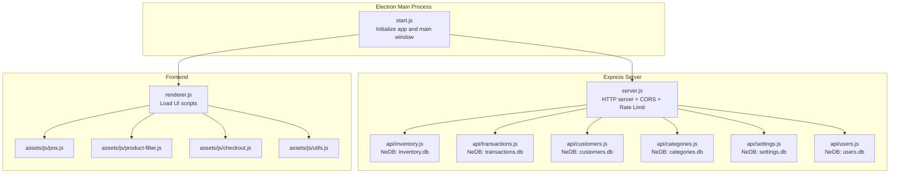
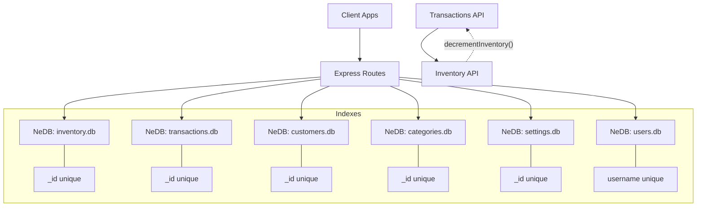
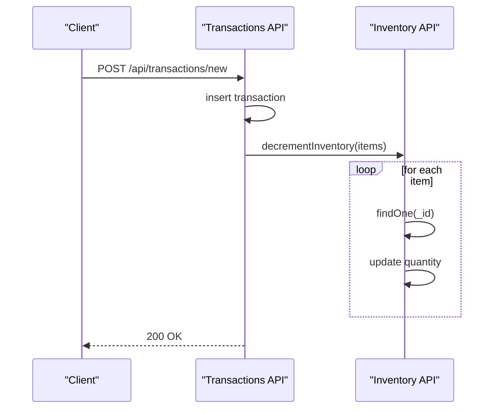
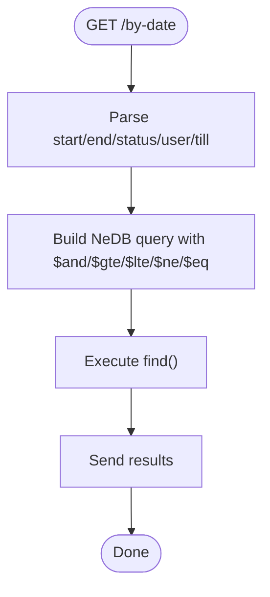
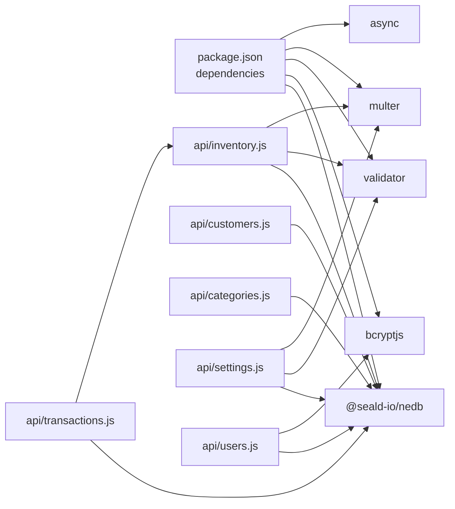

# Database Operations

<cite>
**Referenced Files in This Document**
- [server.js](file://server.js)
- [package.json](file://package.json)
- [api/inventory.js](file://api/inventory.js)
- [api/transactions.js](file://api/transactions.js)
- [api/customers.js](file://api/customers.js)
- [api/categories.js](file://api/categories.js)
- [api/settings.js](file://api/settings.js)
- [api/users.js](file://api/users.js)
- [assets/js/utils.js](file://assets/js/utils.js)
- [assets/js/pos.js](file://assets/js/pos.js)
- [assets/js/product-filter.js](file://assets/js/product-filter.js)
- [assets/js/checkout.js](file://assets/js/checkout.js)
- [renderer.js](file://renderer.js)
- [start.js](file://start.js)
</cite>

## Table of Contents
1. [Introduction](#introduction)
2. [Project Structure](#project-structure)
3. [Core Components](#core-components)
4. [Architecture Overview](#architecture-overview)
5. [Detailed Component Analysis](#detailed-component-analysis)
6. [Dependency Analysis](#dependency-analysis)
7. [Performance Considerations](#performance-considerations)
8. [Troubleshooting Guide](#troubleshooting-guide)
9. [Conclusion](#conclusion)

## Introduction
This document explains the database operation patterns and implementation for the PharmaSpot POS application. The backend is an Electron-based Express server that exposes REST APIs for inventory, transactions, customers, categories, settings, and users. Data is persisted locally using NeDB (a MongoDB-like datastore) with per-collection databases stored under the application’s data directory. The document covers CRUD operations, query and filtering patterns, search functionality, transaction processing, bulk operations, asynchronous interactions, error handling, and performance considerations. It also documents the absence of a centralized factory pattern for database initialization and highlights connection/resource management practices.

## Project Structure
The server initializes Express and registers API routers for each domain collection. Each API module encapsulates its own NeDB datastore instance, index creation, and route handlers. The frontend is bundled and loaded via the Electron main process, which orchestrates the main window and loads the UI scripts.

**Diagram sources**
- [server.js:1-68](file://server.js#L1-L68)
- [api/inventory.js:1-44](file://api/inventory.js#L1-L44)
- [api/transactions.js:1-19](file://api/transactions.js#L1-L19)
- [api/customers.js:1-20](file://api/customers.js#L1-L20)
- [api/categories.js:1-19](file://api/categories.js#L1-L19)
- [api/settings.js:1-44](file://api/settings.js#L1-L44)
- [api/users.js:1-19](file://api/users.js#L1-L19)
- [renderer.js:1-5](file://renderer.js#L1-L5)
- [start.js:1-34](file://start.js#L1-L34)

**Section sources**
- [server.js:1-68](file://server.js#L1-L68)
- [package.json:18-54](file://package.json#L18-L54)
- [renderer.js:1-5](file://renderer.js#L1-L5)
- [start.js:1-34](file://start.js#L1-L34)

## Core Components
- Express server with CORS, rate limiting, and API routing.
- Per-collection NeDB stores with unique indexes on primary keys.
- Utility helpers for file filtering and hashing.
- Frontend scripts for POS, product filtering, checkout, and shared utilities.

Key runtime environment variables:
- APPNAME and APPDATA are set from Electron’s app.getPath('appData') to locate the data directory for databases and uploads.

**Section sources**
- [server.js:1-68](file://server.js#L1-L68)
- [api/inventory.js:18-26](file://api/inventory.js#L18-L26)
- [api/transactions.js:6-15](file://api/transactions.js#L6-L15)
- [api/customers.js:6-16](file://api/customers.js#L6-L16)
- [api/categories.js:6-15](file://api/categories.js#L6-L15)
- [api/settings.js:10-26](file://api/settings.js#L10-L26)
- [api/users.js:8-15](file://api/users.js#L8-L15)
- [assets/js/utils.js:1-112](file://assets/js/utils.js#L1-L112)

## Architecture Overview
The system follows a modular API architecture where each domain exposes CRUD endpoints backed by a dedicated NeDB file. The server listens on a configurable port and routes requests to respective API modules. Asynchronous operations are used for inventory decrement during transaction creation. File uploads are handled per API module with validation and sanitization.

**Diagram sources**
- [server.js:40-45](file://server.js#L40-L45)
- [api/inventory.js:46-49](file://api/inventory.js#L46-L49)
- [api/transactions.js:21-24](file://api/transactions.js#L21-L24)
- [api/customers.js:22-25](file://api/customers.js#L22-L25)
- [api/categories.js:21-24](file://api/categories.js#L21-L24)
- [api/settings.js:46-49](file://api/settings.js#L46-L49)
- [api/users.js:21-24](file://api/users.js#L21-L24)
- [api/transactions.js:176-178](file://api/transactions.js#L176-L178)
- [api/inventory.js:302-332](file://api/inventory.js#L302-L332)

## Detailed Component Analysis

### Inventory API
- Purpose: Manage product catalog, SKUs, images, and stock levels.
- Database: NeDB file at APPDATA/APPNAME/server/databases/inventory.db with unique index on _id.
- Factory pattern: None; datastore initialized inline within the module.
- Product ID generation: A deterministic generator combining timestamp and random padding, followed by existence checks to ensure uniqueness.
- CRUD endpoints:
  - GET /: welcome message
  - GET /product/:productId: fetch by numeric ID
  - GET /products: fetch all
  - POST /product: create or update product; handles image upload, removal, and sanitization
  - DELETE /product/:productId: remove product
  - POST /product/sku: find by barcode/SKU
- Additional operation:
  - POST decrementInventory(products): serially decrements quantities for items in a transaction using async.eachSeries.

**Diagram sources**
- [api/transactions.js:163-181](file://api/transactions.js#L163-L181)
- [api/inventory.js:302-332](file://api/inventory.js#L302-L332)

**Section sources**
- [api/inventory.js:18-26](file://api/inventory.js#L18-L26)
- [api/inventory.js:53-69](file://api/inventory.js#L53-L69)
- [api/inventory.js:124-240](file://api/inventory.js#L124-L240)
- [api/inventory.js:249-266](file://api/inventory.js#L249-L266)
- [api/inventory.js:276-294](file://api/inventory.js#L276-L294)
- [api/inventory.js:302-332](file://api/inventory.js#L302-L332)

### Transactions API
- Purpose: Manage sales transactions, filters, and status tracking.
- Database: NeDB file at APPDATA/APPNAME/server/databases/transactions.db with unique index on _id.
- CRUD endpoints:
  - GET /: welcome message
  - GET /all: fetch all transactions
  - GET /on-hold: filter by status 0 and non-empty reference number
  - GET /customer-orders: filter by customer != "0", status 0, and empty reference number
  - GET /by-date: filter by date range, optional user_id, and optional till
  - GET /:transactionId: fetch by transaction ID
  - POST /new: create transaction; triggers inventory decrement if paid >= total
  - PUT /new: update transaction
  - POST /delete: remove transaction
- Query patterns:
  - Uses NeDB operators ($and, $gte, $lte, $ne, $eq) to combine filters.
  - Accepts query parameters for flexible filtering.

**Diagram sources**
- [api/transactions.js:91-154](file://api/transactions.js#L91-L154)

**Section sources**
- [api/transactions.js:6-15](file://api/transactions.js#L6-L15)
- [api/transactions.js:21-26](file://api/transactions.js#L21-L26)
- [api/transactions.js:46-82](file://api/transactions.js#L46-L82)
- [api/transactions.js:91-154](file://api/transactions.js#L91-L154)
- [api/transactions.js:163-181](file://api/transactions.js#L163-L181)
- [api/transactions.js:190-210](file://api/transactions.js#L190-L210)
- [api/transactions.js:219-237](file://api/transactions.js#L219-L237)
- [api/transactions.js:246-250](file://api/transactions.js#L246-L250)

### Customers API
- Purpose: Manage customer records.
- Database: NeDB file at APPDATA/APPNAME/server/databases/customers.db with unique index on _id.
- CRUD endpoints:
  - GET /: welcome message
  - GET /customer/:customerId: fetch by ID
  - GET /all: fetch all
  - POST /customer: create customer
  - PUT /customer: update customer
  - DELETE /customer/:customerId: remove customer

**Section sources**
- [api/customers.js:6-16](file://api/customers.js#L6-L16)
- [api/customers.js:22-25](file://api/customers.js#L22-L25)
- [api/customers.js:47-60](file://api/customers.js#L47-L60)
- [api/customers.js:69-73](file://api/customers.js#L69-L73)
- [api/customers.js:82-95](file://api/customers.js#L82-L95)
- [api/customers.js:130-151](file://api/customers.js#L130-L151)
- [api/customers.js:104-121](file://api/customers.js#L104-L121)

### Categories API
- Purpose: Manage product categories.
- Database: NeDB file at APPDATA/APPNAME/server/databases/categories.db with unique index on _id.
- CRUD endpoints:
  - GET /: welcome message
  - GET /all: fetch all categories
  - POST /category: create category; auto-generates numeric _id
  - PUT /category: update category
  - DELETE /category/:categoryId: remove category

**Section sources**
- [api/categories.js:6-15](file://api/categories.js#L6-L15)
- [api/categories.js:21-24](file://api/categories.js#L21-L24)
- [api/categories.js:46-50](file://api/categories.js#L46-L50)
- [api/categories.js:59-72](file://api/categories.js#L59-L72)
- [api/categories.js:106-124](file://api/categories.js#L106-L124)
- [api/categories.js:81-97](file://api/categories.js#L81-L97)

### Settings API
- Purpose: Store global application settings and manage logo uploads.
- Database: NeDB file at APPDATA/APPNAME/server/databases/settings.db with unique index on _id.
- CRUD endpoints:
  - GET /: welcome message
  - GET /get: fetch settings by fixed _id 1
  - POST /post: create or update settings; handles logo upload and removal
- Notes:
  - Uses a single settings record with _id = 1.
  - Uploads logo with a fixed filename and validates file types.

**Section sources**
- [api/settings.js:10-26](file://api/settings.js#L10-L26)
- [api/settings.js:46-49](file://api/settings.js#L46-L49)
- [api/settings.js:71-80](file://api/settings.js#L71-L80)
- [api/settings.js:90-190](file://api/settings.js#L90-L190)

### Users API
- Purpose: Authentication, user lifecycle, and permissions.
- Database: NeDB file at APPDATA/APPNAME/server/databases/users.db with unique index on username.
- Authentication:
  - POST /login: verifies password using bcrypt against stored hash; updates status upon success.
- Lifecycle:
  - GET /all: fetch all users
  - GET /user/:userId: fetch by ID
  - GET /logout/:userId: update status
  - POST /post: create or update user; hashes passwords; normalizes permission flags; auto-generates numeric _id for new users
  - GET /check: ensures default admin user exists with hashed password
- Notes:
  - Password hashing uses bcryptjs.
  - Permission flags are normalized to 0/1 for new users if missing.

**Section sources**
- [api/users.js:8-15](file://api/users.js#L8-L15)
- [api/users.js:21-24](file://api/users.js#L21-L24)
- [api/users.js:95-131](file://api/users.js#L95-L131)
- [api/users.js:179-259](file://api/users.js#L179-L259)
- [api/users.js:268-311](file://api/users.js#L268-L311)

### Frontend Integration
- The Electron main process loads renderer scripts that drive POS, filtering, checkout, and utilities.
- Utilities include stock status calculation, file filtering/validation, and CSP helpers.

**Section sources**
- [renderer.js:1-5](file://renderer.js#L1-L5)
- [assets/js/pos.js](file://assets/js/pos.js)
- [assets/js/product-filter.js](file://assets/js/product-filter.js)
- [assets/js/checkout.js](file://assets/js/checkout.js)
- [assets/js/utils.js:1-112](file://assets/js/utils.js#L1-L112)

## Dependency Analysis
- External libraries:
  - @seald-io/nedb for local document storage
  - bcryptjs for password hashing
  - validator for input sanitization
  - multer for file uploads
  - async for serial operations
- Internal dependencies:
  - Transactions API depends on Inventory API for stock decrement.
  - Settings API uses file filtering utilities.

**Diagram sources**
- [package.json:18-54](file://package.json#L18-L54)
- [api/inventory.js:4,10,17](file://api/inventory.js#L4,L10,L17)
- [api/transactions.js:4,5](file://api/transactions.js#L4,L5)
- [api/customers.js:4](file://api/customers.js#L4)
- [api/categories.js:4](file://api/categories.js#L4)
- [api/settings.js:4,5,19](file://api/settings.js#L4,L5,L19)
- [api/users.js:4,5](file://api/users.js#L4,L5)

**Section sources**
- [package.json:18-54](file://package.json#L18-L54)
- [api/transactions.js:5](file://api/transactions.js#L5)
- [api/inventory.js:10](file://api/inventory.js#L10)
- [api/settings.js:19](file://api/settings.js#L19)

## Performance Considerations
- Indexing: Unique indexes on primary keys reduce lookup costs for equality filters.
- Serial operations: Inventory decrement uses async.eachSeries, ensuring atomicity per item but serializing updates. For high-volume scenarios, consider batching updates or parallelizing with controlled concurrency.
- Query complexity: Filtering by date ranges and optional user/till combinations is straightforward; avoid unnecessary projections and limit result sets where possible.
- File handling: Image uploads are validated and sanitized; ensure disk I/O does not bottleneck under heavy traffic.
- Memory footprint: NeDB keeps data in memory; keep collections reasonably sized and compact periodically if supported by the datastore.

[No sources needed since this section provides general guidance]

## Troubleshooting Guide
- Database path resolution:
  - Verify APPDATA and APPNAME environment variables are correctly set by the Electron app to locate databases and uploads.
- Error handling patterns:
  - All write operations log errors and return JSON with error and message fields.
  - File upload errors are captured via multer and returned with structured messages.
- Common issues:
  - Product ID collisions: The generator retries until a unique ID is found; ensure no external writes modify the inventory collection concurrently.
  - Transaction stock updates: Confirm that paid >= total triggers decrementInventory; otherwise, stock will not update.
  - Settings logo removal: Removing a logo requires explicit removal flag; ensure correct payload is sent.

**Section sources**
- [server.js:7-8](file://server.js#L7-L8)
- [api/inventory.js:125-141](file://api/inventory.js#L125-L141)
- [api/inventory.js:195-204](file://api/inventory.js#L195-L204)
- [api/transactions.js:176-178](file://api/transactions.js#L176-L178)
- [api/settings.js:93-107](file://api/settings.js#L93-L107)

## Conclusion
PharmaSpot POS implements a straightforward, modular database architecture using NeDB per collection. Each API module encapsulates its datastore initialization, indexes, and CRUD endpoints. The system leverages asynchronous patterns for inventory adjustments and provides robust file handling for media assets. While there is no centralized factory for database initialization, the per-module approach is clear and maintainable. For production hardening, consider adding batch update strategies for inventory, connection pooling if scaling, and structured logging for diagnostics.