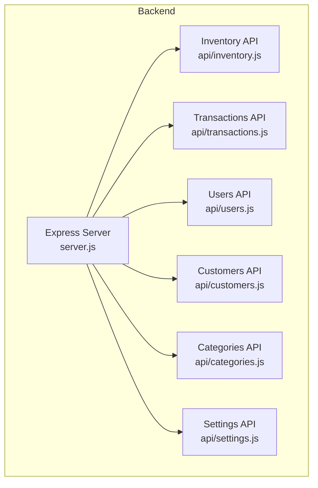
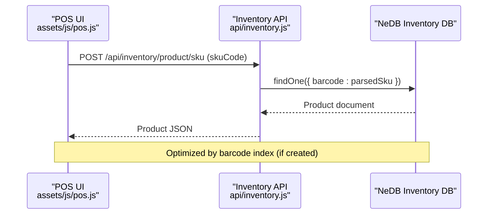
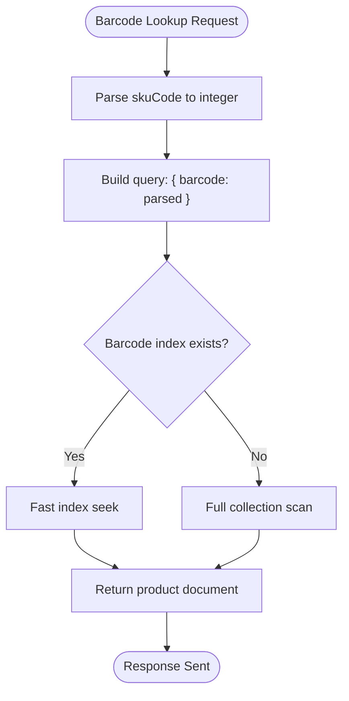
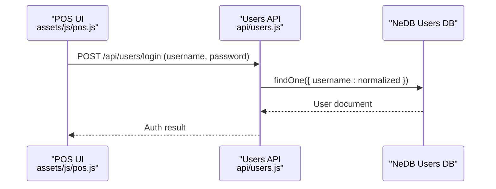
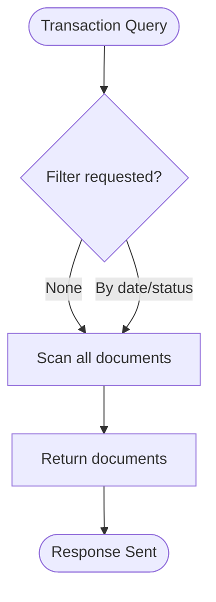
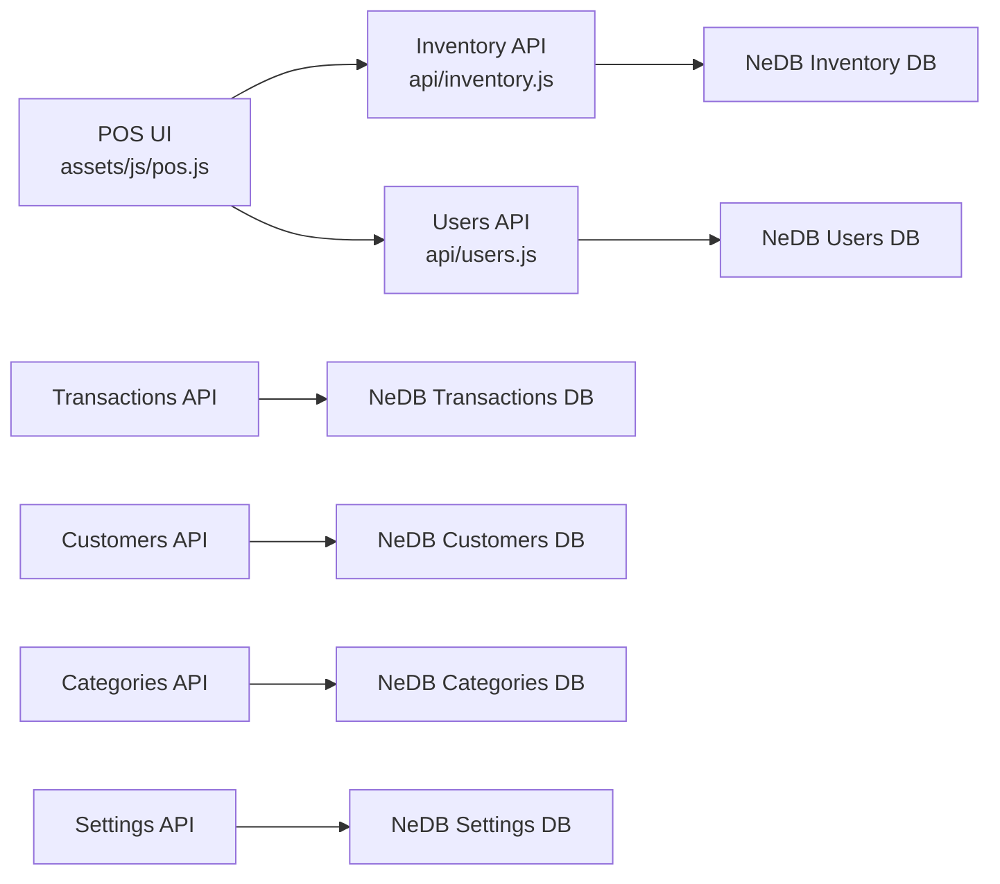

# Indexing Strategy

<cite>
**Referenced Files in This Document**
- [server.js](file://server.js)
- [api/inventory.js](file://api/inventory.js)
- [api/transactions.js](file://api/transactions.js)
- [api/users.js](file://api/users.js)
- [api/customers.js](file://api/customers.js)
- [api/categories.js](file://api/categories.js)
- [api/settings.js](file://api/settings.js)
- [assets/js/pos.js](file://assets/js/pos.js)
- [package.json](file://package.json)
</cite>

## Table of Contents
1. [Introduction](#introduction)
2. [Project Structure](#project-structure)
3. [Core Components](#core-components)
4. [Architecture Overview](#architecture-overview)
5. [Detailed Component Analysis](#detailed-component-analysis)
6. [Dependency Analysis](#dependency-analysis)
7. [Performance Considerations](#performance-considerations)
8. [Troubleshooting Guide](#troubleshooting-guide)
9. [Conclusion](#conclusion)

## Introduction
This document describes the database indexing strategy and performance optimization for the PharmaSpot POS system. The backend uses NeDB (a pure JavaScript NoSQL database) for local persistence across multiple domains (inventory, transactions, users, customers, categories, settings). The frontend integrates with these APIs to support barcode-based product lookup, user authentication, and transaction recording. This guide focuses on:
- Unique index implementation for primary keys
- Indexing patterns for frequently queried fields (barcodes, usernames)
- Query optimization techniques and index selection criteria
- Performance monitoring approaches
- Examples of optimized queries and explain plans
- Maintenance, rebuilding strategies, and storage considerations

## Project Structure
The backend is organized around a single Express server that mounts domain-specific API modules. Each module initializes a dedicated NeDB datastore and defines indexes appropriate for its workload.

**Diagram sources**
- [server.js:40-45](file://server.js#L40-L45)
- [api/inventory.js:42](file://api/inventory.js#L42)
- [api/transactions.js:17](file://api/transactions.js#L17)
- [api/users.js:17](file://api/users.js#L17)
- [api/customers.js:18](file://api/customers.js#L18)
- [api/categories.js:17](file://api/categories.js#L17)
- [api/settings.js:42](file://api/settings.js#L42)

**Section sources**
- [server.js:40-45](file://server.js#L40-L45)
- [package.json:18-54](file://package.json#L18-L54)

## Core Components
- Inventory API: Manages product catalog, supports barcode-based lookup, and decrements stock after successful transactions.
- Transactions API: Records sale events and updates inventory accordingly.
- Users API: Handles authentication and user management with a unique username index.
- Customers, Categories, Settings APIs: Provide supporting domain data.

Key indexing patterns observed:
- Unique index on the primary key field (_id) for all collections.
- Unique index on username for user authentication.

These indexes enable fast equality lookups on primary keys and enforce uniqueness for usernames.

**Section sources**
- [api/inventory.js:51](file://api/inventory.js#L51)
- [api/transactions.js:26](file://api/transactions.js#L26)
- [api/users.js:26](file://api/users.js#L26)
- [api/customers.js:27](file://api/customers.js#L27)
- [api/categories.js:26](file://api/categories.js#L26)
- [api/settings.js:51](file://api/settings.js#L51)

## Architecture Overview
The client interacts with the backend via REST endpoints. The most relevant flows for indexing and performance are:
- POS barcode scanning triggers a POST to the inventory SKU endpoint, which queries by barcode.
- User login queries by username.
- Transaction creation may trigger inventory updates.

**Diagram sources**
- [assets/js/pos.js:425-432](file://assets/js/pos.js#L425-L432)
- [api/inventory.js:276-294](file://api/inventory.js#L276-L294)

## Detailed Component Analysis

### Inventory Database Indexing Strategy
- Primary key: _id (unique index)
- Frequently queried field: barcode (integer)
- Typical queries:
  - Lookup product by _id
  - Lookup product by barcode (SKU)

Observed implementation:
- Unique index on _id
- No explicit barcode index is declared in the inventory module

Recommendations:
- Create a unique index on barcode to accelerate SKU lookups and prevent duplicate barcodes.
- Consider a compound index if queries filter by additional fields (e.g., category, supplier) alongside barcode.

**Diagram sources**
- [api/inventory.js:276-294](file://api/inventory.js#L276-L294)

**Section sources**
- [api/inventory.js:51](file://api/inventory.js#L51)
- [api/inventory.js:276-294](file://api/inventory.js#L276-L294)

### Users Database Indexing Strategy
- Primary key: _id (unique index)
- Frequently queried field: username (equality lookup during login)
- Observed implementation:
  - Unique index on username

This ensures O(1) average-time username lookups and enforces unique usernames.

**Diagram sources**
- [assets/js/pos.js](file://assets/js/pos.js)
- [api/users.js:95-131](file://api/users.js#L95-L131)

**Section sources**
- [api/users.js:26](file://api/users.js#L26)
- [api/users.js:95-131](file://api/users.js#L95-L131)

### Transactions Database Indexing Strategy
- Primary key: _id (unique index)
- Typical queries:
  - Retrieve all transactions
  - Retrieve on-hold transactions
  - Upsert/update transaction records

Observation:
- No explicit secondary indexes are declared for transaction date or status fields.

Recommendations:
- If filtering by date range or status becomes frequent, consider adding indexes on transaction date and status fields to improve query performance.

**Diagram sources**
- [api/transactions.js:46](file://api/transactions.js#L46)
- [api/transactions.js:59](file://api/transactions.js#L59)

**Section sources**
- [api/transactions.js:26](file://api/transactions.js#L26)
- [api/transactions.js:46](file://api/transactions.js#L46)
- [api/transactions.js:59](file://api/transactions.js#L59)

### Additional Collections
- Customers, Categories, Settings: Each has a unique index on _id. No additional secondary indexes are declared for typical fields.

Recommendations:
- For customer name or category name searches, consider adding text indexes if the application grows to support free-text search.
- For settings, since there is typically a single record with _id=1, no additional index is necessary.

**Section sources**
- [api/customers.js:27](file://api/customers.js#L27)
- [api/categories.js:26](file://api/categories.js#L26)
- [api/settings.js:51](file://api/settings.js#L51)

## Dependency Analysis
The backend relies on NeDB for local persistence. The client-side POS UI communicates with the backend via AJAX calls to inventory and users endpoints.

**Diagram sources**
- [assets/js/pos.js:425-432](file://assets/js/pos.js#L425-L432)
- [api/inventory.js:276-294](file://api/inventory.js#L276-L294)
- [api/users.js:95-131](file://api/users.js#L95-L131)
- [package.json:21](file://package.json#L21)

**Section sources**
- [package.json:21](file://package.json#L21)
- [assets/js/pos.js:425-432](file://assets/js/pos.js#L425-L432)

## Performance Considerations
- Current indexes:
  - All collections have a unique index on _id.
  - Users collection has a unique index on username.
- Missing indexes:
  - Inventory: barcode (commonly used for SKU lookups)
  - Transactions: date/status (if filtered frequently)

Optimization techniques:
- Ensure barcode index exists to avoid full scans on SKU lookups.
- Normalize and validate input (e.g., convert SKU to integer) before querying.
- Batch inventory updates during transaction creation to reduce write amplification.
- Monitor database file sizes and compact periodically if growth is significant.

[No sources needed since this section provides general guidance]

## Troubleshooting Guide
Common issues and resolutions:
- Slow barcode lookups:
  - Cause: Missing barcode index.
  - Resolution: Add a unique index on barcode in the inventory database.
- Duplicate usernames:
  - Cause: Missing unique constraint on username.
  - Resolution: Confirm unique index exists; enforce uniqueness at insert/update.
- Transaction query slowness:
  - Cause: Lack of indexes on date/status fields.
  - Resolution: Add indexes on frequently filtered fields.

Monitoring approaches:
- Track response times for inventory SKU and user login endpoints.
- Observe database file growth and schedule maintenance tasks.
- Use logs to identify slow queries and missing indexes.

**Section sources**
- [api/inventory.js:276-294](file://api/inventory.js#L276-L294)
- [api/users.js:95-131](file://api/users.js#L95-L131)

## Conclusion
The current indexing strategy leverages unique indexes on primary keys and usernames, which are essential for performance. To further optimize the PharmaSpot POS:
- Add a unique index on barcode in the inventory database for SKU lookups.
- Evaluate adding indexes on transaction date and status fields if filtering becomes frequent.
- Implement periodic maintenance routines to monitor and compact databases.
- Continue validating and normalizing inputs to maximize index effectiveness.

[No sources needed since this section summarizes without analyzing specific files]