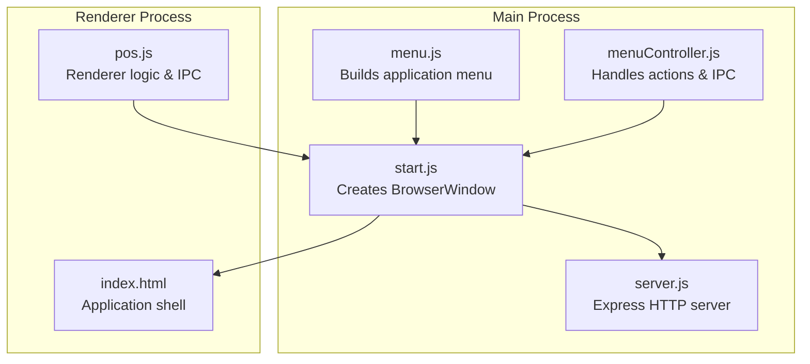
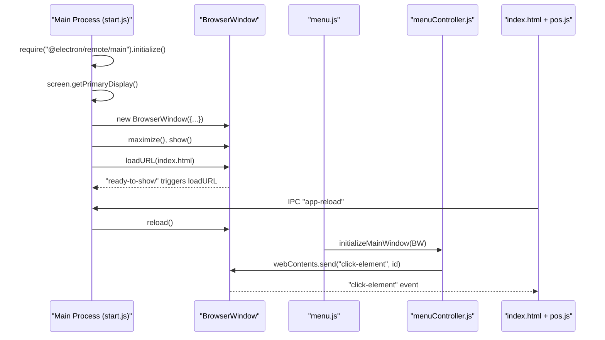
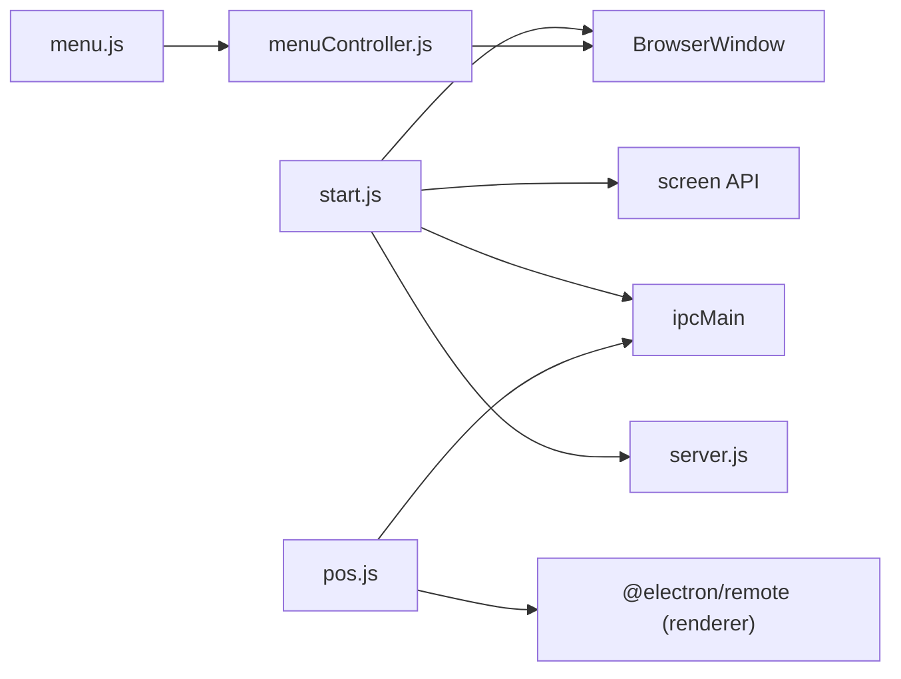

# BrowserWindow Management

<cite>
**Referenced Files in This Document**
- [start.js](file://start.js)
- [index.html](file://index.html)
- [server.js](file://server.js)
- [menu.js](file://assets/js/native_menu/menu.js)
- [menuController.js](file://assets/js/native_menu/menuController.js)
- [pos.js](file://assets/js/pos.js)
- [package.json](file://package.json)
- [forge.config.js](file://forge.config.js)
- [setupEvents.js](file://installers/setupEvents.js)
</cite>

## Table of Contents
1. [Introduction](#introduction)
2. [Project Structure](#project-structure)
3. [Core Components](#core-components)
4. [Architecture Overview](#architecture-overview)
5. [Detailed Component Analysis](#detailed-component-analysis)
6. [Dependency Analysis](#dependency-analysis)
7. [Performance Considerations](#performance-considerations)
8. [Troubleshooting Guide](#troubleshooting-guide)
9. [Conclusion](#conclusion)

## Introduction
This document explains how the Electron application manages its main BrowserWindow, including creation parameters, display detection, lifecycle events, and security posture. It also covers multi-window coordination via the remote module, IPC-driven reloads, and practical guidance for persistence, troubleshooting, and performance.

## Project Structure
The BrowserWindow lifecycle is orchestrated from the main process entry point. The renderer loads the application shell and interacts with the main process via IPC and the remote module.

**Diagram sources**
- [start.js:1-107](file://start.js#L1-L107)
- [menu.js:1-153](file://assets/js/native_menu/menu.js#L1-L153)
- [menuController.js:1-346](file://assets/js/native_menu/menuController.js#L1-L346)
- [server.js:1-68](file://server.js#L1-L68)
- [index.html:1-884](file://index.html#L1-L884)
- [pos.js:1-2538](file://assets/js/pos.js#L1-L2538)

**Section sources**
- [start.js:1-107](file://start.js#L1-L107)
- [index.html:1-884](file://index.html#L1-L884)
- [server.js:1-68](file://server.js#L1-L68)
- [menu.js:1-153](file://assets/js/native_menu/menu.js#L1-L153)
- [menuController.js:1-346](file://assets/js/native_menu/menuController.js#L1-L346)
- [pos.js:1-2538](file://assets/js/pos.js#L1-L2538)

## Core Components
- Main process window creator and lifecycle manager
- Renderer application shell and IPC integrations
- Menu system wiring BrowserWindow actions to renderer controls
- Remote module enabling cross-process interactions
- Express server for local API endpoints

**Section sources**
- [start.js:21-45](file://start.js#L21-L45)
- [index.html:1-884](file://index.html#L1-L884)
- [menu.js:14-151](file://assets/js/native_menu/menu.js#L14-L151)
- [menuController.js:327-333](file://assets/js/native_menu/menuController.js#L327-L333)
- [server.js:1-68](file://server.js#L1-L68)

## Architecture Overview
The main process creates a single BrowserWindow sized to the primary display work area, maximizes it, and loads the application shell. The renderer initializes application logic and communicates with the main process via IPC and the remote module.

**Diagram sources**
- [start.js:21-45](file://start.js#L21-L45)
- [start.js:75-81](file://start.js#L75-L81)
- [menu.js:14-151](file://assets/js/native_menu/menu.js#L14-L151)
- [menuController.js:327-333](file://assets/js/native_menu/menuController.js#L327-L333)
- [index.html:1-884](file://index.html#L1-L884)
- [pos.js:2536-2538](file://assets/js/pos.js#L2536-L2538)

## Detailed Component Analysis

### Window Creation and Display Detection
- Display detection uses the primary display work area to set initial BrowserWindow size.
- The window is maximized immediately after creation and shown.
- The application shell is loaded from the local filesystem.

Implementation highlights:
- Display sizing and window creation
- Maximize and show sequence
- Load local HTML file

**Section sources**
- [start.js:21-45](file://start.js#L21-L45)

### BrowserWindow Creation Parameters
- Size: Derived from the primary display work area width and height.
- Frame: Standard frame enabled.
- WebPreferences:
  - Node integration enabled
  - Remote module disabled
  - Context isolation disabled

These choices impact security and integration trade-offs. For production hardening, consider enabling context isolation and disabling Node integration in the renderer.

**Section sources**
- [start.js:25-34](file://start.js#L25-L34)

### Maximize() Functionality
- The window is maximized immediately after creation and before loading content.
- This ensures the app opens at full viewport size on the primary monitor.

**Section sources**
- [start.js:36](file://start.js#L36)

### Display Detection Using screen.getPrimaryDisplay()
- The primary display’s workAreaSize is used to compute width and height.
- This avoids including taskbars or docks in the initial window size.

**Section sources**
- [start.js:23-24](file://start.js#L23-L24)

### Window Lifecycle Events
- Ready: The application loads the HTML after the window is created.
- Closed: The window reference is cleared to allow garbage collection.
- Activate: On macOS, re-creates the window if none exists.

Additional lifecycle hooks:
- Browser window created: Enables the remote module for newly created windows.

**Section sources**
- [start.js:39](file://start.js#L39)
- [start.js:41-43](file://start.js#L41-L43)
- [start.js:47-49](file://start.js#L47-L49)
- [start.js:61-65](file://start.js#L61-L65)

### Multi-Window Coordination and Window State Persistence
- Single main window is managed; no explicit secondary windows are created in the provided code.
- The remote module is initialized and enabled per window, allowing the renderer to trigger actions in the main window.
- IPC channels support reload and quit commands, enabling stateless control from the renderer.

Note: There is no explicit window state persistence (size, position, maximize state) in the provided code. Consider adding persistence using a configuration store if needed.

**Section sources**
- [start.js:1](file://start.js#L1)
- [start.js:47-49](file://start.js#L47-L49)
- [start.js:75-81](file://start.js#L75-L81)
- [menuController.js:327-333](file://assets/js/native_menu/menuController.js#L327-L333)

### Security Settings, Context Isolation, and Remote Module Configuration
- Context isolation is disabled, which can increase attack surface if untrusted content is rendered.
- Node integration is enabled in the renderer process.
- The remote module is disabled globally in the BrowserWindow preferences.

Recommendations:
- Enable context isolation and Content-Security-Policy headers in the renderer.
- Prefer preload scripts for secure IPC channels instead of relying on remote.
- Consider disabling Node integration and using preload to expose only necessary APIs.

Renderer-side CSP initialization is present in the renderer code.

**Section sources**
- [start.js:30-32](file://start.js#L30-L32)
- [pos.js:96-97](file://assets/js/pos.js#L96-L97)

### IPC and Menu Integration
- The renderer sends IPC messages to the main process for reload and quit.
- The menu system wires actions to send click events to the renderer via the main window’s webContents.
- The context menu includes a “Refresh” action that reloads the main window.

**Section sources**
- [pos.js:2503](file://assets/js/pos.js#L2503)
- [pos.js:2531](file://assets/js/pos.js#L2531)
- [menu.js:33-68](file://assets/js/native_menu/menu.js#L33-L68)
- [menuController.js:331-333](file://assets/js/native_menu/menuController.js#L331-L333)
- [start.js:87-97](file://start.js#L87-L97)

### Renderer Initialization and Dependencies
- The renderer initializes jQuery and loads application modules.
- It uses the remote module to access main process utilities.
- It sets up IPC listeners and sends events to the main process.

**Section sources**
- [renderer.js:1-5](file://renderer.js#L1-L5)
- [pos.js:12-18](file://assets/js/pos.js#L12-L18)

### Build and Packaging Notes
- Electron is pinned to a specific major version in dependencies.
- Forge makers and publishers are configured for multiple platforms.
- The main entry point is set to the start script.

**Section sources**
- [package.json:116-127](file://package.json#L116-L127)
- [forge.config.js:1-71](file://forge.config.js#L1-L71)
- [package.json:11](file://package.json#L11)

## Dependency Analysis
The main process depends on Electron APIs for window management, screen detection, and IPC. The renderer depends on the remote module and IPC to coordinate with the main process. The menu system bridges the main process and renderer.

**Diagram sources**
- [start.js:1-107](file://start.js#L1-L107)
- [menu.js:1-153](file://assets/js/native_menu/menu.js#L1-L153)
- [menuController.js:1-346](file://assets/js/native_menu/menuController.js#L1-L346)
- [pos.js:1-2538](file://assets/js/pos.js#L1-L2538)
- [server.js:1-68](file://server.js#L1-L68)

**Section sources**
- [start.js:1-107](file://start.js#L1-L107)
- [menu.js:1-153](file://assets/js/native_menu/menu.js#L1-L153)
- [menuController.js:1-346](file://assets/js/native_menu/menuController.js#L1-L346)
- [pos.js:1-2538](file://assets/js/pos.js#L1-L2538)
- [server.js:1-68](file://server.js#L1-L68)

## Performance Considerations
- Avoid unnecessary reflows by minimizing DOM manipulation in tight loops.
- Defer heavy initialization until after the window is ready to show.
- Use IPC sparingly; batch updates where possible.
- Keep the renderer isolated from Node integration for security and stability.
- Consider lazy-loading non-critical renderer modules.

[No sources needed since this section provides general guidance]

## Troubleshooting Guide
Common issues and remedies:
- Window does not open or closes immediately:
  - Verify the main process entry point and that the window is created before quitting.
  - Check for exceptions in the main process lifecycle hooks.

- Window opens but content is blank:
  - Confirm the HTML path and that loadURL is called after show/maximize.

- Remote module errors in renderer:
  - Ensure the remote module is enabled for the window and that the main process initializes the remote module.

- IPC not working:
  - Confirm the renderer sends the correct channel and the main process listens to it.

- Menu actions not triggering:
  - Ensure the main window reference is initialized and webContents is used to send events.

**Section sources**
- [start.js:47-49](file://start.js#L47-L49)
- [start.js:75-81](file://start.js#L75-L81)
- [menuController.js:327-333](file://assets/js/native_menu/menuController.js#L327-L333)
- [pos.js:2536-2538](file://assets/js/pos.js#L2536-L2538)

## Conclusion
The application uses a straightforward single-window model with display-aware sizing, immediate maximization, and a robust IPC and menu bridge. For production, prioritize enabling context isolation, CSP, and moving away from remote in favor of secure preload patterns. Consider persisting window state and optimizing renderer initialization for responsiveness.