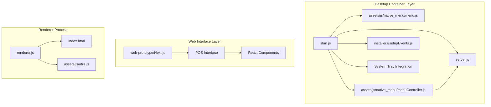
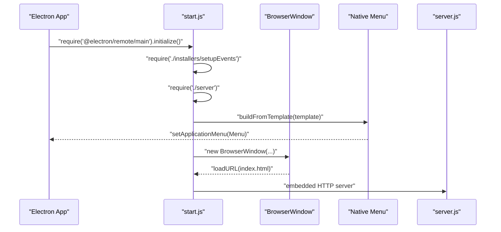
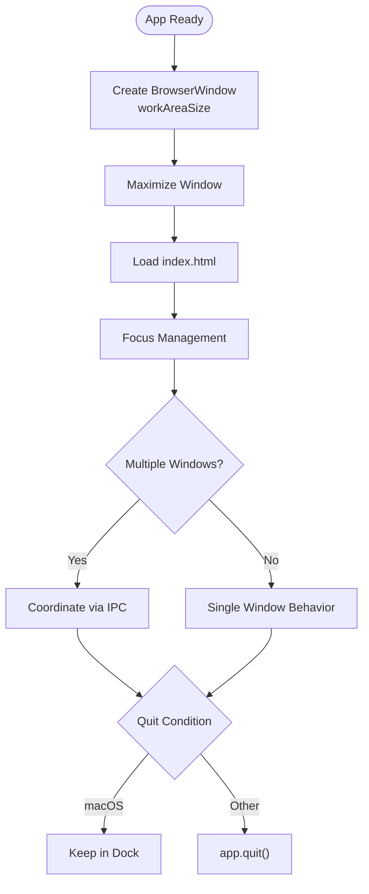
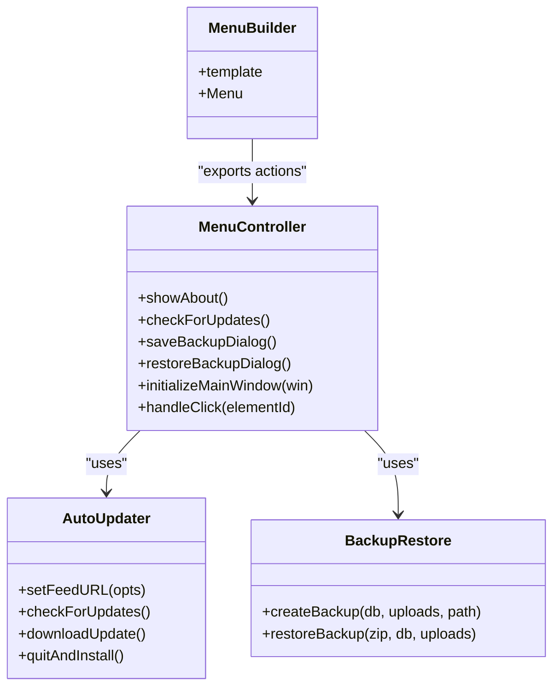
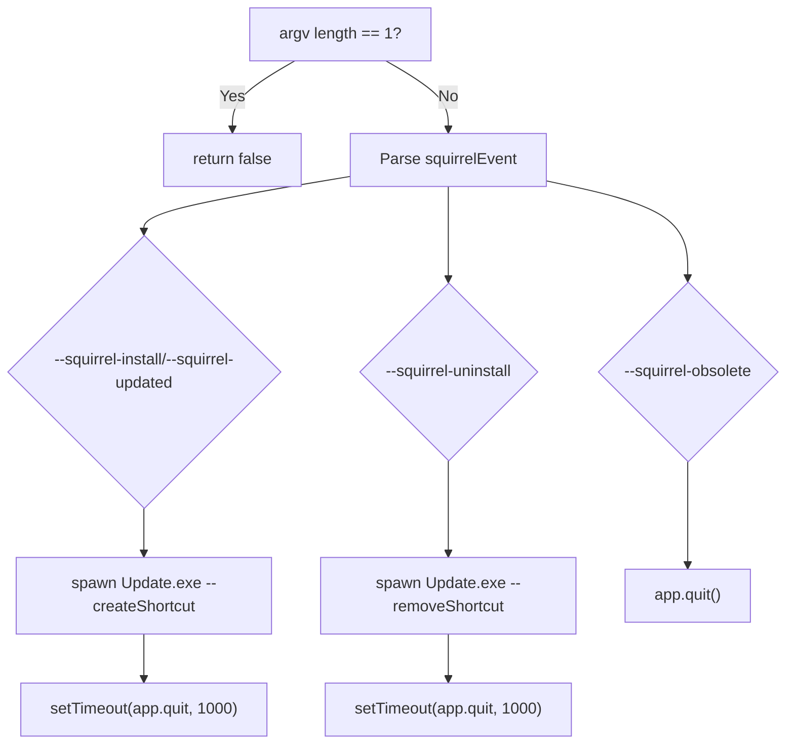
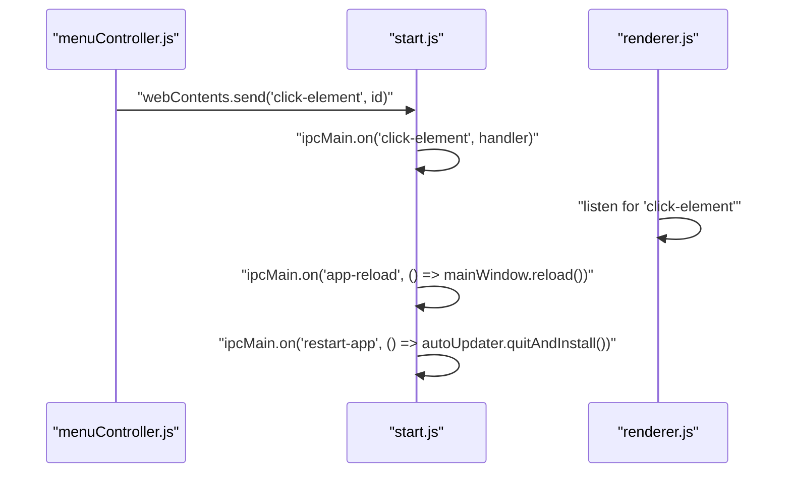
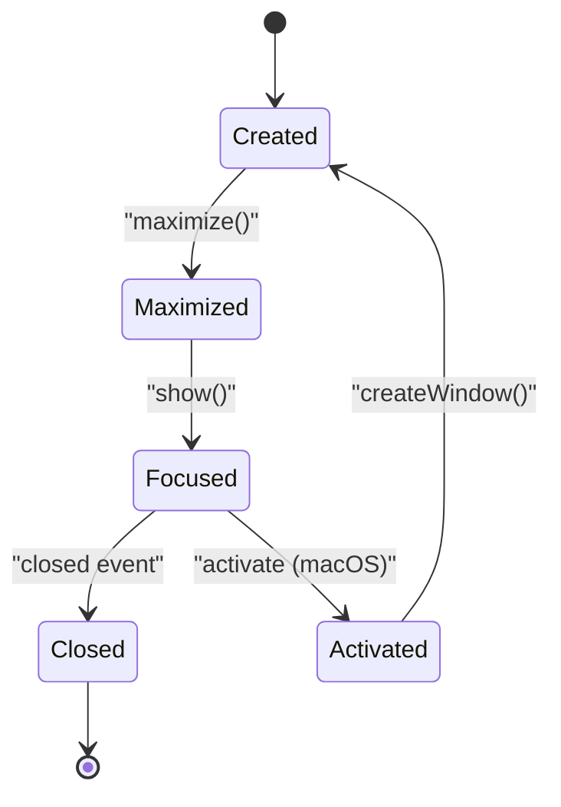
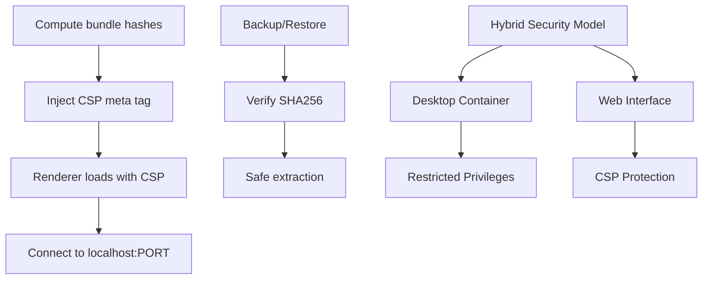
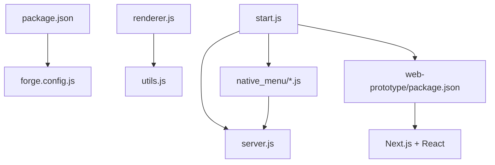

# Desktop Application Architecture

<cite>
**Referenced Files in This Document**
- [package.json](file://package.json)
- [forge.config.js](file://forge.config.js)
- [app.config.js](file://app.config.js)
- [start.js](file://start.js)
- [server.js](file://server.js)
- [installers/setupEvents.js](file://installers/setupEvents.js)
- [assets/js/native_menu/menu.js](file://assets/js/native_menu/menu.js)
- [assets/js/native_menu/menuController.js](file://assets/js/native_menu/menuController.js)
- [assets/js/utils.js](file://assets/js/utils.js)
- [renderer.js](file://renderer.js)
- [index.html](file://index.html)
- [web-prototype/package.json](file://web-prototype/package.json)
- [api/transactions.js](file://api/transactions.js)
</cite>

## Update Summary
**Changes Made**
- Updated architecture overview to reflect reduced desktop role in new web-based system
- Added documentation for web prototype and Next.js integration
- Enhanced security considerations for hybrid desktop/web environment
- Updated IPC communication patterns to reflect desktop-only responsibilities
- Revised system tray and platform-specific features section to reflect current implementation

## Table of Contents
1. [Introduction](#introduction)
2. [Project Structure](#project-structure)
3. [Core Components](#core-components)
4. [Architecture Overview](#architecture-overview)
5. [Detailed Component Analysis](#detailed-component-analysis)
6. [Dependency Analysis](#dependency-analysis)
7. [Performance Considerations](#performance-considerations)
8. [Troubleshooting Guide](#troubleshooting-guide)
9. [Conclusion](#conclusion)
10. [Appendices](#appendices)

## Introduction
This document describes the Electron desktop application architecture for the Point of Sale system, which now operates as a hybrid desktop wrapper around a web-based POS interface. The desktop layer provides native OS integration, system tray functionality, auto-updates, and backup/restore capabilities while delegating the core POS functionality to a web-based interface. It covers main process initialization, BrowserWindow creation, native menu system, Squirrel installer event handling, IPC communication patterns, window management, focus handling, multi-window coordination, and security considerations including CSP and privilege separation.

## Project Structure
The application follows a hybrid Electron layout where the desktop layer serves as a container for a web-based POS interface:
- Main process entry initializes the app, creates the main BrowserWindow, sets up the native menu, and handles Squirrel installer events
- Renderer process loads the web-based POS interface via index.html and initializes POS-related scripts
- A local Express server runs embedded within the app to serve API endpoints
- Native menu and controller modules encapsulate menu construction and actions such as backups, updates, and navigation
- Web prototype demonstrates the new Next.js-based POS interface



**Diagram sources**
- [start.js:1-107](file://start.js#L1-L107)
- [server.js:1-68](file://server.js#L1-L68)
- [installers/setupEvents.js:1-65](file://installers/setupEvents.js#L1-L65)
- [assets/js/native_menu/menu.js:1-153](file://assets/js/native_menu/menu.js#L1-L153)
- [assets/js/native_menu/menuController.js:1-346](file://assets/js/native_menu/menuController.js#L1-L346)
- [renderer.js:1-5](file://renderer.js#L1-L5)
- [index.html:1-884](file://index.html#L1-L884)
- [assets/js/utils.js:1-112](file://assets/js/utils.js#L1-L112)
- [web-prototype/package.json:1-34](file://web-prototype/package.json#L1-L34)

**Section sources**
- [package.json:1-147](file://package.json#L1-L147)
- [forge.config.js:1-71](file://forge.config.js#L1-L71)
- [start.js:1-107](file://start.js#L1-L107)
- [server.js:1-68](file://server.js#L1-L68)
- [installers/setupEvents.js:1-65](file://installers/setupEvents.js#L1-L65)
- [assets/js/native_menu/menu.js:1-153](file://assets/js/native_menu/menu.js#L1-L153)
- [assets/js/native_menu/menuController.js:1-346](file://assets/js/native_menu/menuController.js#L1-L346)
- [renderer.js:1-5](file://renderer.js#L1-L5)
- [index.html:1-884](file://index.html#L1-L884)
- [assets/js/utils.js:1-112](file://assets/js/utils.js#L1-L112)
- [web-prototype/package.json:1-34](file://web-prototype/package.json#L1-L34)

## Core Components
- Main process entry and lifecycle:
  - Initializes Electron Remote and renderer store, handles Squirrel startup, sets up native menu, creates BrowserWindow, registers IPC handlers, and enables context menu
- Embedded HTTP server:
  - Express server with rate limiting and CORS middleware, serving API routes under /api/
- Native menu system:
  - Platform-aware menu template with File/Edit/View/Help sections, actions wired to controller functions
- Backup and restore:
  - ZIP-based backup/restore with integrity verification and safe extraction
- Auto-updater:
  - Uses electron-updater with custom feed URL and user prompts
- Renderer initialization:
  - Loads jQuery and POS scripts, sets CSP dynamically
- Web interface integration:
  - Hybrid architecture where desktop container serves web-based POS interface

**Section sources**
- [start.js:1-107](file://start.js#L1-L107)
- [server.js:1-68](file://server.js#L1-L68)
- [assets/js/native_menu/menu.js:1-153](file://assets/js/native_menu/menu.js#L1-L153)
- [assets/js/native_menu/menuController.js:1-346](file://assets/js/native_menu/menuController.js#L1-L346)
- [assets/js/utils.js:1-112](file://assets/js/utils.js#L1-L112)
- [renderer.js:1-5](file://renderer.js#L1-L5)

## Architecture Overview
The system comprises a main process controlling the app lifecycle and UI, a renderer process rendering the web-based POS interface and interacting with APIs, and an embedded server providing backend services. The desktop layer acts as a hybrid container, providing native OS integration while the core POS functionality runs in the web interface. IPC bridges the main and renderer processes for OS-level actions and app control.

```mermaid
graph TB
MP["Main Process<br/>start.js"]
MW["BrowserWindow<br/>mainWindow"]
NM["Native Menu<br/>menu.js + menuController.js"]
SRV["Embedded Server<br/>server.js"]
IPC["IPC Channels<br/>ipcMain/ipcRenderer"]
RND["Renderer Process<br/>renderer.js + index.html"]
WEB["Web Interface<br/>Next.js + React"]
UTL["Security Utilities<br/>utils.js"]
MP --> MW
MP --> NM
MP --> SRV
MP --> WEB
MP <- --> IPC
RND --> IPC
RND --> UTL
NM --> SRV
WEB --> SRV
```

**Diagram sources**
- [start.js:1-107](file://start.js#L1-L107)
- [assets/js/native_menu/menu.js:1-153](file://assets/js/native_menu/menu.js#L1-L153)
- [assets/js/native_menu/menuController.js:1-346](file://assets/js/native_menu/menuController.js#L1-L346)
- [server.js:1-68](file://server.js#L1-L68)
- [renderer.js:1-5](file://renderer.js#L1-L5)
- [index.html:1-884](file://index.html#L1-L884)
- [assets/js/utils.js:1-112](file://assets/js/utils.js#L1-L112)

## Detailed Component Analysis

### Main Process Initialization and Lifecycle
- Initialization:
  - Electron Remote initialization and renderer store initialization
  - Squirrel event handling short-circuits the app if Squirrel events are detected
  - Embedded server module is required and native menu is built and set
- Window creation:
  - Creates a BrowserWindow sized to the primary display work area, maximized, and loads index.html
  - Enables Remote module for created windows
- IPC channels:
  - Handles quit/reload and app restart triggers
- Development:
  - Live reload enabled when not packaged



**Diagram sources**
- [start.js:1-107](file://start.js#L1-L107)
- [assets/js/native_menu/menu.js:1-153](file://assets/js/native_menu/menu.js#L1-L153)
- [server.js:1-68](file://server.js#L1-L68)

**Section sources**
- [start.js:1-107](file://start.js#L1-L107)

### BrowserWindow Creation and Web Preferences
- Window sizing uses the primary display work area
- Web preferences include nodeIntegration and disable Remote module, with contextIsolation disabled
- Focus and multi-window behavior:
  - On activate, a new window is created if none exists
  - On window-all-closed, quits except on macOS



**Diagram sources**
- [start.js:21-45](file://start.js#L21-L45)

**Section sources**
- [start.js:21-65](file://start.js#L21-L65)

### Native Menu System Implementation
- Template composition:
  - Mac-specific About/Services/HIDE sections
  - File menu with New (Product/Category/Customer), Backup/Restore, Logout, Close/Quit
  - Edit menu with undo/redo/cut/copy/paste and platform-specific speech options
  - View menu with navigation targets (POS/Transactions/Products/Settings), Refresh, DevTools (non-packaged), zoom, fullscreen
  - Help menu with Documentation, Update check, About panel
- Controller actions:
  - About panel configuration and display
  - Update checks against a generic provider URL with user prompts and download/install
  - Backup/restore dialogs and operations with integrity verification and safe extraction
  - Click routing to renderer via IPC



**Diagram sources**
- [assets/js/native_menu/menu.js:1-153](file://assets/js/native_menu/menu.js#L1-L153)
- [assets/js/native_menu/menuController.js:1-346](file://assets/js/native_menu/menuController.js#L1-L346)

**Section sources**
- [assets/js/native_menu/menu.js:1-153](file://assets/js/native_menu/menu.js#L1-L153)
- [assets/js/native_menu/menuController.js:1-346](file://assets/js/native_menu/menuController.js#L1-L346)

### Squirrel Installer Event Handling
- Detects Squirrel events via argv and spawns Update.exe with appropriate arguments
- Creates/removes shortcuts on install/updated/uninstall
- Quits after spawning the updater or marks obsolete



**Diagram sources**
- [installers/setupEvents.js:1-65](file://installers/setupEvents.js#L1-L65)

**Section sources**
- [installers/setupEvents.js:1-65](file://installers/setupEvents.js#L1-L65)

### System Tray Integration
- Implemented with basic quit functionality
- Provides minimal system tray presence for desktop app lifecycle management
- Integrated with main process window management

**Section sources**
- [start.js:87-97](file://start.js#L87-L97)

### Platform-Specific Features
- Menu roles and platform awareness:
  - Mac-specific roles (About, Services, Hide, Quit)
  - Close vs Quit depending on platform
- Development vs production:
  - DevTools toggle visible only when not packaged
  - Live reload enabled outside packaged builds

**Section sources**
- [assets/js/native_menu/menu.js:15-32](file://assets/js/native_menu/menu.js#L15-L32)
- [assets/js/native_menu/menu.js:115-117](file://assets/js/native_menu/menu.js#L115-L117)
- [start.js:100-104](file://start.js#L100-L104)

### IPC Communication Patterns
- Channels:
  - Renderer sends clicks to main via webContents IPC channel
  - Main listens for app-quit, app-reload, restart-app
- Usage:
  - Menu controller sends click-element events to renderer for UI actions
  - Main process reloads the window on demand
- Desktop-only responsibilities:
  - System tray operations
  - Native menu actions
  - Auto-update triggers
  - Backup/restore operations



**Diagram sources**
- [assets/js/native_menu/menuController.js:331-333](file://assets/js/native_menu/menuController.js#L331-L333)
- [start.js:75-85](file://start.js#L75-L85)

**Section sources**
- [assets/js/native_menu/menuController.js:331-333](file://assets/js/native_menu/menuController.js#L331-L333)
- [start.js:75-85](file://start.js#L75-L85)

### Window Management, Focus Handling, and Multi-Window Coordination
- Window creation and maximize on launch
- Focus behavior on macOS via activate event
- Multi-window coordination via IPC for centralized control



**Diagram sources**
- [start.js:21-45](file://start.js#L21-L45)
- [start.js:61-65](file://start.js#L61-L65)

**Section sources**
- [start.js:21-45](file://start.js#L21-L45)
- [start.js:61-65](file://start.js#L61-L65)

### Security Considerations
- Content Security Policy (CSP):
  - Dynamically computed hashes for bundled JS/CSS injected as a meta tag
  - Connects to localhost on the server port
- Privilege separation:
  - nodeIntegration enabled with contextIsolation disabled in main process; renderer uses CSP and DOMPurify for sanitization
- File integrity:
  - Backup/restore validates SHA256 and prevents directory traversal
- Hybrid security model:
  - Desktop container with restricted privileges
  - Web interface with CSP protection
  - Secure IPC communication between layers



**Diagram sources**
- [assets/js/utils.js:91-99](file://assets/js/utils.js#L91-L99)
- [start.js:29-33](file://start.js#L29-L33)
- [assets/js/native_menu/menuController.js:142-184](file://assets/js/native_menu/menuController.js#L142-L184)
- [assets/js/native_menu/menuController.js:195-251](file://assets/js/native_menu/menuController.js#L195-L251)

**Section sources**
- [assets/js/utils.js:91-99](file://assets/js/utils.js#L91-L99)
- [start.js:29-33](file://start.js#L29-L33)
- [assets/js/native_menu/menuController.js:142-184](file://assets/js/native_menu/menuController.js#L142-L184)
- [assets/js/native_menu/menuController.js:195-251](file://assets/js/native_menu/menuController.js#L195-L251)

## Dependency Analysis
- Build and packaging:
  - Electron Forge makers for Windows (Squirrel/WIX), Linux (DEB/RPM), macOS (DMG)
- Runtime dependencies:
  - Express server, rate limiting, body parser, socket.io, bcrypt, NeDB, archiver, unzipper, and others
- Main-to-renderer coupling:
  - Renderer depends on jQuery and POS scripts; main process exposes IPC channels and native menu actions
- Web interface dependencies:
  - Next.js, React, TypeScript for the new web-based POS interface



**Diagram sources**
- [package.json:1-147](file://package.json#L1-L147)
- [forge.config.js:1-71](file://forge.config.js#L1-L71)
- [start.js:1-107](file://start.js#L1-L107)
- [server.js:1-68](file://server.js#L1-L68)
- [assets/js/native_menu/menu.js:1-153](file://assets/js/native_menu/menu.js#L1-L153)
- [assets/js/native_menu/menuController.js:1-346](file://assets/js/native_menu/menuController.js#L1-L346)
- [renderer.js:1-5](file://renderer.js#L1-L5)
- [assets/js/utils.js:1-112](file://assets/js/utils.js#L1-L112)
- [web-prototype/package.json:1-34](file://web-prototype/package.json#L1-L34)

**Section sources**
- [package.json:1-147](file://package.json#L1-L147)
- [forge.config.js:1-71](file://forge.config.js#L1-L71)
- [start.js:1-107](file://start.js#L1-L107)
- [server.js:1-68](file://server.js#L1-L68)
- [assets/js/native_menu/menu.js:1-153](file://assets/js/native_menu/menu.js#L1-L153)
- [assets/js/native_menu/menuController.js:1-346](file://assets/js/native_menu/menuController.js#L1-L346)
- [renderer.js:1-5](file://renderer.js#L1-L5)
- [assets/js/utils.js:1-112](file://assets/js/utils.js#L1-L112)
- [web-prototype/package.json:1-34](file://web-prototype/package.json#L1-L34)

## Performance Considerations
- Packaging:
  - ASAR enabled for builds to improve load times and protect resources
- Server:
  - Rate limiting reduces API abuse; consider caching for static assets
- Renderer:
  - Minimize DOM manipulation; batch updates and leverage virtualization for large lists
- Hybrid architecture benefits:
  - Web interface optimized for modern browsers
  - Desktop container provides native performance for system integration

## Troubleshooting Guide
- Squirrel installer issues:
  - Verify Update.exe path and shortcut creation/removal commands
- Auto-update failures:
  - Confirm feed URL and network connectivity; handle retry logic and error dialogs
- Backup/restore errors:
  - Ensure ZIP integrity and directory traversal prevention; validate paths and permissions
- IPC communication:
  - Ensure channels are registered in main and handled in renderer; verify event names
- Web interface integration:
  - Verify CSP configuration allows web interface resources
  - Check API connectivity between desktop container and web interface

**Section sources**
- [installers/setupEvents.js:1-65](file://installers/setupEvents.js#L1-L65)
- [assets/js/native_menu/menuController.js:52-132](file://assets/js/native_menu/menuController.js#L52-L132)
- [assets/js/native_menu/menuController.js:195-251](file://assets/js/native_menu/menuController.js#L195-L251)
- [start.js:75-85](file://start.js#L75-L85)

## Conclusion
The application employs a hybrid desktop architecture where the Electron container provides native OS integration while the core POS functionality runs in a web-based interface. The desktop layer maintains responsibility for system tray integration, native menu system, auto-updates, backup/restore operations, and IPC communication. Security is addressed through CSP and integrity checks, while Squirrel integration ensures smooth installation and updates. The architecture supports multi-window coordination and platform-specific UX while maintaining a clean separation between desktop container and web interface.

## Appendices
- Configuration references:
  - App configuration constants for update server and copyright year
  - Forge makers and publishers for cross-platform distribution
  - Web prototype configuration for Next.js integration

**Section sources**
- [app.config.js:1-8](file://app.config.js#L1-L8)
- [forge.config.js:21-51](file://forge.config.js#L21-L51)
- [web-prototype/package.json:1-34](file://web-prototype/package.json#L1-L34)