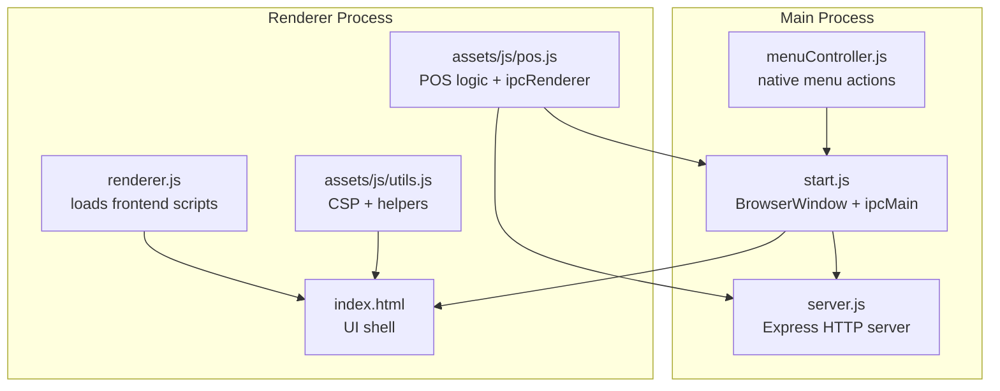
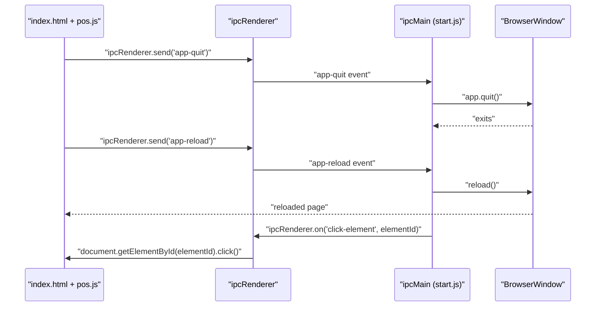
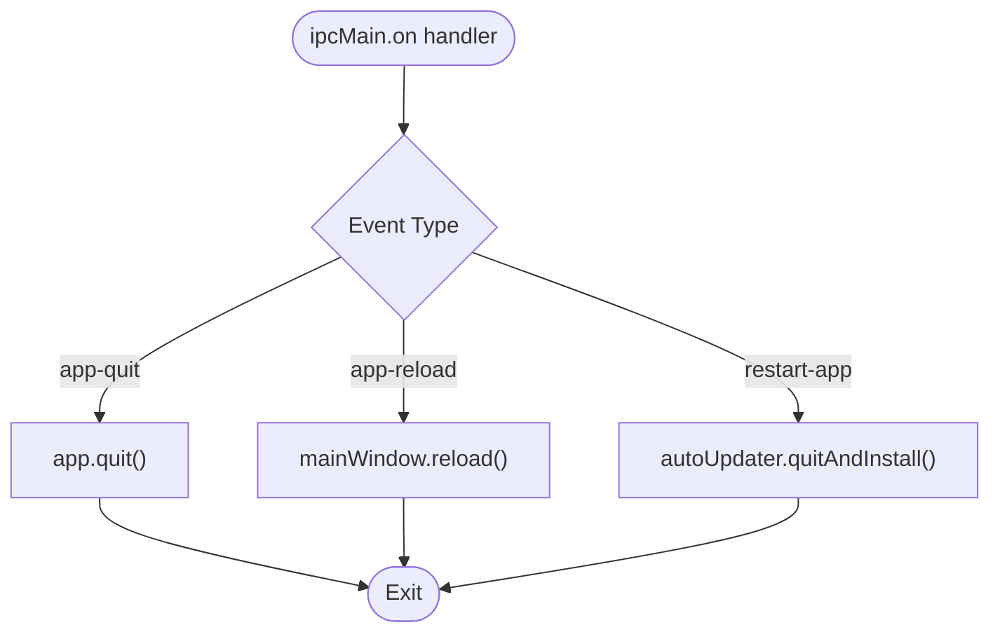
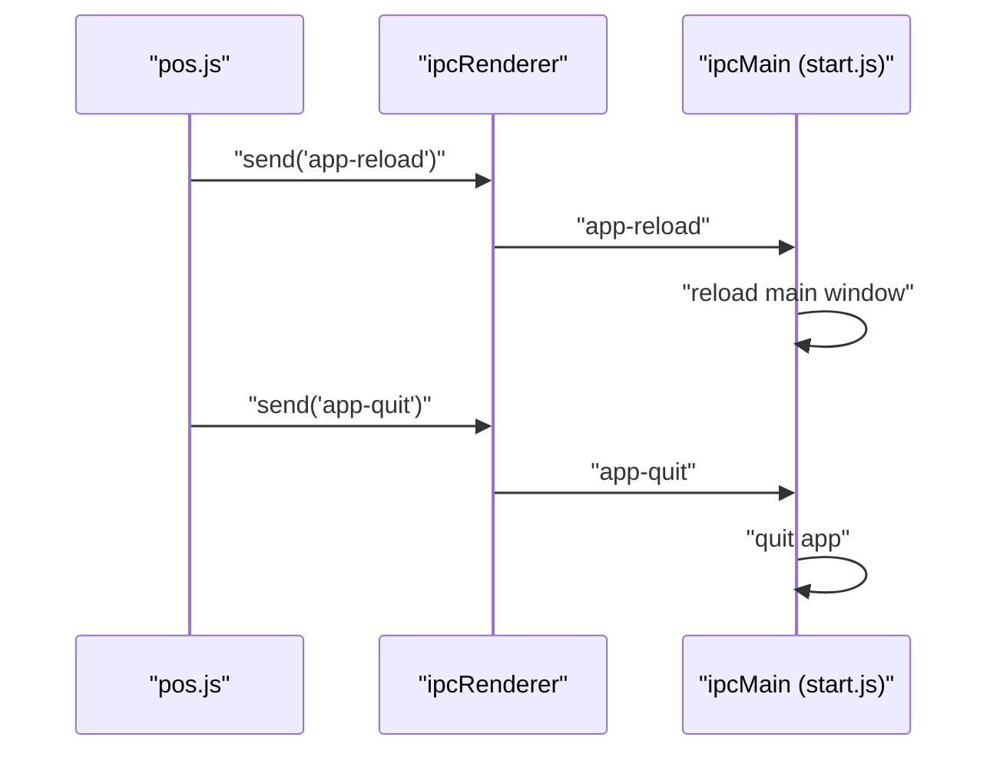
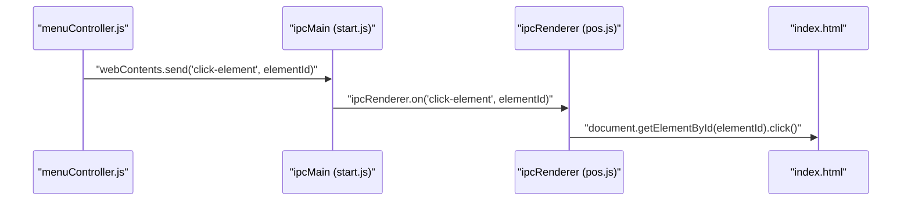
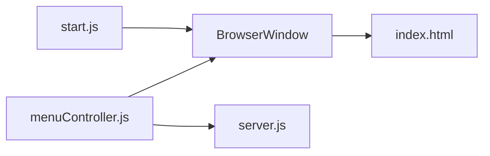
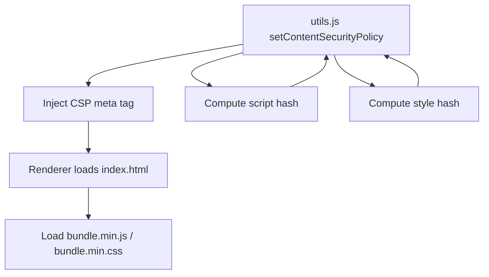
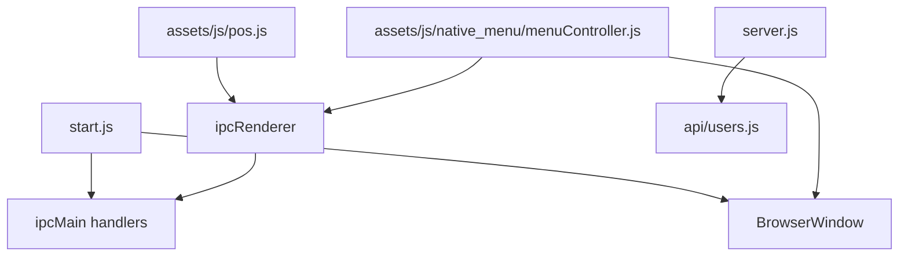

# IPC Communication

<cite>
**Referenced Files in This Document**
- [start.js](file://start.js)
- [renderer.js](file://renderer.js)
- [index.html](file://index.html)
- [pos.js](file://assets/js/pos.js)
- [menu.js](file://assets/js/native_menu/menu.js)
- [menuController.js](file://assets/js/native_menu/menuController.js)
- [server.js](file://server.js)
- [users.js](file://api/users.js)
- [utils.js](file://assets/js/utils.js)
- [package.json](file://package.json)
- [setupEvents.js](file://installers/setupEvents.js)
</cite>

## Table of Contents
1. [Introduction](#introduction)
2. [Project Structure](#project-structure)
3. [Core Components](#core-components)
4. [Architecture Overview](#architecture-overview)
5. [Detailed Component Analysis](#detailed-component-analysis)
6. [Dependency Analysis](#dependency-analysis)
7. [Performance Considerations](#performance-considerations)
8. [Troubleshooting Guide](#troubleshooting-guide)
9. [Conclusion](#conclusion)

## Introduction
This document explains Inter-Process Communication (IPC) between the Electron main process and renderer processes in the PPOS application. It focuses on the ipcMain event handlers for application control, the bidirectional communication patterns used for window management and system integration, and the security implications of IPC. It also covers data serialization, common IPC use cases in desktop applications, and practical debugging techniques.

## Project Structure
The application follows a classic Electron layout:
- Main process bootstrapped via start.js initializes the BrowserWindow and registers ipcMain handlers.
- Renderer loads index.html and scripts via renderer.js.
- Frontend logic resides in assets/js/*.js, including pos.js for POS logic and menuController.js for native menu actions.
- A local Express server runs alongside the main process to serve API endpoints.

**Diagram sources**
- [start.js:1-106](file://start.js#L1-L106)
- [renderer.js:1-5](file://renderer.js#L1-L5)
- [index.html:1-884](file://index.html#L1-L884)
- [pos.js:1-2538](file://assets/js/pos.js#L1-L2538)
- [utils.js:1-112](file://assets/js/utils.js#L1-L112)
- [menuController.js:1-346](file://assets/js/native_menu/menuController.js#L1-L346)
- [server.js:1-68](file://server.js#L1-L68)

**Section sources**
- [start.js:1-106](file://start.js#L1-L106)
- [renderer.js:1-5](file://renderer.js#L1-L5)
- [index.html:1-884](file://index.html#L1-L884)
- [pos.js:1-2538](file://assets/js/pos.js#L1-L2538)
- [utils.js:1-112](file://assets/js/utils.js#L1-L112)
- [menuController.js:1-346](file://assets/js/native_menu/menuController.js#L1-L346)
- [server.js:1-68](file://server.js#L1-L68)

## Core Components
- ipcMain handlers in the main process:
  - app-quit: terminates the app.
  - app-reload: reloads the main BrowserWindow.
  - restart-app: triggers auto-update installation.
- ipcRenderer usage in the renderer:
  - Sending app-quit and app-reload to the main process.
  - Listening for click-element to simulate UI interactions from the main process.
- Native menu controller:
  - Sends click-element events to the renderer for UI actions.
  - Manages backup/restore and server restart flows.

**Section sources**
- [start.js:75-85](file://start.js#L75-L85)
- [pos.js:2516-2538](file://assets/js/pos.js#L2516-L2538)
- [menuController.js:331-333](file://assets/js/native_menu/menuController.js#L331-L333)

## Architecture Overview
The IPC architecture centers on two-way communication:
- Renderer-to-main: UI actions trigger ipcRenderer.send to control the app lifecycle and request reloads.
- Main-to-renderer: Native menu actions trigger ipcMain.on handlers that send click-element events to the renderer to simulate clicks.

**Diagram sources**
- [start.js:75-85](file://start.js#L75-L85)
- [pos.js:2516-2538](file://assets/js/pos.js#L2516-L2538)
- [menuController.js:331-333](file://assets/js/native_menu/menuController.js#L331-L333)

## Detailed Component Analysis

### Application Control Handlers (ipcMain)
- app-quit: Immediately quits the app.
- app-reload: Reloads the main window content.
- restart-app: Invokes autoUpdater.quitAndInstall to apply updates.

**Diagram sources**
- [start.js:75-85](file://start.js#L75-L85)

**Section sources**
- [start.js:75-85](file://start.js#L75-L85)

### Renderer-to-Main Communication Patterns
- Login flow triggers app-reload after successful authentication.
- Quit confirmation sends app-quit to main.

**Diagram sources**
- [pos.js:2500-2504](file://assets/js/pos.js#L2500-L2504)
- [pos.js:2531](file://assets/js/pos.js#L2531)
- [start.js:75-77](file://start.js#L75-L77)

**Section sources**
- [pos.js:2500-2504](file://assets/js/pos.js#L2500-L2504)
- [pos.js:2531](file://assets/js/pos.js#L2531)
- [start.js:75-77](file://start.js#L75-L77)

### Main-to-Renderer Communication Pattern
- Native menu actions send click-element events to the renderer to trigger UI actions programmatically.

**Diagram sources**
- [menuController.js:331-333](file://assets/js/native_menu/menuController.js#L331-L333)
- [pos.js:2536-2538](file://assets/js/pos.js#L2536-L2538)

**Section sources**
- [menuController.js:331-333](file://assets/js/native_menu/menuController.js#L331-L333)
- [pos.js:2536-2538](file://assets/js/pos.js#L2536-L2538)

### Window Management and System Integration
- BrowserWindow creation and reload are orchestrated from the main process.
- Native menu integrates with the main process to trigger reloads and backups.

**Diagram sources**
- [start.js:21-45](file://start.js#L21-L45)
- [menuController.js:317-320](file://assets/js/native_menu/menuController.js#L317-L320)
- [server.js:54-66](file://server.js#L54-L66)

**Section sources**
- [start.js:21-45](file://start.js#L21-L45)
- [menuController.js:317-320](file://assets/js/native_menu/menuController.js#L317-L320)
- [server.js:54-66](file://server.js#L54-L66)

### Security Implications and Best Practices
- Content Security Policy (CSP) is set dynamically to restrict script/style sources and enforce hashes for bundled assets.
- Renderer uses ipcRenderer to communicate with main; avoid exposing sensitive Node.js APIs in the renderer.
- Use contextBridge and preload patterns for safer inter-process communication in production-grade apps.

**Diagram sources**
- [utils.js:91-99](file://assets/js/utils.js#L91-L99)

**Section sources**
- [utils.js:91-99](file://assets/js/utils.js#L91-L99)

### Data Serialization and Bidirectional Patterns
- Events carry minimal payload (often empty or identifiers).
- The click-element pattern demonstrates structured data passing to trigger UI actions.

**Section sources**
- [pos.js:2536-2538](file://assets/js/pos.js#L2536-L2538)
- [menuController.js:331-333](file://assets/js/native_menu/menuController.js#L331-L333)

### Common IPC Use Cases
- Lifecycle control: quit, reload, restart.
- UI orchestration: programmatic clicks from native menu.
- Local server integration: backup/restore and server restarts.

**Section sources**
- [menuController.js:317-320](file://assets/js/native_menu/menuController.js#L317-L320)
- [server.js:54-66](file://server.js#L54-L66)

## Dependency Analysis
High-level dependencies among IPC-related modules:

**Diagram sources**
- [start.js:1-106](file://start.js#L1-L106)
- [pos.js:1-2538](file://assets/js/pos.js#L1-L2538)
- [menuController.js:1-346](file://assets/js/native_menu/menuController.js#L1-L346)
- [server.js:1-68](file://server.js#L1-L68)
- [users.js:1-311](file://api/users.js#L1-L311)

**Section sources**
- [start.js:1-106](file://start.js#L1-L106)
- [pos.js:1-2538](file://assets/js/pos.js#L1-L2538)
- [menuController.js:1-346](file://assets/js/native_menu/menuController.js#L1-L346)
- [server.js:1-68](file://server.js#L1-L68)
- [users.js:1-311](file://api/users.js#L1-L311)

## Performance Considerations
- Keep IPC payloads small to minimize overhead.
- Debounce frequent events (e.g., reloads) to avoid thrashing the renderer.
- Prefer batched UI updates in the renderer after receiving main-process signals.

## Troubleshooting Guide
- Verify event registration:
  - Ensure ipcMain.on handlers are registered before sending events.
  - Confirm the event names match exactly (case-sensitive).
- Debugging steps:
  - Add logging in ipcMain handlers and ipcRenderer listeners.
  - Use DevTools in the renderer to inspect event traffic.
  - Validate CSP does not block legitimate resources or inline scripts.
- Common issues:
  - Missing mainWindow reference prevents reloads.
  - Auto-updater requires proper feed configuration and permissions.
  - Native menu actions rely on webContents.send; ensure the main process enables remote module per window.

**Section sources**
- [start.js:75-85](file://start.js#L75-L85)
- [pos.js:2516-2538](file://assets/js/pos.js#L2516-L2538)
- [utils.js:91-99](file://assets/js/utils.js#L91-L99)

## Conclusion
The PPOS application implements straightforward, focused IPC patterns for application lifecycle control and UI orchestration. The main process handles app-quit, app-reload, and restart-app events, while the renderer triggers these actions and listens for programmatic UI interactions. Security is addressed via CSP, and the native menu integrates with the main process to manage reloads and backups. For production, consider adopting contextBridge/preload patterns and stricter input validation to further harden IPC communications.