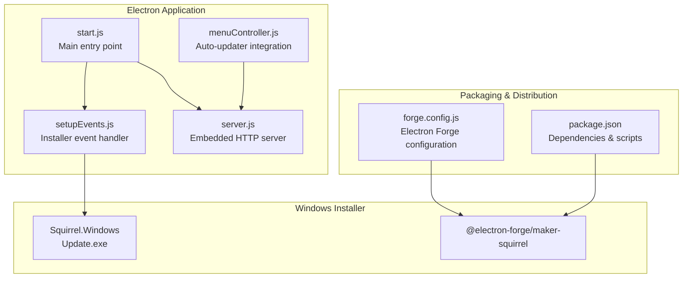
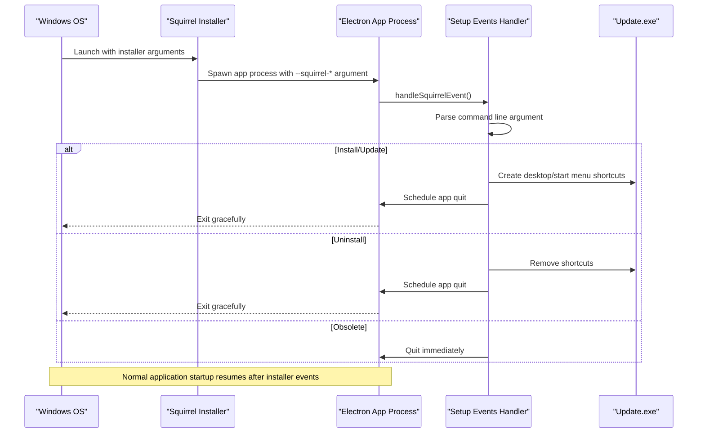
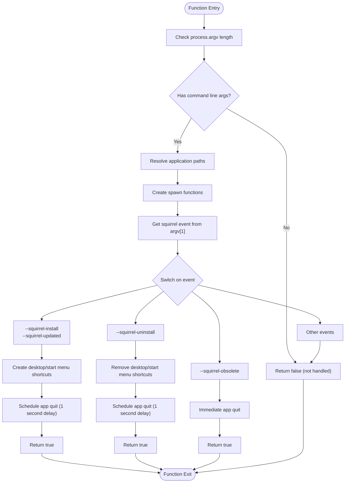
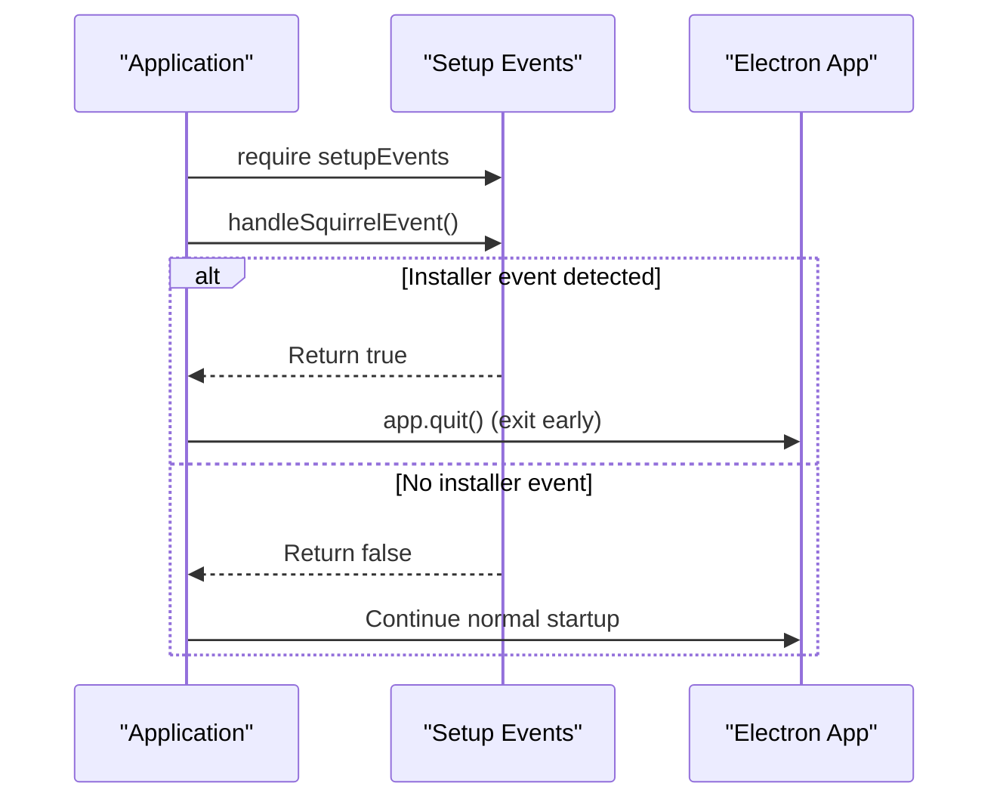
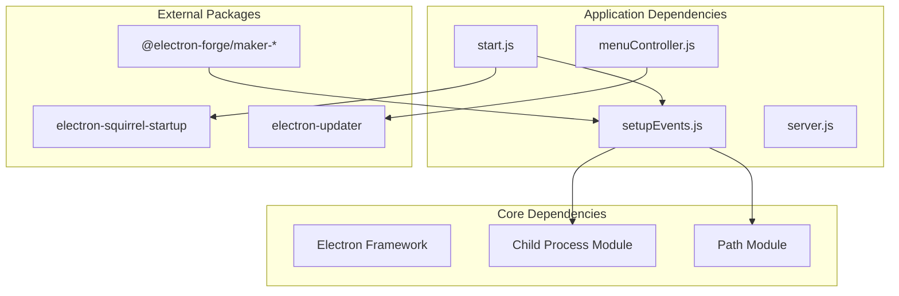

# Installer Event Handling

<cite>
**Referenced Files in This Document**
- [setupEvents.js](file://installers/setupEvents.js)
- [start.js](file://start.js)
- [forge.config.js](file://forge.config.js)
- [package.json](file://package.json)
- [server.js](file://server.js)
- [menuController.js](file://assets/js/native_menu/menuController.js)
- [TECH_STACK.md](file://docs/TECH_STACK.md)
- [README.md](file://README.md)
</cite>

## Table of Contents
1. [Introduction](#introduction)
2. [Project Structure](#project-structure)
3. [Core Components](#core-components)
4. [Architecture Overview](#architecture-overview)
5. [Detailed Component Analysis](#detailed-component-analysis)
6. [Dependency Analysis](#dependency-analysis)
7. [Performance Considerations](#performance-considerations)
8. [Troubleshooting Guide](#troubleshooting-guide)
9. [Conclusion](#conclusion)

## Introduction
This document provides comprehensive documentation for the Squirrel installer event handling system and Windows-specific installation features in the PharmaSpot Point of Sale application. It focuses on the `handleSquirrelEvent()` function, its integration with Electron's application lifecycle, startup prevention logic, and the event-driven installer system including `--squirrel-install`, `--squirrel-updated`, and related commands. Cross-platform considerations and alternative installation handling for non-Windows platforms are also addressed.

## Project Structure
The installer event handling system is implemented through a dedicated module that integrates with the main Electron application entry point. The project uses Electron Forge for cross-platform packaging, with Squirrel.Windows as the primary Windows installer maker.

**Diagram sources**
- [start.js:1-107](file://start.js#L1-L107)
- [setupEvents.js:1-65](file://installers/setupEvents.js#L1-L65)
- [forge.config.js:25-28](file://forge.config.js#L25-L28)
- [package.json:28](file://package.json#L28)

**Section sources**
- [start.js:1-107](file://start.js#L1-L107)
- [setupEvents.js:1-65](file://installers/setupEvents.js#L1-L65)
- [forge.config.js:1-71](file://forge.config.js#L1-L71)
- [package.json:1-147](file://package.json#L1-L147)

## Core Components
The installer event handling system consists of three primary components:

### 1. Installer Event Handler Module
The `setupEvents.js` module provides centralized handling for Squirrel installer events. It manages Windows-specific installation operations and integrates with the Electron application lifecycle.

### 2. Main Application Entry Point
The `start.js` file serves as the primary application entry point, orchestrating the initialization sequence and coordinating with the installer event handler.

### 3. Packaging Configuration
The `forge.config.js` file defines the build configuration, including Windows-specific makers and cross-platform distribution targets.

**Section sources**
- [setupEvents.js:4-65](file://installers/setupEvents.js#L4-L65)
- [start.js:3-6](file://start.js#L3-L6)
- [forge.config.js:21-38](file://forge.config.js#L21-L38)

## Architecture Overview
The installer event handling system follows a coordinated flow between the Electron main process and the Squirrel installer. The architecture ensures proper event delegation and prevents application conflicts during installation operations.

**Diagram sources**
- [setupEvents.js:31-63](file://installers/setupEvents.js#L31-L63)
- [start.js:18-19](file://start.js#L18-L19)

## Detailed Component Analysis

### handleSquirrelEvent() Function Analysis
The `handleSquirrelEvent()` function serves as the central coordinator for all Squirrel installer operations. It implements a sophisticated event-driven architecture that handles multiple installation scenarios while maintaining application stability.

#### Function Signature and Parameters
The function accepts no parameters and operates on the global `process.argv` array to determine the specific installer event being processed.

#### Event Processing Logic
The function implements a switch statement that handles four distinct Squirrel events:

**Diagram sources**
- [setupEvents.js:5-64](file://installers/setupEvents.js#L5-L64)

#### Path Resolution and Command Execution
The function implements robust path resolution for Windows-specific installer operations:

- **Application Folder Detection**: Resolves the application directory using `path.resolve(process.execPath, '..')`
- **Root Atom Folder**: Determines the parent directory containing `Update.exe`
- **Update.exe Location**: Locates the Squirrel installer executable using `path.resolve(path.join(rootAtomFolder, 'Update.exe'))`
- **Executable Name Extraction**: Uses `path.basename(process.execPath)` to get the application executable name

#### Spawn Function Implementation
The spawn function provides resilient process creation with error handling:

- **Detached Process Creation**: Uses `{detached: true}` to prevent child process termination when the parent exits
- **Error Handling**: Implements try-catch blocks to handle spawn failures gracefully
- **Process Management**: Returns spawned process instances for asynchronous operation

**Section sources**
- [setupEvents.js:13-29](file://installers/setupEvents.js#L13-L29)
- [setupEvents.js:31-63](file://installers/setupEvents.js#L31-L63)

### Electron Application Lifecycle Integration
The main application entry point coordinates installer event handling with the standard Electron application lifecycle through several key mechanisms:

#### Early Event Handling
The application checks for installer events before establishing normal application operations:

**Diagram sources**
- [start.js:3-6](file://start.js#L3-L6)

#### Startup Prevention Logic
The application implements dual protection against multiple simultaneous launches during installer operations:

1. **Installer Event Detection**: Checks `setupEvents.handleSquirrelEvent()` result
2. **Squirrel Startup Module**: Uses `electron-squirrel-startup` to detect and prevent duplicate launches

**Section sources**
- [start.js:4-6](file://start.js#L4-L6)
- [start.js:18-19](file://start.js#L18-L19)

### Windows-Specific Installation Features
The installer system provides comprehensive Windows integration through Squirrel.Windows capabilities:

#### Shortcut Management
The system automatically manages desktop and start menu shortcuts during installation and uninstallation:

- **Installation**: Creates shortcuts using `spawnUpdate(['--createShortcut', exeName])`
- **Uninstallation**: Removes previously created shortcuts using `spawnUpdate(['--removeShortcut', exeName])`
- **Timing Control**: Implements delayed application termination to ensure shortcut operations complete

#### Registry and System Integration
While the current implementation focuses on shortcut management, the system is structured to support additional Windows integration points:

- **PATH Environment Variables**: Commented support for adding applications to system PATH
- **Registry Operations**: Placeholder for registry modifications for file associations
- **Explorer Context Menus**: Framework for adding context menu entries

**Section sources**
- [setupEvents.js:40-51](file://installers/setupEvents.js#L40-L51)

### Cross-Platform Considerations
The application maintains cross-platform compatibility while providing Windows-specific installer features:

#### Platform-Aware Packaging
Electron Forge configuration includes platform-specific makers:

- **Windows**: Squirrel.Windows (`@electron-forge/maker-squirrel`) and WiX (`@electron-forge/maker-wix`)
- **Linux**: Debian (`@electron-forge/maker-deb`) and Red Hat (`@electron-forge/maker-rpm`) packages
- **macOS**: DMG (`@electron-forge/maker-dmg`) format

#### Conditional Dependencies
The application structure accommodates platform differences through conditional logic and separate packaging configurations.

**Section sources**
- [forge.config.js:25-36](file://forge.config.js#L25-L36)
- [package.json:28](file://package.json#L28)

### Alternative Installation Handling for Non-Windows Platforms
For non-Windows platforms, the installer event system gracefully degrades:

#### Linux and macOS Behavior
- **No Squirrel Events**: These platforms don't trigger Squirrel installer events
- **Normal Application Flow**: The `handleSquirrelEvent()` function returns `false`
- **Standard Startup**: Application proceeds with normal initialization

#### Cross-Platform Packaging Strategy
The packaging configuration ensures consistent behavior across platforms while leveraging platform-specific installer technologies.

**Section sources**
- [setupEvents.js:6](file://installers/setupEvents.js#L6)
- [forge.config.js:30-36](file://forge.config.js#L30-L36)

## Dependency Analysis
The installer event handling system has minimal external dependencies while maintaining robust functionality:

**Diagram sources**
- [setupEvents.js:10-11](file://installers/setupEvents.js#L10-L11)
- [start.js:3](file://start.js#L3)
- [package.json:28](file://package.json#L28)

### Internal Dependencies
The system demonstrates excellent modularity with clear separation of concerns:

- **setupEvents.js**: Pure installer event handling logic
- **start.js**: Application orchestration and lifecycle management
- **server.js**: Embedded HTTP server functionality
- **menuController.js**: Auto-updater integration and UI controls

### External Dependencies
The application relies on minimal external packages for installer functionality:

- **electron-squirrel-startup**: Prevents duplicate application launches during installer operations
- **electron-updater**: Provides automatic update capabilities
- **@electron-forge/maker-squirrel**: Windows installer generation

**Section sources**
- [package.json:28](file://package.json#L28)
- [start.js:19](file://start.js#L19)
- [menuController.js:9](file://menuController.js#L9)

## Performance Considerations
The installer event handling system is designed for optimal performance and reliability:

### Asynchronous Process Management
- **Detached Processes**: Installer operations run as detached child processes to prevent blocking the main application thread
- **Non-blocking Operations**: Shortcut creation/removal occurs asynchronously without delaying application startup
- **Graceful Degradation**: Error handling ensures installer failures don't impact application stability

### Memory and Resource Management
- **Minimal Memory Footprint**: The installer handler uses lightweight path resolution and process spawning
- **Efficient Path Resolution**: Single pass path calculations reduce computational overhead
- **Resource Cleanup**: Proper process termination prevents resource leaks

### Startup Optimization
- **Early Exit Strategy**: Successful installer events trigger immediate application termination
- **Conditional Loading**: Installer logic only executes when necessary
- **Lazy Initialization**: Server and UI components load only after installer operations complete

## Troubleshooting Guide

### Common Installer Issues

#### Issue: Installer Events Not Triggering
**Symptoms**: Installation/updates don't create shortcuts or modify system settings
**Causes**:
- Missing Squirrel installer arguments
- Incorrect executable path resolution
- Permission issues with system directories

**Solutions**:
1. Verify Squirrel installer arguments are present in `process.argv`
2. Check application path resolution logic
3. Ensure sufficient permissions for system directories

#### Issue: Application Crashes During Installation
**Symptoms**: Application terminates unexpectedly during installer operations
**Causes**:
- Spawn process failures
- Path resolution errors
- Missing Update.exe executable

**Solutions**:
1. Implement proper error handling for spawn operations
2. Validate path resolution before process execution
3. Verify Update.exe exists in the expected location

#### Issue: Duplicate Application Launches
**Symptoms**: Multiple application instances running simultaneously during installer operations
**Causes**:
- Missing startup prevention logic
- Incomplete event handling

**Solutions**:
1. Ensure `handleSquirrelEvent()` is called before normal application startup
2. Implement `electron-squirrel-startup` detection
3. Add proper application exit after successful installer operations

### Debugging Strategies

#### Logging and Monitoring
The system includes built-in error handling for spawn operations, allowing for graceful failure detection and logging.

#### Testing Installation Scenarios
To test installer functionality, developers can simulate Squirrel events by launching the application with specific command-line arguments:

1. **Installation Test**: Launch with `--squirrel-install` argument
2. **Update Test**: Launch with `--squirrel-updated` argument  
3. **Uninstallation Test**: Launch with `--squirrel-uninstall` argument
4. **Obsolete Test**: Launch with `--squirrel-obsolete` argument

#### Cross-Platform Testing
For non-Windows platforms, verify that:
- Installer events return `false` without errors
- Application starts normally without installer interference
- Packaging builds succeed for target platforms

**Section sources**
- [setupEvents.js:17-24](file://installers/setupEvents.js#L17-L24)
- [start.js:18-19](file://start.js#L18-L19)

## Conclusion
The Squirrel installer event handling system in PharmaSpot provides a robust, cross-platform solution for Windows application installation and updates. The `handleSquirrelEvent()` function effectively coordinates with Electron's application lifecycle while maintaining system stability and user experience. The architecture demonstrates excellent separation of concerns, with minimal dependencies and comprehensive error handling.

Key strengths of the implementation include:
- **Event-Driven Architecture**: Clean separation between installer operations and normal application flow
- **Cross-Platform Compatibility**: Graceful degradation on non-Windows platforms
- **Robust Error Handling**: Comprehensive error management for installer operations
- **Performance Optimization**: Asynchronous process management and early application termination

The system successfully balances Windows-specific installer functionality with broader application architecture, providing a foundation for reliable software distribution across multiple platforms.