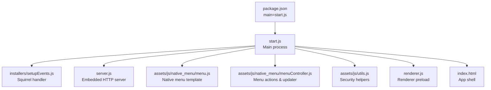
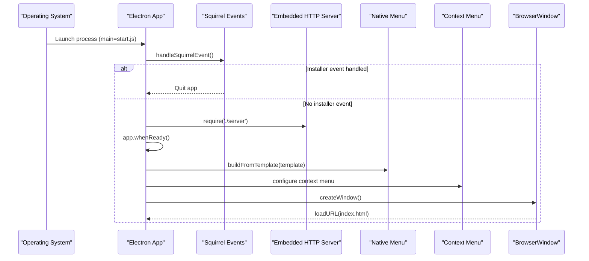
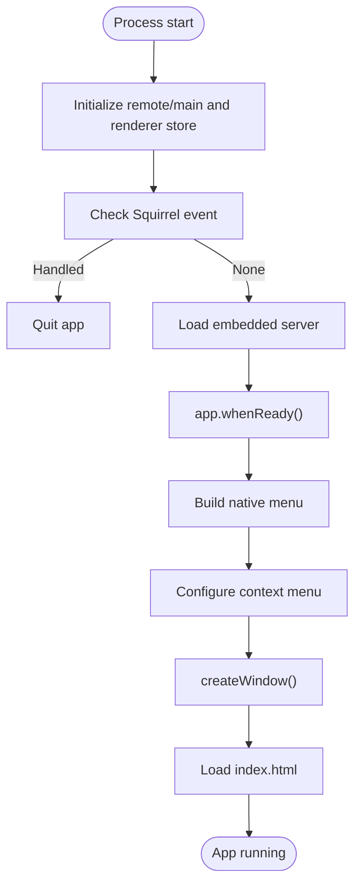
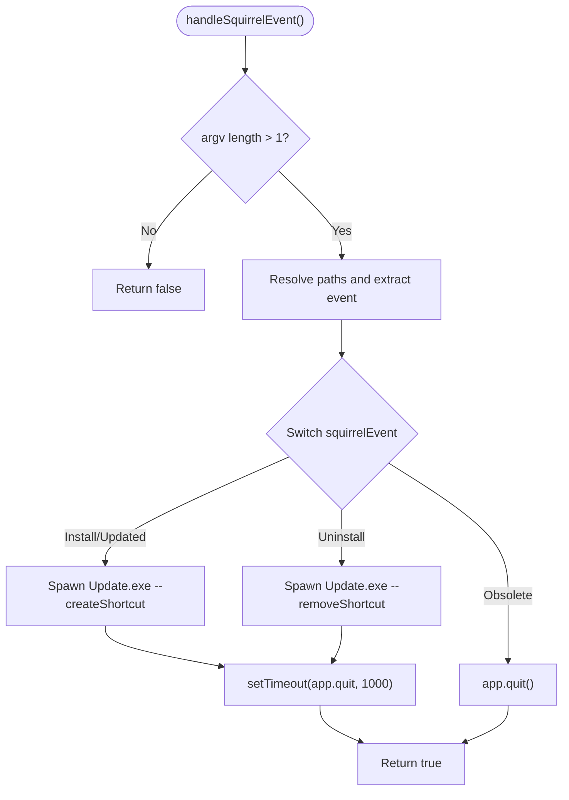
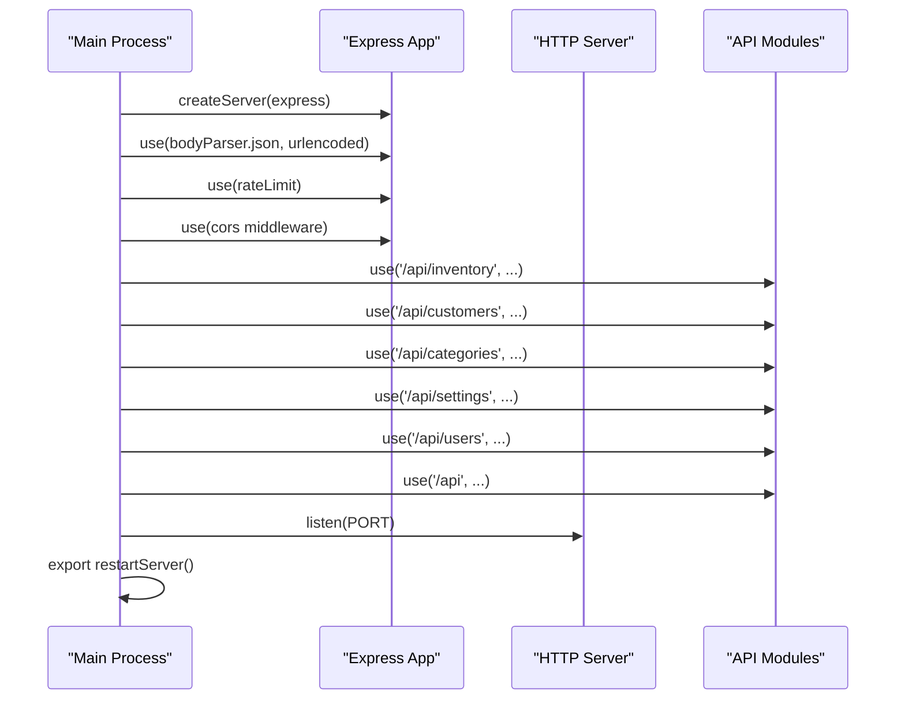
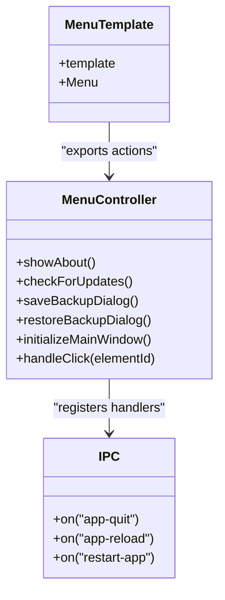
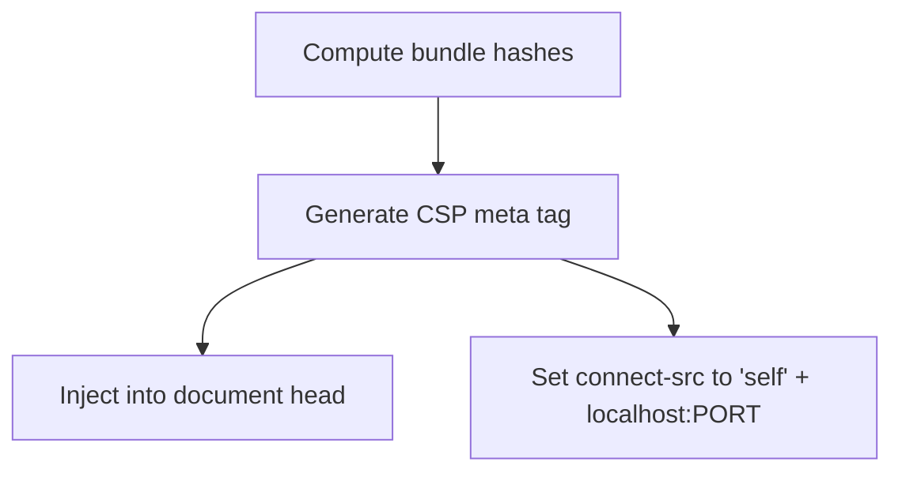
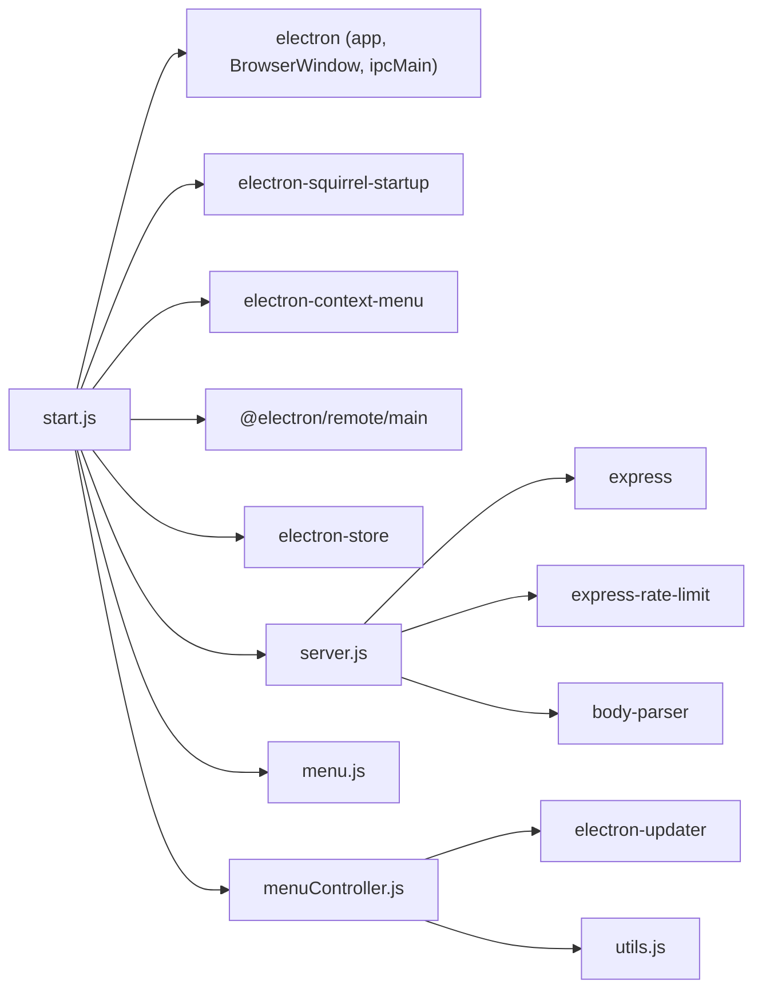

# Main Process Initialization

<cite>
**Referenced Files in This Document**
- [package.json](file://package.json)
- [forge.config.js](file://forge.config.js)
- [start.js](file://start.js)
- [server.js](file://server.js)
- [installers/setupEvents.js](file://installers/setupEvents.js)
- [assets/js/native_menu/menu.js](file://assets/js/native_menu/menu.js)
- [assets/js/native_menu/menuController.js](file://assets/js/native_menu/menuController.js)
- [app.config.js](file://app.config.js)
- [assets/js/utils.js](file://assets/js/utils.js)
- [index.html](file://index.html)
</cite>

## Table of Contents
1. [Introduction](#introduction)
2. [Project Structure](#project-structure)
3. [Core Components](#core-components)
4. [Architecture Overview](#architecture-overview)
5. [Detailed Component Analysis](#detailed-component-analysis)
6. [Dependency Analysis](#dependency-analysis)
7. [Performance Considerations](#performance-considerations)
8. [Troubleshooting Guide](#troubleshooting-guide)
9. [Conclusion](#conclusion)

## Introduction
This document explains the Electron main process initialization for the application. It covers the startup sequence, dependency loading order, Squirrel installer event handling, multi-instance prevention, embedded HTTP server integration, context menu configuration, development environment setup, error handling mechanisms, security configurations, and platform-specific considerations.

## Project Structure
The main entry point is defined in the package manifest and orchestrates the initialization of the Electron app, embedded HTTP server, installer event handling, and UI menu system. Build and distribution are configured via Forge.

**Diagram sources**
- [package.json:11](file://package.json#L11)
- [start.js:1-107](file://start.js#L1-L107)
- [installers/setupEvents.js:1-65](file://installers/setupEvents.js#L1-L65)
- [server.js:1-68](file://server.js#L1-L68)
- [assets/js/native_menu/menu.js:1-153](file://assets/js/native_menu/menu.js#L1-L153)
- [assets/js/native_menu/menuController.js:1-346](file://assets/js/native_menu/menuController.js#L1-L346)
- [assets/js/utils.js:1-112](file://assets/js/utils.js#L1-L112)
- [index.html:1-884](file://index.html#L1-L884)

**Section sources**
- [package.json:11](file://package.json#L11)
- [forge.config.js:1-71](file://forge.config.js#L1-L71)

## Core Components
- Main process entry and lifecycle: Initializes remote support, loads installer events, starts the embedded server, builds the native menu, sets up context menu, and handles development live reload.
- Embedded HTTP server: Express-based server with rate limiting and CORS, mounted under API routes.
- Installer event handling: Squirrel installer event dispatcher for Windows install/update/uninstall flows.
- Native menu and IPC: Application menu built from a template and controller wiring UI actions to the main process.
- Security and CSP: Content Security Policy generation and connect-src configuration for local server.
- Error handling: Global uncaughtException and unhandledRejection listeners.

**Section sources**
- [start.js:1-107](file://start.js#L1-L107)
- [server.js:1-68](file://server.js#L1-L68)
- [installers/setupEvents.js:1-65](file://installers/setupEvents.js#L1-L65)
- [assets/js/native_menu/menu.js:1-153](file://assets/js/native_menu/menu.js#L1-L153)
- [assets/js/native_menu/menuController.js:1-346](file://assets/js/native_menu/menuController.js#L1-L346)
- [assets/js/utils.js:89-99](file://assets/js/utils.js#L89-L99)
- [app.config.js:1-8](file://app.config.js#L1-L8)

## Architecture Overview
The main process initializes in this order:
1. Remote module initialization and renderer store initialization.
2. Squirrel installer event handling to prevent multi-launch during installer operations.
3. Embedded HTTP server creation and route mounting.
4. Electron app lifecycle setup (ready, window-all-closed, activate).
5. Native menu building and application menu registration.
6. Context menu configuration and development live reload.
7. Renderer preload and window creation.

**Diagram sources**
- [start.js:1-107](file://start.js#L1-L107)
- [installers/setupEvents.js:4-65](file://installers/setupEvents.js#L4-L65)
- [server.js:1-68](file://server.js#L1-L68)
- [assets/js/native_menu/menu.js:14-153](file://assets/js/native_menu/menu.js#L14-L153)

## Detailed Component Analysis

### Main Process Startup and Lifecycle
- Remote module initialization and renderer store initialization occur early to enable inter-process communication and persistent settings.
- Multi-instance prevention is enforced via the Squirrel startup helper to avoid launching the app during installer operations.
- The embedded server is required before window creation to ensure API availability.
- The app listens for “when ready”, “window-all-closed”, and “activate” events to manage lifecycle and window restoration.

**Diagram sources**
- [start.js:1-107](file://start.js#L1-L107)

**Section sources**
- [start.js:1-107](file://start.js#L1-L107)

### Squirrel Installer Event Handling
- The Squirrel event handler inspects process arguments and executes installer commands such as creating or removing desktop/start menu shortcuts.
- It returns early to prevent the app from continuing to launch during installer operations.
- The handler uses a detached child process to run the Update.exe command and schedules app quit after a short delay.

**Diagram sources**
- [installers/setupEvents.js:4-65](file://installers/setupEvents.js#L4-L65)

**Section sources**
- [installers/setupEvents.js:1-65](file://installers/setupEvents.js#L1-L65)

### Embedded HTTP Server Integration
- The server creates an Express app, enables JSON/URL-encoded parsing, applies a rate limit, and configures CORS headers.
- Routes are mounted under API prefixes for inventory, customers, categories, settings, users, and transactions.
- The server listens on a configurable port and exports a restart function that clears caches and re-requires the server module.

**Diagram sources**
- [server.js:1-68](file://server.js#L1-L68)

**Section sources**
- [server.js:1-68](file://server.js#L1-L68)

### Native Menu Configuration and IPC
- The native menu template defines top-level menus (File, Edit, View, Help) with platform-aware roles and custom actions.
- The menu controller wires actions such as About, Backup/Restore dialogs, Logout, and update checks.
- IPC channels are registered for app quit, reload, and restart-app to integrate with the UI.

**Diagram sources**
- [assets/js/native_menu/menu.js:1-153](file://assets/js/native_menu/menu.js#L1-L153)
- [assets/js/native_menu/menuController.js:1-346](file://assets/js/native_menu/menuController.js#L1-L346)
- [start.js:75-85](file://start.js#L75-L85)

**Section sources**
- [assets/js/native_menu/menu.js:1-153](file://assets/js/native_menu/menu.js#L1-L153)
- [assets/js/native_menu/menuController.js:1-346](file://assets/js/native_menu/menuController.js#L1-L346)
- [start.js:75-85](file://start.js#L75-L85)

### Development Environment Setup
- During development, the app enables live reload via a reloader module and disables context isolation for convenience.
- The renderer preload loads jQuery and application scripts.

**Section sources**
- [start.js:100-104](file://start.js#L100-L104)
- [renderer.js:1-5](file://renderer.js#L1-L5)

### Error Handling Mechanisms
- Global uncaughtException and unhandledRejection listeners log errors to the console. These should be augmented with crash reporting and graceful shutdown in production.

**Section sources**
- [start.js:67-73](file://start.js#L67-L73)

### Security Configurations and Privilege Separation
- The BrowserWindow is configured with nodeIntegration enabled and contextIsolation disabled. This reduces security by allowing Node.js APIs in the renderer and sharing the context with web content.
- A Content Security Policy generator computes hashes of bundled assets and sets connect-src to localhost plus the embedded server port.
- Recommendations include enabling contextIsolation, disabling nodeIntegration, using preload scripts, and restricting connect-src to trusted origins only.

**Diagram sources**
- [assets/js/utils.js:89-99](file://assets/js/utils.js#L89-L99)

**Section sources**
- [start.js:25-34](file://start.js#L25-L34)
- [assets/js/utils.js:89-99](file://assets/js/utils.js#L89-L99)

### Platform-Specific Considerations
- Windows installer events are handled via Squirrel startup helper and dedicated event handler.
- Native menu roles vary by platform (e.g., macOS About, Services, Hide).
- Auto-update feed URL is constructed using platform and version from app configuration.

**Section sources**
- [installers/setupEvents.js:1-65](file://installers/setupEvents.js#L1-L65)
- [assets/js/native_menu/menu.js:14-32](file://assets/js/native_menu/menu.js#L14-L32)
- [assets/js/native_menu/menuController.js:26-29](file://assets/js/native_menu/menuController.js#L26-L29)

## Dependency Analysis
Key runtime dependencies and their roles:
- Electron app lifecycle and BrowserWindow creation.
- Express server with body parsing and rate limiting.
- Electron context menu and Squirrel startup helpers.
- Electron Store for persistent settings.
- Electron updater for update checks and installation prompts.
- Local embedded server routes for API endpoints.

**Diagram sources**
- [start.js:1-107](file://start.js#L1-L107)
- [server.js:1-68](file://server.js#L1-L68)
- [assets/js/native_menu/menu.js:1-153](file://assets/js/native_menu/menu.js#L1-L153)
- [assets/js/native_menu/menuController.js:1-346](file://assets/js/native_menu/menuController.js#L1-L346)
- [assets/js/utils.js:1-112](file://assets/js/utils.js#L1-L112)

**Section sources**
- [package.json:18-54](file://package.json#L18-L54)
- [start.js:1-107](file://start.js#L1-L107)
- [server.js:1-68](file://server.js#L1-L68)

## Performance Considerations
- Keep the embedded server lightweight; offload heavy tasks to workers or external services.
- Minimize synchronous operations in the main process to avoid blocking UI.
- Use rate limiting and input sanitization to protect the embedded server from abuse.
- Avoid unnecessary module caching invalidation; the server restart mechanism clears caches selectively.

## Troubleshooting Guide
- If the app does not launch on Windows, verify Squirrel event handling is executed before window creation.
- If the embedded server fails to start, check port availability and CORS configuration.
- If the context menu does not appear, ensure context menu configuration runs after app is ready.
- For multi-instance launches during installer operations, confirm the Squirrel startup helper is invoked before requiring the server.

**Section sources**
- [installers/setupEvents.js:4-65](file://installers/setupEvents.js#L4-L65)
- [server.js:47-50](file://server.js#L47-L50)
- [start.js:87-97](file://start.js#L87-L97)

## Conclusion
The main process orchestrates installer handling, embedded server startup, menu configuration, and lifecycle management. While convenient for development, the current security posture (disabled context isolation and node integration) requires careful hardening for production. The modular design supports clear separation of concerns across initialization, server, menu, and updater responsibilities.