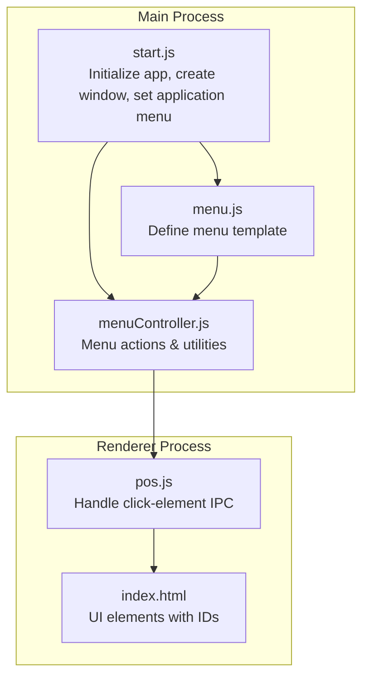
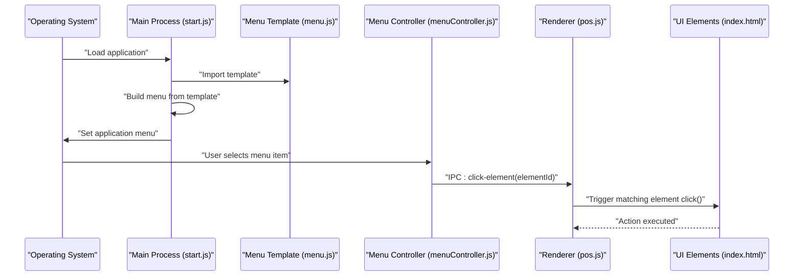
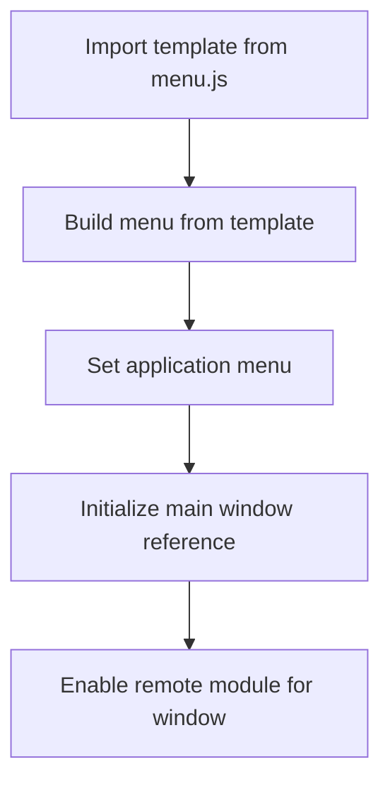
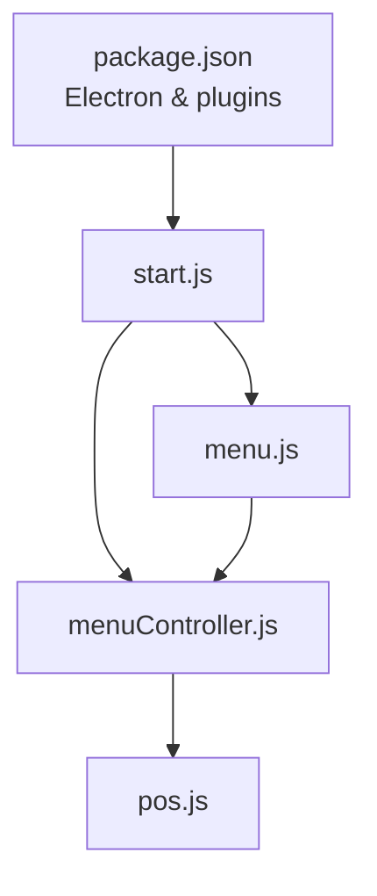

# Native Menu System

<cite>
**Referenced Files in This Document**
- [start.js](file://start.js)
- [menu.js](file://assets/js/native_menu/menu.js)
- [menuController.js](file://assets/js/native_menu/menuController.js)
- [pos.js](file://assets/js/pos.js)
- [index.html](file://index.html)
- [app.config.js](file://app.config.js)
- [package.json](file://package.json)
</cite>

## Table of Contents
1. [Introduction](#introduction)
2. [Project Structure](#project-structure)
3. [Core Components](#core-components)
4. [Architecture Overview](#architecture-overview)
5. [Detailed Component Analysis](#detailed-component-analysis)
6. [Dependency Analysis](#dependency-analysis)
7. [Performance Considerations](#performance-considerations)
8. [Troubleshooting Guide](#troubleshooting-guide)
9. [Conclusion](#conclusion)

## Introduction
This document explains the native menu system implementation for the Point of Sale (POS) application. It covers the menu template structure, application menu building process, dynamic menu updates, and the menu controller’s responsibilities including main window initialization and menu item event handling. It also details the integration between the Electron main process and the renderer process for menu operations, platform-specific behaviors, keyboard shortcuts, customization, conditional menu items, and user preference integration. Practical examples demonstrate how to add custom menu items and handle menu actions.

## Project Structure
The native menu system spans three primary areas:
- Main process initialization and menu registration
- Menu template definition and platform-specific roles
- Renderer process event handling via IPC

**Diagram sources**
- [start.js:11-15](file://start.js#L11-L15)
- [menu.js:14-151](file://assets/js/native_menu/menu.js#L14-L151)
- [menuController.js:327-345](file://assets/js/native_menu/menuController.js#L327-L345)
- [pos.js:2536-2538](file://assets/js/pos.js#L2536-L2538)
- [index.html:31-88](file://index.html#L31-L88)

**Section sources**
- [start.js:11-15](file://start.js#L11-L15)
- [menu.js:14-151](file://assets/js/native_menu/menu.js#L14-L151)
- [menuController.js:327-345](file://assets/js/native_menu/menuController.js#L327-L345)
- [pos.js:2536-2538](file://assets/js/pos.js#L2536-L2538)
- [index.html:31-88](file://index.html#L31-L88)

## Core Components
- Application menu builder: constructs the menu template and registers it with the OS.
- Menu controller: centralizes actions invoked by menu items, including navigation, backups, updates, and dialogs.
- Renderer integration: forwards menu clicks to matching UI elements via IPC.

Key responsibilities:
- Build the application menu from a template.
- Initialize the main window reference for controller actions.
- Route menu selections to renderer actions.
- Provide platform-aware roles and conditional entries.

**Section sources**
- [start.js:11-15](file://start.js#L11-L15)
- [menu.js:14-151](file://assets/js/native_menu/menu.js#L14-L151)
- [menuController.js:327-345](file://assets/js/native_menu/menuController.js#L327-L345)
- [pos.js:2536-2538](file://assets/js/pos.js#L2536-L2538)

## Architecture Overview
The menu system follows a clear separation of concerns:
- Main process builds the menu and exposes controller functions.
- Renderer listens for menu click events and triggers the corresponding UI actions.

**Diagram sources**
- [start.js:11-15](file://start.js#L11-L15)
- [menu.js:14-151](file://assets/js/native_menu/menu.js#L14-L151)
- [menuController.js:331-333](file://assets/js/native_menu/menuController.js#L331-L333)
- [pos.js:2536-2538](file://assets/js/pos.js#L2536-L2538)
- [index.html:31-88](file://index.html#L31-L88)

## Detailed Component Analysis

### Menu Template Structure
The menu template defines top-level menus and submenus with platform-aware roles and conditional entries:
- macOS-specific app menu with About, Services, Hide, Quit.
- File menu with New submenu (Product, Category, Customer), Backup, Restore, Logout, Close or Quit.
- Edit menu with Undo/Redo, Cut/Copy/Paste, and macOS-specific Speech.
- View menu with navigation targets (Point of Sale, Transactions, Products, Settings), Refresh, DevTools in development, Zoom controls, Fullscreen.
- Help menu with Documentation, Check for updates, About.

Platform-specific behaviors:
- macOS uses roles like “about”, “services”, “hide”, “hideOthers”, “unhide”, “close”.
- Windows/Linux use “quit” and “close” accordingly.

Conditional entries:
- Developer Tools visibility depends on packaging state.
- macOS-only speech and selection enhancements.

Keyboard shortcuts:
- Roles provide built-in shortcuts (Undo/Redo, Cut/Copy/Paste, Reload, Zoom, Toggle Fullscreen).
- Additional shortcuts can be added via custom accelerators in future customizations.

**Section sources**
- [menu.js:14-151](file://assets/js/native_menu/menu.js#L14-L151)

### Application Menu Building Process
The main process imports the template, builds the menu, and sets it as the application menu. It also initializes the main window reference for controller actions.

**Diagram sources**
- [start.js:11-15](file://start.js#L11-L15)
- [start.js:35](file://start.js#L35)

**Section sources**
- [start.js:11-15](file://start.js#L11-L15)
- [start.js:35](file://start.js#L35)

### Dynamic Menu Updates
Dynamic updates are not implemented in the current codebase. The menu is constructed once from the template and registered statically. To add dynamic behavior:
- Modify the template array conditionally based on runtime state.
- Rebuild the menu and reapply it to reflect changes.

Note: The template is exported as a constant; any dynamic updates would require rebuilding and re-setting the application menu.

**Section sources**
- [menu.js:14-151](file://assets/js/native_menu/menu.js#L14-L151)

### Menu Controller Functionality
The controller encapsulates actions triggered by menu items:
- Navigation: open Point of Sale, Transactions, Products, Settings views.
- Backups: Save and restore database and uploads archives with integrity checks.
- Updates: Check for updates, download, and install with user prompts.
- About panel: Configure and show the About dialog.
- IPC bridge: Forward clicks to the renderer.

Initialization:
- Stores the main window reference for actions requiring it (e.g., reload after restore).

Click handling:
- Sends an IPC message to the renderer with the target element ID.
- Renderer finds and simulates a click on the matching DOM element.

Backup and restore:
- Uses archiver/unzipper for compression and integrity verification.
- Calculates and stores SHA-256 hash inside the backup archive.

Update mechanism:
- Uses electron-updater with a configurable feed URL.
- Provides user prompts for download and installation.

**Section sources**
- [menuController.js:327-345](file://assets/js/native_menu/menuController.js#L327-L345)
- [menuController.js:331-333](file://assets/js/native_menu/menuController.js#L331-L333)
- [menuController.js:260-325](file://assets/js/native_menu/menuController.js#L260-L325)
- [menuController.js:52-132](file://assets/js/native_menu/menuController.js#L52-L132)
- [menuController.js:32-46](file://assets/js/native_menu/menuController.js#L32-L46)

### Integration Between Main and Renderer Processes
IPC communication:
- Main process sends “click-element” with an element ID to the renderer.
- Renderer listens for the event and triggers the matching DOM element’s click handler.

Renderer-side click handling:
- Listens for “click-element” and dispatches a synthetic click on the element with the given ID.

Main window lifecycle:
- Initializes the main window reference early so controller actions can interact with it (e.g., reload after restore).

**Section sources**
- [menuController.js:331-333](file://assets/js/native_menu/menuController.js#L331-L333)
- [pos.js:2536-2538](file://assets/js/pos.js#L2536-L2538)
- [start.js:35](file://start.js#L35)

### Platform-Specific Menu Behaviors and Keyboard Shortcuts
Platform differences:
- macOS: Uses native app menu roles and speech/selection enhancements.
- Windows/Linux: Uses close/quit roles appropriate to the platform.

Built-in keyboard shortcuts:
- Roles provide standard shortcuts (Undo/Redo, Cut/Copy/Paste, Reload, Zoom, Toggle Fullscreen).

Custom accelerators:
- Can be added to menu items for additional shortcuts in future enhancements.

**Section sources**
- [menu.js:14-151](file://assets/js/native_menu/menu.js#L14-L151)

### Menu Customization, Conditional Items, and User Preference Integration
Customization examples:
- Add new top-level menus or submenus by extending the template array.
- Add custom accelerators and click handlers for new actions.
- Introduce separators and grouped items for clarity.

Conditional items:
- Use platform checks and packaging state to include/exclude entries.
- Example: DevTools toggle appears only when not packaged.

User preference integration:
- The renderer reads stored preferences to tailor UI behavior (e.g., network terminal mode).
- While not directly controlling menu items, preferences influence which UI actions are available.

**Section sources**
- [menu.js:14-151](file://assets/js/native_menu/menu.js#L14-L151)
- [pos.js:196-204](file://assets/js/pos.js#L196-L204)

### Examples: Adding Custom Menu Items and Handling Actions
- Add a new menu item under an existing submenu by appending an object with label, click handler, and optional accelerator.
- For navigation-like actions, reuse the IPC pattern: send “click-element” with the target element ID.
- For non-navigation actions (e.g., dialogs), implement the controller function and wire it to the menu item’s click callback.

References for implementation patterns:
- Template construction and click callbacks: [menu.js:14-151](file://assets/js/native_menu/menu.js#L14-L151)
- IPC forwarding from controller: [menuController.js:331-333](file://assets/js/native_menu/menuController.js#L331-L333)
- Renderer click handling: [pos.js:2536-2538](file://assets/js/pos.js#L2536-L2538)

**Section sources**
- [menu.js:14-151](file://assets/js/native_menu/menu.js#L14-L151)
- [menuController.js:331-333](file://assets/js/native_menu/menuController.js#L331-L333)
- [pos.js:2536-2538](file://assets/js/pos.js#L2536-L2538)

## Dependency Analysis
The menu system relies on:
- Electron’s Menu and app modules for building and setting the application menu.
- IPC for cross-process communication.
- Platform detection for roles and conditional entries.
- External libraries for backup/restore and update handling.

**Diagram sources**
- [package.json:18-54](file://package.json#L18-L54)
- [start.js:11-12](file://start.js#L11-L12)
- [menu.js:1-1](file://assets/js/native_menu/menu.js#L1-L1)
- [menuController.js:1-12](file://assets/js/native_menu/menuController.js#L1-L12)
- [pos.js:12-18](file://assets/js/pos.js#L12-L18)

**Section sources**
- [package.json:18-54](file://package.json#L18-L54)
- [start.js:11-12](file://start.js#L11-L12)
- [menu.js:1-1](file://assets/js/native_menu/menu.js#L1-L1)
- [menuController.js:1-12](file://assets/js/native_menu/menuController.js#L1-L12)
- [pos.js:12-18](file://assets/js/pos.js#L12-L18)

## Performance Considerations
- Static menu templates avoid runtime computation overhead.
- IPC messages are lightweight; ensure minimal payload and avoid frequent rebuilds of the menu.
- Backup/restore operations use streaming; keep file sizes reasonable and avoid blocking the UI thread.

## Troubleshooting Guide
Common issues and resolutions:
- Menu not appearing: Verify the template import and menu build steps in the main process.
- Clicks not triggering UI actions: Confirm the renderer listens for “click-element” and the element ID matches a real DOM element.
- Backup/restore failures: Check file paths, permissions, and integrity verification logs.
- Update checks failing: Review error handling and user prompts for retry logic.

**Section sources**
- [menuController.js:260-325](file://assets/js/native_menu/menuController.js#L260-L325)
- [menuController.js:52-132](file://assets/js/native_menu/menuController.js#L52-L132)
- [pos.js:2536-2538](file://assets/js/pos.js#L2536-L2538)

## Conclusion
The native menu system is a modular, platform-aware component that integrates tightly with the renderer via IPC. It supports navigation, backups, updates, and About panels, with room for further customization and dynamic updates. Following the established patterns ensures consistent behavior across platforms and reliable user experiences.