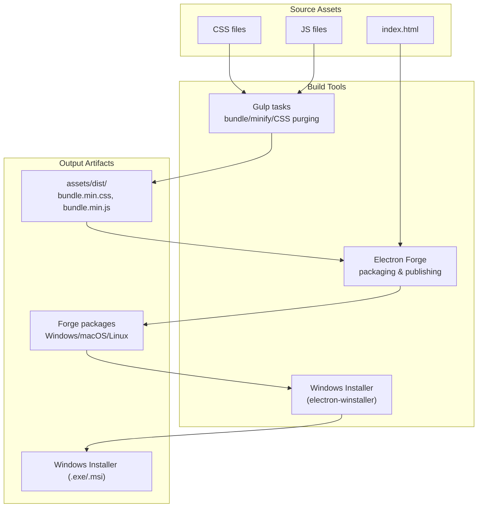
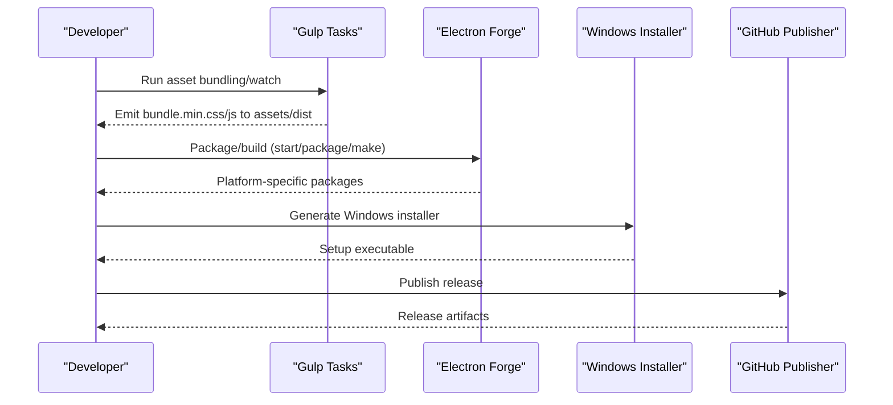
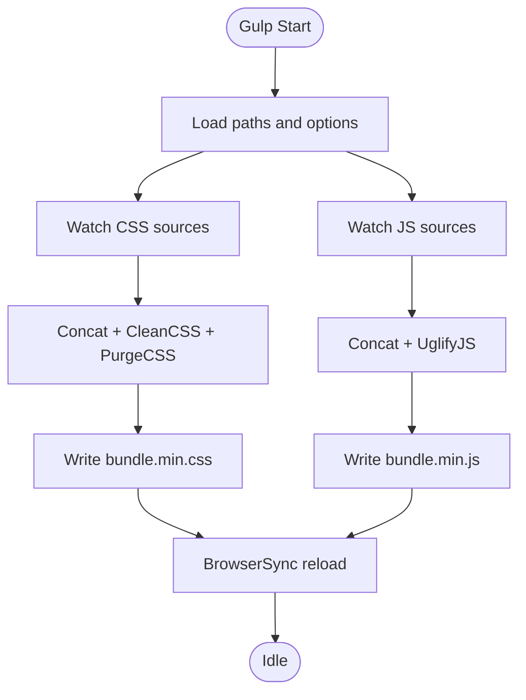
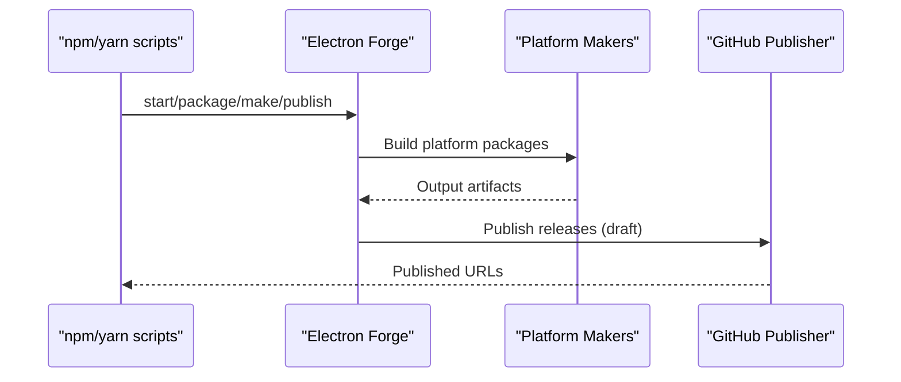
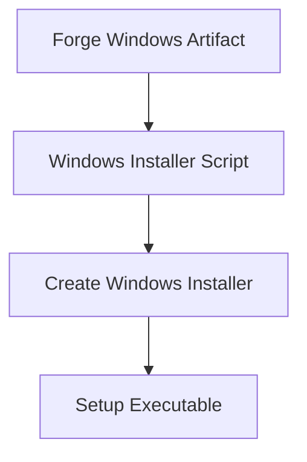
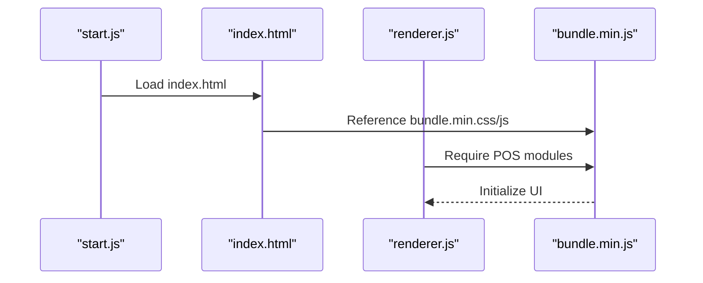
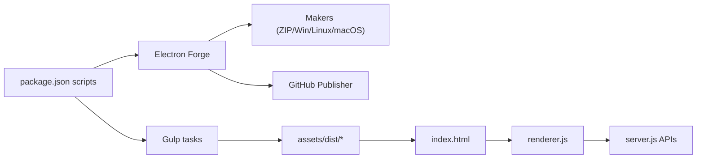

# Build Process

<cite>
**Referenced Files in This Document**
- [package.json](file://package.json)
- [gulpfile.js](file://gulpfile.js)
- [forge.config.js](file://forge.config.js)
- [build.js](file://build.js)
- [index.html](file://index.html)
- [renderer.js](file://renderer.js)
- [start.js](file://start.js)
- [server.js](file://server.js)
- [app.config.js](file://app.config.js)
</cite>

## Table of Contents
1. [Introduction](#introduction)
2. [Project Structure](#project-structure)
3. [Core Components](#core-components)
4. [Architecture Overview](#architecture-overview)
5. [Detailed Component Analysis](#detailed-component-analysis)
6. [Dependency Analysis](#dependency-analysis)
7. [Performance Considerations](#performance-considerations)
8. [Troubleshooting Guide](#troubleshooting-guide)
9. [Conclusion](#conclusion)

## Introduction
This document explains the complete build process for PharmaSpot POS, covering the asset bundling pipeline with Gulp, the Electron Forge packaging and distribution workflow, and the build scripts defined in package.json. It also documents development versus production differences, build artifacts, optimization steps, and practical guidance for performance and continuous integration.

## Project Structure
PharmaSpot POS uses a hybrid desktop application built with Electron and a web-like renderer. The build system centers around:
- Asset bundling and minification via Gulp
- Electron Forge for cross-platform packaging and publishing
- A dedicated Windows installer script using electron-winstaller
- A renderer entry that loads bundled assets

**Diagram sources**
- [gulpfile.js:11-79](file://gulpfile.js#L11-L79)
- [forge.config.js:6-70](file://forge.config.js#L6-L70)
- [build.js:7-15](file://build.js#L7-L15)
- [index.html:7](file://index.html#L7)

**Section sources**
- [gulpfile.js:11-79](file://gulpfile.js#L11-L79)
- [forge.config.js:6-70](file://forge.config.js#L6-L70)
- [build.js:7-15](file://build.js#L7-L15)
- [index.html:7](file://index.html#L7)

## Core Components
- Gulp asset pipeline: Concatenates, minifies, and purges CSS/JS; watches for changes; serves via BrowserSync for live reload.
- Electron Forge configuration: Defines packaging targets (Windows, Linux, macOS), ignores dev-only files, and publishes to GitHub releases.
- Windows installer: Generates an installer using electron-winstaller for Windows builds.
- Renderer entry: Loads the bundled assets and initializes the UI.

**Section sources**
- [gulpfile.js:51-79](file://gulpfile.js#L51-L79)
- [forge.config.js:6-70](file://forge.config.js#L6-L70)
- [build.js:7-15](file://build.js#L7-L15)
- [index.html:7](file://index.html#L7)
- [renderer.js:1-5](file://renderer.js#L1-L5)

## Architecture Overview
The build pipeline integrates asset bundling and packaging into a cohesive workflow.

**Diagram sources**
- [gulpfile.js:51-79](file://gulpfile.js#L51-L79)
- [forge.config.js:21-51](file://forge.config.js#L21-L51)
- [build.js:7-15](file://build.js#L7-L15)
- [package.json:93-101](file://package.json#L93-L101)

## Detailed Component Analysis

### Gulp Asset Pipeline
- Bundling and Minification:
  - CSS concatenation and cleaning with optional purging of unused selectors.
  - JS concatenation and minification.
- Watch and Live Reload:
  - Watches HTML, CSS, and JS sources; triggers rebuilds and BrowserSync reload.
- Output:
  - Emits bundle.min.css and bundle.min.js under assets/dist.

**Diagram sources**
- [gulpfile.js:11-79](file://gulpfile.js#L11-L79)

**Section sources**
- [gulpfile.js:11-79](file://gulpfile.js#L11-L79)

### Electron Forge Packaging and Distribution
- Packaging configuration:
  - Uses asar packaging, sets icon, and ignores development and test files.
  - Makers for ZIP, Windows (Squirrel/WIX), Linux (DEB/RPM), macOS (DMG).
  - Publishers for GitHub releases (draft mode).
- Hooks:
  - Removes node_gyp_bins on Linux post-prune to fix packaging issues.

**Diagram sources**
- [forge.config.js:6-70](file://forge.config.js#L6-L70)
- [package.json:93-101](file://package.json#L93-L101)

**Section sources**
- [forge.config.js:6-70](file://forge.config.js#L6-L70)
- [package.json:93-101](file://package.json#L93-L101)

### Windows Installer Generation
- Script uses electron-winstaller to produce a Windows installer from the packaged app directory.
- Configures author, output directory, setup icon, and executable names.

**Diagram sources**
- [build.js:7-15](file://build.js#L7-L15)

**Section sources**
- [build.js:7-15](file://build.js#L7-L15)

### Renderer Entry and Asset Loading
- The renderer initializes jQuery and loads POS modules.
- index.html references the bundled CSS and relies on the bundled JS for runtime behavior.

**Diagram sources**
- [index.html:7](file://index.html#L7)
- [renderer.js:1-5](file://renderer.js#L1-L5)
- [start.js:39](file://start.js#L39)

**Section sources**
- [index.html:7](file://index.html#L7)
- [renderer.js:1-5](file://renderer.js#L1-L5)
- [start.js:39](file://start.js#L39)

## Dependency Analysis
- Build-time dependencies:
  - Gulp ecosystem for asset bundling and minification.
  - Electron Forge and makers for cross-platform packaging.
  - electron-winstaller for Windows installer creation.
- Runtime dependencies:
  - Renderer loads bundled assets and initializes UI modules.
  - Server runs Express endpoints for API routes.

**Diagram sources**
- [package.json:93-101](file://package.json#L93-L101)
- [gulpfile.js:51-79](file://gulpfile.js#L51-L79)
- [forge.config.js:21-51](file://forge.config.js#L21-L51)
- [index.html:7](file://index.html#L7)
- [renderer.js:1-5](file://renderer.js#L1-L5)
- [server.js:40-46](file://server.js#L40-L46)

**Section sources**
- [package.json:93-101](file://package.json#L93-L101)
- [gulpfile.js:51-79](file://gulpfile.js#L51-L79)
- [forge.config.js:21-51](file://forge.config.js#L21-L51)
- [index.html:7](file://index.html#L7)
- [renderer.js:1-5](file://renderer.js#L1-L5)
- [server.js:40-46](file://server.js#L40-L46)

## Performance Considerations
- Asset optimization:
  - CSS: Concatenation, cleaning, and purge of unused selectors reduce payload size.
  - JS: Concatenation and minification reduce transfer size and improve load time.
- Incremental builds:
  - Gulp watchers trigger targeted rebuilds on change detection.
- Packaging:
  - asar enabled in Forge reduces filesystem overhead and improves startup performance.
- Network and server:
  - Rate limiting middleware in the Express server helps protect resources.

[No sources needed since this section provides general guidance]

## Troubleshooting Guide
- Windows installer failures:
  - Verify the packaged app directory exists and matches the configured path.
  - Ensure the setup icon path is correct and accessible.
- Linux packaging issues:
  - Hook removes node_gyp_bins automatically; confirm platform is Linux and hook executes.
- Asset not updating:
  - Confirm Gulp watcher is running and assets are written to assets/dist.
  - Check BrowserSync reload if using live reload.
- Forge packaging errors:
  - Review ignored files and ensure assets/dist is included in the packaged app.
  - Validate maker configurations for target platforms.
- Server API not responding:
  - Confirm server listens on the expected port and routes are mounted.

**Section sources**
- [build.js:7-15](file://build.js#L7-L15)
- [forge.config.js:54-69](file://forge.config.js#L54-L69)
- [gulpfile.js:68-79](file://gulpfile.js#L68-L79)
- [server.js:47-50](file://server.js#L47-L50)

## Conclusion
PharmaSpot POS employs a streamlined build pipeline: Gulp handles asset bundling and minification, Electron Forge manages cross-platform packaging and distribution, and a dedicated Windows installer script completes the Windows delivery. The setup supports incremental development with live reload and produces optimized artifacts suitable for production deployment across Windows, macOS, and Linux.