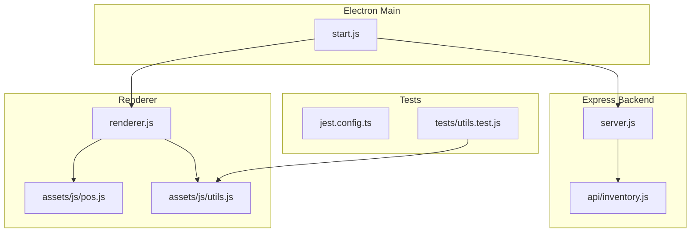
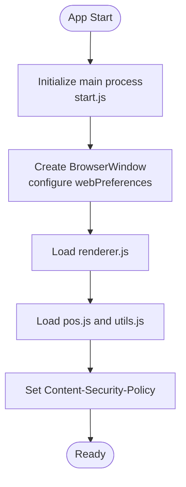
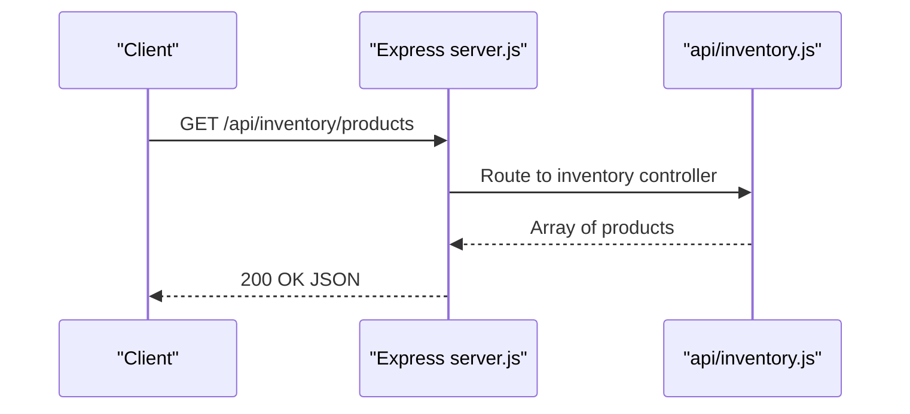
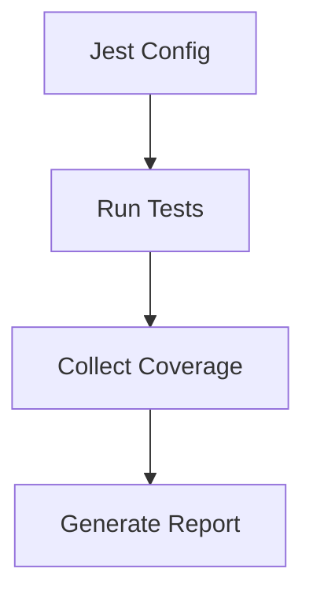
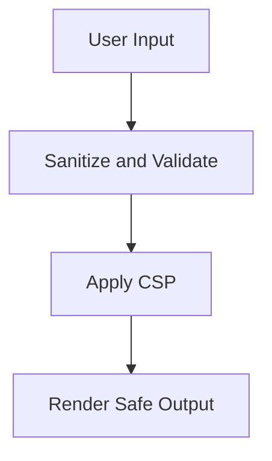
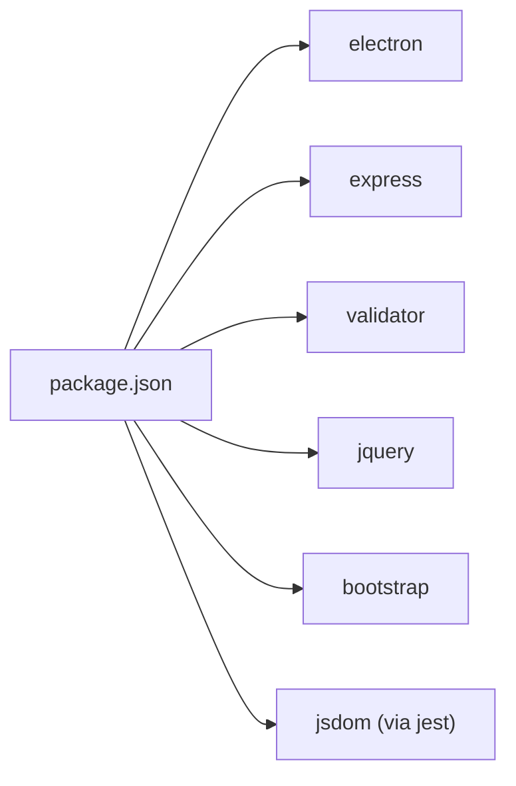

# Code Standards and Linting

<cite>
**Referenced Files in This Document**
- [.eslintrc.yml](file://.eslintrc.yml)
- [package.json](file://package.json)
- [README.md](file://README.md)
- [CONTRIBUTING.md](file://CONTRIBUTING.md)
- [CODE_OF_CONDUCT.md](file://CODE_OF_CONDUCT.md)
- [start.js](file://start.js)
- [server.js](file://server.js)
- [renderer.js](file://renderer.js)
- [app.config.js](file://app.config.js)
- [jest.config.ts](file://jest.config.ts)
- [assets/js/pos.js](file://assets/js/pos.js)
- [assets/js/utils.js](file://assets/js/utils.js)
- [tests/utils.test.js](file://tests/utils.test.js)
- [api/inventory.js](file://api/inventory.js)
</cite>

## Table of Contents
1. [Introduction](#introduction)
2. [Project Structure](#project-structure)
3. [Core Components](#core-components)
4. [Architecture Overview](#architecture-overview)
5. [Detailed Component Analysis](#detailed-component-analysis)
6. [Dependency Analysis](#dependency-analysis)
7. [Performance Considerations](#performance-considerations)
8. [Troubleshooting Guide](#troubleshooting-guide)
9. [Conclusion](#conclusion)
10. [Appendices](#appendices)

## Introduction
This document defines code standards and linting practices for PharmaSpot POS development. It consolidates existing conventions observed in the repository and establishes clear expectations for JavaScript/Node.js development, Electron integration, security, performance, and quality assurance. Where the repository lacks explicit configurations, this guide proposes practical defaults aligned with industry best practices and the project’s current patterns.

## Project Structure
PharmaSpot POS is an Electron-based desktop application with a Node.js backend and a browser-rendered frontend. The structure follows a hybrid model:
- Electron main process initializes the app, sets up menus, and manages lifecycle.
- A local Express server exposes REST endpoints for inventory, customers, categories, settings, users, and transactions.
- Renderer process loads jQuery and application scripts to power the POS UI.
- Utilities encapsulate shared logic such as date handling, stock status, file operations, and Content Security Policy (CSP) configuration.
- Tests use Jest to validate utility functions.

**Diagram sources**
- [start.js:1-107](file://start.js#L1-L107)
- [server.js:1-68](file://server.js#L1-L68)
- [renderer.js:1-5](file://renderer.js#L1-L5)
- [assets/js/pos.js:1-800](file://assets/js/pos.js#L1-L800)
- [assets/js/utils.js:1-112](file://assets/js/utils.js#L1-L112)
- [api/inventory.js:1-333](file://api/inventory.js#L1-L333)
- [jest.config.ts:1-200](file://jest.config.ts#L1-L200)
- [tests/utils.test.js:1-191](file://tests/utils.test.js#L1-L191)

**Section sources**
- [README.md:61-77](file://README.md#L61-L77)
- [start.js:1-107](file://start.js#L1-L107)
- [server.js:1-68](file://server.js#L1-L68)
- [renderer.js:1-5](file://renderer.js#L1-L5)
- [assets/js/pos.js:1-800](file://assets/js/pos.js#L1-L800)
- [assets/js/utils.js:1-112](file://assets/js/utils.js#L1-L112)
- [jest.config.ts:1-200](file://jest.config.ts#L1-L200)
- [tests/utils.test.js:1-191](file://tests/utils.test.js#L1-L191)

## Core Components
- Electron main process: Initializes app lifecycle, context menu, IPC handlers, and development live reload.
- Express server: Provides REST endpoints, rate limiting, CORS, and modular API routes.
- Renderer: Loads jQuery and application scripts; orchestrates UI interactions and API communication.
- Utilities: Shared helpers for date handling, stock status, file operations, hashing, and CSP.
- Tests: Jest configuration and unit tests for utility functions.

**Section sources**
- [start.js:1-107](file://start.js#L1-L107)
- [server.js:1-68](file://server.js#L1-L68)
- [renderer.js:1-5](file://renderer.js#L1-L5)
- [assets/js/utils.js:1-112](file://assets/js/utils.js#L1-L112)
- [jest.config.ts:1-200](file://jest.config.ts#L1-L200)
- [tests/utils.test.js:1-191](file://tests/utils.test.js#L1-L191)

## Architecture Overview
The system integrates Electron, a local Express server, and a browser-based UI. The renderer communicates with the backend via localhost endpoints. Security is enforced through CSP configuration and input sanitization.

```mermaid
sequenceDiagram
participant UI as "Renderer UI"
participant REND as "renderer.js"
participant MAIN as "start.js"
participant SRV as "server.js"
participant INV as "api/inventory.js"
UI->>REND : Load scripts and initialize
REND->>MAIN : IPC request (optional)
UI->>SRV : HTTP request to /api/inventory/*
SRV->>INV : Route to inventory controller
INV-->>SRV : Response payload
SRV-->>UI : JSON response
```

**Diagram sources**
- [renderer.js:1-5](file://renderer.js#L1-L5)
- [start.js:1-107](file://start.js#L1-L107)
- [server.js:1-68](file://server.js#L1-L68)
- [api/inventory.js:1-333](file://api/inventory.js#L1-L333)

## Detailed Component Analysis

### ESLint Configuration and Coding Conventions
- Current configuration extends recommended rules and targets ES2021 with the latest parser options. No custom rules are defined.
- Recommended additions for consistency and safety:
  - Enforce semicolons or consistently disallow them across the codebase.
  - Set parser options to align with the project’s target environment.
  - Add plugin rules for Electron-specific patterns and best practices.
  - Integrate with Prettier for automatic formatting.
- Naming conventions:
  - Variables and functions: camelCase.
  - Constants: UPPER_SNAKE_CASE.
  - Classes: PascalCase.
  - Files: kebab-case for assets, PascalCase for constructors.
- Formatting:
  - Use consistent indentation (spaces) and trailing commas.
  - Prefer single quotes for strings unless interpolation is present.
- Architectural patterns:
  - Encapsulate shared logic in utilities (as seen in utils.js).
  - Use modular API routes (as seen in server.js and api/inventory.js).
  - Separate concerns between renderer UI and backend services.

**Section sources**
- [.eslintrc.yml:1-8](file://.eslintrc.yml#L1-L8)
- [assets/js/utils.js:1-112](file://assets/js/utils.js#L1-L112)
- [server.js:1-68](file://server.js#L1-L68)
- [api/inventory.js:1-333](file://api/inventory.js#L1-L333)

### Electron Development Standards
- Main process responsibilities:
  - Initialize remote module and renderer store.
  - Handle Squirrel installer events and app lifecycle.
  - Configure context menu and development live reload.
- Renderer process responsibilities:
  - Load jQuery and application scripts.
  - Manage UI interactions and IPC communication.
- Security:
  - Enable CSP via utils.js to mitigate XSS risks.
  - Sanitize user inputs and HTML content.
  - Limit Node.js integration in the renderer and prefer IPC for sensitive operations.

**Diagram sources**
- [start.js:1-107](file://start.js#L1-L107)
- [renderer.js:1-5](file://renderer.js#L1-L5)
- [assets/js/utils.js:91-99](file://assets/js/utils.js#L91-L99)

**Section sources**
- [start.js:1-107](file://start.js#L1-L107)
- [renderer.js:1-5](file://renderer.js#L1-L5)
- [assets/js/utils.js:91-99](file://assets/js/utils.js#L91-L99)

### API and Data Flow Standards
- REST endpoints:
  - Use consistent HTTP verbs and status codes.
  - Return structured JSON responses with appropriate errors.
- Input validation and sanitization:
  - Sanitize and validate inputs (as demonstrated in api/inventory.js).
  - Use validators for numeric conversions and formats.
- Rate limiting:
  - Apply rate limiting middleware to protect endpoints.

**Diagram sources**
- [server.js:40-46](file://server.js#L40-L46)
- [api/inventory.js:111-115](file://api/inventory.js#L111-L115)

**Section sources**
- [server.js:1-68](file://server.js#L1-L68)
- [api/inventory.js:1-333](file://api/inventory.js#L1-L333)

### Testing Standards and Quality Assurance
- Test framework:
  - Jest is configured with coverage enabled and default settings.
- Test coverage:
  - Collect coverage and write unit tests for utility functions.
- Best practices:
  - Mock external modules (fs, crypto) for deterministic tests.
  - Validate edge cases for date calculations, stock status, and file operations.

**Diagram sources**
- [jest.config.ts:1-200](file://jest.config.ts#L1-L200)
- [tests/utils.test.js:1-191](file://tests/utils.test.js#L1-L191)

**Section sources**
- [jest.config.ts:1-200](file://jest.config.ts#L1-L200)
- [tests/utils.test.js:1-191](file://tests/utils.test.js#L1-L191)

### Security Coding Standards
- Input sanitization:
  - Use validator and DOMPurify to sanitize inputs and HTML.
- Content Security Policy:
  - Dynamically compute hashes for inline bundles and apply CSP.
- File handling:
  - Validate file types and sizes; compute SHA-256 hashes for integrity checks.
- Authentication and permissions:
  - Enforce user permissions and restrict access to sensitive features.

**Diagram sources**
- [assets/js/utils.js:76-99](file://assets/js/utils.js#L76-L99)
- [assets/js/pos.js:724-729](file://assets/js/pos.js#L724-L729)

**Section sources**
- [assets/js/utils.js:1-112](file://assets/js/utils.js#L1-L112)
- [assets/js/pos.js:1-800](file://assets/js/pos.js#L1-L800)

### Performance Optimization Guidelines
- Minimize synchronous I/O in the renderer; defer heavy computations to background tasks.
- Use efficient DOM manipulation and avoid frequent reflows.
- Cache frequently accessed data (e.g., user, settings) in memory.
- Optimize asset bundling and minimize unnecessary dependencies.

[No sources needed since this section provides general guidance]

### Code Review Guidelines and Pull Request Standards
- Follow existing code style and conventions.
- Write clear commit messages and PR titles.
- Ensure tests pass locally before opening a PR.
- Adhere to the Code of Conduct during collaboration.

**Section sources**
- [CONTRIBUTING.md:53-61](file://CONTRIBUTING.md#L53-L61)
- [CODE_OF_CONDUCT.md:15-49](file://CODE_OF_CONDUCT.md#L15-L49)

### Pre-commit Hooks and Automated Checks
- Recommended workflow:
  - Run linter and formatter before committing.
  - Execute tests to ensure no regressions.
  - Enforce commit message conventions.
- Tools to consider:
  - Husky for Git hooks and lint-staged for staged file checks.

[No sources needed since this section provides general guidance]

## Dependency Analysis
The project relies on Electron for desktop integration, Express for the backend, and numerous libraries for UI, printing, validation, and persistence. Dependencies are declared in package.json with scripts for development, packaging, and publishing.

**Diagram sources**
- [package.json:18-54](file://package.json#L18-L54)
- [jest.config.ts:1-200](file://jest.config.ts#L1-L200)

**Section sources**
- [package.json:18-146](file://package.json#L18-L146)
- [jest.config.ts:1-200](file://jest.config.ts#L1-L200)

## Performance Considerations
- Minimize DOM updates and batch UI changes.
- Defer non-critical initialization to reduce startup time.
- Use efficient algorithms for calculations (e.g., stock status).
- Avoid blocking the main thread with long-running tasks.

[No sources needed since this section provides general guidance]

## Troubleshooting Guide
- Common issues:
  - Port conflicts: Verify PORT environment variable and adjust as needed.
  - CSP violations: Ensure bundle hashes match the CSP configuration.
  - File upload errors: Confirm file type filters and size limits.
- Logging:
  - Use centralized logging for uncaught exceptions and rejections.

**Section sources**
- [server.js:10-14](file://server.js#L10-L14)
- [assets/js/utils.js:91-99](file://assets/js/utils.js#L91-L99)
- [start.js:67-73](file://start.js#L67-L73)

## Conclusion
This guide formalizes existing patterns in PharmaSpot POS and introduces standardized practices for linting, formatting, security, performance, and quality assurance. Adopting these standards will improve code consistency, maintainability, and reliability across the Electron/Node.js stack.

[No sources needed since this section summarizes without analyzing specific files]

## Appendices

### Appendix A: ESLint Recommendations
- Extend a maintained ESLint plugin for Electron.
- Define parser options and environments consistently.
- Add rules for error-prone patterns (e.g., no-console, no-unused-vars).
- Integrate Prettier for automatic formatting.

**Section sources**
- [.eslintrc.yml:1-8](file://.eslintrc.yml#L1-L8)

### Appendix B: Naming Conventions Reference
- Variables and functions: camelCase
- Constants: UPPER_SNAKE_CASE
- Classes: PascalCase
- Files: kebab-case for assets, PascalCase for constructors

**Section sources**
- [assets/js/utils.js:1-112](file://assets/js/utils.js#L1-L112)
- [api/inventory.js:1-333](file://api/inventory.js#L1-L333)

### Appendix C: Example Paths for Implementation
- ESLint configuration: [.eslintrc.yml](file://.eslintrc.yml)
- Package scripts and dependencies: [package.json](file://package.json)
- Test configuration: [jest.config.ts](file://jest.config.ts)
- Utility functions: [assets/js/utils.js](file://assets/js/utils.js)
- POS logic: [assets/js/pos.js](file://assets/js/pos.js)
- Inventory API: [api/inventory.js](file://api/inventory.js)

**Section sources**
- [.eslintrc.yml:1-8](file://.eslintrc.yml#L1-L8)
- [package.json:93-102](file://package.json#L93-L102)
- [jest.config.ts:1-200](file://jest.config.ts#L1-L200)
- [assets/js/utils.js:1-112](file://assets/js/utils.js#L1-L112)
- [assets/js/pos.js:1-800](file://assets/js/pos.js#L1-L800)
- [api/inventory.js:1-333](file://api/inventory.js#L1-L333)