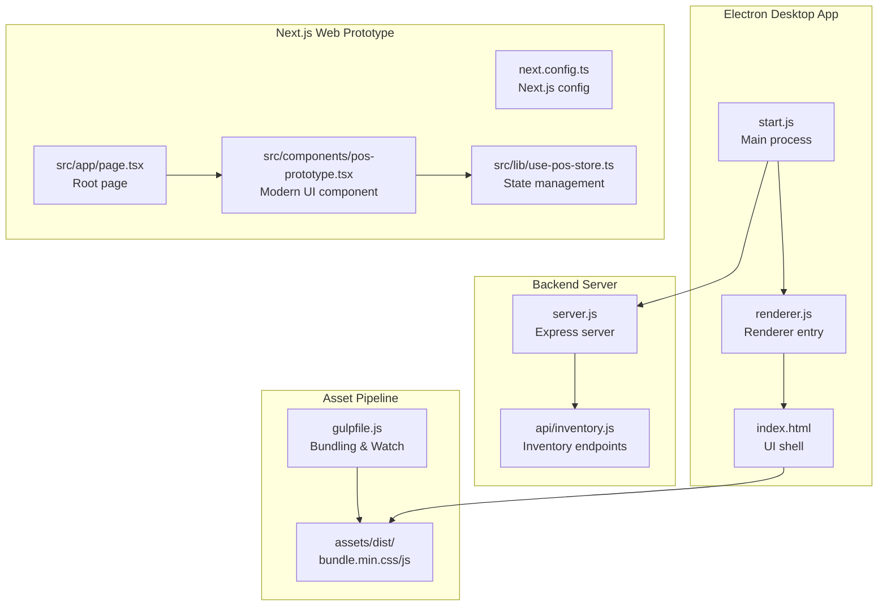
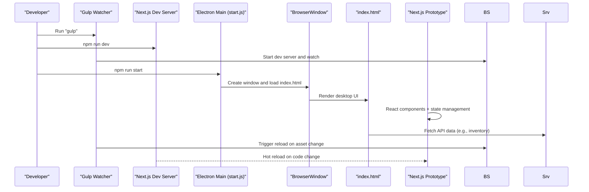
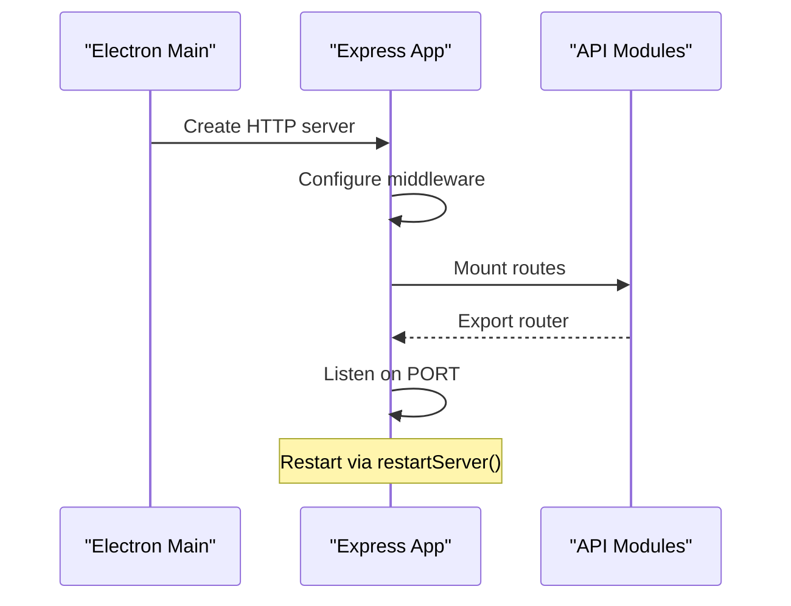
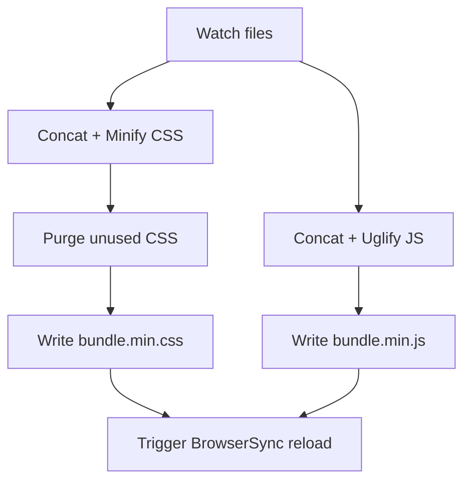
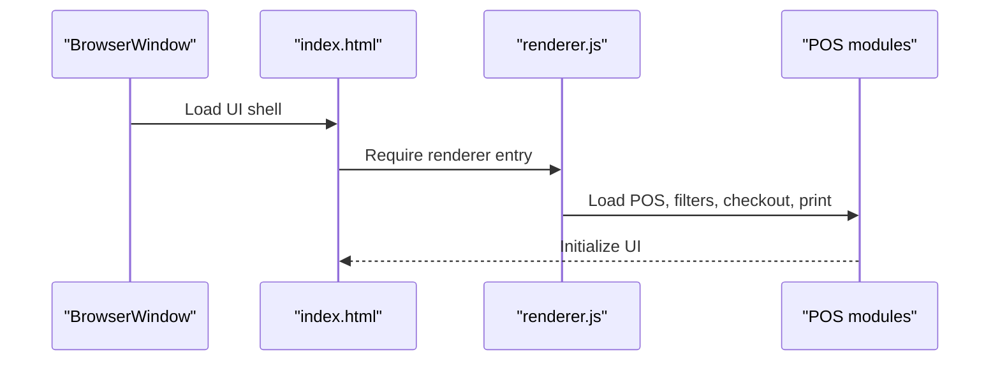
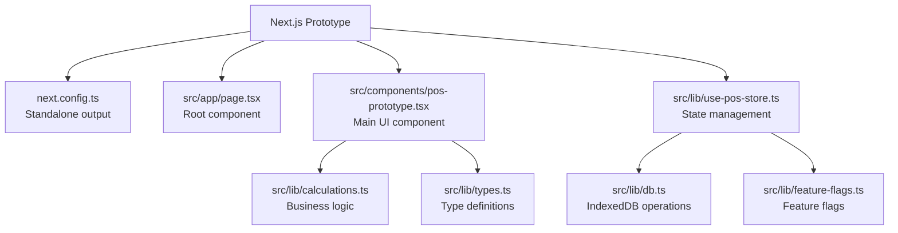
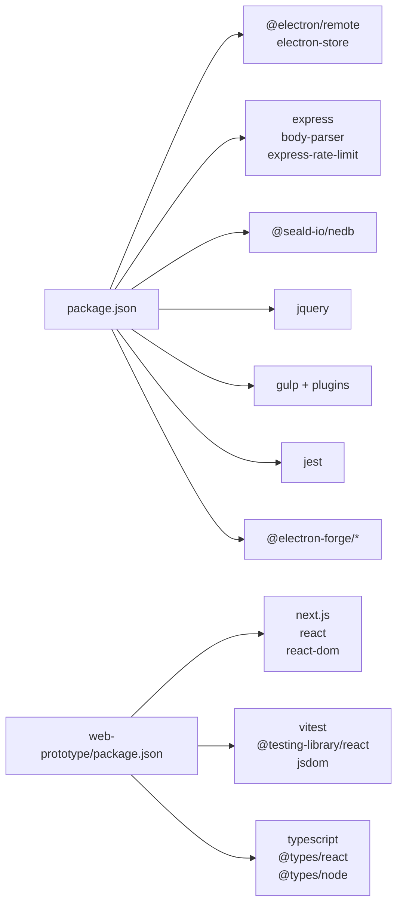
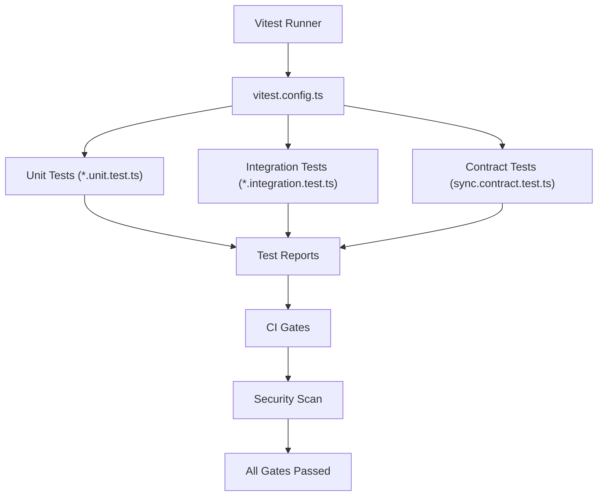

# Development Guide

<cite>
**Referenced Files in This Document**
- [package.json](file://package.json)
- [gulpfile.js](file://gulpfile.js)
- [jest.config.ts](file://jest.config.ts)
- [.eslintrc.yml](file://.eslintrc.yml)
- [forge.config.js](file://forge.config.js)
- [start.js](file://start.js)
- [server.js](file://server.js)
- [renderer.js](file://renderer.js)
- [index.html](file://index.html)
- [app.config.js](file://app.config.js)
- [api/inventory.js](file://api/inventory.js)
- [tests/utils.test.js](file://tests/utils.test.js)
- [web-prototype/package.json](file://web-prototype/package.json)
- [web-prototype/vitest.config.ts](file://web-prototype/vitest.config.ts)
- [web-prototype/src/lib/db.ts](file://web-prototype/src/lib/db.ts)
- [web-prototype/src/lib/calculations.ts](file://web-prototype/src/lib/calculations.ts)
- [web-prototype/src/contracts/sync.contract.test.ts](file://web-prototype/src/contracts/sync.contract.test.ts)
- [web-prototype/src/lib/db.integration.test.ts](file://web-prototype/src/lib/db.integration.test.ts)
- [web-prototype/src/lib/db.test.ts](file://web-prototype/src/lib/db.test.ts)
- [web-prototype/src/lib/feature-flags.ts](file://web-prototype/src/lib/feature-flags.ts)
- [web-prototype/src/lib/types.ts](file://web-prototype/src/lib/types.ts)
- [web-prototype/src/app/page.tsx](file://web-prototype/src/app/page.tsx)
- [web-prototype/src/components/pos-prototype.tsx](file://web-prototype/src/components/pos-prototype.tsx)
- [web-prototype/src/lib/use-pos-store.ts](file://web-prototype/src/lib/use-pos-store.ts)
- [web-prototype/next.config.ts](file://web-prototype/next.config.ts)
- [web-prototype/tsconfig.json](file://web-prototype/tsconfig.json)
- [web-prototype/README.md](file://web-prototype/README.md)
- [CONTRIBUTING.md](file://CONTRIBUTING.md)
- [CODE_OF_CONDUCT.md](file://CODE_OF_CONDUCT.md)
- [README.md](file://README.md)
</cite>

## Update Summary
**Changes Made**
- Added comprehensive Next.js web prototype development workflow
- Integrated modern UI framework with React and TypeScript
- Implemented comprehensive testing infrastructure with Vitest
- Added contract testing for offline-sync functionality
- Enhanced development server configuration with Next.js
- Updated architecture diagrams to reflect dual development environments

## Table of Contents
1. [Introduction](#introduction)
2. [Project Structure](#project-structure)
3. [Core Components](#core-components)
4. [Architecture Overview](#architecture-overview)
5. [Detailed Component Analysis](#detailed-component-analysis)
6. [Dependency Analysis](#dependency-analysis)
7. [Performance Considerations](#performance-considerations)
8. [Testing Strategy](#testing-strategy)
9. [Code Standards and Linting](#code-standards-and-linting)
10. [Development Environment Setup](#development-environment-setup)
11. [IDE Setup and Debugging Tools](#ide-setup-and-debugging-tools)
12. [Troubleshooting Guide](#troubleshooting-guide)
13. [Conclusion](#conclusion)

## Introduction
This guide documents the development workflow for PharmaSpot POS, covering environment setup, dependency management, the Gulp build system, asset bundling, development server configuration, testing with Jest, code standards, and best practices. **Updated** to include the new Next.js web prototype with modern UI framework and comprehensive testing infrastructure using Vitest and contract testing. The application now supports both traditional Electron desktop development and modern web development with React, TypeScript, and Next.js.

## Project Structure
PharmaSpot POS now features a dual development environment with both Electron desktop application and Next.js web prototype. The web prototype serves as a modern UI framework and testing ground for the upcoming Next.js migration.

**Diagram sources**
- [start.js:1-107](file://start.js#L1-L107)
- [server.js:1-68](file://server.js#L1-L68)
- [api/inventory.js:1-333](file://api/inventory.js#L1-L333)
- [gulpfile.js:1-80](file://gulpfile.js#L1-L80)
- [index.html:1-884](file://index.html#L1-L884)
- [web-prototype/next.config.ts:1-16](file://web-prototype/next.config.ts#L1-L16)
- [web-prototype/src/app/page.tsx:1-6](file://web-prototype/src/app/page.tsx#L1-L6)
- [web-prototype/src/components/pos-prototype.tsx:1-800](file://web-prototype/src/components/pos-prototype.tsx#L1-L800)
- [web-prototype/src/lib/use-pos-store.ts:1-434](file://web-prototype/src/lib/use-pos-store.ts#L1-L434)

**Section sources**
- [README.md:61-77](file://README.md#L61-L77)
- [package.json:93-102](file://package.json#L93-L102)
- [web-prototype/README.md:1-21](file://web-prototype/README.md#L1-L21)

## Core Components
- **Electron main process**: Initializes the app, sets up menus, and loads the renderer window with remote module support and IPC handlers for app lifecycle controls.
- **Embedded Express server**: Provides API endpoints for inventory, customers, categories, settings, users, and transactions with CORS, rate limiting, and dynamic port binding.
- **Renderer entry**: Wires jQuery and loads POS modules and printing library for the desktop interface.
- **Asset pipeline**: Bundles and minifies CSS/JS, purges unused CSS, and watches for changes to reload the UI.
- **Next.js web prototype**: Modern React/TypeScript implementation with comprehensive testing infrastructure and contract testing.
- **State management**: Centralized store with observability, feature flags, and offline-first data synchronization.

**Section sources**
- [start.js:1-107](file://start.js#L1-L107)
- [server.js:1-68](file://server.js#L1-L68)
- [renderer.js:1-5](file://renderer.js#L1-L5)
- [gulpfile.js:1-80](file://gulpfile.js#L1-L80)
- [web-prototype/src/lib/use-pos-store.ts:1-434](file://web-prototype/src/lib/use-pos-store.ts#L1-L434)
- [web-prototype/src/components/pos-prototype.tsx:1-800](file://web-prototype/src/components/pos-prototype.tsx#L1-L800)

## Architecture Overview
The application now follows a hybrid architecture supporting both desktop and web development:
- **Desktop runtime**: Electron with single BrowserWindow hosting the traditional UI.
- **Web prototype**: Next.js application with modern React components and comprehensive testing.
- **Backend APIs**: Embedded Express server serving both applications.
- **Asset bundling**: Gulp orchestrating desktop assets, Next.js handling web assets.
- **Testing infrastructure**: Dual testing approach with Jest for desktop and Vitest for web prototype.
- **Packaging**: Electron Forge for desktop distribution, Next.js standalone output for web deployment.

**Diagram sources**
- [gulpfile.js:68-80](file://gulpfile.js#L68-L80)
- [start.js:21-45](file://start.js#L21-L45)
- [index.html:1-800](file://index.html#L1-L884)
- [server.js:1-68](file://server.js#L1-L68)
- [web-prototype/package.json:5-16](file://web-prototype/package.json#L5-L16)

## Detailed Component Analysis

### Electron Main Process
Responsibilities remain unchanged with enhanced support for the new web prototype:
- Initialize remote module support and renderer store initialization.
- Handle Squirrel installer events and app lifecycle.
- Build and show the main window, set application menu, and register IPC handlers.
- Enable live reload during development via electron-reloader.

**Diagram sources**
- [start.js:1-107](file://start.js#L1-L107)

**Section sources**
- [start.js:1-107](file://start.js#L1-L107)

### Embedded Express Server
Responsibilities remain unchanged:
- Configure body parsing, rate limiting, and CORS.
- Mount API routes for inventory, customers, categories, settings, users, and transactions.
- Dynamically set and expose the listening port via environment variables.
- Provide a restart mechanism by clearing caches and re-requiring server modules.

**Diagram sources**
- [server.js:1-68](file://server.js#L1-L68)
- [api/inventory.js:1-333](file://api/inventory.js#L1-L333)

**Section sources**
- [server.js:1-68](file://server.js#L1-L68)
- [api/inventory.js:1-333](file://api/inventory.js#L1-L333)

### Asset Bundling and Development Server (Gulp + BrowserSync)
Responsibilities remain unchanged:
- Concatenate and minify CSS and JS.
- Purge unused CSS with purgecss.
- Watch HTML, CSS, and JS for changes and trigger reload via BrowserSync.
- Output bundles to assets/dist.

**Diagram sources**
- [gulpfile.js:11-80](file://gulpfile.js#L11-L80)

**Section sources**
- [gulpfile.js:1-80](file://gulpfile.js#L1-L80)

### Renderer Entry and UI Shell
Responsibilities remain unchanged:
- Bootstrap jQuery and required scripts.
- Load POS, product filtering, checkout, and print utilities.
- index.html serves as the UI shell and loads the bundled assets.

**Diagram sources**
- [index.html:1-800](file://index.html#L1-L884)
- [renderer.js:1-5](file://renderer.js#L1-L5)

**Section sources**
- [index.html:1-800](file://index.html#L1-L884)
- [renderer.js:1-5](file://renderer.js#L1-L5)

### Next.js Web Prototype
**New** Comprehensive React/TypeScript implementation with modern development practices:
- **Modern UI Framework**: React components with TypeScript type safety and Next.js routing.
- **State Management**: Centralized store with observability, feature flags, and offline-first data synchronization.
- **Testing Infrastructure**: Comprehensive Vitest setup with unit, integration, and contract testing.
- **Development Server**: Next.js dev server with hot reloading and TypeScript support.
- **Build System**: Next.js standalone output for optimized production builds.

**Diagram sources**
- [web-prototype/next.config.ts:1-16](file://web-prototype/next.config.ts#L1-L16)
- [web-prototype/src/app/page.tsx:1-6](file://web-prototype/src/app/page.tsx#L1-L6)
- [web-prototype/src/components/pos-prototype.tsx:1-800](file://web-prototype/src/components/pos-prototype.tsx#L1-L800)
- [web-prototype/src/lib/use-pos-store.ts:1-434](file://web-prototype/src/lib/use-pos-store.ts#L1-L434)
- [web-prototype/src/lib/db.ts:1-241](file://web-prototype/src/lib/db.ts#L1-L241)

**Section sources**
- [web-prototype/README.md:1-21](file://web-prototype/README.md#L1-L21)
- [web-prototype/package.json:1-34](file://web-prototype/package.json#L1-L34)
- [web-prototype/src/lib/use-pos-store.ts:1-434](file://web-prototype/src/lib/use-pos-store.ts#L1-L434)
- [web-prototype/src/components/pos-prototype.tsx:1-800](file://web-prototype/src/components/pos-prototype.tsx#L1-L800)

## Dependency Analysis
**Updated** with Next.js web prototype dependencies:
- **Desktop**: Electron runtime and Forge for packaging and distribution.
- **Web Prototype**: Next.js, React, TypeScript with comprehensive testing stack.
- **Express server**: Same backend services for both applications.
- **NeDB**: Local data persistence for desktop application.
- **jQuery/Bootstrap**: UI framework for desktop application.
- **Gulp toolchain**: Asset bundling for desktop.
- **Jest/Vitest**: Testing frameworks with Jest for desktop, Vitest for web prototype.
- **Modern UI**: React components with TypeScript for web prototype.

**Diagram sources**
- [package.json:18-145](file://package.json#L18-L145)
- [web-prototype/package.json:18-32](file://web-prototype/package.json#L18-L32)

**Section sources**
- [package.json:18-145](file://package.json#L18-L145)
- [web-prototype/package.json:18-32](file://web-prototype/package.json#L18-L32)

## Performance Considerations
**Updated** with web prototype optimizations:
- **Asset bundling**: Gulp concatenation and minification for desktop; Next.js optimized bundling for web.
- **Development server**: BrowserSync hot reload for desktop; Next.js fast refresh for web.
- **Database operations**: NeDB queries for desktop; IndexedDB for web prototype with efficient migrations.
- **Network requests**: Rate limiting on Express server; web prototype uses offline-first architecture.
- **Packaging**: Electron Forge for desktop; Next.js standalone output for web deployment.
- **State management**: Efficient React state updates with memoization and selective re-rendering.
- **Testing performance**: Parallel test execution with Vitest for faster feedback cycles.

## Testing Strategy
**Updated** with comprehensive dual testing infrastructure:
- **Desktop**: Jest continues to handle unit testing with coverage collection.
- **Web Prototype**: Vitest provides comprehensive testing with specialized commands for different test types.
- **Unit Testing**: Isolated component and utility function testing with TypeScript support.
- **Integration Testing**: Database operations and feature flag migrations verified through integration tests.
- **Contract Testing**: Ensures offline-sync contract compliance with strict validation.
- **Security Testing**: Automated npm audit integration for vulnerability detection.
- **CI Gates**: Comprehensive pipeline with type checking, unit tests, integration tests, contract tests, and security scans.

**Diagram sources**
- [web-prototype/vitest.config.ts:1-16](file://web-prototype/vitest.config.ts#L1-16)
- [web-prototype/package.json:9-16](file://web-prototype/package.json#L9-L16)

**Section sources**
- [jest.config.ts:1-200](file://jest.config.ts#L1-L200)
- [tests/utils.test.js:1-191](file://tests/utils.test.js#L1-L191)
- [web-prototype/package.json:9-16](file://web-prototype/package.json#L9-L16)
- [web-prototype/vitest.config.ts:1-16](file://web-prototype/vitest.config.ts#L1-L16)

## Code Standards and Linting
**Updated** with Next.js and TypeScript requirements:
- **ESLint**: Extends recommended rules for both JavaScript and TypeScript with browser/commonjs environments.
- **TypeScript**: Strict type checking with comprehensive type definitions for the web prototype.
- **React Hooks**: Proper usage of React hooks with TypeScript interfaces.
- **Component Architecture**: Modular component design with clear separation of concerns.
- **State Management**: Centralized store pattern with immutable updates and proper TypeScript typing.

**Section sources**
- [.eslintrc.yml:1-8](file://.eslintrc.yml#L1-L8)
- [web-prototype/tsconfig.json:1-42](file://web-prototype/tsconfig.json#L1-L42)

## Development Environment Setup
**Updated** with dual development environments:
- **Prerequisites**: Node.js and npm/yarn installed for both desktop and web development.
- **Desktop Setup**:
  - Install dependencies: npm install
  - Start desktop app: npm run start
  - Bundle assets: gulp
  - Run desktop tests: npm test
- **Web Prototype Setup**:
  - Install dependencies: npm install (in web-prototype/)
  - Start development server: npm run dev
  - Build production: npm run build
  - Run type checking: npm run typecheck
  - Execute specific test suites: npm run test:unit, npm run test:integration, npm run test:contract
- **Ports and environment**:
  - Desktop Express server: dynamic port via environment variables
  - Web prototype: Next.js dev server on default port
  - Both applications: separate development processes

**Section sources**
- [README.md:70-77](file://README.md#L70-L77)
- [server.js:8-10](file://server.js#L8-L10)
- [server.js:47-50](file://server.js#L47-L50)
- [web-prototype/README.md:5-16](file://web-prototype/README.md#L5-L16)

## IDE Setup and Debugging Tools
**Updated** with Next.js development support:
- **Recommended IDE**: VS Code with extensions for JavaScript, TypeScript, React, ESLint, and Jest/Vitest.
- **Debugging**:
  - Electron main process: Use Electron CLI with environment flags to attach debugger.
  - Renderer debugging: Open DevTools in BrowserWindow.
  - API debugging: Inspect Express routes and logs in main process console.
  - Web prototype debugging: React DevTools, Next.js dev server logging, Vitest test runner.
  - Live reload: electron-reloader for desktop; Next.js fast refresh for web.
- **Development Tools**:
  - Desktop: electron-reloader for automatic app reload during development.
  - Web: Next.js dev server with hot module replacement and fast refresh.
  - Testing: Jest for desktop with coverage, Vitest for web with parallel execution.

**Section sources**
- [start.js:100-104](file://start.js#L100-L104)
- [web-prototype/package.json:5-16](file://web-prototype/package.json#L5-L16)

## Troubleshooting Guide
**Updated** with web prototype considerations:
- **Port conflicts**: Verify Express server port and Next.js dev server port are available.
- **Asset bundling errors**: Ensure Gulp tasks target correct paths and Next.js build configuration is valid.
- **Test failures**: Confirm Jest/Vitest configurations and that all mocks are properly reset.
- **Packaging issues**: Electron Forge fixes for Linux; Next.js standalone output for web deployment.
- **Web prototype issues**: TypeScript compilation errors, React component rendering issues, IndexedDB access problems.
- **State management**: React state updates, store synchronization, and offline data consistency.
- **Testing infrastructure**: Vitest configuration, mock implementations, and test environment setup.

**Section sources**
- [server.js:10-11](file://server.js#L10-L11)
- [forge.config.js:54-69](file://forge.config.js#L54-L69)
- [web-prototype/tsconfig.json:1-42](file://web-prototype/tsconfig.json#L1-L42)

## Contribution Workflow
**Updated** with dual development environment considerations:
- Fork and clone the repository.
- Create feature branch for either desktop or web prototype changes.
- Ensure both desktop and web tests pass locally.
- For web prototype: run type checking, unit tests, integration tests, and contract tests.
- For desktop: run Jest tests with coverage.
- Commit with clear messages indicating which environment was affected.
- Open pull request targeting main branch with appropriate reviewers.
- Follow Code of Conduct and licensing terms for both environments.

**Section sources**
- [CONTRIBUTING.md:14-51](file://CONTRIBUTING.md#L14-L51)
- [CODE_OF_CONDUCT.md:1-129](file://CODE_OF_CONDUCT.md#L1-L129)

## Conclusion
**Updated** This guide now covers both the traditional Electron desktop application and the new Next.js web prototype, providing comprehensive development workflows for both environments. By leveraging the Electron main process, embedded Express server, Gulp asset pipeline, Jest testing, and the new Next.js web prototype with Vitest testing and comprehensive contract testing, developers can effectively work across both desktop and web development contexts while maintaining code quality and performance.