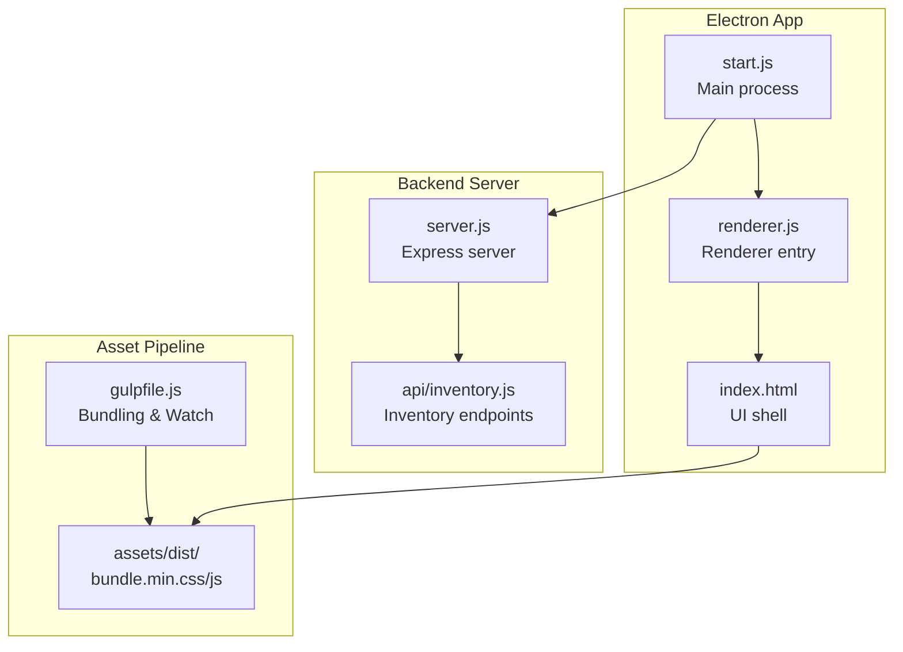
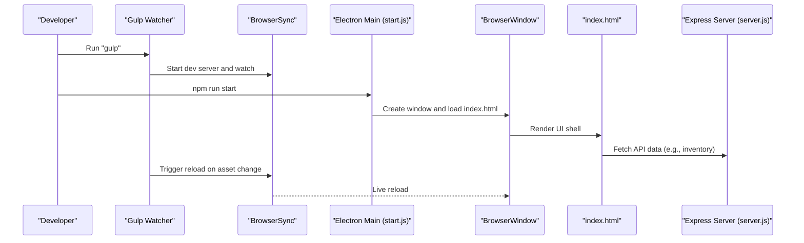
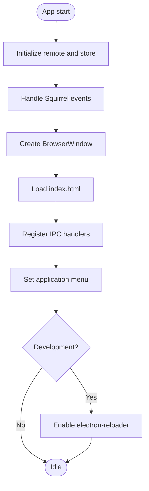
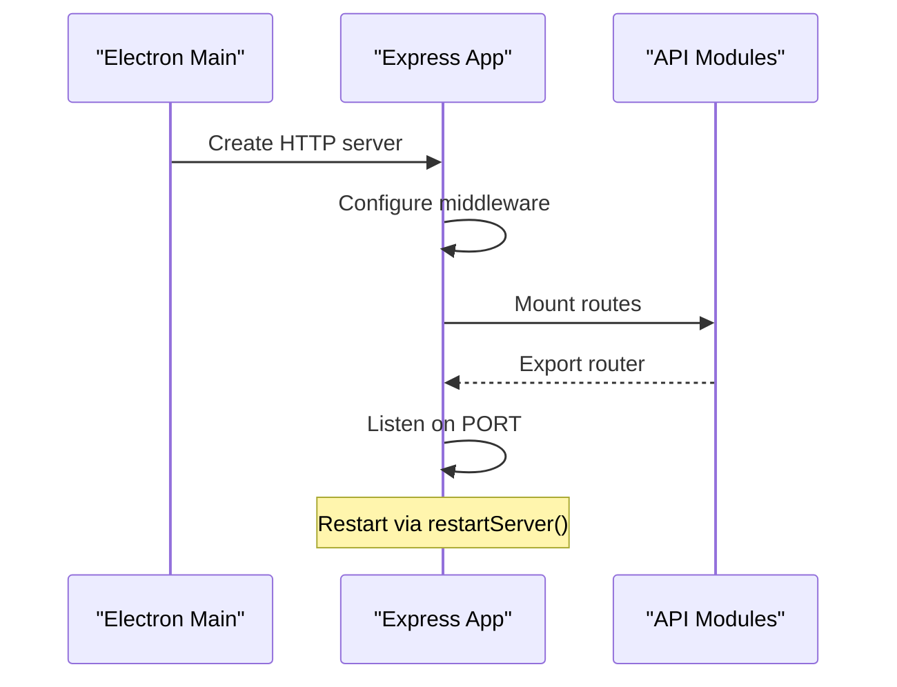
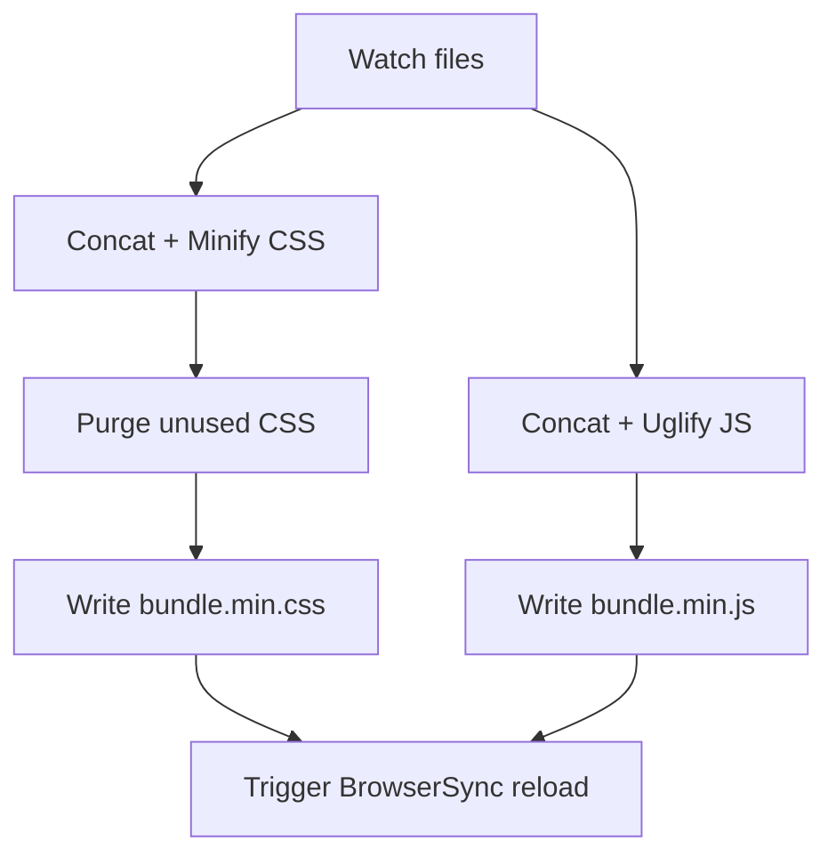
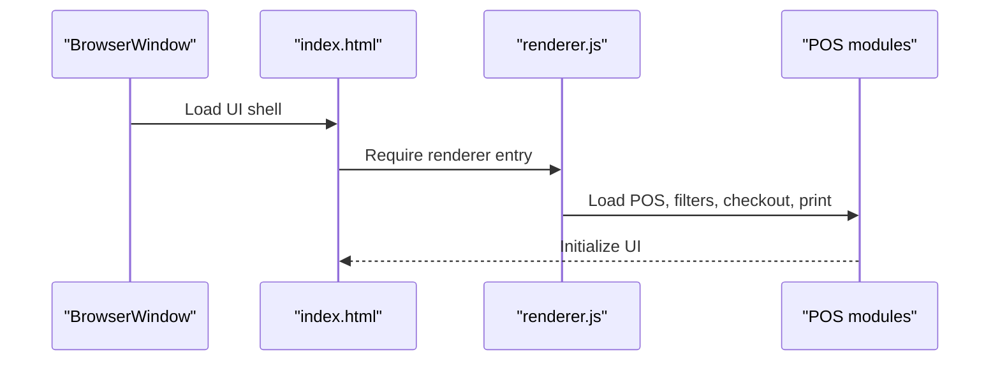
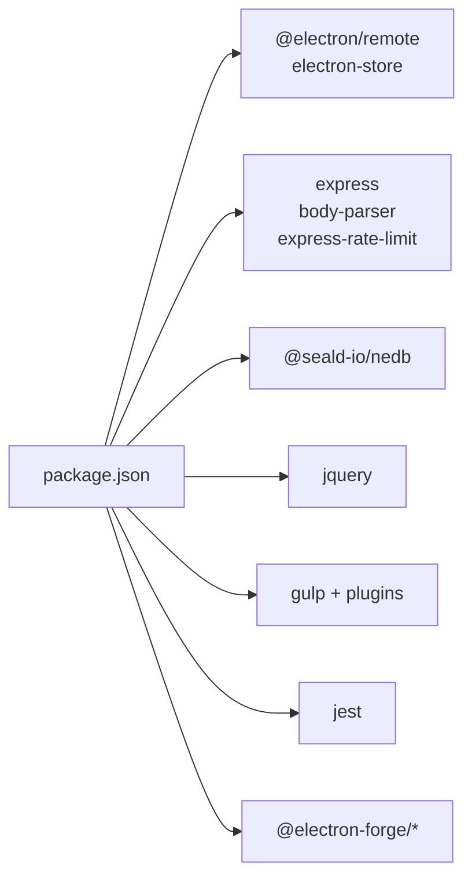
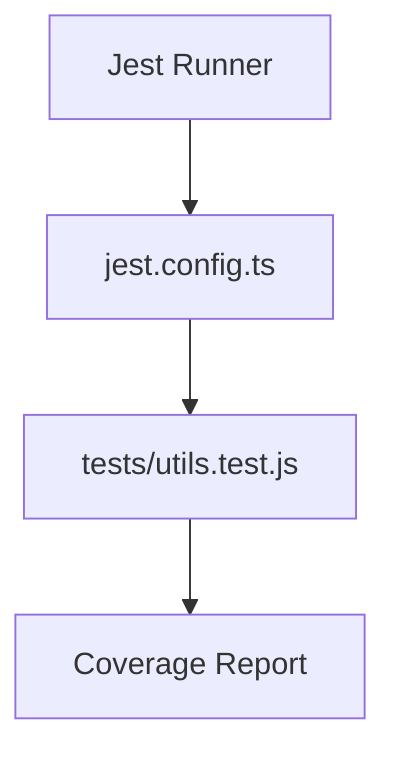

# Development Guide

<cite>
**Referenced Files in This Document**
- [package.json](file://package.json)
- [gulpfile.js](file://gulpfile.js)
- [jest.config.ts](file://jest.config.ts)
- [.eslintrc.yml](file://.eslintrc.yml)
- [forge.config.js](file://forge.config.js)
- [start.js](file://start.js)
- [server.js](file://server.js)
- [renderer.js](file://renderer.js)
- [index.html](file://index.html)
- [app.config.js](file://app.config.js)
- [api/inventory.js](file://api/inventory.js)
- [tests/utils.test.js](file://tests/utils.test.js)
- [CONTRIBUTING.md](file://CONTRIBUTING.md)
- [CODE_OF_CONDUCT.md](file://CODE_OF_CONDUCT.md)
- [README.md](file://README.md)
</cite>

## Table of Contents
1. [Introduction](#introduction)
2. [Project Structure](#project-structure)
3. [Core Components](#core-components)
4. [Architecture Overview](#architecture-overview)
5. [Detailed Component Analysis](#detailed-component-analysis)
6. [Dependency Analysis](#dependency-analysis)
7. [Performance Considerations](#performance-considerations)
8. [Testing Strategy](#testing-strategy)
9. [Code Standards and Linting](#code-stands-and-linting)
10. [Development Environment Setup](#development-environment-setup)
11. [IDE Setup and Debugging Tools](#ide-setup-and-debugging-tools)
12. [Troubleshooting Guide](#troubleshooting-guide)
13. [Conclusion](#conclusion)

## Introduction
This guide documents the development workflow for PharmaSpot POS, covering environment setup, dependency management, the Gulp build system, asset bundling, development server configuration, testing with Jest, code standards, and best practices. It also includes troubleshooting tips and development workflow optimization strategies tailored to this Electron-based desktop application.

## Project Structure
PharmaSpot POS is an Electron application with a frontend built using HTML, CSS, and JavaScript, and a backend Express server embedded within the Electron main process. Assets are bundled via Gulp, and builds are managed by Electron Forge. Tests are executed with Jest.

**Diagram sources**
- [start.js:1-107](file://start.js#L1-L107)
- [server.js:1-68](file://server.js#L1-L68)
- [api/inventory.js:1-333](file://api/inventory.js#L1-L333)
- [gulpfile.js:1-80](file://gulpfile.js#L1-L80)
- [index.html:1-884](file://index.html#L1-L884)

**Section sources**
- [README.md:61-77](file://README.md#L61-L77)
- [package.json:93-102](file://package.json#L93-L102)

## Core Components
- Electron main process initializes the app, sets up menus, and loads the renderer window. It also enables remote module support and registers IPC handlers for app lifecycle controls.
- Embedded Express server provides API endpoints for inventory, customers, categories, settings, users, and transactions. It includes CORS, rate limiting, and dynamic port binding.
- Renderer entry wires jQuery and loads POS modules and printing library.
- Asset pipeline bundles and minifies CSS/JS, purges unused CSS, and watches for changes to reload the UI.

**Section sources**
- [start.js:1-107](file://start.js#L1-L107)
- [server.js:1-68](file://server.js#L1-L68)
- [renderer.js:1-5](file://renderer.js#L1-L5)
- [gulpfile.js:1-80](file://gulpfile.js#L1-L80)

## Architecture Overview
The application follows a hybrid architecture:
- Desktop runtime via Electron with a single BrowserWindow hosting the UI.
- Backend APIs served by an embedded Express server.
- Asset bundling and live reload orchestrated by Gulp and BrowserSync.
- Packaging and distribution handled by Electron Forge.

**Diagram sources**
- [gulpfile.js:68-80](file://gulpfile.js#L68-L80)
- [start.js:21-45](file://start.js#L21-L45)
- [index.html:1-800](file://index.html#L1-L884)
- [server.js:1-68](file://server.js#L1-L68)

## Detailed Component Analysis

### Electron Main Process
Responsibilities:
- Initialize remote module support and renderer store initialization.
- Handle Squirrel installer events and app lifecycle.
- Build and show the main window, set application menu, and register IPC handlers.
- Enable live reload during development via electron-reloader.

**Diagram sources**
- [start.js:1-107](file://start.js#L1-L107)

**Section sources**
- [start.js:1-107](file://start.js#L1-L107)

### Embedded Express Server
Responsibilities:
- Configure body parsing, rate limiting, and CORS.
- Mount API routes for inventory, customers, categories, settings, users, and transactions.
- Dynamically set and expose the listening port via environment variables.
- Provide a restart mechanism by clearing caches and re-requiring server modules.

**Diagram sources**
- [server.js:1-68](file://server.js#L1-L68)
- [api/inventory.js:1-333](file://api/inventory.js#L1-L333)

**Section sources**
- [server.js:1-68](file://server.js#L1-L68)
- [api/inventory.js:1-333](file://api/inventory.js#L1-L333)

### Asset Bundling and Development Server (Gulp + BrowserSync)
Responsibilities:
- Concatenate and minify CSS and JS.
- Purge unused CSS with purgecss.
- Watch HTML, CSS, and JS for changes and trigger reload via BrowserSync.
- Output bundles to assets/dist.

**Diagram sources**
- [gulpfile.js:11-80](file://gulpfile.js#L11-L80)

**Section sources**
- [gulpfile.js:1-80](file://gulpfile.js#L1-L80)

### Renderer Entry and UI Shell
Responsibilities:
- Bootstrap jQuery and required scripts.
- Load POS, product filtering, checkout, and print utilities.
- index.html serves as the UI shell and loads the bundled assets.

**Diagram sources**
- [index.html:1-800](file://index.html#L1-L884)
- [renderer.js:1-5](file://renderer.js#L1-L5)

**Section sources**
- [index.html:1-800](file://index.html#L1-L884)
- [renderer.js:1-5](file://renderer.js#L1-L5)

## Dependency Analysis
Key runtime and build dependencies:
- Electron runtime and Forge for packaging and distribution.
- Express server with body parsing and rate limiting.
- NeDB for local data persistence.
- jQuery and Bootstrap ecosystem for UI.
- Gulp toolchain for asset bundling and minification.
- Jest for unit testing with coverage.

**Diagram sources**
- [package.json:18-55](file://package.json#L18-L55)
- [package.json:115-145](file://package.json#L115-L145)

**Section sources**
- [package.json:18-145](file://package.json#L18-L145)

## Performance Considerations
- Asset bundling: Use Gulp concatenation and minification to reduce HTTP requests and payload size. Purge unused CSS to minimize bundle size.
- Development server: BrowserSync hot reload reduces manual refresh overhead during development.
- Database operations: NeDB queries should be indexed appropriately; ensure unique indexes are used for frequently queried fields.
- Network requests: Rate limiting is enabled on the Express server to mitigate abuse; tune thresholds as needed.
- Packaging: Electron Forge’s asar packaging improves distribution performance and security.

[No sources needed since this section provides general guidance]

## Testing Strategy
- Unit testing: Jest is configured for collecting coverage and clearing mocks between tests. Tests are colocated under tests/.
- Example test suite: A focused suite validates currency formatting, expiry calculations, stock status, file existence checks, and file hashing.
- Coverage: Enabled by default in Jest configuration; coverage output is directed to coverage/.

**Diagram sources**
- [jest.config.ts:1-200](file://jest.config.ts#L1-L200)
- [tests/utils.test.js:1-191](file://tests/utils.test.js#L1-L191)

**Section sources**
- [jest.config.ts:1-200](file://jest.config.ts#L1-L200)
- [tests/utils.test.js:1-191](file://tests/utils.test.js#L1-L191)

## Code Standards and Linting
- ESLint configuration extends recommended rules and targets ES2021 with browser and commonjs environments. Add custom rules as needed to enforce project-specific standards.

**Section sources**
- [.eslintrc.yml:1-8](file://.eslintrc.yml#L1-L8)

## Development Environment Setup
- Prerequisites: Node.js and npm/yarn installed.
- Steps:
  - Install dependencies: npm install
  - Start the app: npm run start
  - Bundle assets: gulp
  - Run tests: npm test
- Ports and environment:
  - The Express server listens on a dynamic port exposed via environment variables.
  - Application data and name are derived from Electron app paths.

**Section sources**
- [README.md:70-77](file://README.md#L70-L77)
- [server.js:8-10](file://server.js#L8-L10)
- [server.js:47-50](file://server.js#L47-L50)

## IDE Setup and Debugging Tools
- Recommended IDE: VS Code with extensions for JavaScript, ESLint, and Jest.
- Debugging:
  - Electron main process debugging: Use Electron CLI with environment flags to attach a debugger.
  - Renderer debugging: Open DevTools in the BrowserWindow.
  - API debugging: Inspect Express routes and logs in the main process console.
- Live reload: electron-reloader is enabled in development to automatically reload the app when files change.

**Section sources**
- [start.js:100-104](file://start.js#L100-L104)

## Troubleshooting Guide
Common issues and resolutions:
- Port conflicts: Verify the port used by the Express server and adjust if necessary.
- Asset bundling errors: Ensure Gulp tasks target correct paths and dependencies are installed.
- Test failures: Confirm Jest configuration and that all mocks are properly reset between tests.
- Packaging issues on Linux: Electron Forge hook removes node_gyp_bins to fix packaging problems.

**Section sources**
- [server.js:10-11](file://server.js#L10-L11)
- [forge.config.js:54-69](file://forge.config.js#L54-L69)

## Contribution Workflow
- Fork and clone the repository.
- Create a feature branch and implement changes.
- Ensure tests pass locally.
- Commit with a clear message and open a pull request targeting the main branch.
- Follow the Code of Conduct and Licensing terms.

**Section sources**
- [CONTRIBUTING.md:14-51](file://CONTRIBUTING.md#L14-L51)
- [CODE_OF_CONDUCT.md:1-129](file://CODE_OF_CONDUCT.md#L1-L129)

## Conclusion
This guide outlines how to set up, develop, test, and package PharmaSpot POS effectively. By leveraging the Electron main process, embedded Express server, Gulp asset pipeline, and Jest testing, developers can iterate quickly while maintaining code quality and performance.