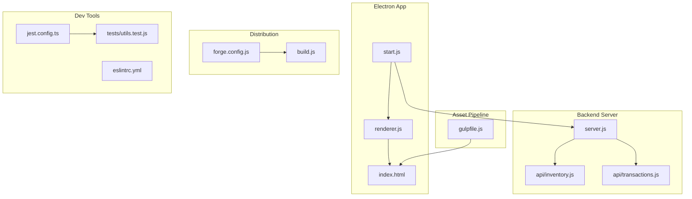
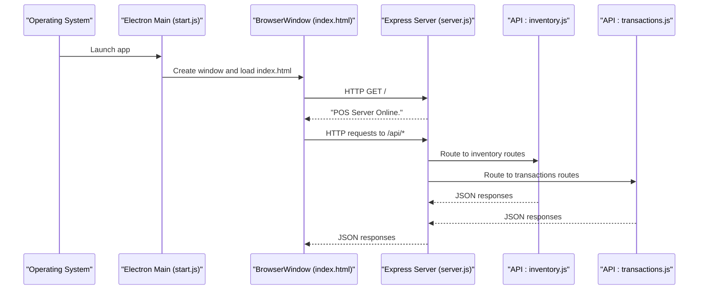
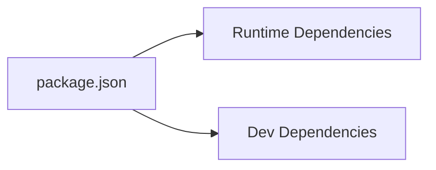

# Environment Setup

<cite>
**Referenced Files in This Document**
- [package.json](file://package.json)
- [README.md](file://README.md)
- [start.js](file://start.js)
- [server.js](file://server.js)
- [app.config.js](file://app.config.js)
- [forge.config.js](file://forge.config.js)
- [gulpfile.js](file://gulpfile.js)
- [build.js](file://build.js)
- [renderer.js](file://renderer.js)
- [installers/setupEvents.js](file://installers/setupEvents.js)
- [jest.config.ts](file://jest.config.ts)
- [tests/utils.test.js](file://tests/utils.test.js)
- [.eslintrc.yml](file://.eslintrc.yml)
- [api/inventory.js](file://api/inventory.js)
- [api/transactions.js](file://api/transactions.js)
- [index.html](file://index.html)
</cite>

## Table of Contents
1. [Introduction](#introduction)
2. [Project Structure](#project-structure)
3. [Core Components](#core-components)
4. [Architecture Overview](#architecture-overview)
5. [Detailed Component Analysis](#detailed-component-analysis)
6. [Dependency Analysis](#dependency-analysis)
7. [Performance Considerations](#performance-considerations)
8. [Troubleshooting Guide](#troubleshooting-guide)
9. [Conclusion](#conclusion)
10. [Appendices](#appendices)

## Introduction
This guide documents the complete environment setup for developing PharmaSpot POS locally. It covers system prerequisites, Node.js and package manager requirements, installation steps across Windows, macOS, and Linux, development server configuration, environment variables, asset bundling, and recommended IDE and debugging setups. It also includes troubleshooting advice for common development issues.

## Project Structure
PharmaSpot POS is an Electron-based desktop application with a Node.js/Express backend and a browser-rendered UI. Key runtime entry points and build artifacts are:
- Electron main process entry: start.js
- Express server embedded inside Electron: server.js
- Frontend entry: index.html and renderer.js
- Asset bundling pipeline: gulpfile.js
- Packaging and distribution: forge.config.js and build.js
- Tests: jest.config.ts and tests/utils.test.js
- Linting: .eslintrc.yml

**Diagram sources**
- [start.js:1-107](file://start.js#L1-L107)
- [server.js:1-68](file://server.js#L1-L68)
- [renderer.js:1-5](file://renderer.js#L1-L5)
- [index.html:1-200](file://index.html#L1-L200)
- [gulpfile.js:1-80](file://gulpfile.js#L1-L80)
- [forge.config.js:1-71](file://forge.config.js#L1-L71)
- [build.js:1-20](file://build.js#L1-L20)
- [jest.config.ts:1-200](file://jest.config.ts#L1-L200)
- [tests/utils.test.js:1-191](file://tests/utils.test.js#L1-L191)
- [.eslintrc.yml:1-8](file://.eslintrc.yml#L1-L8)

**Section sources**
- [package.json:1-147](file://package.json#L1-L147)
- [README.md:61-77](file://README.md#L61-L77)

## Core Components
- Electron main process bootstraps the app, sets up the menu, and loads index.html. It also initializes remote support and live reload during development.
- Embedded Express server handles API routes for inventory, customers, categories, settings, users, and transactions.
- Renderer loads jQuery and application scripts, and integrates printing capabilities.
- Asset bundling uses Gulp to concatenate/minify CSS/JS and synchronize browser reloads.
- Packaging leverages Electron Forge makers and publishers for cross-platform builds and GitHub publishing.
- Testing uses Jest with coverage enabled.

Key configuration highlights:
- Main entry: package.json main points to start.js.
- Scripts: npm run start launches Electron via Electron Forge; gulp bundles assets.
- Environment variables: PORT defaults to 3210; APPDATA and APPNAME are derived from Electron’s app paths.

**Section sources**
- [start.js:1-107](file://start.js#L1-L107)
- [server.js:1-68](file://server.js#L1-L68)
- [renderer.js:1-5](file://renderer.js#L1-L5)
- [gulpfile.js:1-80](file://gulpfile.js#L1-L80)
- [forge.config.js:1-71](file://forge.config.js#L1-L71)
- [build.js:1-20](file://build.js#L1-L20)
- [jest.config.ts:1-200](file://jest.config.ts#L1-L200)
- [tests/utils.test.js:1-191](file://tests/utils.test.js#L1-L191)
- [package.json:11,93-101](file://package.json#L11,L93-L101)

## Architecture Overview
The development architecture centers on Electron with an embedded Express server. The renderer runs in a Chromium-based BrowserWindow and communicates with the backend via local HTTP endpoints.

**Diagram sources**
- [start.js:1-107](file://start.js#L1-L107)
- [server.js:1-68](file://server.js#L1-L68)
- [api/inventory.js:1-200](file://api/inventory.js#L1-L200)
- [api/transactions.js:1-200](file://api/transactions.js#L1-L200)
- [index.html:1-200](file://index.html#L1-L200)

## Detailed Component Analysis

### Electron Main Process (start.js)
Responsibilities:
- Initialize @electron/remote and electron-store for renderer-side access.
- Handle Squirrel installer events on Windows.
- Create BrowserWindow, maximize, and load index.html.
- Enable remote module for created windows.
- Register IPC handlers for quit/reload/restart.
- Enable context menu and development live reload via electron-reloader.

Development notes:
- Live reload is active when the app is not packaged.
- Menu is built from a template and set at startup.

**Section sources**
- [start.js:1-107](file://start.js#L1-L107)

### Express Backend (server.js)
Responsibilities:
- Create HTTP server with Express.
- Configure body parsing and rate limiting.
- Set CORS headers and OPTIONS preflight handling.
- Mount API routers for inventory, customers, categories, settings, users, and transactions.
- Determine listening port from environment variable or default to 3210.
- Export a restartServer function that clears caches and re-requires server logic.

Environment variables:
- PORT: server port override.
- APPDATA: Electron app data path injected into process.env.
- APPNAME: derived from package.json name.

**Section sources**
- [server.js:1-68](file://server.js#L1-L68)
- [package.json:4,11](file://package.json#L4,L11)

### Asset Bundling (gulpfile.js)
Responsibilities:
- Concatenate and minify CSS and JS into assets/dist.
- Purge unused CSS with purgecss.
- Watch HTML/CSS/JS files and trigger rebuilds.
- Sync browser reloads via BrowserSync.

Outputs:
- assets/dist/css/bundle.min.css
- assets/dist/js/bundle.min.js

**Section sources**
- [gulpfile.js:1-80](file://gulpfile.js#L1-L80)

### Packaging and Distribution (forge.config.js, build.js)
- forge.config.js defines makers for multiple platforms (Squirrel/Wix for Windows, deb/rpm for Linux, dmg for macOS), ignores dev/test files, and includes a hook to remove problematic node-gyp bins on Linux.
- build.js generates a Windows installer using electron-winstaller.

**Section sources**
- [forge.config.js:1-71](file://forge.config.js#L1-L71)
- [build.js:1-20](file://build.js#L1-L20)

### Renderer Entry (renderer.js, index.html)
- renderer.js wires jQuery and loads POS, product filtering, checkout, and print-js.
- index.html is the main UI shell loaded by Electron.

**Section sources**
- [renderer.js:1-5](file://renderer.js#L1-L5)
- [index.html:1-200](file://index.html#L1-L200)

### Installer Event Handling (installers/setupEvents.js)
- Handles Squirrel installer events on Windows to create/remove shortcuts and exit gracefully.

**Section sources**
- [installers/setupEvents.js:1-65](file://installers/setupEvents.js#L1-L65)

### Testing and Linting
- Jest configuration enables coverage and standard defaults.
- Unit tests validate utility functions (currency formatting, expiry checks, stock status, file existence, hashing).
- ESLint configuration targets browsers/commonjs and extends recommended rules.

**Section sources**
- [jest.config.ts:1-200](file://jest.config.ts#L1-L200)
- [tests/utils.test.js:1-191](file://tests/utils.test.js#L1-L191)
- [.eslintrc.yml:1-8](file://.eslintrc.yml#L1-L8)

## Dependency Analysis
External runtime dependencies include Express, Socket.IO, bcrypt (via bcryptjs), NeDB, multer, validator, and others. Development dependencies include Electron, Electron Forge, Gulp, Jest, and nodemon for hot reloading.

**Diagram sources**
- [package.json:18-145](file://package.json#L18-L145)

**Section sources**
- [package.json:18-145](file://package.json#L18-L145)

## Performance Considerations
- Keep asset bundles minimal; Gulp purges unused CSS and minifies JS.
- Use rate limiting middleware on the Express server to mitigate abuse.
- Prefer async operations and avoid blocking the event loop in Electron main/renderer.
- Use production builds for packaging and avoid development-only tools in production.

[No sources needed since this section provides general guidance]

## Troubleshooting Guide
Common setup and runtime issues:

- Node.js and package manager
  - Ensure a compatible Node.js version. The project uses npm scripts and Electron; verify your Node.js LTS release supports the listed Electron version.
  - Use npm as the package manager for deterministic installs.

- Port conflicts
  - The server listens on PORT or defaults to 3210. If the port is in use, set a different PORT before starting.

- Missing native dependencies
  - Some packages require native compilation. On Linux, ensure build tools and Python are installed as required by node-gyp.

- Windows installer generation
  - The Windows installer build script expects a prior successful package build. Ensure the packaged app directory exists before running the installer builder.

- Live reload not triggering
  - Live reload is enabled only when the app is not packaged. Verify development mode and that electron-reloader is present.

- CORS and API calls
  - The server sets broad CORS headers for development. If you encounter CORS errors, verify the frontend is requesting the correct origin/port.

- Asset bundling
  - If CSS/JS changes are not reflected, run gulp again or check watch tasks. Ensure Gulp and its plugins are installed.

- Tests failing
  - Run npm test to reproduce issues. Coverage is enabled by default. Review Jest configuration and test mocks.

**Section sources**
- [server.js:10,18-34](file://server.js#L10,L18-L34)
- [build.js:7-15](file://build.js#L7-L15)
- [start.js:100-104](file://start.js#L100-L104)
- [gulpfile.js:68-79](file://gulpfile.js#L68-L79)
- [jest.config.ts:22,28,36](file://jest.config.ts#L22,L28,L36)

## Conclusion
With the correct Node.js environment, installed dependencies, and configured asset pipeline, you can develop and debug PharmaSpot POS effectively. The embedded Express server simplifies local API development, while Electron Forge streamlines cross-platform packaging. Use the troubleshooting tips to resolve common setup issues quickly.

[No sources needed since this section summarizes without analyzing specific files]

## Appendices

### Step-by-Step Installation and Setup

- Prerequisites
  - Operating systems: Windows, macOS, Linux
  - Node.js: use a recent LTS version compatible with Electron 41.x
  - Package manager: npm (not Yarn, per package.json)

- Install dependencies
  - From the project root, run the install command to fetch all runtime and development dependencies.

- Start the development server
  - Run the Electron app via the Electron Forge start script.
  - The Express server starts internally and listens on the configured port.

- Bundle assets
  - Run the Gulp default task to watch and rebuild CSS/JS, and to reload the browser.

- Run tests
  - Execute the test script to run Jest with coverage.

- Platform-specific notes
  - Windows: Installer generation uses electron-winstaller; ensure prerequisites are met.
  - Linux: The Forge hook removes problematic node-gyp bins during packaging.

**Section sources**
- [README.md:70-77](file://README.md#L70-L77)
- [package.json:93-101,115-145](file://package.json#L93-L101,L115-L145)
- [gulpfile.js:79](file://gulpfile.js#L79)
- [build.js:1-20](file://build.js#L1-L20)
- [forge.config.js:54-69](file://forge.config.js#L54-L69)

### Environment Variables Reference
- PORT: overrides the default server port (default 3210)
- APPDATA: injected by Electron app.getPath('appData')
- APPNAME: injected from package.json name

These variables influence server initialization and data paths.

**Section sources**
- [server.js:8-10,47-50](file://server.js#L8-L10,L47-L50)
- [package.json:4](file://package.json#L4)

### IDE Setup Recommendations
- Editor: VS Code
- Extensions:
  - ESLint for linting
  - Prettier for formatting
  - Debugger for Chrome to attach to Electron renderer
- Debugging:
  - Attach to Electron renderer process for frontend breakpoints.
  - Use Node debugger for main process and server logic.
- Workspace:
  - Open the repository root as a workspace.
  - Configure ESLint to use the project’s .eslintrc.yml.

[No sources needed since this section provides general guidance]

### Development Workflow
- Start Electron: npm run start
- Build assets: gulp
- Run tests: npm run test
- Package for distribution: electron-forge make
- Publish: electron-forge publish

**Section sources**
- [package.json:93-101](file://package.json#L93-L101)
- [forge.config.js:40-51](file://forge.config.js#L40-L51)