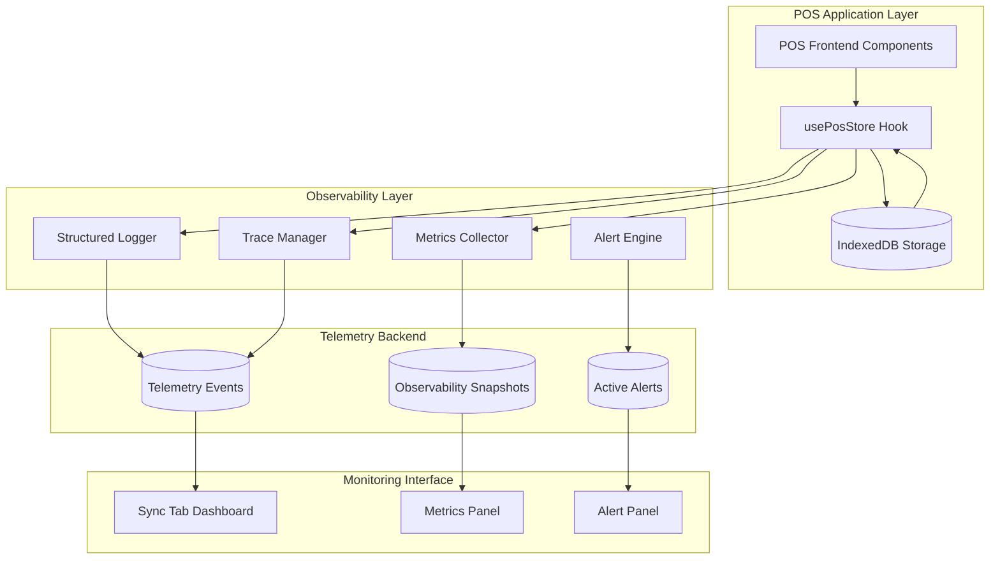
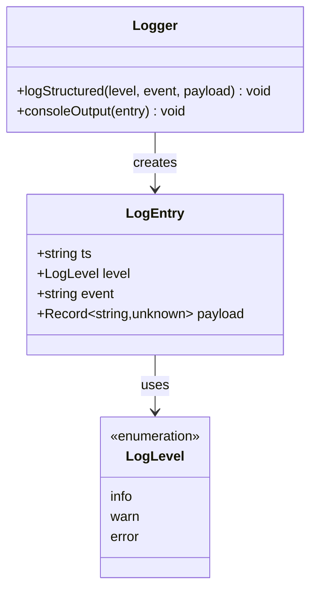
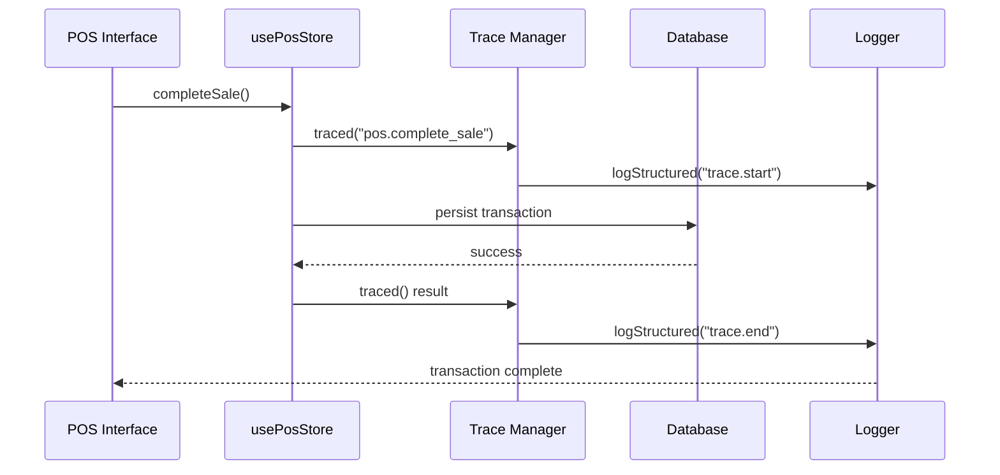
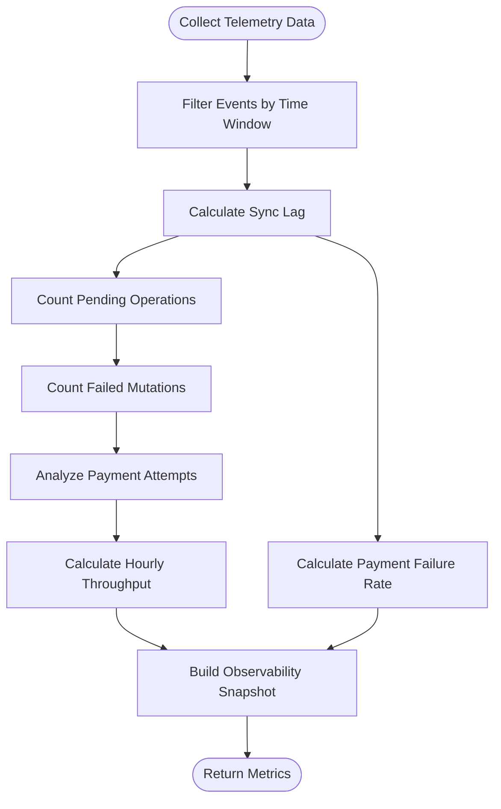
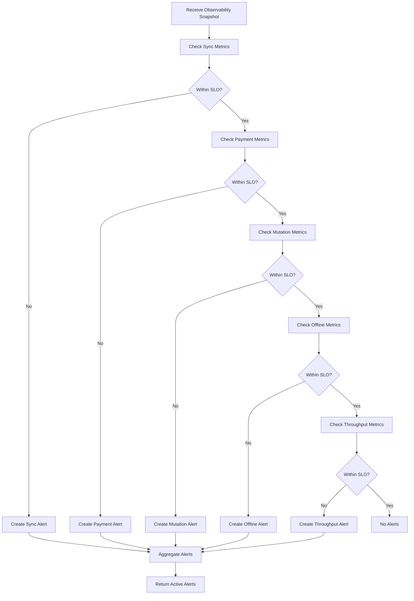
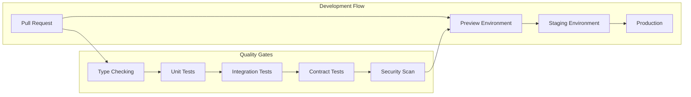
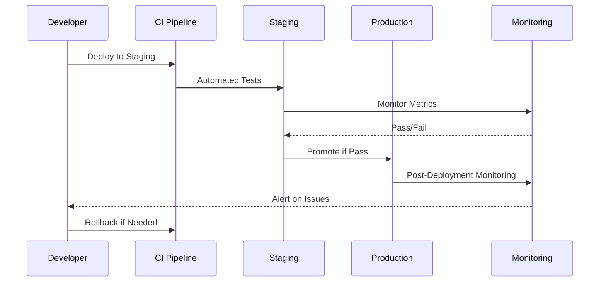
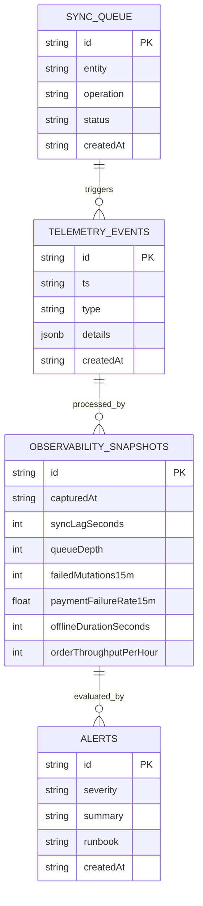
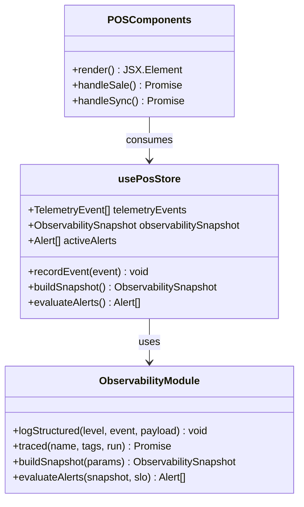

# Observability and Telemetry System

<cite>
**Referenced Files in This Document**
- [observability.ts](file://web-prototype/src/lib/observability.ts)
- [observability.test.ts](file://web-prototype/src/lib/observability.test.ts)
- [use-pos-store.ts](file://web-prototype/src/lib/use-pos-store.ts)
- [pos-prototype.tsx](file://web-prototype/src/components/pos-prototype.tsx)
- [observability.md](file://web-prototype/docs/observability.md)
- [sync-backlog.md](file://web-prototype/docs/runbooks/sync-backlog.md)
- [terminal-mismatch.md](file://web-prototype/docs/runbooks/terminal-mismatch.md)
- [register-outage.md](file://web-prototype/docs/runbooks/register-outage.md)
- [rollout-strategy.md](file://web-prototype/docs/rollout-strategy.md)
- [activity-log.ndjson](file://shared-memory/activity-log.ndjson)
- [state.md](file://shared-memory/state.md)
- [db.ts](file://web-prototype/src/lib/db.ts)
- [types.ts](file://web-prototype/src/lib/types.ts)
- [package.json](file://web-prototype/package.json)
</cite>

## Table of Contents
1. [Introduction](#introduction)
2. [System Architecture](#system-architecture)
3. [Core Components](#core-components)
4. [Telemetry Events](#telemetry-events)
5. [Metrics and SLOs](#metrics-and-slots)
6. [Alerting System](#alerting-system)
7. [Runbooks and Incident Response](#runbooks-and-incident-response)
8. [Deployment and Rollout Strategy](#deployment-and-rollout-strategy)
9. [Implementation Details](#implementation-details)
10. [Performance Considerations](#performance-considerations)
11. [Troubleshooting Guide](#troubleshooting-guide)
12. [Conclusion](#conclusion)

## Introduction

The Observability and Telemetry System is a comprehensive monitoring solution designed for the PharmaSpot Web POS prototype. This system provides real-time visibility into the point-of-sale operations, enabling proactive incident detection and rapid response to operational issues. The system combines structured logging, distributed tracing, business metrics collection, and automated alerting to create a complete observability framework tailored for retail POS environments.

The system is built around six key business metrics with defined Service Level Objectives (SLOs), covering sync performance, payment reliability, operational throughput, and system availability. It integrates seamlessly with the Next.js frontend architecture and provides actionable insights through integrated runbooks and automated triage workflows.

## System Architecture

The observability system follows a modular architecture that integrates with the POS application's core functionality:

**Diagram sources**
- [use-pos-store.ts:51-434](file://web-prototype/src/lib/use-pos-store.ts#L51-L434)
- [observability.ts:1-196](file://web-prototype/src/lib/observability.ts#L1-L196)

The architecture ensures that observability is embedded throughout the application lifecycle, from user interactions to backend operations, providing comprehensive visibility without disrupting core POS functionality.

## Core Components

### Structured Logging System

The logging system provides standardized JSON output for all operational events, supporting three log levels: info, warn, and error. Each log entry includes timestamp, level, event identifier, and structured payload data.

**Diagram sources**
- [observability.ts:1-68](file://web-prototype/src/lib/observability.ts#L1-L68)

### Distributed Tracing Framework

The tracing system enables end-to-end monitoring of critical POS operations, particularly the sale completion process. Each trace includes unique identifiers, timing information, and execution status.

**Diagram sources**
- [use-pos-store.ts:206-260](file://web-prototype/src/lib/use-pos-store.ts#L206-L260)
- [observability.ts:70-94](file://web-prototype/src/lib/observability.ts#L70-L94)

### Metrics Collection Engine

The metrics engine collects and processes business-critical data points to generate observability snapshots containing six key performance indicators.

**Section sources**
- [observability.ts:105-144](file://web-prototype/src/lib/observability.ts#L105-L144)
- [use-pos-store.ts:374-382](file://web-prototype/src/lib/use-pos-store.ts#L374-L382)

## Telemetry Events

The system captures a comprehensive set of business telemetry events that provide insights into POS operations:

| Event Type | Description | Trigger Conditions |
|------------|-------------|-------------------|
| `sync_enqueued` | New sync operation queued | Transaction creation, inventory updates |
| `sync_completed` | Sync operation completed successfully | Background sync processing |
| `sync_failed` | Sync operation failed | Network errors, validation failures |
| `mutation_failed` | Local database operation failed | Data persistence errors |
| `payment_attempt` | Payment processing attempt | Sale completion attempts |
| `network_state` | Network connectivity change | Browser online/offline events |
| `order_completed` | Successful sale transaction | Payment approved |

Each event includes contextual details such as timestamps, operation parameters, and status information, enabling detailed forensic analysis and trend monitoring.

**Section sources**
- [observability.ts:3-14](file://web-prototype/src/lib/observability.ts#L3-L14)
- [use-pos-store.ts:233-246](file://web-prototype/src/lib/use-pos-store.ts#L233-L246)

## Metrics and SLOs

The observability system monitors six critical business metrics with predefined Service Level Objectives:

### Core Metrics

| Metric | Definition | Current SLO | Breach Threshold |
|--------|------------|-------------|------------------|
| **Sync Lag** | Age of oldest pending sync item (seconds) | ≤ 300s | > 300s |
| **Queue Depth** | Pending sync operations count | ≤ 25 items | > 25 items |
| **Failed Mutations (15m)** | Local write failures in 15 minutes | ≤ 5 | > 5 |
| **Payment Failure Rate (15m)** | Non-paid payment attempts | ≤ 5% | > 5% |
| **Offline Duration** | Continuous offline seconds | ≤ 900s | > 900s |
| **Order Throughput** | Completed orders per hour | ≥ 12/hr | < 12/hr |

### Snapshot Generation Process

**Diagram sources**
- [observability.ts:105-144](file://web-prototype/src/lib/observability.ts#L105-L144)

**Section sources**
- [observability.md:5-12](file://web-prototype/docs/observability.md#L5-L12)
- [observability.ts:16-33](file://web-prototype/src/lib/observability.ts#L16-L33)

## Alerting System

The alerting system automatically evaluates current metrics against SLO targets and generates actionable alerts with severity levels and runbook references.

### Alert Types and Severity

| Alert ID | Severity | Trigger Condition | Runbook |
|----------|----------|-------------------|---------|
| `sync-backlog` | Warning/Critical | Queue depth > 25 OR sync lag > 300s | [Sync Backlog](file://web-prototype/docs/runbooks/sync-backlog.md) |
| `payment-failure-spike` | Warning/Critical | Payment failure rate > 5% | [Terminal Mismatch](file://web-prototype/docs/runbooks/terminal-mismatch.md) |
| `mutation-failures` | Critical | Failed mutations > 5/15m | [Register Outage](file://web-prototype/docs/runbooks/register-outage.md) |
| `offline-duration` | Warning | Offline > 900s | [Register Outage](file://web-prototype/docs/runbooks/register-outage.md) |
| `throughput-drop` | Warning | Throughput < 12/hr | [Register Outage](file://web-prototype/docs/runbooks/register-outage.md) |

### Alert Evaluation Logic

**Diagram sources**
- [observability.ts:146-195](file://web-prototype/src/lib/observability.ts#L146-L195)

**Section sources**
- [observability.md:14-22](file://web-prototype/docs/observability.md#L14-L22)
- [observability.ts:146-195](file://web-prototype/src/lib/observability.ts#L146-L195)

## Runbooks and Incident Response

Each alert type includes a comprehensive runbook with step-by-step resolution procedures and validation criteria.

### Sync Backlog Resolution

The sync backlog runbook provides a structured approach to resolving synchronization delays:

1. **Connectivity Verification**: Confirm network status and POS registration
2. **Immediate Action**: Execute manual sync to flush pending operations
3. **Root Cause Analysis**: Identify dominant pending operation types
4. **Escalation Criteria**: Freeze non-essential operations if backlog persists

### Payment Error Investigation

The terminal mismatch runbook focuses on payment processing failures:

1. **Reference Validation**: Cross-reference POS payment references with terminal receipts
2. **Terminal Configuration**: Verify correct store/register profile assignment
3. **Fallback Implementation**: Route affected lanes to cash/manual processing
4. **Validation Testing**: Confirm successful transactions after corrections

### Register Outage Management

The register outage runbook addresses complete system failures:

1. **Scope Assessment**: Determine single vs. multi-register impact
2. **Isolation Strategy**: Switch to offline mode for local operation
3. **System Validation**: Test IndexedDB availability and basic operations
4. **Recovery Procedures**: Failover to backup registers if necessary

**Section sources**
- [sync-backlog.md:1-25](file://web-prototype/docs/runbooks/sync-backlog.md#L1-L25)
- [terminal-mismatch.md:1-25](file://web-prototype/docs/runbooks/terminal-mismatch.md#L1-L25)
- [register-outage.md:1-25](file://web-prototype/docs/runbooks/register-outage.md#L1-L25)

## Deployment and Rollout Strategy

The observability system integrates with a comprehensive deployment pipeline ensuring safe, monitored releases across environments.

### Multi-Environment Strategy

**Diagram sources**
- [rollout-strategy.md:1-23](file://web-prototype/docs/rollout-strategy.md#L1-L23)

### Feature Flag Management

The system employs a kill-switch mechanism for gradual feature rollout:

- **Sync Control**: Enable/disable online synchronization
- **Payment Processing**: Toggle external terminal integration
- **Refund Operations**: Control refund functionality
- **Runtime Updates**: Modify flags without redeployment

### Rollback Verification

The deployment pipeline includes automated rollback testing:

**Diagram sources**
- [rollout-strategy.md:18-23](file://web-prototype/docs/rollout-strategy.md#L18-L23)

**Section sources**
- [rollout-strategy.md:1-23](file://web-prototype/docs/rollout-strategy.md#L1-L23)
- [db.ts:175-184](file://web-prototype/src/lib/db.ts#L175-L184)

## Implementation Details

### Data Persistence Integration

The observability system integrates with the IndexedDB storage layer to maintain telemetry data alongside POS operations:

**Diagram sources**
- [types.ts:107-125](file://web-prototype/src/lib/types.ts#L107-L125)
- [observability.ts:25-40](file://web-prototype/src/lib/observability.ts#L25-L40)

### React Integration Pattern

The observability system leverages React hooks for seamless integration:

**Diagram sources**
- [use-pos-store.ts:51-434](file://web-prototype/src/lib/use-pos-store.ts#L51-L434)
- [observability.ts:1-196](file://web-prototype/src/lib/observability.ts#L1-L196)

**Section sources**
- [use-pos-store.ts:79-82](file://web-prototype/src/lib/use-pos-store.ts#L79-L82)
- [use-pos-store.ts:374-387](file://web-prototype/src/lib/use-pos-store.ts#L374-L387)

## Performance Considerations

### Memory Management

The system implements efficient memory management for telemetry data:

- **Event Limiting**: Maintains only the most recent 400 events
- **Window-Based Calculations**: Uses time-based filtering for metrics
- **Snapshot Caching**: Memoized calculations to avoid redundant computations

### Real-Time Processing

The observability engine is optimized for real-time performance:

- **Debounced Updates**: Network state changes trigger coordinated updates
- **Batch Operations**: Multiple database operations are batched for efficiency
- **Async Processing**: Long-running operations use non-blocking patterns

### Scalability Design

The system scales horizontally across multiple POS terminals:

- **Decentralized Metrics**: Each terminal maintains independent telemetry
- **Centralized Alerting**: Aggregated alert evaluation across locations
- **Configurable SLOs**: Adjustable thresholds per location or environment

## Troubleshooting Guide

### Common Issues and Solutions

| Issue | Symptoms | Diagnostic Steps | Resolution |
|-------|----------|------------------|------------|
| **Sync Queue Backlog** | Elevated sync lag, delayed inventory updates | Check network connectivity, review sync logs | Execute manual sync, verify terminal connectivity |
| **Payment Processing Failures** | Repeated payment attempt failures | Validate terminal configuration, check payment references | Reset terminal connection, enable cash fallback |
| **Mutation Failures** | Database operation errors, data inconsistencies | Review transaction logs, check IndexedDB health | Restart POS session, verify database permissions |
| **High Offline Duration** | Extended offline periods, data accumulation | Monitor network stability, check power/infrastructure | Implement offline mode protocols, schedule maintenance |

### Debug Information Access

The system provides multiple channels for diagnostic information:

- **Console Logs**: Structured JSON output for all operations
- **Trace Spans**: Detailed timing and execution information
- **Metrics Dashboard**: Real-time visualization of business metrics
- **Alert History**: Complete record of triggered incidents

**Section sources**
- [observability.test.ts:1-48](file://web-prototype/src/lib/observability.test.ts#L1-L48)
- [activity-log.ndjson:1-45](file://shared-memory/activity-log.ndjson#L1-L45)

## Conclusion

The Observability and Telemetry System represents a comprehensive monitoring solution specifically designed for POS environments. By combining structured logging, distributed tracing, business metrics collection, and automated alerting, the system provides the operational visibility necessary for reliable point-of-sale operations.

The modular architecture ensures seamless integration with existing POS functionality while maintaining separation of concerns. The comprehensive runbook system and automated triage procedures enable rapid incident response and resolution.

Key strengths of the system include:

- **Business-Focused Metrics**: Six SLOs directly aligned with POS operational goals
- **Real-Time Monitoring**: Immediate visibility into system performance and health
- **Actionable Insights**: Integrated runbooks and escalation procedures
- **Safe Deployment**: Gradual rollout capabilities with rollback verification
- **Scalable Design**: Architecture supports multiple POS locations and terminals

The system establishes a foundation for continuous improvement and operational excellence in retail POS environments, providing the tools necessary for proactive monitoring and rapid incident response.