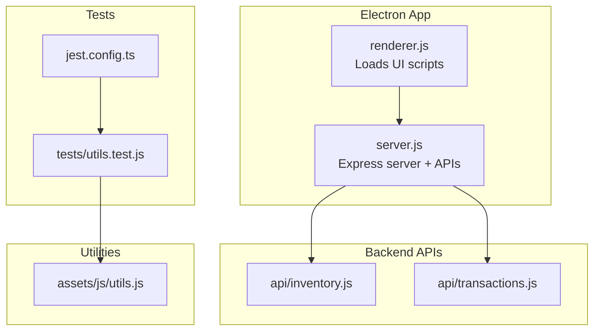
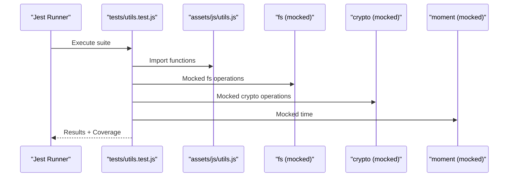
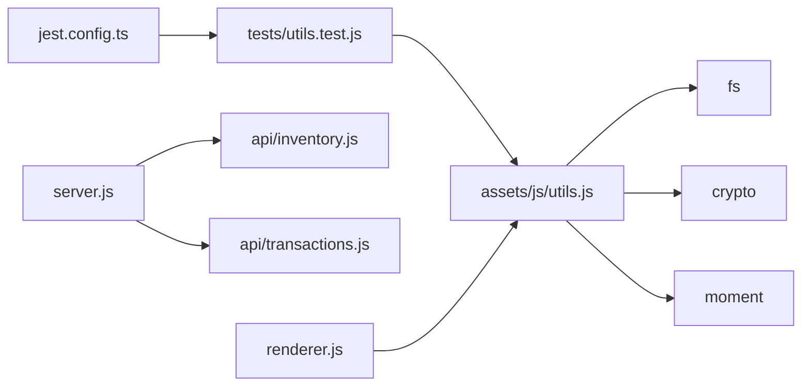

# Testing Strategy

<cite>
**Referenced Files in This Document**
- [jest.config.ts](file://jest.config.ts)
- [package.json](file://package.json)
- [tests/utils.test.js](file://tests/utils.test.js)
- [assets/js/utils.js](file://assets/js/utils.js)
- [api/inventory.js](file://api/inventory.js)
- [api/transactions.js](file://api/transactions.js)
- [server.js](file://server.js)
- [renderer.js](file://renderer.js)
- [.eslintrc.yml](file://.eslintrc.yml)
- [.github/workflows/build.yml](file://.github/workflows/build.yml)
- [.github/workflows/release.yml](file://.github/workflows/release.yml)
- [README.md](file://README.md)
</cite>

## Table of Contents
1. [Introduction](#introduction)
2. [Project Structure](#project-structure)
3. [Core Components](#core-components)
4. [Architecture Overview](#architecture-overview)
5. [Detailed Component Analysis](#detailed-component-analysis)
6. [Dependency Analysis](#dependency-analysis)
7. [Performance Considerations](#performance-considerations)
8. [Troubleshooting Guide](#troubleshooting-guide)
9. [Conclusion](#conclusion)
10. [Appendices](#appendices)

## Introduction
This document defines a comprehensive testing strategy for PharmaSpot POS. It covers the Jest configuration, test structure, execution process, and practical guidance for unit, integration, and Electron-specific testing. It also outlines coverage expectations, mocking strategies, test data management, continuous integration, debugging, performance and security considerations, and maintenance procedures.

## Project Structure
PharmaSpot POS is an Electron application with a Node.js backend exposing REST endpoints and a renderer process that consumes those endpoints. Tests currently focus on utility functions located under the tests directory and leverage Jest’s Node environment.

**Diagram sources**
- [renderer.js:1-5](file://renderer.js#L1-L5)
- [server.js:1-68](file://server.js#L1-L68)
- [api/inventory.js:1-333](file://api/inventory.js#L1-L333)
- [api/transactions.js:1-251](file://api/transactions.js#L1-L251)
- [jest.config.ts:1-200](file://jest.config.ts#L1-L200)
- [tests/utils.test.js:1-191](file://tests/utils.test.js#L1-L191)
- [assets/js/utils.js:1-112](file://assets/js/utils.js#L1-L112)

**Section sources**
- [README.md:70-77](file://README.md#L70-L77)
- [jest.config.ts:1-200](file://jest.config.ts#L1-L200)
- [tests/utils.test.js:1-191](file://tests/utils.test.js#L1-L191)
- [assets/js/utils.js:1-112](file://assets/js/utils.js#L1-L112)
- [server.js:1-68](file://server.js#L1-L68)
- [api/inventory.js:1-333](file://api/inventory.js#L1-L333)
- [api/transactions.js:1-251](file://api/transactions.js#L1-L251)

## Core Components
- Jest configuration enables coverage collection with V8, clears mocks between tests, and targets Node environment. Coverage output is directed to a coverage directory.
- Utility tests validate formatting, date calculations, stock status, file existence, hashing, and CSP setup.
- Backend APIs expose CRUD and business logic endpoints for inventory and transactions.
- Renderer initializes UI and integrates with backend APIs.

Key capabilities evidenced by configuration and tests:
- Unit testing of pure functions and file/CSP helpers.
- Environment-driven port and app paths for server and API persistence.
- Express middleware for CORS and rate limiting.

**Section sources**
- [jest.config.ts:18-37](file://jest.config.ts#L18-L37)
- [tests/utils.test.js:1-191](file://tests/utils.test.js#L1-L191)
- [assets/js/utils.js:1-112](file://assets/js/utils.js#L1-L112)
- [server.js:1-68](file://server.js#L1-L68)
- [api/inventory.js:1-333](file://api/inventory.js#L1-L333)
- [api/transactions.js:1-251](file://api/transactions.js#L1-L251)

## Architecture Overview
The testing architecture centers on Jest running in Node environment, validating utility functions and simulating API interactions indirectly through module mocking. Integration-style tests can be introduced to exercise server routes and database interactions.

**Diagram sources**
- [jest.config.ts:18-37](file://jest.config.ts#L18-L37)
- [tests/utils.test.js:1-191](file://tests/utils.test.js#L1-L191)
- [assets/js/utils.js:1-112](file://assets/js/utils.js#L1-L112)

## Detailed Component Analysis

### Jest Configuration and Execution
- Coverage: Enabled with V8 provider and output to coverage directory.
- Environment: Node environment suitable for backend and utility tests.
- Mock clearing: Automatic clearing of mocks between tests.
- Test discovery: Default Jest patterns apply; tests can be placed under tests or named with spec/test suffixes.
- Scripts: npm test invokes Jest.

Recommendations:
- Add coverage thresholds to enforce minimum coverage.
- Introduce setup files to initialize shared mocks or environment variables.
- Configure reporters for CI-friendly output.

**Section sources**
- [jest.config.ts:18-37](file://jest.config.ts#L18-L37)
- [jest.config.ts:158-161](file://jest.config.ts#L158-L161)
- [package.json](file://package.json#L101)

### Utility Functions Testing
Focus areas validated by tests:
- Currency formatting across locales.
- Expiry calculation and expiration checks using mocked time.
- Stock status classification with edge cases and invalid inputs.
- File existence and hashing with mocked filesystem and crypto.

Mocking strategies demonstrated:
- jest.mock for fs and crypto.
- jest.mock for moment to control time-dependent assertions.
- beforeEach/afterEach to prepare and reset mocks.

Best practices:
- Keep tests deterministic by mocking external dependencies.
- Validate boundary conditions and error paths.
- Use descriptive test names and group related assertions.

**Section sources**
- [tests/utils.test.js:1-191](file://tests/utils.test.js#L1-L191)
- [assets/js/utils.js:1-112](file://assets/js/utils.js#L1-L112)

### API Endpoints Testing
Current state:
- Tests cover utility functions; API tests are not present.

Recommended approach:
- For inventory and transactions endpoints, create integration tests that:
  - Start the server programmatically.
  - Use supertest or fetch to hit endpoints.
  - Mock database interactions (NeDB) to isolate logic.
  - Assert HTTP status codes, JSON responses, and side effects.

Security and validation:
- Validate sanitization and escaping logic.
- Test error handling paths and rate-limiting behavior.

**Section sources**
- [api/inventory.js:1-333](file://api/inventory.js#L1-L333)
- [api/transactions.js:1-251](file://api/transactions.js#L1-L251)
- [server.js:1-68](file://server.js#L1-L68)

### Electron Application Testing
Current state:
- Tests run in Node environment; Electron-specific renderer/UI tests are not present.

Recommended approach:
- Use Playwright or Spectron to test the full Electron app lifecycle.
- For renderer logic, consider isolating logic into modules that can be unit-tested with Jest and mocked Electron APIs.
- Use preload scripts and IPC mocking to simulate communication with main process.

**Section sources**
- [renderer.js:1-5](file://renderer.js#L1-L5)
- [assets/js/utils.js:91-99](file://assets/js/utils.js#L91-L99)

### Asynchronous Testing Patterns
- Use async/await in tests for promises and callbacks.
- For time-based logic, use fake timers or mocked time to control determinism.
- For I/O-bound operations, rely on Jest’s built-in async support and clear mocks afterward.

**Section sources**
- [tests/utils.test.js:28-31](file://tests/utils.test.js#L28-L31)
- [jest.config.ts:55-58](file://jest.config.ts#L55-L58)

### Integration Testing Approaches
- Start server programmatically in a test hook.
- Use a separate test database path to avoid polluting development data.
- Validate chained operations (e.g., creating a transaction triggers inventory decrement).

**Section sources**
- [api/transactions.js:176-178](file://api/transactions.js#L176-L178)
- [api/inventory.js:302-332](file://api/inventory.js#L302-L332)

### Test Coverage Requirements
- Enforce minimum thresholds for statements, branches, functions, and lines.
- Focus on high-risk paths: validation, sanitization, error handling, and business logic.
- Track coverage over time and gate pull requests on coverage thresholds.

**Section sources**
- [jest.config.ts:46-47](file://jest.config.ts#L46-L47)

### Test Data Management
- Use factories or builders to generate deterministic test data.
- For database-backed endpoints, seed test data and clean up after each suite.
- For file operations, create temporary files or mock filesystem responses.

**Section sources**
- [tests/utils.test.js:163-191](file://tests/utils.test.js#L163-L191)
- [assets/js/utils.js:55-73](file://assets/js/utils.js#L55-L73)

### Continuous Testing and CI
- GitHub Actions workflows build installers but do not run tests. Add a job to run Jest and publish coverage artifacts.
- Cache dependencies to speed up CI runs.
- Parallelize jobs across operating systems.

**Section sources**
- [.github/workflows/build.yml:1-61](file://.github/workflows/build.yml#L1-L61)
- [.github/workflows/release.yml:1-69](file://.github/workflows/release.yml#L1-L69)

## Dependency Analysis
Jest depends on Node environment and V8 coverage. Utilities depend on fs, crypto, and moment. APIs depend on NeDB, multer, validator, and express. Renderer depends on jQuery and Electron APIs.

**Diagram sources**
- [jest.config.ts:1-200](file://jest.config.ts#L1-L200)
- [tests/utils.test.js:1-191](file://tests/utils.test.js#L1-L191)
- [assets/js/utils.js:1-112](file://assets/js/utils.js#L1-L112)
- [server.js:1-68](file://server.js#L1-L68)
- [api/inventory.js:1-333](file://api/inventory.js#L1-L333)
- [api/transactions.js:1-251](file://api/transactions.js#L1-L251)
- [renderer.js:1-5](file://renderer.js#L1-L5)

**Section sources**
- [jest.config.ts:1-200](file://jest.config.ts#L1-L200)
- [assets/js/utils.js:1-112](file://assets/js/utils.js#L1-L112)
- [server.js:1-68](file://server.js#L1-L68)
- [api/inventory.js:1-333](file://api/inventory.js#L1-L333)
- [api/transactions.js:1-251](file://api/transactions.js#L1-L251)
- [renderer.js:1-5](file://renderer.js#L1-L5)

## Performance Considerations
- Prefer mocking expensive I/O to keep unit tests fast.
- Use fake timers to avoid real-time waits.
- Limit heavy computations in hot paths; add benchmarks alongside critical logic.
- For integration tests, reuse a single server instance across tests to reduce startup overhead.

## Troubleshooting Guide
Common issues and resolutions:
- Missing coverage: Ensure collectCoverage is enabled and coverageDirectory is set.
- Time-sensitive failures: Mock time libraries or use fake timers.
- File operation errors: Mock fs and crypto to return deterministic results.
- API test flakiness: Use isolated test databases and deterministic IDs.
- CI failures: Add explicit test jobs and cache dependencies.

**Section sources**
- [jest.config.ts:22-28](file://jest.config.ts#L22-L28)
- [tests/utils.test.js:14-16](file://tests/utils.test.js#L14-L16)
- [tests/utils.test.js:28-31](file://tests/utils.test.js#L28-L31)

## Conclusion
The current testing setup focuses on utility functions with strong mocking and coverage. To mature the suite, introduce API integration tests, expand coverage thresholds, and add Electron UI tests. Align CI with test execution and coverage reporting for reliable quality gates.

## Appendices

### Test Execution Commands
- Run all tests: npm test
- Watch mode: jest --watch
- Coverage report: jest --coverage

**Section sources**
- [package.json](file://package.json#L101)

### Linting and Style
- ESLint configured for browser/commonjs and ES2021.
- Apply lint-staged and pre-commit hooks to enforce style in CI.

**Section sources**
- [.eslintrc.yml:1-8](file://.eslintrc.yml#L1-L8)

### Security Testing Considerations
- Validate input sanitization and escaping in API endpoints.
- Test Content-Security-Policy generation and hash updates when assets change.
- Audit rate-limiting and CORS headers.

**Section sources**
- [assets/js/utils.js:91-99](file://assets/js/utils.js#L91-L99)
- [server.js:11-34](file://server.js#L11-L34)
- [api/inventory.js:145-147](file://api/inventory.js#L145-L147)

### Test Maintenance Procedures
- Regularly update mocks when dependencies change.
- Refactor tests to reflect evolving business logic.
- Rotate ownership and review test coverage during code reviews.