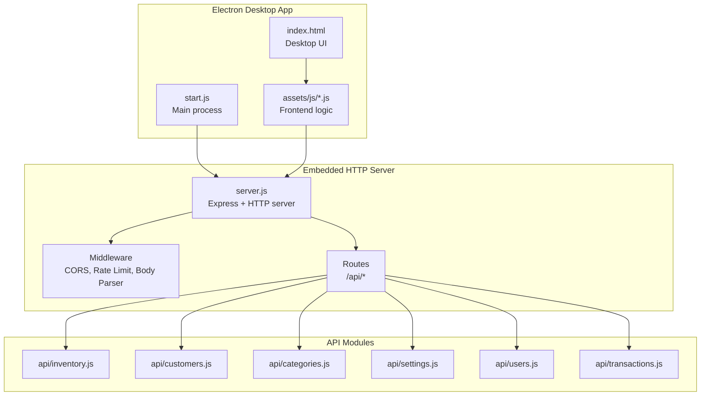
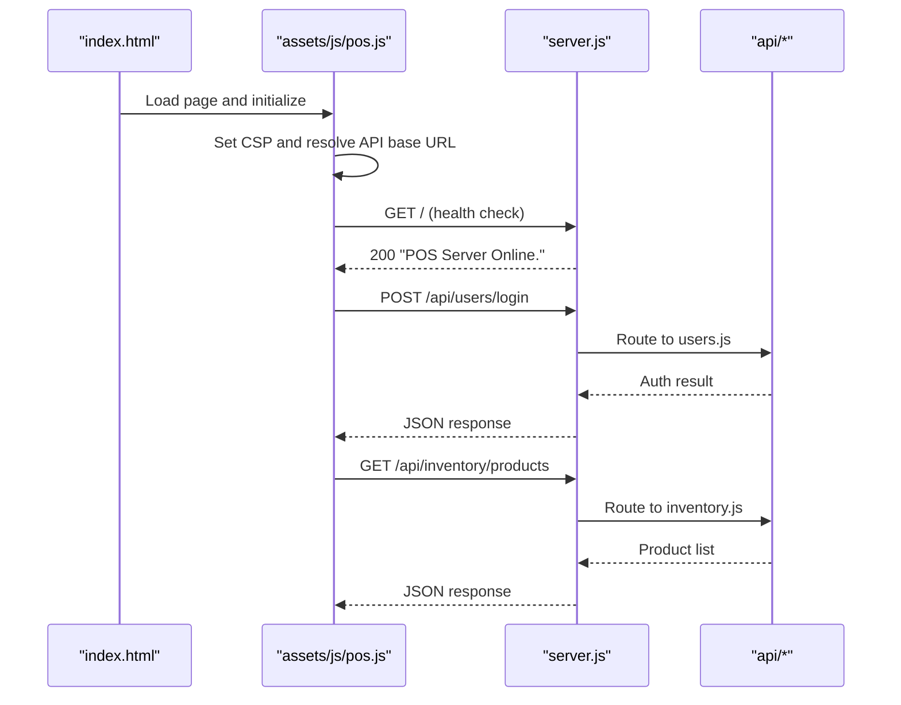
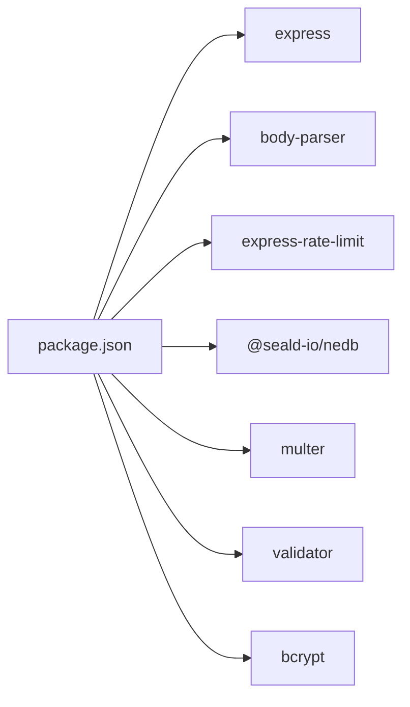

# Embedded HTTP Server

<cite>
**Referenced Files in This Document**
- [server.js](file://server.js)
- [package.json](file://package.json)
- [start.js](file://start.js)
- [index.html](file://index.html)
- [assets/js/utils.js](file://assets/js/utils.js)
- [assets/js/pos.js](file://assets/js/pos.js)
- [assets/js/checkout.js](file://assets/js/checkout.js)
- [api/inventory.js](file://api/inventory.js)
- [api/customers.js](file://api/customers.js)
- [api/categories.js](file://api/categories.js)
- [api/settings.js](file://api/settings.js)
- [api/users.js](file://api/users.js)
- [api/transactions.js](file://api/transactions.js)
</cite>

## Table of Contents
1. [Introduction](#introduction)
2. [Project Structure](#project-structure)
3. [Core Components](#core-components)
4. [Architecture Overview](#architecture-overview)
5. [Detailed Component Analysis](#detailed-component-analysis)
6. [Dependency Analysis](#dependency-analysis)
7. [Performance Considerations](#performance-considerations)
8. [Troubleshooting Guide](#troubleshooting-guide)
9. [Conclusion](#conclusion)
10. [Appendices](#appendices)

## Introduction
This document describes the embedded Express.js HTTP server used by the desktop application. It covers server initialization, middleware configuration (CORS, rate limiting, and security headers), routing structure, request/response handling, error management, and the integration between the Electron desktop app and the web server. It also documents security measures (Content Security Policy, input validation, and authentication), performance considerations, connection pooling, resource management, and monitoring/logging configurations suitable for production deployments.

## Project Structure
The embedded server is initialized within the Electron main process and exposes REST endpoints grouped under /api. The desktop app loads the UI via a local HTML file and communicates with the server using HTTP requests.

**Diagram sources**
- [server.js:1-68](file://server.js#L1-L68)
- [start.js:1-107](file://start.js#L1-L107)
- [index.html:1-884](file://index.html#L1-L884)
- [assets/js/pos.js:45-48](file://assets/js/pos.js#L45-L48)
- [api/inventory.js:1-333](file://api/inventory.js#L1-L333)
- [api/customers.js:1-151](file://api/customers.js#L1-L151)
- [api/categories.js:1-124](file://api/categories.js#L1-L124)
- [api/settings.js:1-192](file://api/settings.js#L1-L192)
- [api/users.js:1-311](file://api/users.js#L1-L311)
- [api/transactions.js:1-251](file://api/transactions.js#L1-L251)

**Section sources**
- [server.js:1-68](file://server.js#L1-L68)
- [start.js:1-107](file://start.js#L1-L107)
- [index.html:1-884](file://index.html#L1-L884)
- [assets/js/pos.js:45-48](file://assets/js/pos.js#L45-L48)

## Core Components
- Embedded Express server and HTTP server creation
- Middleware stack: body parsing, rate limiting, CORS preflight handling
- Route registration for API modules
- Server lifecycle and restart mechanism
- Frontend integration via local HTML and JavaScript

Key implementation references:
- Server creation and middleware: [server.js:1-68](file://server.js#L1-L68)
- Route mounting: [server.js:40-45](file://server.js#L40-L45)
- Restart function: [server.js:55-66](file://server.js#L55-L66)
- Electron main process bootstrapping: [start.js:1-107](file://start.js#L1-L107)
- Frontend API base URL: [assets/js/pos.js:45-48](file://assets/js/pos.js#L45-L48)

**Section sources**
- [server.js:1-68](file://server.js#L1-L68)
- [start.js:1-107](file://start.js#L1-L107)
- [assets/js/pos.js:45-48](file://assets/js/pos.js#L45-L48)

## Architecture Overview
The Electron main process initializes the embedded server and serves the desktop UI. The frontend JavaScript constructs API URLs using the server’s runtime port and sends HTTP requests to the mounted routes. The server applies global middleware and forwards requests to the appropriate API module.

**Diagram sources**
- [server.js:36-45](file://server.js#L36-L45)
- [assets/js/pos.js:45-48](file://assets/js/pos.js#L45-L48)
- [api/users.js:95-131](file://api/users.js#L95-L131)
- [api/inventory.js:111-115](file://api/inventory.js#L111-L115)

## Detailed Component Analysis

### Server Initialization and Lifecycle
- Creates an HTTP server backed by Express.
- Sets APPDATA and APPNAME environment variables for database paths.
- Starts listening on a configurable port, persisting the actual port in environment variables.
- Provides a restart function that closes the server, clears module cache for API and server modules, and re-executes server startup.

Operational implications:
- Port selection respects environment variable overrides.
- Restart clears cached modules to reload route handlers and server logic.

**Section sources**
- [server.js:1-68](file://server.js#L1-L68)

### Middleware Configuration
- Body parsing for JSON and URL-encoded payloads.
- Global rate limiting applied to all routes.
- CORS handling:
  - Sets Access-Control-Allow-Origin to wildcard for broad compatibility.
  - Allows GET, PUT, POST, DELETE, OPTIONS methods.
  - Accepts Content-type, Accept, X-Access-Token, X-Key headers.
  - Handles preflight OPTIONS by returning 200 without further processing.

Security considerations:
- Wildcard origin relaxes same-origin policy; ensure trusted clients and consider tightening in production.
- No explicit security headers are set globally; CSP is enforced client-side.

**Section sources**
- [server.js:18-34](file://server.js#L18-L34)

### Routing Structure and Request/Response Handling
The server mounts API modules under /api with specific prefixes:
- /api/inventory → inventory routes
- /api/customers → customers routes
- /api/categories → categories routes
- /api/settings → settings routes
- /api/users → users routes
- /api → transactions routes

Each API module:
- Initializes its own Express app and datastore.
- Applies JSON body parsing.
- Defines CRUD endpoints with consistent error handling patterns:
  - Logs errors to console.
  - Returns structured JSON error responses with 500 status on internal failures.
  - Uses validators and sanitizers for input where applicable.

Example patterns:
- Health checks: GET /
- Retrieve lists: GET /all, GET /products
- Retrieve by ID: GET /product/:productId, GET /customer/:customerId
- Create/update: POST /product, POST /customer, POST /category, POST /post, POST /new
- Delete: DELETE /product/:productId, DELETE /customer/:customerId, DELETE /category/:categoryId
- Specialized flows: decrementInventory invoked by transactions

**Section sources**
- [server.js:40-45](file://server.js#L40-L45)
- [api/inventory.js:78-294](file://api/inventory.js#L78-L294)
- [api/customers.js:36-151](file://api/customers.js#L36-L151)
- [api/categories.js:35-124](file://api/categories.js#L35-L124)
- [api/settings.js:60-192](file://api/settings.js#L60-L192)
- [api/users.js:35-311](file://api/users.js#L35-L311)
- [api/transactions.js:35-251](file://api/transactions.js#L35-L251)

### Error Management
- Centralized logging via console.error on API failures.
- Standardized JSON error payloads with error and message fields.
- Status codes:
  - 400 for upload/Multer errors.
  - 500 for internal server errors.
  - 200 for successful operations.

Recommendations:
- Add centralized error handling middleware to unify responses and integrate with a logging framework.
- Consider structured logging with timestamps and correlation IDs for production.

**Section sources**
- [api/inventory.js:125-141](file://api/inventory.js#L125-L141)
- [api/inventory.js:195-218](file://api/inventory.js#L195-L218)
- [api/customers.js:82-94](file://api/customers.js#L82-L94)
- [api/categories.js:59-72](file://api/categories.js#L59-L72)
- [api/settings.js:90-107](file://api/settings.js#L90-L107)
- [api/users.js:179-259](file://api/users.js#L179-L259)
- [api/transactions.js:163-181](file://api/transactions.js#L163-L181)

### Integration Between Desktop Application and Web Server
- Electron main process starts the server and creates the BrowserWindow.
- Frontend resolves the API base URL using the server’s runtime port.
- The UI sets Content-Security-Policy via a meta tag generated from hashed assets.

Key integration points:
- Server start and port persistence: [server.js:47-50](file://server.js#L47-L50)
- Electron main process wiring: [start.js:1-107](file://start.js#L1-L107)
- API base URL construction: [assets/js/pos.js:45-48](file://assets/js/pos.js#L45-L48)
- CSP generation and injection: [assets/js/utils.js:91-99](file://assets/js/utils.js#L91-L99), [assets/js/pos.js:96-97](file://assets/js/pos.js#L96-L97)

**Section sources**
- [server.js:47-50](file://server.js#L47-L50)
- [start.js:1-107](file://start.js#L1-L107)
- [assets/js/pos.js:45-48](file://assets/js/pos.js#L45-L48)
- [assets/js/utils.js:91-99](file://assets/js/utils.js#L91-L99)

### Security Implementations
- Content Security Policy (CSP):
  - Generated client-side using hashes of bundled JS/CSS.
  - Includes connect-src pointing to localhost plus the server port.
- Input validation and sanitization:
  - Validator library used to sanitize inputs in several endpoints.
  - Multer file upload filtering restricts allowed MIME types and enforces size limits.
- Authentication:
  - Users login endpoint compares bcrypt-hashed passwords.
  - Frontend stores auth state locally and uses it to gate UI actions.

Areas to strengthen:
- Add server-side security headers (e.g., HSTS, X-Content-Type-Options, X-Frame-Options).
- Tighten CORS origin to the app’s origin in production.
- Enforce HTTPS and secure cookies if exposing the server externally.
- Implement JWT-based session tokens and CSRF protection.

**Section sources**
- [assets/js/utils.js:91-99](file://assets/js/utils.js#L91-L99)
- [assets/js/pos.js:96-97](file://assets/js/pos.js#L96-L97)
- [api/inventory.js:145-151](file://api/inventory.js#L145-L151)
- [api/settings.js:111-117](file://api/settings.js#L111-L117)
- [api/users.js:95-131](file://api/users.js#L95-L131)

### Data Persistence and Resource Management
- Each API module manages its own NeDB datastore located under the application data directory.
- Indexes are created on unique identifiers to optimize lookups.
- File uploads are stored under the application data directory with sanitized filenames.

Resource management considerations:
- NeDB is file-backed; ensure adequate disk space and backup procedures.
- Upload sizes are capped; consider streaming or external storage for large files.
- Database connections are per-module; no shared connection pool is configured.

**Section sources**
- [api/inventory.js:20-49](file://api/inventory.js#L20-L49)
- [api/customers.js:22-25](file://api/customers.js#L22-L25)
- [api/categories.js:21-24](file://api/categories.js#L21-L24)
- [api/settings.js:46-49](file://api/settings.js#L46-L49)
- [api/users.js:21-24](file://api/users.js#L21-L24)
- [api/transactions.js:21-24](file://api/transactions.js#L21-L24)

### Monitoring and Logging Configurations
Current behavior:
- Console logging for unhandled exceptions and rejections in the main process.
- Console logging for API errors within route handlers.

Production recommendations:
- Integrate a logging framework (e.g., Winston) with rotation and structured JSON logs.
- Add request logging middleware to capture latency and error rates.
- Expose metrics via a dedicated endpoint or integrate with a monitoring agent.
- Configure log levels and sensitive data redaction.

**Section sources**
- [start.js:67-73](file://start.js#L67-L73)
- [api/inventory.js:129, 135, 198, 208](file://api/inventory.js#L129,L135,L198,L208)
- [api/users.js:103, 123, 250](file://api/users.js#L103,L123,L250)

## Dependency Analysis
External dependencies relevant to the embedded server:
- Express, body-parser, express-rate-limit, http, https
- NeDB for embedded data persistence
- Multer and validator for uploads and input sanitization
- bcrypt for password hashing

**Diagram sources**
- [package.json:18-54](file://package.json#L18-L54)

**Section sources**
- [package.json:18-54](file://package.json#L18-L54)

## Performance Considerations
- Rate limiting: Applied globally with a fixed window and threshold; tune based on expected load.
- Body parsing: JSON and URL-encoded bodies; consider compression middleware for large payloads.
- Database operations: NeDB queries are synchronous; for higher throughput, consider indexing and batching operations.
- File uploads: Size limits and filtered MIME types reduce overhead; consider asynchronous processing for large images.
- Memory footprint: Each API module maintains its own datastore; monitor memory usage and consider consolidation if appropriate.

[No sources needed since this section provides general guidance]

## Troubleshooting Guide
Common issues and remedies:
- Server fails to start on the configured port:
  - Verify port availability and environment overrides.
  - Check for port reuse and firewall restrictions.
- CORS errors in the browser console:
  - Confirm allowed methods and headers match frontend requests.
  - Consider restricting Access-Control-Allow-Origin to the app origin.
- API returns 500 with JSON error payload:
  - Review console logs for the thrown error.
  - Validate input data and ensure required fields are present.
- Authentication failures:
  - Confirm username exists and password matches bcrypt hash.
  - Ensure frontend stores and sends auth state correctly.

**Section sources**
- [server.js:47-50](file://server.js#L47-L50)
- [server.js:22-34](file://server.js#L22-L34)
- [api/inventory.js:125-141](file://api/inventory.js#L125-L141)
- [api/users.js:95-131](file://api/users.js#L95-L131)

## Conclusion
The embedded Express server provides a lightweight backend for the Electron desktop application, integrating seamlessly with the UI and managing local data through NeDB. While functional, production deployments should tighten CORS, add server-side security headers, implement robust logging and monitoring, and consider performance enhancements such as compression and optimized database operations.

[No sources needed since this section summarizes without analyzing specific files]

## Appendices

### API Endpoint Reference
- Health check: GET /
- Inventory: GET /api/inventory/, GET /api/inventory/products, GET /api/inventory/product/:productId, POST /api/inventory/product, DELETE /api/inventory/product/:productId, POST /api/inventory/product/sku
- Customers: GET /api/customers/, GET /api/customers/all, GET /api/customers/customer/:customerId, POST /api/customers/customer, PUT /api/customers/customer, DELETE /api/customers/customer/:customerId
- Categories: GET /api/categories/, GET /api/categories/all, POST /api/categories/category, PUT /api/categories/category, DELETE /api/categories/category/:categoryId
- Settings: GET /api/settings/, GET /api/settings/get, POST /api/settings/post
- Users: GET /api/users/, GET /api/users/all, GET /api/users/user/:userId, POST /api/users/login, GET /api/users/logout/:userId, POST /api/users/post, GET /api/users/check
- Transactions: GET /api/transactions/, GET /api/transactions/all, GET /api/transactions/on-hold, GET /api/transactions/customer-orders, GET /api/transactions/by-date, POST /api/transactions/new, PUT /api/transactions/new, POST /api/transactions/delete, GET /api/transactions/:transactionId

**Section sources**
- [server.js:36-45](file://server.js#L36-L45)
- [api/inventory.js:78-294](file://api/inventory.js#L78-L294)
- [api/customers.js:36-151](file://api/customers.js#L36-L151)
- [api/categories.js:35-124](file://api/categories.js#L35-L124)
- [api/settings.js:60-192](file://api/settings.js#L60-L192)
- [api/users.js:35-311](file://api/users.js#L35-L311)
- [api/transactions.js:35-251](file://api/transactions.js#L35-L251)