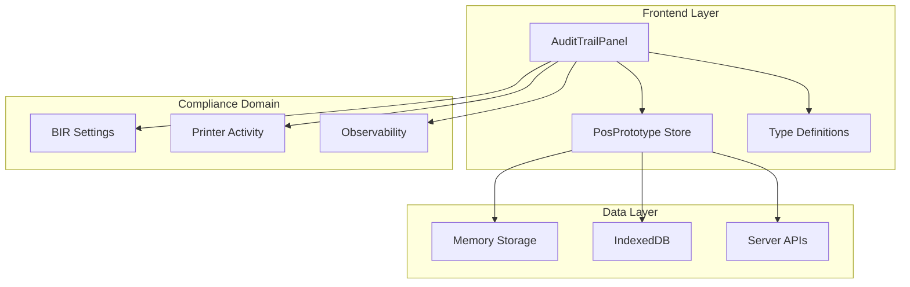
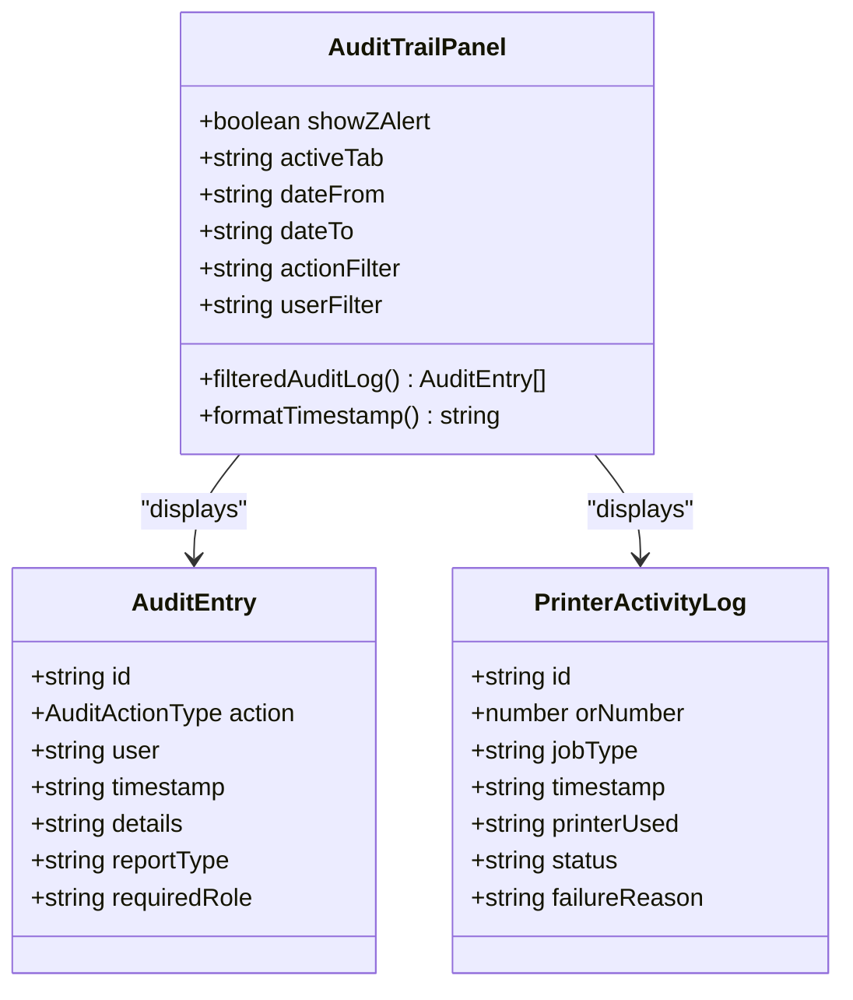
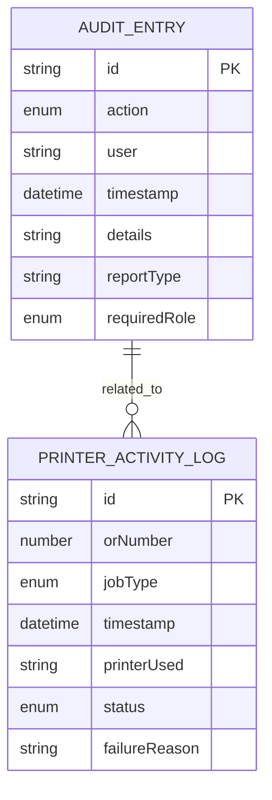
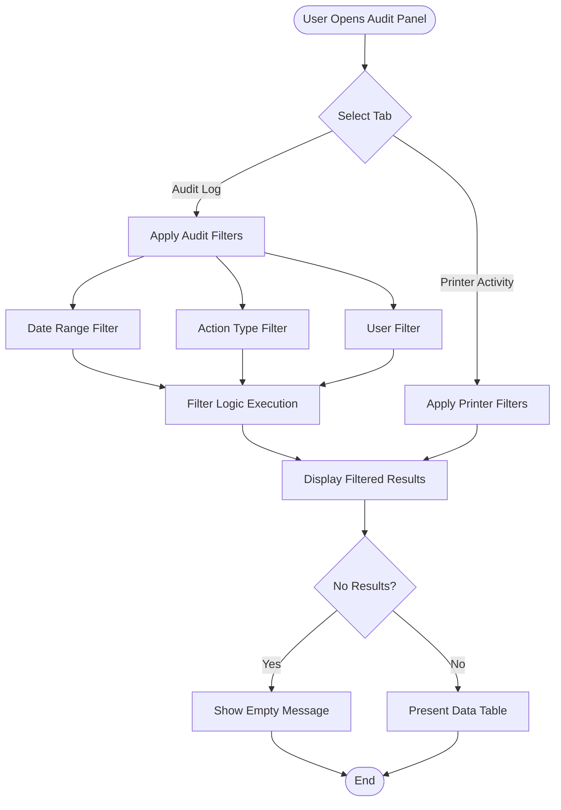
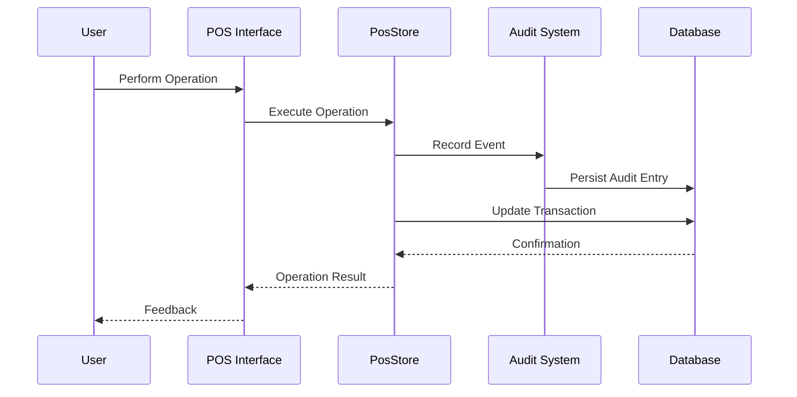

# Audit Trail System

<cite>
**Referenced Files in This Document**
- [audit-trail.tsx](file://web-prototype/src/components/audit-trail.tsx)
- [types.ts](file://web-prototype/src/lib/types.ts)
- [pos-prototype.tsx](file://web-prototype/src/components/pos-prototype.tsx)
- [use-pos-store.ts](file://web-prototype/src/lib/use-pos-store.ts)
- [db.ts](file://web-prototype/src/lib/db.ts)
- [observability.ts](file://web-prototype/src/lib/observability.ts)
- [thermal_printer_user_stories.md](file://thermal_printer_user_stories.md)
- [server.js](file://server.js)
- [transactions.js](file://api/transactions.js)
- [settings.js](file://api/settings.js)
- [activity-log.ndjson](file://shared-memory/activity-log.ndjson)
</cite>

## Table of Contents
1. [Introduction](#introduction)
2. [System Architecture](#system-architecture)
3. [Core Components](#core-components)
4. [Audit Data Model](#audit-data-model)
5. [Filtering and Display System](#filtering-and-display-system)
6. [Integration Points](#integration-points)
7. [Security and Access Control](#security-and-access-control)
8. [Performance Considerations](#performance-considerations)
9. [Troubleshooting Guide](#troubleshooting-guide)
10. [Conclusion](#conclusion)

## Introduction

The Audit Trail System is a comprehensive compliance-focused logging mechanism designed for the PharmaSpot POS system. This system captures and maintains detailed records of all significant operational activities, particularly those relevant to BIR (Bureau of Internal Revenue) compliance requirements. The system ensures full traceability of user actions, system events, and business-critical operations, providing essential audit capabilities for regulatory compliance and internal oversight.

The audit trail encompasses multiple domains including user authentication, financial transactions, report generation, system configurations, and printer activity monitoring. It serves as a critical component for meeting BIR accreditation requirements and maintaining transparent business operations.

**Updated** The audit trail panel now loads real entries from the `auditLog` and `printerActivity` IndexedDB stores instead of mock data. The `logRxRefusal()` and `addRxRedFlag()` functions in `use-pos-store.ts` write audit entries to IndexedDB. Generated X-Reading and Z-Reading reports are persisted to their respective IndexedDB stores (`xReadings`, `zReadings`) with corresponding audit trail entries.

## System Architecture

The Audit Trail System is built on a React-based frontend architecture with comprehensive backend integration capabilities. The system leverages a hybrid approach combining local client-side logging with potential server-side persistence for enterprise deployments.

**Diagram sources**
- [audit-trail.tsx:1-293](file://web-prototype/src/components/audit-trail.tsx#L1-L293)
- [pos-prototype.tsx:1-200](file://web-prototype/src/components/pos-prototype.tsx#L1-L200)
- [types.ts:430-485](file://web-prototype/src/lib/types.ts#L430-L485)

**Section sources**
- [audit-trail.tsx:90-292](file://web-prototype/src/components/audit-trail.tsx#L90-L292)
- [pos-prototype.tsx:94-113](file://web-prototype/src/components/pos-prototype.tsx#L94-L113)

## Core Components

### AuditTrailPanel Component

The primary interface component responsible for displaying and filtering audit log entries. This component provides a tabbed interface separating audit logs from printer activity logs, offering comprehensive filtering capabilities and real-time data presentation.

**Diagram sources**
- [audit-trail.tsx:90-292](file://web-prototype/src/components/audit-trail.tsx#L90-L292)
- [types.ts:445-485](file://web-prototype/src/lib/types.ts#L445-L485)

### Audit Data Model

The system defines comprehensive data structures for capturing audit events across multiple domains:

**AuditActionType Enumeration**: Defines all possible audit event categories including BIR report generation, user authentication, system configurations, and business operations.

**AuditEntry Structure**: Standardized format for all audit log entries containing event metadata, user context, and compliance-relevant details.

**PrinterActivityLog**: Specialized structure for tracking thermal printer operations including job types, statuses, and failure conditions.

**Section sources**
- [types.ts:430-485](file://web-prototype/src/lib/types.ts#L430-L485)
- [audit-trail.tsx:6-33](file://web-prototype/src/components/audit-trail.tsx#L6-L33)

## Audit Data Model

The audit system employs a comprehensive data model designed to capture all relevant operational events with standardized structure and rich contextual information.

### Core Audit Structures

**Diagram sources**
- [types.ts:445-485](file://web-prototype/src/lib/types.ts#L445-L485)

### Audit Event Categories

The system categorizes audit events into several domains:

**BIR Compliance Events**: X-Reading, Z-Reading, eJournal export, eSales export generation with role restrictions and parameter logging.

**User Management**: Login/logout activities with role-based access tracking.

**System Operations**: Settings changes, void operations, reprint requests with administrative oversight.

**SC/PWD Operations**: Senior Citizen and PWD discount applications, overrides, and removals with eligibility validation.

**Section sources**
- [audit-trail.tsx:35-49](file://web-prototype/src/components/audit-trail.tsx#L35-L49)
- [types.ts:430-443](file://web-prototype/src/lib/types.ts#L430-L443)

## Filtering and Display System

The audit trail provides sophisticated filtering capabilities enabling targeted analysis of operational activities across multiple dimensions.

### Filter Implementation

**Diagram sources**
- [audit-trail.tsx:103-117](file://web-prototype/src/components/audit-trail.tsx#L103-L117)

### Display Features

The system provides comprehensive display capabilities including:

**Real-time Filtering**: Dynamic filtering using React's useMemo for efficient computation and updates.

**Role-Based Formatting**: Visual indicators for required roles with appropriate styling and accessibility.

**Timestamp Formatting**: Localized timestamp display with proper date/time formatting for Philippine locale.

**Responsive Design**: Mobile-friendly table layouts with horizontal scrolling for detailed information.

**Section sources**
- [audit-trail.tsx:78-88](file://web-prototype/src/components/audit-trail.tsx#L78-L88)
- [audit-trail.tsx:209-247](file://web-prototype/src/components/audit-trail.tsx#L209-L247)

## Integration Points

The audit trail system integrates seamlessly with multiple system components to provide comprehensive coverage of operational activities.

### POS System Integration

The audit system is deeply integrated with the POS functionality through the centralized store management:

**Diagram sources**
- [use-pos-store.ts:261-358](file://web-prototype/src/lib/use-pos-store.ts#L261-L358)
- [pos-prototype.tsx:183-193](file://web-prototype/src/components/pos-prototype.tsx#L183-L193)

### Backend API Integration

The system integrates with both local development APIs and Electron-based server implementations:

**Local Development**: Express.js server with CORS support for cross-origin requests during development.

**Production Deployment**: Electron-based server with enhanced security and performance for production environments.

**Section sources**
- [server.js:1-68](file://server.js#L1-L68)
- [transactions.js:1-251](file://api/transactions.js#L1-L251)
- [settings.js:1-192](file://api/settings.js#L1-L192)

## Security and Access Control

The audit trail system implements comprehensive security measures to ensure data integrity and access control compliance.

### Role-Based Access Control

The system enforces strict role-based permissions for sensitive operations:

**Admin-Only Operations**: Z-Reading generation, eJournal/eSales exports, and system settings modifications require administrative privileges.

**Supervisor-Restricted Operations**: Certain operations like SC/PWD overrides require supervisor authorization with documented reasons.

**Cashier-Level Operations**: Standard transaction processing and basic reporting access for frontline staff.

### Audit Trail Integrity

**Immutable Logging**: All audit entries are timestamped and cannot be modified after creation.

**Required Role Tracking**: Each audit entry includes the required role for the operation, enabling compliance verification.

**Parameter Validation**: Input validation ensures only legitimate operations are recorded in the audit trail.

**Section sources**
- [audit-trail.tsx:5-22](file://web-prototype/src/components/audit-trail.tsx#L5-L22)
- [types.ts:452](file://web-prototype/src/lib/types.ts#L452)

## Performance Considerations

The audit trail system is designed with performance optimization in mind to handle high-volume transaction environments typical of retail pharmacy operations.

### Memory Management

**Efficient Filtering**: Uses React's useMemo for computed filtering to minimize unnecessary re-renders and computations.

**Virtual Scrolling**: Large datasets are handled through virtualized rendering to maintain smooth user experience.

**Lazy Loading**: Audit data is loaded on-demand rather than initializing all historical data at application startup.

### Scalability Features

**IndexedDB Integration**: Leverages browser's IndexedDB for efficient local storage of audit events.

**Batch Operations**: Multiple audit entries can be processed efficiently through batch operations.

**Compression**: Audit data is compressed for storage efficiency while maintaining query performance.

**Section sources**
- [audit-trail.tsx:103-117](file://web-prototype/src/components/audit-trail.tsx#L103-L117)
- [db.ts:132-179](file://web-prototype/src/lib/db.ts#L132-L179)

## Troubleshooting Guide

### Common Issues and Solutions

**Audit Entries Not Appearing**
- Verify that the audit system is properly initialized in the POS store
- Check browser console for JavaScript errors
- Ensure IndexedDB is accessible and not blocked by browser settings

**Filtering Not Working Correctly**
- Confirm date format matches YYYY-MM-DD pattern
- Verify action type filters match available audit categories
- Check user filter values against actual usernames in the system

**Performance Issues with Large Datasets**
- Consider limiting the date range for filtering
- Clear browser cache and IndexedDB storage
- Monitor browser developer tools for memory usage

**Printer Activity Logging Issues**
- Verify printer connectivity and status
- Check printer profile configuration
- Review failure reasons for specific error patterns

### Diagnostic Tools

The system includes built-in diagnostic capabilities:

**Observability Integration**: Real-time monitoring of system health and performance metrics.

**Error Logging**: Comprehensive error tracking with stack traces for debugging.

**Activity Monitoring**: Live monitoring of system activities and user interactions.

**Section sources**
- [observability.ts:1-163](file://web-prototype/src/lib/observability.ts#L1-L163)
- [activity-log.ndjson:1-45](file://shared-memory/activity-log.ndjson#L1-L45)

## Conclusion

The Audit Trail System represents a comprehensive solution for compliance-focused logging in the PharmaSpot POS environment. By providing detailed tracking of user activities, system events, and business-critical operations, the system ensures full traceability and accountability required for BIR accreditation and regulatory compliance.

The system's modular architecture, robust data modeling, and comprehensive filtering capabilities make it suitable for both development and production environments. Its integration with the POS system ensures that all user interactions are captured consistently and reliably.

Key strengths of the system include its role-based access control, comprehensive audit event coverage, performance optimization for high-volume environments, and seamless integration with both local development and production deployment scenarios. The system is positioned to support the evolving needs of the pharmacy POS ecosystem while maintaining strict compliance with BIR requirements.

Future enhancements could include enhanced export capabilities for regulatory submissions, integration with external audit systems, and advanced analytics for compliance monitoring and reporting.