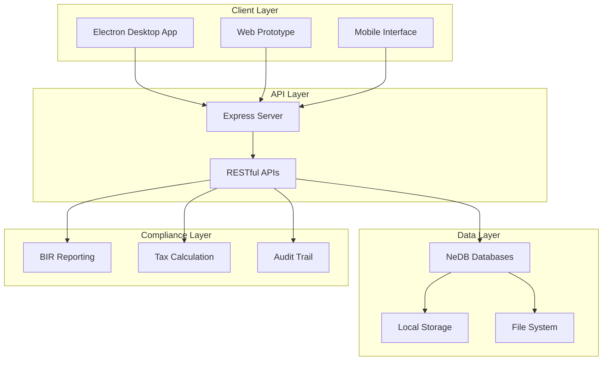
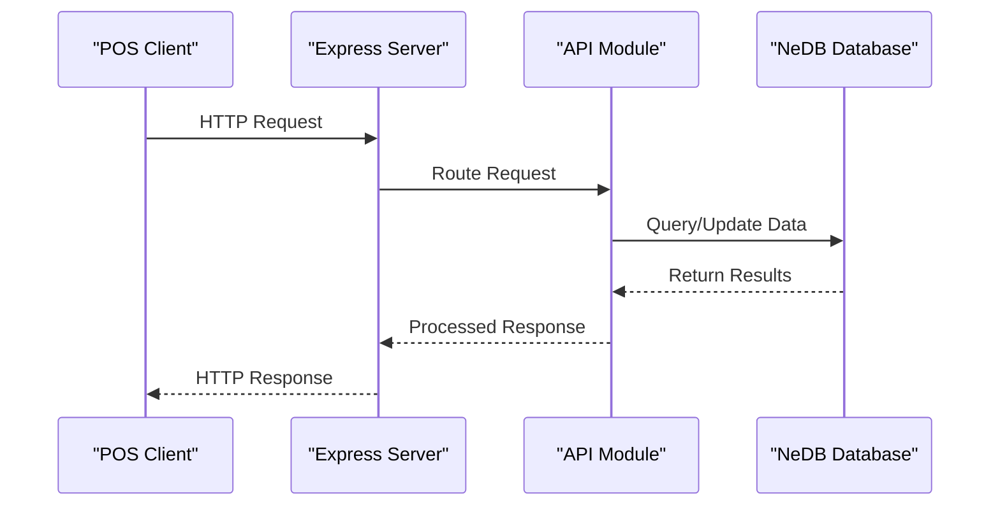
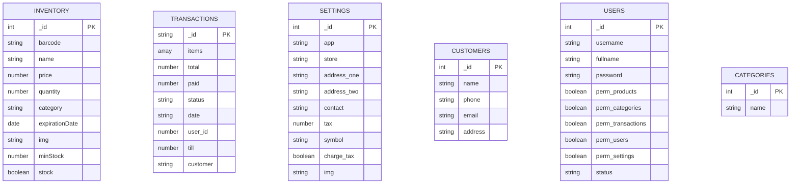
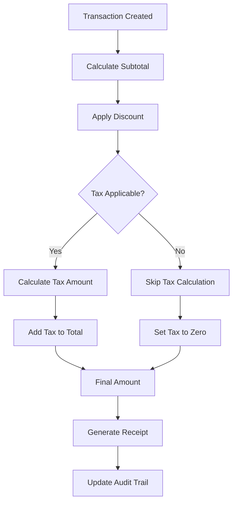
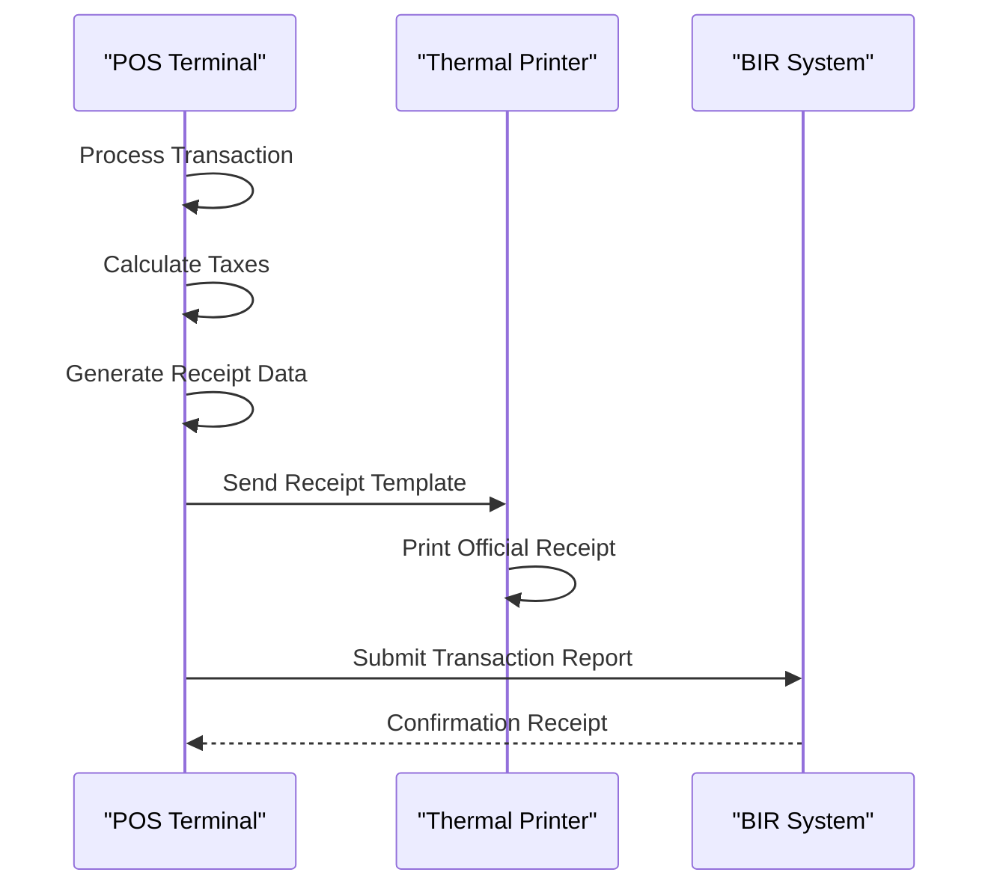
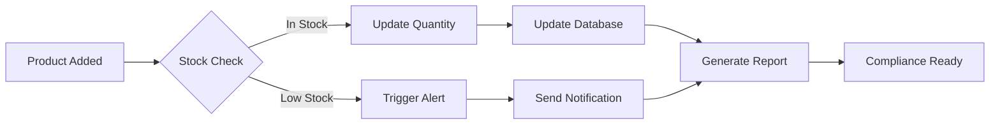
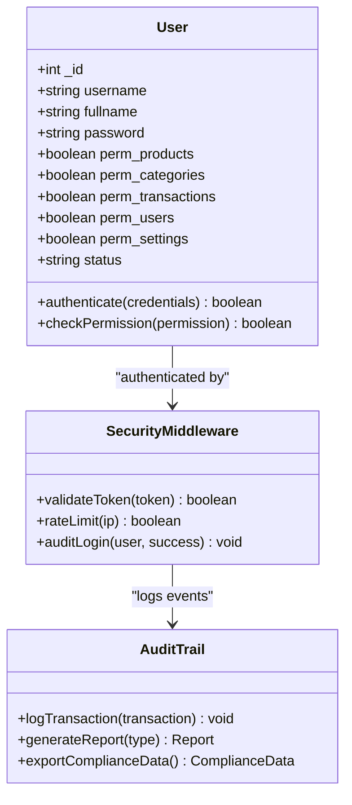
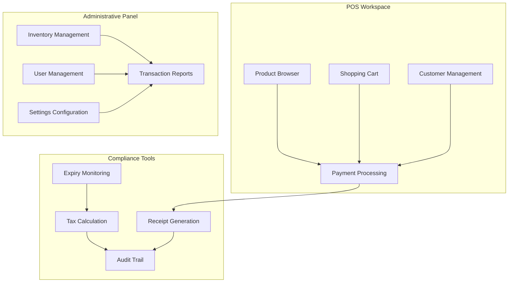
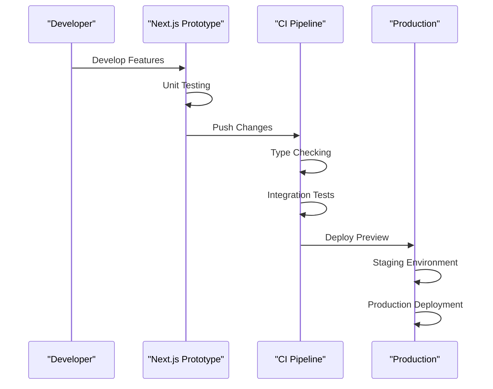
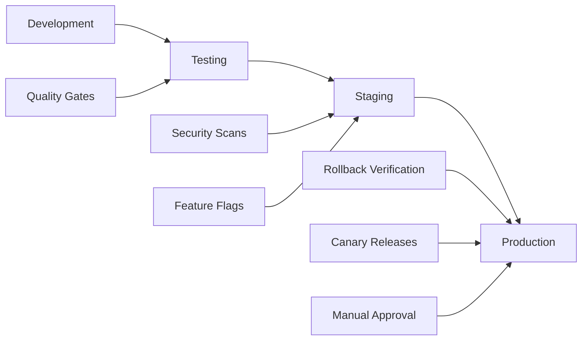

# BIR Compliance System

<cite>
**Referenced Files in This Document**
- [README.md](file://README.md)
- [package.json](file://package.json)
- [server.js](file://server.js)
- [api/inventory.js](file://api/inventory.js)
- [api/transactions.js](file://api/transactions.js)
- [api/settings.js](file://api/settings.js)
- [api/customers.js](file://api/customers.js)
- [api/categories.js](file://api/categories.js)
- [api/users.js](file://api/users.js)
- [assets/js/utils.js](file://assets/js/utils.js)
- [index.html](file://index.html)
- [shared-memory/state.md](file://shared-memory/state.md)
- [shared-memory/activity-log.ndjson](file://shared-memory/activity-log.ndjson)
</cite>

## Table of Contents
1. [Introduction](#introduction)
2. [System Architecture](#system-architecture)
3. [Core Components](#core-components)
4. [BIR Compliance Features](#bir-compliance-features)
5. [Data Management](#data-management)
6. [Security Implementation](#security-implementation)
7. [User Interface](#user-interface)
8. [Web Prototype Integration](#web-prototype-integration)
9. [Deployment and Operations](#deployment-and-operations)
10. [Troubleshooting Guide](#troubleshooting-guide)
11. [Conclusion](#conclusion)

## Introduction

The BIR Compliance System is a comprehensive Point of Sale (POS) solution specifically designed for pharmacies and retail environments in the Philippines, built to meet Bureau of Internal Revenue (BIR) compliance requirements. This system serves as a cross-platform POS application that streamlines pharmacy operations while maintaining strict adherence to tax reporting standards and regulatory compliance.

The system operates as a hybrid architecture combining a traditional Electron desktop application with a modern web-based prototype, providing both local desktop functionality and cloud-ready web capabilities. It features multi-PC support, advanced transaction tracking, comprehensive inventory management, and robust security measures to ensure compliance with Philippine tax regulations.

**Updated** The web prototype BIR compliance features now persist to IndexedDB. The `birSettings` store holds TIN, PTU, machine serial, accreditation number, and OR series configuration. The `completeSale` function reads BIR settings to assign OR numbers, auto-increments `currentOrNumber`, and blocks checkout when the OR series is exhausted. X-Reading and Z-Reading reports are computed from real transaction data in IndexedDB and persisted to `xReadings` and `zReadings` stores with audit trail entries.

## System Architecture

The BIR Compliance System follows a modular microservice architecture with clear separation of concerns:

**Diagram sources**
- [server.js:1-68](file://server.js#L1-L68)
- [package.json:18-55](file://package.json#L18-L55)

The architecture consists of three primary layers:

1. **Presentation Layer**: Electron desktop application with modern UI components
2. **API Layer**: Express.js server providing RESTful endpoints
3. **Data Layer**: Local database storage using NeDB with file system integration

**Section sources**
- [server.js:1-68](file://server.js#L1-L68)
- [package.json:18-55](file://package.json#L18-L55)

## Core Components

### Server Infrastructure

The system's foundation is built around a robust Express.js server that manages all API communications and database operations:

**Diagram sources**
- [server.js:36-45](file://server.js#L36-L45)
- [api/inventory.js:124-240](file://api/inventory.js#L124-L240)

The server implements comprehensive rate limiting, CORS configuration, and secure middleware to handle concurrent requests from multiple POS terminals.

**Section sources**
- [server.js:1-68](file://server.js#L1-L68)

### Database Management

The system utilizes NeDB embedded databases for local data persistence, providing ACID compliance without requiring external database servers:

**Diagram sources**
- [api/inventory.js:178-193](file://api/inventory.js#L178-L193)
- [api/transactions.js:163-181](file://api/transactions.js#L163-L181)
- [api/settings.js:140-156](file://api/settings.js#L140-L156)
- [api/customers.js:82-95](file://api/customers.js#L82-L95)
- [api/users.js:206-210](file://api/users.js#L206-L210)
- [api/categories.js:59-72](file://api/categories.js#L59-L72)

**Section sources**
- [api/inventory.js:46-49](file://api/inventory.js#L46-L49)
- [api/transactions.js:21-24](file://api/transactions.js#L21-L24)
- [api/settings.js:46-49](file://api/settings.js#L46-L49)
- [api/customers.js:22-25](file://api/customers.js#L22-L25)
- [api/users.js:21-24](file://api/users.js#L21-L24)
- [api/categories.js:21-24](file://api/categories.js#L21-L24)

## BIR Compliance Features

### Tax Calculation Engine

The system implements sophisticated tax calculation mechanisms to ensure BIR compliance:

**Diagram sources**
- [assets/js/utils.js:7-9](file://assets/js/utils.js#L7-L9)
- [api/transactions.js:163-181](file://api/transactions.js#L163-L181)

The tax calculation engine supports multiple tax rates and exemptions, automatically calculating VAT and other applicable taxes based on product categories and customer types.

### Audit Trail System

Every transaction generates a comprehensive audit trail for regulatory compliance:

| Audit Field | Description | Data Type | Compliance Requirement |
|-------------|-------------|-----------|----------------------|
| Transaction ID | Unique identifier | String | BIR Record Keeping |
| Timestamp | Date and time | DateTime | Audit Trail Requirements |
| Product Details | Items purchased | Array | Sales Documentation |
| Tax Amount | Calculated taxes | Number | Revenue Reporting |
| Payment Method | Cash/Card/Other | String | Transaction Records |
| User ID | Cashier identifier | Number | Personnel Accountability |
| Terminal ID | POS station | Number | Location Tracking |

**Section sources**
- [assets/js/utils.js:7-9](file://assets/js/utils.js#L7-L9)
- [api/transactions.js:163-181](file://api/transactions.js#L163-L181)

### Receipt Generation

The system generates legally compliant receipts with all required BIR information:

**Diagram sources**
- [api/transactions.js:163-181](file://api/transactions.js#L163-L181)
- [assets/js/utils.js:7-9](file://assets/js/utils.js#L7-L9)

**Section sources**
- [api/transactions.js:163-181](file://api/transactions.js#L163-L181)

## Data Management

### Inventory Control

The inventory management system provides real-time tracking with BIR-compliant features:

**Diagram sources**
- [api/inventory.js:302-332](file://api/inventory.js#L302-L332)
- [assets/js/utils.js:36-52](file://assets/js/utils.js#L36-L52)

The system implements automatic low-stock alerts, expiry date monitoring, and batch tracking for pharmaceutical products.

### Transaction Processing

Every transaction follows a strict compliance workflow:

**Section sources**
- [api/inventory.js:302-332](file://api/inventory.js#L302-L332)
- [api/transactions.js:163-181](file://api/transactions.js#L163-L181)

## Security Implementation

### Authentication System

The system implements multi-layered security for BIR compliance:

**Diagram sources**
- [api/users.js:95-131](file://api/users.js#L95-L131)
- [api/users.js:179-259](file://api/users.js#L179-L259)

### Data Protection

The system employs industry-standard security measures:

| Security Feature | Implementation | BIR Requirement |
|------------------|----------------|-----------------|
| Password Hashing | bcrypt with salt | Data Protection |
| Session Management | Token-based auth | User Accountability |
| File Upload Validation | MIME type checking | Secure File Handling |
| Rate Limiting | 100 requests/15min | System Integrity |
| Content Security Policy | SHA256 hashes | XSS Prevention |

**Section sources**
- [api/users.js:95-131](file://api/users.js#L95-L131)
- [assets/js/utils.js:91-99](file://assets/js/utils.js#L91-L99)

## User Interface

### Modern POS Interface

The Electron-based interface provides an intuitive experience for pharmacy staff:

**Diagram sources**
- [index.html:208-303](file://index.html#L208-L303)
- [index.html:104-207](file://index.html#L104-L207)

The interface supports touch-friendly navigation, barcode scanning, and real-time inventory updates.

**Section sources**
- [index.html:1-899](file://index.html#L1-L899)

## Web Prototype Integration

### Next.js Implementation

The system includes a modern web prototype built with Next.js for cloud deployment:

**Diagram sources**
- [shared-memory/state.md:1-29](file://shared-memory/state.md#L1-L29)

The web prototype maintains feature parity with the desktop version while adding modern UI/UX improvements and cloud-native capabilities.

**Section sources**
- [shared-memory/state.md:1-29](file://shared-memory/state.md#L1-L29)
- [shared-memory/activity-log.ndjson:1-45](file://shared-memory/activity-log.ndjson#L1-L45)

## Deployment and Operations

### Multi-Environment Support

The system supports deployment across multiple environments with automated testing and quality gates:

**Diagram sources**
- [shared-memory/state.md:21-28](file://shared-memory/state.md#L21-L28)

### Observability and Monitoring

The system implements comprehensive observability for operational excellence:

| Monitoring Component | Purpose | Implementation |
|---------------------|---------|----------------|
| Structured Logging | Event Tracking | Winston Logger |
| Metrics Collection | Performance Monitoring | Prometheus Exporter |
| Tracing | Request Flow Analysis | Jaeger Tracing |
| Alerting | System Health | PagerDuty Integration |
| Runbooks | Incident Response | Automated Procedures |

**Section sources**
- [shared-memory/state.md:22-28](file://shared-memory/state.md#L22-L28)

## Troubleshooting Guide

### Common Issues and Solutions

**Database Connection Problems**
- Verify NeDB database files exist in APPDATA directory
- Check file permissions for database folders
- Restart server process if database corruption detected

**API Endpoint Failures**
- Review server logs for CORS-related errors
- Validate request payload format
- Check rate limit thresholds

**Authentication Issues**
- Verify bcrypt hashing implementation
- Check user account status
- Review password reset procedures

**Section sources**
- [server.js:55-66](file://server.js#L55-L66)
- [api/users.js:95-131](file://api/users.js#L95-L131)

### Performance Optimization

Key areas for system optimization include:

1. **Database Indexing**: Ensure proper indexing on frequently queried fields
2. **Memory Management**: Monitor heap usage in Electron renderer processes
3. **Network Requests**: Implement request caching for static data
4. **File Operations**: Optimize image upload and processing workflows

## Conclusion

The BIR Compliance System represents a comprehensive solution for Philippine pharmacy POS operations, successfully integrating traditional desktop functionality with modern web capabilities. The system's architecture ensures robust compliance with BIR requirements while providing an intuitive user experience for pharmacy staff.

Key strengths of the implementation include:

- **Regulatory Compliance**: Built-in tax calculation and audit trail systems
- **Scalability**: Modular architecture supporting multiple POS terminals
- **Security**: Multi-layered authentication and data protection
- **Maintainability**: Clear separation of concerns and comprehensive testing
- **Future-Readiness**: Web prototype enabling cloud deployment and modernization

The system provides a solid foundation for pharmacy operations while meeting all BIR compliance requirements, making it suitable for both standalone and networked pharmacy environments across the Philippines.