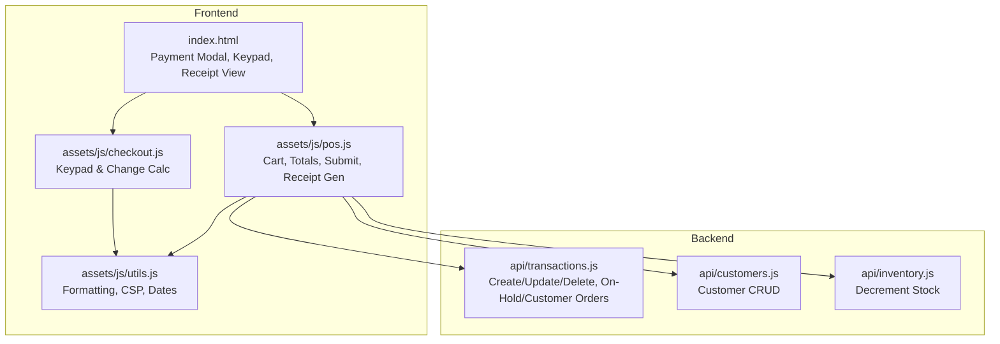
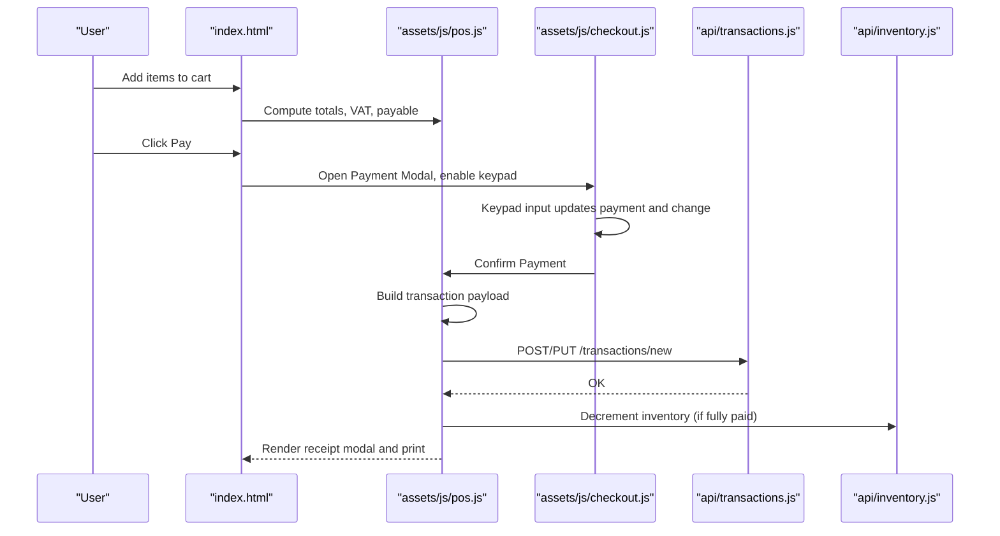
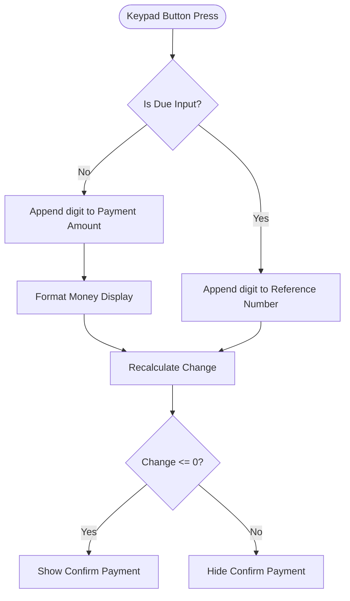
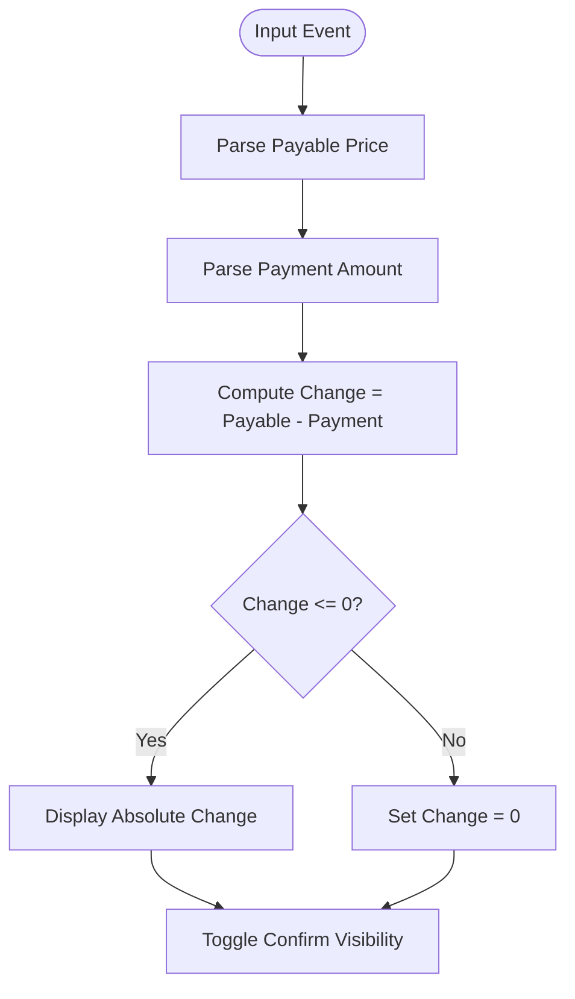
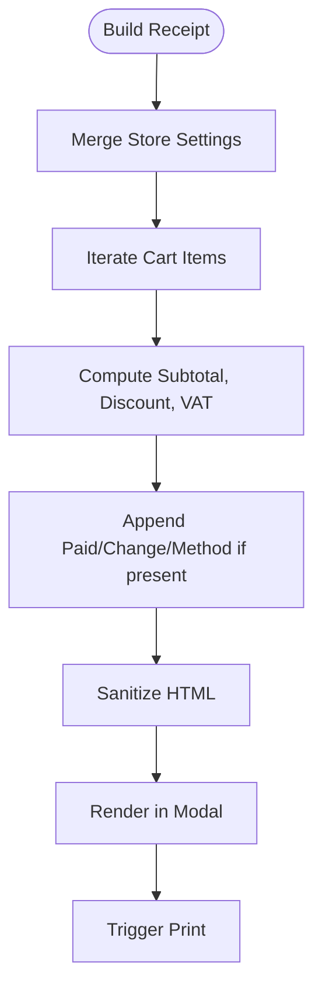
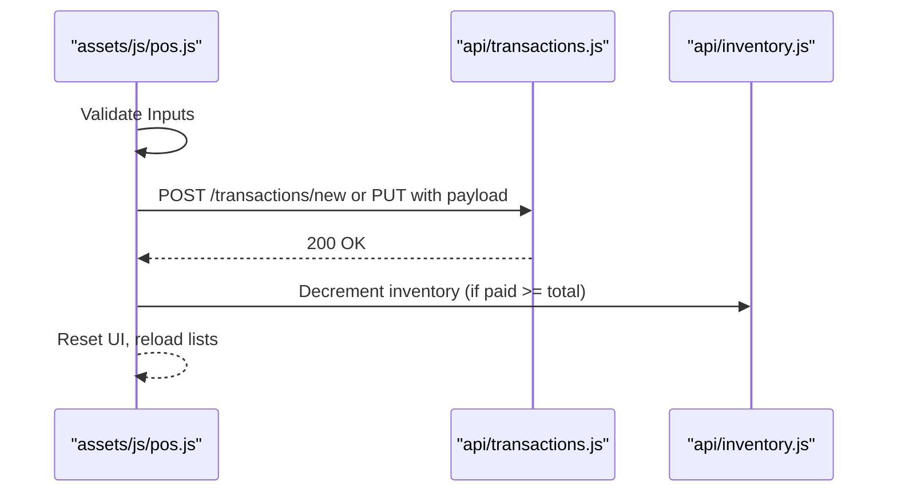
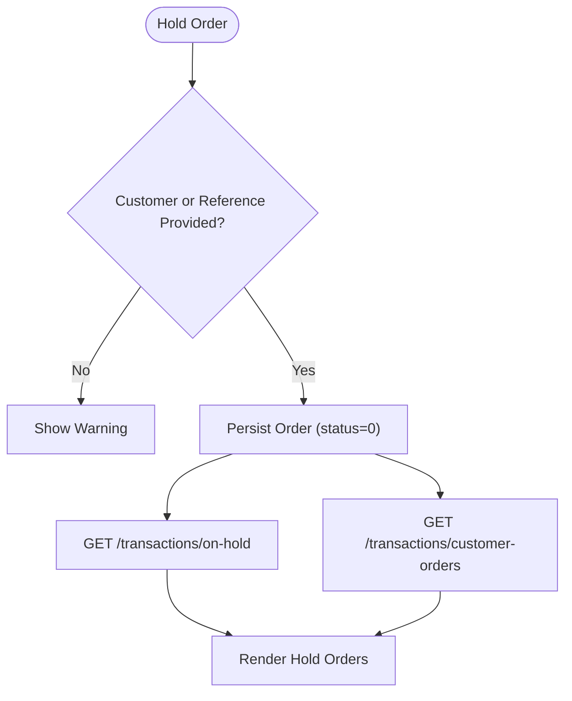
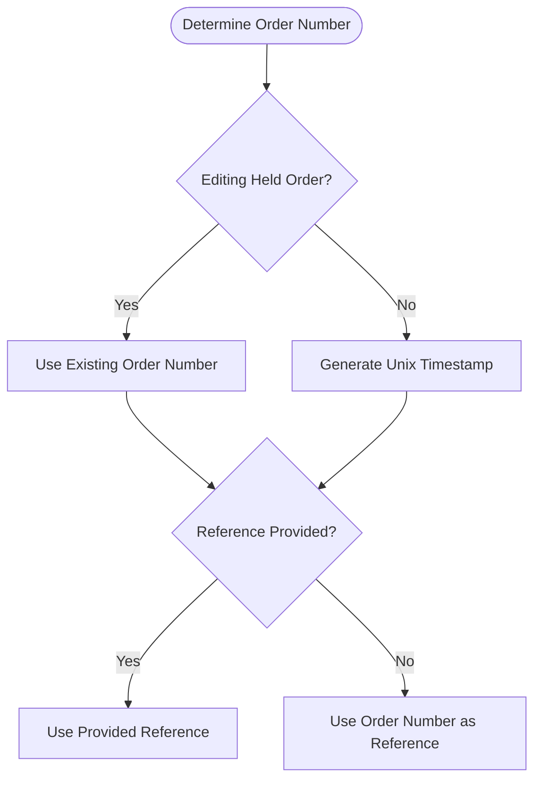
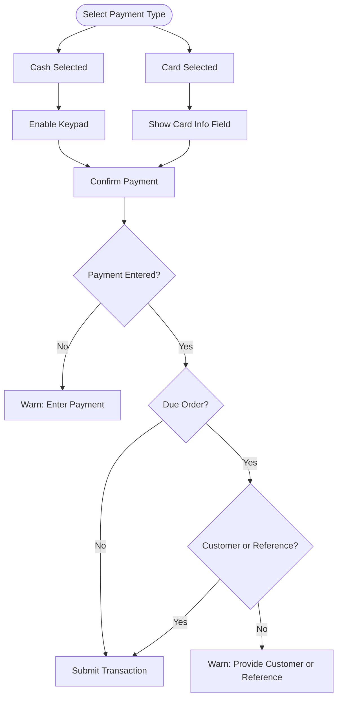
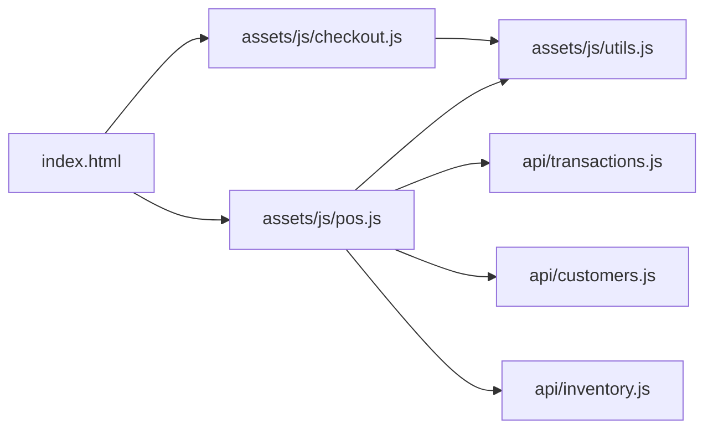

# Checkout System

<cite>
**Referenced Files in This Document**
- [index.html](file://index.html)
- [checkout.js](file://assets/js/checkout.js)
- [pos.js](file://assets/js/pos.js)
- [utils.js](file://assets/js/utils.js)
- [transactions.js](file://api/transactions.js)
- [customers.js](file://api/customers.js)
- [inventory.js](file://api/inventory.js)
</cite>

## Table of Contents
1. [Introduction](#introduction)
2. [Project Structure](#project-structure)
3. [Core Components](#core-components)
4. [Architecture Overview](#architecture-overview)
5. [Detailed Component Analysis](#detailed-component-analysis)
6. [Dependency Analysis](#dependency-analysis)
7. [Performance Considerations](#performance-considerations)
8. [Troubleshooting Guide](#troubleshooting-guide)
9. [Conclusion](#conclusion)
10. [Appendices](#appendices)

## Introduction
This document describes the PharmaSpot checkout system with a focus on payment processing, amount validation, change calculation, receipt generation, transaction submission, and the due order system. It also covers reference number generation, customer association, order numbering schemes, the payment modal interface, active payment type selection, and validation rules. Guidance is included for integrating external payment processors and customizing the checkout experience.

## Project Structure
The checkout system spans the Electron desktop application’s renderer process and a local REST API:
- Frontend UI and logic: index.html, assets/js/checkout.js, assets/js/pos.js
- Shared utilities: assets/js/utils.js
- Backend APIs: api/transactions.js, api/customers.js, api/inventory.js

**Diagram sources**
- [index.html](file://index.html)
- [checkout.js](file://assets/js/checkout.js)
- [pos.js](file://assets/js/pos.js)
- [utils.js](file://assets/js/utils.js)
- [transactions.js](file://api/transactions.js)
- [customers.js](file://api/customers.js)
- [inventory.js](file://api/inventory.js)

**Section sources**
- [index.html](file://index.html)
- [checkout.js](file://assets/js/checkout.js)
- [pos.js](file://assets/js/pos.js)
- [utils.js](file://assets/js/utils.js)
- [transactions.js](file://api/transactions.js)
- [customers.js](file://api/customers.js)
- [inventory.js](file://api/inventory.js)

## Core Components
- Payment Modal and Keypad: Handles numeric input, decimal entry, backspace, AC clear, and change computation.
- Cart and Totals: Computes gross totals, applies discounts, computes VAT, and displays payable amounts.
- Transaction Submission: Builds transaction payload, persists via API, decrements inventory, and renders receipts.
- Receipt Generation: Produces HTML receipts and supports printing.
- Due Orders: Holds unpaid sales with reference numbers and associates with customers.
- Customer Management: Adds, edits, and selects customers during checkout.
- Validation: Ensures required fields and logical constraints before submission.

**Section sources**
- [checkout.js](file://assets/js/checkout.js)
- [pos.js](file://assets/js/pos.js)
- [transactions.js](file://api/transactions.js)
- [customers.js](file://api/customers.js)
- [inventory.js](file://api/inventory.js)

## Architecture Overview
End-to-end checkout flow:
1. User adds items to cart; totals and VAT are computed.
2. Pay button opens the payment modal; keypad inputs update payment amount and change.
3. Confirm payment triggers submission with validation.
4. Backend persists transaction, decrements inventory, and returns success.
5. Receipt is generated (HTML), shown in a modal, and printed.

**Diagram sources**
- [index.html](file://index.html)
- [checkout.js](file://assets/js/checkout.js)
- [pos.js](file://assets/js/pos.js)
- [transactions.js](file://api/transactions.js)
- [inventory.js](file://api/inventory.js)

## Detailed Component Analysis

### Payment Modal and Keypad
- Numeric keypad supports digits, decimal point, delete/backspace, and AC clear.
- For due orders, the keypad appends to the reference number input.
- For payments, the keypad appends to the hidden payment input and formats display.
- Change is calculated as payable minus payment; “Confirm Payment” becomes visible when change is zero or negative.

**Diagram sources**
- [checkout.js](file://assets/js/checkout.js)

**Section sources**
- [checkout.js](file://assets/js/checkout.js)
- [index.html](file://index.html)

### Amount Validation and Change Calculation
- Payable price and payment amount are parsed and stripped of thousands separators before arithmetic.
- Change is computed and formatted; confirm button visibility toggles accordingly.
- Quick billing mode bypasses the payment modal and auto-submits the payable amount.

**Diagram sources**
- [checkout.js](file://assets/js/checkout.js)

**Section sources**
- [checkout.js](file://assets/js/checkout.js)
- [pos.js](file://assets/js/pos.js)

### Receipt Generation and Printing
- Receipt template is built dynamically with store settings, items, totals, discount, VAT, and payment details.
- DOMPurify sanitizes HTML prior to rendering to mitigate XSS.
- Receipt is shown in a modal and printed via a browser-native print mechanism.

**Diagram sources**
- [pos.js](file://assets/js/pos.js)

**Section sources**
- [pos.js](file://assets/js/pos.js)

### Transaction Submission and Persistence
- Payload includes order number, reference number, customer, items, totals, taxes, payment type/info, and cashier metadata.
- On successful POST/PUT, cart is cleared, UI refreshed, and inventory decremented when fully paid.
- On failure, user receives a friendly error and the modal remains open.

**Diagram sources**
- [pos.js](file://assets/js/pos.js)
- [transactions.js](file://api/transactions.js)
- [inventory.js](file://api/inventory.js)

**Section sources**
- [pos.js](file://assets/js/pos.js)
- [transactions.js](file://api/transactions.js)
- [inventory.js](file://api/inventory.js)

### Due Order System and Customer Association
- Hold order flow requires either a customer selection or a reference number; otherwise, a warning is shown.
- On-hold orders are fetched and displayed; each holds items, totals, and customer association.
- Customer orders with unpaid status and empty reference are retrievable for further action.
- Reference numbers are stored per order; order numbers are either derived from a held order or generated as a Unix timestamp.

**Diagram sources**
- [pos.js](file://assets/js/pos.js)
- [transactions.js](file://api/transactions.js)

**Section sources**
- [pos.js](file://assets/js/pos.js)
- [transactions.js](file://api/transactions.js)

### Reference Number Generation and Order Numbering
- Reference number: optional free-text input for due orders; if blank, order number is used as reference.
- Order number: derived from a previously held order if editing; otherwise, generated as a Unix timestamp (seconds) to ensure uniqueness.

**Diagram sources**
- [pos.js](file://assets/js/pos.js)

**Section sources**
- [pos.js](file://assets/js/pos.js)

### Payment Method Selection and Validation Rules
- Active payment type is tracked from the payment modal’s active list item.
- Supported methods: Cash and Card; Check variant is supported via a label change in the card info section.
- Validation rules:
  - Payment amount must be entered before confirming.
  - For due orders, either a customer must be selected or a reference number must be provided.
  - Discount cannot exceed the pre-VAT subtotal.
  - VAT is computed only if enabled in settings.

**Diagram sources**
- [checkout.js](file://assets/js/checkout.js)
- [pos.js](file://assets/js/pos.js)

**Section sources**
- [checkout.js](file://assets/js/checkout.js)
- [pos.js](file://assets/js/pos.js)

### Receipt Printing and PDF Conversion
- Receipts are rendered as HTML inside a modal and printed via the browser’s print dialog.
- The system does not use jsPDF or html2canvas for PDF conversion in the provided code; printing is handled by the browser’s native capabilities.

**Section sources**
- [pos.js](file://assets/js/pos.js)
- [index.html](file://index.html)

### Integration with External Payment Processors
- The checkout supports Cash and Card methods. To integrate external processors:
  - Extend the payment type selection to include “Card” and capture processor-specific identifiers in the payment info field.
  - Modify the transaction payload to include processor metadata (e.g., transaction ID, auth code).
  - Ensure backend endpoints accept and persist the additional fields.

**Section sources**
- [pos.js](file://assets/js/pos.js)
- [transactions.js](file://api/transactions.js)

## Dependency Analysis
- Frontend depends on utils for formatting and security policies.
- POS module orchestrates UI events, builds payloads, and interacts with APIs.
- Transactions API persists orders and exposes endpoints for on-hold and customer orders.
- Inventory API decrements stock upon successful payment.
- Customers API supplies customer data for association.

**Diagram sources**
- [pos.js](file://assets/js/pos.js)
- [checkout.js](file://assets/js/checkout.js)
- [utils.js](file://assets/js/utils.js)
- [transactions.js](file://api/transactions.js)
- [customers.js](file://api/customers.js)
- [inventory.js](file://api/inventory.js)
- [index.html](file://index.html)

**Section sources**
- [pos.js](file://assets/js/pos.js)
- [checkout.js](file://assets/js/checkout.js)
- [utils.js](file://assets/js/utils.js)
- [transactions.js](file://api/transactions.js)
- [customers.js](file://api/customers.js)
- [inventory.js](file://api/inventory.js)
- [index.html](file://index.html)

## Performance Considerations
- Minimize DOM updates by batching UI re-renders after cart changes.
- Debounce input events for payment amount to avoid frequent recalculations.
- Use efficient selectors and avoid deep DOM traversal in the keypad handlers.
- Cache computed totals and only recalculate when cart or discount changes.

## Troubleshooting Guide
- Payment confirmation disabled: Ensure the payable amount is fully covered; the confirm button appears when change is zero or negative.
- Missing customer or reference for due orders: Provide either a customer or a reference number before holding an order.
- Printing issues: Verify the receipt modal is open and the browser print dialog is accessible; avoid reloading the page mid-print.
- Transaction errors: Confirm network connectivity to the API and review returned error messages for actionable feedback.

**Section sources**
- [checkout.js](file://assets/js/checkout.js)
- [pos.js](file://assets/js/pos.js)

## Conclusion
The PharmaSpot checkout system provides a robust, modular solution for cash and card payments, due order handling, and receipt generation. Its separation of concerns across frontend and backend enables straightforward extension for external payment processors and customization of the checkout experience.

## Appendices

### API Endpoints Used by Checkout
- POST /api/transactions/new: Create a new transaction
- PUT /api/transactions/new: Update an existing transaction
- GET /api/transactions/on-hold: Retrieve on-hold orders
- GET /api/transactions/customer-orders: Retrieve unpaid customer orders
- GET /api/customers/all: Load customers for selection
- POST /api/inventory/product: Save product (used indirectly via POS)

**Section sources**
- [transactions.js](file://api/transactions.js)
- [customers.js](file://api/customers.js)
- [inventory.js](file://api/inventory.js)
- [pos.js](file://assets/js/pos.js)