# Checkout System

<cite>
**Referenced Files in This Document**
- [index.html](file://index.html)
- [checkout.js](file://assets/js/checkout.js)
- [pos.js](file://assets/js/pos.js)
- [utils.js](file://assets/js/utils.js)
- [transactions.js](file://api/transactions.js)
- [customers.js](file://api/customers.js)
- [inventory.js](file://api/inventory.js)
- [scpwd_user_stories.md](file://scpwd_user_stories.md)
- [pos-prototype.tsx](file://web-prototype/src/components/pos-prototype.tsx)
- [rx-workspace.tsx](file://web-prototype/src/components/rx-workspace.tsx)
- [scpwd-discount-modal.tsx](file://web-prototype/src/components/scpwd-discount-modal.tsx)
- [scpwd-breakdown-card.tsx](file://web-prototype/src/components/scpwd-breakdown-card.tsx)
- [scpwd-summary-card.tsx](file://web-prototype/src/components/scpwd-summary-card.tsx)
- [scpwd-transaction-log.tsx](file://web-prototype/src/components/scpwd-transaction-log.tsx)
- [calculations.ts](file://web-prototype/src/lib/calculations.ts)
- [types.ts](file://web-prototype/src/lib/types.ts)
- [use-pos-store.ts](file://web-prototype/src/lib/use-pos-store.ts)
</cite>

## Update Summary
**Changes Made**
- Added comprehensive SC/PWD discount integration with automatic calculation and VAT exemption handling
- Integrated RX workspace support with prescription management and dispensing checkpoints
- Enhanced transaction logging with SC/PWD-specific audit trails and reporting
- Updated payment processing workflow to include SC/PWD discount validation and enforcement
- Added automatic discount calculation and VAT exemption handling for eligible transactions

## Table of Contents
1. [Introduction](#introduction)
2. [Project Structure](#project-structure)
3. [Core Components](#core-components)
4. [Architecture Overview](#architecture-overview)
5. [Detailed Component Analysis](#detailed-component-analysis)
6. [SC/PWD Discount System](#scpwd-discount-system)
7. [RX Workspace Integration](#rx-workspace-integration)
8. [Enhanced Transaction Logging](#enhanced-transaction-logging)
9. [Dependency Analysis](#dependency-analysis)
10. [Performance Considerations](#performance-considerations)
11. [Troubleshooting Guide](#troubleshooting-guide)
12. [Conclusion](#conclusion)
13. [Appendices](#appendices)

## Introduction
This document describes the enhanced PharmaSpot checkout system with advanced features including SC/PWD discount integration, RX workspace support, and improved transaction logging. The system now provides automatic discount calculation, VAT exemption handling for eligible transactions, and comprehensive audit trails for compliance reporting. It covers payment processing, amount validation, change calculation, receipt generation, transaction submission, due order management, and customer account integration.

## Project Structure
The checkout system spans multiple platforms including the Electron desktop application, local REST API, and web prototype with enhanced SC/PWD and RX workspace capabilities:
- Frontend UI and logic: index.html, assets/js/checkout.js, assets/js/pos.js
- Shared utilities: assets/js/utils.js
- Backend APIs: api/transactions.js, api/customers.js, api/inventory.js
- Web Prototype: web-prototype/src/components/* for SC/PWD and RX features
- Calculation engine: web-prototype/src/lib/calculations.ts
- Type definitions: web-prototype/src/lib/types.ts
- State management: web-prototype/src/lib/use-pos-store.ts

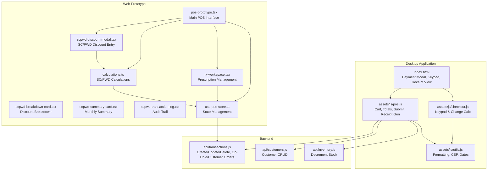

**Diagram sources**
- [index.html](file://index.html)
- [checkout.js](file://assets/js/checkout.js)
- [pos.js](file://assets/js/pos.js)
- [utils.js](file://assets/js/utils.js)
- [transactions.js](file://api/transactions.js)
- [customers.js](file://api/customers.js)
- [inventory.js](file://api/inventory.js)
- [pos-prototype.tsx](file://web-prototype/src/components/pos-prototype.tsx)
- [rx-workspace.tsx](file://web-prototype/src/components/rx-workspace.tsx)
- [scpwd-discount-modal.tsx](file://web-prototype/src/components/scpwd-discount-modal.tsx)
- [scpwd-breakdown-card.tsx](file://web-prototype/src/components/scpwd-breakdown-card.tsx)
- [scpwd-summary-card.tsx](file://web-prototype/src/components/scpwd-summary-card.tsx)
- [scpwd-transaction-log.tsx](file://web-prototype/src/components/scpwd-transaction-log.tsx)
- [calculations.ts](file://web-prototype/src/lib/calculations.ts)
- [use-pos-store.ts](file://web-prototype/src/lib/use-pos-store.ts)

**Section sources**
- [index.html](file://index.html)
- [checkout.js](file://assets/js/checkout.js)
- [pos.js](file://assets/js/pos.js)
- [utils.js](file://assets/js/utils.js)
- [transactions.js](file://api/transactions.js)
- [customers.js](file://api/customers.js)
- [inventory.js](file://api/inventory.js)
- [pos-prototype.tsx](file://web-prototype/src/components/pos-prototype.tsx)
- [rx-workspace.tsx](file://web-prototype/src/components/rx-workspace.tsx)
- [scpwd-discount-modal.tsx](file://web-prototype/src/components/scpwd-discount-modal.tsx)
- [scpwd-breakdown-card.tsx](file://web-prototype/src/components/scpwd-breakdown-card.tsx)
- [scpwd-summary-card.tsx](file://web-prototype/src/components/scpwd-summary-card.tsx)
- [scpwd-transaction-log.tsx](file://web-prototype/src/components/scpwd-transaction-log.tsx)
- [calculations.ts](file://web-prototype/src/lib/calculations.ts)
- [use-pos-store.ts](file://web-prototype/src/lib/use-pos-store.ts)

## Core Components
- **Enhanced Payment Modal and Keypad**: Handles numeric input, decimal entry, backspace, AC clear, and change computation with SC/PWD discount integration.
- **Advanced Cart and Totals**: Computes gross totals, applies SC/PWD discounts, handles VAT exemptions, and displays payable amounts with automatic calculation.
- **Transaction Submission**: Builds transaction payload with SC/PWD metadata, persists via API, decrements inventory, and renders receipts with audit trails.
- **Comprehensive Receipt Generation**: Produces HTML receipts with SC/PWD discount details and supports printing.
- **Due Orders**: Holds unpaid sales with reference numbers, associates with customers, and maintains SC/PWD discount status.
- **Customer Management**: Adds, edits, and selects customers during checkout with SC/PWD eligibility tracking.
- **SC/PWD Discount System**: Automatic discount calculation, VAT exemption handling, and compliance validation.
- **RX Workspace Integration**: Prescription management, dispensing checkpoints, and pharmacist acknowledgment workflows.
- **Enhanced Validation**: Ensures required fields, logical constraints, and SC/PWD compliance before submission.

**Section sources**
- [checkout.js](file://assets/js/checkout.js)
- [pos.js](file://assets/js/pos.js)
- [transactions.js](file://api/transactions.js)
- [customers.js](file://api/customers.js)
- [inventory.js](file://api/inventory.js)
- [scpwd_user_stories.md](file://scpwd_user_stories.md)
- [pos-prototype.tsx](file://web-prototype/src/components/pos-prototype.tsx)
- [rx-workspace.tsx](file://web-prototype/src/components/rx-workspace.tsx)
- [scpwd-discount-modal.tsx](file://web-prototype/src/components/scpwd-discount-modal.tsx)
- [calculations.ts](file://web-prototype/src/lib/calculations.ts)

## Architecture Overview
Enhanced end-to-end checkout flow with SC/PWD and RX workspace integration:
1. User adds items to cart; totals and VAT are computed with SC/PWD eligibility checking.
2. SC/PWD discount application triggers automatic calculation and VAT exemption handling.
3. RX workspace allows prescription entry and dispensing validation.
4. Pay button opens the payment modal with SC/PWD discount confirmation.
5. Keypad inputs update payment amount, change, and SC/PWD discount validation.
6. Confirm payment triggers submission with validation and audit trail creation.
7. Backend persists transaction with SC/PWD metadata, decrements inventory, and returns success.
8. Receipt is generated (HTML) with SC/PWD details, shown in a modal, and printed.

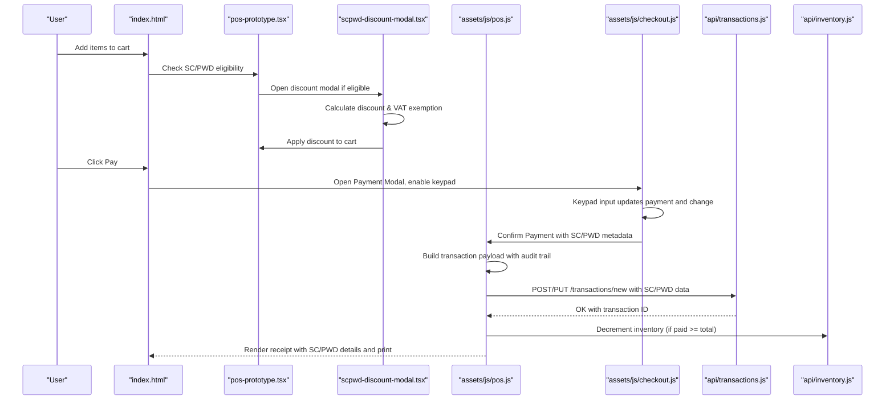

**Diagram sources**
- [index.html](file://index.html)
- [checkout.js](file://assets/js/checkout.js)
- [pos.js](file://assets/js/pos.js)
- [transactions.js](file://api/transactions.js)
- [inventory.js](file://api/inventory.js)
- [pos-prototype.tsx](file://web-prototype/src/components/pos-prototype.tsx)
- [scpwd-discount-modal.tsx](file://web-prototype/src/components/scpwd-discount-modal.tsx)

## Detailed Component Analysis

### Enhanced Payment Modal and Keypad
- Numeric keypad supports digits, decimal point, delete/backspace, and AC clear.
- For due orders, the keypad appends to the reference number input.
- For payments, the keypad appends to the hidden payment input and formats display.
- Change is calculated as payable minus payment; "Confirm Payment" becomes visible when change is zero or negative.
- **Updated**: Now validates SC/PWD discount eligibility and prevents double discount application.

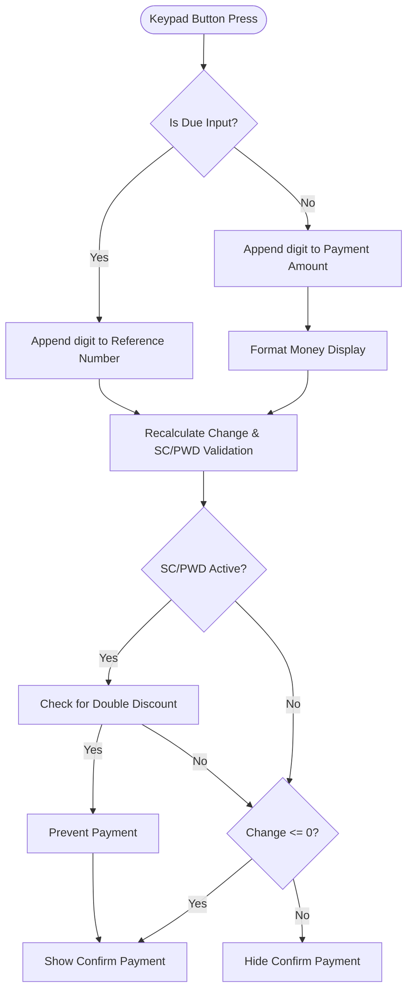

**Diagram sources**
- [checkout.js](file://assets/js/checkout.js)
- [scpwd-discount-modal.tsx](file://web-prototype/src/components/scpwd-discount-modal.tsx)

**Section sources**
- [checkout.js](file://assets/js/checkout.js)
- [index.html](file://index.html)
- [scpwd-discount-modal.tsx](file://web-prototype/src/components/scpwd-discount-modal.tsx)

### Advanced Amount Validation and Change Calculation
- Payable price and payment amount are parsed and stripped of thousands separators before arithmetic.
- Change is computed and formatted; confirm button visibility toggles accordingly.
- Quick billing mode bypasses the payment modal and auto-submits the payable amount.
- **Updated**: SC/PWD discount validation prevents payment until discount is properly applied or removed.

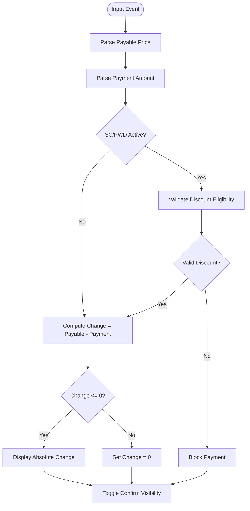

**Diagram sources**
- [checkout.js](file://assets/js/checkout.js)
- [scpwd-discount-modal.tsx](file://web-prototype/src/components/scpwd-discount-modal.tsx)

**Section sources**
- [checkout.js](file://assets/js/checkout.js)
- [pos.js](file://assets/js/pos.js)
- [scpwd-discount-modal.tsx](file://web-prototype/src/components/scpwd-discount-modal.tsx)

### Comprehensive Receipt Generation and Printing
- Receipt template is built dynamically with store settings, items, totals, discount, VAT, and payment details.
- **Updated**: Includes SC/PWD discount breakdown, VAT exemption details, and customer identification.
- DOMPurify sanitizes HTML prior to rendering to mitigate XSS.
- Receipt is shown in a modal and printed via a browser-native print mechanism.

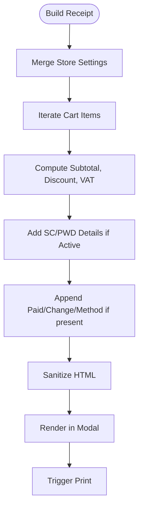

**Diagram sources**
- [pos.js](file://assets/js/pos.js)
- [scpwd-discount-modal.tsx](file://web-prototype/src/components/scpwd-discount-modal.tsx)

**Section sources**
- [pos.js](file://assets/js/pos.js)
- [scpwd-discount-modal.tsx](file://web-prototype/src/components/scpwd-discount-modal.tsx)

### Enhanced Transaction Submission and Persistence
- Payload includes order number, reference number, customer, items, totals, taxes, payment type/info, and cashier metadata.
- **Updated**: SC/PWD transaction metadata includes discount type, ID number, TIN, proxy purchase details, and supervisor override information.
- On successful POST/PUT, cart is cleared, UI refreshed, inventory decremented when fully paid, and SC/PWD audit trail created.
- On failure, user receives a friendly error and the modal remains open.

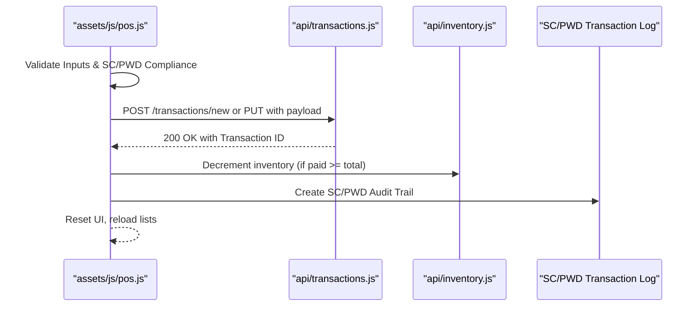

**Diagram sources**
- [pos.js](file://assets/js/pos.js)
- [transactions.js](file://api/transactions.js)
- [inventory.js](file://api/inventory.js)
- [scpwd-transaction-log.tsx](file://web-prototype/src/components/scpwd-transaction-log.tsx)

**Section sources**
- [pos.js](file://assets/js/pos.js)
- [transactions.js](file://api/transactions.js)
- [inventory.js](file://api/inventory.js)
- [scpwd-transaction-log.tsx](file://web-prototype/src/components/scpwd-transaction-log.tsx)

### Enhanced Due Order System and Customer Association
- Hold order flow requires either a customer selection or a reference number; otherwise, a warning is shown.
- **Updated**: SC/PWD discount status is maintained with due orders for proper audit trail.
- On-hold orders are fetched and displayed with SC/PWD metadata; each holds items, totals, customer association, and discount status.
- Customer orders with unpaid status and empty reference are retrievable for further action.
- Reference numbers are stored per order; order numbers are either derived from a held order or generated as a Unix timestamp.

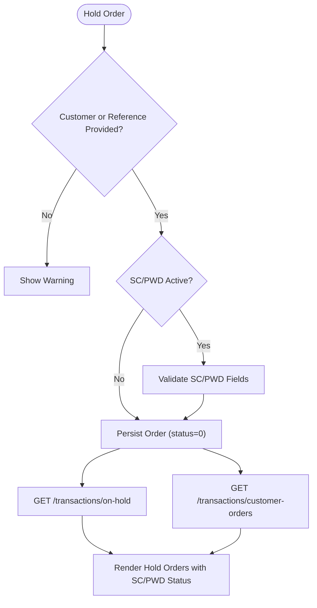

**Diagram sources**
- [pos.js](file://assets/js/pos.js)
- [transactions.js](file://api/transactions.js)
- [scpwd-discount-modal.tsx](file://web-prototype/src/components/scpwd-discount-modal.tsx)

**Section sources**
- [pos.js](file://assets/js/pos.js)
- [transactions.js](file://api/transactions.js)
- [scpwd-discount-modal.tsx](file://web-prototype/src/components/scpwd-discount-modal.tsx)

### Enhanced Reference Number Generation and Order Numbering
- Reference number: optional free-text input for due orders; if blank, order number is used as reference.
- **Updated**: SC/PWD discount status is preserved across order modifications.
- Order number: derived from a previously held order if editing; otherwise, generated as a Unix timestamp (seconds) to ensure uniqueness.

**Diagram sources**
- [pos.js](file://assets/js/pos.js)

**Section sources**
- [pos.js](file://assets/js/pos.js)

### Enhanced Payment Method Selection and Validation Rules
- Active payment type is tracked from the payment modal's active list item.
- Supported methods: Cash and Card; Check variant is supported via a label change in the card info section.
- **Updated**: SC/PWD discount validation ensures compliance with legal requirements.
- Validation rules:
  - Payment amount must be entered before confirming.
  - For due orders, either a customer must be selected or a reference number must be provided.
  - **Updated**: SC/PWD discount cannot be combined with existing manual discounts on eligible items.
  - **Updated**: VAT exemption applies only to SC/PWD-eligible items as per legal requirements.
  - VAT is computed only if enabled in settings and not exempted by SC/PWD discount.

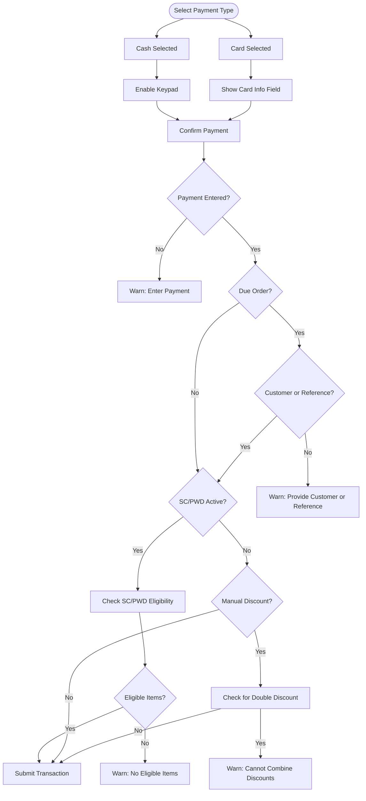

**Diagram sources**
- [checkout.js](file://assets/js/checkout.js)
- [pos.js](file://assets/js/pos.js)
- [scpwd-discount-modal.tsx](file://web-prototype/src/components/scpwd-discount-modal.tsx)

**Section sources**
- [checkout.js](file://assets/js/checkout.js)
- [pos.js](file://assets/js/pos.js)
- [scpwd-discount-modal.tsx](file://web-prototype/src/components/scpwd-discount-modal.tsx)

### Enhanced Receipt Printing and PDF Conversion
- Receipts are rendered as HTML inside a modal and printed via the browser's print dialog.
- **Updated**: SC/PWD discount details and VAT exemption information are included in printed receipts.
- The system does not use jsPDF or html2canvas for PDF conversion in the provided code; printing is handled by the browser's native capabilities.

**Section sources**
- [pos.js](file://assets/js/pos.js)
- [index.html](file://index.html)
- [scpwd-discount-modal.tsx](file://web-prototype/src/components/scpwd-discount-modal.tsx)

### Integration with External Payment Processors
- The checkout supports Cash and Card methods. To integrate external processors:
  - Extend the payment type selection to include "Card" and capture processor-specific identifiers in the payment info field.
  - Modify the transaction payload to include processor metadata (e.g., transaction ID, auth code).
  - Ensure backend endpoints accept and persist the additional fields.
- **Updated**: SC/PWD discount metadata is preserved during external payment processing.

**Section sources**
- [pos.js](file://assets/js/pos.js)
- [transactions.js](file://api/transactions.js)
- [scpwd-discount-modal.tsx](file://web-prototype/src/components/scpwd-discount-modal.tsx)

## SC/PWD Discount System

### Automatic Discount Calculation
The system automatically calculates SC/PWD discounts based on item eligibility and store VAT registration status:
- **VAT-registered stores**: Apply 20% discount on VAT-exempt amount (Price ÷ 1.12)
- **Non-VAT stores**: Apply 20% discount directly on item price
- **Mixed carts**: Only eligible items receive discounts; non-eligible items remain at full price
- **Automatic rounding**: All discount amounts are rounded to two decimal places

### VAT Exemption Handling
- VAT is automatically removed for SC/PWD-eligible items before discount calculation
- VAT exemption applies only to items classified as "medicine" or "non-medicine" under SC/PWD eligibility
- Excluded items (e.g., consultations) remain subject to normal taxation
- VAT exemption is tracked separately in transaction metadata

### SC/PWD Eligibility Validation
- Products are flagged as SC/PWD eligible with three categories: "medicine", "non-medicine", or "excluded"
- Eligibility is determined by product classification and store settings
- Mixed carts are processed item-by-item with appropriate eligibility checks
- **Updated**: Automatic validation prevents double discount application on eligible items

### Discount Application Workflow
1. **Eligibility Check**: System identifies SC/PWD-eligible items in the cart
2. **VAT Exemption**: Applicable VAT is removed from eligible items
3. **Discount Calculation**: 20% discount is applied to the VAT-exempt amount
4. **Total Recalculation**: Cart totals are recomputed with SC/PWD discount applied
5. **Validation**: System ensures no double discount and legal compliance

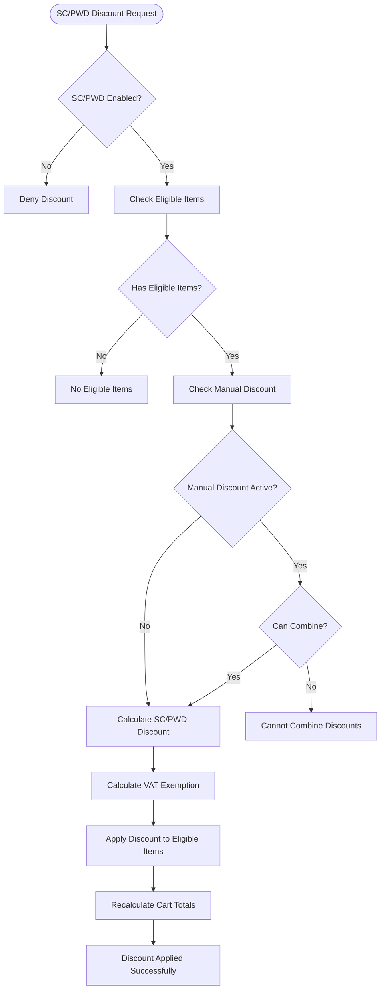

**Diagram sources**
- [calculations.ts](file://web-prototype/src/lib/calculations.ts)
- [scpwd-discount-modal.tsx](file://web-prototype/src/components/scpwd-discount-modal.tsx)

**Section sources**
- [scpwd_user_stories.md](file://scpwd_user_stories.md)
- [calculations.ts](file://web-prototype/src/lib/calculations.ts)
- [scpwd-discount-modal.tsx](file://web-prototype/src/components/scpwd-discount-modal.tsx)
- [types.ts](file://web-prototype/src/lib/types.ts)

## RX Workspace Integration

### Prescription Management
The RX workspace provides comprehensive prescription management capabilities:
- **Prescription Entry**: Captures prescriber details, patient information, and medication specifics
- **DD/EDD Tracking**: Special handling for dangerous drugs with S-2 license requirements
- **Yellow Rx Forms**: Mandatory documentation for DD transactions
- **Pharmacist Acknowledgment**: Required for pharmacist-only OTC medications

### Dispensing Checkpoints
The system implements strict dispensing checkpoints based on drug classification:
- **DD, Rx**: Requires special DOH Yellow Rx form
- **EDD, Rx**: Requires valid S-2 license from prescriber
- **Rx**: Requires valid physician prescription
- **Pharmacist-Only OTC**: Requires pharmacist acknowledgment before checkout

### RX Workspace Components
- **Classification Panel**: Manages drug classification and eligibility
- **Dispensing Panel**: Handles prescription fulfillment and validation
- **Patient Profiles**: Maintains medication history and compliance tracking
- **DD Log**: Registers DD/EDD transactions with running balances
- **Inspection Dashboard**: Provides compliance overview and alerts

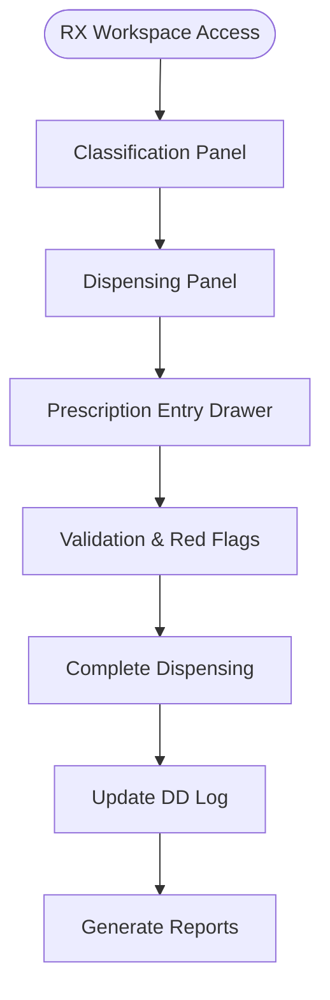

**Diagram sources**
- [rx-workspace.tsx](file://web-prototype/src/components/rx-workspace.tsx)
- [pos-prototype.tsx](file://web-prototype/src/components/pos-prototype.tsx)

**Section sources**
- [rx-workspace.tsx](file://web-prototype/src/components/rx-workspace.tsx)
- [pos-prototype.tsx](file://web-prototype/src/components/pos-prototype.tsx)
- [types.ts](file://web-prototype/src/lib/types.ts)

## Enhanced Transaction Logging

### SC/PWD Transaction Audit Trail
The system maintains comprehensive audit trails for all SC/PWD transactions:
- **Transaction Log**: Detailed record of each SC/PWD discount application
- **Monthly Summaries**: Aggregate reports for tax compliance and reporting
- **Alert System**: Automated alerts for suspicious activities or policy violations
- **Export Capabilities**: CSV export for regulatory submissions

### Audit Trail Components
- **Transaction Log Row**: Contains OR number, timestamp, customer details, discount type, and financial amounts
- **Summary Card**: Monthly overview of SC/PWD transactions, discounts, and VAT exemptions
- **Alert Management**: Tracking of duplicate ID usage, daily thresholds, and ineligible item discounts
- **Compliance Reporting**: Support for BIR tax deduction claims and FDA/DOH inspections

### Transaction Metadata
Each SC/PWD transaction includes comprehensive metadata:
- Customer identification (ID type, ID number, TIN)
- Discount application details (type, amount, VAT removed)
- Itemized breakdown of discounted products
- Proxy purchase information (if applicable)
- Supervisor override details (if applicable)

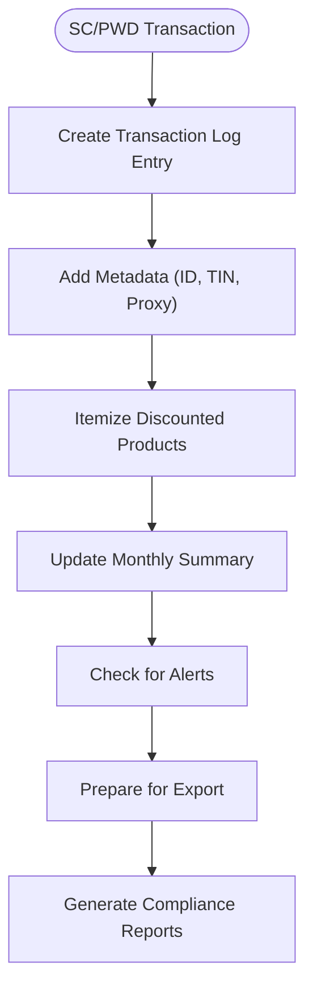

**Diagram sources**
- [scpwd-transaction-log.tsx](file://web-prototype/src/components/scpwd-transaction-log.tsx)
- [scpwd-summary-card.tsx](file://web-prototype/src/components/scpwd-summary-card.tsx)
- [use-pos-store.ts](file://web-prototype/src/lib/use-pos-store.ts)

**Section sources**
- [scpwd-transaction-log.tsx](file://web-prototype/src/components/scpwd-transaction-log.tsx)
- [scpwd-summary-card.tsx](file://web-prototype/src/components/scpwd-summary-card.tsx)
- [scpwd-breakdown-card.tsx](file://web-prototype/src/components/scpwd-breakdown-card.tsx)
- [use-pos-store.ts](file://web-prototype/src/lib/use-pos-store.ts)
- [types.ts](file://web-prototype/src/lib/types.ts)

## Dependency Analysis
- Frontend depends on utils for formatting and security policies.
- POS module orchestrates UI events, builds payloads, and interacts with APIs.
- **Updated**: Web prototype components depend on calculation engine for SC/PWD processing.
- **Updated**: State management coordinates between desktop and web interfaces.
- Transactions API persists orders with SC/PWD metadata and exposes audit trail endpoints.
- Inventory API decrements stock upon successful payment.
- Customers API supplies customer data for association and SC/PWD eligibility tracking.

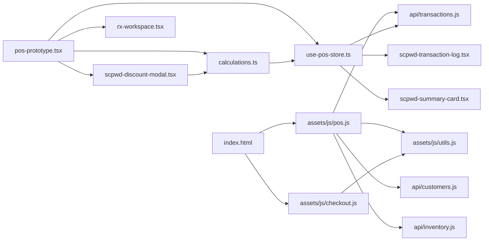

**Diagram sources**
- [pos.js](file://assets/js/pos.js)
- [checkout.js](file://assets/js/checkout.js)
- [utils.js](file://assets/js/utils.js)
- [transactions.js](file://api/transactions.js)
- [customers.js](file://api/customers.js)
- [inventory.js](file://api/inventory.js)
- [index.html](file://index.html)
- [pos-prototype.tsx](file://web-prototype/src/components/pos-prototype.tsx)
- [scpwd-discount-modal.tsx](file://web-prototype/src/components/scpwd-discount-modal.tsx)
- [rx-workspace.tsx](file://web-prototype/src/components/rx-workspace.tsx)
- [calculations.ts](file://web-prototype/src/lib/calculations.ts)
- [use-pos-store.ts](file://web-prototype/src/lib/use-pos-store.ts)
- [scpwd-transaction-log.tsx](file://web-prototype/src/components/scpwd-transaction-log.tsx)
- [scpwd-summary-card.tsx](file://web-prototype/src/components/scpwd-summary-card.tsx)

**Section sources**
- [pos.js](file://assets/js/pos.js)
- [checkout.js](file://assets/js/checkout.js)
- [utils.js](file://assets/js/utils.js)
- [transactions.js](file://api/transactions.js)
- [customers.js](file://api/customers.js)
- [inventory.js](file://api/inventory.js)
- [index.html](file://index.html)
- [pos-prototype.tsx](file://web-prototype/src/components/pos-prototype.tsx)
- [scpwd-discount-modal.tsx](file://web-prototype/src/components/scpwd-discount-modal.tsx)
- [rx-workspace.tsx](file://web-prototype/src/components/rx-workspace.tsx)
- [calculations.ts](file://web-prototype/src/lib/calculations.ts)
- [use-pos-store.ts](file://web-prototype/src/lib/use-pos-store.ts)
- [scpwd-transaction-log.tsx](file://web-prototype/src/components/scpwd-transaction-log.tsx)
- [scpwd-summary-card.tsx](file://web-prototype/src/components/scpwd-summary-card.tsx)

## Performance Considerations
- Minimize DOM updates by batching UI re-renders after cart changes.
- Debounce input events for payment amount to avoid frequent recalculations.
- Use efficient selectors and avoid deep DOM traversal in the keypad handlers.
- Cache computed totals and only recalculate when cart or discount changes.
- **Updated**: Optimize SC/PWD calculation by caching eligibility results and discount computations.
- **Updated**: Implement lazy loading for RX workspace components to improve initial load performance.

## Troubleshooting Guide
- Payment confirmation disabled: Ensure the payable amount is fully covered; the confirm button appears when change is zero or negative.
- Missing customer or reference for due orders: Provide either a customer or a reference number before holding an order.
- **Updated**: SC/PWD discount not applying: Verify item eligibility, ensure no conflicting manual discounts, and check VAT registration status.
- **Updated**: RX workspace issues: Ensure proper drug classification, validate prescription requirements, and check pharmacist acknowledgment status.
- Printing issues: Verify the receipt modal is open and the browser print dialog is accessible; avoid reloading the page mid-print.
- Transaction errors: Confirm network connectivity to the API and review returned error messages for actionable feedback.
- **Updated**: SC/PWD audit trail not appearing: Check transaction metadata inclusion and verify SC/PWD discount application status.

**Section sources**
- [checkout.js](file://assets/js/checkout.js)
- [pos.js](file://assets/js/pos.js)
- [scpwd-discount-modal.tsx](file://web-prototype/src/components/scpwd-discount-modal.tsx)
- [rx-workspace.tsx](file://web-prototype/src/components/rx-workspace.tsx)

## Conclusion
The enhanced PharmaSpot checkout system provides a comprehensive, compliant solution for cash and card payments with advanced SC/PWD discount integration, RX workspace support, and detailed transaction logging. The system's modular architecture enables straightforward extension for external payment processors while maintaining strict compliance with legal requirements for senior citizens and persons with disabilities. The addition of RX workspace capabilities and comprehensive audit trails makes it suitable for complex pharmacy operations requiring strict regulatory compliance.

## Appendices

### API Endpoints Used by Enhanced Checkout
- POST /api/transactions/new: Create a new transaction with SC/PWD metadata
- PUT /api/transactions/new: Update an existing transaction with SC/PWD changes
- GET /api/transactions/on-hold: Retrieve on-hold orders with SC/PWD status
- GET /api/transactions/customer-orders: Retrieve unpaid customer orders with SC/PWD details
- GET /api/customers/all: Load customers for selection with SC/PWD eligibility
- POST /api/inventory/product: Save product (used indirectly via POS)
- **Updated**: GET /api/transactions/scpwd-log: Retrieve SC/PWD transaction audit trail
- **Updated**: GET /api/transactions/scpwd-summary: Retrieve monthly SC/PWD summary reports

**Section sources**
- [transactions.js](file://api/transactions.js)
- [customers.js](file://api/customers.js)
- [inventory.js](file://api/inventory.js)
- [pos.js](file://assets/js/pos.js)
- [scpwd-transaction-log.tsx](file://web-prototype/src/components/scpwd-transaction-log.tsx)
- [scpwd-summary-card.tsx](file://web-prototype/src/components/scpwd-summary-card.tsx)

### SC/PWD Legal Compliance References
- **RA 9994**: Expanded Senior Citizens Act of 2010
- **RA 10754**: Expanded Benefits and Privileges of PWD
- **BIR RR No. 7-2010**: VAT exemption for SC/PWD sales
- **BIR RR No. 16-2018**: TIN requirements for SC/PWD transactions
- **DOH AO No. 2010-0032**: Pricing guidelines for SC/PWD
- **FDA Circular No. 2025-005**: Pharmacy regulations compliance

**Section sources**
- [scpwd_user_stories.md](file://scpwd_user_stories.md)