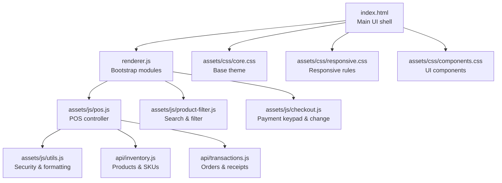
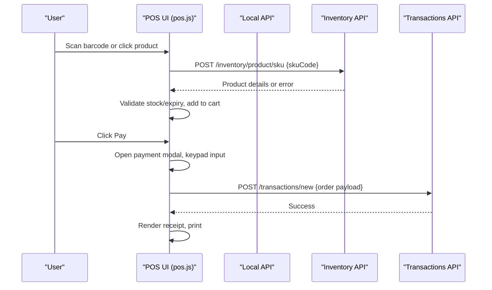
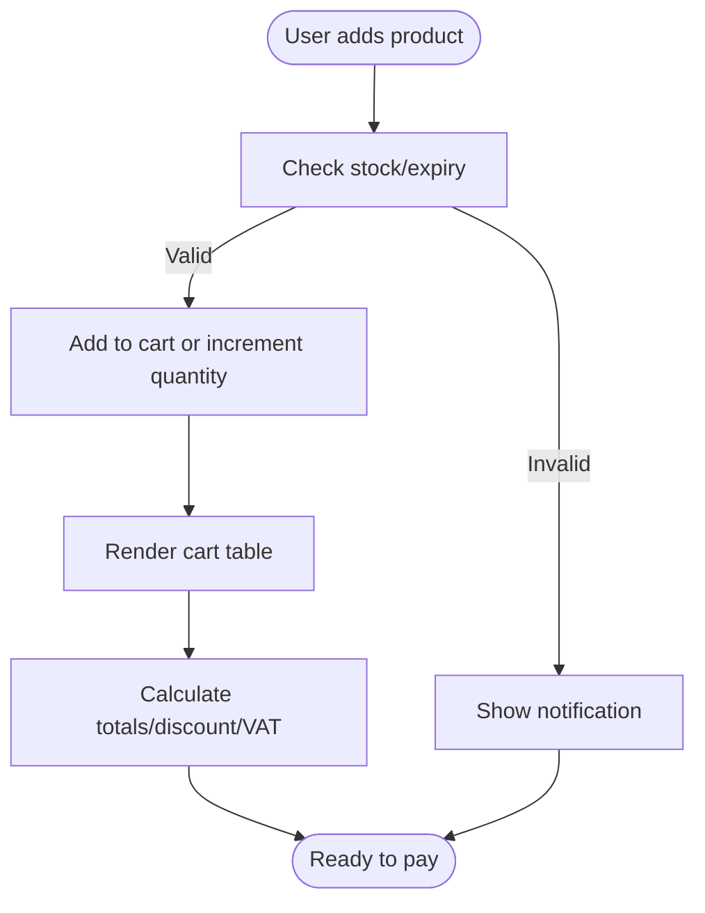
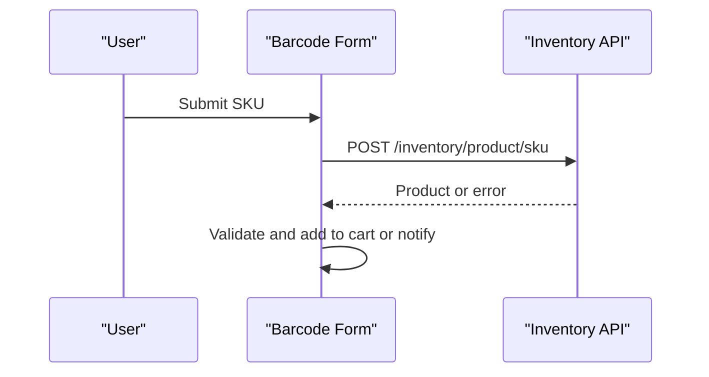
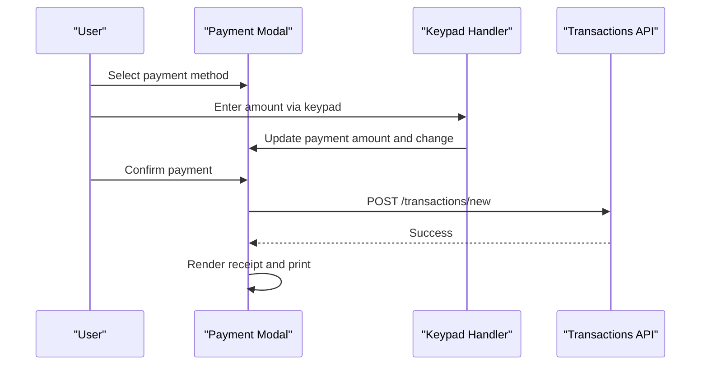
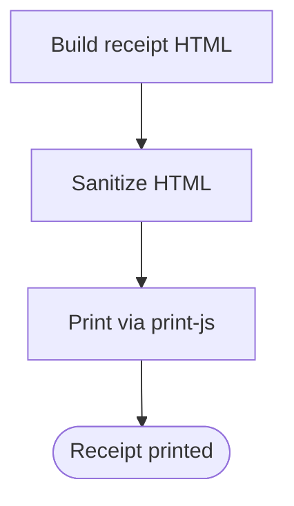
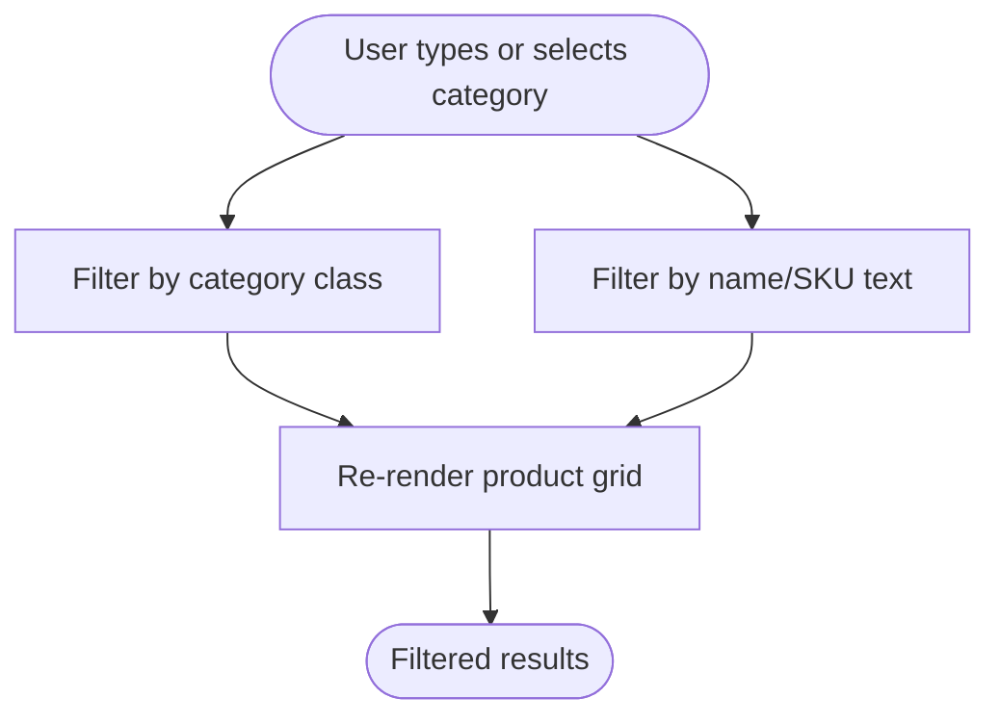
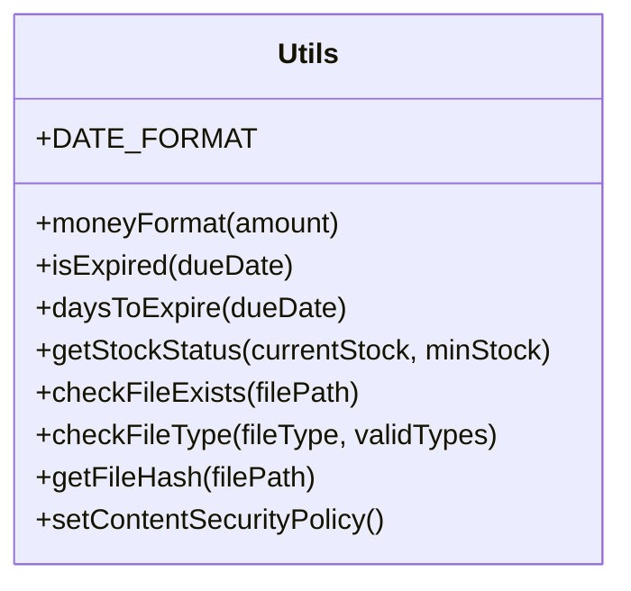
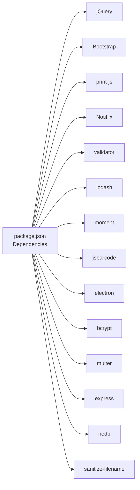

# Frontend Interface

<cite>
**Referenced Files in This Document**
- [index.html](file://index.html)
- [renderer.js](file://renderer.js)
- [pos.js](file://assets/js/pos.js)
- [checkout.js](file://assets/js/checkout.js)
- [product-filter.js](file://assets/js/product-filter.js)
- [utils.js](file://assets/js/utils.js)
- [core.css](file://assets/css/core.css)
- [responsive.css](file://assets/css/responsive.css)
- [components.css](file://assets/css/components.css)
- [inventory.js](file://api/inventory.js)
- [transactions.js](file://api/transactions.js)
- [package.json](file://package.json)
</cite>

## Table of Contents
1. [Introduction](#introduction)
2. [Project Structure](#project-structure)
3. [Core Components](#core-components)
4. [Architecture Overview](#architecture-overview)
5. [Detailed Component Analysis](#detailed-component-analysis)
6. [Dependency Analysis](#dependency-analysis)
7. [Performance Considerations](#performance-considerations)
8. [Troubleshooting Guide](#troubleshooting-guide)
9. [Conclusion](#conclusion)
10. [Appendices](#appendices)

## Introduction
This document describes the PharmaSpot POS frontend interface, focusing on the Point of Sale (POS) main interface, cart management, payment processing, barcode scanning integration, checkout system with multi-payment methods, receipt generation, change calculation, product filtering and search, UI behaviors, accessibility, responsive design, cross-browser compatibility, and theming guidelines. It synthesizes the client-side JavaScript modules, HTML templates, and CSS styles to explain how the system works and how to customize and maintain it.

## Project Structure
The frontend is an Electron-based desktop application with a web-like UI built using jQuery, Bootstrap, and custom CSS. The main entry wires jQuery into the window and loads the POS, product filter, and checkout modules. The POS module orchestrates cart operations, barcode scanning, payments, receipts, and order persistence via local APIs.

**Diagram sources**
- [index.html](file://index.html)
- [renderer.js](file://renderer.js)
- [pos.js](file://assets/js/pos.js)
- [checkout.js](file://assets/js/checkout.js)
- [product-filter.js](file://assets/js/product-filter.js)
- [utils.js](file://assets/js/utils.js)
- [inventory.js](file://api/inventory.js)
- [transactions.js](file://api/transactions.js)
- [core.css](file://assets/css/core.css)
- [responsive.css](file://assets/css/responsive.css)
- [components.css](file://assets/css/components.css)

**Section sources**
- [index.html](file://index.html)
- [renderer.js](file://renderer.js)

## Core Components
- POS Controller: Manages cart lifecycle, product selection, barcode scanning, taxes, discounts, totals, and order submission.
- Checkout Module: Handles keypad input, payment amount entry, and change computation.
- Product Filter: Implements category filtering and free-text search across product tiles.
- Utility Library: Provides security policies, currency formatting, stock status, and file checks.
- UI Styles: Base layout, component styling, and responsive breakpoints.

Key responsibilities:
- Cart management: Add/remove/update quantities, calculate totals, apply discount, compute VAT.
- Payment processing: Multi-method selection (Cash/Card), keypad input, change display, confirm payment.
- Barcode scanning: POST SKU to backend, validate availability/expiry, add to cart.
- Receipt generation: Build HTML receipt, sanitize, print via jsPDF/html2canvas/print-js.
- Filtering/search: Category dropdown and text input filter product grid.

**Section sources**
- [pos.js](file://assets/js/pos.js)
- [checkout.js](file://assets/js/checkout.js)
- [product-filter.js](file://assets/js/product-filter.js)
- [utils.js](file://assets/js/utils.js)

## Architecture Overview
The POS UI communicates with local APIs for inventory and transactions. The renderer wires modules and exposes jQuery globally. The POS controller fetches products, categories, and customers, renders product tiles, and manages cart updates. Payments open a modal with keypad controls and confirm actions.

**Diagram sources**
- [pos.js](file://assets/js/pos.js)
- [checkout.js](file://assets/js/checkout.js)
- [inventory.js](file://api/inventory.js)
- [transactions.js](file://api/transactions.js)

## Detailed Component Analysis

### POS Main Interface and Cart Management
- Cart lifecycle:
  - Add product to cart, increment/decrement quantity, delete item, cancel order.
  - Recalculate totals, discount, VAT, and gross price.
- Rendering:
  - Dynamic cart table rows with quantity controls and delete buttons.
  - Totals summary and gross price display.
- Validation:
  - Stock availability, expiry checks, and notifications for out-of-stock/expired items.

**Diagram sources**
- [pos.js](file://assets/js/pos.js)

**Section sources**
- [pos.js](file://assets/js/pos.js)

### Barcode Scanning Integration
- Input: Barcode scan or typed SKU followed by Enter or click.
- Request: POST SKU to backend inventory service.
- Responses:
  - Valid product: add to cart, reset input, show success indicator.
  - Expired/out-of-stock/not found: show appropriate notifications.
- Backend: Validates SKU against stored barcodes and returns product record.

**Diagram sources**
- [pos.js](file://assets/js/pos.js)
- [inventory.js](file://api/inventory.js)

**Section sources**
- [pos.js](file://assets/js/pos.js)
- [inventory.js](file://api/inventory.js)

### Checkout System and Payment Processing
- Payment modal:
  - Payment method selection (Cash/Card).
  - Keypad input for payment amount with decimal support.
  - Real-time change calculation; confirm button enabled when paid ≥ total.
- Submission:
  - On confirm, serialize cart, customer, discount, tax, and payment info.
  - POST to transactions API; on success, render receipt and optionally print.

**Diagram sources**
- [checkout.js](file://assets/js/checkout.js)
- [pos.js](file://assets/js/pos.js)
- [transactions.js](file://api/transactions.js)

**Section sources**
- [checkout.js](file://assets/js/checkout.js)
- [pos.js](file://assets/js/pos.js)
- [transactions.js](file://api/transactions.js)

### Receipt Generation and Printing
- Receipt building:
  - Compose HTML receipt with store info, items, totals, discount, tax, and payment details.
  - Sanitize HTML to prevent DOM XSS.
- Printing:
  - Uses print-js to print raw HTML receipt.
  - Optionally prints immediately upon “Hold” with status 3.

**Diagram sources**
- [pos.js](file://assets/js/pos.js)

**Section sources**
- [pos.js](file://assets/js/pos.js)

### Product Filtering and Search
- Category filter:
  - Change category dropdown to show only matching product tiles.
- Free-text search:
  - Live filter by product name or SKU in the search box.
- Open orders/customer orders:
  - Additional filters for “Hold Orders” and “Customer Orders” modals.

**Diagram sources**
- [product-filter.js](file://assets/js/product-filter.js)

**Section sources**
- [product-filter.js](file://assets/js/product-filter.js)

### Utility Functions: Security, Validation, Formatting
- Security:
  - Content Security Policy computed from bundle hashes and injected at runtime.
  - DOMPurify sanitization for receipt HTML.
- Validation:
  - Expiry checks, days to expiry, stock status calculation.
- Formatting:
  - Currency formatting with Intl.NumberFormat.
- File handling:
  - File existence checks, type validation, hashing for CSP.

**Diagram sources**
- [utils.js](file://assets/js/utils.js)

**Section sources**
- [utils.js](file://assets/js/utils.js)

### UI Behaviors, Accessibility, and Theming
- Accessibility:
  - Use of Bootstrap components and semantic markup; ensure focus states and keyboard navigation where applicable.
- Theming:
  - Centralized color and typography in core.css; component-specific overrides in components.css.
  - Responsive breakpoints in responsive.css for mobile/tablet/desktop.
- Customization guidelines:
  - Modify base colors and fonts in core.css.
  - Adjust component sizes and spacing in components.css.
  - Extend responsive rules in responsive.css for device-specific layouts.

**Section sources**
- [core.css](file://assets/css/core.css)
- [components.css](file://assets/css/components.css)
- [responsive.css](file://assets/css/responsive.css)

## Dependency Analysis
- Runtime dependencies (selected):
  - jQuery, Bootstrap, jsPDF, html2canvas, print-js, Notiflix, validator, lodash, moment, jsbarcode, electron, bcrypt, multer, express, nedb, sanitize-filename.
- Browser support:
  - Browserslist defines supported browsers; ensure legacy features are polyfilled if needed.

**Diagram sources**
- [package.json](file://package.json)

**Section sources**
- [package.json](file://package.json)

## Performance Considerations
- Rendering:
  - Efficient DOM updates via jQuery; minimize reflows by batching cart updates.
- Image handling:
  - Default fallback images and file existence checks reduce rendering errors.
- Network:
  - Local APIs reduce latency; debounce search/filter inputs to avoid excessive requests.
- Printing:
  - Receipt generation uses sanitized HTML; keep receipt content minimal for faster printing.

## Troubleshooting Guide
Common issues and resolutions:
- Barcode not recognized:
  - Verify SKU exists in inventory and is not expired; check network connectivity to local API.
- Payment amount errors:
  - Ensure keypad input is numeric; confirm change becomes visible when paid ≥ total.
- Printing problems:
  - Confirm print-js is loaded; check browser print dialog and printer status.
- Stock/expiry warnings:
  - Review notifications for expired or low-stock items; restock as needed.
- Receipt display:
  - Ensure DOMPurify sanitization passes; verify receipt HTML structure.

**Section sources**
- [pos.js](file://assets/js/pos.js)
- [checkout.js](file://assets/js/checkout.js)
- [utils.js](file://assets/js/utils.js)

## Conclusion
The PharmaSpot POS frontend integrates a robust cart system, barcode scanning, multi-method payment processing, and receipt generation. Its modular design (POS controller, checkout keypad, product filter, utilities) enables maintainability and extensibility. With responsive CSS and a clean theming model, the interface adapts across devices while preserving usability and security.

## Appendices

### API Endpoints Used by POS
- Inventory:
  - GET /inventory/products
  - GET /inventory/product/:id
  - POST /inventory/product/sku
- Transactions:
  - POST /transactions/new
  - GET /transactions/on-hold
  - GET /transactions/customer-orders
  - GET /transactions/by-date

**Section sources**
- [inventory.js](file://api/inventory.js)
- [transactions.js](file://api/transactions.js)