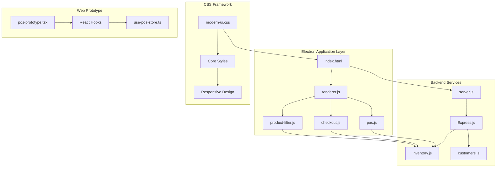
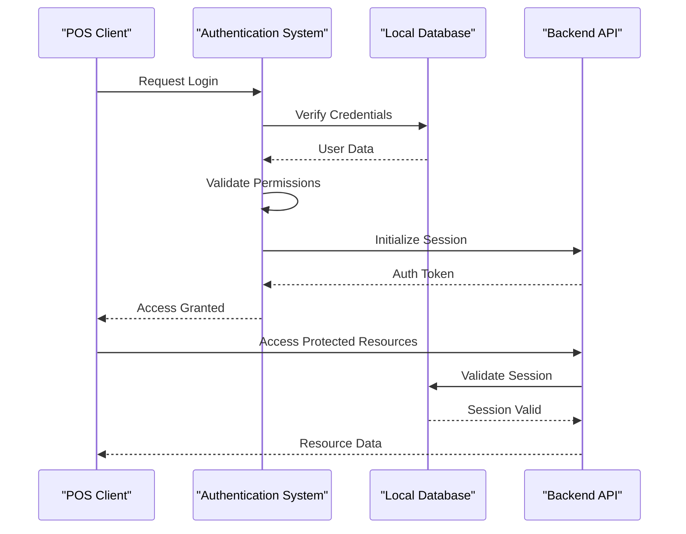
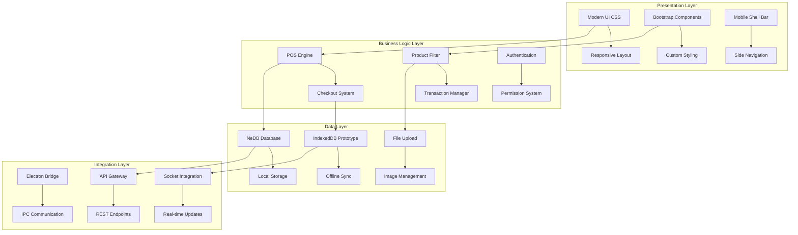
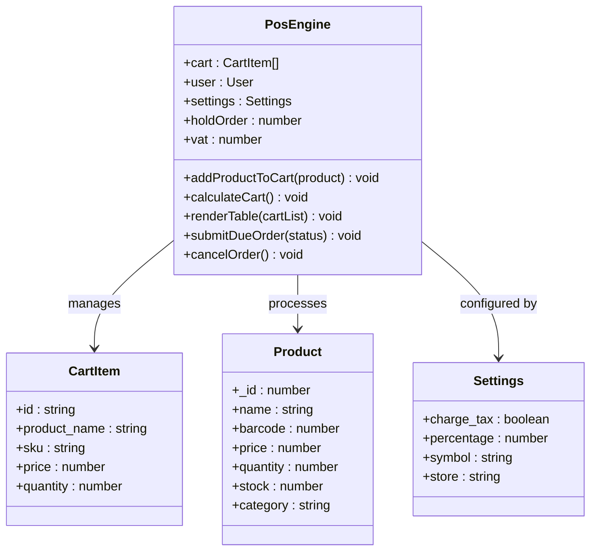
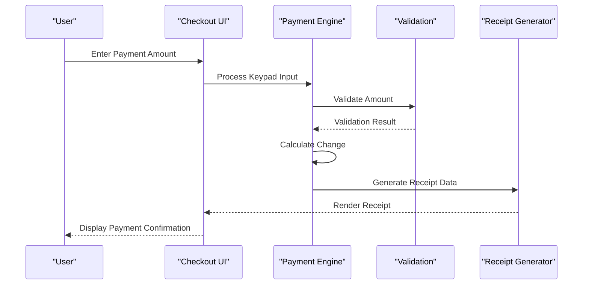
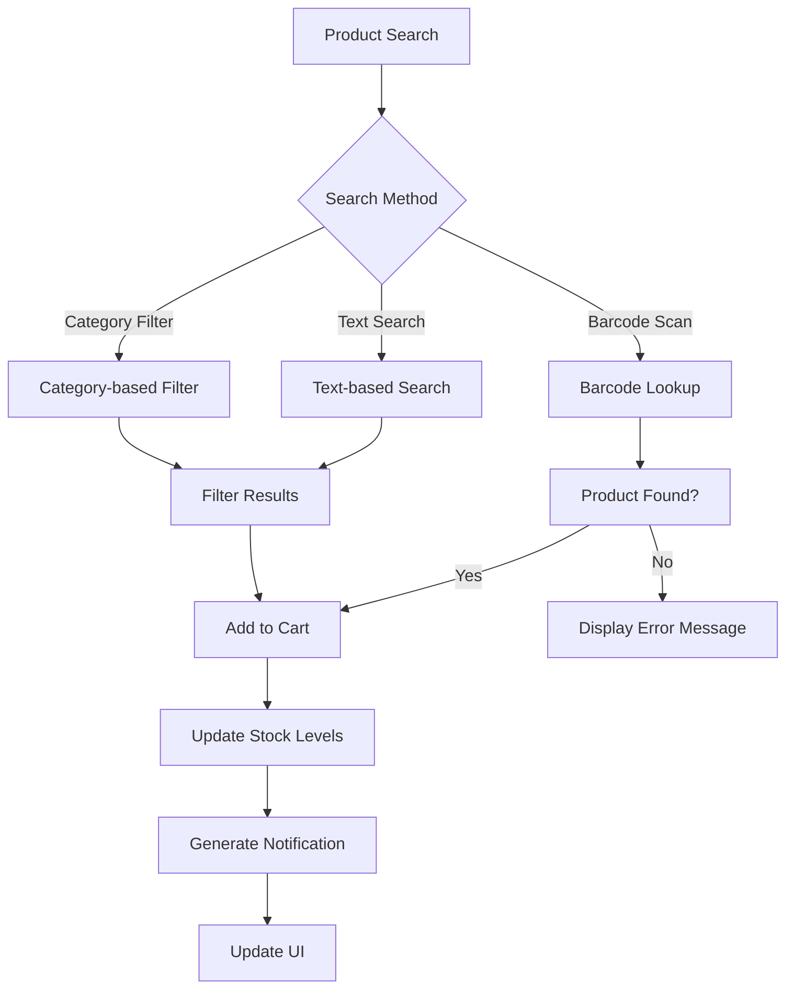
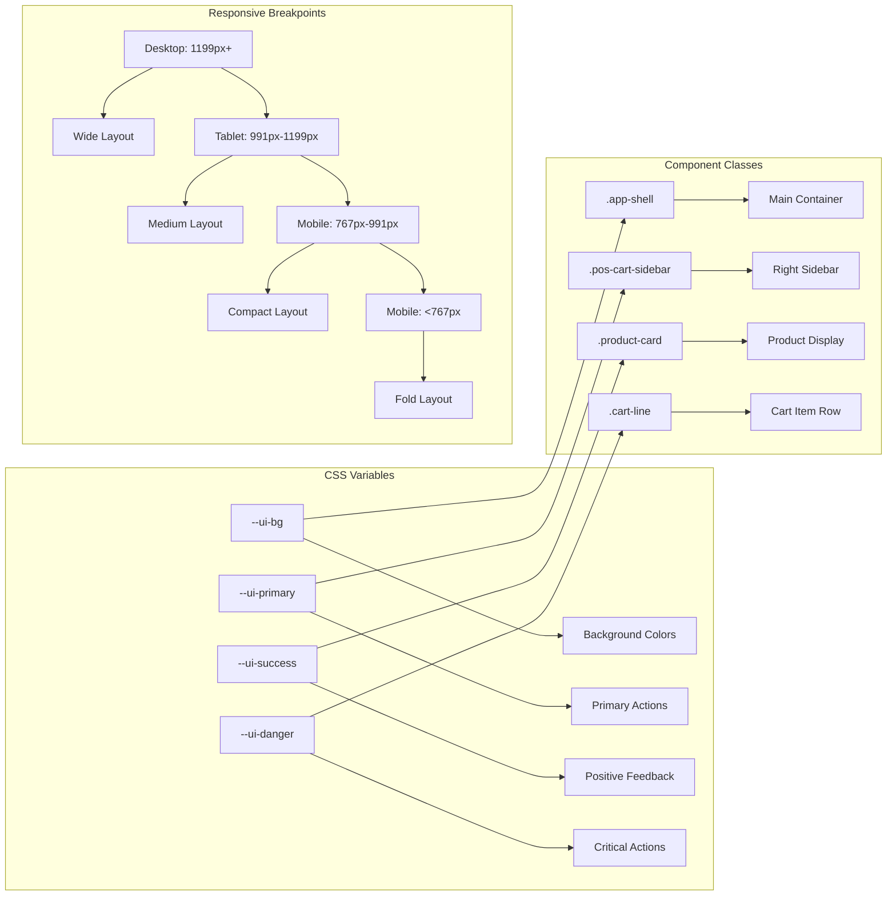
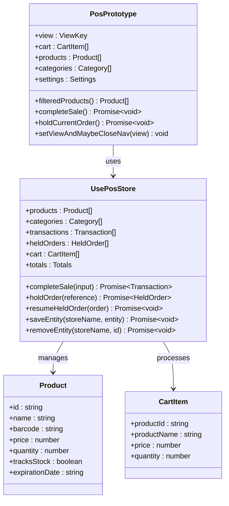
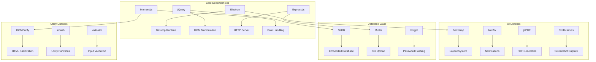

# Modern UI Framework

<cite>
**Referenced Files in This Document**
- [README.md](file://README.md)
- [package.json](file://package.json)
- [index.html](file://index.html)
- [renderer.js](file://renderer.js)
- [server.js](file://server.js)
- [assets/js/pos.js](file://assets/js/pos.js)
- [assets/js/checkout.js](file://assets/js/checkout.js)
- [assets/js/product-filter.js](file://assets/js/product-filter.js)
- [assets/js/utils.js](file://assets/js/utils.js)
- [assets/css/modern-ui.css](file://assets/css/modern-ui.css)
- [assets/css/core.css](file://assets/css/core.css)
- [api/inventory.js](file://api/inventory.js)
- [api/customers.js](file://api/customers.js)
- [web-prototype/src/components/pos-prototype.tsx](file://web-prototype/src/components/pos-prototype.tsx)
- [web-prototype/src/lib/use-pos-store.ts](file://web-prototype/src/lib/use-pos-store.ts)
</cite>

## Table of Contents
1. [Introduction](#introduction)
2. [Project Structure](#project-structure)
3. [Core Components](#core-components)
4. [Architecture Overview](#architecture-overview)
5. [Detailed Component Analysis](#detailed-component-analysis)
6. [Dependency Analysis](#dependency-analysis)
7. [Performance Considerations](#performance-considerations)
8. [Troubleshooting Guide](#troubleshooting-guide)
9. [Conclusion](#conclusion)

## Introduction

PharmaSpot Point of Sale is a modern cross-platform Point of Sale system designed specifically for pharmacy operations. Built with Electron and modern web technologies, it provides a comprehensive solution for retail pharmacy management with an emphasis on user experience and operational efficiency.

The system features a sophisticated modern UI framework that combines desktop application capabilities with web-based interfaces, offering both traditional jQuery-based POS functionality and a cutting-edge React-based web prototype. This dual-architecture approach ensures broad compatibility while providing state-of-the-art user experiences.

Key capabilities include multi-PC support for centralized database access, professional receipt printing, advanced product search with barcode scanning, staff account management with granular permissions, comprehensive inventory management, customer database maintenance, transaction history tracking, and real-time status alerts for low stock and expiring products.

## Project Structure

The PharmaSpot POS system follows a hybrid architecture combining Electron desktop application technology with modern web frameworks:

**Diagram sources**
- [index.html:1-899](file://index.html#L1-L899)
- [server.js:1-68](file://server.js#L1-L68)
- [assets/js/pos.js:1-2552](file://assets/js/pos.js#L1-L2552)

The project is organized into several key directories:

- **Root Level**: Application entry points, configuration files, and build scripts
- **assets/**: Static resources including CSS, JavaScript, fonts, and images
- **api/**: Backend API endpoints for inventory, customers, and transactions
- **web-prototype/**: Modern React-based POS interface with TypeScript
- **shared-memory/**: State management and persistence utilities

**Section sources**
- [README.md:1-91](file://README.md#L1-L91)
- [package.json:1-147](file://package.json#L1-L147)

## Core Components

### Modern UI Framework Architecture

The system implements a comprehensive modern UI framework through three primary layers:

#### 1. Desktop Application Layer
The Electron-based desktop application provides the primary POS interface with:
- **jQuery-based POS Engine**: Robust product management and transaction processing
- **Bootstrap Integration**: Responsive design system with custom styling
- **Native Menu System**: Platform-specific menu integration
- **Real-time Notifications**: User feedback through Notiflix library

#### 2. Web Prototype Layer
A modern React-based interface offering:
- **TypeScript Type Safety**: Comprehensive type definitions for all components
- **React Hooks Architecture**: Modern state management with custom hooks
- **Offline-First Design**: IndexedDB-based local data persistence
- **Real-time Synchronization**: Queue-based sync system for offline operations

#### 3. Backend API Layer
RESTful services supporting both interfaces:
- **NeDB Database Integration**: Lightweight embedded database for local storage
- **Multer File Upload**: Secure image handling for product management
- **Validation Middleware**: Input sanitization and validation
- **Async Operations**: Non-blocking database operations

**Section sources**
- [assets/css/modern-ui.css:1-739](file://assets/css/modern-ui.css#L1-L739)
- [web-prototype/src/components/pos-prototype.tsx:1-800](file://web-prototype/src/components/pos-prototype.tsx#L1-L800)

### Authentication and Security System

The framework implements a multi-layered security approach:

**Diagram sources**
- [assets/js/pos.js:196-220](file://assets/js/pos.js#L196-L220)
- [assets/js/utils.js:91-99](file://assets/js/utils.js#L91-L99)

**Section sources**
- [assets/js/pos.js:196-277](file://assets/js/pos.js#L196-L277)
- [assets/js/utils.js:91-112](file://assets/js/utils.js#L91-L112)

## Architecture Overview

The Modern UI Framework employs a hybrid architecture that seamlessly integrates desktop and web technologies:

**Diagram sources**
- [assets/css/modern-ui.css:32-46](file://assets/css/modern-ui.css#L32-L46)
- [assets/js/pos.js:278-365](file://assets/js/pos.js#L278-L365)
- [web-prototype/src/lib/use-pos-store.ts:51-434](file://web-prototype/src/lib/use-pos-store.ts#L51-L434)

The architecture supports multiple deployment scenarios:
- **Standalone Desktop Application**: Full Electron-based installation
- **Network Terminal Mode**: Thin client accessing central server
- **Server Mode**: Centralized database management for multiple terminals

**Section sources**
- [index.html:32-304](file://index.html#L32-L304)
- [server.js:40-45](file://server.js#L40-L45)

## Detailed Component Analysis

### POS Engine Component

The POS Engine serves as the core transaction processing system:

**Diagram sources**
- [assets/js/pos.js:512-622](file://assets/js/pos.js#L512-L622)
- [assets/js/pos.js:1044-1100](file://assets/js/pos.js#L1044-L1100)

The POS Engine implements sophisticated cart management with:
- **Real-time Quantity Updates**: Dynamic stock level adjustments
- **Tax Calculation Engine**: Configurable VAT handling
- **Discount Processing**: Flexible discount application
- **Hold Order System**: Temporary order storage with reference numbers

**Section sources**
- [assets/js/pos.js:512-724](file://assets/js/pos.js#L512-L724)

### Checkout System Component

The checkout system provides intuitive payment processing:

**Diagram sources**
- [assets/js/checkout.js:10-86](file://assets/js/checkout.js#L10-L86)

Key features include:
- **Dual Keypad Interface**: Separate input for payments and reference numbers
- **Real-time Change Calculation**: Instant feedback on payment amounts
- **Payment Method Selection**: Support for cash and card payments
- **Receipt Generation**: Professional receipt formatting with tax details

**Section sources**
- [assets/js/checkout.js:1-102](file://assets/js/checkout.js#L1-L102)

### Product Management Component

The product management system handles inventory operations:

**Diagram sources**
- [assets/js/product-filter.js:12-30](file://assets/js/product-filter.js#L12-L30)
- [assets/js/pos.js:424-499](file://assets/js/pos.js#L424-L499)

The system provides comprehensive product management features:
- **Multi-criteria Search**: Barcode, name, SKU, and supplier searches
- **Category Organization**: Hierarchical product categorization
- **Stock Monitoring**: Real-time stock level tracking
- **Expiry Management**: Automatic expiry date monitoring and alerts

**Section sources**
- [assets/js/product-filter.js:1-73](file://assets/js/product-filter.js#L1-L73)
- [assets/js/pos.js:278-365](file://assets/js/pos.js#L278-L365)

### Modern UI Styling System

The modern UI framework implements a comprehensive styling architecture:

**Diagram sources**
- [assets/css/modern-ui.css:1-18](file://assets/css/modern-ui.css#L1-L18)
- [assets/css/modern-ui.css:32-46](file://assets/css/modern-ui.css#L32-L46)
- [assets/css/modern-ui.css:613-739](file://assets/css/modern-ui.css#L613-L739)

The styling system emphasizes:
- **CSS Custom Properties**: Consistent theming across components
- **Grid-based Layout**: Flexible responsive design
- **Modern Color Palette**: Professional pharmacy-themed colors
- **Touch-friendly Interactions**: Large buttons and touch targets

**Section sources**
- [assets/css/modern-ui.css:1-739](file://assets/css/modern-ui.css#L1-L739)

### Web Prototype React Implementation

The React-based web prototype demonstrates modern frontend architecture:

**Diagram sources**
- [web-prototype/src/components/pos-prototype.tsx:58-427](file://web-prototype/src/components/pos-prototype.tsx#L58-L427)
- [web-prototype/src/lib/use-pos-store.ts:51-434](file://web-prototype/src/lib/use-pos-store.ts#L51-L434)

**Section sources**
- [web-prototype/src/components/pos-prototype.tsx:1-800](file://web-prototype/src/components/pos-prototype.tsx#L1-L800)
- [web-prototype/src/lib/use-pos-store.ts:1-434](file://web-prototype/src/lib/use-pos-store.ts#L1-L434)

## Dependency Analysis

The Modern UI Framework maintains clean separation of concerns through strategic dependency management:

**Diagram sources**
- [package.json:18-54](file://package.json#L18-L54)
- [package.json:115-145](file://package.json#L115-L145)

**Section sources**
- [package.json:1-147](file://package.json#L1-147)

### API Endpoint Architecture

The backend API follows RESTful principles with specialized endpoints:

| Endpoint | Method | Description | Response |
|----------|--------|-------------|----------|
| `/api/inventory/products` | GET | Retrieve all products | Array<Product> |
| `/api/inventory/product/:id` | GET | Get product by ID | Product |
| `/api/inventory/product` | POST | Create/update product | Status |
| `/api/inventory/product/sku` | POST | Find product by SKU | Product |
| `/api/customers/all` | GET | Get all customers | Array<Customer> |
| `/api/customers/customer/:id` | GET | Get customer by ID | Customer |
| `/api/customers/customer` | POST | Create customer | Status |

**Section sources**
- [api/inventory.js:89-115](file://api/inventory.js#L89-L115)
- [api/customers.js:47-73](file://api/customers.js#L47-L73)

## Performance Considerations

The Modern UI Framework implements several performance optimization strategies:

### Memory Management
- **Lazy Loading**: Assets loaded only when needed
- **Component Caching**: Frequently accessed data cached in memory
- **Efficient DOM Updates**: Minimal re-rendering through proper state management

### Network Optimization
- **Connection Pooling**: Reused database connections for better performance
- **Batch Operations**: Grouped database operations reduce overhead
- **Compression**: Content compression for API responses

### UI Performance
- **CSS Grid Layout**: Hardware-accelerated layout rendering
- **Debounced Search**: Input debouncing prevents excessive API calls
- **Virtual Scrolling**: Large lists rendered efficiently

## Troubleshooting Guide

### Common Issues and Solutions

#### Authentication Problems
**Issue**: Users unable to login to the POS system
**Solution**: 
1. Verify database connectivity in `server.js`
2. Check user credentials in local database
3. Review authentication logs for error messages

#### Product Search Failures
**Issue**: Barcode scanning not working properly
**Solution**:
1. Verify barcode format matches database entries
2. Check scanner compatibility with input field
3. Validate product database integrity

#### Payment Processing Errors
**Issue**: Payment amount calculation incorrect
**Solution**:
1. Verify tax settings in application configuration
2. Check currency formatting settings
3. Review payment method configurations

#### UI Responsiveness Issues
**Issue**: Slow interface response on older devices
**Solution**:
1. Optimize CSS animations for mobile devices
2. Reduce image sizes for better loading performance
3. Implement lazy loading for large product lists

**Section sources**
- [assets/js/pos.js:424-499](file://assets/js/pos.js#L424-L499)
- [assets/js/checkout.js:35-46](file://assets/js/checkout.js#L35-L46)

## Conclusion

The Modern UI Framework represents a comprehensive approach to Point of Sale system development, successfully combining traditional desktop application capabilities with modern web technologies. The framework's hybrid architecture provides flexibility for various deployment scenarios while maintaining consistent user experiences across platforms.

Key strengths of the framework include:

- **Dual Architecture Support**: Compatible with both Electron-based desktop applications and modern web interfaces
- **Robust Security Model**: Multi-layered authentication and validation systems
- **Scalable Design**: Modular components that can be independently developed and deployed
- **Modern Development Practices**: TypeScript integration, React-based prototypes, and comprehensive testing infrastructure

The framework's emphasis on user experience through thoughtful UI design, responsive layouts, and intuitive interaction patterns positions it as a strong foundation for pharmacy POS solutions. The combination of real-time synchronization, offline capability, and professional reporting features addresses the complex needs of modern pharmacy operations.

Future enhancements could focus on expanding the React prototype to full production readiness, implementing advanced analytics dashboards, and adding mobile device support for enhanced flexibility in pharmacy environments.