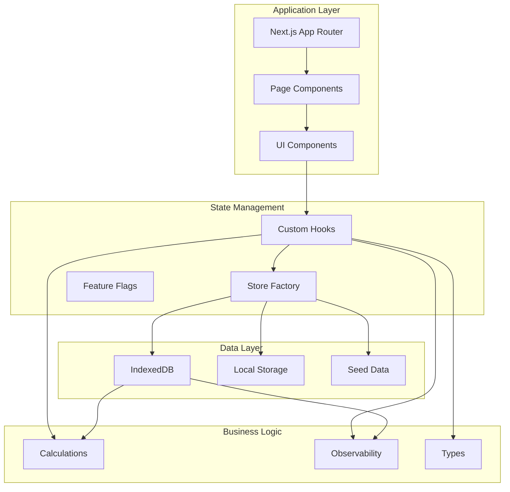
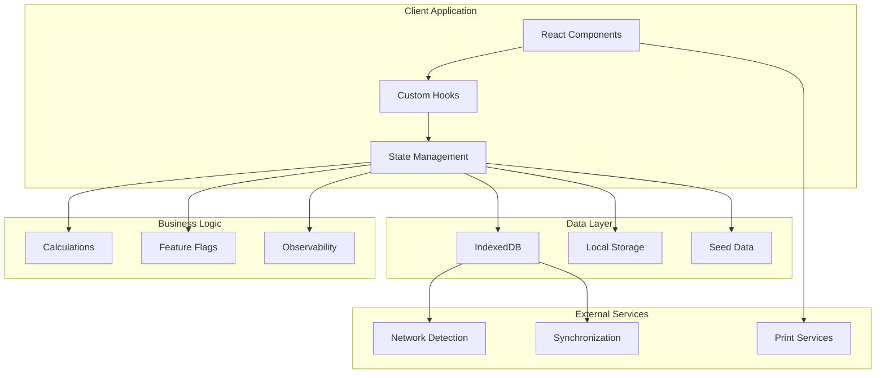
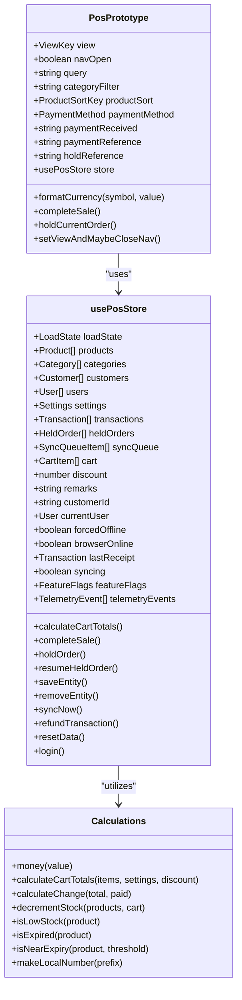
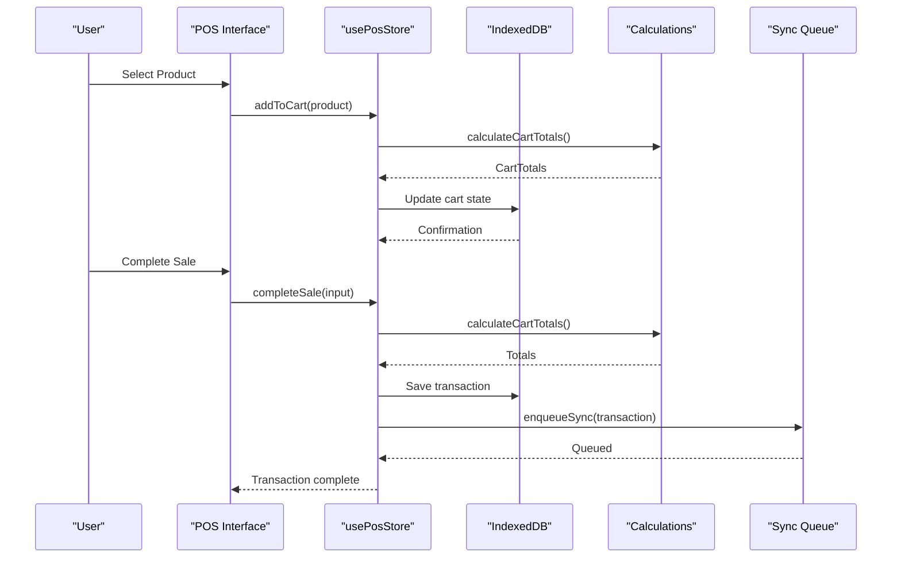
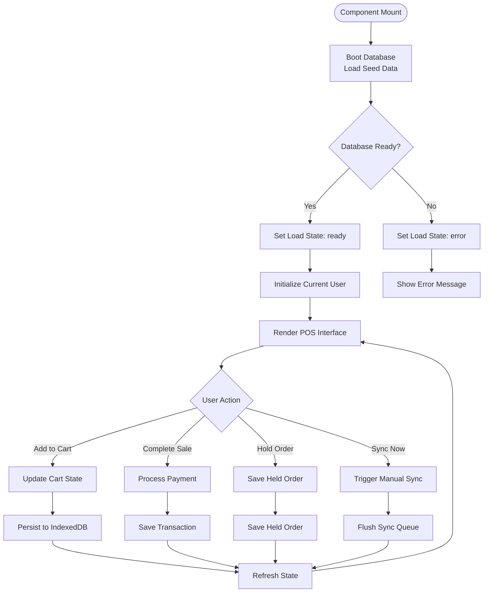
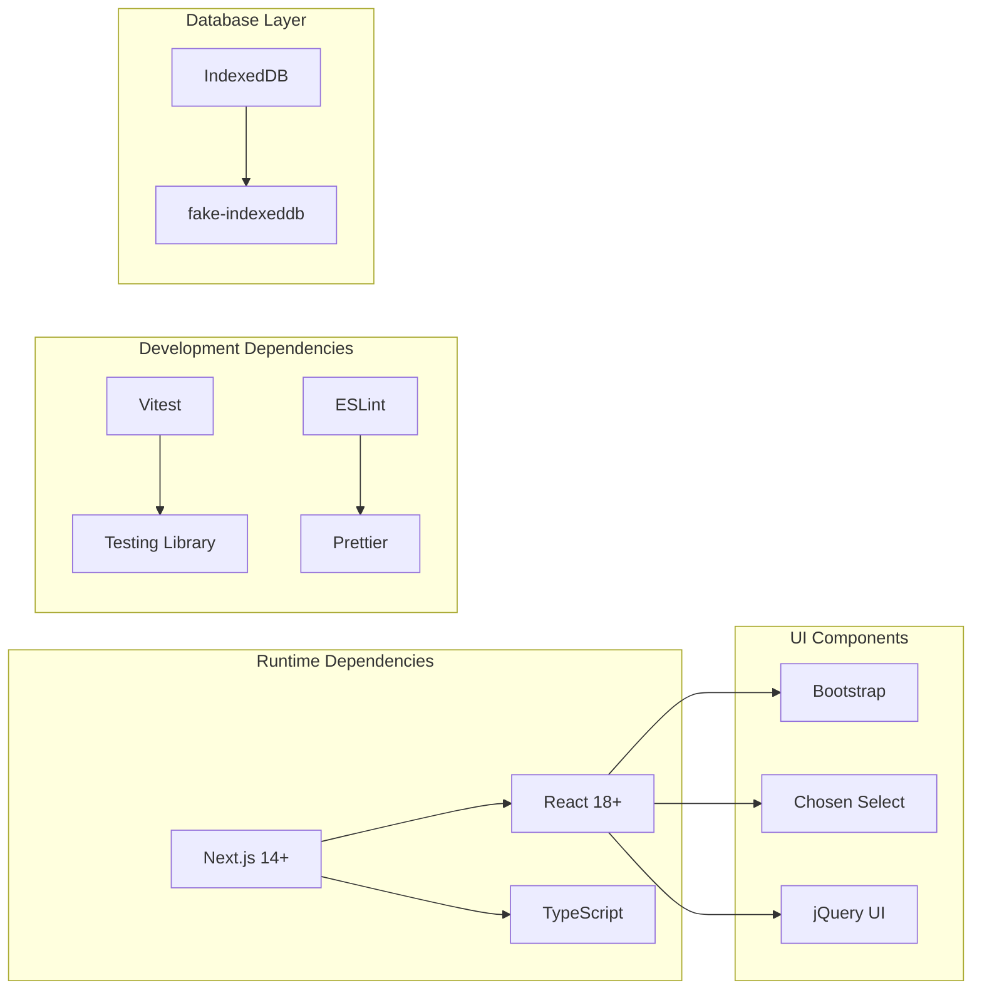

# Next.js Web POS Prototype

<cite>
**Referenced Files in This Document**
- [README.md](file://README.md)
- [package.json](file://web-prototype/package.json)
- [next.config.ts](file://web-prototype/next.config.ts)
- [tsconfig.json](file://web-prototype/tsconfig.json)
- [vitest.config.ts](file://web-prototype/vitest.config.ts)
- [page.tsx](file://web-prototype/src/app/page.tsx)
- [pos-prototype.tsx](file://web-prototype/src/components/pos-prototype.tsx)
- [use-pos-store.ts](file://web-prototype/src/lib/use-pos-store.ts)
- [calculations.ts](file://web-prototype/src/lib/calculations.ts)
- [db.ts](file://web-prototype/src/lib/db.ts)
- [types.ts](file://web-prototype/src/lib/types.ts)
- [observability.ts](file://web-prototype/src/lib/observability.ts)
- [feature-flags.ts](file://web-prototype/src/lib/feature-flags.ts)
- [seed.ts](file://web-prototype/src/lib/seed.ts)
- [pos-prototype.test.tsx](file://web-prototype/src/components/pos-prototype.test.tsx)
</cite>

## Table of Contents
1. [Introduction](#introduction)
2. [Project Structure](#project-structure)
3. [Core Components](#core-components)
4. [Architecture Overview](#architecture-overview)
5. [Detailed Component Analysis](#detailed-component-analysis)
6. [Dependency Analysis](#dependency-analysis)
7. [Performance Considerations](#performance-considerations)
8. [Troubleshooting Guide](#troubleshooting-guide)
9. [Conclusion](#conclusion)

## Introduction
The Next.js Web POS Prototype is a comprehensive point-of-sale system built with React and Next.js, designed specifically for pharmacy environments. This prototype demonstrates a complete offline-first POS solution with real-time synchronization capabilities, inventory management, customer tracking, and advanced reporting features. The system is architected around a modern React pattern using custom hooks for state management and IndexedDB for persistent local storage.

The prototype showcases key pharmaceutical POS requirements including product expiry tracking, low stock alerts, customer database management, and transaction history with filtering capabilities. Built with TypeScript for type safety and Vitest for testing, the system provides a robust foundation for enterprise-scale pharmacy management applications.

## Project Structure
The project follows a modular Next.js architecture with clear separation of concerns across components, libraries, and data management layers.

**Diagram sources**
- [page.tsx:1-6](file://web-prototype/src/app/page.tsx#L1-L6)
- [pos-prototype.tsx:58-427](file://web-prototype/src/components/pos-prototype.tsx#L58-L427)
- [use-pos-store.ts:51-433](file://web-prototype/src/lib/use-pos-store.ts#L51-L433)

**Section sources**
- [README.md:1-91](file://README.md#L1-L91)
- [package.json:1-34](file://web-prototype/package.json#L1-L34)

## Core Components

### POS Interface Component
The main POS interface serves as the primary user interaction layer, implementing a comprehensive sales workflow with product browsing, cart management, and payment processing.

Key features include:
- Multi-view navigation (POS, Products, Customers, Settings, Reports, Sync)
- Real-time product filtering and sorting
- Interactive cart with quantity adjustments
- Multi-payment method support (cash and external terminal)
- Order holding and resuming capabilities
- Receipt generation and printing

### State Management Hook
The custom `usePosStore` hook encapsulates all application state and business logic, providing a centralized data management solution with offline-first capabilities.

Core responsibilities:
- Local state management for products, customers, transactions
- Offline/online state detection and management
- Feature flag control for enabling/disabling functionality
- Sync queue management for offline data persistence
- Telemetry and observability event logging

### Data Persistence Layer
Built on IndexedDB for reliable offline data storage with automatic synchronization capabilities.

Supported entities:
- Products with expiry tracking and stock management
- Categories for product organization
- Customers with contact information
- Users with role-based permissions
- Transactions with payment details
- Settings for store configuration
- Sync queue for offline operations

**Section sources**
- [pos-prototype.tsx:58-427](file://web-prototype/src/components/pos-prototype.tsx#L58-L427)
- [use-pos-store.ts:51-433](file://web-prototype/src/lib/use-pos-store.ts#L51-L433)
- [db.ts:22-46](file://web-prototype/src/lib/db.ts#L22-L46)

## Architecture Overview

**Diagram sources**
- [use-pos-store.ts:84-141](file://web-prototype/src/lib/use-pos-store.ts#L84-L141)
- [db.ts:99-115](file://web-prototype/src/lib/db.ts#L99-L115)
- [observability.ts:49-94](file://web-prototype/src/lib/observability.ts#L49-L94)

The architecture implements a clean separation between presentation, state management, and data persistence layers, enabling easy testing and maintenance while supporting offline-first operation.

## Detailed Component Analysis

### POS Interface Implementation

**Diagram sources**
- [pos-prototype.tsx:58-427](file://web-prototype/src/components/pos-prototype.tsx#L58-L427)
- [use-pos-store.ts:51-433](file://web-prototype/src/lib/use-pos-store.ts#L51-L433)
- [calculations.ts:3-78](file://web-prototype/src/lib/calculations.ts#L3-L78)

### Data Flow Architecture

**Diagram sources**
- [pos-prototype.tsx:142-152](file://web-prototype/src/components/pos-prototype.tsx#L142-L152)
- [use-pos-store.ts:206-260](file://web-prototype/src/lib/use-pos-store.ts#L206-L260)
- [calculations.ts:7-24](file://web-prototype/src/lib/calculations.ts#L7-L24)

### State Management Flow

**Diagram sources**
- [use-pos-store.ts:109-141](file://web-prototype/src/lib/use-pos-store.ts#L109-L141)
- [db.ts:217-230](file://web-prototype/src/lib/db.ts#L217-L230)

**Section sources**
- [pos-prototype.tsx:58-427](file://web-prototype/src/components/pos-prototype.tsx#L58-L427)
- [use-pos-store.ts:51-433](file://web-prototype/src/lib/use-pos-store.ts#L51-L433)

## Dependency Analysis

### Technology Stack Dependencies

**Diagram sources**
- [package.json:18-32](file://web-prototype/package.json#L18-L32)
- [tsconfig.json:2-29](file://web-prototype/tsconfig.json#L2-L29)

### Module Dependencies

The system maintains clean module boundaries with clear import relationships:

- **Components** depend only on their internal logic and shared types
- **Libraries** provide reusable business logic without UI concerns  
- **Data Layer** abstracts database operations behind simple APIs
- **Tests** validate behavior through isolated unit and integration tests

**Section sources**
- [package.json:1-34](file://web-prototype/package.json#L1-L34)
- [tsconfig.json:25-29](file://web-prototype/tsconfig.json#L25-L29)

## Performance Considerations

### Offline-First Design
The prototype implements a sophisticated offline-first architecture that ensures continuous operation regardless of network connectivity:

- **Automatic State Persistence**: All user interactions are immediately persisted to IndexedDB
- **Background Sync Queue**: Operations are queued and automatically synced when connectivity returns
- **Conflict Resolution**: Last-write-wins strategy with optimistic updates
- **Data Consistency**: Atomic transactions ensure data integrity during concurrent operations

### Memory Management
The application employs several strategies to maintain optimal performance:

- **Lazy Loading**: Components are loaded on-demand based on user navigation
- **Memoization**: Complex calculations and derived state are memoized to prevent unnecessary recomputation
- **Pagination**: Large datasets are paginated to limit DOM rendering overhead
- **Efficient Sorting**: Custom sorting algorithms optimized for product data

### Network Optimization
- **Connection Monitoring**: Real-time detection of network state changes
- **Conditional Sync**: Synchronization only occurs when feature flags permit
- **Batch Operations**: Multiple changes are batched to reduce network overhead
- **Progressive Enhancement**: Core functionality remains available even with limited connectivity

## Troubleshooting Guide

### Common Issues and Solutions

**Database Initialization Failures**
- Verify IndexedDB is supported in the browser
- Check for storage quota limitations
- Ensure proper CORS configuration for development
- Review browser console for specific error messages

**Synchronization Problems**
- Confirm feature flags are properly configured
- Check network connectivity status
- Review sync queue for pending operations
- Monitor console logs for sync error details

**Performance Issues**
- Clear browser cache and IndexedDB storage
- Disable unnecessary browser extensions
- Check for memory leaks in long sessions
- Monitor network latency and response times

### Debugging Tools

The application includes comprehensive observability features:

- **Telemetry Events**: Structured logging for all significant operations
- **Trace Spans**: Performance monitoring with timing data
- **Alert System**: Automated notifications for system health issues
- **Snapshot Generation**: Real-time system health metrics

**Section sources**
- [observability.ts:49-94](file://web-prototype/src/lib/observability.ts#L49-L94)
- [use-pos-store.ts:143-158](file://web-prototype/src/lib/use-pos-store.ts#L143-L158)

## Conclusion

The Next.js Web POS Prototype represents a comprehensive solution for modern pharmacy management, combining cutting-edge web technologies with practical business requirements. The architecture successfully balances offline-first capabilities with real-time synchronization, providing a robust foundation for enterprise-scale deployment.

Key strengths of the implementation include:

- **Modular Architecture**: Clean separation of concerns enables easy maintenance and extension
- **Type Safety**: Comprehensive TypeScript coverage ensures reliability and developer productivity  
- **Offline-First Design**: Reliable operation in challenging network environments
- **Extensive Testing**: Comprehensive test suite covering unit, integration, and contract testing
- **Observability**: Built-in monitoring and alerting for operational excellence

The prototype demonstrates proven patterns for POS system development while maintaining flexibility for future enhancements. Its foundation supports scalable deployment across multiple pharmacy locations with centralized management capabilities.