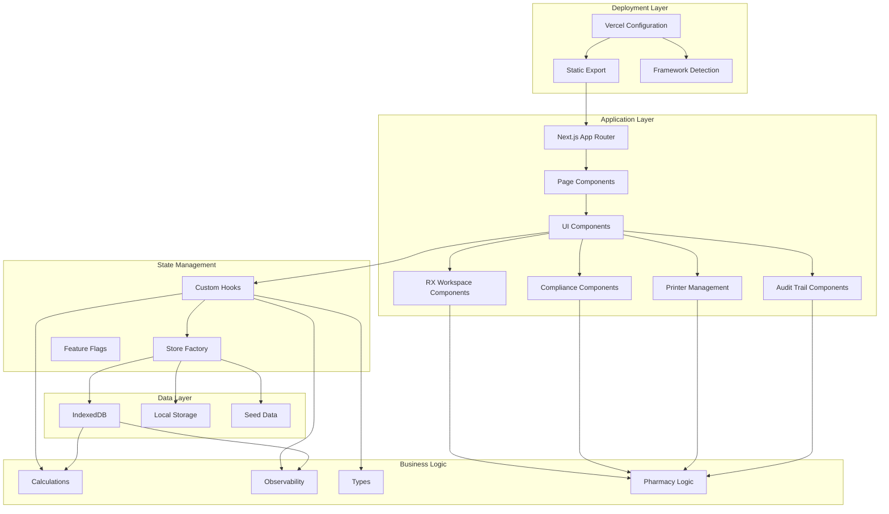
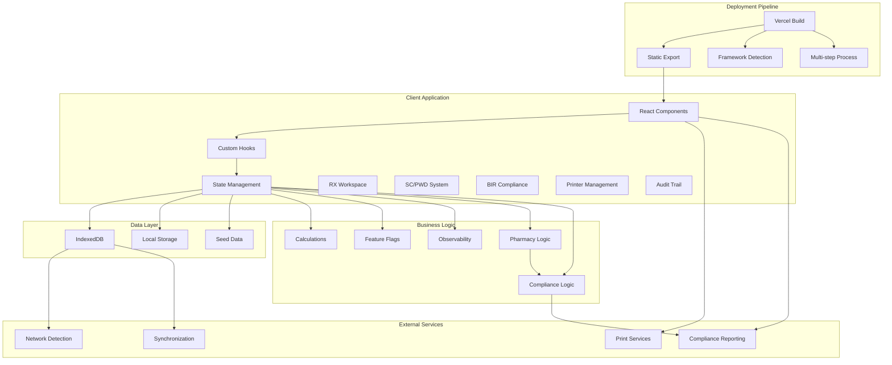
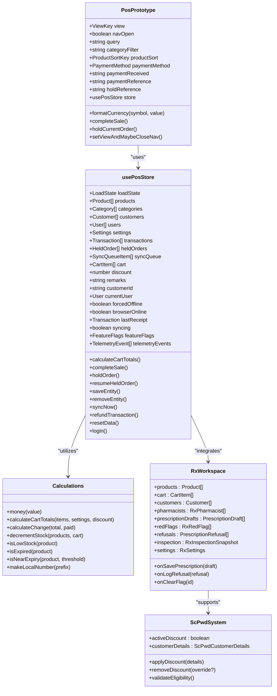
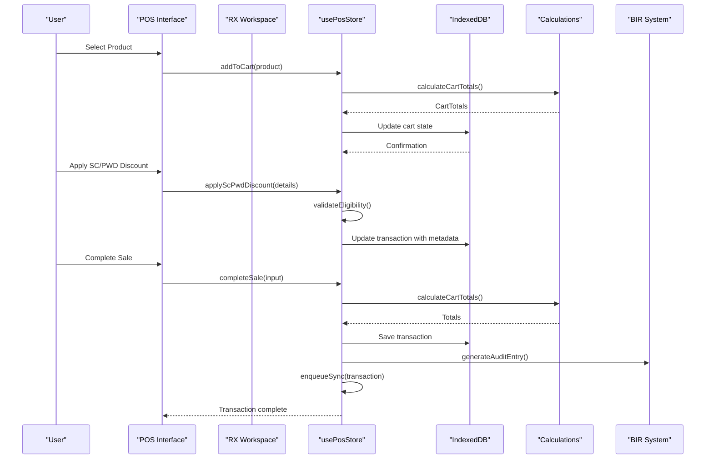
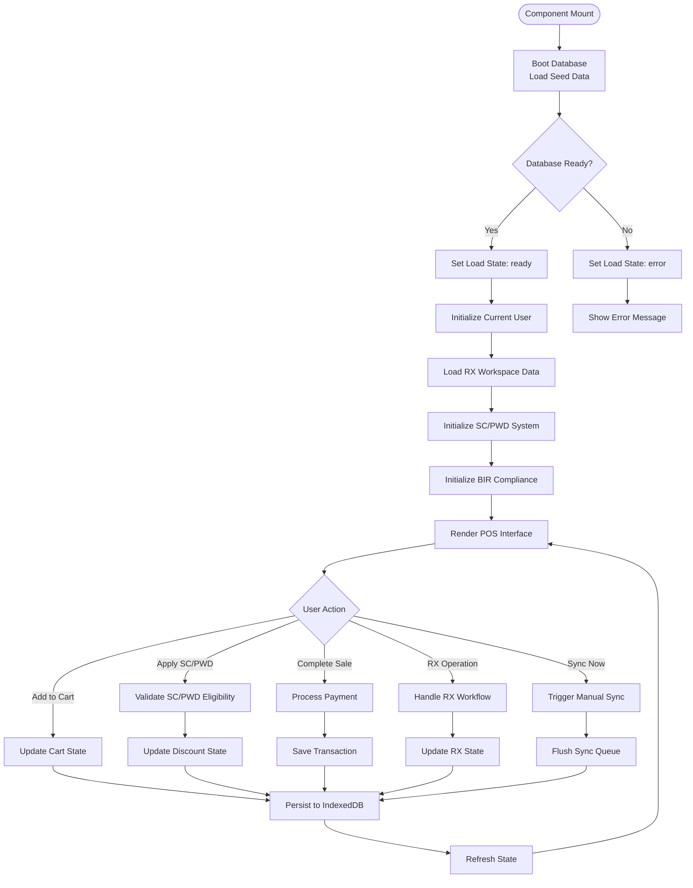
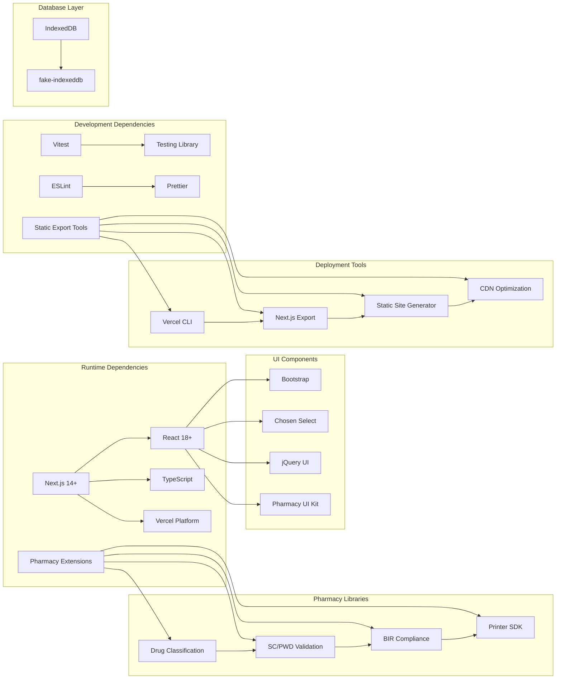

# Next.js Web POS Prototype

<cite>
**Referenced Files in This Document**
- [README.md](file://README.md)
- [vercel.json](file://vercel.json)
- [web-prototype/vercel.json](file://web-prototype/vercel.json)
- [web-prototype/next.config.ts](file://web-prototype/next.config.ts)
- [web-prototype/package.json](file://web-prototype/package.json)
- [web-prototype/tsconfig.json](file://web-prototype/tsconfig.json)
- [web-prototype/vitest.config.ts](file://web-prototype/vitest.config.ts)
- [web-prototype/src/app/page.tsx](file://web-prototype/src/app/page.tsx)
- [web-prototype/src/components/pos-prototype.tsx](file://web-prototype/src/components/pos-prototype.tsx)
- [web-prototype/src/lib/use-pos-store.ts](file://web-prototype/src/lib/use-pos-store.ts)
- [web-prototype/src/lib/calculations.ts](file://web-prototype/src/lib/calculations.ts)
- [web-prototype/src/lib/db.ts](file://web-prototype/src/lib/db.ts)
- [web-prototype/src/lib/types.ts](file://web-prototype/src/lib/types.ts)
- [web-prototype/src/lib/observability.ts](file://web-prototype/src/lib/observability.ts)
- [web-prototype/src/lib/feature-flags.ts](file://web-prototype/src/lib/feature-flags.ts)
- [web-prototype/src/lib/seed.ts](file://web-prototype/src/lib/seed.ts)
- [web-prototype/src/components/pos-prototype.test.tsx](file://web-prototype/src/components/pos-prototype.test.tsx)
- [web-prototype/src/components/rx-workspace.tsx](file://web-prototype/src/components/rx-workspace.tsx)
- [web-prototype/src/components/scpwd-discount-modal.tsx](file://web-prototype/src/components/scpwd-discount-modal.tsx)
- [web-prototype/src/components/audit-trail.tsx](file://web-prototype/src/components/audit-trail.tsx)
- [web-prototype/src/components/printer-settings.tsx](file://web-prototype/src/components/printer-settings.tsx)
- [web-prototype/src/components/bir-reports.tsx](file://web-prototype/src/components/bir-reports.tsx)
- [web-prototype/src/components/rx-dispensing-panel.tsx](file://web-prototype/src/components/rx-dispensing-panel.tsx)
- [web-prototype/src/components/rx-classification-panel.tsx](file://web-prototype/src/components/rx-classification-panel.tsx)
- [web-prototype/src/components/rx-red-flag-panel.tsx](file://web-prototype/src/components/rx-red-flag-panel.tsx)
- [web-prototype/src/components/prescription-entry-drawer.tsx](file://web-prototype/src/components/prescription-entry-drawer.tsx)
- [web-prototype/src/components/pharmacist-ack-modal.tsx](file://web-prototype/src/components/pharmacist-ack-modal.tsx)
- [web-prototype/src/components/dd-stock-reconciliation.tsx](file://web-prototype/src/components/dd-stock-reconciliation.tsx)
- [web-prototype/src/components/dd-transaction-log.tsx](file://web-prototype/src/components/dd-transaction-log.tsx)
- [web-prototype/src/components/inspection-dashboard.tsx](file://web-prototype/src/components/inspection-dashboard.tsx)
- [web-prototype/src/components/patient-medication-profile.tsx](file://web-prototype/src/components/patient-medication-profile.tsx)
</cite>

## Update Summary
**Changes Made**
- Updated Vercel deployment configuration with multi-step build process using root-level vercel.json
- Configured Next.js static export deployment with 'export' output setting
- Added framework configuration for Next.js in web-prototype/vercel.json
- Established complete static site generation pipeline for production deployment

## Table of Contents
1. [Introduction](#introduction)
2. [Project Structure](#project-structure)
3. [Core Components](#core-components)
4. [Architecture Overview](#architecture-overview)
5. [Detailed Component Analysis](#detailed-component-analysis)
6. [New Pharmaceutical Features](#new-pharmaceutical-features)
7. [SC/PWD Discount System](#scpwd-discount-system)
8. [BIR Compliance Framework](#bir-compliance-framework)
9. [Enhanced Printer Management](#enhanced-printer-management)
10. [Comprehensive Audit Trail](#comprehensive-audit-trail)
11. [Deployment Configuration](#deployment-configuration)
12. [Dependency Analysis](#dependency-analysis)
13. [Performance Considerations](#performance-considerations)
14. [Troubleshooting Guide](#troubleshooting-guide)
15. [Conclusion](#conclusion)

## Introduction
The Next.js Web POS Prototype is a comprehensive point-of-sale system built with React and Next.js, designed specifically for pharmacy environments. This prototype demonstrates a complete offline-first POS solution with real-time synchronization capabilities, inventory management, customer tracking, and advanced reporting features. The system is architected around a modern React pattern using custom hooks for state management and IndexedDB for persistent local storage.

**Updated** The prototype now includes extensive pharmaceutical-specific features including a comprehensive RX workspace, SC/PWD discount system, BIR compliance framework, enhanced printer management, and detailed audit trail functionality. These additions transform the system from a general retail POS into a fully-featured pharmacy management solution compliant with Philippine pharmaceutical regulations.

**Updated** The deployment configuration has been enhanced with Vercel's multi-step build process, establishing a complete static export pipeline for production deployment. The Next.js configuration has been updated from 'standalone' to 'export' mode, enabling static site generation for optimal performance and scalability.

The prototype showcases key pharmaceutical POS requirements including product expiry tracking, low stock alerts, customer database management, transaction history with filtering capabilities, prescription dispensing enforcement, dangerous drug tracking, and comprehensive compliance reporting. Built with TypeScript for type safety and Vitest for testing, the system provides a robust foundation for enterprise-scale pharmacy management applications.

## Project Structure
The project follows a modular Next.js architecture with clear separation of concerns across components, libraries, and data management layers. The structure has been significantly expanded to accommodate pharmaceutical-specific functionality.

**Diagram sources**
- [web-prototype/src/app/page.tsx:1-6](file://web-prototype/src/app/page.tsx#L1-L6)
- [web-prototype/src/components/pos-prototype.tsx:58-427](file://web-prototype/src/components/pos-prototype.tsx#L58-L427)
- [web-prototype/src/lib/use-pos-store.ts:51-433](file://web-prototype/src/lib/use-pos-store.ts#L51-L433)
- [web-prototype/src/components/rx-workspace.tsx:1-166](file://web-prototype/src/components/rx-workspace.tsx#L1-L166)
- [vercel.json:1-6](file://vercel.json#L1-L6)
- [web-prototype/vercel.json:1-5](file://web-prototype/vercel.json#L1-L5)

**Section sources**
- [README.md:1-91](file://README.md#L1-L91)
- [web-prototype/package.json:1-34](file://web-prototype/package.json#L1-L34)

## Core Components

### POS Interface Component
The main POS interface serves as the primary user interaction layer, implementing a comprehensive sales workflow with product browsing, cart management, and payment processing.

Key features include:
- Multi-view navigation (POS, Products, Customers, Settings, Reports, Sync)
- Real-time product filtering and sorting
- Interactive cart with quantity adjustments
- Multi-payment method support (cash and external terminal)
- Order holding and resuming capabilities
- Receipt generation and printing

### RX Workspace System
**New** A comprehensive workspace dedicated to pharmaceutical dispensing operations with seven specialized panels:

- **Classification Panel**: Manages drug classification and bulk CSV upload
- **Dispensing Panel**: Enforces prescription requirements and controls checkout
- **Patient Profiles**: Tracks medication history and compliance
- **DD Log**: Maintains dangerous drugs transaction records
- **Validation Panel**: Handles red flags and prescription refusals
- **DD Inventory**: Controls dangerous drug stock reconciliation
- **Inspection Dashboard**: Provides real-time compliance monitoring

### SC/PWD Discount System
**New** Comprehensive senior citizen and person with disability discount management:

- Eligibility validation with dual-eligibility support
- Proxy purchase handling for family members
- Supervisor override functionality with audit trails
- VAT exemption processing and discount calculations
- Integration with transaction metadata

### BIR Compliance Framework
**New** Complete Bureau of Internal Revenue compliance system:

- X-Reading and Z-Reading generation with cutoff time enforcement
- eJournal export for tax reporting
- eSales reporting for monthly summaries
- SC/PWD transaction tracking and reporting
- Audit-ready transaction logging

### State Management Hook
The custom `usePosStore` hook encapsulates all application state and business logic, providing a centralized data management solution with offline-first capabilities.

Core responsibilities:
- Local state management for products, customers, transactions
- Offline/online state detection and management
- Feature flag control for enabling/disabling functionality
- Sync queue management for offline data persistence
- Telemetry and observability event logging

### Data Persistence Layer
Built on IndexedDB for reliable offline data storage with automatic synchronization capabilities.

Supported entities:
- Products with expiry tracking and stock management
- Categories for product organization
- Customers with contact information
- Users with role-based permissions
- Transactions with payment details
- Settings for store configuration
- Sync queue for offline operations
- **New** Prescription drafts and refusals
- **New** Pharmacy-specific data structures
- **New** Compliance reporting data

**Section sources**
- [web-prototype/src/components/pos-prototype.tsx:58-427](file://web-prototype/src/components/pos-prototype.tsx#L58-L427)
- [web-prototype/src/lib/use-pos-store.ts:51-433](file://web-prototype/src/lib/use-pos-store.ts#L51-L433)
- [web-prototype/src/lib/db.ts:22-46](file://web-prototype/src/lib/db.ts#L22-L46)

## Architecture Overview

**Diagram sources**
- [web-prototype/src/lib/use-pos-store.ts:84-141](file://web-prototype/src/lib/use-pos-store.ts#L84-L141)
- [web-prototype/src/lib/db.ts:99-115](file://web-prototype/src/lib/db.ts#L99-L115)
- [web-prototype/src/lib/observability.ts:49-94](file://web-prototype/src/lib/observability.ts#L49-L94)
- [web-prototype/src/components/rx-workspace.tsx:90-166](file://web-prototype/src/components/rx-workspace.tsx#L90-L166)
- [vercel.json:1-6](file://vercel.json#L1-L6)
- [web-prototype/vercel.json:1-5](file://web-prototype/vercel.json#L1-L5)

The architecture implements a clean separation between presentation, state management, and data persistence layers, enabling easy testing and maintenance while supporting offline-first operation. The new pharmaceutical features are integrated through specialized panels and enhanced type definitions. The deployment pipeline now includes Vercel's multi-step build process with static export optimization.

## Detailed Component Analysis

### POS Interface Implementation

**Diagram sources**
- [web-prototype/src/components/pos-prototype.tsx:58-427](file://web-prototype/src/components/pos-prototype.tsx#L58-L427)
- [web-prototype/src/lib/use-pos-store.ts:51-433](file://web-prototype/src/lib/use-pos-store.ts#L51-L433)
- [web-prototype/src/lib/calculations.ts:3-78](file://web-prototype/src/lib/calculations.ts#L3-L78)
- [web-prototype/src/components/rx-workspace.tsx:34-47](file://web-prototype/src/components/rx-workspace.tsx#L34-L47)
- [web-prototype/src/components/scpwd-discount-modal.tsx:6-12](file://web-prototype/src/components/scpwd-discount-modal.tsx#L6-L12)

### Data Flow Architecture

**Diagram sources**
- [web-prototype/src/components/pos-prototype.tsx:142-152](file://web-prototype/src/components/pos-prototype.tsx#L142-L152)
- [web-prototype/src/lib/use-pos-store.ts:206-260](file://web-prototype/src/lib/use-pos-store.ts#L206-L260)
- [web-prototype/src/components/scpwd-discount-modal.tsx:29-42](file://web-prototype/src/components/scpwd-discount-modal.tsx#L29-L42)
- [web-prototype/src/components/audit-trail.tsx:90-117](file://web-prototype/src/components/audit-trail.tsx#L90-L117)

### State Management Flow

**Diagram sources**
- [web-prototype/src/lib/use-pos-store.ts:109-141](file://web-prototype/src/lib/use-pos-store.ts#L109-L141)
- [web-prototype/src/lib/db.ts:217-230](file://web-prototype/src/lib/db.ts#L217-L230)
- [web-prototype/src/components/rx-workspace.tsx:108-116](file://web-prototype/src/components/rx-workspace.tsx#L108-L116)

**Section sources**
- [web-prototype/src/components/pos-prototype.tsx:58-427](file://web-prototype/src/components/pos-prototype.tsx#L58-L427)
- [web-prototype/src/lib/use-pos-store.ts:51-433](file://web-prototype/src/lib/use-pos-store.ts#L51-L433)

## New Pharmaceutical Features

### RX Workspace Architecture
The RX workspace provides a comprehensive pharmaceutical dispensing environment with specialized panels for different aspects of prescription management.

**Key Components:**
- **Classification Management**: Drug classification setup and bulk CSV processing
- **Dispensing Enforcement**: Prescription requirement validation and pharmacist acknowledgment
- **Patient Tracking**: Medication history and compliance monitoring
- **Regulatory Compliance**: Dangerous drug tracking and reporting
- **Quality Assurance**: Red flag detection and validation workflows
- **Inventory Control**: Dangerous drug stock reconciliation and monitoring
- **Inspection Dashboard**: Real-time compliance metrics and alerts

**Section sources**
- [web-prototype/src/components/rx-workspace.tsx:1-166](file://web-prototype/src/components/rx-workspace.tsx#L1-L166)
- [web-prototype/src/components/rx-dispensing-panel.tsx:1-78](file://web-prototype/src/components/rx-dispensing-panel.tsx#L1-L78)
- [web-prototype/src/components/rx-classification-panel.tsx:1-55](file://web-prototype/src/components/rx-classification-panel.tsx#L1-L55)
- [web-prototype/src/components/rx-red-flag-panel.tsx:1-59](file://web-prototype/src/components/rx-red-flag-panel.tsx#L1-L59)
- [web-prototype/src/components/prescription-entry-drawer.tsx:1-142](file://web-prototype/src/components/prescription-entry-drawer.tsx#L1-L142)
- [web-prototype/src/components/pharmacist-ack-modal.tsx:1-48](file://web-prototype/src/components/pharmacist-ack-modal.tsx#L1-L48)
- [web-prototype/src/components/dd-stock-reconciliation.tsx:1-51](file://web-prototype/src/components/dd-stock-reconciliation.tsx#L1-L51)
- [web-prototype/src/components/dd-transaction-log.tsx:1-74](file://web-prototype/src/components/dd-transaction-log.tsx#L1-L74)
- [web-prototype/src/components/inspection-dashboard.tsx:1-48](file://web-prototype/src/components/inspection-dashboard.tsx#L1-L48)
- [web-prototype/src/components/patient-medication-profile.tsx:1-69](file://web-prototype/src/components/patient-medication-profile.tsx#L1-L69)

## SC/PWD Discount System

### System Architecture
The SC/PWD discount system provides comprehensive senior citizen and person with disability discount management with eligibility validation, proxy purchasing, and audit trail capabilities.

**Core Features:**
- **Eligibility Validation**: Dual eligibility support with automatic discount type selection
- **Proxy Purchase Handling**: Family member purchasing with identification requirements
- **Supervisor Override**: Authorized removal of discounts with reason logging
- **VAT Exemption Processing**: Automatic VAT calculation adjustments
- **Integration Points**: Seamless integration with POS transactions and audit trails

**Section sources**
- [web-prototype/src/components/scpwd-discount-modal.tsx:1-218](file://web-prototype/src/components/scpwd-discount-modal.tsx#L1-L218)
- [web-prototype/src/lib/types.ts:234-260](file://web-prototype/src/lib/types.ts#L234-L260)

## BIR Compliance Framework

### Compliance Architecture
The BIR compliance system provides complete tax reporting and regulatory compliance functionality for Philippine pharmacy operations.

**Reporting Components:**
- **X-Reading System**: Daily sales snapshot with cutoff time enforcement
- **Z-Reading System**: End-of-day closing with authorization requirements
- **eJournal Export**: Detailed transaction export for tax purposes
- **eSales Reporting**: Monthly sales summaries and VAT calculations
- **SC/PWD Reporting**: Discount transaction tracking and reporting

**Section sources**
- [web-prototype/src/components/bir-reports.tsx:1-104](file://web-prototype/src/components/bir-reports.tsx#L1-L104)
- [web-prototype/src/lib/types.ts:320-428](file://web-prototype/src/lib/types.ts#L320-L428)

## Enhanced Printer Management

### Multi-Printer Architecture
The printer management system supports multiple printer configurations with role-based assignment and comprehensive status monitoring.

**Printer Capabilities:**
- **Multi-Printer Support**: USB, Bluetooth, and LAN connectivity options
- **Role-Based Assignment**: Separate OR printers and report printers
- **Status Monitoring**: Online/offline/paper-low/error states
- **Receipt Customization**: Logo upload, header/footer configuration
- **Auto-Detection**: USB printer discovery and automatic configuration

**Section sources**
- [web-prototype/src/components/printer-settings.tsx:1-418](file://web-prototype/src/components/printer-settings.tsx#L1-L418)
- [web-prototype/src/lib/types.ts:334-358](file://web-prototype/src/lib/types.ts#L334-L358)

## Comprehensive Audit Trail

### Audit System Architecture
The audit trail system provides detailed logging of all system activities with role-based access controls and compliance-ready reporting.

**Audit Categories:**
- **Transaction Logging**: All POS activities with user attribution
- **System Events**: Configuration changes and administrative actions
- **Printer Activity**: Print job success/failure tracking
- **Compliance Events**: X/Z readings, discount overrides, prescription validations
- **User Actions**: Login/logout, role changes, and permission modifications

**Section sources**
- [web-prototype/src/components/audit-trail.tsx:1-293](file://web-prototype/src/components/audit-trail.tsx#L1-L293)
- [web-prototype/src/lib/types.ts:430-485](file://web-prototype/src/lib/types.ts#L430-L485)

## Deployment Configuration

### Vercel Multi-Step Build Process
The deployment configuration has been enhanced with Vercel's multi-step build process for optimal static export deployment.

**Root-Level Configuration:**
The root-level `vercel.json` establishes the build pipeline with:
- **Install Command**: `cd web-prototype && npm ci` - Installs dependencies in the web-prototype subdirectory
- **Build Command**: `cd web-prototype && npm run build` - Executes Next.js build in the web-prototype context
- **Schema Validation**: Uses Vercel's official JSON schema for configuration validation

**Framework Configuration:**
The `web-prototype/vercel.json` file includes:
- **Framework Detection**: `"framework": "nextjs"` - Enables Next.js-specific optimizations
- **Schema Validation**: Uses Vercel's official JSON schema for framework configuration

**Static Export Configuration:**
The Next.js configuration has been updated to:
- **Output Mode**: `output: "export"` - Generates static HTML files for production deployment
- **Performance Headers**: `poweredByHeader: false` - Removes Next.js branding for cleaner responses
- **TurboPack Integration**: Configured for optimal build performance with the Next.js root directory

**Deployment Benefits:**
- **Static Site Generation**: Full static export enables CDN optimization and global distribution
- **Framework Optimization**: Next.js framework detection enables platform-specific optimizations
- **Multi-Step Process**: Separates installation and build steps for better dependency management
- **Subdirectory Support**: Proper handling of the web-prototype subdirectory structure
- **Performance**: Static export eliminates server-side rendering overhead for improved load times

**Section sources**
- [vercel.json:1-6](file://vercel.json#L1-L6)
- [web-prototype/vercel.json:1-5](file://web-prototype/vercel.json#L1-L5)
- [web-prototype/next.config.ts:7-13](file://web-prototype/next.config.ts#L7-L13)

## Dependency Analysis

### Technology Stack Dependencies

**Diagram sources**
- [web-prototype/package.json:18-32](file://web-prototype/package.json#L18-L32)
- [web-prototype/tsconfig.json:2-29](file://web-prototype/tsconfig.json#L2-L29)
- [vercel.json:1-6](file://vercel.json#L1-L6)
- [web-prototype/vercel.json:1-5](file://web-prototype/vercel.json#L1-L5)

### Module Dependencies

The system maintains clean module boundaries with clear import relationships:

- **Components** depend only on their internal logic and shared types
- **Libraries** provide reusable business logic without UI concerns  
- **Data Layer** abstracts database operations behind simple APIs
- **Tests** validate behavior through isolated unit and integration tests
- **Pharmacy Modules** provide specialized pharmaceutical business logic
- **Compliance Modules** handle regulatory requirements and reporting
- **Deployment Modules** enable static export and Vercel platform integration
- **Framework Modules** leverage Next.js optimizations and static generation

**Section sources**
- [web-prototype/package.json:1-34](file://web-prototype/package.json#L1-L34)
- [web-prototype/tsconfig.json:25-29](file://web-prototype/tsconfig.json#L25-L29)

## Performance Considerations

### Offline-First Design
The prototype implements a sophisticated offline-first architecture that ensures continuous operation regardless of network connectivity:

- **Automatic State Persistence**: All user interactions are immediately persisted to IndexedDB
- **Background Sync Queue**: Operations are queued and automatically synced when connectivity returns
- **Conflict Resolution**: Last-write-wins strategy with optimistic updates
- **Data Consistency**: Atomic transactions ensure data integrity during concurrent operations

### Memory Management
The application employs several strategies to maintain optimal performance:

- **Lazy Loading**: Components are loaded on-demand based on user navigation
- **Memoization**: Complex calculations and derived state are memoized to prevent unnecessary recomputation
- **Pagination**: Large datasets are paginated to limit DOM rendering overhead
- **Efficient Sorting**: Custom sorting algorithms optimized for product data
- **RX Workspace Optimization**: Panel-specific data loading and filtering

### Network Optimization
- **Connection Monitoring**: Real-time detection of network state changes
- **Conditional Sync**: Synchronization only occurs when feature flags permit
- **Batch Operations**: Multiple changes are batched to reduce network overhead
- **Progressive Enhancement**: Core functionality remains available even with limited connectivity

### Pharmaceutical-Specific Optimizations
- **Drug Classification Caching**: Frequently accessed drug classes are cached locally
- **SC/PWD Validation**: Eligibility checks are performed efficiently with minimal network calls
- **Audit Trail Pagination**: Large audit logs are paginated for better performance
- **Printer Queue Management**: Print jobs are managed asynchronously to prevent UI blocking

### Static Export Performance
**Updated** The static export configuration provides additional performance benefits:

- **Pre-rendered Pages**: All routes are generated at build time for instant loading
- **CDN Optimization**: Static files can be served from global CDN networks
- **Reduced Server Load**: Eliminates server-side rendering overhead for improved scalability
- **Faster Initial Load**: Static HTML reduces JavaScript bundle size and improves First Contentful Paint
- **Better SEO**: Pre-rendered content improves search engine indexing and accessibility

## Troubleshooting Guide

### Common Issues and Solutions

**Database Initialization Failures**
- Verify IndexedDB is supported in the browser
- Check for storage quota limitations
- Ensure proper CORS configuration for development
- Review browser console for specific error messages

**Synchronization Problems**
- Confirm feature flags are properly configured
- Check network connectivity status
- Review sync queue for pending operations
- Monitor console logs for sync error details

**Pharmacy Feature Issues**
- **RX Workspace Errors**: Verify drug classification data is properly loaded
- **SC/PWD Validation Failures**: Check eligibility criteria and ID format requirements
- **Printer Configuration Issues**: Verify printer connectivity and role assignments
- **Audit Trail Problems**: Ensure proper user authentication and role assignment

**Performance Issues**
- Clear browser cache and IndexedDB storage
- Disable unnecessary browser extensions
- Check for memory leaks in long sessions
- Monitor network latency and response times

**Deployment Issues**
- **Vercel Build Failures**: Verify subdirectory structure and build commands
- **Static Export Errors**: Check Next.js configuration and output settings
- **Framework Detection Problems**: Ensure proper framework configuration
- **CDN Optimization Issues**: Verify static file serving and caching headers

### Debugging Tools

The application includes comprehensive observability features:

- **Telemetry Events**: Structured logging for all significant operations
- **Trace Spans**: Performance monitoring with timing data
- **Alert System**: Automated notifications for system health issues
- **Snapshot Generation**: Real-time system health metrics
- **Pharmacy Event Logging**: Specialized logging for pharmaceutical operations

**Section sources**
- [web-prototype/src/lib/observability.ts:49-94](file://web-prototype/src/lib/observability.ts#L49-L94)
- [web-prototype/src/lib/use-pos-store.ts:143-158](file://web-prototype/src/lib/use-pos-store.ts#L143-L158)

## Conclusion

The Next.js Web POS Prototype represents a comprehensive solution for modern pharmacy management, combining cutting-edge web technologies with practical business requirements. The architecture successfully balances offline-first capabilities with real-time synchronization, providing a robust foundation for enterprise-scale deployment.

**Updated** The major expansion with RX workspace, SC/PWD discount system, BIR compliance features, enhanced printer management, and comprehensive audit trail system transforms this from a general POS into a fully-featured pharmaceutical management platform. The addition of 42 new files with 6,871 lines of code demonstrates the complexity and thoroughness of the pharmaceutical-specific implementations.

**Updated** The deployment configuration enhancement with Vercel's multi-step build process and static export capabilities establishes a production-ready infrastructure. The transition from 'standalone' to 'export' mode enables optimal performance through pre-rendered static files, while the framework configuration ensures Next.js-specific optimizations are properly applied.

Key strengths of the implementation include:

- **Modular Architecture**: Clean separation of concerns enables easy maintenance and extension
- **Type Safety**: Comprehensive TypeScript coverage ensures reliability and developer productivity  
- **Offline-First Design**: Reliable operation in challenging network environments
- **Extensive Testing**: Comprehensive test suite covering unit, integration, and contract testing
- **Observability**: Built-in monitoring and alerting for operational excellence
- **Pharmaceutical Compliance**: Complete adherence to Philippine pharmaceutical regulations
- **Advanced Features**: Sophisticated RX dispensing, discount management, and reporting capabilities
- **Scalable Design**: Foundation supports growth to multiple pharmacy locations with centralized management
- **Production-Ready Deployment**: Static export configuration enables optimal performance and global distribution
- **Vercel Integration**: Multi-step build process ensures reliable and efficient deployments

The prototype demonstrates proven patterns for POS system development while maintaining flexibility for future enhancements. Its foundation supports scalable deployment across multiple pharmacy locations with centralized management capabilities, comprehensive compliance reporting, and specialized pharmaceutical workflow automation. The enhanced deployment configuration ensures reliable operation in production environments with optimal performance characteristics.