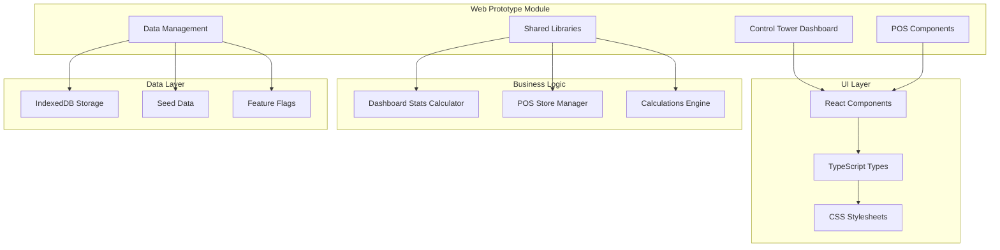
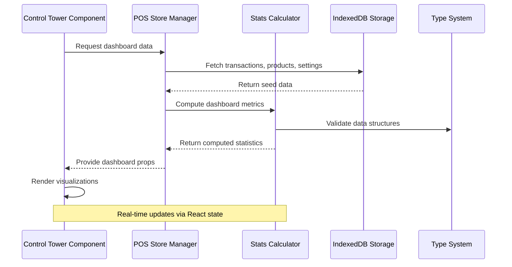
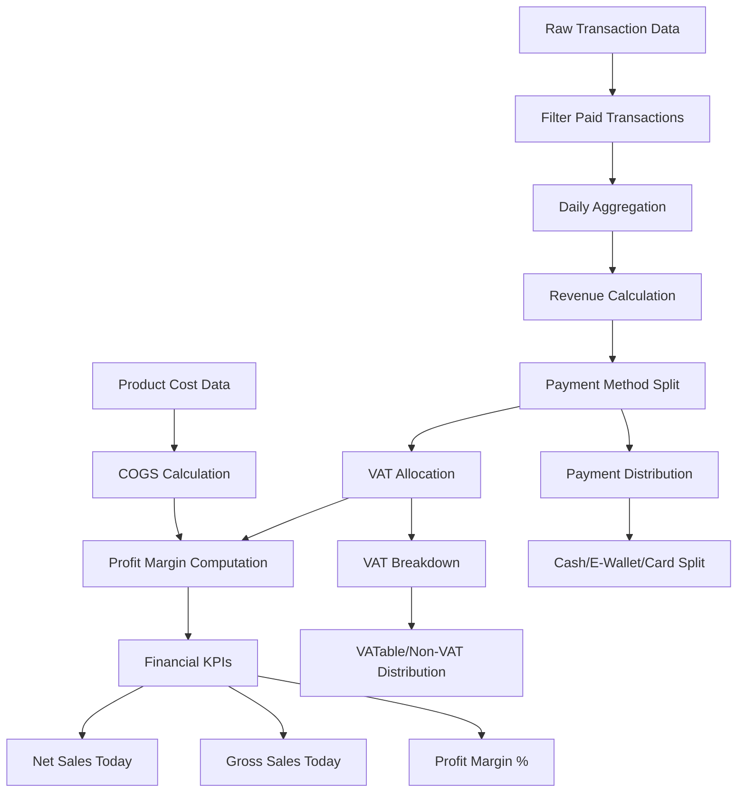
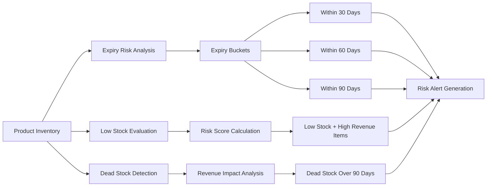
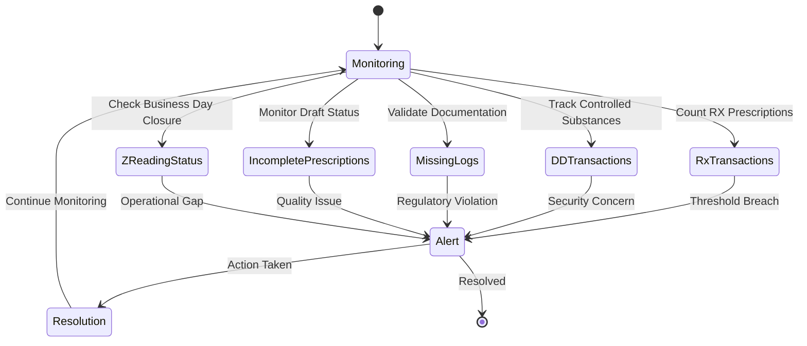
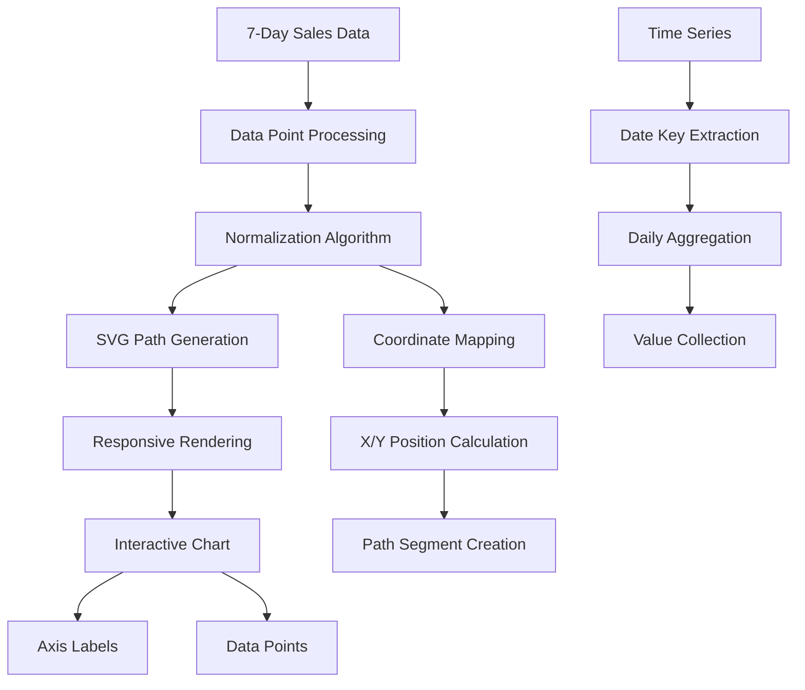
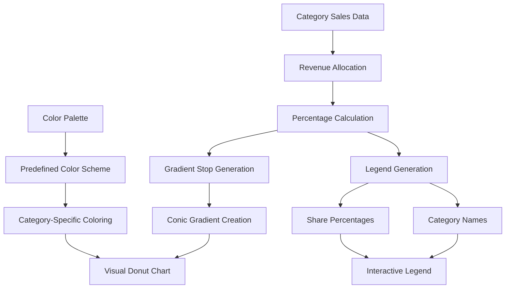
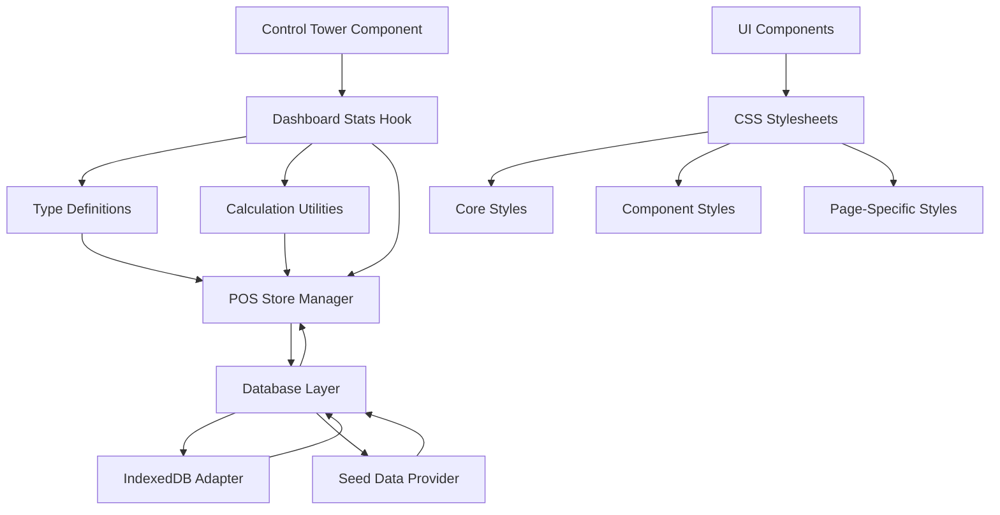

# Control Tower Dashboard

<cite>
**Referenced Files in This Document**
- [control-tower.tsx](file://web-prototype/src/components/control-tower.tsx)
- [use-dashboard-stats.ts](file://web-prototype/src/lib/use-dashboard-stats.ts)
- [types.ts](file://web-prototype/src/lib/types.ts)
- [use-pos-store.ts](file://web-prototype/src/lib/use-pos-store.ts)
- [pos-prototype.tsx](file://web-prototype/src/components/pos-prototype.tsx)
- [seed.ts](file://web-prototype/src/lib/seed.ts)
- [db.ts](file://web-prototype/src/lib/db.ts)
- [package.json](file://web-prototype/package.json)
- [core.css](file://assets/css/core.css)
- [components.css](file://assets/css/components.css)
- [pages.css](file://assets/css/pages.css)
</cite>

## Table of Contents
1. [Introduction](#introduction)
2. [Project Structure](#project-structure)
3. [Core Components](#core-components)
4. [Architecture Overview](#architecture-overview)
5. [Detailed Component Analysis](#detailed-component-analysis)
6. [Dependency Analysis](#dependency-analysis)
7. [Performance Considerations](#performance-considerations)
8. [Troubleshooting Guide](#troubleshooting-guide)
9. [Conclusion](#conclusion)

## Introduction
The Control Tower Dashboard is a comprehensive analytics and monitoring interface for the PharmaSpot Web POS system. It provides real-time visibility into key business metrics including sales performance, inventory health, compliance monitoring, and operational efficiency indicators. Built with React and TypeScript, the dashboard leverages a modern component architecture with centralized state management and offline-first data persistence.

The dashboard serves as the central command center for pharmacy operators, offering intuitive visualizations of financial performance, inventory risk assessment, regulatory compliance tracking, and operational insights through interactive charts and summary cards.

## Project Structure
The Control Tower Dashboard is part of the web-prototype module within the larger PharmaSpot POS ecosystem. The project follows a modular architecture with clear separation of concerns between UI components, business logic, and data management layers.

**Diagram sources**
- [control-tower.tsx:1-219](file://web-prototype/src/components/control-tower.tsx#L1-L219)
- [use-dashboard-stats.ts:1-432](file://web-prototype/src/lib/use-dashboard-stats.ts#L1-L432)
- [use-pos-store.ts:1-671](file://web-prototype/src/lib/use-pos-store.ts#L1-L671)

**Section sources**
- [control-tower.tsx:1-219](file://web-prototype/src/components/control-tower.tsx#L1-L219)
- [package.json:1-34](file://web-prototype/package.json#L1-L34)

## Core Components

### Control Tower View Component
The Control Tower View serves as the primary presentation layer, orchestrating multiple dashboard widgets and analytics panels. It accepts comprehensive business data as props and renders a responsive grid of financial summaries, trend charts, and compliance indicators.

Key features include:
- Real-time financial KPIs (net sales, gross sales, profit margins)
- Interactive sales trend visualization with SVG-based line charts
- Category mix distribution using conic gradients
- Inventory risk assessment with expiry buckets
- Compliance monitoring for prescription and regulatory requirements
- Pending sync queue monitoring for operational reliability

### Dashboard Statistics Engine
The statistics engine performs complex calculations across multiple data domains, transforming raw transaction and inventory data into meaningful business insights. It handles sophisticated aggregations including time-series analysis, category-based revenue breakdowns, and risk scoring algorithms.

Core statistical functions include:
- Multi-day sales trend computation with configurable periods
- Category-based revenue allocation using weighted averages
- Inventory risk categorization (expiry, low stock, dead stock)
- Compliance scoring for prescription and regulatory adherence
- Profit margin calculation incorporating cost of goods sold

### Data Management Architecture
The system employs an offline-first approach using IndexedDB for local data persistence, ensuring reliable operation in various network conditions. The data management layer provides seamless synchronization capabilities with remote systems while maintaining local availability.

**Section sources**
- [control-tower.tsx:34-218](file://web-prototype/src/components/control-tower.tsx#L34-L218)
- [use-dashboard-stats.ts:138-403](file://web-prototype/src/lib/use-dashboard-stats.ts#L138-L403)
- [use-pos-store.ts:70-671](file://web-prototype/src/lib/use-pos-store.ts#L70-L671)

## Architecture Overview

The Control Tower Dashboard implements a layered architecture that separates concerns between presentation, business logic, and data management:

**Diagram sources**
- [pos-prototype.tsx:486-498](file://web-prototype/src/components/pos-prototype.tsx#L486-L498)
- [use-pos-store.ts:128-151](file://web-prototype/src/lib/use-pos-store.ts#L128-L151)
- [use-dashboard-stats.ts:405-431](file://web-prototype/src/lib/use-dashboard-stats.ts#L405-L431)

The architecture emphasizes:
- **Separation of Concerns**: Clear boundaries between UI rendering, business logic, and data persistence
- **Immutability**: Functional programming patterns for data transformations
- **Type Safety**: Comprehensive TypeScript definitions for runtime safety
- **Offline-First**: Local storage with eventual consistency for network resilience
- **Performance**: Memoized computations and efficient data structures

**Section sources**
- [pos-prototype.tsx:486-498](file://web-prototype/src/components/pos-prototype.tsx#L486-L498)
- [db.ts:99-115](file://web-prototype/src/lib/db.ts#L99-L115)

## Detailed Component Analysis

### Financial Analytics Module
The financial analytics module provides comprehensive revenue tracking and margin analysis through multiple interconnected calculations:

**Diagram sources**
- [use-dashboard-stats.ts:138-211](file://web-prototype/src/lib/use-dashboard-stats.ts#L138-L211)

The financial calculations incorporate:
- **Multi-currency support** with configurable currency symbols
- **VAT allocation** based on product tax exemptions
- **Payment method categorization** (cash, e-wallet, external terminal)
- **Profit margin calculation** excluding products without cost data
- **Time-based comparisons** for week-over-week analysis

### Inventory Risk Assessment
The inventory risk assessment system evaluates stock health through multiple risk factors and generates actionable insights:

**Diagram sources**
- [use-dashboard-stats.ts:263-332](file://web-prototype/src/lib/use-dashboard-stats.ts#L263-L332)

Risk assessment criteria include:
- **Expiry proximity** with configurable threshold windows
- **Stock level adequacy** compared to minimum thresholds
- **Revenue correlation** between stock levels and sales performance
- **Dead stock identification** based on transaction history
- **Real-time alert generation** for immediate action

### Compliance Monitoring System
The compliance monitoring system tracks regulatory adherence and operational standards across multiple domains:

**Diagram sources**
- [use-dashboard-stats.ts:212-259](file://web-prototype/src/lib/use-dashboard-stats.ts#L212-L259)

Compliance indicators track:
- **Prescription fulfillment** rates and documentation completeness
- **Controlled substance dispensing** adherence to regulatory requirements
- **Operational reporting** including Z-reading completion
- **Quality assurance** through draft management and red flag monitoring

**Section sources**
- [use-dashboard-stats.ts:138-403](file://web-prototype/src/lib/use-dashboard-stats.ts#L138-L403)
- [types.ts:166-172](file://web-prototype/src/lib/types.ts#L166-L172)

### Data Visualization Components
The dashboard employs sophisticated visualization techniques to present complex data in intuitive formats:

#### Sales Trend Visualization
The sales trend component uses SVG-based line charts with dynamic path generation:

**Diagram sources**
- [control-tower.tsx:22-32](file://web-prototype/src/components/control-tower.tsx#L22-L32)
- [control-tower.tsx:102-109](file://web-prototype/src/components/control-tower.tsx#L102-L109)

#### Category Mix Visualization
The category mix visualization uses conic gradient backgrounds for proportional representation:

**Diagram sources**
- [control-tower.tsx:60-71](file://web-prototype/src/components/control-tower.tsx#L60-L71)
- [control-tower.tsx:139-157](file://web-prototype/src/components/control-tower.tsx#L139-L157)

**Section sources**
- [control-tower.tsx:22-158](file://web-prototype/src/components/control-tower.tsx#L22-L158)

## Dependency Analysis

The Control Tower Dashboard maintains clean dependency relationships through well-defined interfaces and modular architecture:

**Diagram sources**
- [control-tower.tsx:3-4](file://web-prototype/src/components/control-tower.tsx#L3-L4)
- [use-dashboard-stats.ts:1-2](file://web-prototype/src/lib/use-dashboard-stats.ts#L1-L2)
- [use-pos-store.ts:3-25](file://web-prototype/src/lib/use-pos-store.ts#L3-L25)

Key dependency characteristics:
- **Unidirectional Data Flow**: Clear parent-to-child prop passing
- **Functional Dependencies**: Pure functions for calculations and transformations
- **Interface-Based Coupling**: Strong typing prevents runtime errors
- **Layered Architecture**: Each layer has specific responsibilities and boundaries
- **Testable Components**: Isolated functions enable comprehensive unit testing

**Section sources**
- [types.ts:1-526](file://web-prototype/src/lib/types.ts#L1-L526)
- [db.ts:1-241](file://web-prototype/src/lib/db.ts#L1-L241)

## Performance Considerations

The Control Tower Dashboard implements several performance optimization strategies:

### Computational Efficiency
- **Memoized Calculations**: Complex statistical computations cached via React hooks
- **Efficient Data Structures**: Maps and sets for O(1) lookup performance
- **Batch Operations**: Grouped database operations minimize IndexedDB overhead
- **Lazy Loading**: Component-level lazy loading reduces initial bundle size

### Memory Management
- **Object Pooling**: Reused calculation objects prevent garbage collection pressure
- **Weak References**: Circular dependency prevention in data structures
- **Cleanup Functions**: Proper cleanup of event listeners and subscriptions
- **State Normalization**: Flat data structures reduce memory footprint

### Network Optimization
- **Offline-First Design**: Local caching eliminates network dependency
- **Incremental Updates**: Delta-based synchronization reduces bandwidth
- **Background Processing**: Non-blocking calculations during user interactions
- **Resource Preloading**: Critical assets loaded during idle periods

## Troubleshooting Guide

### Common Issues and Solutions

#### Data Loading Problems
**Symptoms**: Blank dashboard or loading indefinitely
**Causes**: 
- IndexedDB initialization failures
- Missing seed data
- Network connectivity issues

**Solutions**:
- Verify IndexedDB availability in browser
- Check browser console for initialization errors
- Ensure proper migration handling
- Implement fallback mechanisms for data recovery

#### Performance Degradation
**Symptoms**: Slow rendering or unresponsive UI
**Causes**:
- Large dataset processing
- Inefficient re-rendering
- Memory leaks in calculations

**Solutions**:
- Implement pagination for large datasets
- Use React.memo for expensive components
- Optimize calculation algorithms
- Monitor memory usage with browser developer tools

#### Data Consistency Issues
**Symptoms**: Inconsistent metrics or stale information
**Causes**:
- Synchronization delays
- Concurrent data modifications
- Cache invalidation problems

**Solutions**:
- Implement optimistic updates with rollback capability
- Use transaction-based database operations
- Add data validation and normalization
- Monitor sync queue status and retry logic

### Debugging Tools and Techniques

#### Development Tools
- **React Developer Tools**: Component hierarchy inspection
- **Redux DevTools**: State change tracking and time travel debugging
- **Browser Console**: Error logging and performance profiling
- **Network Inspector**: API call monitoring and response analysis

#### Monitoring and Logging
- **Structured Logging**: Consistent error and event logging
- **Performance Metrics**: Load times, render performance, memory usage
- **User Interaction Tracking**: Heatmaps and usage pattern analysis
- **Error Boundaries**: Graceful error handling and user feedback

**Section sources**
- [db.ts:99-115](file://web-prototype/src/lib/db.ts#L99-L115)
- [use-pos-store.ts:153-185](file://web-prototype/src/lib/use-pos-store.ts#L153-L185)

## Conclusion

The Control Tower Dashboard represents a sophisticated analytics solution that effectively combines modern React development practices with robust business intelligence capabilities. Through its layered architecture, comprehensive type system, and offline-first design, it delivers reliable performance across diverse operational environments.

Key strengths of the implementation include:
- **Comprehensive Coverage**: Multi-dimensional analytics spanning finance, inventory, and compliance
- **Performance Optimization**: Efficient algorithms and caching strategies for responsive user experience
- **Reliability**: Offline-first architecture ensures continuous operation regardless of network conditions
- **Maintainability**: Clean separation of concerns and comprehensive type safety
- **Extensibility**: Modular design enables easy addition of new metrics and visualizations

The dashboard serves as an exemplary implementation of modern web application architecture, demonstrating best practices in component design, state management, and data persistence. Its comprehensive feature set and attention to performance make it suitable for deployment in demanding retail pharmacy environments where reliable, real-time insights are critical for operational success.

Future enhancements could include advanced forecasting capabilities, customizable dashboard layouts, export functionality for reports, and integration with external business intelligence platforms. The solid architectural foundation provides a strong foundation for these extensions while maintaining the system's performance and reliability characteristics.