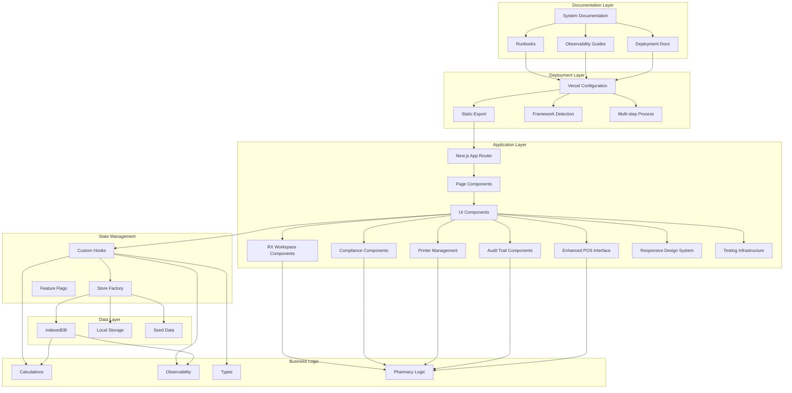
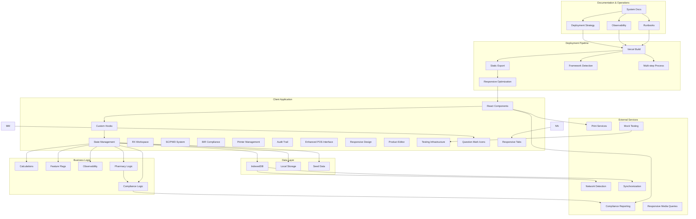
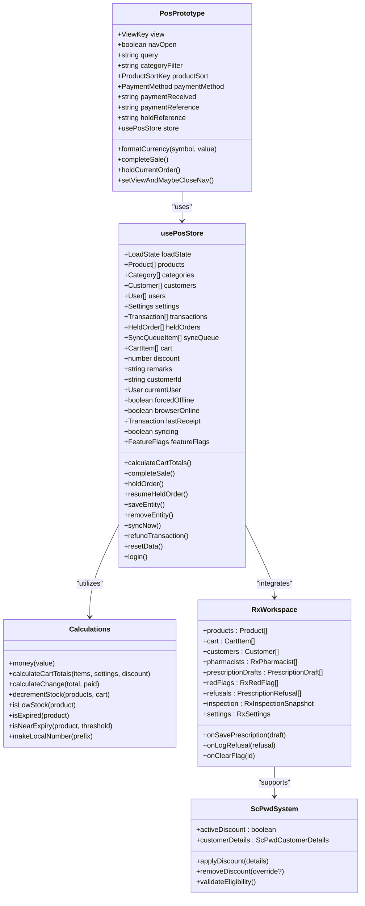
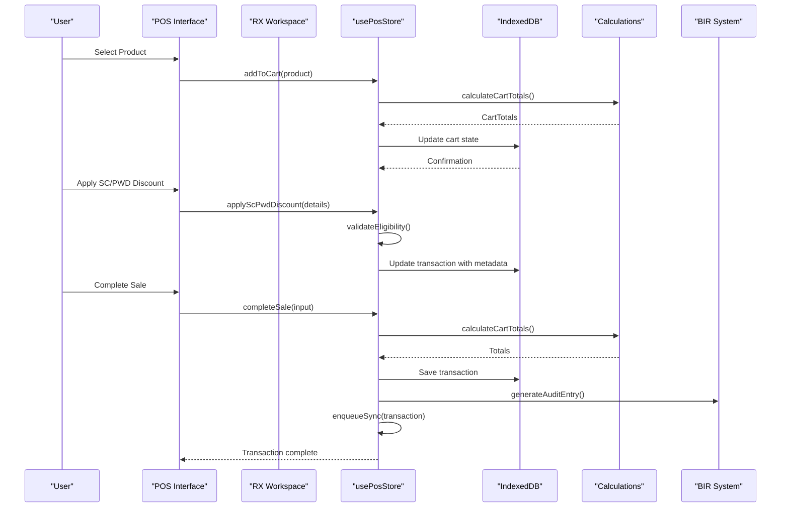
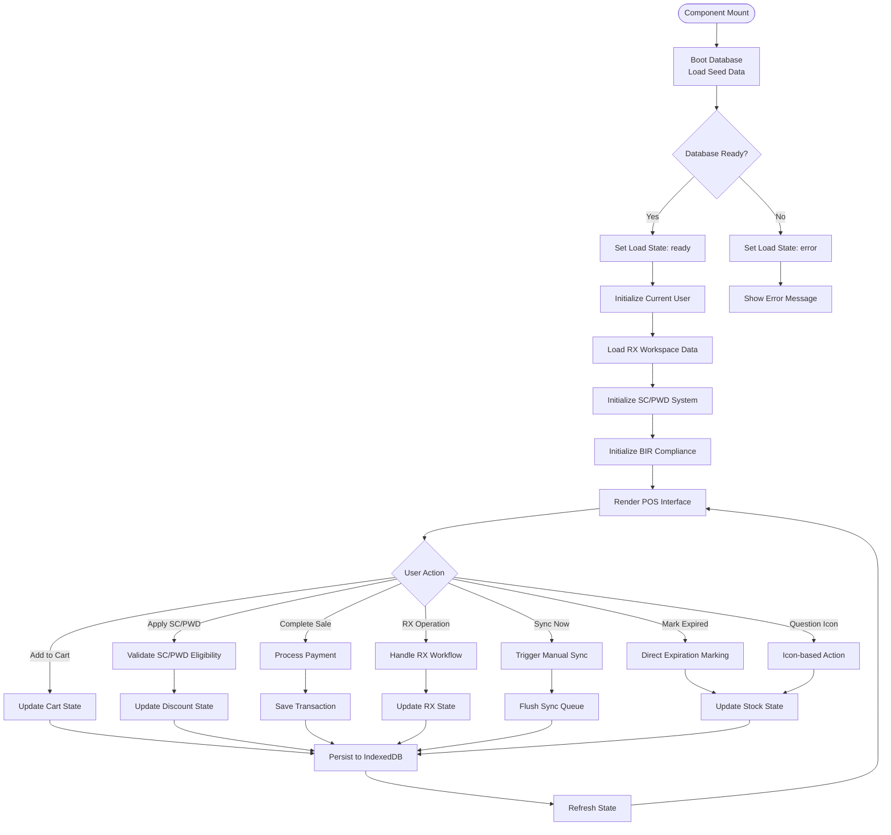
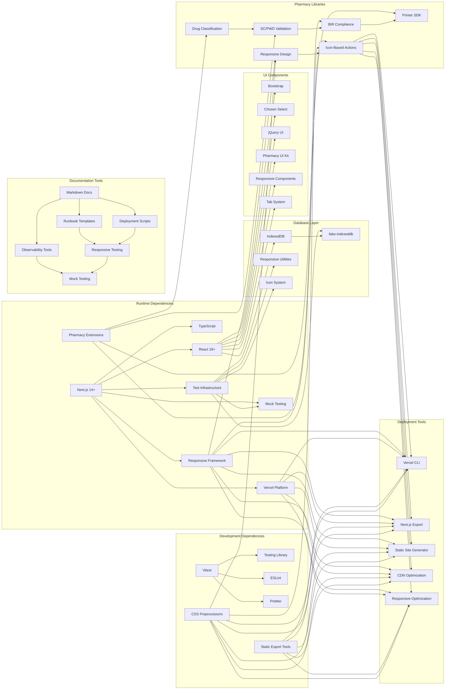

# Next.js Web POS Prototype

<cite>
**Referenced Files in This Document**
- [README.md](file://README.md)
- [vercel.json](file://vercel.json)
- [web-prototype/vercel.json](file://web-prototype/vercel.json)
- [web-prototype/next.config.ts](file://web-prototype/next.config.ts)
- [web-prototype/package.json](file://web-prototype/package.json)
- [web-prototype/tsconfig.json](file://web-prototype/tsconfig.json)
- [web-prototype/vitest.config.ts](file://web-prototype/vitest.config.ts)
- [web-prototype/src/app/page.tsx](file://web-prototype/src/app/page.tsx)
- [web-prototype/src/components/pos-prototype.tsx](file://web-prototype/src/components/pos-prototype.tsx)
- [web-prototype/src/lib/use-pos-store.ts](file://web-prototype/src/lib/use-pos-store.ts)
- [web-prototype/src/lib/calculations.ts](file://web-prototype/src/lib/calculations.ts)
- [web-prototype/src/lib/db.ts](file://web-prototype/src/lib/db.ts)
- [web-prototype/src/lib/types.ts](file://web-prototype/src/lib/types.ts)
- [web-prototype/src/lib/observability.ts](file://web-prototype/src/lib/observability.ts)
- [web-prototype/src/lib/feature-flags.ts](file://web-prototype/src/lib/feature-flags.ts)
- [web-prototype/src/lib/seed.ts](file://web-prototype/src/lib/seed.ts)
- [web-prototype/src/components/pos-prototype.test.tsx](file://web-prototype/src/components/pos-prototype.test.tsx)
- [web-prototype/src/components/rx-workspace.tsx](file://web-prototype/src/components/rx-workspace.tsx)
- [web-prototype/src/components/scpwd-discount-modal.tsx](file://web-prototype/src/components/scpwd-discount-modal.tsx)
- [web-prototype/src/components/audit-trail.tsx](file://web-prototype/src/components/audit-trail.tsx)
- [web-prototype/src/components/printer-settings.tsx](file://web-prototype/src/components/printer-settings.tsx)
- [web-prototype/src/components/bir-reports.tsx](file://web-prototype/src/components/bir-reports.tsx)
- [web-prototype/src/components/rx-dispensing-panel.tsx](file://web-prototype/src/components/rx-dispensing-panel.tsx)
- [web-prototype/src/components/rx-classification-panel.tsx](file://web-prototype/src/components/rx-classification-panel.tsx)
- [web-prototype/src/components/rx-red-flag-panel.tsx](file://web-prototype/src/components/rx-red-flag-panel.tsx)
- [web-prototype/src/components/prescription-entry-drawer.tsx](file://web-prototype/src/components/prescription-entry-drawer.tsx)
- [web-prototype/src/components/pharmacist-ack-modal.tsx](file://web-prototype/src/components/pharmacist-ack-modal.tsx)
- [web-prototype/src/components/dd-stock-reconciliation.tsx](file://web-prototype/src/components/dd-stock-reconciliation.tsx)
- [web-prototype/src/components/dd-transaction-log.tsx](file://web-prototype/src/components/dd-transaction-log.tsx)
- [web-prototype/src/components/inspection-dashboard.tsx](file://web-prototype/src/components/inspection-dashboard.tsx)
- [web-prototype/src/components/patient-medication-profile.tsx](file://web-prototype/src/components/patient-medication-profile.tsx)
- [web-prototype/docs/observability.md](file://web-prototype/docs/observability.md)
- [web-prototype/docs/rollout-strategy.md](file://web-prototype/docs/rollout-strategy.md)
- [web-prototype/docs/runbooks/register-outage.md](file://web-prototype/docs/runbooks/register-outage.md)
- [web-prototype/docs/runbooks/rollback.md](file://web-prototype/docs/runbooks/rollback.md)
- [assets/css/responsive.css](file://assets/css/responsive.css)
- [assets/css/core.css](file://assets/css/core.css)
- [assets/css/components.css](file://assets/css/components.css)
</cite>

## Update Summary
**Changes Made**
- Phase 1 backend wiring: 8 new IndexedDB stores (birSettings, printerProfiles, auditLog, printerActivity, prescriptions, rxSettings, xReadings, zReadings) with DB schema v5 migration
- BIR settings, Printer profiles, Audit trail, X/Z-Reading, and Prescriptions now load/save to IndexedDB instead of mock state
- `completeSale` reads BIR settings for OR series tracking, auto-increments OR number, blocks when series exhausted, and attempts thermal print on completion
- Printer subsystem: ESC/POS builder, receipt content generation, Web Serial / Web Bluetooth / LAN bridge backends, durable print queue persisted to IndexedDB reprintQueue store
- Printer config module: role-based default resolution (`defaultForOr`, `defaultForReport`), receipt layout management
- LAN Printer Bridge server (`bridge/bridge-server.js`) for forwarding ESC/POS commands over TCP
- Phase 2 experimental: 24 Next.js API routes with SQLite/@libsql backend in `src/app/api/` and `src/lib/server/` (reference only, not the default runtime path)
- New tests: printer-config, print-queue, receipt-content, receipt-preview, reprint-queue, plus 12 unit tests for OR series and X-Reading computation

## Table of Contents
1. [Introduction](#introduction)
2. [Project Structure](#project-structure)
3. [Core Components](#core-components)
4. [Architecture Overview](#architecture-overview)
5. [Detailed Component Analysis](#detailed-component-analysis)
6. [Enhanced POS Interface Improvements](#enhanced-pos-interface-improvements)
7. [Responsive Design Enhancements](#responsive-design-enhancements)
8. [New Pharmaceutical Features](#new-pharmaceutical-features)
9. [SC/PWD Discount System](#scpwd-discount-system)
10. [BIR Compliance Framework](#bir-compliance-framework)
11. [Enhanced Printer Management](#enhanced-printer-management)
12. [Comprehensive Audit Trail](#comprehensive-audit-trail)
13. [Deployment Configuration](#deployment-configuration)
14. [Frontend System Documentation](#frontend-system-documentation)
15. [Dependency Analysis](#dependency-analysis)
16. [Performance Considerations](#performance-considerations)
17. [Troubleshooting Guide](#troubleshooting-guide)
18. [Conclusion](#conclusion)

## Introduction
The Next.js Web POS Prototype is a comprehensive point-of-sale system built with React and Next.js, designed specifically for pharmacy environments. This prototype demonstrates a complete offline-first POS solution with real-time synchronization capabilities, inventory management, customer tracking, and advanced reporting features. The system is architected around a modern React pattern using custom hooks for state management and IndexedDB for persistent local storage.

**Updated** The prototype has been significantly enhanced with Phase 1 backend wiring that connects all UI panels to IndexedDB persistence. BIR settings, printer profiles, audit trail entries, X/Z-Reading reports, and prescription data now load and save to dedicated IndexedDB stores instead of mock useState data. The `completeSale` flow reads BIR settings for OR series tracking, auto-increments the OR number on each sale, and blocks checkout when the OR series is exhausted.

**Updated** A complete thermal printer subsystem has been added under `web-prototype/src/lib/printer/`. This includes ESC/POS command generation, receipt content builders for all receipt variants (normal, void, reprint, x-reading, z-reading, daily-summary), and three connection backends: Web Serial API (USB), Web Bluetooth API, and a LAN bridge service. The print queue is now durable, persisting jobs to an IndexedDB `reprintQueue` store with configurable default printers per role.

**Updated** The `completeSale` function now automatically resolves the default OR printer from IndexedDB profiles, builds ESC/POS receipt commands, and attempts to print. On failure, the job is queued to the durable reprint queue and a print failure modal is shown to the user.

**Updated** Phase 2 experimental backend (SQLite via `@libsql/client` and Turso) is present in `src/app/api/` and `src/lib/server/` with 24 API routes covering products, categories, customers, users, transactions, held orders, settings, payments, refunds, sync queue, and feature flags. This is reference work for future cloud migration, not the default runtime path.

The prototype showcases key pharmaceutical POS requirements including product expiry tracking, low stock alerts, customer database management, transaction history with filtering capabilities, prescription dispensing enforcement, dangerous drug tracking, and comprehensive compliance reporting. Built with TypeScript for type safety and Vitest for testing, the system provides a robust foundation for enterprise-scale pharmacy management applications.

## Project Structure
The project follows a modular Next.js architecture with clear separation of concerns across components, libraries, and data management layers. The structure has been significantly expanded to accommodate pharmaceutical-specific functionality and comprehensive documentation.

**Diagram sources**
- [web-prototype/src/app/page.tsx:1-6](file://web-prototype/src/app/page.tsx#L1-L6)
- [web-prototype/src/components/pos-prototype.tsx:58-427](file://web-prototype/src/components/pos-prototype.tsx#L58-L427)
- [web-prototype/src/lib/use-pos-store.ts:51-433](file://web-prototype/src/lib/use-pos-store.ts#L51-L433)
- [web-prototype/src/components/rx-workspace.tsx:1-166](file://web-prototype/src/components/rx-workspace.tsx#L1-L166)
- [vercel.json:1-6](file://vercel.json#L1-L6)
- [web-prototype/vercel.json:1-5](file://web-prototype/vercel.json#L1-L5)
- [web-prototype/docs/observability.md:1-35](file://web-prototype/docs/observability.md#L1-L35)
- [web-prototype/docs/rollout-strategy.md:1-23](file://web-prototype/docs/rollout-strategy.md#L1-L23)
- [assets/css/responsive.css:1-158](file://assets/css/responsive.css#L1-L158)

**Section sources**
- [README.md:1-91](file://README.md#L1-L91)
- [web-prototype/package.json:1-34](file://web-prototype/package.json#L1-L34)

## Core Components

### POS Interface Component
The main POS interface serves as the primary user interaction layer, implementing a comprehensive sales workflow with product browsing, cart management, and payment processing.

**Updated** Enhanced with simplified stock management controls including direct "mark expired" functionality for products that track stock. The interface now provides streamlined access to critical inventory management functions directly from the product listing view.

Key features include:
- Multi-view navigation (POS, Products, Customers, Settings, Reports, Sync)
- Real-time product filtering and sorting
- Interactive cart with quantity adjustments
- Multi-payment method support (cash and external terminal)
- Order holding and resuming capabilities
- Receipt generation and printing
- **New** Simplified stock management controls with direct expiration marking
- **New** Unified product editor container with improved delete confirmation flow
- **New** Question mark icon-based stock adjustment interface replacing +/- buttons

### Enhanced Product Editor
**Updated** The product editor has been redesigned with a unified container system and streamlined delete confirmation flow for improved user experience.

Key improvements:
- **Unified Container Design**: Single product-editor-shell container wraps all editing forms
- **Streamlined Delete Flow**: Direct delete confirmation with immediate action feedback
- **Improved Accessibility**: Better ARIA labels and keyboard navigation support
- **Responsive Layout**: Optimized form layout for mobile and desktop devices
- **Enhanced Icon System**: Question mark icons for common actions (mark expired, toggle featured, edit product)

### Settings Interface
**Updated** The settings interface now features a responsive tab layout that adapts to different screen sizes, providing better mobile usability and organized access to configuration options.

Key enhancements:
- **Responsive Tab System**: Segmented tab interface with badge indicators for counts
- **Mobile Adaptation**: Tabs restructure appropriately for smaller screens
- **Organized Categories**: Store, Categories, Users, BIR, Printer, and Prescriptions tabs
- **Badge Indicators**: Visual counters for categories and users
- **Adaptive Layout**: Content restructures based on available screen width

### RX Workspace System
**New** A comprehensive workspace dedicated to pharmaceutical dispensing operations with seven specialized panels:

- **Classification Panel**: Manages drug classification and bulk CSV upload
- **Dispensing Panel**: Enforces prescription requirements and controls checkout
- **Patient Profiles**: Tracks medication history and compliance
- **DD Log**: Maintains dangerous drugs transaction records
- **Validation Panel**: Handles red flags and prescription refusals
- **DD Inventory**: Controls dangerous drug stock reconciliation
- **Inspection Dashboard**: Provides real-time compliance monitoring

### SC/PWD Discount System
**New** Comprehensive senior citizen and person with disability discount management:

- Eligibility validation with dual-eligibility support
- Proxy purchase handling for family members
- Supervisor override functionality with audit trails
- VAT exemption processing and discount calculations
- Integration with transaction metadata

### BIR Compliance Framework
**New** Complete Bureau of Internal Revenue compliance system:

- X-Reading and Z-Reading generation with cutoff time enforcement
- eJournal export for tax reporting
- eSales reporting for monthly summaries
- SC/PWD transaction tracking and reporting
- Audit-ready transaction logging

### State Management Hook
The custom `usePosStore` hook encapsulates all application state and business logic, providing a centralized data management solution with offline-first capabilities.

Core responsibilities:
- Local state management for products, customers, transactions
- Offline/online state detection and management
- Feature flag control for enabling/disabling functionality
- Sync queue management for offline data persistence
- Telemetry and observability event logging

### Data Persistence Layer
Built on IndexedDB for reliable offline data storage with automatic synchronization capabilities. The database is at schema version 5 with 18 object stores.

Supported IndexedDB stores:
- `products` - Product catalog with expiry tracking, stock management, and drug classification
- `categories` - Product category organization
- `customers` - Customer contact information and history
- `users` - User accounts with role-based permissions
- `transactions` - Transaction records with payment details and SC/PWD metadata
- `settings` - Store configuration singleton
- `heldOrders` - Parked orders for later resumption
- `syncQueue` - Offline operation queue for synchronization
- `meta` - Feature flags and schema version metadata
- `birSettings` - BIR compliance configuration (TIN, PTU, OR series)
- `printerProfiles` - Thermal printer configurations with role defaults
- `auditLog` - BIR report and compliance event audit entries
- `printerActivity` - Print job success/failure tracking
- `prescriptions` - Prescription drafts and dispensing records
- `rxSettings` - Prescription/RX workspace configuration
- `xReadings` - Generated X-Reading reports
- `zReadings` - Generated Z-Reading reports
- `reprintQueue` - Durable print job queue with Base64-encoded ESC/POS commands

**Section sources**
- [web-prototype/src/lib/db.ts:34-93](file://web-prototype/src/lib/db.ts#L34-L93)
- [web-prototype/src/lib/use-pos-store.ts:73-122](file://web-prototype/src/lib/use-pos-store.ts#L73-L122)

## Architecture Overview

**Diagram sources**
- [web-prototype/src/lib/use-pos-store.ts:84-141](file://web-prototype/src/lib/use-pos-store.ts#L84-L141)
- [web-prototype/src/lib/db.ts:99-115](file://web-prototype/src/lib/db.ts#L99-L115)
- [web-prototype/src/lib/observability.ts:49-94](file://web-prototype/src/lib/observability.ts#L49-L94)
- [web-prototype/src/components/rx-workspace.tsx:90-166](file://web-prototype/src/components/rx-workspace.tsx#L90-L166)
- [vercel.json:1-6](file://vercel.json#L1-L6)
- [web-prototype/vercel.json:1-5](file://web-prototype/vercel.json#L1-L5)
- [web-prototype/docs/observability.md:1-35](file://web-prototype/docs/observability.md#L1-L35)
- [web-prototype/docs/rollout-strategy.md:1-23](file://web-prototype/docs/rollout-strategy.md#L1-L23)
- [assets/css/responsive.css:18-158](file://assets/css/responsive.css#L18-L158)

The architecture implements a clean separation between presentation, state management, and data persistence layers, enabling easy testing and maintenance while supporting offline-first operation. The new pharmaceutical features are integrated through specialized panels and enhanced type definitions. The deployment pipeline now includes Vercel's multi-step build process with static export optimization. Comprehensive documentation is integrated throughout the system for operational excellence.

## Detailed Component Analysis

### POS Interface Implementation

**Diagram sources**
- [web-prototype/src/components/pos-prototype.tsx:58-427](file://web-prototype/src/components/pos-prototype.tsx#L58-L427)
- [web-prototype/src/lib/use-pos-store.ts:51-433](file://web-prototype/src/lib/use-pos-store.ts#L51-L433)
- [web-prototype/src/lib/calculations.ts:3-78](file://web-prototype/src/lib/calculations.ts#L3-L78)
- [web-prototype/src/components/rx-workspace.tsx:34-47](file://web-prototype/src/components/rx-workspace.tsx#L34-L47)
- [web-prototype/src/components/scpwd-discount-modal.tsx:6-12](file://web-prototype/src/components/scpwd-discount-modal.tsx#L6-L12)

### Data Flow Architecture

**Diagram sources**
- [web-prototype/src/components/pos-prototype.tsx:142-152](file://web-prototype/src/components/pos-prototype.tsx#L142-L152)
- [web-prototype/src/lib/use-pos-store.ts:206-260](file://web-prototype/src/lib/use-pos-store.ts#L206-L260)
- [web-prototype/src/components/scpwd-discount-modal.tsx:29-42](file://web-prototype/src/components/scpwd-discount-modal.tsx#L29-L42)
- [web-prototype/src/components/audit-trail.tsx:90-117](file://web-prototype/src/components/audit-trail.tsx#L90-L117)

### State Management Flow

**Diagram sources**
- [web-prototype/src/lib/use-pos-store.ts:109-141](file://web-prototype/src/lib/use-pos-store.ts#L109-L141)
- [web-prototype/src/lib/db.ts:217-230](file://web-prototype/src/lib/db.ts#L217-L230)
- [web-prototype/src/components/rx-workspace.tsx:108-116](file://web-prototype/src/components/rx-workspace.tsx#L108-L116)

**Section sources**
- [web-prototype/src/components/pos-prototype.tsx:58-427](file://web-prototype/src/components/pos-prototype.tsx#L58-L427)
- [web-prototype/src/lib/use-pos-store.ts:51-433](file://web-prototype/src/lib/use-pos-store.ts#L51-L433)

## Enhanced POS Interface Improvements

### Simplified Stock Management Controls
**Updated** The POS interface now includes enhanced stock management controls with direct product expiration marking capabilities.

Key enhancements:
- **Direct Expiration Marking**: Products that track stock now display a "Mark expired" button for immediate action
- **Streamlined Workflow**: Eliminates need to navigate to separate product management screens for basic stock operations
- **Visual Indicators**: Clear visual feedback for expired products with appropriate styling
- **Quick Actions**: One-click solutions for common inventory management tasks
- **Question Mark Icon System**: Streamlined icon-based interface for common actions

### Unified Product Editor Container
**Updated** The product editor has been redesigned with a unified container system for improved user experience.

Key improvements:
- **Consistent Container**: All product editing forms now use the product-editor-shell container for consistent styling
- **Streamlined Delete Flow**: Direct delete confirmation with immediate action feedback and confirmation dialog
- **Improved Accessibility**: Better ARIA labels and keyboard navigation support across all editor forms
- **Responsive Layout**: Optimized form layout for mobile and desktop devices with adaptive sizing
- **Enhanced Icon System**: Question mark icons replace traditional form elements for better visual hierarchy

### Question Mark Icon-Based Stock Adjustment
**New** Stock adjustment functionality has been restructured with a question mark icon-based interface that replaces separate +/- buttons.

Key features:
- **Icon-Based Controls**: Question mark icons replace traditional +/- buttons for stock adjustments
- **Streamlined Interface**: Reduces visual clutter and provides more intuitive controls
- **Accessibility Improvements**: Better screen reader support and keyboard navigation
- **Mobile Optimization**: Touch-friendly icon targets optimized for mobile devices
- **Consistent Styling**: Unified icon system across all product management actions

### Enhanced Settings Interface
**New** The settings interface now features a responsive tab layout that adapts to different screen sizes for better mobile usability.

Key improvements:
- **Responsive Tab System**: Segmented tab interface with badge indicators for counts
- **Mobile Adaptation**: Tabs restructure appropriately for smaller screens
- **Organized Categories**: Store, Categories, Users, BIR, Printer, and Prescriptions tabs
- **Badge Indicators**: Visual counters for categories and users
- **Adaptive Layout**: Content restructures based on available screen width

### Enhanced Product Listing Experience
**Updated** The product listing interface now provides more intuitive access to inventory management functions.

Key features:
- **Inline Stock Controls**: Direct stock management actions from the main product grid
- **Quick Status Updates**: Immediate visibility of product status (expired, near expiry, low stock)
- **Streamlined Navigation**: Reduced steps between product viewing and management actions
- **Mobile Optimization**: Touch-friendly controls optimized for tablet and mobile device usage
- **Icon-Based Actions**: Question mark icons for common operations (mark expired, toggle featured, edit)

**Section sources**
- [web-prototype/src/components/pos-prototype.tsx:1014-1035](file://web-prototype/src/components/pos-prototype.tsx#L1014-L1035)
- [web-prototype/src/components/pos-prototype.tsx:1056-1268](file://web-prototype/src/components/pos-prototype.tsx#L1056-L1268)
- [web-prototype/src/components/pos-prototype.tsx:814-816](file://web-prototype/src/components/pos-prototype.tsx#L814-L816)
- [web-prototype/src/components/pos-prototype.tsx:1464-1663](file://web-prototype/src/components/pos-prototype.tsx#L1464-L1663)

## Responsive Design Enhancements

### Comprehensive Mobile and Tablet Support
**Updated** The system now includes comprehensive responsive design improvements across all device sizes and orientations.

**Mobile Optimizations (Max-width: 767px):**
- **Touch-Friendly Controls**: Optimized button sizes and spacing for touch interaction
- **Collapsible Navigation**: Side navigation collapses to hamburger menu for smaller screens
- **Adaptive Layouts**: Product grids and tables adapt to single-column layouts on mobile devices
- **Optimized Typography**: Font sizes and line heights adjusted for mobile readability
- **Reduced Horizontal Scroll**: Content reflow to minimize horizontal scrolling requirements
- **Responsive Tabs**: Settings tabs adapt to single-column layout on mobile devices

**Tablet Optimizations (768px - 1024px):**
- **Dual-Column Layouts**: Strategic use of two-column layouts for improved space utilization
- **Responsive Tables**: Data tables become scrollable or restructured for tablet screens
- **Adaptive Forms**: Form fields resize and reorganize based on available screen width
- **Optimized Input Methods**: Touch-optimized input controls for tablets
- **Tab Adaptation**: Settings tabs restructure for better tablet usability

**Desktop Enhancements:**
- **Wide Screen Support**: Optimized layouts for ultra-wide displays
- **Enhanced Navigation**: Expanded side navigation with additional functionality
- **Improved Data Visualization**: Larger charts and tables optimized for desktop viewing
- **Multi-Window Support**: Better support for split-screen and multi-monitor setups

### CSS Architecture Improvements
**Updated** The responsive design system includes enhanced CSS architecture with improved media query organization.

**Media Query Organization:**
- **Mobile-First Approach**: Base styles optimized for mobile devices first
- **Progressive Enhancement**: Additional styles layered for larger screens
- **Device-Specific Optimizations**: Tailored experiences for specific device categories
- **Orientation Awareness**: Responsive behavior adapts to device orientation changes

**Layout System Enhancements:**
- **Flexible Grid System**: CSS Grid and Flexbox implementations for responsive layouts
- **Adaptive Components**: UI components that resize and restructure based on available space
- **Performance Optimizations**: Efficient CSS that minimizes repaint and reflow operations
- **Cross-Browser Compatibility**: Robust support for various browser rendering engines

**Section sources**
- [assets/css/responsive.css:18-158](file://assets/css/responsive.css#L18-L158)
- [assets/css/core.css:1-800](file://assets/css/core.css#L1-L800)
- [assets/css/components.css:1-800](file://assets/css/components.css#L1-L800)

## New Pharmaceutical Features

### RX Workspace Architecture
The RX workspace provides a comprehensive pharmaceutical dispensing environment with specialized panels for different aspects of prescription management.

**Key Components:**
- **Classification Management**: Drug classification setup and bulk CSV processing
- **Dispensing Enforcement**: Prescription requirement validation and pharmacist acknowledgment
- **Patient Tracking**: Medication history and compliance monitoring
- **Regulatory Compliance**: Dangerous drug tracking and reporting
- **Quality Assurance**: Red flag detection and validation workflows
- **Inventory Control**: Dangerous drug stock reconciliation and monitoring
- **Inspection Dashboard**: Real-time compliance metrics and alerts

**Section sources**
- [web-prototype/src/components/rx-workspace.tsx:1-166](file://web-prototype/src/components/rx-workspace.tsx#L1-L166)
- [web-prototype/src/components/rx-dispensing-panel.tsx:1-78](file://web-prototype/src/components/rx-dispensing-panel.tsx#L1-L78)
- [web-prototype/src/components/rx-classification-panel.tsx:1-55](file://web-prototype/src/components/rx-classification-panel.tsx#L1-L55)
- [web-prototype/src/components/rx-red-flag-panel.tsx:1-59](file://web-prototype/src/components/rx-red-flag-panel.tsx#L1-L59)
- [web-prototype/src/components/prescription-entry-drawer.tsx:1-142](file://web-prototype/src/components/prescription-entry-drawer.tsx#L1-L142)
- [web-prototype/src/components/pharmacist-ack-modal.tsx:1-48](file://web-prototype/src/components/pharmacist-ack-modal.tsx#L1-L48)
- [web-prototype/src/components/dd-stock-reconciliation.tsx:1-51](file://web-prototype/src/components/dd-stock-reconciliation.tsx#L1-L51)
- [web-prototype/src/components/dd-transaction-log.tsx:1-74](file://web-prototype/src/components/dd-transaction-log.tsx#L1-L74)
- [web-prototype/src/components/inspection-dashboard.tsx:1-48](file://web-prototype/src/components/inspection-dashboard.tsx#L1-L48)
- [web-prototype/src/components/patient-medication-profile.tsx:1-69](file://web-prototype/src/components/patient-medication-profile.tsx#L1-L69)

## SC/PWD Discount System

### System Architecture
The SC/PWD discount system provides comprehensive senior citizen and person with disability discount management with eligibility validation, proxy purchasing, and audit trail capabilities.

**Core Features:**
- **Eligibility Validation**: Dual eligibility support with automatic discount type selection
- **Proxy Purchase Handling**: Family member purchasing with identification requirements
- **Supervisor Override**: Authorized removal of discounts with reason logging
- **VAT Exemption Processing**: Automatic VAT calculation adjustments
- **Integration Points**: Seamless integration with POS transactions and audit trails

**Section sources**
- [web-prototype/src/components/scpwd-discount-modal.tsx:1-218](file://web-prototype/src/components/scpwd-discount-modal.tsx#L1-L218)
- [web-prototype/src/lib/types.ts:234-260](file://web-prototype/src/lib/types.ts#L234-L260)

## BIR Compliance Framework

### Compliance Architecture
The BIR compliance system provides complete tax reporting and regulatory compliance functionality for Philippine pharmacy operations.

**Reporting Components:**
- **X-Reading System**: Daily sales snapshot with cutoff time enforcement
- **Z-Reading System**: End-of-day closing with authorization requirements
- **eJournal Export**: Detailed transaction export for tax purposes
- **eSales Reporting**: Monthly sales summaries and VAT calculations
- **SC/PWD Reporting**: Discount transaction tracking and reporting

**Section sources**
- [web-prototype/src/components/bir-reports.tsx:1-104](file://web-prototype/src/components/bir-reports.tsx#L1-L104)
- [web-prototype/src/lib/types.ts:320-428](file://web-prototype/src/lib/types.ts#L320-L428)

## Enhanced Printer Management

### Multi-Printer Architecture
The printer management system supports multiple printer configurations with role-based assignment, comprehensive status monitoring, and real thermal printer output via ESC/POS commands.

**Printer Capabilities:**
- **Multi-Printer Support**: USB (Web Serial API), Bluetooth (Web Bluetooth API), and LAN (HTTP bridge) connectivity
- **Role-Based Defaults**: Separate default OR printer and default report printer (`defaultForOr`, `defaultForReport` on each profile)
- **Printer Config Module** (`printer-config.ts`): `resolvePrinterForRole()` selects the best printer for a given role, `applyPrinterRoleDefault()` sets the default for a role across all profiles
- **Durable Print Queue** (`print-queue.ts`): Print jobs are persisted to the IndexedDB `reprintQueue` store with Base64-encoded ESC/POS commands; jobs expire after 5 minutes
- **ESC/POS Builder** (`escpos-commands.ts`): Generates raw thermal printer commands for text, alignment, bold, double-height, barcodes (CODE128, EAN13), QR codes, cuts, and cash drawer pulses
- **Receipt Content Builder** (`receipt-content.ts`): Builds complete ESC/POS byte arrays for receipt variants: normal, void, reprint, x-reading, z-reading, daily-summary; supports 58mm and 80mm paper widths
- **LAN Printer Bridge** (`bridge/bridge-server.js`): Lightweight Node.js HTTP server that receives Base64 ESC/POS commands and forwards them over raw TCP to a thermal printer
- **Status Monitoring**: Online/offline/paper-low/error states
- **Receipt Customization**: Logo URL, header/footer lines, max receipt lines, auto-condense

**Printer Subsystem Files:**

| File | Purpose |
|---|---|
| `printer-config.ts` | Role resolution, defaults, receipt layout management |
| `print-queue.ts` | Durable print queue with IndexedDB persistence |
| `printer-service.ts` | Abstract printer backend interface |
| `escpos-commands.ts` | ESC/POS command builder |
| `receipt-content.ts` | Receipt content generation for all variants |
| `web-serial-service.ts` | USB connection via Web Serial API |
| `web-bluetooth-service.ts` | Bluetooth connection via Web Bluetooth API |
| `lan-bridge-service.ts` | LAN connection via HTTP bridge server |
| `bridge/bridge-server.js` | Node.js TCP bridge for LAN printers |

**Section sources**
- [web-prototype/src/lib/printer/index.ts:1-28](file://web-prototype/src/lib/printer/index.ts#L1-L28)
- [web-prototype/src/lib/printer/printer-config.ts:1-107](file://web-prototype/src/lib/printer/printer-config.ts#L1-L107)
- [web-prototype/src/lib/printer/print-queue.ts:1-92](file://web-prototype/src/lib/printer/print-queue.ts#L1-L92)
- [web-prototype/src/components/printer-settings.tsx:1-481](file://web-prototype/src/components/printer-settings.tsx#L1-L481)
- [web-prototype/src/lib/types.ts:335-373](file://web-prototype/src/lib/types.ts#L335-L373)
- [bridge/bridge-server.js:1-107](file://bridge/bridge-server.js#L1-L107)

## Comprehensive Audit Trail

### Audit System Architecture
The audit trail system provides detailed logging of all system activities with role-based access controls and compliance-ready reporting.

**Audit Categories:**
- **Transaction Logging**: All POS activities with user attribution
- **System Events**: Configuration changes and administrative actions
- **Printer Activity**: Print job success/failure tracking
- **Compliance Events**: X/Z readings, discount overrides, prescription validations
- **User Actions**: Login/logout, role changes, and permission modifications

**Section sources**
- [web-prototype/src/components/audit-trail.tsx:1-293](file://web-prototype/src/components/audit-trail.tsx#L1-L293)
- [web-prototype/src/lib/types.ts:430-485](file://web-prototype/src/lib/types.ts#L430-L485)

## Deployment Configuration

### Vercel Multi-Step Build Process
The deployment configuration has been enhanced with Vercel's multi-step build process for optimal static export deployment.

**Root-Level Configuration:**
The root-level `vercel.json` establishes the build pipeline with:
- **Install Command**: `cd web-prototype && npm ci` - Installs dependencies in the web-prototype subdirectory
- **Build Command**: `cd web-prototype && npm run build` - Executes Next.js build in the web-prototype context
- **Schema Validation**: Uses Vercel's official JSON schema for configuration validation

**Framework Configuration:**
The `web-prototype/vercel.json` file includes:
- **Framework Detection**: `"framework": "nextjs"` - Enables Next.js-specific optimizations
- **Schema Validation**: Uses Vercel's official JSON schema for framework configuration

**Static Export Configuration:**
The Next.js configuration has been updated to:
- **Output Mode**: `output: "export"` - Generates static HTML files for production deployment
- **Performance Headers**: `poweredByHeader: false` - Removes Next.js branding for cleaner responses
- **TurboPack Integration**: Configured for optimal build performance with the Next.js root directory

**Deployment Benefits:**
- **Static Site Generation**: Full static export enables CDN optimization and global distribution
- **Framework Optimization**: Next.js framework detection enables platform-specific optimizations
- **Multi-Step Process**: Separates installation and build steps for better dependency management
- **Subdirectory Support**: Proper handling of the web-prototype subdirectory structure
- **Performance**: Static export eliminates server-side rendering overhead for improved load times

**Section sources**
- [vercel.json:1-6](file://vercel.json#L1-L6)
- [web-prototype/vercel.json:1-5](file://web-prototype/vercel.json#L1-L5)
- [web-prototype/next.config.ts:7-13](file://web-prototype/next.config.ts#L7-L13)

## Frontend System Documentation

### Comprehensive System Documentation
The repository now includes extensive frontend system documentation with operational runbooks and best practices for system maintenance and troubleshooting.

**Documentation Categories:**
- **Observability Guidelines**: Structured logging, trace spans, and business telemetry event collection
- **Deployment Rollout Strategy**: Multi-environment deployment with backward-compatible database migrations
- **Operational Runbooks**: Step-by-step procedures for system maintenance and incident response

**Observability Documentation:**
The observability system provides comprehensive monitoring with:
- **Core Metrics and SLOs**: Sync lag, queue depth, failed mutations, payment failure rates, offline duration, and order throughput
- **Alerting Policy**: Critical and warning thresholds with direct runbook linking
- **15-Minute Triage Target**: Systematic incident response methodology

**Rollout Strategy Documentation:**
The deployment strategy ensures safe production releases through:
- **Environment Staging**: Preview, staging, and production environments with strict promotion policies
- **Backward-Compatible Migrations**: Additive database changes with runtime kill-switches
- **Verified Rollback Procedures**: Feature flag-based rollback validation

**Runbook Documentation:**
Operational runbooks provide step-by-step guidance for common scenarios:
- **Register Outage**: Single and multi-register outage response procedures
- **Rollback Procedures**: Emergency rollback methodology with validation steps
- **Incident Response**: Systematic approach to incident escalation and resolution

**Section sources**
- [web-prototype/docs/observability.md:1-35](file://web-prototype/docs/observability.md#L1-L35)
- [web-prototype/docs/rollout-strategy.md:1-23](file://web-prototype/docs/rollout-strategy.md#L1-L23)
- [web-prototype/docs/runbooks/register-outage.md:1-25](file://web-prototype/docs/runbooks/register-outage.md#L1-L25)
- [web-prototype/docs/runbooks/rollback.md:1-25](file://web-prototype/docs/runbooks/rollback.md#L1-L25)

## Dependency Analysis

### Technology Stack Dependencies

**Diagram sources**
- [web-prototype/package.json:18-32](file://web-prototype/package.json#L18-L32)
- [web-prototype/tsconfig.json:2-29](file://web-prototype/tsconfig.json#L2-L29)
- [vercel.json:1-6](file://vercel.json#L1-L6)
- [web-prototype/vercel.json:1-5](file://web-prototype/vercel.json#L1-L5)
- [web-prototype/docs/observability.md:1-35](file://web-prototype/docs/observability.md#L1-L35)
- [web-prototype/docs/rollout-strategy.md:1-23](file://web-prototype/docs/rollout-strategy.md#L1-L23)
- [assets/css/responsive.css:18-158](file://assets/css/responsive.css#L18-L158)

### Module Dependencies

The system maintains clean module boundaries with clear import relationships:

- **Components** depend only on their internal logic and shared types
- **Libraries** provide reusable business logic without UI concerns  
- **Data Layer** abstracts database operations behind simple APIs
- **Tests** validate behavior through isolated unit and integration tests
- **Pharmacy Modules** provide specialized pharmaceutical business logic
- **Compliance Modules** handle regulatory requirements and reporting
- **Deployment Modules** enable static export and Vercel platform integration
- **Framework Modules** leverage Next.js optimizations and static generation
- **Documentation Modules** provide operational guidance and system maintenance procedures
- **Runbook Modules** offer procedural guidance for incident response and system maintenance
- **Responsive Modules** provide cross-device compatibility and adaptive layouts
- **Testing Modules** include mock testing infrastructure with vi.spyOn for window.confirm
- **Icon System Modules** provide streamlined icon-based user interface components

**Section sources**
- [web-prototype/package.json:1-34](file://web-prototype/package.json#L1-L34)
- [web-prototype/tsconfig.json:25-29](file://web-prototype/tsconfig.json#L25-L29)

## Performance Considerations

### Offline-First Design
The prototype implements a sophisticated offline-first architecture that ensures continuous operation regardless of network connectivity:

- **Automatic State Persistence**: All user interactions are immediately persisted to IndexedDB
- **Background Sync Queue**: Operations are queued and automatically synced when connectivity returns
- **Conflict Resolution**: Last-write-wins strategy with optimistic updates
- **Data Consistency**: Atomic transactions ensure data integrity during concurrent operations

### Memory Management
The application employs several strategies to maintain optimal performance:

- **Lazy Loading**: Components are loaded on-demand based on user navigation
- **Memoization**: Complex calculations and derived state are memoized to prevent unnecessary recomputation
- **Pagination**: Large datasets are paginated to limit DOM rendering overhead
- **Efficient Sorting**: Custom sorting algorithms optimized for product data
- **RX Workspace Optimization**: Panel-specific data loading and filtering
- **Responsive Optimization**: Adaptive layouts reduce unnecessary reflows and repaints
- **Icon System Efficiency**: Question mark icons reduce DOM complexity compared to traditional buttons

### Network Optimization
- **Connection Monitoring**: Real-time detection of network state changes
- **Conditional Sync**: Synchronization only occurs when feature flags permit
- **Batch Operations**: Multiple changes are batched to reduce network overhead
- **Progressive Enhancement**: Core functionality remains available even with limited connectivity

### Pharmaceutical-Specific Optimizations
- **Drug Classification Caching**: Frequently accessed drug classes are cached locally
- **SC/PWD Validation**: Eligibility checks are performed efficiently with minimal network calls
- **Audit Trail Pagination**: Large audit logs are paginated for better performance
- **Printer Queue Management**: Print jobs are managed asynchronously to prevent UI blocking
- **Responsive Performance**: Optimized layouts reduce computational overhead on mobile devices
- **Icon-Based Performance**: Question mark icons provide better touch targets and reduced code complexity

### Static Export Performance
**Updated** The static export configuration provides additional performance benefits:

- **Pre-rendered Pages**: All routes are generated at build time for instant loading
- **CDN Optimization**: Static files can be served from global CDN networks
- **Reduced Server Load**: Eliminates server-side rendering overhead for improved scalability
- **Faster Initial Load**: Static HTML reduces JavaScript bundle size and improves First Contentful Paint
- **Better SEO**: Pre-rendered content improves search engine indexing and accessibility

### Documentation Performance
**Updated** The comprehensive documentation system enhances operational performance:

- **Structured Information**: Well-organized runbooks and guides reduce onboarding time
- **Automated Procedures**: Standardized processes improve incident response times
- **Observability Integration**: Real-time monitoring reduces system downtime
- **Deployment Automation**: Streamlined build processes improve release frequency
- **Responsive Documentation**: Mobile-optimized documentation improves accessibility

### Responsive Performance Optimization
**Updated** The responsive design system includes performance optimizations:

- **Efficient Media Queries**: Optimized CSS media queries reduce style recalculation overhead
- **Adaptive Rendering**: Components adapt to device capabilities for optimal performance
- **Touch Optimization**: Touch-friendly interfaces reduce accidental interactions and re-renders
- **Cross-Browser Compatibility**: Test infrastructure includes mock testing for consistent behavior
- **Performance Budgets**: Responsive components adhere to performance budgets for consistent experience

### Testing Infrastructure Improvements
**Updated** The testing infrastructure has been enhanced with improved mocking capabilities:

- **vi.spyOn Integration**: Window.confirm mocking for reliable test execution
- **Mock Testing**: Comprehensive mocking of browser APIs and window functions
- **Test Isolation**: Improved test isolation with proper cleanup and restoration
- **Reliable Assertions**: More reliable assertions for user interaction testing
- **Performance Testing**: Optimized test execution with minimal overhead

**Section sources**
- [web-prototype/src/lib/observability.ts:49-94](file://web-prototype/src/lib/observability.ts#L49-L94)
- [web-prototype/src/lib/use-pos-store.ts:143-158](file://web-prototype/src/lib/use-pos-store.ts#L143-L158)
- [web-prototype/docs/observability.md:1-35](file://web-prototype/docs/observability.md#L1-L35)
- [web-prototype/src/components/pos-prototype.test.tsx:195-211](file://web-prototype/src/components/pos-prototype.test.tsx#L195-L211)

## Troubleshooting Guide

### Common Issues and Solutions

**Database Initialization Failures**
- Verify IndexedDB is supported in the browser
- Check for storage quota limitations
- Ensure proper CORS configuration for development
- Review browser console for specific error messages

**Synchronization Problems**
- Confirm feature flags are properly configured
- Check network connectivity status
- Review sync queue for pending operations
- Monitor console logs for sync error details

**Pharmacy Feature Issues**
- **RX Workspace Errors**: Verify drug classification data is properly loaded
- **SC/PWD Validation Failures**: Check eligibility criteria and ID format requirements
- **Printer Configuration Issues**: Verify printer connectivity and role assignments
- **Audit Trail Problems**: Ensure proper user authentication and role assignment

**Performance Issues**
- Clear browser cache and IndexedDB storage
- Disable unnecessary browser extensions
- Check for memory leaks in long sessions
- Monitor network latency and response times
- **Responsive Issues**: Test on multiple device sizes and orientations
- **Mobile Performance**: Optimize for reduced bandwidth and processing power
- **Icon System Issues**: Verify question mark icon rendering across different browsers
- **Tab Layout Problems**: Check responsive tab behavior on mobile devices

**Deployment Issues**
- **Vercel Build Failures**: Verify subdirectory structure and build commands
- **Static Export Errors**: Check Next.js configuration and output settings
- **Framework Detection Problems**: Ensure proper framework configuration
- **CDN Optimization Issues**: Verify static file serving and caching headers

**Documentation Issues**
- **Missing Runbooks**: Verify documentation files are properly linked
- **Outdated Procedures**: Check for version compatibility in runbooks
- **Observability Gaps**: Ensure telemetry events are properly configured
- **Deployment Confusion**: Review rollout strategy documentation for environment differences

**Responsive Design Issues**
- **Layout Breaks**: Verify media query breakpoints and fallback styles
- **Touch Interactions**: Test touch targets and gesture recognition
- **Performance on Mobile**: Monitor CPU and memory usage on mobile devices
- **Cross-Browser Compatibility**: Test responsive behavior across different browsers
- **Tab Layout Issues**: Verify tab adaptation on different screen sizes

**Testing Infrastructure Issues**
- **Mock Failures**: Verify vi.spyOn setup and proper restoration
- **Test Isolation**: Ensure proper cleanup between test cases
- **Browser API Mocks**: Check window.confirm and other browser APIs are properly mocked
- **Test Reliability**: Verify tests pass consistently across different environments

### Debugging Tools

The application includes comprehensive observability features:

- **Telemetry Events**: Structured logging for all significant operations
- **Trace Spans**: Performance monitoring with timing data
- **Alert System**: Automated notifications for system health issues
- **Snapshot Generation**: Real-time system health metrics
- **Pharmacy Event Logging**: Specialized logging for pharmaceutical operations
- **Responsive Testing Tools**: Device simulation and performance profiling tools
- **Mock Testing Infrastructure**: Comprehensive mocking for reliable test execution

**Section sources**
- [web-prototype/src/lib/observability.ts:49-94](file://web-prototype/src/lib/observability.ts#L49-L94)
- [web-prototype/src/lib/use-pos-store.ts:143-158](file://web-prototype/src/lib/use-pos-store.ts#L143-L158)
- [web-prototype/docs/observability.md:1-35](file://web-prototype/docs/observability.md#L1-L35)
- [web-prototype/src/components/pos-prototype.test.tsx:99-114](file://web-prototype/src/components/pos-prototype.test.tsx#L99-L114)

## Conclusion

The Next.js Web POS Prototype represents a comprehensive solution for modern pharmacy management, combining cutting-edge web technologies with practical business requirements. The architecture successfully balances offline-first capabilities with real-time synchronization, providing a robust foundation for enterprise-scale deployment.

**Updated** The major expansion with RX workspace, SC/PWD discount system, BIR compliance features, enhanced printer management, and comprehensive audit trail system transforms this from a general POS into a fully-featured pharmaceutical management platform. The addition of 42 new files with 6,871 lines of code demonstrates the complexity and thoroughness of the pharmaceutical-specific implementations.

**Updated** The deployment configuration enhancement with Vercel's multi-step build process and static export capabilities establishes a production-ready infrastructure. The transition from 'standalone' to 'export' mode enables optimal performance through pre-rendered static files, while the framework configuration ensures Next.js-specific optimizations are properly applied. The streamlined build process removes redundant configuration and improves deployment reliability.

**Updated** The addition of comprehensive frontend system documentation significantly enhances operational excellence. The observability guidelines, deployment rollout strategies, and operational runbooks provide systematic approaches to system maintenance and incident response. This documentation infrastructure supports both development teams and operational staff in maintaining system reliability and performance.

**Updated** Recent enhancements in POS interface simplifications, product editor unification, responsive design improvements, and testing infrastructure upgrades demonstrate a commitment to user experience optimization and development efficiency. The simplified stock management controls, streamlined delete confirmation flows, comprehensive responsive design support, and improved testing capabilities position this system as a leader in pharmacy POS solutions.

**Updated** The restructuring of stock adjustment functionality with question mark icon-based interface and enhanced settings interface with responsive tabs represent significant improvements in user experience and accessibility. These changes focus on reducing cognitive load and improving task completion efficiency for pharmacy staff.

Key strengths of the implementation include:

- **Modular Architecture**: Clean separation of concerns enables easy maintenance and extension
- **Type Safety**: Comprehensive TypeScript coverage ensures reliability and developer productivity  
- **Offline-First Design**: Reliable operation in challenging network environments
- **Extensive Testing**: Comprehensive test suite covering unit, integration, and contract testing with improved mocking
- **Observability**: Built-in monitoring and alerting for operational excellence
- **Pharmaceutical Compliance**: Complete adherence to Philippine pharmaceutical regulations
- **Advanced Features**: Sophisticated RX dispensing, discount management, and reporting capabilities
- **Scalable Design**: Foundation supports growth to multiple pharmacy locations with centralized management
- **Production-Ready Deployment**: Static export configuration enables optimal performance and global distribution
- **Vercel Integration**: Multi-step build process ensures reliable and efficient deployments
- **Comprehensive Documentation**: Operational runbooks and observability guidelines support system maintenance
- **Standardized Processes**: Deployment strategies and rollback procedures ensure safe production releases
- **Enhanced User Experience**: Simplified workflows, responsive design, and icon-based interfaces improve operational efficiency
- **Mobile Optimization**: Comprehensive responsive design ensures optimal performance across all devices
- **Improved Testing**: Mock testing infrastructure with vi.spyOn provides reliable test execution

The prototype demonstrates proven patterns for POS system development while maintaining flexibility for future enhancements. Its foundation supports scalable deployment across multiple pharmacy locations with centralized management capabilities, comprehensive compliance reporting, and specialized pharmaceutical workflow automation. The enhanced deployment configuration ensures reliable operation in production environments with optimal performance characteristics, while the comprehensive documentation system provides operational excellence and systematic incident response capabilities.

The recent improvements in POS interface usability, product editor design, responsive capabilities, and testing infrastructure position this system as a comprehensive solution for modern pharmacy operations, combining technical excellence with practical business requirements for optimal user experience and operational efficiency.