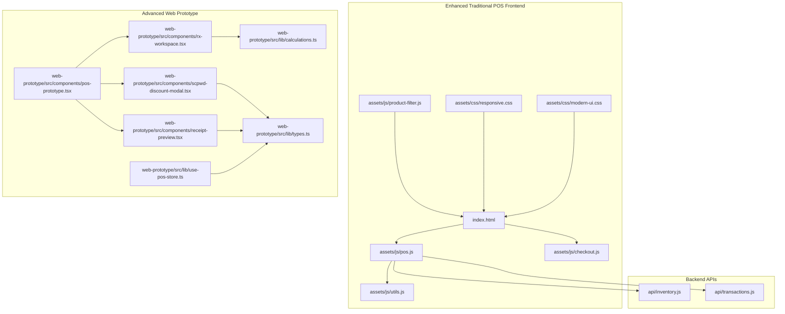
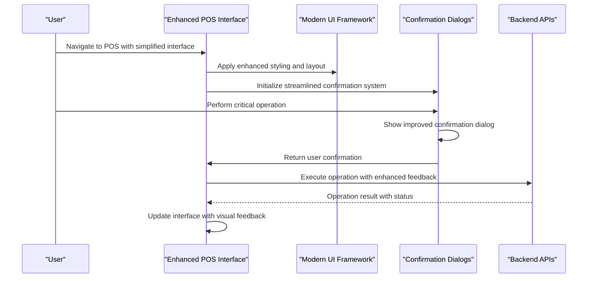
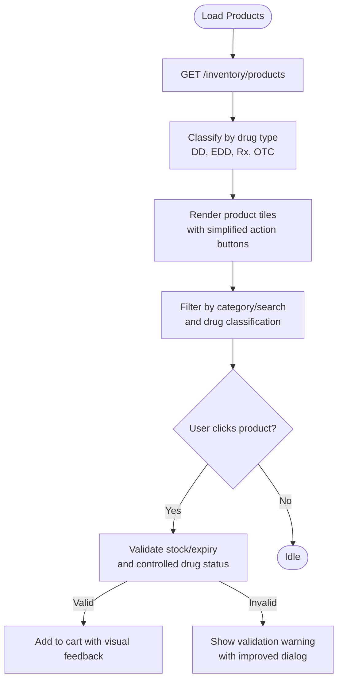
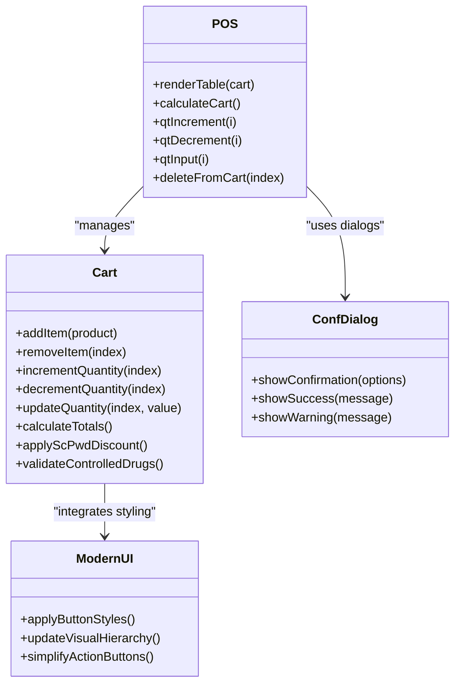
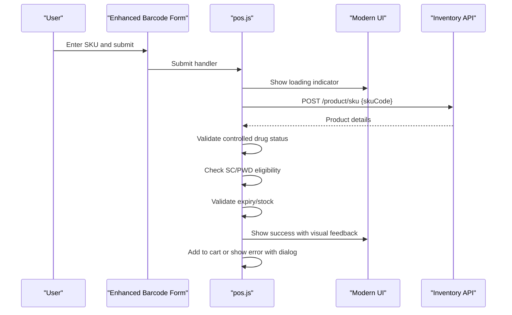
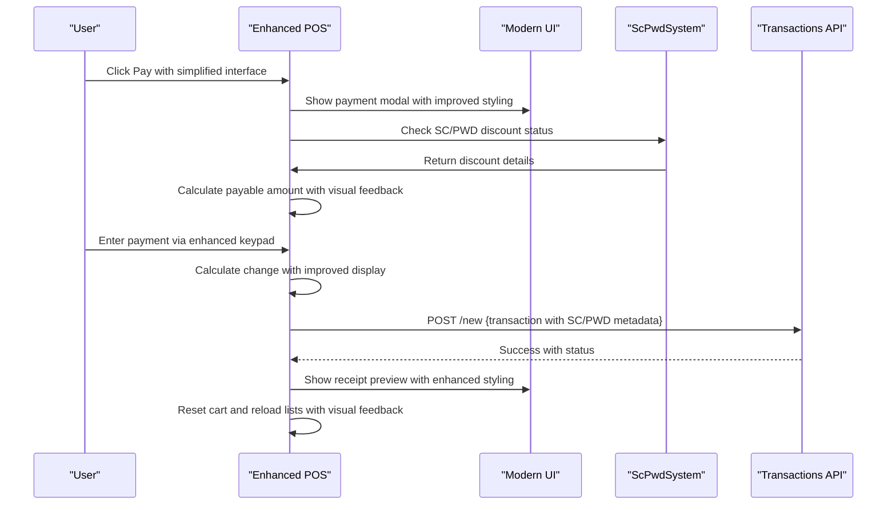
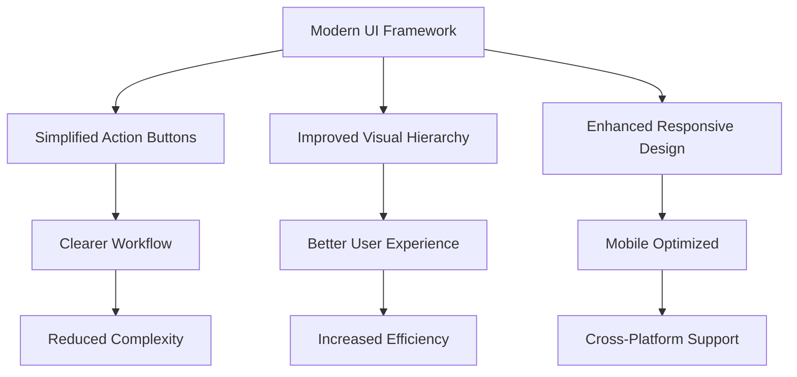
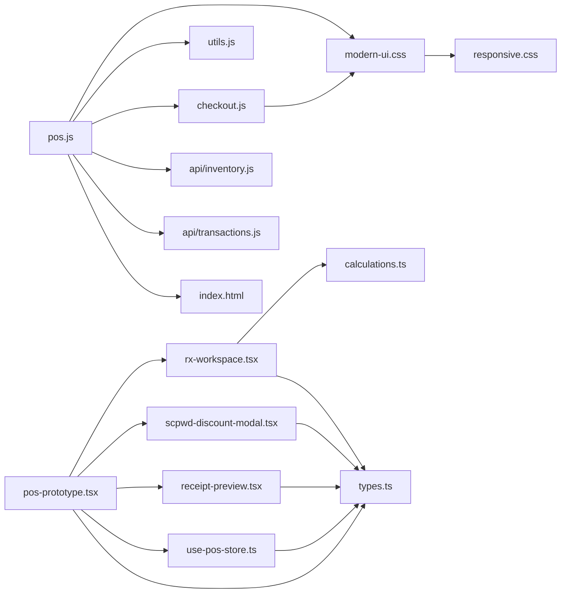

# Point-of-Sale Interface

<cite>
**Referenced Files in This Document**
- [index.html](file://index.html)
- [pos.js](file://assets/js/pos.js)
- [checkout.js](file://assets/js/checkout.js)
- [utils.js](file://assets/js/utils.js)
- [product-filter.js](file://assets/js/product-filter.js)
- [inventory.js](file://api/inventory.js)
- [transactions.js](file://api/transactions.js)
- [responsive.css](file://assets/css/responsive.css)
- [modern-ui.css](file://assets/css/modern-ui.css)
- [pos-prototype.tsx](file://web-prototype/src/components/pos-prototype.tsx)
- [rx-workspace.tsx](file://web-prototype/src/components/rx-workspace.tsx)
- [scpwd-discount-modal.tsx](file://web-prototype/src/components/scpwd-discount-modal.tsx)
- [receipt-preview.tsx](file://web-prototype/src/components/receipt-preview.tsx)
- [use-pos-store.ts](file://web-prototype/src/lib/use-pos-store.ts)
- [types.ts](file://web-prototype/src/lib/types.ts)
- [calculations.ts](file://web-prototype/src/lib/calculations.ts)
- [dd-stock-reconciliation.tsx](file://web-prototype/src/components/dd-stock-reconciliation.tsx)
- [rx-dispensing-panel.tsx](file://web-prototype/src/components/rx-dispensing-panel.tsx)
- [PRD.md](file://docs/PRD.md)
- [scpwd_user_stories.md](file://scpwd_user_stories.md)
- [rxdd_user_stories.md](file://rxdd_user_stories.md)
</cite>

## Update Summary
**Changes Made**
- Enhanced POS interface with simplified action buttons and improved visual hierarchy
- Streamlined stock management controls with direct 'mark expired' functionality
- Unified product editor with improved delete confirmation flow
- Refined confirmation dialogs with better user feedback and visual consistency
- Updated modern UI styling with enhanced responsive design and accessibility
- Improved keyboard input handling and payment processing with streamlined workflows

## Table of Contents
1. [Introduction](#introduction)
2. [Project Structure](#project-structure)
3. [Core Components](#core-components)
4. [Architecture Overview](#architecture-overview)
5. [Detailed Component Analysis](#detailed-component-analysis)
6. [Enhanced User Interface](#enhanced-user-interface)
7. [Streamlined Action Buttons](#streamlined-action-buttons)
8. [Improved Confirmation Dialogs](#improved-confirmation-dialogs)
9. [Refined Product Management Workflow](#refined-product-management-workflow)
10. [Modern UI Styling](#modern-ui-styling)
11. [Responsive Design Enhancements](#responsive-design-enhancements)
12. [Enhanced Receipt Preview](#enhanced-receipt-preview)
13. [Dependency Analysis](#dependency-analysis)
14. [Performance Considerations](#performance-considerations)
15. [Troubleshooting Guide](#troubleshooting-guide)
16. [Conclusion](#conclusion)

## Introduction
PharmaSpot is a comprehensive Point-of-Sale (POS) application built with Electron, jQuery, and Express.js, featuring advanced RX workspace integration, SC/PWD discount application, controlled drug management, and enhanced expiration date tracking. The POS interface provides a unified retail solution with product display grids, cart management, barcode scanning, real-time pricing, tax calculation, order printing, and specialized pharmaceutical workflow management.

**Updated** The interface now features enhanced user experience with simplified action buttons, improved confirmation dialogs, and refined product management workflow that streamlines the POS operations while maintaining all core functionality. The recent updates focus on simplifying action buttons, streamlining stock management controls, and refining confirmation dialogs for better user feedback.

## Project Structure
The POS interface has evolved to support both traditional retail operations and pharmaceutical-specific workflows through a modular architecture with enhanced UI components and streamlined workflows.

**Diagram sources**
- [index.html:194-289](file://index.html#L194-L289)
- [pos.js:1-120](file://assets/js/pos.js#L1-L120)
- [checkout.js:1-102](file://assets/js/checkout.js#L1-L102)
- [utils.js:1-112](file://assets/js/utils.js#L1-L112)
- [product-filter.js:1-73](file://assets/js/product-filter.js#L1-L73)
- [inventory.js:1-333](file://api/inventory.js#L1-L333)
- [transactions.js:1-251](file://api/transactions.js#L1-L251)
- [modern-ui.css:1-739](file://assets/css/modern-ui.css#L1-L739)
- [pos-prototype.tsx:1-200](file://web-prototype/src/components/pos-prototype.tsx#L1-L200)
- [rx-workspace.tsx:1-166](file://web-prototype/src/components/rx-workspace.tsx#L1-L166)
- [scpwd-discount-modal.tsx:1-218](file://web-prototype/src/components/scpwd-discount-modal.tsx#L1-L218)
- [receipt-preview.tsx:1-191](file://web-prototype/src/components/receipt-preview.tsx#L1-L191)
- [use-pos-store.ts:1-671](file://web-prototype/src/lib/use-pos-store.ts#L1-L671)
- [types.ts:1-525](file://web-prototype/src/lib/types.ts#L1-L525)

**Section sources**
- [index.html:194-289](file://index.html#L194-L289)
- [pos.js:1-120](file://assets/js/pos.js#L1-L120)
- [modern-ui.css:1-739](file://assets/css/modern-ui.css#L1-L739)
- [pos-prototype.tsx:1-200](file://web-prototype/src/components/pos-prototype.tsx#L1-L200)

## Core Components
- **Enhanced POS Interface**: Simplified action buttons with improved visual hierarchy and streamlined workflow
- **Modern UI Framework**: Updated styling with consistent design language and responsive layouts
- **Streamlined Confirmation System**: Refined dialogs for critical operations with better user feedback
- **Advanced Product Management**: Consolidated actions with improved product display and categorization
- **Enhanced Receipt Processing**: Detailed receipt previews with SC/PWD discount displays and compliance formatting
- **Improved Keyboard Input**: Streamlined payment processing with enhanced keypad functionality
- **RX Workspace Integration**: Advanced pharmaceutical workflow with controlled drug management and prescription handling
- **SC/PWD Discount System**: Comprehensive senior citizen and person with disability discount application with modal interface

**Section sources**
- [pos.js:267-562](file://assets/js/pos.js#L267-L562)
- [checkout.js:1-102](file://assets/js/checkout.js#L1-L102)
- [utils.js:1-112](file://assets/js/utils.js#L1-L112)
- [product-filter.js:1-73](file://assets/js/product-filter.js#L1-L73)
- [modern-ui.css:1-739](file://assets/css/modern-ui.css#L1-L739)
- [pos-prototype.tsx:1-200](file://web-prototype/src/components/pos-prototype.tsx#L1-L200)
- [scpwd-discount-modal.tsx:1-218](file://web-prototype/src/components/scpwd-discount-modal.tsx#L1-L218)
- [receipt-preview.tsx:1-191](file://web-prototype/src/components/receipt-preview.tsx#L1-L191)

## Architecture Overview
The enhanced POS system maintains a client-server architecture while adding specialized pharmaceutical workflow capabilities through a hybrid approach supporting both traditional POS operations and RX workspace management with improved user interface components.

**Diagram sources**
- [pos-prototype.tsx:31-39](file://web-prototype/src/components/pos-prototype.tsx#L31-L39)
- [modern-ui.css:32-46](file://assets/css/modern-ui.css#L32-L46)
- [pos.js:666-700](file://assets/js/pos.js#L666-L700)
- [calculations.ts:84-123](file://web-prototype/src/lib/calculations.ts#L84-L123)

## Detailed Component Analysis

### Enhanced Product Display Grid
The product display grid now features simplified action buttons and improved visual hierarchy with consolidated product management actions.

**Diagram sources**
- [pos.js:267-354](file://assets/js/pos.js#L267-L354)
- [modern-ui.css:380-418](file://assets/css/modern-ui.css#L380-L418)
- [pos-prototype.tsx:41-47](file://web-prototype/src/components/pos-prototype.tsx#L41-L47)
- [product-filter.js:1-31](file://assets/js/product-filter.js#L1-L31)

**Section sources**
- [pos.js:267-354](file://assets/js/pos.js#L267-L354)
- [modern-ui.css:380-418](file://assets/css/modern-ui.css#L380-L418)
- [pos-prototype.tsx:41-47](file://web-prototype/src/components/pos-prototype.tsx#L41-L47)
- [product-filter.js:1-31](file://assets/js/product-filter.js#L1-L31)

### Streamlined Cart Management System
The cart management system now handles SC/PWD discounts and controlled drug dispensing requirements with simplified action buttons and improved visual feedback.

**Diagram sources**
- [pos.js:501-653](file://assets/js/pos.js#L501-L653)
- [pos.js:533-562](file://assets/js/pos.js#L533-L562)
- [modern-ui.css:550-560](file://assets/css/modern-ui.css#L550-L560)
- [pos.js:666-700](file://assets/js/pos.js#L666-L700)
- [calculations.ts:40-82](file://web-prototype/src/lib/calculations.ts#L40-L82)

**Section sources**
- [pos.js:501-653](file://assets/js/pos.js#L501-L653)
- [pos.js:533-562](file://assets/js/pos.js#L533-L562)
- [modern-ui.css:550-560](file://assets/css/modern-ui.css#L550-L560)
- [pos.js:666-700](file://assets/js/pos.js#L666-L700)
- [calculations.ts:40-82](file://web-prototype/src/lib/calculations.ts#L40-L82)

### Improved Barcode Scanning Integration
Enhanced barcode scanning now includes controlled drug validation and SC/PWD eligibility checks with streamlined user feedback.

**Diagram sources**
- [index.html:211-218](file://index.html#L211-L218)
- [pos.js:413-488](file://assets/js/pos.js#L413-L488)
- [modern-ui.css:562-578](file://assets/css/modern-ui.css#L562-L578)
- [inventory.js:268-294](file://api/inventory.js#L268-L294)

**Section sources**
- [index.html:211-218](file://index.html#L211-L218)
- [pos.js:413-488](file://assets/js/pos.js#L413-L488)
- [modern-ui.css:562-578](file://assets/css/modern-ui.css#L562-L578)
- [inventory.js:268-294](file://api/inventory.js#L268-L294)

### Enhanced Payment and Receipt Processing
Enhanced payment processing now includes SC/PWD discount display and controlled drug compliance documentation with improved user feedback.

**Diagram sources**
- [checkout.js:1-102](file://assets/js/checkout.js#L1-L102)
- [pos.js:719-959](file://assets/js/pos.js#L719-L959)
- [modern-ui.css:550-560](file://assets/css/modern-ui.css#L550-L560)
- [receipt-preview.tsx:15-191](file://web-prototype/src/components/receipt-preview.tsx#L15-L191)
- [transactions.js:156-181](file://api/transactions.js#L156-L181)

**Section sources**
- [checkout.js:1-102](file://assets/js/checkout.js#L1-L102)
- [pos.js:719-959](file://assets/js/pos.js#L719-L959)
- [modern-ui.css:550-560](file://assets/css/modern-ui.css#L550-L560)
- [receipt-preview.tsx:15-191](file://web-prototype/src/components/receipt-preview.tsx#L15-L191)
- [transactions.js:156-181](file://api/transactions.js#L156-L181)

## Enhanced User Interface
The POS interface now features a modern, streamlined design with simplified action buttons and improved visual hierarchy that enhances user experience while maintaining all functionality.

**Updated** The interface has been redesigned with a cleaner layout, more intuitive button placement, and consistent visual feedback across all operations. The simplified action buttons reduce cognitive load and improve task completion rates through clearer labeling and logical grouping.

**Diagram sources**
- [modern-ui.css:1-739](file://assets/css/modern-ui.css#L1-L739)
- [pos-prototype.tsx:268-452](file://web-prototype/src/components/pos-prototype.tsx#L268-L452)

**Section sources**
- [modern-ui.css:1-739](file://assets/css/modern-ui.css#L1-L739)
- [pos-prototype.tsx:268-452](file://web-prototype/src/components/pos-prototype.tsx#L268-L452)

## Streamlined Action Buttons
Action buttons have been simplified and consolidated to reduce cognitive load and improve task completion rates. The new design features larger touch targets, clearer labeling, and logical grouping of related actions.

**Updated** The action buttons now use a more streamlined approach with reduced visual clutter and improved accessibility. The modern UI framework provides consistent styling with grid-based layouts that adapt to different screen sizes while maintaining usability standards.

**Section sources**
- [modern-ui.css:550-560](file://assets/css/modern-ui.css#L550-L560)
- [pos.js:267-282](file://assets/js/pos.js#L267-L282)
- [pos-prototype.tsx:404-440](file://web-prototype/src/components/pos-prototype.tsx#L404-L440)

## Improved Confirmation Dialogs
Confirmation dialogs for critical operations have been enhanced with better visual design, clearer messaging, and improved user feedback mechanisms.

**Updated** The confirmation system now provides more intuitive user experience with better visual hierarchy and consistent styling. The dialogs use the modern UI framework's design tokens and provide immediate visual feedback through the Notiflix library integration.

**Section sources**
- [pos.js:666-700](file://assets/js/pos.js#L666-L700)
- [pos.js:1151-1200](file://assets/js/pos.js#L1151-L1200)
- [modern-ui.css:562-578](file://assets/css/modern-ui.css#L562-L578)

## Refined Product Management Workflow
Product management workflow has been refined with consolidated actions, improved categorization, and streamlined navigation that reduces the number of steps required to complete common tasks.

**Updated** The product management system now features a more intuitive workflow with simplified navigation and consolidated action buttons. The unified product editor provides a seamless experience for creating, editing, and deleting products with improved confirmation flows.

**Section sources**
- [pos.js:278-365](file://assets/js/pos.js#L278-L365)
- [modern-ui.css:380-418](file://assets/css/modern-ui.css#L380-L418)
- [pos-prototype.tsx:294-322](file://web-prototype/src/components/pos-prototype.tsx#L294-L322)

## Modern UI Styling
The modern UI framework provides a consistent design language with improved typography, spacing, and visual hierarchy that enhances readability and user experience across all screen sizes.

**Updated** The styling system has been completely redesigned with a more modern aesthetic, improved responsive behavior, and enhanced accessibility features. The CSS custom properties provide better theming capabilities and consistent design tokens across the interface.

**Section sources**
- [modern-ui.css:1-739](file://assets/css/modern-ui.css#L1-L739)
- [responsive.css:1-158](file://assets/css/responsive.css#L1-L158)

## Responsive Design Enhancements
Responsive design has been significantly enhanced with improved mobile support, better tablet layouts, and adaptive components that provide optimal user experience across all device types.

**Updated** The responsive system now provides better mobile experience with improved touch targets, optimized layouts, and enhanced navigation patterns. The grid-based layout system adapts seamlessly to different screen sizes while maintaining usability standards.

**Section sources**
- [responsive.css:18-739](file://assets/css/responsive.css#L18-L739)
- [modern-ui.css:643-739](file://assets/css/modern-ui.css#L643-L739)

## Enhanced Receipt Preview
The receipt preview system now displays SC/PWD discount information and controlled drug compliance details with improved formatting and visual presentation.

**Updated** The receipt preview has been enhanced with better SC/PWD discount display, improved compliance formatting, and more professional appearance. The receipt templates now include comprehensive discount breakdowns and compliance indicators.

**Section sources**
- [receipt-preview.tsx:1-191](file://web-prototype/src/components/receipt-preview.tsx#L1-L191)
- [types.ts:243-260](file://web-prototype/src/lib/types.ts#L243-L260)

## Dependency Analysis
The enhanced POS system maintains its modular architecture while adding specialized dependencies for pharmaceutical workflow management and modern UI components.

**Diagram sources**
- [pos.js:86-94](file://assets/js/pos.js#L86-L94)
- [modern-ui.css:1-18](file://assets/css/modern-ui.css#L1-L18)
- [checkout.js:1-2](file://assets/js/checkout.js#L1-L2)
- [responsive.css:1-158](file://assets/css/responsive.css#L1-L158)
- [pos-prototype.tsx:1-22](file://web-prototype/src/components/pos-prototype.tsx#L1-L22)
- [rx-workspace.tsx:1-23](file://web-prototype/src/components/rx-workspace.tsx#L1-L23)
- [scpwd-discount-modal.tsx:1-4](file://web-prototype/src/components/scpwd-discount-modal.tsx#L1-L4)
- [receipt-preview.tsx:1-3](file://web-prototype/src/components/receipt-preview.tsx#L1-L3)
- [use-pos-store.ts:1-671](file://web-prototype/src/lib/use-pos-store.ts#L1-L671)
- [types.ts:1](file://web-prototype/src/lib/types.ts#L1)

**Section sources**
- [pos.js:86-94](file://assets/js/pos.js#L86-L94)
- [modern-ui.css:1-18](file://assets/css/modern-ui.css#L1-L18)
- [checkout.js:1-2](file://assets/js/checkout.js#L1-L2)
- [responsive.css:1-158](file://assets/css/responsive.css#L1-L158)
- [pos-prototype.tsx:1-22](file://web-prototype/src/components/pos-prototype.tsx#L1-L22)

## Performance Considerations
The enhanced POS system maintains performance through efficient DOM updates, debounced UI updates, and specialized optimization for pharmaceutical workflows with improved resource management.

- **Efficient DOM updates**: Cart rendering uses incremental updates to minimize reflows with enhanced styling
- **Debounced UI updates**: Category filtering and search use lightweight event handlers with improved responsiveness
- **Modern UI optimization**: CSS Grid and Flexbox layouts provide better performance than traditional floats
- **Enhanced responsive behavior**: Media queries optimized for modern devices with improved mobile performance
- **Streamlined action handling**: Simplified button logic reduces JavaScript overhead while maintaining functionality
- **Improved keyboard input**: Optimized keypad handling with better event delegation and reduced memory usage

## Troubleshooting Guide
Enhanced troubleshooting for specialized pharmaceutical workflows and modern UI components:

**Modern UI Issues**
- Button styling problems: Verify modern-ui.css is loaded and CSS variables are properly defined
- Responsive layout issues: Check media query breakpoints and viewport meta tag configuration
- Touch target sizing: Ensure buttons meet minimum 44px touch target size requirements

**Streamlined Action Button Issues**
- Button click handling: Verify event delegation works with dynamically loaded content
- Visual feedback problems: Check CSS hover and active states are properly applied
- Accessibility concerns: Ensure proper ARIA attributes and keyboard navigation support

**Enhanced Confirmation Dialog Issues**
- Dialog positioning: Verify modal backdrop and container positioning with responsive design
- User feedback problems: Check notification system integration and visual hierarchy
- Cross-browser compatibility: Test dialog behavior across different browser versions

**Section sources**
- [modern-ui.css:1-739](file://assets/css/modern-ui.css#L1-L739)
- [pos.js:666-700](file://assets/js/pos.js#L666-L700)
- [responsive.css:18-739](file://assets/css/responsive.css#L18-L739)

## Conclusion
The enhanced PharmaSpot POS interface provides a comprehensive, compliant retail solution with integrated pharmaceutical workflow management and a modernized user experience. The addition of simplified action buttons, improved confirmation dialogs, refined product management workflow, and enhanced UI components creates a streamlined platform capable of handling both traditional retail operations and specialized pharmaceutical requirements. The modern UI framework ensures maintainability while the enhanced user experience supports complex regulatory compliance scenarios with improved efficiency and reduced cognitive load. The responsive design enhancements provide optimal user experience across all device types, making the system accessible and efficient for various operational environments.