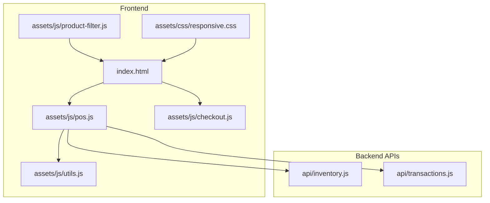
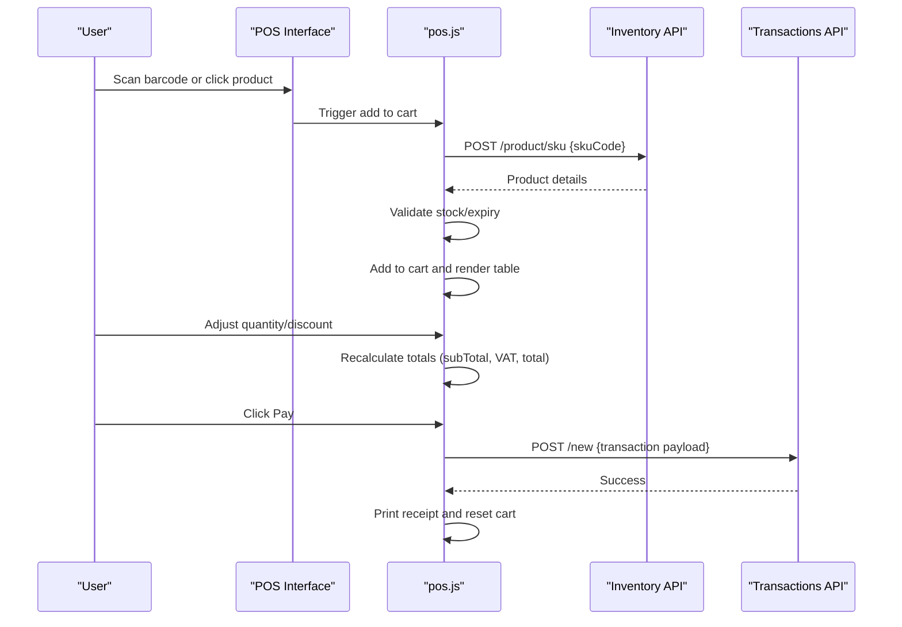
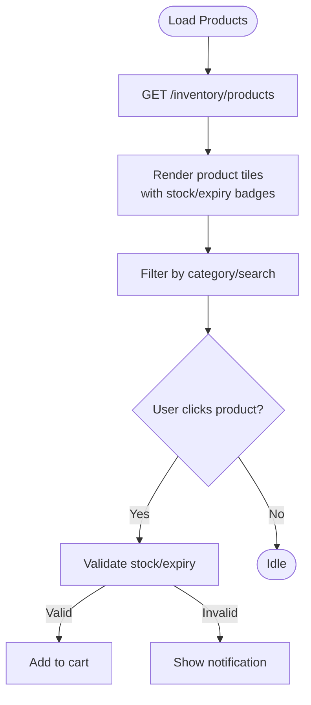
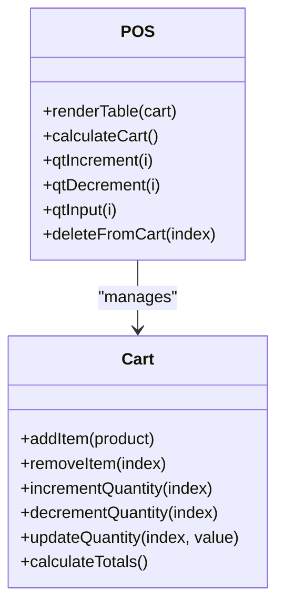
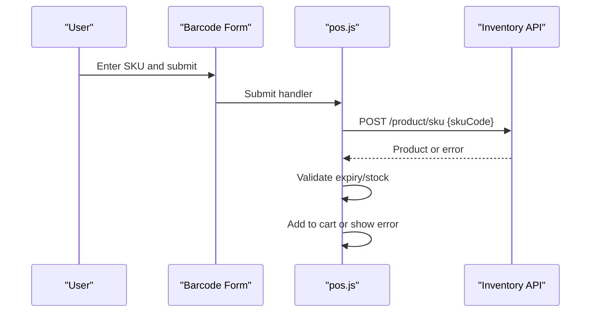
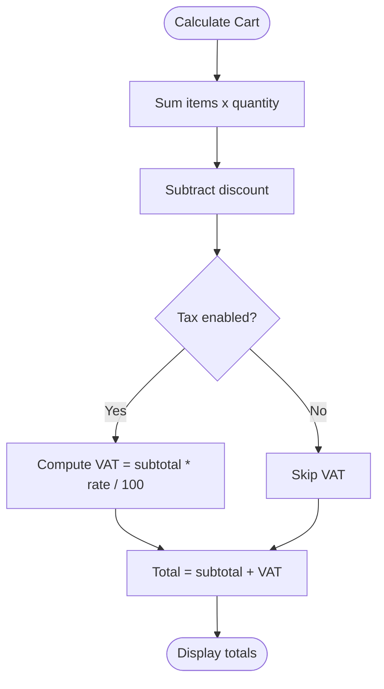
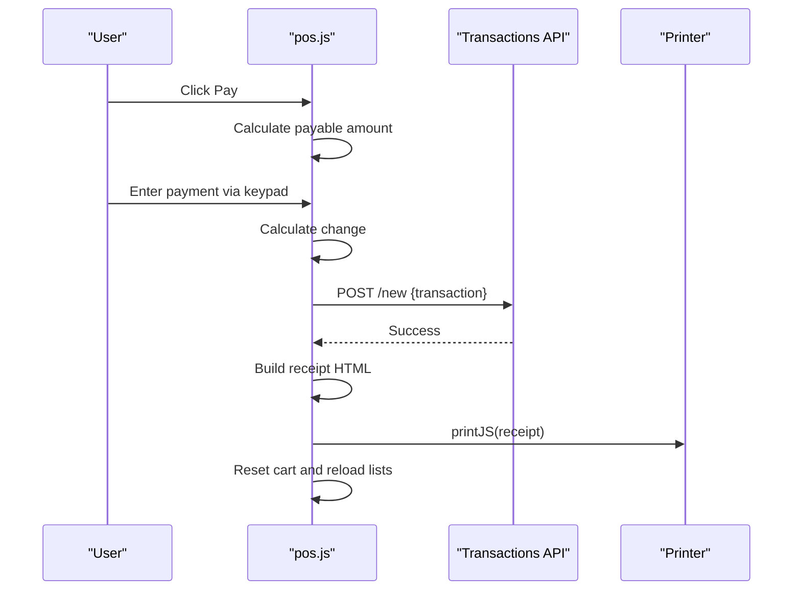
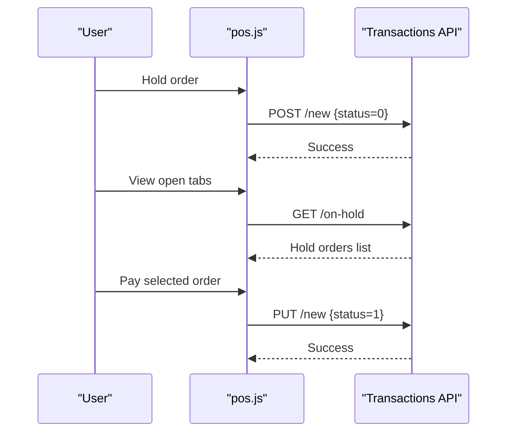
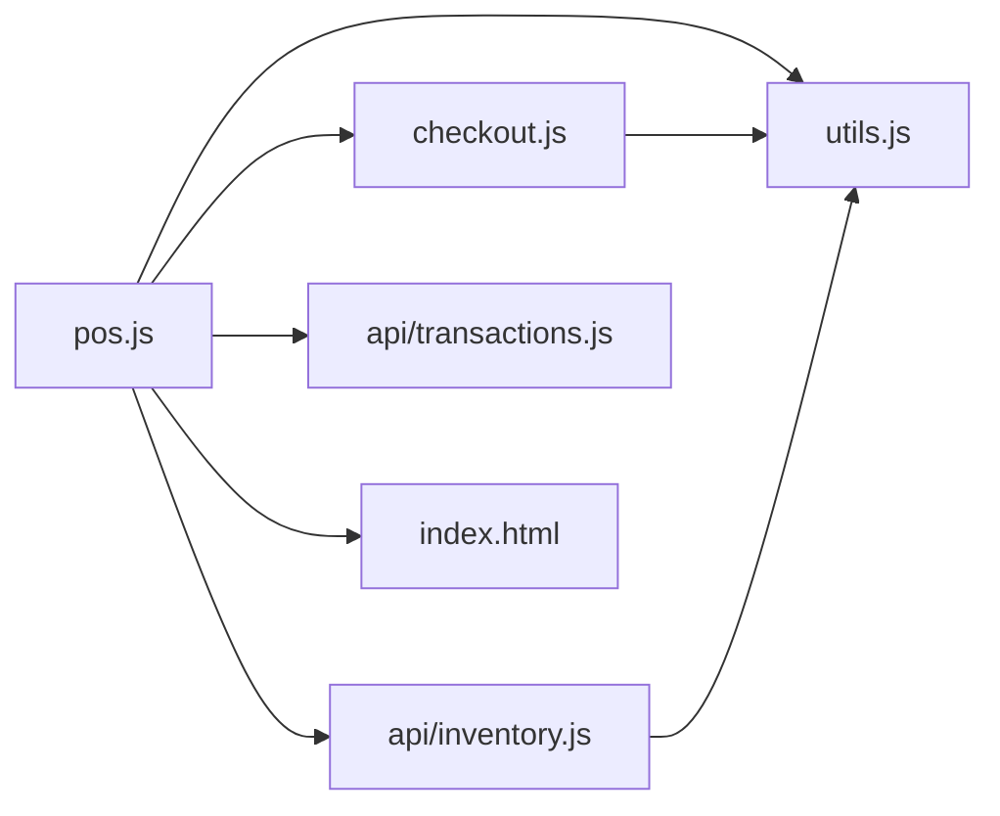

# Point-of-Sale Interface

<cite>
**Referenced Files in This Document**
- [index.html](file://index.html)
- [pos.js](file://assets/js/pos.js)
- [checkout.js](file://assets/js/checkout.js)
- [utils.js](file://assets/js/utils.js)
- [product-filter.js](file://assets/js/product-filter.js)
- [inventory.js](file://api/inventory.js)
- [transactions.js](file://api/transactions.js)
- [responsive.css](file://assets/css/responsive.css)
</cite>

## Table of Contents
1. [Introduction](#introduction)
2. [Project Structure](#project-structure)
3. [Core Components](#core-components)
4. [Architecture Overview](#architecture-overview)
5. [Detailed Component Analysis](#detailed-component-analysis)
6. [Dependency Analysis](#dependency-analysis)
7. [Performance Considerations](#performance-considerations)
8. [Troubleshooting Guide](#troubleshooting-guide)
9. [Conclusion](#conclusion)

## Introduction
PharmaSpot is a desktop-based Point-of-Sale (POS) application built with Electron, jQuery, and Express.js. The POS interface provides a comprehensive retail solution with product display grids, cart management, barcode scanning, real-time pricing, tax calculation, and order printing. This document explains the POS workflow, integration patterns, and customization options.

## Project Structure
The POS interface is organized around a main HTML shell with modular JavaScript components and API endpoints for inventory and transactions.

**Diagram sources**
- [index.html:194-289](file://index.html#L194-L289)
- [pos.js:1-120](file://assets/js/pos.js#L1-L120)
- [checkout.js:1-102](file://assets/js/checkout.js#L1-L102)
- [utils.js:1-112](file://assets/js/utils.js#L1-L112)
- [product-filter.js:1-73](file://assets/js/product-filter.js#L1-L73)
- [inventory.js:1-333](file://api/inventory.js#L1-L333)
- [transactions.js:1-251](file://api/transactions.js#L1-L251)

**Section sources**
- [index.html:194-289](file://index.html#L194-L289)
- [pos.js:1-120](file://assets/js/pos.js#L1-L120)

## Core Components
- POS Interface Shell: Defines the layout, modals, and interactive elements for product display, cart, payment, and order management.
- POS Logic: Handles product grid rendering, cart operations, quantity adjustments, discount application, tax calculation, and order submission.
- Checkout Keyboard: Manages payment input via on-screen keypad and calculates change.
- Utility Functions: Provides formatting, validation, stock status checks, and security policies.
- Product Filtering: Enables category filtering and product search within the grid.
- Backend APIs: Inventory and transaction endpoints for product lookup, SKU validation, and order persistence.

**Section sources**
- [index.html:194-289](file://index.html#L194-L289)
- [pos.js:267-562](file://assets/js/pos.js#L267-L562)
- [checkout.js:1-102](file://assets/js/checkout.js#L1-L102)
- [utils.js:1-112](file://assets/js/utils.js#L1-L112)
- [product-filter.js:1-73](file://assets/js/product-filter.js#L1-L73)
- [inventory.js:268-294](file://api/inventory.js#L268-L294)
- [transactions.js:156-181](file://api/transactions.js#L156-L181)

## Architecture Overview
The POS system follows a client-server architecture with Electron hosting the frontend and Express.js APIs managing inventory and transactions.

**Diagram sources**
- [pos.js:413-488](file://assets/js/pos.js#L413-L488)
- [pos.js:533-562](file://assets/js/pos.js#L533-L562)
- [pos.js:719-959](file://assets/js/pos.js#L719-L959)
- [inventory.js:268-294](file://api/inventory.js#L268-L294)
- [transactions.js:156-181](file://api/transactions.js#L156-L181)

## Detailed Component Analysis

### Product Display Grid
- Renders product tiles with name, SKU, stock status, and price.
- Supports category filtering and text search.
- Clicking a tile adds the product to the cart after stock and expiry validation.

**Diagram sources**
- [pos.js:267-354](file://assets/js/pos.js#L267-L354)
- [product-filter.js:1-31](file://assets/js/product-filter.js#L1-L31)

**Section sources**
- [pos.js:267-354](file://assets/js/pos.js#L267-L354)
- [product-filter.js:1-31](file://assets/js/product-filter.js#L1-L31)

### Cart Management System
- Dynamic cart table with quantity controls and item removal.
- Real-time recalculation of subTotal, discount, VAT, and total.
- Validation prevents adding out-of-stock or expired items.

**Diagram sources**
- [pos.js:501-653](file://assets/js/pos.js#L501-L653)
- [pos.js:533-562](file://assets/js/pos.js#L533-L562)

**Section sources**
- [pos.js:501-653](file://assets/js/pos.js#L501-L653)
- [pos.js:533-562](file://assets/js/pos.js#L533-L562)

### Barcode Scanning Integration
- Barcode input form triggers SKU lookup via POST /inventory/product/sku.
- Validates product availability, expiry, and stock before adding to cart.
- Provides user feedback for invalid barcodes, out-of-stock, and expired items.

**Diagram sources**
- [index.html:211-218](file://index.html#L211-L218)
- [pos.js:413-488](file://assets/js/pos.js#L413-L488)
- [inventory.js:268-294](file://api/inventory.js#L268-L294)

**Section sources**
- [index.html:211-218](file://index.html#L211-L218)
- [pos.js:413-488](file://assets/js/pos.js#L413-L488)
- [inventory.js:268-294](file://api/inventory.js#L268-L294)

### Discount and Tax Calculation
- Discount is subtracted from subTotal before tax calculation.
- VAT computed as percentage of subTotal when enabled in settings.
- Final total reflects discount and VAT.

**Diagram sources**
- [pos.js:533-562](file://assets/js/pos.js#L533-L562)

**Section sources**
- [pos.js:533-562](file://assets/js/pos.js#L533-L562)

### Payment and Receipt Printing
- Payment modal with on-screen keypad for cash/Card entry.
- Change calculation and confirmation flow.
- Receipt generation with company details, items, totals, and payment info.
- Printing via printJS with sanitized HTML.

**Diagram sources**
- [checkout.js:1-102](file://assets/js/checkout.js#L1-L102)
- [pos.js:719-959](file://assets/js/pos.js#L719-L959)
- [transactions.js:156-181](file://api/transactions.js#L156-L181)

**Section sources**
- [checkout.js:1-102](file://assets/js/checkout.js#L1-L102)
- [pos.js:719-959](file://assets/js/pos.js#L719-L959)
- [transactions.js:156-181](file://api/transactions.js#L156-L181)

### Order Hold and Retrieval
- Hold orders with reference numbers and customer association.
- Retrieve and pay held orders or delete them.
- Customer orders can be viewed and managed separately.

**Diagram sources**
- [pos.js:961-1032](file://assets/js/pos.js#L961-L1032)
- [pos.js:1046-1138](file://assets/js/pos.js#L1046-L1138)
- [transactions.js:52-82](file://api/transactions.js#L52-L82)

**Section sources**
- [pos.js:961-1032](file://assets/js/pos.js#L961-L1032)
- [pos.js:1046-1138](file://assets/js/pos.js#L1046-L1138)
- [transactions.js:52-82](file://api/transactions.js#L52-L82)

### Notifications and Error Handling
- Uses Notiflix for user feedback on actions, warnings, errors, and confirmations.
- Error handling for barcode validation, server errors, and payment issues.

**Section sources**
- [pos.js:288-305](file://assets/js/pos.js#L288-L305)
- [pos.js:468-487](file://assets/js/pos.js#L468-L487)
- [pos.js:945-954](file://assets/js/pos.js#L945-L954)

## Dependency Analysis
- POS depends on jQuery for DOM manipulation and AJAX requests.
- Uses external libraries for printing, barcode generation, and notifications.
- Backend APIs manage inventory and transaction persistence with NeDB.

**Diagram sources**
- [pos.js:86-94](file://assets/js/pos.js#L86-L94)
- [checkout.js:1-2](file://assets/js/checkout.js#L1-L2)
- [inventory.js:1-44](file://api/inventory.js#L1-L44)
- [transactions.js:1-24](file://api/transactions.js#L1-L24)

**Section sources**
- [pos.js:86-94](file://assets/js/pos.js#L86-L94)
- [checkout.js:1-2](file://assets/js/checkout.js#L1-L2)
- [inventory.js:1-44](file://api/inventory.js#L1-L44)
- [transactions.js:1-24](file://api/transactions.js#L1-L24)

## Performance Considerations
- Efficient DOM updates: Cart rendering uses incremental updates to minimize reflows.
- Debounced UI updates: Category filtering and search use lightweight event handlers.
- Local storage caching: Authentication and settings cached to reduce network calls.
- Image handling: Default fallback images prevent broken image rendering delays.

## Troubleshooting Guide
Common issues and resolutions:
- Barcode not recognized: Verify SKU exists in inventory and is not expired/out-of-stock.
- Payment amount mismatch: Ensure keypad input matches item total; check decimal separator.
- Expired product warning: Restock or replace expired items in inventory.
- Hold order errors: Confirm customer selection or reference number before holding.
- Printing failures: Check printer connectivity and permissions; retry print operation.

**Section sources**
- [pos.js:442-466](file://assets/js/pos.js#L442-L466)
- [pos.js:1312-1325](file://assets/js/pos.js#L1312-L1325)
- [pos.js:1163-1191](file://assets/js/pos.js#L1163-L1191)

## Conclusion
The PharmaSpot POS interface provides a robust, user-friendly retail solution with integrated product management, cart operations, payment processing, and reporting. Its modular design and clear separation of concerns enable easy maintenance and extension for future enhancements.